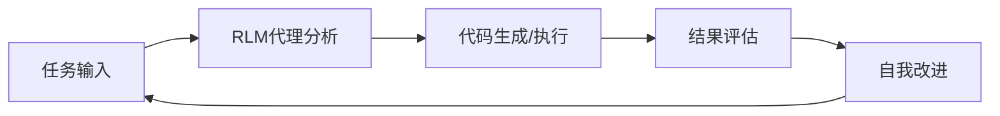
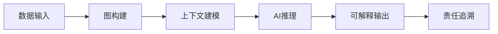
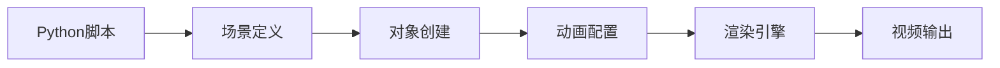
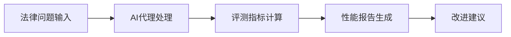
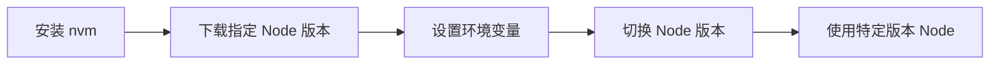

## 今日热点

AI Agent生态爆发式增长，专业化技能框架与多智能体协作成为焦点，RAG技术在垂直领域应用持续深化。

---

## 热门项目一览

| 排名 | 项目 | 语言 | 今日 | 总计 | 简介 |
|:---:|------|:----:|------:|-----:|------|
| 1 | [PrimeIntellect-ai/prime-agent](https://github.com/PrimeIntellect-ai/prime-agent) | TypeScript | +1,138 | 14,111 | A self-improving RLM agent ... |
| 2 | [msitarzewski/agency-agents](https://github.com/msitarzewski/agency-agents) | Shell | +958 | 143,246 | A complete AI agency at you... |
| 3 | [semantica-agi/semantica](https://github.com/semantica-agi/semantica) | Python | +893 | 4,894 | Graph-Native Infrastructure... |
| 4 | [stablyai/orca](https://github.com/stablyai/orca) | TypeScript | +875 | 42,791 | Orca is the ADE for working... |
| 5 | [HKUDS/DeepTutor](https://github.com/HKUDS/DeepTutor) | Python | +812 | 34,723 | DeepTutor: Lifelong Persona... |
| 6 | [paperclipai/paperclip](https://github.com/paperclipai/paperclip) | TypeScript | +748 | 77,170 | The open-source app everyon... |
| 7 | [addyosmani/agent-skills](https://github.com/addyosmani/agent-skills) | JavaScript | +578 | 86,224 | Production-grade engineerin... |
| 8 | [anthropics/skills](https://github.com/anthropics/skills) | Python | +485 | 168,133 | Public repository for Agent... |
| 9 | [calesthio/OpenMontage](https://github.com/calesthio/OpenMontage) | Python | +458 | 47,345 | World's first open-source, ... |
| 10 | [practical-tutorials/project-based-learning](https://github.com/practical-tutorials/project-based-learning) | Python | +401 | 278,449 | Curated list of project-bas... |
| 11 | [vitali87/code-graph-rag](https://github.com/vitali87/code-graph-rag) | Python | +341 | 3,819 | The ultimate RAG for your m... |
| 12 | [jaywcjlove/awesome-mac](https://github.com/jaywcjlove/awesome-mac) | Swift | +298 | 110,476 |  This project is dedicated... |

---

## 趋势洞察

```
┌─────────────────────────────────────────────────────────────────┐
│  AI/ML 工具         ████████████████████████  12 个项目        │
│  项目管理             ████                      2 个项目        │
│  其他               ████                      2 个项目        │
│  多媒体应用            ██                        1 个项目        │
└─────────────────────────────────────────────────────────────────┘
```

---

## 项目深度解读

### 1. PrimeIntellect-ai/prime-agent — 自主编程代理

> **一句话总结**：一个能够自我改进的RLM代理，专为编程工作流和长期自主任务设计。

#### 价值主张

| 维度 | 说明 |
|------|------|
| **解决痛点** | 解决复杂编程任务自动化和长期自主工作流管理难题 |
| **目标用户** | 开发者、自动化工程师和需要AI辅助编程的专业人员 |
| **核心亮点** | 自我学习能力 + 长期任务执行 + 编程工作流优化 + 自主决策 + 持续改进 |

#### 技术架构



**技术特色**：
- 基于RLM的智能代理系统，实现自主决策
- 自我学习与改进机制，持续优化性能
- 长期任务管理能力，支持复杂工作流

#### 热度分析

- 项目Star数一日激增1138，表明社区高度关注和认可
- 作为AI编程助手领域的新兴项目，具有强劲的发展势头和生态潜力

#### 快速上手

```bash
# 克隆仓库
git clone https://github.com/PrimeIntellect-ai/prime-agent.git
cd prime-agent

# 安装依赖并运行
npm install
npm start
```

#### 注意事项

- 项目许可证未知，商业使用前需确认授权方式
- 作为新兴项目，API和功能可能存在不稳定情况
- 需要适当配置环境才能充分发挥其自主代理能力


### 2. msitarzewski/agency-agents — AI代理集合

> **一句话总结**：提供多种专业AI代理，每个都有独特个性和专长，可一站式完成各类任务。

#### 价值主张

| 维度 | 说明 |
|------|------|
| **解决痛点** | 简化复杂任务执行，无需寻找多个专业人才 |
| **目标用户** | 需要高效完成多样化任务的个人和小型团队 |
| **核心亮点** | 多样化专业角色 + 个性化交互 + 即插即用流程 + 可交付成果保证 |

#### 技术架构


**技术特色**：
- 基于Shell脚本实现，跨平台兼容性强
- 模块化设计，每个代理独立且可组合
- 简单命令行交互，降低使用门槛
- 轻量级实现，无需复杂依赖

#### 热度分析

- 项目获得超14万星，日增近千星，表明需求旺盛且用户认可度高
- Fork数约2.3万，表明社区积极参与和二次开发活跃
- 无开放问题，可能表明项目成熟度高或问题处理机制完善

#### 快速上手

```bash
# 假设的命令示例
./agency-agents --list-agents  # 列出所有可用代理
./agency-agents --agent frontend-wizard --task "创建响应式网站"
```

#### 注意事项

- 由于许可证未知，商业使用前需确认授权情况
- Shell脚本实现可能在复杂任务上有所限制
- 每个代理的专业程度可能有限，复杂任务可能仍需人类专家参与


### 3. semantica-agi/semantica — 可问责AI图基建

> **一句话总结**：构建基于图结构的可解释AI系统，支持上下文建模与决策责任追溯。

#### 价值主张

| 维度 | 说明 |
|------|------|
| **解决痛点** | 解决AI系统黑盒问题，提供可解释性和上下文理解能力 |
| **目标用户** | AI研究人员、开发者和需要可解释AI的组织 |
| **核心亮点** | 图原生架构 + 上下文建模 + 责任追溯机制 + 可解释性保证 + 模块化设计 |

#### 技术架构



**技术特色**：
- 基于图结构的原生设计，增强上下文理解能力
- 内置可解释性机制，使AI决策透明化
- 责任追踪系统，记录AI决策的完整路径

#### 热度分析

- 项目近期获得大量关注，单日新增近900颗星，显示AI可解释性领域热度高涨
- 高Fork/Star比例表明项目处于活跃开发阶段，社区参与度较高

#### 快速上手

```bash
# 克隆项目
git clone https://github.com/semantica-agi/semantica.git

# 安装依赖
pip install -r requirements.txt

# 运行示例
python examples/basic_usage.py
```

#### 注意事项

- 项目License未知，商业使用前需确认授权条款
- 项目文档可能不够完善，需要参考源码了解API使用
- 作为新兴项目，API可能不稳定，生产环境使用前需充分测试


### 4. stablyai/orca — 并行代理开发平台

> **一句话总结**：Orca是支持多平台的高级开发环境，专为管理和运行并行编码代理而设计。

#### 价值主张

| 维度 | 说明 |
|------|------|
| **解决痛点** | 简化多代理开发环境的管理与部署，提升协作效率 |
| **目标用户** | 开发团队、AI研究人员、需要并行处理任务的开发者 |
| **核心亮点** | 支持多平台部署 + 自定义订阅管理 + 并行代理调度 + 企业级安全 + 无缝集成现有工具 |

#### 技术架构


**技术特色**：
- TypeScript全栈实现，确保跨平台兼容性
- 智能代理调度算法，优化资源分配
- 安全的订阅管理机制，保护用户数据和API密钥
- 支持桌面、移动和VPS的统一架构
- 模块化设计，便于扩展和定制

#### 热度分析

- Star数持续高增长(+875/天)，显示社区对多代理开发环境的高度关注
- 高Fork比例(7%)表明项目具有高度可定制性和扩展性，适合二次开发
- 零Open Issues可能表明项目维护良好或社区主要通过其他渠道交流

#### 快速上手

```bash
# 安装Orca CLI
npm install -g @stablyai/orca

# 初始化项目
orca init my-agent-project

# 启动代理服务
orca start

# 部署到VPS
orca deploy --target vps
```

#### 注意事项

- 项目许可证未知，商业使用前需确认授权条款
- 需要有效的AI服务订阅才能运行编码代理
- 跨平台功能可能存在兼容性问题，建议在目标环境充分测试
- 项目描述相对简略，建议查阅详细文档了解完整功能


### 5. HKUDS/DeepTutor — 个性化教育AI系统

> **一句话总结**：基于深度学习的终身个性化教育系统，通过智能算法实现自适应教学路径。

#### 价值主张

| 维度 | 说明 |
|------|------|
| **解决痛点** | 标准化教育与个性化学习需求间的矛盾，缺乏长期适应性教学系统 |
| **目标用户** | 需要个性化学习体验的学生、教育工作者及教育研究机构 |
| **核心亮点** | 深度学习驱动 + 自适应教学路径 + 多模态交互 + 终身学习支持 + 知识状态追踪 |

#### 技术架构


**技术特色**：
- 基于深度学习的知识状态动态评估模型
- 自适应学习路径生成与优化算法
- 多模态教学内容生成与个性化推荐系统

#### 热度分析

- 项目Star数达34,723，每日新增812个，表明近期热度大幅上升
- 作为教育AI领域领先项目，在教育科技社区中具有显著影响力

#### 快速上手

```bash
# 克隆项目
git clone https://github.com/HKUDS/DeepTutor.git
# 安装依赖
pip install -r requirements.txt
# 运行项目
python main.py
```

#### 注意事项

- 项目License信息未知，使用前需确认授权条款
- 系统运行可能需要较高计算资源支持，特别是深度学习模型部分
- 作为教育系统，使用时需关注数据隐私和伦理问题


### 6. paperclipai/paperclip — 代理管理平台

> **一句话总结**：开源工作代理管理平台，统一团队AI助手与自动化工作流。

#### 价值主张

| 维度 | 说明 |
|------|------|
| **解决痛点** | 企业代理工具分散，难以统一管理和协同工作 |
| **目标用户** | 需要管理多个AI助力的团队和开发人员 |
| **核心亮点** | 统一管理界面 + 多代理协同 + 工作流自动化 + 开源可定制 |

#### 技术架构


**技术特色**：
- 基于TypeScript构建，提供类型安全的企业级应用
- 开源架构支持自定义代理和工作流
- 提供统一的代理管理API，便于与其他系统集成

#### 热度分析

- 高Star增长率表明团队协作AI工具市场需求旺盛，项目处于上升期
- 社区活跃度高，开源特性促进生态扩展和协作创新

#### 快速上手

```bash
# 克隆项目仓库
git clone https://github.com/paperclipai/paperclip.git

# 安装依赖并运行
cd paperclip && npm install && npm start
```

#### 注意事项

- 项目许可证信息未知，商业使用前需确认授权条款
- 作为管理工具，可能需要考虑数据安全和隐私保护问题


### 8. anthropics/skills — AI代理技能库

> **一句话总结**：Anthropic官方发布的AI代理技能集合，提供模块化能力组件，简化智能体开发流程。

#### 价值主张

| 维度 | 说明 |
|------|------|
| **解决痛点** | 解决AI代理能力构建复杂、复用困难的问题 |
| **目标用户** | AI开发者、研究人员及智能体构建者 |
| **核心亮点** | 模块化设计 + 统一接口规范 + 易于扩展集成 |

#### 技术架构


**技术特色**：
- 采用声明式技能定义方式，降低使用门槛
- 支持技能组合与链式调用，构建复杂能力
- 提供标准化接口，确保跨环境兼容性

#### 热度分析

- 项目获得16万+星，日增近500星，显示AI代理领域强烈需求
- 作为Anthropic官方项目，在AI代理生态中占据核心位置

#### 快速上手

```bash
# 克隆项目
git clone https://github.com/anthropics/skills.git

# 安装依赖
cd skills && pip install -e .

# 基本使用
from skills import SkillRegistry
registry = SkillRegistry()
registry.load_builtin_skills()
```

#### 注意事项

- 项目依赖Anthropic API密钥，使用前需完成身份验证
- 技能库持续更新，关注官方文档获取最新API变化
- 生产环境使用前需进行充分测试，确保稳定性


### 9. calesthio/OpenMontage — AI视频制作系统

> **一句话总结**：首个开源AI视频制作系统，集成12条生产线和100+工具，将AI助手变为完整视频工作室。

#### 价值主张

| 维度 | 说明 |
|------|------|
| **解决痛点** | 传统视频制作流程复杂，专业门槛高，通过AI自动化简化制作过程 |
| **目标用户** | 视频内容创作者、营销团队、自媒体工作者和AI应用开发者 |
| **核心亮点** | + 12条专业视频生产流水线 + 100+专业工具集成 + 700+代理技能和生产知识文件 |

#### 技术架构


**技术特色**：
- 基于AI代理的自动化处理流程
- 模块化工具集成架构
- 知识驱动的生产决策系统

#### 热度分析

- 项目获得47,345个星标，单日增长458，显示在AI视频生成领域极高关注度
- 0个开放问题反映项目维护良好，社区通过其他渠道交流解决问题

#### 快速上手

```bash
# 克隆仓库
git clone https://github.com/calesthio/OpenMontage.git

# 安装依赖
pip install -r requirements.txt
```

#### 注意事项

- 项目可能需要较高的计算资源，特别是处理视频文件时
- 由于是AI驱动的系统，可能需要一定的AI领域知识才能充分利用
- 许可证信息未知，使用前需确认开源许可条款


### 10. practical-tutorials/project-based-learning — 项目学习宝典

> **一句话总结**：精选高质量编程项目教程，助力开发者通过实战提升技能

#### 价值主张

| 维度 | 说明 |
|------|------|
| **解决痛点** | 解决编程学习者难以找到系统化实践项目的问题 |
| **目标用户** | 编程初学者、自学开发者、计算机专业学生 |
| **核心亮点** | 精选优质教程 + 多语言覆盖 + 难度分级 + 实战导向 + 社区验证 |

#### 技术架构


**技术特色**：
- 采用GitHub协作模式维护内容质量
- 使用分类标签系统便于检索
- 简洁的Markdown文档结构

#### 热度分析
- 项目星标超27万，持续稳定增长，反映编程学习社区强烈需求
- 作为资源聚合项目，处于编程学习生态的关键枢纽位置

#### 快速上手
```bash
# 克隆项目获取完整教程列表
git clone https://github.com/practical-tutorials/project-based-learning.git

# 浏览README.md了解项目分类和结构
```

#### 注意事项
- 项目依赖社区贡献，部分内容可能需要自行验证更新时间
- 建议根据个人水平选择合适难度的项目，循序渐进
- 某些外部链接可能失效，需灵活替代资源


### 11. vitali87/code-graph-rag — 代码智能助手

> **一句话总结**：结合AI与知识图谱技术，实现多语言代码库的智能查询、理解和编辑。

#### 价值主张

| 维度 | 说明 |
|------|------|
| **解决痛点** | 传统代码搜索和理解工具在大型多语言代码库中效率低下 |
| **目标用户** | 需要理解和维护复杂多语言代码库的开发者和团队 |
| **核心亮点** | 知识图谱构建 + AI增强代码理解 + 多语言支持 + 代码智能编辑 |

#### 技术架构


**技术特色**：
- 基于知识图谱的代码语义理解
- 支持多语言代码库分析
- AI增强的代码查询与编辑能力

#### 热度分析

- 项目获得3819个Star，单日增长341个，显示快速增长趋势
- 561个Fork表明社区对项目有较高参与度和认可度

#### 快速上手

```bash
# 克隆项目
git clone https://github.com/vitali87/code-graph-rag.git
cd code-graph-rag

# 安装依赖
pip install -r requirements.txt

# 初始化代码库
python init.py --path /path/to/your/codebase
```

#### 注意事项

- 可能需要较高的计算资源来处理大型代码库
- AI模型可能需要特定的API密钥或配置
- 知识图谱构建过程可能需要较长时间


### 12. jaywcjlove/awesome-mac — [软件精选库]

> **一句话总结**：系统化收集高质量macOS软件，按类别组织，便于用户搜索和发现优质应用。

#### 价值主张

| 维度 | 说明 |
|------|------|
| **解决痛点** | 解决macOS用户寻找优质软件困难问题，提供精选软件列表 |
| **目标用户** | macOS系统用户、开发者、设计师等需要高效工具的人群 |
| **核心亮点** | 系统分类 + 精选高质量 + 持续更新 + 用户评价 + 丰富工具覆盖 |

#### 技术架构


**技术特色**：
- 采用Markdown格式组织内容，便于维护和阅读
- 使用分类标签系统，提高软件检索效率
- 社区驱动的内容更新机制，保持软件列表时效性

#### 热度分析

- 高星项目(11万+)且持续稳定增长(+298/天)，表明macOS用户对优质软件资源需求强烈
- 作为开源目录项目，在macOS开发者社区具有极高影响力，是软件发现的重要入口

#### 快速上手

```bash
# 克隆项目到本地
git clone https://github.com/jaywcjlove/awesome-mac.git

# 浏览软件分类
cd awesome-mac && open README.md
```

#### 注意事项
- 项目依赖社区贡献，软件推荐可能存在主观性
- 部分软件可能需要付费订阅或购买
- 建议在使用前验证软件的兼容性和安全性


### 13. ZhuLinsen/daily_stock_analysis — 智能股票分析

> **一句话总结**：LLM驱动的多市场股票智能分析系统，整合行情、新闻与决策支持。

#### 价值主张

| 维度 | 说明 |
|------|------|
| **解决痛点** | 解决投资者信息过载，提供一站式股票分析与决策支持 |
| **目标用户** | 股票投资者、金融分析师、量化交易爱好者 |
| **核心亮点** | LLM智能分析 + 多源数据整合 + 实时推送 + 零成本运行 |

#### 技术架构


**技术特色**：
- 多源数据整合技术，聚合多市场行情与新闻
- 大语言模型分析技术，提供智能解读与决策建议
- 零成本定时运行机制，降低用户使用门槛

#### 热度分析

- 项目Star数超6万，日均增长200+，表明市场高度认可
- Fork数与Star数比例接近1，反映项目实用性与社区参与度高

#### 快速上手

```bash
# 克隆项目
git clone https://github.com/ZhuLinsen/daily_stock_analysis.git

# 安装依赖
pip install -r requirements.txt

# 运行分析
python main.py
```

#### 注意事项

- 需要配置数据源API密钥以获取实时市场数据
- 建议定期更新LLM模型以获得最新分析能力
- 注意遵守相关金融数据使用政策


### 14. 3b1b/manim — 数学动画引擎

> **一句话总结**：专为数学教育设计的强大动画引擎，将抽象数学概念转化为直观可视化内容

#### 价值主张

| 维度 | 说明 |
|------|------|
| **解决痛点** | 将抽象数学概念通过高质量可视化呈现，解决数学理解与教学的直观性问题 |
| **目标用户** | 数学教育工作者、内容创作者、数学爱好者及数学可视化研究人员 |
| **核心亮点** | 强大的数学图形渲染能力 + 灵活的编程式动画系统 + LaTeX公式完美支持 + 高度可定制视觉效果 |

#### 技术架构



**技术特色**：
- 基于Python面向对象架构，便于扩展和复杂动画构建
- 集成LaTeX渲染系统，确保数学符号的专业性和准确性
- 使用FFmpeg进行视频编码，保证高质量输出和跨平台兼容性

#### 热度分析

- 项目Star数超9万且持续稳定增长，日增近200，表明在数学可视化领域具有极高认可度
- 作为3Blue1Brown频道的官方工具，在数学教育社区形成标杆地位，带动相关内容创作生态

#### 快速上手

```bash
# 安装Manim
pip install manim

# 创建简单动画
echo "from manim import * class SquareToCircle(Scene): def construct(self): square = Square().set_color(RED) circle = Circle().set_color(BLUE) self.play(Transform(square, circle)) self.wait()" > my_animation.py

# 渲染动画
manim my_animation.py SquareToCircle
```

#### 注意事项

- Manim学习曲线较陡，需要一定的Python编程基础
- 渲染复杂场景需要较强计算资源，建议在性能较好的机器上运行
- 不同版本间API可能有较大变化，开发时需注意版本兼容性


### 15. huggingface/transformers — AI模型框架

> **一句话总结**：统一接口的先进机器学习模型框架，覆盖文本、视觉、音频和多模态任务。

#### 价值主张

| 维度 | 说明 |
|------|------|
| **解决痛点** | 降低先进AI技术应用门槛，提供统一模型接口 |
| **目标用户** | 机器学习研究人员、AI应用开发者、数据科学家 |
| **核心亮点** | 统一API设计 + 丰富预训练模型库 + 高效推理能力 + 多模态支持 + 活跃社区生态 |

#### 技术架构


**技术特色**：
- 统一模型抽象层，简化不同架构的使用
- 高效的模型分词和向量化处理机制
- 支持多框架(PyTorch/TensorFlow)无缝切换
- 分布式训练和推理优化
- 版本控制和模型中心化管理

#### 热度分析

- 持续保持高增长率，在AI工具生态中占据核心位置
- 社区贡献活跃，成为机器学习研究和应用的标准工具

#### 快速上手

```bash
# 安装transformers库
pip install transformers torch

# 使用预训练模型进行情感分析
from transformers import pipeline
classifier = pipeline('sentiment-analysis')
print(classifier('I love using transformers!'))
```

#### 注意事项

- 部分大模型需要大量计算资源，建议使用GPU加速
- 不同模型有特定的输入格式要求，需仔细阅读文档
- 商业使用前需确认具体模型的许可证要求


### 16. harveyai/harvey-labs — 法律AI评测平台

> **一句话总结**：构建法律领域AI代理的评测基准，提升法律工作AI辅助能力。

#### 价值主张

| 维度 | 说明 |
|------|------|
| **解决痛点** | 缺乏专门针对法律AI代理的标准化评测方法 |
| **目标用户** | 法律AI开发者、法律科技公司和研究机构 |
| **核心亮点** | 专业化法律领域评测基准 + 多维度能力评估 + 可扩展评测框架 |

#### 技术架构



**技术特色**：
- 专业化法律领域评测基准体系
- 多维度量化评估指标设计
- 标准化的评测流程与报告机制

#### 热度分析

- 项目Star数达1,082且日增28，在法律AI领域受关注度高
- Fork数195显示开发者社区积极参与，项目生态逐步形成

#### 快速上手

```bash
# 克隆项目
git clone https://github.com/harveyai/harvey-labs.git
cd harvey-labs
# 安装依赖
pip install -r requirements.txt
```

#### 注意事项

- 项目许可证信息不明确，使用前需确认授权条款
- 可能需要专业法律知识背景才能有效使用评测基准
- 可能需要法律领域数据集才能完全运行评测


### 17. nvm-sh/nvm — Node 版本管理器

> **一句话总结**：轻量级 Node.js 版本管理工具，支持快速切换和安装多个 Node 版本。

#### 价值主张

| 维度 | 说明 |
|------|------|
| **解决痛点** | Node.js 版本混乱，项目依赖不同版本导致环境冲突问题 |
| **目标用户** | 需要在多个 Node.js 版本间切换的开发者 |
| **核心亮点** | 简单安装 + 版本快速切换 + 自动路径管理 + 环境变量配置 + 跨平台支持 |

#### 技术架构



**技术特色**：
- 使用 POSIX 兼容的 shell 脚本实现，兼容性高
- 通过修改 PATH 环境变量实现版本切换，无需重启终端
- 支持从源码或预编译二进制文件安装 Node.js
- 实现了版本别名管理，便于长期稳定版本引用

#### 热度分析

- 高关注度持续增长，表明 Node.js 开发者对版本管理工具的稳定需求
- 在 Node.js 生态系统中占据核心地位，几乎所有需要多版本管理的项目都依赖它

#### 快速上手

```bash
# 安装 nvm
curl -o- https://raw.githubusercontent.com/nvm-sh/nvm/v0.39.0/install.sh | bash

# 使用 nvm 安装 Node.js
nvm install 18

# 切换 Node.js 版本
nvm use 16
```

#### 注意事项

- 安装后需要重新加载 shell 配置文件或重新打开终端
- 在某些系统上可能需要配置 nvm 的镜像源以提高下载速度
- Windows 用户需要使用 nvm-windows 版本，原版仅适用于 Unix-like 系统


## 今日推荐

| 主题 | 推荐项目 | 亮点 |
|------|----------|------|
| 今日最热 | [PrimeIntellect-ai/prime-agent](https://github.com/PrimeIntellect-ai/prime-agent) | A self-improving ... |
| 值得关注 | [msitarzewski/agency-agents](https://github.com/msitarzewski/agency-agents) | A complete AI age... |
| 快速上手 | [semantica-agi/semantica](https://github.com/semantica-agi/semantica) | Graph-Native Infr... |
| 长期潜力 | [stablyai/orca](https://github.com/stablyai/orca) | Orca is the ADE f... |

---

<div align="center">

*Generated on 2026-08-12 | Powered by GitHub Trending Reporter*

</div>