## 今日热点

AI代理与RAG技术引领开发热潮，模型小型化趋势明显，生产力工具全面AI化，多语言生态持续繁荣。

---

## 热门项目一览

| 排名 | 项目 | 语言 | 今日 | 总计 | 简介 |
|:---:|------|:----:|------:|-----:|------|
| 1 | [cathrynlavery/diagram-design](https://github.com/cathrynlavery/diagram-design) | HTML | +2,855 | 10,467 | 29 editorial diagram types ... |
| 2 | [msitarzewski/agency-agents](https://github.com/msitarzewski/agency-agents) | Shell | +1,873 | 144,574 | A complete AI agency at you... |
| 3 | [stablyai/orca](https://github.com/stablyai/orca) | TypeScript | +1,235 | 43,898 | Orca is the ADE for working... |
| 4 | [semantica-agi/semantica](https://github.com/semantica-agi/semantica) | Python | +845 | 5,724 | Graph-Native Infrastructure... |
| 5 | [paperclipai/paperclip](https://github.com/paperclipai/paperclip) | TypeScript | +571 | 77,741 | The open-source app everyon... |
| 6 | [hugohe3/ppt-master](https://github.com/hugohe3/ppt-master) | Python | +476 | 45,588 | AI turns documents or topic... |
| 7 | [NVIDIA-NeMo/Switchyard](https://github.com/NVIDIA-NeMo/Switchyard) | Rust | +421 | 828 | No description |
| 8 | [cactus-compute/needle](https://github.com/cactus-compute/needle) | Python | +315 | 4,231 | 14MB foundation model for t... |
| 9 | [shiyu-coder/Kronos](https://github.com/shiyu-coder/Kronos) | Python | +266 | 36,943 | Kronos: A Foundation Model ... |
| 10 | [macro-inc/macro](https://github.com/macro-inc/macro) | Rust | +227 | 1,823 | Macro is a unified workspac... |
| 11 | [NanmiCoder/MediaCrawler](https://github.com/NanmiCoder/MediaCrawler) | Python | +215 | 61,975 | 小红书笔记 | 评论爬虫、抖音视频 | 评论爬虫、快手... |
| 12 | [localsend/localsend](https://github.com/localsend/localsend) | Dart | +213 | 87,816 | An open-source cross-platfo... |

---

## 趋势洞察

```
┌─────────────────────────────────────────────────────────────────┐
│  AI/ML 工具         ████████████████████████  11 个项目        │
│  其他               ██████                    3 个项目        │
│  多媒体应用            ████                      2 个项目        │
│  智能家居             ██                        1 个项目        │
└─────────────────────────────────────────────────────────────────┘
```

---

## 项目深度解读

### 1. cathrynlavery/diagram-design — **专业图表设计库**

> **一句话总结**：为Claude Code提供29种高质量编辑图表的HTML+SVG实现库，避免传统工具的粗糙感。

#### 价值主张

| 维度 | 说明 |
|------|------|
| **解决痛点** | 解决传统图表工具设计粗糙、样式单一的问题 |
| **目标用户** | Claude Code用户、需要高质量图表的设计师和开发者 |
| **核心亮点** | 29种专业图表类型 + 纯HTML/SVG实现 + 无依赖自包含 |

#### 技术架构

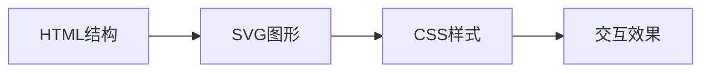

**技术特色**：
- 纯HTML+SVG实现，无需外部依赖
- 自包含设计，可直接嵌入任何网页
- 高质量视觉效果，避免传统图表工具的粗糙感

#### 热度分析

- 项目获得超1万stars，单日新增2855，表明近期热度急剧上升
- 零open issues，说明项目维护良好，用户反馈问题少

#### 快速上手

```html
<!-- 直接嵌入HTML文件 -->
<iframe src="diagram.html" width="800" height="600"></iframe>
```

#### 注意事项

- 项目目前没有明确的许可证，使用时需要注意版权问题
- 专为Claude Code设计，在其他环境中可能需要调整适配


### 2. msitarzewski/agency-agents — AI代理工具集

> **一句话总结**：提供多种专业AI代理脚本集合，每个代理具有独特个性和工作流程，满足不同领域需求。

#### 价值主张

| 维度 | 说明 |
|------|------|
| **解决痛点** | 用户无需分别构建或寻找多种专业AI助手，一站式获取各类AI专家 |
| **目标用户** | 开发者、内容创作者、营销人员及需要多种AI助手的终端用户 |
| **核心亮点** | 多种专业AI代理集合 + 每个代理有独特个性 + 即插即用 + Shell脚本实现 |

#### 技术架构

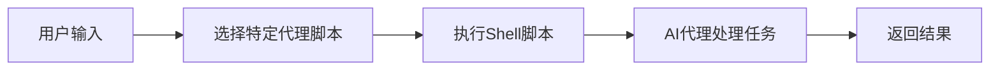

**技术特色**：
- 使用Shell脚本实现，轻量且跨平台兼容
- 每个代理都是独立的脚本模块，易于维护和扩展
- 通过命令行界面提供直观的交互方式

#### 热度分析

- 项目获得超14万星，单日增长近2000星，显示出极高的社区关注度和实用价值
- 作为开源AI工具集，处于当前AI工具生态的热点位置，吸引了大量开发者和终端用户

#### 快速上手

```bash
git clone https://github.com/msitarzewski/agency-agents.git
cd agency-agents
./<agent-name>.sh
```

#### 注意事项

- 需要确保系统安装了必要的Shell环境和依赖
- 不同代理可能需要特定的API密钥或配置
- Shell脚本执行权限可能需要调整
- 项目License未知，使用时需注意授权问题


### 3. stablyai/orca — 多平台代理开发环境

> **一句话总结**：Orca是一个多平台并行代理开发环境，允许用户使用自己的订阅运行各种编码代理。

#### 价值主张

| 维度 | 说明 |
|------|------|
| **解决痛点** | 解决了多代理并行管理和跨平台部署的复杂性 |
| **目标用户** | 开发者、AI研究人员、企业技术团队 |
| **核心亮点** | 多平台支持 + 并行代理管理 + 自定义订阅 + 开源架构 |

#### 技术架构

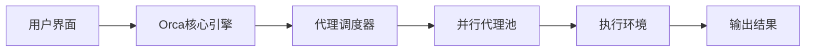

**技术特色**：
- 基于TypeScript构建，确保类型安全和跨平台兼容性
- 支持桌面、移动和VPS多平台部署
- 实现高效的并行代理管理系统和资源调度

#### 热度分析

- 项目星标数超过4.3万，近期增长迅速，日均增加约1,200个星标
- 高Fork数与零开放问题的组合表明项目可能通过其他渠道进行问题跟踪

#### 快速上手

```bash
# 克隆仓库
git clone https://github.com/stablyai/orca.git

# 安装依赖并运行
cd orca
npm install
npm start
```

#### 注意事项

- 项目许可证未知，商业使用前需确认授权条款
- 虽然描述提到可以运行任何编码代理，但实际集成情况可能有限制
- 移动端体验可能不如桌面端完善，具体取决于应用成熟度


### 4. semantica-agi/semantica — 图原生AI基础

> **一句话总结**：基于图结构构建的原生基础设施，提供上下文感知与可解释性AI系统支持

#### 价值主张

| 维度 | 说明 |
|------|------|
| **解决痛点** | 解决传统AI系统缺乏上下文关联和决策可解释性的核心问题 |
| **目标用户** | AI研究人员、需要可解释性的企业开发者、复杂系统建模者 |
| **核心亮点** | 图原生架构 + 上下文建模 + 可解释推理 + 责任AI框架 |

#### 技术架构

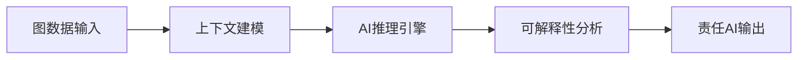

**技术特色**：
- 图原生架构设计，提供高效的关系数据处理能力
- 上下文感知机制，增强系统对复杂场景的理解
- 可解释性模块，提高AI决策的透明度和可信度

#### 热度分析

- 项目近期获得大量关注，单日新增845个Star，显示社区对其技术方向的高度认可
- Fork数量稳定增长，表明开发者社区正在积极尝试二次开发和应用

#### 快速上手

```bash
# 安装项目
pip install semantica

# 基本使用示例
from semantica import GraphAI
ai = GraphAI()
ai.load_context("example_graph")
result = ai.process_query("what is the relationship between X and Y?")
```

#### 注意事项

- 项目许可证信息不明确，商业应用前需确认授权方式
- 作为新兴技术栈，文档和社区支持可能尚在完善中
- 图原生架构需要开发者具备一定的图数据库和知识图谱基础


### 5. paperclipai/paperclip — 智能代理管理平台

> **一句话总结**：开源工作代理管理平台，提供统一的AI代理协作与管理解决方案。

#### 价值主张

| 维度 | 说明 |
|------|------|
| **解决痛点** | 解决工作环境中AI代理分散管理、协作效率低下的问题 |
| **目标用户** | 需要管理多个AI代理的团队和企业用户 |
| **核心亮点** | 统一管理界面 + 多代理协作 + 开源可定制 + 工作流集成 + 团队共享 |

#### 技术架构

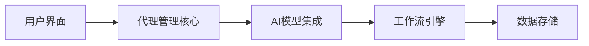

**技术特色**：
- 基于TypeScript构建，提供类型安全
- 模块化设计，支持多种AI模型集成
- 开源架构，便于扩展和定制

#### 热度分析

- 项目获得77k+星标，近期增长迅速（单日+571），表明项目受到广泛关注
- 作为开源AI代理管理平台，处于AI工具生态的关键位置，有望成为行业标准工具

#### 快速上手

```bash
# 克隆项目
git clone https://github.com/paperclipai/paperclip.git
# 安装依赖
npm install
# 启动开发服务器
npm run dev
```

#### 注意事项

- 项目许可证信息未知，使用前需确认
- 作为AI代理管理平台，需关注数据安全和隐私保护
- 项目处于快速发展阶段，API可能存在变动


### 6. hugohe3/ppt-master — AI PPT生成工具

> **一句话总结**：利用AI技术将文档或主题自动转换为专业PowerPoint演示文稿，支持原生PPT元素和自定义模板。

#### 价值主张

| 维度 | 说明 |
|------|------|
| **解决痛点** | 传统PPT制作耗时费力，一键将文档转为专业演示文稿 |
| **目标用户** | 学生、教师、商务人士和需要快速制作演示的内容创作者 |
| **核心亮点** | AI自动生成 + 原生PPT元素 + 数据可视化 + 音频讲解 + 模板支持 |

#### 技术架构


**技术特色**：
- 利用AI解析文档内容并智能组织PPT结构
- 支持生成原生PPT元素，包括形状、过渡和动画效果
- 自动将数据转换为图表和表格，支持音频讲解生成

#### 热度分析

- 项目获得45,588个Star且持续增长，表明其解决实际需求并受到广泛认可
- 高Star与零Issues的组合显示项目成熟稳定，社区反馈积极

#### 快速上手

```bash
# 安装
pip install ppt-master

# 使用
ppt-master input.md -o presentation.pptx --template custom_template.pptx
```

#### 注意事项

- 项目许可证未知，使用前需确认商业使用限制
- 生成的PPT质量高度依赖于输入文档的结构性和清晰度
- 可能需要调整AI生成的部分内容以满足特定演示需求


### 7. NVIDIA-NeMo/Switchyard — [模型交换框架]

> **一句话总结**：基于Rust的高性能模型交换与路由系统，优化多模型部署效率。

#### 价值主张

| 维度 | 说明 |
|------|------|
| **解决痛点** | 解决AI模型动态切换与资源高效分配问题 |
| **目标用户** | AI研究人员与模型部署工程师 |
| **核心亮点** | 低延迟切换 + 资源优化 + 类型安全 + 并发处理 |

#### 技术架构

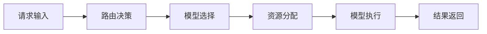

**技术特色**：
- 基于Rust内存安全模型的高性能实现
- 智能模型路由与动态资源调度机制
- 支持零拷贝数据传输与模型热切换

#### 热度分析

- 项目近期Star数激增421，显示社区高度关注
- 作为NVIDIA NeMo生态关键组件，具有强大技术背书

#### 快速上手

```bash
# 克隆仓库
git clone https://github.com/NVIDIA-NeMo/Switchyard.git

# 构建项目
cargo build --release
```

#### 注意事项

- 项目文档尚在完善中，建议参考源码实现
- 依赖NVIDIA NeMo生态系统，需配置相应环境


### 8. cactus-compute/needle — 轻量化AI模型

> **一句话总结**：仅14MB的超轻量级基础模型，专为手机、可穿戴等资源受限设备设计。

#### 价值主张

| 维度 | 说明 |
|------|------|
| **解决痛点** | 解决小型设备无法部署大型AI模型的计算与存储限制 |
| **目标用户** | 嵌入式开发者、物联网工程师、移动应用开发者 |
| **核心亮点** | 极小体积 + 高效推理 + 跨设备兼容 + 低功耗运行 |

#### 技术架构

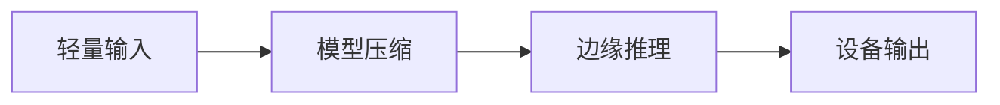

**技术特色**：
- 高度压缩的模型架构，体积仅14MB
- 针对边缘设备优化的推理算法
- 低计算资源需求，适合小型设备运行

#### 热度分析

- 项目Star数快速增长(+315 today)，表明社区对边缘AI解决方案高度关注
- 作为面向嵌入式AI的前沿项目，在物联网和移动设备领域具有重要生态价值

#### 快速上手

```bash
# 安装needle
pip install needle

# 基本使用示例
import needle
model = needle.load("tiny-model")
result = model.predict(input_data)
```

#### 注意事项

- 模型体积小可能意味着性能与大型模型相比有所取舍
- 需要确认具体许可证信息以确保合规使用
- 可能需要针对特定硬件进行额外优化以获得最佳性能


### 9. shiyu-coder/Kronos — 金融语言大模型

> **一句话总结**：专注于金融市场语言处理的基础模型，融合专业金融知识与市场趋势分析能力

#### 价值主张

| 维度 | 说明 |
|------|------|
| **解决痛点** | 金融信息处理效率低，专业分析门槛高 |
| **目标用户** | 金融分析师、量化交易员、投资研究机构 |
| **核心亮点** | 金融专业知识融合 + 市场趋势预测 + 多模态金融数据处理 |

#### 技术架构

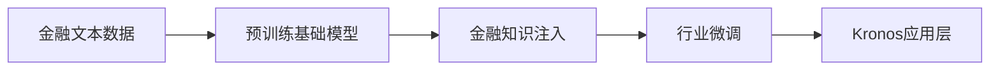

**技术特色**：
- 金融领域专业知识深度融合
- 多源异构金融数据理解能力
- 实时市场动态分析与预测

#### 热度分析

- 项目关注度持续攀升，单日新增266 stars，显示金融AI领域强劲需求
- 在金融科技生态中处于前沿位置，社区贡献活跃

#### 快速上手

```bash
git clone https://github.com/shiyu-coder/Kronos.git
cd Kronos
pip install -r requirements.txt
python demo.py
```

#### 注意事项

- 模型运行需要较高算力支持，建议配置GPU环境
- 使用金融数据时需注意合规性和隐私保护
- 输出结果仅供参考，不构成投资建议


### 10. macro-inc/macro — 团队协作AI平台

> **一句话总结**：统一团队协作空间，集成多种工具并共享AI记忆，提升团队效率。

#### 价值主张

| 维度 | 说明 |
|------|------|
| **解决痛点** | 团队工具分散，信息割裂，协作效率低下 |
| **目标用户** | 中小型团队，需要整合多种协作工具的组织 |
| **核心亮点** | 统一工作空间 + AI记忆共享 + @符号链接 + 多工具集成 + 智能协作 |

#### 技术架构

基于项目描述推测的可能架构：

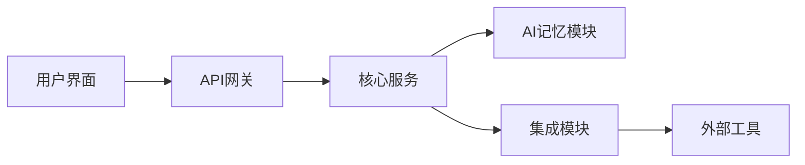

**技术特色**：
- 使用Rust构建高性能、安全的核心服务
- AI记忆模块实现跨工具信息共享
- 模块化设计便于集成各种协作工具

#### 热度分析

- 项目近期关注度显著上升，单日增长227个Star，显示市场对统一协作平台的需求强劲
- 作为新兴团队协作工具，在竞争激烈的市场中凭借AI整合特色获得早期关注

#### 快速上手

*注：项目信息有限，具体快速上手步骤请参考项目README文档*

#### 注意事项

- 项目许可证未知，在使用前需确认其开源协议
- 作为较新的项目，生态系统和社区可能仍在发展中
- 集成外部工具的功能可能需要额外配置


### 11. NanmiCoder/MediaCrawler — 多平台爬虫工具

> **一句话总结**：一站式爬取小红书、抖音、快手等主流社交媒体平台内容与评论的工具。

#### 价值主张

| 维度 | 说明 |
|------|------|
| **解决痛点** | 解决多平台数据采集难题，无需为每个平台单独开发爬虫 |
| **目标用户** | 数据分析师、内容研究者、社交媒体营销人员 |
| **核心亮点** | 多平台支持 + 反爬虫机制 + 数据结构化输出 + 配置灵活 |

#### 技术架构

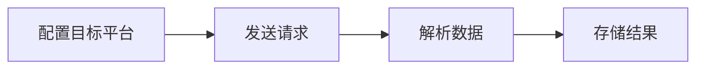

**技术特色**：
- 模块化设计，支持多平台统一爬取
- 内置反爬虫机制，提高爬取成功率
- 异步处理，提升爬取效率

#### 热度分析

- 项目获近62k Star，日增215个，持续受到开发者关注与认可
- Fork数超12k，社区活跃度高，用户积极参与二次开发

#### 快速上手

```bash
# 克隆项目
git clone https://github.com/NanmiCoder/MediaCrawler.git

# 安装依赖
pip install -r requirements.txt

# 运行爬虫
python run.py
```

#### 注意事项

- 使用时需遵守各平台的使用条款，避免违规操作
- 注意控制请求频率，防止被平台封禁
- 定期更新项目以适应目标网站结构变化


### 12. localsend/localsend — 跨平台文件共享

> **一句话总结**：开源跨平台替代方案，实现设备间安全快速文件传输，不受操作系统限制。

#### 价值主张

| 维度 | 说明 |
|------|------|
| **解决痛点** | 突破平台限制，实现不同操作系统设备间无缝文件传输 |
| **目标用户** | 需要在多设备间传输文件的用户，特别是非苹果设备用户 |
| **核心亮点** | 跨平台支持 + 安全传输 + 无需互联网 + 开源免费 + 易于使用 |

#### 技术架构

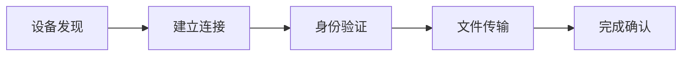

**技术特色**：
- 基于 Dart 的跨平台实现，覆盖 Windows、macOS、Linux、Android 和 iOS
- 使用本地网络直接连接，无需中间服务器
- 采用 WebSocket 技术实现实时通信与进度追踪

#### 热度分析

- 高关注度项目，Star 数近 9 万，近期保持稳定增长趋势
- 作为开源 AirDrop 替代方案，填补了跨平台文件传输的市场空白

#### 快速上手

```bash
# 克隆仓库
git clone https://github.com/localsend/localsend.git

# 安装依赖
cd localsend
flutter pub get

# 运行应用
flutter run
```

#### 注意事项

- 需要在同一局域网内使用设备
- 防火墙设置可能影响设备发现和连接
- 不同平台的构建和运行环境配置可能有所不同


### 13. infiniflow/ragflow — 企业级RAG引擎

> **一句话总结**：融合先进RAG与Agent技术，为企业LLM应用提供强大上下文支撑的智能引擎

#### 价值主张

| 维度 | 说明 |
|------|------|
| **解决痛点** | 大模型应用中的上下文理解不足与知识检索效率低下问题 |
| **目标用户** | 企业AI应用开发者、大模型集成团队、知识管理系统构建者 |
| **核心亮点** | 高效检索引擎 + Agent智能代理 + 多模态处理 + 企业级部署 + 高可扩展架构 |

#### 技术架构

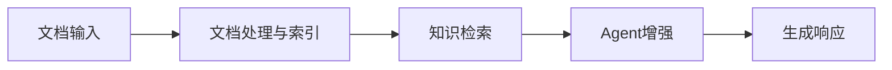

**技术特色**：
- 基于Go语言的高性能检索引擎实现
- 多模态文档处理与向量化技术
- 智能Agent与RAG融合架构设计

#### 热度分析

- 项目Star数达8.7万，近日增长139，表明社区关注度持续上升
- Fork数超1万，反映开发者参与度高，生态活跃

#### 快速上手

```bash
# 克隆项目
git clone https://github.com/infiniflow/ragflow.git

# 安装依赖并启动
cd ragflow && make install && make run
```

#### 注意事项

- 项目文档可能需要进一步丰富，以降低新用户上手难度
- 许可证信息不明确，企业在商业应用前需确认授权条款


### 14. ZuodaoTech/everyone-can-use-english — 英语学习平台

> **一句话总结**：开源英语学习平台，通过互动实践和场景化教学提升英语应用能力。

#### 价值主张

| 维度 | 说明 |
|------|------|
| **解决痛点** | 传统英语学习脱离实际应用场景，缺乏互动和实践机会 |
| **目标用户** | 有英语应用需求的学习者，特别是需要实际交流能力的人群 |
| **核心亮点** | 情境化学习 + 实时互动反馈 + 自适应难度 + 社区协作 + 生活化内容 |

#### 技术架构


**技术特色**：
- 基于TypeScript构建，确保代码质量和类型安全
- 模块化课程设计，支持灵活的内容组织与扩展
- 智能学习算法，根据用户表现动态调整难度

#### 热度分析

- 项目获得36K+星标且持续增长，表明社区认可度高
- Fork数与Star数比例适中，显示活跃的开发者参与度

#### 快速上手

```bash
# 克隆项目
git clone https://github.com/ZuodaoTech/everyone-can-use-english.git

# 安装依赖
npm install

# 启动开发服务器
npm run dev
```

#### 注意事项
- 项目许可证未知，使用前需确认开源许可条款
- 主要内容为中文，可能需要一定的中文基础才能充分利用资源


### 15. smicallef/spiderfoot — 自动化情报收集

> **一句话总结**：SpiderFoot是自动化开源情报(OSINT)工具，帮助安全专家高效收集威胁情报并映射攻击面。

#### 价值主张

| 维度 | 说明 |
|------|------|
| **解决痛点** | 解决手动收集开源情报效率低、覆盖面有限的问题，提供自动化情报收集能力 |
| **目标用户** | 安全研究员、渗透测试人员、威胁情报分析师、网络安全团队 |
| **核心亮点** | 自动化OSINT收集 + 多种数据源集成 + 实时监控 + 可扩展架构 + 详细报告生成 |

#### 技术架构


**技术特色**：
- 基于Python开发，易于扩展和定制
- 支持超过200种数据源和查询方法
- 提供REST API和Web界面，便于集成
- 支持异步扫描，提高效率
- 模块化设计，便于添加新功能

#### 热度分析

- 项目Star数超过20,000，近一个月增长稳定，表明OSINT工具需求持续增长
- 高Fork数和零Open Issues反映社区活跃度高，项目维护良好

#### 快速上手

```bash
# 安装SpiderFoot
git clone https://github.com/smicallef/spiderfoot.git
cd spiderfoot
pip install -r requirements.txt

# 运行SpiderFoot
python sf.py --scan-target example.com --output-format json
```

#### 注意事项

- 使用SpiderFoot时需遵守目标网站的使用条款，避免法律风险
- 部分数据源可能需要API密钥才能正常使用
- 大规模扫描可能消耗较多系统资源，建议在适当环境下运行
- 输出结果需进一步验证，确保信息准确性


### 16. Lightricks/LTX-2 — AI视频生成工具

> **一句话总结**：Lightricks官方LTX-2音视频生成模型的Python推理和LoRA训练工具包，实现高质量视听内容创作。

#### 价值主张

| 维度 | 说明 |
|------|------|
| **解决痛点** | 提供一站式音频-视频生成解决方案，降低高质量视听内容创作门槛 |
| **目标用户** | 内容创作者、AI研究人员、多媒体开发者 |
| **核心亮点** | 支持LoRA微调 + 音视频同步生成 + 高质量输出 + 官方支持 |

#### 技术架构


**技术特色**：
- LTX-2多模态生成模型，支持音视频同步创作
- LoRA微调技术，允许用户定制模型风格
- 高效的推理和训练流程，优化计算资源使用

#### 热度分析

- 项目获得8,713个Star，且持续增长(+65 today)，表明其在AI视频生成领域受到高度关注
- 作为Lightricks官方工具包，在专业多媒体创作工具生态中占据重要位置

#### 快速上手

```bash
# 安装依赖
pip install ltx-2

# 基本推理
python -m ltx_2 inference --input prompt.txt --output output.mp4

# LoRA微调
python -m ltx_2 train --lora --dataset path/to/dataset --model_path path/to/base_model
```

#### 注意事项

- 项目需要较高计算资源，建议使用GPU进行推理和训练
- LoRA微调需要准备特定格式的数据集
- 模型输出可能受限于训练数据的质量和多样性


### 17. embabel/embabel-agent — JVM代理框架

> **一句话总结**：轻量级JVM代理框架，实现应用功能的动态注入与运行时扩展。

#### 价值主张

| 维度 | 说明 |
|------|------|
| **解决痛点** | 简化JVM应用动态功能注入与监控，无需修改原有代码 |
| **目标用户** | Java/Kotlin开发者，需要运行时扩展能力的应用架构师 |
| **核心亮点** | 零侵入集成 + 声明式配置 + 运行时动态加载 |

#### 技术架构

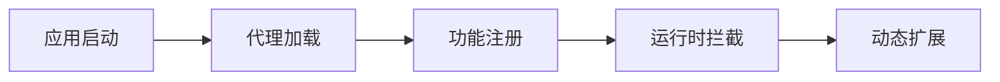

**技术特色**：
- 基于Kotlin语言特性，简化代理定义与配置
- 采用字节码操作技术，实现无侵入功能注入
- 提供模块化架构，支持功能按需加载

#### 热度分析

- 项目Star增长稳定，日增40星，表明受开发者持续关注
- Fork比例较低，显示项目以直接使用为主，贡献生态正在形成

#### 快速上手

```bash
# 添加依赖
implementation("embabel:embabel-agent:1.0.0")

# 初始化代理框架
val agent = EmbabelAgent()
    .withModule(LoggingModule())
    .withModule(MonitoringModule())
    .start()
```

#### 注意事项

- 项目开源许可证信息不明确，使用前需确认授权条款
- 目前Open Issues为0，可能表明项目较新，社区支持体系仍在构建中
- JVM代理框架的使用需考虑对应用性能的潜在影响，建议在非关键路径进行测试


## 今日推荐

| 主题 | 推荐项目 | 亮点 |
|------|----------|------|
| 今日最热 | [cathrynlavery/diagram-design](https://github.com/cathrynlavery/diagram-design) | 29 editorial diag... |
| 值得关注 | [msitarzewski/agency-agents](https://github.com/msitarzewski/agency-agents) | A complete AI age... |
| 快速上手 | [stablyai/orca](https://github.com/stablyai/orca) | Orca is the ADE f... |
| 长期潜力 | [semantica-agi/semantica](https://github.com/semantica-agi/semantica) | Graph-Native Infr... |

---

<div align="center">

*Generated on 2026-08-13 | Powered by GitHub Trending Reporter*

</div>