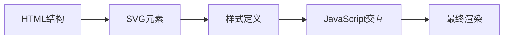
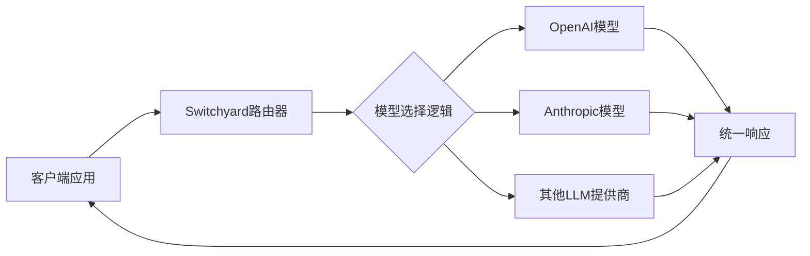
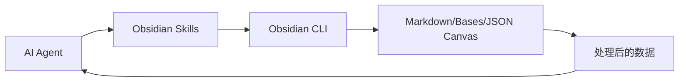
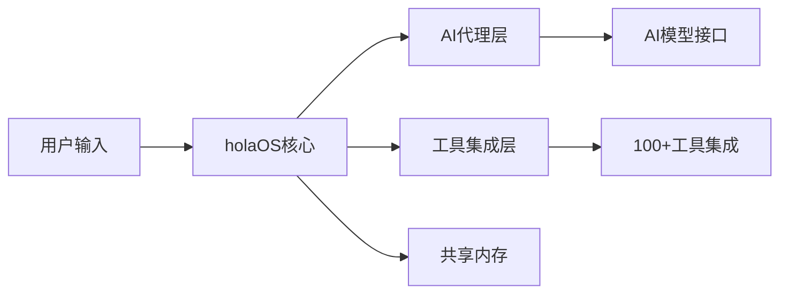
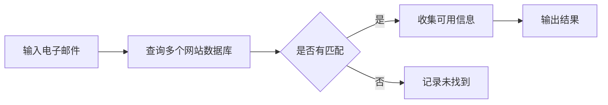
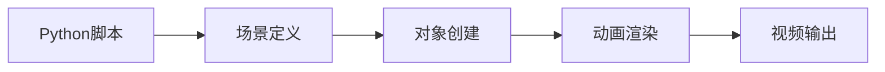

## 今日热点

AI代理生态系统和轻量化本地模型成为今日主流趋势，Anthropic技能库和14MB微型模型项目获得显著关注，同时AI工具正加速向垂直领域渗透。

---

## 热门项目一览

| 排名 | 项目 | 语言 | 今日 | 总计 | 简介 |
|:---:|------|:----:|------:|-----:|------|
| 1 | [cathrynlavery/diagram-design](https://github.com/cathrynlavery/diagram-design) | HTML | +4,475 | 14,575 | 29 editorial diagram types ... |
| 2 | [macro-inc/macro](https://github.com/macro-inc/macro) | Rust | +1,239 | 2,606 | Macro is a unified workspac... |
| 3 | [msitarzewski/agency-agents](https://github.com/msitarzewski/agency-agents) | Shell | +778 | 145,190 | A complete AI agency at you... |
| 4 | [cactus-compute/needle](https://github.com/cactus-compute/needle) | Python | +769 | 4,960 | 14MB foundation model for t... |
| 5 | [semantica-agi/semantica](https://github.com/semantica-agi/semantica) | Python | +713 | 6,679 | Graph-Native Infrastructure... |
| 6 | [infiniflow/ragflow](https://github.com/infiniflow/ragflow) | Go | +465 | 88,020 | RAGFlow is a leading open-s... |
| 7 | [NVIDIA-NeMo/Switchyard](https://github.com/NVIDIA-NeMo/Switchyard) | Rust | +408 | 1,219 | Switchyard lets LLM applica... |
| 8 | [unslothai/unsloth](https://github.com/unslothai/unsloth) | Python | +328 | 71,063 | Local UI to run and train L... |
| 9 | [anthropics/skills](https://github.com/anthropics/skills) | Python | +312 | 169,031 | Public repository for Agent... |
| 10 | [kepano/obsidian-skills](https://github.com/kepano/obsidian-skills) | Unknown | +292 | 45,759 | Agent skills for Obsidian. ... |
| 11 | [smicallef/spiderfoot](https://github.com/smicallef/spiderfoot) | Python | +283 | 20,677 | SpiderFoot automates OSINT ... |
| 12 | [holaboss-ai/holaOS](https://github.com/holaboss-ai/holaOS) | TypeScript | +241 | 6,604 | Open-source All in One AI a... |

---

## 趋势洞察

```
┌─────────────────────────────────────────────────────────────────┐
│  AI/ML 工具         ████████████████████████  14 个项目        │
│  多媒体应用            ███                       2 个项目        │
│  智能家居             █                         1 个项目        │
└─────────────────────────────────────────────────────────────────┘
```

---

## 项目深度解读

### 1. cathrynlavery/diagram-design — 图表设计库

> **一句话总结**：为Claude Code提供29种高质量的自包含HTML+SVG图表类型，无需阴影或Mermaid依赖。

#### 价值主张

| 维度 | 说明 |
|------|------|
| **解决痛点** | 提供轻量级、高质量的图表解决方案，避免复杂依赖和视觉干扰 |
| **目标用户** | Claude Code用户、技术文档编写者、内容创作者 |
| **核心亮点** | 29种编辑图表类型 + 纯HTML+SVG实现 + 无依赖 + 简洁视觉风格 |

#### 技术架构



**技术特色**：
- 纯HTML+SVG实现，无需外部依赖
- 自包含设计，可直接嵌入使用
- 避免阴影效果，保持图表清晰简洁

#### 热度分析

- 项目单日增长4,475星，总达14,575星，表明近期获得极大关注
- 零开放问题，高Star/Fork比例(16.5:1)，显示项目维护良好且广泛认可

#### 快速上手

```bash
# 克隆项目到本地
git clone https://github.com/cathrynlavery/diagram-design.git

# 在浏览器中打开index.html查看所有图表示例
open index.html
```

#### 注意事项

- 项目未明确许可证，使用时需注意版权问题
- 图表设计专注于编辑风格，可能不适合所有应用场景
- 需配合Claude Code使用才能发挥最大价值


### 2. macro-inc/macro — AI协作平台

> **一句话总结**：Macro是集邮件、聊天、文档等工具于一体的团队协作平台，通过共享AI记忆连接所有活动。

#### 价值主张

| 维度 | 说明 |
|------|------|
| **解决痛点** | 团队工具分散，信息孤岛，缺乏上下文连接的协作效率问题 |
| **目标用户** | 需要整合多种协作工具的中大型团队和知识工作者 |
| **核心亮点** | 统一工作空间 + AI记忆连接 + 多工具集成 + 共享上下文 |

#### 技术架构


**技术特色**：
- 使用Rust语言构建，确保高性能和内存安全
- AI驱动的上下文记忆系统，连接不同工具的信息
- 模块化架构设计，支持多种协作工具集成

#### 热度分析

- 项目Star数短期内大幅增长（单日增加1,239），表明项目正受到广泛关注
- 虽然Issues为0，但Fork数相对较少，可能表明项目处于早期阶段

#### 快速上手

```bash
# 克隆项目
git clone https://github.com/macro-inc/macro.git

# 构建项目
cd macro
cargo build
```

#### 注意事项

- 项目许可证未知，使用前需确认其开源协议
- 项目处于早期阶段，API和功能可能不稳定
- 需要关注其AI功能的隐私和数据安全处理方式


### 3. msitarzewski/agency-agents — AI代理集合

> **一句话总结**：提供即用型专业化AI代理脚本，覆盖开发、营销、创意等多领域需求

#### 价值主张

| 维度 | 说明 |
|------|------|
| **解决痛点** | 提供开箱即用的专业AI代理，无需自行开发复杂AI功能 |
| **目标用户** | 开发者、内容创作者、营销人员、社区管理者 |
| **核心亮点** | 多样化专业代理 + 即用型脚本 + 个性化交互 + 多领域覆盖 |

#### 技术架构


**技术特色**：
- 基于Shell脚本实现的轻量级AI代理
- 模块化设计，每个代理专注于特定任务
- 简单易用，无需复杂配置即可运行

#### 热度分析

- 项目获得14.5万+星标，近期增长迅速，表明AI代理工具需求旺盛
- 零开放问题，表明项目维护良好，用户反馈处理及时

#### 快速上手

```bash
# 克隆项目
git clone https://github.com/msitarzewski/agency-agents.git

# 进入目录并查看可用代理
cd agency-agents && ls

# 运行特定代理
./scripts/[agent-name].sh
```

#### 注意事项

- 需要确保系统已安装必要的依赖和环境
- 不同代理可能需要不同的API密钥或配置
- Shell脚本执行前应检查内容安全性


### 4. cactus-compute/needle — 轻量AI模型

> **一句话总结**：超轻量级14MB基础模型，专为资源受限设备设计的高效AI解决方案。

#### 价值主张

| 维度 | 说明 |
|------|------|
| **解决痛点** | 大型AI模型无法在小型设备上高效运行的资源限制问题 |
| **目标用户** | 嵌入式开发者、物联网设备制造商、移动应用开发者 |
| **核心亮点** | 极小体积 + 低资源消耗 + 跨设备兼容 + 开源可定制 |

#### 技术架构


**技术特色**：
- 模型压缩技术，将大模型压缩至仅14MB
- 高效推理算法，适合低功耗设备
- 跨平台兼容性，支持多种小型设备

#### 热度分析

- 项目近期Star数大幅增长(+769)，表明社区对该轻量级AI解决方案高度关注
- 作为小型设备AI模型的开源项目，填补了边缘计算领域的重要空白

#### 快速上手

```bash
# 安装needle
pip install needle-ai

# 基本使用
from needle import NeedleModel
model = NeedleModel.from_pretrained("needle-base")
result = model.predict("你的输入文本")
```

#### 注意事项

- 项目许可证未知，使用前需确认开源协议
- 14MB的模型虽然很小，但对于极度资源受限的设备可能仍然较大
- 模型性能可能不如大型基础模型，适合轻量级任务
- 需要查看项目文档了解具体支持的任务和API


### 5. semantica-agi/semantica — 图原生AI基础设施

> **一句话总结**：基于图结构的高可解释AI系统，实现上下文感知与决策可追溯的智能基础设施。

#### 价值主张

| 维度 | 说明 |
|------|------|
| **解决痛点** | 传统AI系统缺乏上下文感知和决策可解释性，难以追踪和验证AI决策过程 |
| **目标用户** | AI研究人员、数据科学家、需要可解释AI解决方案的企业和开发者 |
| **核心亮点** | 图结构原生支持 + 可解释AI能力 + 上下文感知 + 决策可追溯 + 知识图谱集成 |

#### 技术架构


**技术特色**：
- 图原生数据处理架构，高效处理复杂关系数据
- 可解释AI框架，支持决策过程透明化
- 上下文感知机制，增强AI系统对环境的理解

#### 热度分析

- 项目Star数快速增长（单日增加713），表明社区关注度极高
- 在AI可解释性和图数据库交叉领域占据生态优势位置

#### 快速上手

```bash
# 安装依赖
pip install semantica

# 初始化项目
semantica init my-project

# 运行示例
semantica example knowledge-graph
```

#### 注意事项

- 项目使用Python开发，需要一定的图数据库和AI基础知识
- 可解释AI功能可能需要额外的计算资源
- 由于项目较新，生态系统可能仍在发展中


### 6. infiniflow/ragflow — 智能RAG引擎

> **一句话总结**：开源检索增强生成引擎，融合Agent能力，为LLM提供强大上下文支持。

#### 价值主张

| 维度 | 说明 |
|------|------|
| **解决痛点** | 解决LLM上下文有限、知识更新滞后、产生幻觉问题 |
| **目标用户** | 企业开发者、AI应用构建者、知识密集型应用团队 |
| **核心亮点** | 高效检索能力 + Agent智能交互 + 开源可定制 |

#### 技术架构


**技术特色**：
- 基于Go语言构建，高性能并发处理
- 融合检索增强与Agent能力，提供上下文增强
- 开源可定制，适合企业级部署和二次开发

#### 热度分析

- 项目获得88,020个Star，近期增长迅速(+465 today)，表明RAG技术需求旺盛
- 高Fork数(10,353)反映社区活跃度高，用户二次开发意愿强烈

#### 快速上手

```bash
# 克隆RAGFlow仓库
git clone https://github.com/infiniflow/ragflow.git
cd ragflow

# 安装依赖并运行
go mod tidy
go run main.go
```

#### 注意事项

- 项目许可证未知，商业使用前需确认授权方式
- 作为RAG引擎，需要大量计算资源，特别是处理大规模文档时
- 项目文档可能需要完善，以降低新用户上手门槛


### 7. NVIDIA-NeMo/Switchyard — LLM路由器

> **一句话总结**：Switchyard是LLM应用的多模型路由系统，实现跨模型流量分发并保持API兼容性。

#### 价值主张

| 维度 | 说明 |
|------|------|
| **解决痛点** | 解决LLM应用中模型切换困难、成本优化难和性能评估复杂的问题 |
| **目标用户** | 需要整合多LLM服务的AI开发团队和企业应用开发者 |
| **核心亮点** | API兼容性保持 + 智能路由策略 + 成本性能监控 + 无缝模型切换 + 基准测试支持 |

#### 技术架构



**技术特色**：
- 基于Rust构建，确保高性能与内存安全
- 保持与OpenAI和Anthropic API的原生兼容性
- 支持基于成本、性能和延迟的智能路由策略
- 提供详细的模型性能和成本分析

#### 热度分析

- 项目单日增长408 stars，显示近期关注度急剧上升，可能是新版本发布或重要功能迭代
- 作为NVIDIA NeMo生态系统组件，受益于企业级AI基础设施支持，但社区贡献度相对较低

#### 快速上手

```bash
# 安装Switchyard
cargo install switchyard

# 配置模型提供商
switchyard config --add openai --key YOUR_OPENAI_KEY
switchyard config --add anthropic --key YOUR_ANTHROPIC_KEY

# 启动路由服务
switchyard run --config config.yaml
```

#### 注意事项

- 许可证信息不明确，使用前需确认开源许可条款
- 项目问题数量为0，可能意味着问题管理方式不同，需关注其他反馈渠道
- API兼容性可能随底层服务更新而变化，需持续关注兼容性更新


### 8. unslothai/unsloth — 本地大模型训练

> **一句话总结**：本地化UI工具，支持运行和训练多种最新大模型与扩散模型，降低本地部署门槛。

#### 价值主张

| 维度 | 说明 |
|------|------|
| **解决痛点** | 解决本地大模型训练资源消耗高、配置复杂的问题 |
| **目标用户** | AI研究人员、开发者、希望本地部署大模型的技术用户 |
| **核心亮点** | 本地UI界面 + 多模型支持(Qwen3.8/Kimi K3等) + 高效训练方法 |

#### 技术架构


**技术特色**：
- 优化大模型本地训练方法，降低硬件需求
- 统一UI管理多种大模型和扩散模型
- 支持最新开源模型的本地部署与微调

#### 热度分析

- Star数7万+且持续高速增长，表明项目获得社区广泛认可
- Fork数6千+，显示社区活跃度高，二次开发活跃

#### 快速上手

```bash
# 克隆项目
git clone https://github.com/unslothai/unsloth.git
cd unsloth

# 安装依赖
pip install -r requirements.txt

# 启动本地UI
python app.py
```

#### 注意事项

- 许可证信息不明确，商业使用前需确认授权条款
- 项目依赖可能需要较高配置的硬件资源，特别是训练大模型时


### 9. anthropics/skills — AI代理技能库

> **一句话总结**：Anthropic官方提供的AI代理技能集合，旨在扩展和增强AI代理的功能能力。

#### 价值主张

| 维度 | 说明 |
|------|------|
| **解决痛点** | 解决AI代理功能扩展困难、技能集成复杂的问题 |
| **目标用户** | AI开发者、研究人员及高级AI应用构建者 |
| **核心亮点** | 模块化设计 + 易于集成 + 高度可扩展 + 社区驱动 |

#### 技术架构


**技术特色**：
- 基于Claude模型的能力扩展框架
- 技能可插拔架构设计
- 与Anthropic API深度集成

#### 热度分析

- 项目Star数超16万且持续增长，显示极高的社区关注度和采用率
- 作为Anthropic官方项目，处于AI代理技能开发的核心生态位置

#### 快速上手

```bash
# 克隆仓库
git clone https://github.com/anthropics/skills.git
cd skills

# 安装依赖
pip install -r requirements.txt
```

#### 注意事项

- 项目可能需要Anthropic API密钥才能正常运行
- 需要了解Claude模型的基本使用方式
- 许可证信息不明确，使用前需确认授权条款


### 10. kepano/obsidian-skills — AI笔记集成

> **一句话总结**：为 Obsidian 开发的 AI 代理技能，支持多种开放格式和 CLI 操作。

#### 价值主张

| 维度 | 说明 |
|------|------|
| **解决痛点** | 打通 AI 代理与 Obsidian 笔记系统的双向交互通道 |
| **目标用户** | 使用 Obsidian 的 AI 开发者和高级用户 |
| **核心亮点** | 支持 CLI 操作 + 多格式解析 + AI 代理集成 |

#### 技术架构



**技术特色**：
- 支持 Obsidian CLI 命令行操作
- 兼容多种开放格式文件处理
- 提供与 AI 代理的交互接口

#### 热度分析

- 高关注度项目，近期增长迅速，单日新增近300星
- 在 Obsidian 生态中具有重要地位，社区活跃度高

#### 快速上手

```bash
# 安装 Obsidian
# 启用 Skills 插件
# 配置 AI 代理连接
```

#### 注意事项

- 需要 Obsidian 应用支持
- 可能需要配置 API 密钥或认证信息
- 部分功能可能需要付费订阅
- 项目文档可能不够详细


### 11. smicallef/spiderfoot — 自动化OSINT工具

> **一句话总结**：SpiderFoot自动化开源情报收集，帮助安全团队高效发现和映射攻击面。

#### 价值主张

| 维度 | 说明 |
|------|------|
| **解决痛点** | 自动化分散的OSINT数据收集，减少手动信息搜集的工作量和遗漏 |
| **目标用户** | 网络安全分析师、威胁情报团队、渗透测试人员、企业安全负责人 |
| **核心亮点** | 支持多种数据源 + 自动化收集 + 可扩展架构 + 结果可视化 + API集成 |

#### 技术架构


**技术特色**：
- 采用模块化设计，支持多种OSINT数据源
- 提供REST API便于与其他安全工具集成
- 支持分布式扫描，提高大规模目标扫描效率
- 使用异步处理提高性能
- 内置多种输出格式，便于后续分析

#### 热度分析

- 项目star数超过2万，且持续增长，表明OSINT工具需求旺盛
- 社区贡献活跃，fork数高，说明用户积极参与功能扩展和改进

#### 快速上手

```bash
# 安装SpiderFoot
pip install spiderfoot

# 运行SpiderFoot
python spiderfoot.py -m cli -t target.com

# 或者使用Docker运行
docker run -it --rm smicallef/spiderfoot -t target.com
```

#### 注意事项

- 使用前需了解相关法律法规，确保合法合规地使用工具
- 大规模扫描可能触发目标网站的防护机制，建议合理设置扫描频率
- 工具依赖多种外部数据源，需要稳定的网络连接
- 定期更新工具以获取最新的OSINT数据源和功能改进


### 12. holaboss-ai/holaOS — AI代理工作空间

> **一句话总结**：开源全功能AI代理工作空间，支持多种AI模型，集成100+工具与共享内存。

#### 价值主张

| 维度 | 说明 |
|------|------|
| **解决痛点** | 解决AI代理工具分散、不互通、无法跨平台统一管理的问题 |
| **目标用户** | 开发者、研究人员、AI工具使用者、需要集成多种AI应用的专业人士 |
| **核心亮点** | 100+工具集成 + 共享内存 + 多AI模型支持 + 开源平台 + MCP协议支持 |

#### 技术架构



**技术特色**：
- TypeScript开发，保证类型安全和跨平台兼容性
- 模块化设计，支持多种AI代理和工具的无缝集成
- 共享内存机制，实现不同AI代理间数据和状态的一致性

#### 热度分析

- Star数6,604且单日增长241，显示项目热度快速上升，AI代理工作空间领域需求旺盛
- Open Issues为0，表明项目维护良好，用户反馈可能通过其他渠道处理或问题解决率高

#### 快速上手

```bash
# 克隆仓库
git clone https://github.com/holaboss-ai/holaOS.git
# 安装依赖
npm install
# 启动应用
npm start
```

#### 注意事项

- 项目License未知，在使用前需确认开源协议
- 作为AI代理平台，可能需要API密钥才能使用部分功能
- 项目尚在快速发展中，API和功能可能会有变化


### 13. Lightricks/LTX-2 — 音视频生成模型

> **一句话总结**：LTX-2官方Python包，支持音频视频生成模型推理与LoRA高效训练。

#### 价值主张

| 维度 | 说明 |
|------|------|
| **解决痛点** | 统一处理音视频多模态数据生成，简化模型训练与部署流程 |
| **目标用户** | 音视频生成研究人员、内容创作者、AI模型开发者 |
| **核心亮点** | 多模态生成能力 + LoRA高效微调 + 官方支持 + Python易用接口 |

#### 技术架构


**技术特色**：
- 多模态统一处理架构，同时处理音频和视频数据
- LoRA参数高效微调技术，降低计算资源需求
- 官方优化实现，确保模型性能和稳定性

#### 热度分析

- Star数近9000且持续增长，表明项目受社区高度关注
- Fork数相对适中，说明项目处于稳定使用阶段，而非快速迭代期

#### 快速上手

```bash
# 安装LTX-2包
pip install ltx2

# 基本推理示例
from ltx2 import LTX2
model = LTX2()
output = model.generate(prompt="一段音乐和视频")
```

#### 注意事项

- 项目许可证信息未知，商用前需确认授权条款
- 音视频生成可能需要较高的计算资源，建议使用GPU环境
- 模型可能对输入格式有特定要求，需参考文档预处理数据


### 14. megadose/holehe — [邮件账户检测工具]

> **一句话总结**：holehe是一个Python工具，可检测电子邮件在多个网站上的注册情况，特别关注社交媒体平台。

#### 价值主张

| 维度 | 说明 |
|------|------|
| **解决痛点** | 快速检测电子邮件在多个网站上的注册情况和关联信息 |
| **目标用户** | 安全研究人员、渗透测试人员、隐私意识强的普通用户 |
| **核心亮点** | 支持大量网站 + 自动化检测 + 信息收集 + Python跨平台 + 开源免费 |

#### 技术架构



**技术特色**：
- 使用模块化设计支持多种网站检测
- 实现自动化查询流程，无需人工干预每个网站
- 采用异步技术提高大规模检测效率

#### 热度分析

- 项目获得超过12,000个stars，每日增长约190个，表明安全领域需求旺盛
- Fork数与Star比例约为1:7，显示用户更倾向于直接使用而非二次开发

#### 快速上手

```bash
# 安装holehe
pip install holehe

# 基本使用
holehe -u example@email.com

# 扫描特定网站
holehe -u example@email.com -s twitter,instagram
```

#### 注意事项

- 仅用于合法的安全测试和隐私检查，未经授权的账户检测可能违反服务条款
- 许可证信息不明确，商业使用前需确认授权条款
- 某些网站可能有反自动化检测机制，频繁使用可能导致IP被临时或永久封禁


### 15. 3b1b/manim — 数学动画引擎

> **一句话总结**：基于Python的强大动画引擎，专为创建高质量数学可视化内容而设计

#### 价值主张

| 维度 | 说明 |
|------|------|
| **解决痛点** | 将抽象数学概念转化为直观动态可视化，解决传统数学教学展示困难 |
| **目标用户** | 数学教育工作者、内容创作者、学术研究者、可视化爱好者 |
| **核心亮点** | Python编程控制 + LaTeX数学渲染 + GPU加速渲染 |

#### 技术架构



**技术特色**：
- 基于Python编程控制，可精确定义每个动画元素和行为
- 内置LaTeX支持，确保数学符号和公式的高质量渲染
- 支持GPU加速，显著提高复杂场景的渲染效率
- 模块化架构设计，便于扩展和自定义功能

#### 热度分析

- 超9万Stars且持续稳定增长，表明在数学可视化领域具有广泛认可度和实用价值
- 作为3Blue1Brown频道的官方工具，拥有庞大的教育内容创作者社区支持

#### 快速上手

```bash
# 安装Manim
pip install manim

# 创建简单动画
python -m manim example_scenes.py SquareToCircle -p

# 运行示例场景
python -m manim example_scenes.py OpeningManimExample -p
```

#### 注意事项

- 学习曲线较陡峭，需要一定的Python编程基础和数学知识
- 复杂场景渲染可能需要较长时间和较高性能的硬件支持
- 官方文档仍在持续完善，部分高级功能可能需要查阅源码
- 不同版本间可能存在API变化，使用时需注意版本兼容性


### 16. lightningpixel/modly — AI 3D建模工具

> **一句话总结**：基于本地AI的桌面应用，直接在GPU上从图像生成3D模型，保护用户隐私并确保高性能。

#### 价值主张

| 维度 | 说明 |
|------|------|
| **解决痛点** | 解决传统3D建模工具复杂、学习曲线陡峭的问题，让普通用户也能快速创建3D模型 |
| **目标用户** | 3D设计师、游戏开发者、内容创作者以及AI技术爱好者 |
| **核心亮点** | 本地运行保护隐私 + GPU加速提高效率 + 简化3D建模流程 + 无需云端服务 + 完全离线工作 |

#### 技术架构


**技术特色**：
- 本地AI模型处理确保数据隐私安全
- GPU加速实现高性能实时3D生成
- TypeScript跨平台桌面应用架构
- 无需网络连接的完全离线工作方式

#### 热度分析

- 项目Star数已达5419且持续增长(+118 today)，显示出社区对该技术方向的强烈兴趣
- Fork数574表明开发者社区积极参与，作为AI+3D融合的桌面工具，在创意工具生态中占据独特位置

#### 快速上手

```bash
# 克隆项目
git clone https://github.com/lightningpixel/modly.git

# 安装依赖并运行
npm install
npm run build
npm start
```

#### 注意事项

- 项目依赖强大的GPU支持，低端显卡可能影响生成效果
- 虽然项目描述说完全本地运行，但仍需注意AI模型可能需要较大的存储空间
- 项目License未知，商业使用前需确认授权条款


### 17. altic-dev/FluidVoice — 本地AI听写

> **一句话总结**：macOS最快听写应用，设备端STT技术，AI增强模型，隐私保护本地处理。

#### 价值主张

| 维度 | 说明 |
|------|------|
| **解决痛点** | 解决云端听写延迟高、隐私风险大、依赖网络的问题 |
| **目标用户** | 注重隐私的macOS用户，需要高效听写功能的创作者 |
| **核心亮点** | 设备端STT + 自定义AI模型 + 快速响应 + 隐私保护 |

#### 技术架构


**技术特色**：
- Swift开发的macOS原生应用，性能优化
- 设备端语音识别技术，无需云端处理
- 自定义训练的AI模型提升识别准确率

#### 热度分析

- 近万Star，持续增长，表明市场对本地AI听写工具的高度认可
- 无开放Issues，项目成熟度高，正在扩展多平台支持

#### 快速上手

```bash
# 克隆仓库
git clone https://github.com/altic-dev/FluidVoice.git
# 构建应用
cd FluidVoice && xcodebuild -project FluidVoice.xcodeproj -scheme FluidVoice -configuration Release build
```

#### 注意事项

- 需要macOS系统支持，可能需要较新的硬件以支持AI模型处理
- 许可证信息不明确，使用前需确认开源许可类型


## 今日推荐

| 主题 | 推荐项目 | 亮点 |
|------|----------|------|
| 今日最热 | [cathrynlavery/diagram-design](https://github.com/cathrynlavery/diagram-design) | 29 editorial diag... |
| 值得关注 | [macro-inc/macro](https://github.com/macro-inc/macro) | Macro is a unifie... |
| 快速上手 | [msitarzewski/agency-agents](https://github.com/msitarzewski/agency-agents) | A complete AI age... |
| 长期潜力 | [cactus-compute/needle](https://github.com/cactus-compute/needle) | 14MB foundation m... |

---

<div align="center">

*Generated on 2026-08-14 | Powered by GitHub Trending Reporter*

</div>