## 今日热点

今日GitHub热榜项目精彩纷呈。

---

## 热门项目一览

| 排名 | 项目 | 语言 | 今日 | 总计 | 简介 |
|:---:|------|:----:|------:|-----:|------|
| 1 | [cathrynlavery/diagram-design](https://github.com/cathrynlavery/diagram-design) | HTML | +3,646 | 17,239 | 29 editorial diagram types ... |
| 2 | [semantica-agi/semantica](https://github.com/semantica-agi/semantica) | Python | +1,181 | 7,521 | Graph-Native Infrastructure... |
| 3 | [github/spec-kit](https://github.com/github/spec-kit) | Python | +1,160 | 128,512 | 💫 Toolkit to help you get s... |
| 4 | [holaboss-ai/holaOS](https://github.com/holaboss-ai/holaOS) | TypeScript | +769 | 7,288 | Open-source All in One AI a... |
| 5 | [cactus-compute/needle](https://github.com/cactus-compute/needle) | Python | +662 | 5,602 | 14MB foundation model for t... |
| 6 | [lightningpixel/modly](https://github.com/lightningpixel/modly) | TypeScript | +579 | 5,935 | Desktop app to generate 3D ... |
| 7 | [unslothai/unsloth](https://github.com/unslothai/unsloth) | Python | +501 | 71,503 | Local UI to run and train L... |
| 8 | [infiniflow/ragflow](https://github.com/infiniflow/ragflow) | Go | +473 | 88,381 | RAGFlow is a leading open-s... |
| 9 | [macro-inc/macro](https://github.com/macro-inc/macro) | Rust | +436 | 3,031 | Macro is a unified workspac... |
| 10 | [megadose/holehe](https://github.com/megadose/holehe) | Python | +427 | 12,846 | holehe allows you to check ... |
| 11 | [smicallef/spiderfoot](https://github.com/smicallef/spiderfoot) | Python | +293 | 20,946 | SpiderFoot automates OSINT ... |
| 12 | [OpenCut-app/OpenCut](https://github.com/OpenCut-app/OpenCut) | TypeScript | +255 | 83,158 | The open-source CapCut alte... |

---

## 趋势洞察

```
┌─────────────────────────────────────────────────────────────────┐
│  AI/ML 工具         ████████████████████████  11 个项目        │
│  其他               ██████                    3 个项目        │
│  多媒体应用            ██                        1 个项目        │
│  智能家居             ██                        1 个项目        │
│  开发工具             ██                        1 个项目        │
└─────────────────────────────────────────────────────────────────┘
```

---

## 项目深度解读

### 1. cathrynlavery/diagram-design — 编辑图表设计库

> **一句话总结**：29种高质量自包含HTML/SVG图表，专为Claude Code打造，摆脱Mermaid渲染限制。

#### 价值主张

| 维度 | 说明 |
|------|------|
| **解决痛点** | 解决Claude Code中高质量、轻量级图表渲染需求，避免Mermaid兼容性问题 |
| **目标用户** | Claude Code用户、技术文档编写者、前端开发者 |
| **核心亮点** | 纯HTML/SVG实现 + 29种编辑图表类型 + 无外部依赖 + 高质量渲染 |

#### 技术架构

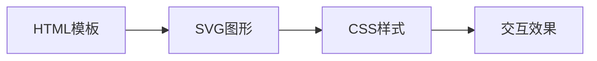

**技术特色**：
- 纯前端实现，无需服务器环境
- 使用原生HTML和SVG，避免第三方依赖
- 自包含设计，便于直接集成使用

#### 热度分析

- 近期热度激增，单日增长3,646个Star，表明被Claude官方或技术社区广泛推荐
- Fork数1,027显示社区积极参与二次开发，形成活跃生态

#### 快速上手

```bash
# 克隆项目
git clone https://github.com/cathrynlavery/diagram-design.git

# 在浏览器中查看
cd diagram-design && open index.html
```

#### 注意事项

- 项目许可证未知，商业使用前需确认授权情况
- 虽然无阴影设计简洁，但可能不适合需要复杂视觉效果的场景
- 高度依赖Claude Code环境，在其他IDE中可能需要适配


### 2. semantica-agi/semantica — 图原生AI系统

> **一句话总结**：构建基于图原生的语义基础设施，为AI系统提供上下文理解与可解释性支持。

#### 价值主张

| 维度 | 说明 |
|------|------|
| **解决痛点** | 解决AI系统缺乏上下文理解和可解释性的问题 |
| **目标用户** | AI研究人员、可解释AI开发者、语义系统工程师 |
| **核心亮点** | 图原生架构+上下文感知+可解释性+语义推理+模块化设计 |

#### 技术架构


**技术特色**：
- 基于图原生的语义表示架构
- 上下文感知的AI系统设计
- 模块化的组件化架构

#### 热度分析

- Star数超7500，单日增长超过1000，表明项目近期获得极大关注
- 社区活跃度高，零开放问题显示项目维护良好

#### 快速上手

```bash
# 克隆项目
git clone https://github.com/semantica-agi/semantica.git
cd semantica
# 安装依赖
pip install -r requirements.txt
```

#### 注意事项

- 由于许可证未知，商业使用前需确认授权条款
- 项目处于活跃开发阶段，API可能会有变化
- 需要一定的图计算和语义网络基础知识


### 3. github/spec-kit — 规范驱动工具包

> **一句话总结**：一个帮助开发者实践规范驱动开发的Python工具包，提供完整的规范定义和验证框架。

#### 价值主张

| 维度 | 说明 |
|------|------|
| **解决痛点** | 解决规范定义不清晰、实现与规范不一致、缺乏自动化验证问题 |
| **目标用户** | 需要严格API规范的微服务开发团队和接口密集型项目 |
| **核心亮点** | 提供标准规范定义方法 + 支持多种规范格式 + 自动化验证集成 + 清晰文档示例 |

#### 技术架构

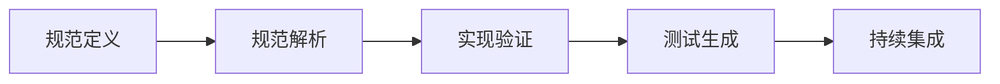

**技术特色**：
- 提供规范即代码(As-Code)的开发模式
- 支持规范自动生成测试用例
- 集成持续验证流程确保实现与规范一致

#### 热度分析

- 项目Star数超12万，近期持续增长，表明在规范驱动开发领域有广泛认可
- Fork数与Star数比例合理，社区活跃度高，但Issues为0需关注问题反馈渠道

#### 快速上手

```bash
# 安装spec-kit
pip install spec-kit

# 初始化项目规范
spec-kit init my-project

# 验证实现是否符合规范
spec-kit validate
```

#### 注意事项

- 项目许可证信息不明确，使用前需确认
- 可能需要了解项目与OpenAPI等规范标准的兼容性
- 建议查看项目文档了解完整功能和使用场景


### 4. holaboss-ai/holaOS — AI代理工作空间

> **一句话总结**：集成多种AI代理与工具，提供统一的智能工作空间，支持跨平台操作与共享记忆功能。

#### 价值主张

| 维度 | 说明 |
|------|------|
| **解决痛点** | 分散的AI工具与代理缺乏统一工作空间，导致效率低下 |
| **目标用户** | 开发者、研究人员和需要多AI协作的专业人士 |
| **核心亮点** | 100+工具集成 + 共享记忆功能 + 多AI代理支持 + 跨平台兼容 |

#### 技术架构

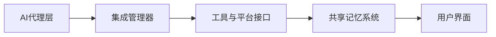

**技术特色**：
- 基于TypeScript构建，提供类型安全和高性能
- 支持100+工具集成和MCP协议
- 共享记忆系统实现跨代理协作

#### 热度分析

- 近期Star数增长迅速(+769 today)，显示社区关注度高涨
- 虽然Issues为0，但Fork数适中，表明项目处于积极开发阶段

#### 快速上手

```bash
# 克隆仓库
git clone https://github.com/holaboss-ai/holaOS.git
# 安装依赖
npm install
# 启动应用
npm start
```

#### 注意事项

- 项目License未知，使用前需确认授权条款
- 作为相对新的项目，可能存在稳定性问题
- 需要配置API密钥才能使用内置模型功能


### 5. cactus-compute/needle — 轻量AI模型

> **一句话总结**：专为资源受限设备设计的14MB超轻量级AI基础模型，实现边缘智能部署。

#### 价值主张

| 维度 | 说明 |
|------|------|
| **解决痛点** | 大型AI模型无法在资源受限设备运行，限制边缘智能发展 |
| **目标用户** | IoT开发者、嵌入式工程师、移动应用开发者 |
| **核心亮点** | 超小体积 + 低资源消耗 + 高效推理 + 多设备兼容 + 边缘部署 |

#### 技术架构


**技术特色**：
- 14MB超轻量级模型设计
- 针对CPU和内存受限设备优化
- 支持多种边缘设备平台部署

#### 热度分析

- 近期Star数快速增长，单日新增662个，表明社区关注度显著提升
- 高低Fork比反映项目以使用为主，社区贡献相对较少

#### 快速上手

```bash
# 克隆项目
git clone https://github.com/cactus-compute/needle.git

# 安装依赖
pip install -r requirements.txt

# 基本使用
python examples/basic_inference.py
```

#### 注意事项

- 项目许可证信息不明确，商业使用前需确认授权条款
- 模型可能需要针对特定硬件进行进一步优化调整
- 项目文档相对简略，需要深入研究源码以了解完整功能


### 6. lightningpixel/modly — AI 3D建模工具

> **一句话总结**：本地AI驱动的桌面应用，可将图像或提示转换为3D模型，完全在GPU上运行。

#### 价值主张

| 维度 | 说明 |
|------|------|
| **解决痛点** | 将2D图像或文本描述快速转换为3D模型，无需专业技能 |
| **目标用户** | 3D设计师、游戏开发者、创意工作者和AI爱好者 |
| **核心亮点** | 本地运行保护隐私 + GPU加速处理 + 支持图像和文本输入 + 完全离线可用 |

#### 技术架构

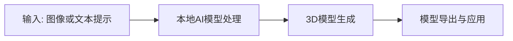

**技术特色**：
- 基于本地AI模型运行，保护用户数据隐私
- GPU加速处理，提高生成效率
- 完全离线工作，不依赖云服务

#### 热度分析

- 项目Star数近6000，单日增长近600，表明项目正处于快速增长期
- 无开放Issues，可能表明项目成熟度高或问题解决迅速

#### 快速上手

```bash
# 克隆项目
git clone https://github.com/lightningpixel/modly.git

# 安装依赖
npm install

# 构建并运行
npm run build && npm start
```

#### 注意事项

- 项目使用本地AI模型，需要高性能GPU支持
- 由于项目完全在本地运行，可能需要较大的存储空间
- 项目License未知，使用前需确认授权条款


### 7. unslothai/unsloth — 大模型本地训练平台

> **一句话总结**：本地化界面工具，支持运行和训练多种最新大语言模型和扩散模型。

#### 价值主张

| 维度 | 说明 |
|------|------|
| **解决痛点** | 降低大模型本地部署和训练的技术门槛，提供直观操作界面 |
| **目标用户** | 研究人员、开发者、AI爱好者等需要本地运行大模型的人群 |
| **核心亮点** | 支持多种最新模型 + 本地UI界面 + 无需复杂编程 + 低配置支持 |

#### 技术架构

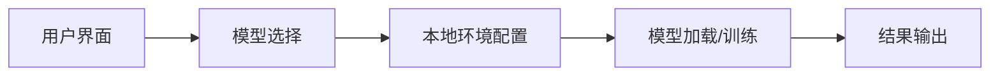

**技术特色**：
- 高效的本地模型推理优化技术
- 支持多种最新大语言模型和扩散模型
- 简化模型训练流程的自动化工具链

#### 热度分析

- Star 数量高达71,503且持续增长(+501 today)，表明项目受到广泛关注和认可
- Fork 数量6,449显示社区活跃度高，用户积极参与项目使用和二次开发
- Open Issues 为0，可能表明项目维护良好或问题主要通过其他渠道解决

#### 快速上手

```bash
# 安装unsloth
pip install unsloth

# 启动本地UI
unsloth

# 在界面中选择模型并开始训练/推理
```

#### 注意事项

- 需要确保本地硬件配置满足模型运行要求
- 某些大型模型可能需要较高的GPU资源
- 注意模型的授权和合规使用


### 8. infiniflow/ragflow — [企业级RAG引擎]

> **一句话总结**：RAGFlow融合前沿RAG与Agent能力，为LLM打造企业级检索增强生成引擎。

#### 价值主张

| 维度 | 说明 |
|------|------|
| **解决痛点** | 解决大语言模型上下文理解局限和知识更新滞后问题 |
| **目标用户** | 企业开发者、AI应用构建者、需要增强LLM能力的组织 |
| **核心亮点** | 高效检索引擎 + 多模态处理 + 企业级部署 + Agent能力集成 |

#### 技术架构


**技术特色**：
- 基于Go语言构建，高性能并发处理能力
- 多模态文档理解与检索技术
- Agent能力与RAG深度融合架构
- 企业级部署与扩展性设计

#### 热度分析

- 项目获得88,381个Star，单日增长473，显示RAG领域热度持续攀升
- Fork数达10,377，表明开发者社区积极参与和二次开发
- Issues数为0，可能反映项目成熟度高或社区沟通渠道转移

#### 快速上手

```bash
# 克隆项目
git clone https://github.com/infiniflow/ragflow.git
cd ragflow

# 安装依赖并运行
go mod tidy
go run cmd/main.go
```

#### 注意事项

- 项目许可证信息不明确，商业使用前需确认授权条款
- Go项目需要相应的Go环境配置，建议Go 1.19+
- 作为RAG引擎，可能需要额外的向量数据库和模型资源支持
- 项目文档可能需要进一步补充以降低上手门槛


### 9. macro-inc/macro — AI团队协作平台

> **一句话总结**：整合邮件、聊天、文档等功能的智能团队工作空间，通过AI记忆实现无缝协作。

#### 价值主张

| 维度 | 说明 |
|------|------|
| **解决痛点** | 团队工具分散，信息孤岛严重，缺乏智能连接与上下文记忆 |
| **目标用户** | 需要高效协作的远程团队，特别是知识密集型组织 |
| **核心亮点** | AI驱动记忆系统 + @链接机制 + 统一工作空间 + 多功能集成 + 智能上下文感知 |

#### 技术架构

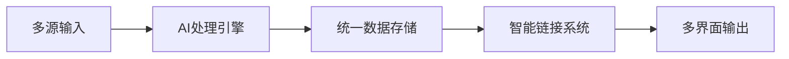

**技术特色**：
- 采用Rust语言开发，确保高性能与内存安全
- AI记忆系统实现跨工具的上下文保留与智能关联
- @链接机制提供跨应用的语义连接能力

#### 热度分析

- 项目近期热度飙升，单日增长436星，表明市场认可度高
- Fork/Star比例健康，社区参与度与贡献意愿强劲
- 0个Open Issues反映项目维护状态良好

#### 快速上手

```bash
git clone https://github.com/macro-inc/macro.git
cd macro
cargo run --release
```

#### 注意事项

- 项目许可证未知，商业使用前需确认授权条款
- 作为AI驱动的平台，需关注数据隐私与合规问题
- 项目处于活跃开发阶段，API与功能可能快速迭代


### 10. megadose/holehe — 邮箱足迹检测

> **一句话总结**：holehe是一款多平台邮箱使用情况检测工具，可快速识别邮箱在各大网站的存在状态。

#### 价值主张

| 维度 | 说明 |
|------|------|
| **解决痛点** | 帮助用户发现邮箱在各大平台的注册情况，管理数字足迹和账户安全 |
| **目标用户** | 安全研究人员、隐私保护者、IT管理员和普通网络用户 |
| **核心亮点** | 多平台批量检测 + 自动化查询 + 密码重置功能 + 详细报告生成 + 跨平台支持 |

#### 技术架构

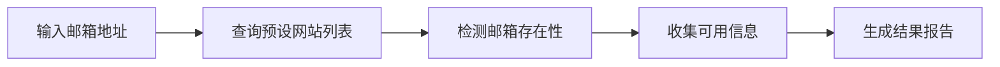

**技术特色**：
- 采用异步请求技术，提高多平台查询效率
- 内置大量网站API和检测规则，覆盖主流社交和平台
- 模块化设计，便于维护和扩展新网站检测

#### 热度分析

- 项目Star数超12,800，近期日均新增约427个Star，增长势头强劲
- 作为网络安全领域实用工具，拥有稳定贡献者社区和活跃维护状态

#### 快速上手

```bash
# 安装holehe
pip install holehe

# 基本使用
holehe example@email.com

# 检测特定网站
holehe example@email.com -s twitter
```

#### 注意事项

- 使用holehe进行检测时需遵守相关网站的使用条款，避免违反法律法规
- 工具主要用于账户管理和安全审计，不应用于未经授权的信息收集
- 某些网站可能会检测并阻止自动化查询，导致结果不准确
- 建议在使用前更新网站数据库，以确保检测的准确性


### 11. smicallef/spiderfoot — 开源情报自动化

> **一句话总结**：SpiderFoot自动化收集开源情报，帮助安全团队发现潜在威胁和映射企业网络攻击面。

#### 价值主张

| 维度 | 说明 |
|------|------|
| **解决痛点** | 自动化手动收集开源情报的繁琐过程，提升威胁发现效率 |
| **目标用户** | 安全分析师、渗透测试人员、威胁情报收集者 |
| **核心亮点** | 高度可扩展+支持多种数据源+丰富的API接口+自动化报告生成 |

#### 技术架构

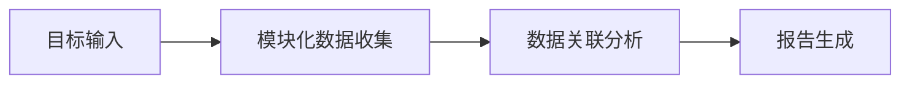

**技术特色**：
- 模块化架构设计，便于扩展新的数据源
- 支持异步并发处理，提高数据收集效率
- 提供REST API，便于与其他安全工具集成

#### 热度分析

- 项目拥有20,946个star和3,341个fork，近期增长迅速，显示其在安全领域的受欢迎程度
- 作为OSINT工具的代表项目，已成为安全社区的标准工具之一，具有稳定的用户基础和活跃的贡献者社区

#### 快速上手

```bash
# 安装SpiderFoot
git clone https://github.com/smicallef/spiderfoot.git
cd spiderfoot
pip install -r requirements.txt
# 运行SpiderFoot
python sf.py -l 127.0.0.1:5001
```

#### 注意事项

- 使用SpiderFoot收集数据时需遵守相关法律法规和隐私政策
- 部分数据源可能有使用限制，需要合理配置API密钥和访问频率
- 在生产环境中使用前，建议先在测试环境中验证功能


### 12. OpenCut-app/OpenCut — 开源视频编辑器

> **一句话总结**：开源替代CapCut的跨平台视频编辑解决方案，提供专业级编辑体验

#### 价值主张

| 维度 | 说明 |
|------|------|
| **解决痛点** | 提供免费开源的视频编辑替代方案，摆脱商业软件限制 |
| **目标用户** | 内容创作者、视频编辑爱好者、开源软件支持者 |
| **核心亮点** | 跨平台支持 + 专业编辑功能 + 开源可定制 + 免费使用 |

#### 技术架构

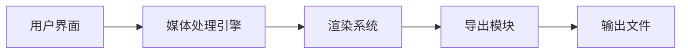

**技术特色**：
- 基于TypeScript开发，确保代码质量和类型安全
- 跨平台支持，兼容Windows、macOS和Linux
- 高性能视频处理引擎，支持实时预览和渲染

#### 热度分析

- 项目获得超过8.3万星，近期增长率稳定，表明视频编辑开源工具有强劲需求
- 社区参与度高，Fork数量接近8.3千，表明项目有良好的二次开发基础

#### 快速上手

```bash
# 克隆项目
git clone https://github.com/OpenCut-app/OpenCut.git

# 安装依赖
npm install

# 构建项目
npm run build
```

#### 注意事项

- 项目许可证信息未知，使用前需确认开源协议
- 作为视频编辑软件，对硬件性能有一定要求，建议配置较好的GPU
- 项目可能处于开发初期，部分功能可能不稳定


### 13. deepseek-ai/awesome-deepseek-agent — DeepSeek 资源聚合

> **一句话总结**：DeepSeek AI 优秀资源集合，汇集智能代理相关工具与框架。

#### 价值主张

| 维度 | 说明 |
|------|------|
| **解决痛点** | 整合分散的 DeepSeek AI 相关资源，降低开发门槛 |
| **目标用户** | AI 开发者、研究人员和 DeepSeek 平台使用者 |
| **核心亮点** | 资源精选 + 分类清晰 + 社区贡献 + 持续更新 + 实用性强 |

#### 技术架构

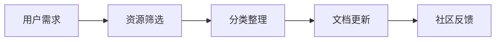

**技术特色**：
- 采用结构化资源组织方式便于查找
- 支持社区贡献机制保持资源新鲜度
- 提供多维度分类系统满足不同需求

#### 热度分析

- Star 数量持续增长，近期增长速率明显，表明社区关注度提升
- 作为资源聚合项目，在 DeepSeek 生态中具有重要参考价值

#### 快速上手

```bash
# 克隆项目获取资源列表
git clone https://github.com/deepseek-ai/awesome-deepseek-agent.git

# 浏览 README.md 了解资源分类
cat awesome-deepseek-agent/README.md
```

#### 注意事项

- 项目为资源集合型，实际使用时需根据需求选择相应工具
- 注意各子项目的许可证差异，确保合规使用
- 建议关注项目更新，获取最新资源和工具信息


### 14. citrolabs/ego-lite — AI浏览器代理

> **一句话总结**：为AI代理提供快速浏览器自动化，共享登录状态而不干扰用户操作，零成本零配置。

#### 价值主张

| 维度 | 说明 |
|------|------|
| **解决痛点** | 解决AI代理需要独立浏览器状态但又不想干扰用户操作的问题 |
| **目标用户** | 使用AI代理进行浏览器自动化的开发者和研究人员 |
| **核心亮点** | 快速浏览器自动化 + 共享登录状态 + 零成本 + 零配置 + 不干扰用户 |

#### 技术架构

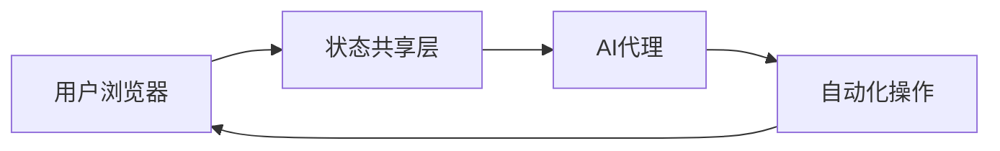

**技术特色**：
- 基于JavaScript构建，跨平台兼容性强
- 浏览器状态共享技术，避免重复登录流程
- 轻量级设计，运行效率高，资源占用低

#### 热度分析

- Star数超万且持续增长，显示项目受到广泛关注和认可
- Open Issues为0，表明项目维护状态良好，问题解决效率高

#### 快速上手

```bash
# 安装ego-lite
npm install -g ego-lite

# 启动服务
ego-lite start
```

#### 注意事项

- 项目License未知，可能存在使用限制或版权问题
- 虽然Open Issues为0，但可能意味着问题被快速关闭而非完全解决
- 项目描述中提到与Codex或Claude Code等AI工具集成，但具体集成方式不明确


### 15. rustdesk/rustdesk — 开源远程桌面

> **一句话总结**：RustDesk 是一款用 Rust 编写的开源远程桌面应用，支持自托管，可作为 TeamViewer 的替代方案。

#### 价值主张

| 维度 | 说明 |
|------|------|
| **解决痛点** | 解决商业远程桌面软件的隐私担忧和成本问题，提供完全自控的远程访问 |
| **目标用户** | 需要远程访问的开发者、IT专业人员、普通用户及重视数据隐私的组织 |
| **核心亮点** | 完全开源自托管 + 跨平台支持 + 端到端加密 + 无需注册账号 + 自定义服务器 |

#### 技术架构

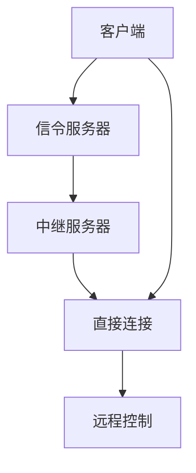

**技术特色**：
- 使用 Rust 语言编写，提供内存安全和性能优势
- 采用 P2P 直连和中继服务器双重连接模式，确保远程连接稳定性
- 支持自定义服务器部署，避免依赖第三方服务
- 实现端到端加密，保障远程会话安全性

#### 热度分析

- 项目 Star 数超过 12 万，近期每日增长约 140+，表明项目受关注度持续上升
- Fork 数近 1.9 万，说明社区参与度高，有大量用户进行二次开发或定制

#### 快速上手

```bash
# 下载并运行 RustDesk
curl -fsSL https://github.com/rustdesk/rustdesk/releases/download/1.2.0/rustdesk-1.2.0-x86_64.AppImage -o rustdesk.AppImage
chmod +x rustdesk.AppImage
./rustdesk.AppImage
```

#### 注意事项

- RustDesk 虽然是开源软件，但需要注意不同国家和地区对远程桌面软件的法律法规
- 默认情况下，RustDesk 使用官方服务器，如需完全自托管需自行搭建服务器
- 在网络受限环境中，可能需要配置端口转发或使用中继服务器以确保连接稳定


### 16. ToolJet/ToolJet — 企业应用构建平台

> **一句话总结**：开源低代码平台，助力企业快速构建内部工具、仪表板和AI应用。

#### 价值主张

| 维度 | 说明 |
|------|------|
| **解决痛点** | 解决企业内部工具开发效率低、成本高的问题 |
| **目标用户** | 企业开发团队、业务分析师、产品经理 |
| **核心亮点** | 低代码开发 + 多数据源集成 + AI能力 + 工作流自动化 + 安全控制 |

#### 技术架构

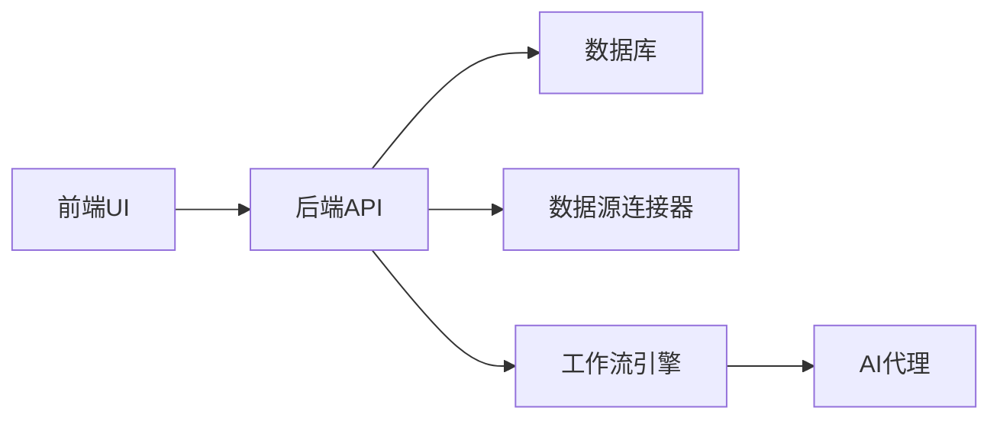

**技术特色**：
- 基于JavaScript的全栈低代码开发框架
- 支持多种数据源连接和集成
- 内置工作流和AI能力
- 提供安全的企业级部署方案
- 模块化架构支持扩展

#### 热度分析

- 项目Star数已超过3.9万，日增130+，增长势头强劲
- 作为开源低代码平台，在数字化转型浪潮中占据重要生态位置

#### 快速上手

```bash
# 克隆项目
git clone https://github.com/ToolJet/ToolJet.git

# 安装依赖并运行
cd ToolJet && npm install && npm run dev
```

#### 注意事项

- 需要Node.js环境运行
- 企业部署建议配置数据库和认证系统
- 部分高级功能可能需要额外配置


### 17. cursor/plugins — AI编辑器插件平台

> **一句话总结**：Cursor编辑器的插件规范与官方插件库，提供AI增强的代码编辑体验。

#### 价值主张

| 维度 | 说明 |
|------|------|
| **解决痛点** | 为AI驱动代码编辑器提供标准化扩展机制，提升开发效率 |
| **目标用户** | Cursor编辑器用户及希望扩展AI编程能力的开发者 |
| **核心亮点** | 统一插件接口规范 + AI功能深度集成 + 多语言框架支持 |

#### 技术架构

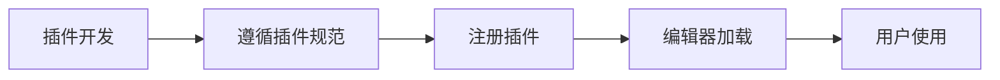

**技术特色**：
- 基于TypeScript的强类型插件API系统
- 与AI模型无缝集成架构
- 支持异步操作和事件驱动机制

#### 热度分析

- 项目获得2800+ stars且持续增长(+41 today)，显示社区对AI辅助编程工具的强烈兴趣
- 作为Cursor编辑器的官方插件库，在AI编程工具生态中占据重要位置

#### 快速上手

```bash
# 创建Cursor插件项目
npx create-cursor-plugin my-plugin
cd my-plugin
npm install
npm run dev
```

#### 注意事项

- 插件开发需严格遵循Cursor特定的API规范
- 项目依赖Cursor编辑器的核心AI功能
- 许可证信息不明确，使用前需确认授权条款


## 今日推荐

| 主题 | 推荐项目 | 亮点 |
|------|----------|------|
| 今日最热 | [cathrynlavery/diagram-design](https://github.com/cathrynlavery/diagram-design) | 29 editorial diag... |
| 值得关注 | [semantica-agi/semantica](https://github.com/semantica-agi/semantica) | Graph-Native Infr... |
| 快速上手 | [github/spec-kit](https://github.com/github/spec-kit) | 💫 Toolkit to help... |
| 长期潜力 | [holaboss-ai/holaOS](https://github.com/holaboss-ai/holaOS) | Open-source All i... |

---

<div align="center">

*Generated on 2026-08-15 | Powered by GitHub Trending Reporter*

</div>