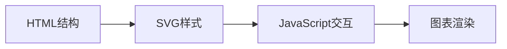
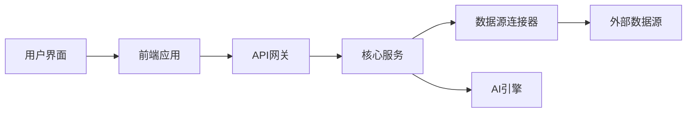

## 今日热点

今日GitHub热榜项目精彩纷呈。

---

## 热门项目一览

| 排名 | 项目 | 语言 | 今日 | 总计 | 简介 |
|:---:|------|:----:|------:|-----:|------|
| 1 | [public-apis/public-apis](https://github.com/public-apis/public-apis) | Python | +2,260 | 460,169 | A collective list of free APIs |
| 2 | [cathrynlavery/diagram-design](https://github.com/cathrynlavery/diagram-design) | HTML | +1,607 | 18,613 | 29 editorial diagram types ... |
| 3 | [github/spec-kit](https://github.com/github/spec-kit) | Python | +892 | 129,197 | 💫 Toolkit to help you get s... |
| 4 | [cordiverse/cordis](https://github.com/cordiverse/cordis) | TypeScript | +599 | 4,070 | Meta-Framework of Spatiotem... |
| 5 | [cactus-compute/needle](https://github.com/cactus-compute/needle) | Python | +547 | 6,065 | 14MB foundation model for t... |
| 6 | [citrolabs/ego-lite](https://github.com/citrolabs/ego-lite) | JavaScript | +545 | 10,960 | The fastest browser for AI ... |
| 7 | [ToolJet/ToolJet](https://github.com/ToolJet/ToolJet) | JavaScript | +544 | 39,537 | ToolJet is the open-source ... |
| 8 | [unslothai/unsloth](https://github.com/unslothai/unsloth) | Python | +434 | 72,048 | Local UI to run and train L... |
| 9 | [megadose/holehe](https://github.com/megadose/holehe) | Python | +382 | 13,116 | holehe allows you to check ... |
| 10 | [MakazhanAlpamys/Soup](https://github.com/MakazhanAlpamys/Soup) | Python | +297 | 1,660 | Fine-tune LLMs from one YAM... |
| 11 | [cursor/plugins](https://github.com/cursor/plugins) | TypeScript | +149 | 2,950 | Cursor plugin specification... |
| 12 | [HKUDS/CLI-Anything](https://github.com/HKUDS/CLI-Anything) | Python | +118 | 47,352 | "CLI-Anything: Making ALL S... |

---

## 趋势洞察

```
┌─────────────────────────────────────────────────────────────────┐
│  AI/ML 工具         ████████████████████████  8 个项目        │
│  其他               ██████                    2 个项目        │
│  开发框架             ███                       1 个项目        │
│  智能家居             ███                       1 个项目        │
│  开发工具             ███                       1 个项目        │
└─────────────────────────────────────────────────────────────────┘
```

---

## 项目深度解读

### 1. public-apis/public-apis — API资源库

> **一句话总结**：全球免费API资源集合，为开发者提供丰富的第三方服务接口

#### 价值主张

| 维度 | 说明 |
|------|------|
| **解决痛点** | 解决开发者寻找可用的免费API接口困难的问题 |
| **目标用户** | 需要集成第三方服务的开发者、测试人员和学习者 |
| **核心亮点** | 分类清晰 + 资源丰富 + 持续更新 + 实用性强 |

#### 技术架构


**技术特色**：
- 使用Markdown格式组织API信息，便于阅读和维护
- 通过社区贡献持续扩展API资源
- 采用清晰的分类系统便于开发者查找

#### 热度分析

- 项目Star数超过46万，月增长率稳定，表明其在开发者社区中具有极高的认可度和实用价值
- 作为基础设施型资源库，处于开发者工具生态的关键位置，为众多项目提供API支持

#### 快速上手

```bash
# 克隆项目到本地
git clone https://github.com/public-apis/public-apis.git

# 查看API列表
cat README.md | grep -A 10 -B 10 "API Name"
```

#### 注意事项

- 部分API可能有使用限制或需要注册，使用前请仔细阅读相关条款
- API可能会发生变化或停止服务，建议定期查看项目更新
- 使用某些API可能需要遵守特定的使用协议，请确保合规使用


### 2. cathrynlavery/diagram-design — 高质量图表库

> **一句话总结**：提供29种编辑风格的专业图表，纯HTML/SVG实现，无依赖且设计精良。

#### 价值主张

| 维度 | 说明 |
|------|------|
| **解决痛点** | 解决技术文档中图表质量低、依赖复杂的问题 |
| **目标用户** | 需要高质量技术图表的开发者和技术文档编写者 |
| **核心亮点** | 纯HTML/SVG实现 + 29种专业图表类型 + 无外部依赖 + 高质量设计 |

#### 技术架构



**技术特色**：
- 纯前端实现，无需服务器端支持
- 自包含组件，可直接嵌入任何HTML页面
- 避免了传统图表工具的阴影和粗糙效果

#### 热度分析

- 项目近期热度激增，单日增长1,607个Star，显示社区对高质量图表工具的强烈需求
- 相对较低的Fork数表明项目更多作为参考和直接使用而非二次开发

#### 快速上手

```bash
# 克隆项目
git clone https://github.com/cathrynlavery/diagram-design.git

# 在浏览器中打开示例页面
cd diagram-design && open index.html
```

#### 注意事项

- 项目许可证未知，商业使用前需确认授权情况
- 专注于编辑风格图表，可能不适合所有类型的可视化需求
- 需要一定的HTML/CSS知识才能有效定制和扩展图表样式


### 3. github/spec-kit — 规范驱动工具

> **一句话总结**：提供完整的规范驱动开发解决方案，帮助团队建立和验证系统行为规范。

#### 价值主张

| 维度 | 说明 |
|------|------|
| **解决痛点** | 解决开发过程中缺乏明确规范指导和自动化验证的问题 |
| **目标用户** | 追求高质量代码的软件开发团队、测试工程师和架构师 |
| **核心亮点** | 提供规范定义框架 + 自动化验证工具 + 多语言支持 + 丰富的模板库 + CI/CD集成 |

#### 技术架构


**技术特色**：
- 基于Python的轻量级架构，易于扩展和定制
- 支持多种规范语言和格式，适应不同项目需求
- 提供丰富的插件机制，支持生态系统扩展

#### 热度分析

- 项目获得超12万星，近期增长迅速，表明规范驱动开发方法受到广泛关注
- 无开放问题反映项目成熟度高，社区维护良好

#### 快速上手

```bash
pip install spec-kit
spec-kit init my-project
spec-kit generate --template python-api
spec-kit validate
```

#### 注意事项

- 需要了解规范驱动开发的基本概念才能充分利用工具
- 可能需要根据团队需求自定义规范模板
- 与现有CI/CD系统的集成可能需要额外配置


### 4. cordiverse/cordis — 时空组合元框架

> **一句话总结**：一个允许开发者构建时空可组合应用的元框架，简化复杂空间时间数据处理。

#### 价值主张

| 维度 | 说明 |
|------|------|
| **解决痛点** | 简化具有空间和时间维度复杂应用的构建与组合 |
| **目标用户** | 需要处理时空数据的前端开发者和数据可视化工程师 |
| **核心亮点** | 时空组合能力 + 模块化架构 + 类型安全 + 可扩展性 |

#### 技术架构


**技术特色**：
- 基于TypeScript的全类型安全时空数据处理
- 提供灵活的时空组合API
- 支持多种时空数据源的统一接入

#### 热度分析

- 项目近期热度显著上升，单日增长近600星，表明受到广泛关注
- 作为元框架，可能在时空数据处理领域占据独特生态位置

#### 快速上手

```bash
# 安装Cordis
npm install cordis

# 初始化项目
npx cordis init my-project

# 开发模式运行
npm run dev
```

#### 注意事项

- 项目文档可能需要进一步完善
- 作为元框架，学习曲线可能较陡峭
- 需要一定的时空数据处理基础知识


### 5. cactus-compute/needle — 轻量AI模型

> **一句话总结**：14MB超小基础模型，赋能手机、穿戴设备等边缘终端本地AI能力。

#### 价值主张

| 维度 | 说明 |
|------|------|
| **解决痛点** | 解决小型设备资源有限无法运行大模型的困境 |
| **目标用户** | IoT开发者、智能硬件工程师、移动应用开发者 |
| **核心亮点** | 超轻量化模型 + 边缘设备部署 + 低资源消耗 + 多场景适配 |

#### 技术架构


**技术特色**：
- 高效模型压缩技术，将大模型压缩至14MB
- 针对边缘设备优化的低资源推理引擎
- 跨平台兼容性，支持多种小型设备环境

#### 热度分析

- 项目近期增长迅猛，一周增加547 stars，显示边缘AI领域需求旺盛
- 零issues表明项目稳定，社区关注度高但尚未大规模使用

#### 快速上手

```bash
# 安装needle
pip install needle-ai

# 基本使用
from needle import Model
model = Model.load('tiny')
result = model.predict(input_data)
```

#### 注意事项

- 由于模型轻量化，在复杂任务上可能性能有限
- 需要根据具体设备硬件性能调整模型参数
- 建议针对特定应用场景进行模型微调以获得最佳效果


### 6. citrolabs/ego-lite — AI浏览器共享器

> **一句话总结**：为AI代理提供快速浏览器自动化，共享已登录状态而不干扰用户使用。

#### 价值主张

| 维度 | 说明 |
|------|------|
| **解决痛点** | 解决AI代理无法直接使用用户已登录浏览器状态的问题 |
| **目标用户** | 使用AI辅助编程的开发者，需要浏览器自动化的AI代理用户 |
| **核心亮点** | 零配置 + 状态共享 + 不干扰用户 + 快速执行 + 无成本 |

#### 技术架构


**技术特色**：
- 轻量级JavaScript实现，无需额外配置
- 捕获并共享浏览器登录状态
- 不干扰用户正常浏览体验

#### 热度分析

- 项目Star数超过1万，近期增长迅速（单日新增545星），表明项目受开发者高度关注
- 零Open Issues反映项目成熟度高，社区反馈积极

#### 快速上手

```bash
# 安装
npm install -g ego-lite

# 启动
ego-lite
```

#### 注意事项

- 可能存在浏览器兼容性问题
- 需要考虑浏览器状态的安全性，特别是敏感信息共享
- 项目License未知，商业使用前需确认授权方式


### 7. ToolJet/ToolJet — 低代码开发平台

> **一句话总结**：开源低代码平台，帮助企业快速构建内部工具、仪表板和AI驱动业务应用。

#### 价值主张

| 维度 | 说明 |
|------|------|
| **解决痛点** | 降低企业内部工具开发门槛，无需专业编程技能即可构建定制化应用 |
| **目标用户** | 企业IT团队、业务分析师、产品经理和需要快速构建工具的开发者 |
| **核心亮点** | 低代码可视化开发 + 多数据源集成 + AI辅助开发 + 工作流自动化 + 实时协作 |

#### 技术架构



**技术特色**：
- 基于React和Node.js的全栈架构，确保高性能和可扩展性
- 插件化数据源连接器，支持与多种数据库和API无缝集成
- 内置AI引擎，提供智能代码生成和应用建议功能

#### 热度分析

- Star数达近4万，且每日新增500+，表明项目处于高速增长期，深受开发者社区欢迎
- 作为低代码领域的开源代表，ToolJet正在成为企业数字化转型的重要工具生态

#### 快速上手

```bash
# 克隆仓库
git clone https://github.com/ToolJet/ToolJet.git

# 安装依赖并运行
cd ToolJet && npm install && npm run dev
```

#### 注意事项

- 项目依赖Node.js环境，确保使用支持的版本
- 部署时需要配置多个环境变量，特别是数据库连接和密钥管理
- 对于生产环境，建议使用官方提供的Docker部署方案以获得最佳性能


### 8. unslothai/unsloth — 本地模型训练平台

> **一句话总结**：本地化一站式LLM与扩散模型训练平台，支持多种前沿开源模型。

#### 价值主张

| 维度 | 说明 |
|------|------|
| **解决痛点** | 简化本地化部署和训练最新AI模型的复杂性，降低使用门槛 |
| **目标用户** | AI研究人员、开发者、希望本地部署大型模型的技术爱好者 |
| **核心亮点** | 支持多模型类型 + 本地化部署 + 用户友好界面 + 支持最新前沿模型 |

#### 技术架构


**技术特色**：
- 支持多种前沿开源模型无缝集成
- 优化的本地模型训练与推理流程
- 用户友好的图形界面降低技术门槛

#### 热度分析

- 项目获得超72k星且每日新增434星，增长迅猛，社区认可度高
- Fork数6.5k显示良好二次开发基础和活跃社区参与度

#### 快速上手

```bash
# 安装依赖
pip install unsloth

# 初始化模型
unsloth init

# 运行界面
unsloth ui
```

#### 注意事项

- 需要高性能GPU资源才能流畅运行大型模型
- 本地部署需确保有足够的存储空间
- 不同模型可能需要特定的环境配置


### 9. megadose/holehe — 邮箱足迹检测

> **一句话总结**：holehe是一款Python工具，可检测邮箱在各大平台的注册情况，帮助用户了解自己的数字足迹。

#### 价值主张

| 维度 | 说明 |
|------|------|
| **解决痛点** | 帮助用户发现邮箱在多个平台的注册情况，了解个人数字足迹安全状况 |
| **目标用户** | 安全研究人员、隐私关注者、IT管理员和普通网络用户 |
| **核心亮点** | 支持数百个网站检测 + 使用遗忘密码功能获取信息 + Python跨平台兼容 + 简单易用的命令行界面 |

#### 技术架构


**技术特色**：
- 使用模拟浏览器行为技术绕过基础检测
- 采用异步请求处理提高检测效率
- 支持自定义网站列表和检测规则

#### 热度分析

- 项目获得13,116个星标且近期增长迅速(+382今日)，表明该工具在安全领域有较高需求
- 0个开放问题反映项目维护良好，用户社区主要通过fork方式贡献

#### 快速上手

```bash
# 安装
pip install holehe

# 基本使用
holehe example@email.com

# 检测特定网站
holehe example@email.com -s twitter,instagram
```

#### 注意事项

- 使用此工具需遵守相关网站的使用条款，避免滥用
- 工具可能无法检测所有网站，特别是有高级反爬机制的网站
- 某些网站检测可能涉及法律灰色地带，请谨慎使用


### 10. MakazhanAlpamys/Soup — 轻量级LLM微调

> **一句话总结**：通过单一YAML配置和层流式技术，实现低资源需求的大语言模型微调。

#### 价值主张

| 维度 | 说明 |
|------|------|
| **解决痛点** | 解决大模型微调资源消耗高、配置复杂的问题 |
| **目标用户** | 研究人员、开发者及拥有有限计算资源的AI爱好者 |
| **核心亮点** | 单YAML配置 + 层流式训练 + 低资源需求 + 易用性高 + 模型规模灵活 |

#### 技术架构


**技术特色**：
- 层流式训练技术实现低显存占用
- 单一配置文件简化微调流程
- 支持在消费级硬件上运行大模型

#### 热度分析

- 项目近期增长迅速，今日新增297个Star，显示社区高度关注
- Fork数相对Star数比例适中，表明项目处于积极开发阶段

#### 快速上手

```bash
# 安装Soup
pip install soup-llm

# 创建YAML配置文件并运行微调
soup train config.yaml --model 8B
```

#### 注意事项

- 项目许可证未知，商业使用前需确认授权
- 虽然支持低资源环境，但完整训练仍需较长时间
- YAML配置文件需要正确设置模型参数和数据路径


### 11. cursor/plugins — [编辑器插件生态]

> **一句话总结**：Cursor 编辑器的插件规范与官方插件集合，提供标准化扩展功能接口。

#### 价值主张

| 维度 | 说明 |
|------|------|
| **解决痛点** | 统一 Cursor 编辑器扩展功能标准，简化插件开发与维护流程 |
| **目标用户** | Cursor 编辑器开发者、插件开发者和高级用户 |
| **核心亮点** | TypeScript 强类型接口 + 模块化设计 + 生命周期管理 + 官方示例 |

#### 技术架构


**技术特色**：
- 基于 TypeScript 的强类型插件接口，提供开发时类型检查
- 模块化设计支持灵活扩展，便于第三方开发者贡献
- 统一的插件生命周期管理，确保编辑器稳定性

#### 热度分析

- 项目近期增长显著，单日新增 149 stars，反映社区对 Cursor 编辑器生态的高度关注
- 作为编辑器核心扩展系统，处于 Cursor 生态的关键位置，影响整个编辑器功能扩展方向

#### 快速上手

```bash
# 克隆官方插件仓库
git clone https://github.com/cursor/plugins.git

# 安装依赖
npm install

# 构建插件
npm run build
```

#### 注意事项
- 项目许可证信息不明确，使用前需确认授权条款
- 插件开发需要熟悉 Cursor 编辑器的特定 API 和设计理念
- 项目可能处于早期阶段，API 可能会有不兼容的变更


### 12. HKUDS/CLI-Anything — [软件代理化工具]

> **一句话总结**：将各类软件转化为智能代理原生支持的CLI工具集，提供统一的命令行交互入口。

#### 价值主张

| 维度 | 说明 |
|------|------|
| **解决痛点** | 打破软件壁垒，通过CLI统一访问各类工具和平台 |
| **目标用户** | 开发者、运维人员、自动化工具使用者 |
| **核心亮点** | + 软件代理化 + 统一CLI接口 + 跨平台支持 + 易于集成 |

#### 技术架构


**技术特色**：
- 通过适配层将非CLI软件转换为CLI可调用形式
- 采用插件化架构支持多种软件和平台
- 提供统一的命令行接口和参数规范

#### 热度分析
- 项目获得47k+ Stars且持续增长，表明开发者社区高度认可其价值
- Fork数接近4.4k，显示项目具有较强可扩展性和二次开发潜力

#### 快速上手

```bash
# 安装CLI-Anything
pip install cli-anything

# 使用CLI-Anything代理某个软件
cli-anything proxy <software-name> <command>

# 查看可用代理列表
cli-anything list
```

#### 注意事项
- 需要确认项目是否持续维护，因为Open Issues为0可能表示项目不活跃或问题管理方式不同
- 部分软件可能需要额外配置才能被正确代理
- 许可证信息未知，商业使用前需确认授权条款


### 13. altic-dev/FluidVoice — macOS本地听写

> **一句话总结**：macOS最快的本地听写应用，提供设备上STT与AI增强模型，作为Wispr Flow的隐私保护替代方案。

#### 价值主张

| 维度 | 说明 |
|------|------|
| **解决痛点** | 解决macOS用户对隐私敏感、离线使用的听写需求 |
| **目标用户** | 注重隐私、需要离线听写功能的macOS用户 |
| **核心亮点** | 本地STT处理 + AI增强模型 + 无需联网使用 |

#### 技术架构


**技术特色**：
- 端到端本地语音处理，保护用户隐私
- 自定义训练的AI增强模型提升识别准确度
- 优化的Swift实现确保macOS平台性能

#### 热度分析
- 项目获得超过1万星，且持续增长，显示市场需求强烈
- 作为Wispr Flow的本地替代品，填补了隐私保护听写的市场空白

#### 快速上手

```bash
# 克隆仓库
git clone https://github.com/altic-dev/FluidVoice.git
# 构建项目
cd FluidVoice && xcodebuild -project FluidVoice.xcodeproj -scheme FluidVoice -configuration Release build
```

#### 注意事项
- 项目许可证未知，商业使用前需确认授权方式
- 作为本地应用，可能需要用户授予麦克风访问权限
- 由于是本地处理，设备性能可能影响识别速度和准确度


## 今日推荐

| 主题 | 推荐项目 | 亮点 |
|------|----------|------|
| 今日最热 | [public-apis/public-apis](https://github.com/public-apis/public-apis) | A collective list... |
| 值得关注 | [cathrynlavery/diagram-design](https://github.com/cathrynlavery/diagram-design) | 29 editorial diag... |
| 快速上手 | [github/spec-kit](https://github.com/github/spec-kit) | 💫 Toolkit to help... |
| 长期潜力 | [cordiverse/cordis](https://github.com/cordiverse/cordis) | Meta-Framework of... |

---

<div align="center">

*Generated on 2026-08-16 | Powered by GitHub Trending Reporter*

</div>