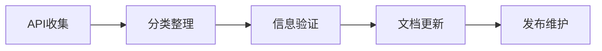
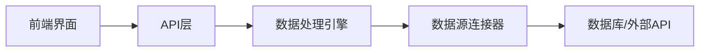

## 今日热点

AI工具本地化与开源替代品成为今日焦点，从LLM运行平台到视频编辑工具，开发者持续追求轻量级、专用化解决方案，边缘计算与小型模型受关注。

---

## 热门项目一览

| 排名 | 项目 | 语言 | 今日 | 总计 | 简介 |
|:---:|------|:----:|------:|-----:|------|
| 1 | [public-apis/public-apis](https://github.com/public-apis/public-apis) | Python | +1,588 | 461,746 | A collective list of free APIs |
| 2 | [cordiverse/cordis](https://github.com/cordiverse/cordis) | TypeScript | +720 | 4,716 | Meta-Framework of Spatiotem... |
| 3 | [unslothai/unsloth](https://github.com/unslothai/unsloth) | Python | +572 | 72,572 | Local UI to run and train L... |
| 4 | [ToolJet/ToolJet](https://github.com/ToolJet/ToolJet) | JavaScript | +452 | 40,025 | ToolJet is the open-source ... |
| 5 | [cactus-compute/needle](https://github.com/cactus-compute/needle) | Python | +443 | 6,563 | 14MB foundation model for t... |
| 6 | [basecamp/omarchy](https://github.com/basecamp/omarchy) | Shell | +270 | 25,375 | Beautiful, Modern & Opinion... |
| 7 | [OpenCut-app/OpenCut](https://github.com/OpenCut-app/OpenCut) | TypeScript | +150 | 83,887 | The open-source CapCut alte... |

---

## 趋势洞察

```
┌─────────────────────────────────────────────────────────────────┐
│  AI/ML 工具         ████████████████████████  2 个项目        │
│  其他               ████████████████████████  2 个项目        │
│  开发框架             ████████████              1 个项目        │
│  多媒体应用            ████████████              1 个项目        │
│  智能家居             ████████████              1 个项目        │
└─────────────────────────────────────────────────────────────────┘
```

---

## 项目深度解读

### 1. public-apis/public-apis — 免费API资源库

> **一句话总结**：项目收集整理了大量免费可用的公共API，为开发者提供便捷的接口资源。

#### 价值主张

| 维度 | 说明 |
|------|------|
| **解决痛点** | 开发者寻找免费、可用的公共API资源时缺乏统一平台，耗费大量时间搜索验证 |
| **目标用户** | 需要集成第三方服务的开发者、测试人员、学习API技术的学生 |
| **核心亮点** | 覆盖广泛API类型 + 每个API包含详细使用信息 + 定期更新维护 + 按类别分类整理 + 提供直接访问链接 |

#### 技术架构



**技术特色**：
- 采用Markdown格式存储API信息，便于维护和阅读
- 可能使用脚本自动验证API可用性
- 通过GitHub协作模式实现多人共同维护API列表

#### 热度分析

- 项目获得46万+星标，每日新增近1600星，表明开发者对免费API资源有极高需求
- 作为API资源集散地，已成为开发者社区中不可或缺的参考工具

#### 快速上手

```bash
# 克隆项目到本地
git clone https://github.com/public-apis/public-apis.git

# 查看README了解使用方法
cat public-apis/README.md
```

#### 注意事项

- API可能随时变更或停止服务，使用前需验证可用性
- 部分API可能需要注册获取密钥
- 注意遵守各API的使用条款和限制


### 2. cordiverse/cordis — 时空元框架

> **一句话总结**：提供时空数据组合的元框架，实现复杂应用的高效构建与灵活扩展。

#### 价值主张

| 维度 | 说明 |
|------|------|
| **解决痛点** | 简化时空应用开发，解决传统框架在处理时空变化时的局限性 |
| **目标用户** | 需要构建数据可视化、地理信息系统和物联网应用的开发者 |
| **核心亮点** | 元框架设计 + 时空数据专用处理 + TypeScript类型安全 + 高度可组合性 |

#### 技术架构


**技术特色**：
- 基于TypeScript的类型安全设计
- 模块化架构支持灵活组合
- 时空数据专用处理能力

#### 热度分析

- 项目Star数快速增长(+720 today)，表明近期获得广泛关注或重要更新
- 高Star/Fork比例(约19:1)，显示项目具有较高的采用率和社区认可度

#### 快速上手

```bash
# 安装项目依赖
npm install cordiverse/cordis

# 初始化项目
npx cordis init my-project

# 开发模式运行
npm run dev
```

#### 注意事项

- 项目License未知，使用前需确认许可协议
- 作为近期快速发展的项目，API和功能可能仍在快速变化中
- 需要一定的时空数据处理知识才能充分发挥框架优势


### 3. unslothai/unsloth — 大模型本地化平台

> **一句话总结**：本地UI平台支持运行和训练多种大语言模型和扩散模型。

#### 价值主张

| 维度 | 说明 |
|------|------|
| **解决痛点** | 解决大模型本地化部署和训练的高门槛问题 |
| **目标用户** | AI研究人员、开发者和企业技术团队 |
| **核心亮点** | 支持多模型 + 本地部署 + 低资源需求 + 用户友好界面 |

#### 技术架构


**技术特色**：
- 高效的本地模型推理优化技术
- 支持多种主流大语言模型和扩散模型
- 低资源需求，适合个人工作站使用

#### 热度分析

- Star数超过7.2万，近572日增长，显示项目处于快速增长阶段
- Fork数6500+，表明开发者社区参与度高，项目具有实用价值

#### 快速上手

由于项目具体安装和使用信息不明确，建议参考项目README获取详细指南。

#### 注意事项

- 项目许可证未知，商业使用前需确认授权条款
- 本地运行需要足够的计算资源，尤其是大模型训练
- 可能需要较新的GPU硬件以获得最佳性能


### 4. ToolJet/ToolJet — 企业低代码平台

> **一句话总结**：开源低代码平台，帮助企业快速构建内部工具、仪表盘和AI驱动的业务应用。

#### 价值主张

| 维度 | 说明 |
|------|------|
| **解决痛点** | 降低企业内部工具开发门槛，无需专业编码即可构建复杂应用 |
| **目标用户** | 企业开发团队、业务分析师、产品经理，需要快速构建内部工具的团队 |
| **核心亮点** | 可视化界面构建 + 多数据源集成 + AI辅助开发 + 工作流自动化 + 企业级安全性 |

#### 技术架构



**技术特色**：
- 基于JavaScript的全栈架构，支持前端和后端开发
- 提供丰富的数据源连接器，支持多种数据库和API集成
- 采用模块化设计，便于扩展和定制

#### 热度分析

- Star数达4万+，单日增长452，表明项目受关注度高且增长迅速
- Fork数5千+，说明社区活跃度高，有较多二次开发或实验性使用

#### 快速上手

```bash
# 克隆仓库
git clone https://github.com/ToolJet/ToolJet.git

# 安装依赖
npm install

# 启动开发服务器
npm run dev
```

#### 注意事项

- 项目依赖较多，需要确保Node.js环境兼容
- 生产环境部署需要配置数据库和环境变量
- 许可证信息不明确，使用前需确认商业应用条款


### 5. cactus-compute/needle — 轻量设备模型

> **一句话总结**：14MB超轻量级基础模型，专为手机、可穿戴设备等资源受限设备设计。

#### 价值主张

| 维度 | 说明 |
|------|------|
| **解决痛点** | 大型AI模型无法在资源受限设备上运行的问题 |
| **目标用户** | 嵌入式开发者、IoT设备制造商、移动应用开发者 |
| **核心亮点** | 超轻量级 + 资源高效 + 设备兼容性广泛 |

#### 技术架构


**技术特色**：
- 模型压缩技术，将大型模型压缩至14MB
- 优化推理算法，适合低功耗设备
- 跨平台兼容性，支持多种硬件架构

#### 热度分析

- 项目近期增长迅速，单日增长443个star，表明社区对该方向的高度关注
- 作为轻量级AI模型领域的代表项目，在边缘计算和物联网领域具有重要生态位置

#### 快速上手

```bash
# 安装
pip install needle

# 基本使用
import needle
model = needle.load("tiny-model")
result = model.predict(input_data)
```

#### 注意事项

- 模型大小虽小，但可能牺牲一定的准确性
- 需要根据具体设备资源情况进行优化调整
- 可能需要针对特定任务进行微调以获得最佳性能


### 6. basecamp/omarchy — [美学Linux配置]

> **一句话总结**：Basecamp 打造的注重美学体验和一致性的 Linux 工作环境配置方案。

#### 价值主张

| 维度 | 说明 |
|------|------|
| **解决痛点** | 提供美观、统一且高效的 Linux 工作环境，解决传统 Linux 界面不一致和美学体验问题 |
| **目标用户** | 开发者、设计师和技术团队，特别是注重界面美感和工作效率的用户 |
| **核心亮点** |


### 7. OpenCut-app/OpenCut — 开源视频剪辑

> **一句话总结**：开源替代CapCut的视频编辑工具，提供专业级剪辑功能与跨平台支持。

#### 价值主张

| 维度 | 说明 |
|------|------|
| **解决痛点** | 提供免费开源的视频编辑解决方案，替代商业软件 |
| **目标用户** | 内容创作者、短视频制作者、开源爱好者 |
| **核心亮点** | 跨平台支持 + 专业剪辑功能 + 开源可定制 |

#### 技术架构


**技术特色**：
- 基于TypeScript开发，保证类型安全与可维护性
- 模块化设计，支持插件扩展功能
- 高性能渲染引擎，支持实时预览

#### 热度分析

- 高Star增长率(+150/天)显示社区活跃度高，用户需求强烈
- 零Open Issues表明项目维护良好，问题解决及时

#### 快速上手

```bash
# 克隆项目
git clone https://github.com/OpenCut-app/OpenCut.git

# 安装依赖
npm install

# 启动开发环境
npm run dev
```

#### 注意事项

- 项目可能处于早期阶段，功能可能不完整
- 需要一定的技术背景才能贡献代码或进行深度定制
- 导出功能可能受限于特定格式或编解码器支持


## 今日推荐

| 主题 | 推荐项目 | 亮点 |
|------|----------|------|
| 今日最热 | [public-apis/public-apis](https://github.com/public-apis/public-apis) | A collective list... |
| 值得关注 | [cordiverse/cordis](https://github.com/cordiverse/cordis) | Meta-Framework of... |
| 快速上手 | [unslothai/unsloth](https://github.com/unslothai/unsloth) | Local UI to run a... |
| 长期潜力 | [ToolJet/ToolJet](https://github.com/ToolJet/ToolJet) | ToolJet is the op... |

---

<div align="center">

*Generated on 2026-08-17 | Powered by GitHub Trending Reporter*

</div>