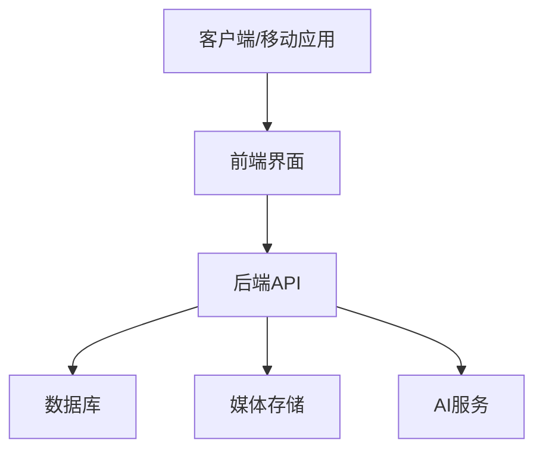

## 今日热点

今日GitHub热榜显示AI应用工具持续爆发，特别是垂直领域AI解决方案如网络安全、求职和内容生成工具热度飙升，同时Rust语言在基础设施和性能敏感型项目中表现突出。

---

## 热门项目一览

| 排名 | 项目 | 语言 | 今日 | 总计 | 简介 |
|:---:|------|:----:|------:|-----:|------|
| 1 | [harry0703/MoneyPrinterTurbo](https://github.com/harry0703/MoneyPrinterTurbo) | Python | +1,189 | 106,009 | 利用 AI 大模型和自动化工作流，根据主题或关键词一键... |
| 2 | [cordiverse/cordis](https://github.com/cordiverse/cordis) | TypeScript | +957 | 5,578 | Meta-Framework of Spatiotem... |
| 3 | [usestrix/strix](https://github.com/usestrix/strix) | Python | +598 | 54,163 | Open-source AI penetration ... |
| 4 | [agalwood/Motrix](https://github.com/agalwood/Motrix) | TypeScript | +344 | 53,073 | A full-featured download ma... |
| 5 | [santifer/career-ops](https://github.com/santifer/career-ops) | JavaScript | +218 | 64,637 | Open-source AI job search: ... |
| 6 | [akitaonrails/ai-memory](https://github.com/akitaonrails/ai-memory) | Rust | +207 | 2,050 | Solution for long term memo... |
| 7 | [mukul975/Anthropic-Cybersecurity-Skills](https://github.com/mukul975/Anthropic-Cybersecurity-Skills) | Python | +198 | 28,421 | 817 structured cybersecurit... |
| 8 | [AlexsJones/llmfit](https://github.com/AlexsJones/llmfit) | Rust | +198 | 32,264 | Hundreds of models & provid... |
| 9 | [immich-app/immich](https://github.com/immich-app/immich) | TypeScript | +175 | 111,152 | High performance self-hoste... |
| 10 | [nautechsystems/nautilus_trader](https://github.com/nautechsystems/nautilus_trader) | Rust | +120 | 25,911 | Production-grade Rust-nativ... |
| 11 | [jundot/omlx](https://github.com/jundot/omlx) | Python | +78 | 18,986 | LLM inference server with c... |

---

## 趋势洞察

```
┌─────────────────────────────────────────────────────────────────┐
│  AI/ML 工具         ████████████████████████  7 个项目        │
│  其他               ██████                    2 个项目        │
│  开发框架             ███                       1 个项目        │
│  多媒体应用            ███                       1 个项目        │
└─────────────────────────────────────────────────────────────────┘
```

---

## 项目深度解读

### 1. harry0703/MoneyPrinterTurbo — AI视频生成器

> **一句话总结**：基于大模型的AI工具，一键将关键词转化为高质量短视频内容，极大降低视频创作门槛。

#### 价值主张

| 维度 | 说明 |
|------|------|
| **解决痛点** | 降低视频内容创作技术门槛与成本，非专业用户也能快速生成专业视频 |
| **目标用户** | 内容创作者、营销人员、自媒体运营者、短视频爱好者 |
| **核心亮点** | AI自动生成 + 高清视频输出 + 一键操作 + 多场景适配 + 无需专业技能 |

#### 技术架构


**技术特色**：
- 基于大模型的智能内容生成
- 自动化视频编辑流程
- 高清视频输出技术
- 一键式操作简化流程

#### 热度分析

- 项目Star数已超10万，近期增长迅速，日均新增约1,000+，表明市场热度极高
- 高Fork数(1.6万+)显示社区活跃度高，项目在AI视频生成领域具有显著影响力

#### 快速上手

```bash
# 安装依赖
pip install -r requirements.txt

# 运行项目
python MoneyPrinterTurbo.py --keyword "科技前沿" --output output.mp4
```

#### 注意事项

- 由于使用AI模型，可能需要较强的计算资源
- 生成的视频内容可能需要人工审核，避免不当内容
- 项目可能需要配置API密钥等认证信息


### 2. cordiverse/cordis — 时空组合元框架

> **一句话总结**：专注于时空维度的组件组合元框架，提供高级组件组合能力。

#### 价值主张

| 维度 | 说明 |
|------|------|
| **解决痛点** | 解决组件在时空维度上组合的复杂性与可维护性问题 |
| **目标用户** | 需要处理复杂UI交互的前端开发者与框架构建者 |
| **核心亮点** | 时空组合能力 + 元框架设计 + 高度可组合性 + TypeScript类型安全 |

#### 技术架构


**技术特色**：
- 基于TypeScript构建，提供完整的类型安全
- 元框架架构，支持多种组合模式与扩展
- 时空维度处理能力，实现复杂的交互组合

#### 热度分析

- 项目近期获得显著关注，Star数达5578且单日增长957
- Fork数相对较少，表明项目可能处于评估阶段，实际应用尚未广泛展开

#### 快速上手

```bash
# 安装项目
npm install cordis

# 初始化项目
npx cordis init my-app

# 运行开发服务器
cordis dev
```

#### 注意事项

- 项目许可证未知，使用前需确认授权条款
- 作为元框架，可能需要一定的学习曲线和概念理解
- 时空组合概念较为抽象，初次使用可能需要适应期


### 3. usestrix/strix — AI安全扫描器

> **一句话总结**：基于AI的自动化渗透测试工具，智能发现并修复应用安全漏洞。

#### 价值主张

| 维度 | 说明 |
|------|------|
| **解决痛点** | 自动化检测安全漏洞，减少人工渗透测试工作量 |
| **目标用户** | 安全研究人员、开发团队、渗透测试工程师 |
| **核心亮点** | AI驱动漏洞检测 + 自动化渗透测试 + 详细修复建议 |

#### 技术架构


**技术特色**：
- 基于机器学习的智能漏洞识别
- 多种攻击向量自动化测试
- 可扩展的漏洞检测框架

#### 热度分析

- 项目Star数超5.4万且持续增长，表明在安全领域有重要影响力
- 高社区活跃度，近6千Fork显示用户积极参与项目扩展

#### 快速上手

```bash
# 克隆项目
git clone https://github.com/usestrix/strix.git
cd strix

# 安装依赖并运行
pip install -r requirements.txt
python strix.py --target https://example.com
```

#### 注意事项

- 许可证信息不明确，使用前需确认授权条款
- 仅应用于有授权的系统，避免法律风险
- AI检测结果需人工验证，确保准确性


### 4. agalwood/Motrix — 全能下载工具

> **一句话总结**：跨平台全能下载工具，支持多种协议和任务管理，提升下载效率与体验。

#### 价值主张

| 维度 | 说明 |
|------|------|
| **解决痛点** | 解决多文件下载、断点续传、速度限制等下载管理难题。 |
| **目标用户** | 需要高效下载大量文件的开发者和普通用户。 |
| **核心亮点** | 跨平台支持 + 多协议下载 + 任务队列管理 + 下载速度控制 + 断点续传 |

#### 技术架构


**技术特色**：
- 基于TypeScript开发，提供类型安全和跨平台兼容性
- 采用多线程下载技术，提升下载速度和稳定性
- 支持多种下载协议(HTTP/HTTPS/FTP/BitTorrent等)

#### 热度分析

- 高星项目持续增长，表明社区认可度高，功能完善且稳定。
- 作为开源下载工具，在同类项目中具有显著影响力，用户基础庞大。

#### 快速上手

```bash
# 克隆项目
git clone https://github.com/agalwood/Motrix.git

# 安装依赖
npm install

# 启动应用
npm run start
```

#### 注意事项

- 项目许可证未知，商业使用前需确认授权
- 作为下载工具，需注意版权和合法下载内容
- 长时间大量下载可能对系统资源占用较高


### 5. santifer/career-ops — AI求职助手

> **一句话总结**：开源AI求职助手，自动扫描职位、评分筛选、优化简历并追踪申请。

#### 价值主张

| 维度 | 说明 |
|------|------|
| **解决痛点** | 求职者面临海量职位信息筛选困难，缺乏系统化评估方法 |
| **目标用户** | 正在寻找技术职位的开发者、工程师和IT专业人士 |
| **核心亮点** | AI职位评分系统 + 智能简历匹配 + 本地化隐私保护 |

#### 技术架构


**技术特色**：
- 本地化运行保护用户求职隐私数据
- 多AI CLI兼容性(Claude, Codex等无缝集成)
- 结构化A-F评分转化为1.0-5.0分制量化评估

#### 热度分析

- 6.4万+高星表明项目解决了求职市场的痛点需求，持续获得技术社区认可
- 零开放问题反映项目维护良好，用户反馈机制可能通过其他渠道进行

#### 快速上手

```bash
# 克隆项目到本地
git clone https://github.com/santifer/career-ops.git
# 在支持的AI CLI中运行
career-ops
```

#### 注意事项

- 需要安装支持的AI编码CLI环境(Claude Code, Codex等)
- 项目许可证不明确，使用前需确认商业使用条款
- 可能需要配置职位数据源API密钥


### 6. akitaonrails/ai-memory — AI长期记忆存储

> **一句话总结**：为AI代理提供长期记忆存储解决方案，实现跨代理供应商的记忆交接与共享。

#### 价值主张

| 维度 | 说明 |
|------|------|
| **解决痛点** | AI代理缺乏长期记忆，无法跨会话保留信息 |
| **目标用户** | 开发AI代理工具的工程师和研究人员 |
| **核心亮点** | 跨供应商兼容性 + 持久化存储 + 高效检索 + 隐私保护 |

#### 技术架构


**技术特色**：
- 使用Rust实现高性能内存管理
- 支持多种AI代理供应商接口
- 提供安全的记忆隔离机制
- 实现高效记忆检索算法

#### 热度分析

- 项目Star数快速增长，近期日增207，显示社区高度关注
- 虽Issues为0，但Fork数表明开发者积极参与二次开发

#### 快速上手

```bash
# 安装ai-memory
cargo install ai-memory

# 初始化记忆存储
ai-memory init

# 连接AI代理
ai-memory connect --agent-type openai
```

#### 注意事项

- 注意数据隐私保护，确保记忆内容的安全存储
- 不同AI供应商可能有不同的API限制，需适配处理
- 记忆存储可能需要定期清理以避免性能问题


### 7. mukul975/Anthropic-Cybersecurity-Skills — AI安全技能库

> **一句话总结**：结构化网络安全技能库，映射六大安全框架，支持多平台AI助手使用

#### 价值主张

| 维度 | 说明 |
|------|------|
| **解决痛点** | 网络安全技能分散，缺乏统一标准和跨平台兼容性 |
| **目标用户** | 安全研究人员、AI开发者、网络安全专业人员 |
| **核心亮点** | 817种结构化技能 + 六大框架映射 + 20+平台兼容 + 29安全领域覆盖 |

#### 技术架构


**技术特色**：
- 采用标准化结构存储网络安全技能，便于AI理解和处理
- 多框架映射技术，实现跨标准技能转换
- 轻量级API设计，支持多种AI平台集成

#### 热度分析

- 项目获得28,421个Star，显示网络安全AI技能库领域的高关注度
- 兼容主流AI平台，在AI赋能安全领域处于生态核心位置

#### 快速上手

```bash
# 克隆项目
git clone https://github.com/mukul975/Anthropic-Cybersecurity-Skills.git

# 查看技能列表
cat agentskills.json | jq '.[].name' | head -20
```

#### 注意事项

- 项目主要提供技能数据，需要配合AI平台或工具才能使用
- 技能映射可能需要根据具体安全场景进行调整
- 定期更新以跟进网络安全框架的最新变化


### 8. AlexsJones/llmfit — 硬件适配检测

> **一句话总结**：一站式AI模型硬件适配检测工具，快速识别硬件能运行的LLM模型，优化资源利用。

#### 价值主张

| 维度 | 说明 |
|------|------|
| **解决痛点** | 解决用户难以确定哪些AI模型能在其硬件上运行的问题 |
| **目标用户** | AI开发者、研究人员及需要部署本地模型的用户 |
| **核心亮点** | 支持数百种模型和提供商 + 硬件自动检测 + 一键适配推荐 |

#### 技术架构


**技术特色**：
- 基于Rust的高性能实现，确保检测速度
- 广泛的模型和提供商支持矩阵
- 硬件资源精确评估算法

#### 热度分析

- 项目获得超过3.2万星，单日增长近200，表明AI模型本地化部署需求激增
- 在AI工具生态中占据重要位置，成为模型部署前的必要检测工具

#### 快速上手

```bash
# 安装llmfit
cargo install llmfit

# 检测硬件并获取推荐模型
llmfit detect

# 查看特定模型在当前硬件上的运行情况
llmfit check model_name
```

#### 注意事项

- 需要确保系统已安装最新版Rust环境
- 首次运行可能需要下载模型数据库，建议有稳定网络连接
- 对于复杂硬件配置，可能需要额外参数调整


### 9. immich-app/immich — 自托管图库系统

> **一句话总结**：高性能自托管照片视频管理系统，支持智能搜索、AI人脸识别和设备同步。

#### 价值主张

| 维度 | 说明 |
|------|------|
| **解决痛点** | 个人用户与小团队安全高效私有化存储管理照片视频，替代商业云服务 |
| **目标用户** | 注重隐私的个人用户、摄影爱好者、小型团队和企业 |
| **核心亮点** | 自托管保护数据隐私 + AI人脸识别 + 设备自动同步 + 高性能处理 + 智能搜索 |

#### 技术架构



**技术特色**：
- 基于TypeScript的全栈开发，确保类型安全
- 采用微服务架构，支持高并发处理
- 利用WebRTC实现设备间直接同步，减少服务器负载

#### 热度分析

- Star数超11万且持续增长，表明项目受到社区广泛认可，自托管图库需求旺盛
- Issue数量为0可能反映项目维护良好或问题通过其他渠道解决，社区参与度高

#### 快速上手

```bash
# 使用Docker Compose快速部署
git clone https://github.com/immich-app/immich.git
cd immich
docker-compose up -d
```

#### 注意事项

- 需要较大的存储空间来存储照片和视频
- AI功能可能需要额外的计算资源
- 定期备份数据库和媒体文件以确保数据安全


### 10. nautechsystems/nautilus_trader — 高性能交易引擎

> **一句话总结**：生产级Rust原生交易引擎，提供确定性事件驱动架构和完整市场模拟功能。

#### 价值主张

| 维度 | 说明 |
|------|------|
| **解决痛点** | 解决高性能、低延迟交易系统开发难题，确保交易逻辑的确定性执行 |
| **目标用户** | 量化交易开发者、高频交易机构、金融科技公司 |
| **核心亮点** | 全功能交易引擎 + 多资产支持 + 事件驱动架构 + 回测系统 + 生产就绪 |

#### 技术架构


**技术特色**：
- 基于Rust的高性能内存安全架构，确保零GC延迟
- 确定性事件驱动设计，保证交易逻辑的一致性
- 完整的交易生命周期管理，从订单生成到结算

#### 热度分析

- 项目Star数超过25k且持续增长(+120/day)，表明在量化交易领域获得广泛认可
- 高关注度但零未解决问题，显示项目成熟度高且维护良好

#### 快速上手

```bash
# 克隆项目
git clone https://github.com/nautechsystems/nautilus_trader.git
# 进入目录
cd nautilus_trader
# 运行示例
cargo run --example basic_trading_bot
```

#### 注意事项

- 项目依赖Rust生态系统，需要熟悉Rust编程语言
- 高频交易场景下需要充分理解底层架构以确保最佳性能
- 部署到生产环境前需进行充分的风险评估和测试


### 11. jundot/omlx — Apple LLM 服务器

> **一句话总结**：专为 Apple Silicon 设计的高性能 LLM 推理服务器，支持连续批处理与 SSD 缓存。

#### 价值主张

| 维度 | 说明 |
|------|------|
| **解决痛点** | 解决 Apple Silicon 上运行大型语言模型的性能与资源管理问题 |
| **目标用户** | macOS 开发者、研究人员及需要本地部署 LLM 的用户 |
| **核心亮点** | 菜单栏管理 + 连续批处理 + SSD 缓存优化 |

#### 技术架构


**技术特色**：
- 基于 Apple Silicon 的 Metal 优化加速
- 连续批处理提高吞吐量
- SSD 智能缓存减少内存占用

#### 热度分析

- Star 数接近 19K 且持续增长，表明项目在 Apple LLM 生态中备受关注
- 零 Open Issues 可能反映项目成熟度高或社区通过其他渠道沟通

#### 快速上手

```bash
# 安装 omlx
pip install omlx

# 启动服务
omlx serve
```

#### 注意事项

- 项目仅支持 Apple Silicon Mac，Intel Mac 无法使用
- 可能需要足够的 SSD 空间用于模型缓存
- 需要一定的技术背景配置模型参数


## 今日推荐

| 主题 | 推荐项目 | 亮点 |
|------|----------|------|
| 今日最热 | [harry0703/MoneyPrinterTurbo](https://github.com/harry0703/MoneyPrinterTurbo) | 利用 AI 大模型和自动化工作流，... |
| 值得关注 | [cordiverse/cordis](https://github.com/cordiverse/cordis) | Meta-Framework of... |
| 快速上手 | [usestrix/strix](https://github.com/usestrix/strix) | Open-source AI pe... |
| 长期潜力 | [agalwood/Motrix](https://github.com/agalwood/Motrix) | A full-featured d... |

---

<div align="center">

*Generated on 2026-08-18 | Powered by GitHub Trending Reporter*

</div>