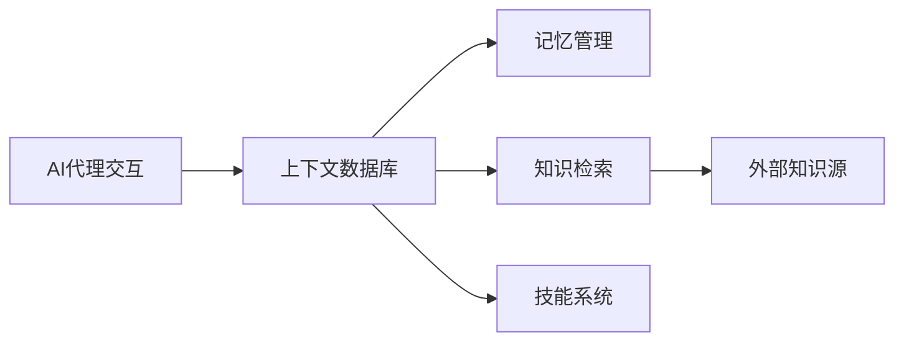
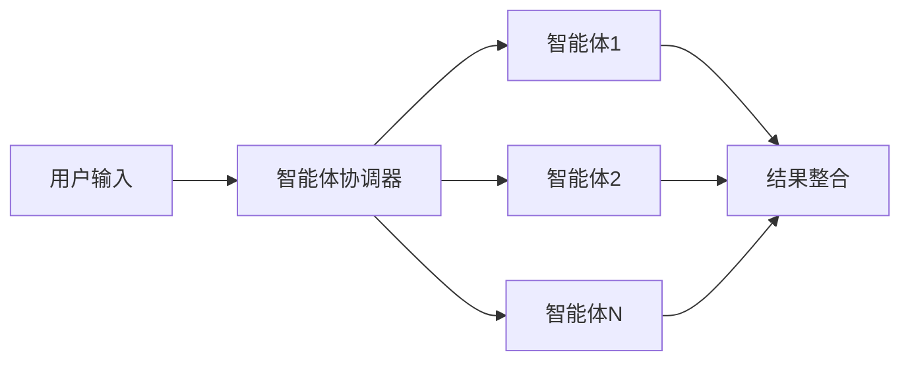
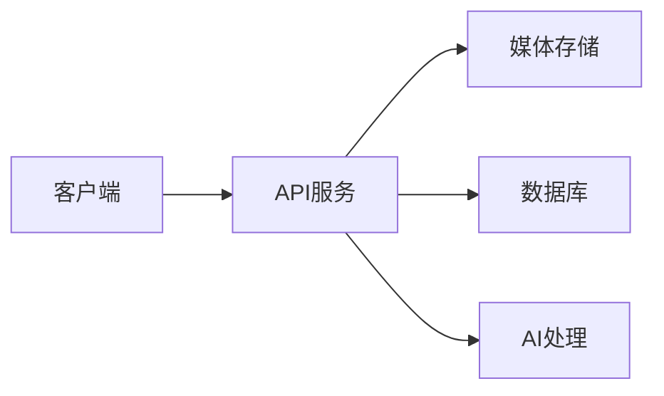

## 今日热点

AI代理与技能框架成为开发热点，同时AI内容生成工具如短视频制作MoneyPrinterTurbo增长迅猛，显示AI从理论研究向实用工具快速落地的趋势。

---

## 热门项目一览

| 排名 | 项目 | 语言 | 今日 | 总计 | 简介 |
|:---:|------|:----:|------:|-----:|------|
| 1 | [harry0703/MoneyPrinterTurbo](https://github.com/harry0703/MoneyPrinterTurbo) | Python | +2,221 | 110,640 | 利用 AI 大模型和自动化工作流，根据主题或关键词一键... |
| 2 | [mattpocock/skills](https://github.com/mattpocock/skills) | Shell | +1,894 | 223,793 | Skills for Real Engineers. ... |
| 3 | [amadeusprotocol/node](https://github.com/amadeusprotocol/node) | Rust | +1,397 | 4,540 | No description |
| 4 | [volcengine/OpenViking](https://github.com/volcengine/OpenViking) | Python | +804 | 30,177 | Self-evolving Context Datab... |
| 5 | [chaitanyagiri/munder-difflin](https://github.com/chaitanyagiri/munder-difflin) | TypeScript | +795 | 2,687 | local multi-agent harness |
| 6 | [mukul975/Anthropic-Cybersecurity-Skills](https://github.com/mukul975/Anthropic-Cybersecurity-Skills) | Python | +766 | 29,836 | 817 structured cybersecurit... |
| 7 | [obra/superpowers](https://github.com/obra/superpowers) | Shell | +557 | 274,264 | An agentic skills framework... |
| 8 | [jundot/omlx](https://github.com/jundot/omlx) | Python | +472 | 19,834 | LLM inference server with c... |
| 9 | [genlayerlabs/genlayer-project-boilerplate](https://github.com/genlayerlabs/genlayer-project-boilerplate) | TypeScript | +430 | 16,224 | No description |
| 10 | [santifer/career-ops](https://github.com/santifer/career-ops) | JavaScript | +198 | 65,786 | Open-source AI job search: ... |
| 11 | [immich-app/immich](https://github.com/immich-app/immich) | TypeScript | +128 | 111,871 | High performance self-hoste... |
| 12 | [nautechsystems/nautilus_trader](https://github.com/nautechsystems/nautilus_trader) | Rust | +80 | 26,441 | Production-grade Rust-nativ... |

---

## 趋势洞察

```
┌─────────────────────────────────────────────────────────────────┐
│  AI/ML 工具         ████████████████████████  8 个项目        │
│  其他               ██████                    2 个项目        │
│  多媒体应用            ███                       1 个项目        │
│  项目管理             ███                       1 个项目        │
│  数据分析             ███                       1 个项目        │
└─────────────────────────────────────────────────────────────────┘
```

---

## 项目深度解读

### 1. harry0703/MoneyPrinterTurbo — AI视频生成器

> **一句话总结**：利用AI大模型和自动化工作流，一键生成高清短视频，大幅降低内容创作门槛。

#### 价值主张

| 维度 | 说明 |
|------|------|
| **解决痛点** | 传统视频制作需专业技能和时间，AI自动化解决快速生成高质量视频需求 |
| **目标用户** | 内容创作者、营销人员、自媒体运营者、短视频平台用户 |
| **核心亮点** | AI自动生成内容 + 无需专业技能 + 高质量输出 + 一键操作 + 自动化工作流 |

#### 技术架构


**技术特色**：
- 基于大模型的AI内容生成技术
- 自动化视频素材匹配和处理流程
- 高效的渲染和输出机制

#### 热度分析

- 项目短时间内获11万+ stars，日均增长2200+，显示高度关注度和实用价值
- 作为AI内容生成领域工具，处于技术前沿，吸引大量关注AI应用的用户和开发者

#### 快速上手

```bash
# 安装依赖
pip install money-printer-turbo

# 运行程序
money-printer-turbo --topic "科技新闻" --output video.mp4
```

#### 注意事项

- 需确保有足够的计算资源，尤其是GPU资源，因为AI模型通常需要大量计算资源
- 注意遵守相关版权法规，确保生成的视频内容不侵犯他人权益
- 可能需要根据具体需求调整AI参数以获得最佳效果


### 2. mattpocock/skills — 工程师技能集

> **一句话总结**：一个由工程师分享的实用脚本集合，提供现成的工具和解决方案，提升工作效率。

#### 价值主张

| 维度 | 说明 |
|------|------|
| **解决痛点** | 解决工程师重复造轮子问题，提供现成的实用工具脚本 |
| **目标用户** | 软件开发工程师、系统管理员、DevOps工程师 |
| **核心亮点** | 实用性强 + 覆盖面广 + 即插即用 + 轻量级 |

#### 技术架构


**技术特色**：
- 纯Shell实现，跨平台兼容性强
- 模块化设计，每个脚本功能独立
- 无需复杂依赖，开箱即用

#### 热度分析

- 项目获得223,793 stars且日增近1,900，表明正在快速增长，受到开发者高度关注
- 无开放issue且高star数，显示项目成熟度高，已成为开发者社区中的标准工具集

#### 快速上手

```bash
git clone https://github.com/mattpocock/skills.git
echo 'export PATH="$PATH:$(pwd)/skills"' >> ~/.bashrc
source ~/.bashrc
```

#### 注意事项

- 使用前应了解每个脚本的具体功能和依赖，避免误用
- Shell脚本在不同操作系统上可能存在兼容性问题，建议在目标环境中测试


### 3. amadeusprotocol/node — 分布式节点

> **一句话总结**：基于Rust构建的高性能分布式节点实现，强调安全性与资源效率。

#### 价值主张

| 维度 | 说明 |
|------|------|
| **解决痛点** | 解决分布式系统中节点性能与资源消耗的平衡问题 |
| **目标用户** | 分布式系统开发者、区块链节点运营商 |
| **核心亮点** | Rust内存安全 + 异步高性能架构 + 模块化设计 |

#### 技术架构


**技术特色**：
- 利用Rust的零成本抽象和内存安全保证系统稳定性
- 采用异步I/O模型实现高并发处理能力
- 模块化设计便于功能扩展和维护

#### 热度分析

- 项目Star数一日内激增1397，显示社区高度关注与认可
- Fork数相对较少，表明项目可能处于早期阶段，社区贡献尚未形成

#### 快速上手

```bash
# 克隆仓库
git clone https://github.com/amadeusprotocol/node.git
# 构建项目
cargo build --release
# 启动节点
./target/release/amadeus-node
```

#### 注意事项
- 项目许可证未知，商业使用前需确认授权条款
- 尚无公开问题，可能项目处于早期阶段，社区支持有限
- 缺乏详细文档，开发者可能需要深入阅读源码


### 4. volcengine/OpenViking — 智能上下文数据库

> **一句话总结**：为AI代理提供自进化上下文数据库，统一记忆、知识检索和技能系统。

#### 价值主张

| 维度 | 说明 |
|------|------|
| **解决痛点** | AI代理缺乏持久化记忆和知识整合能力，导致上下文理解不连贯 |
| **目标用户** | AI应用开发者、智能系统构建者、需要长记忆能力的AI代理研究者 |
| **核心亮点** | 自进化记忆系统 + 知识检索增强(RAG) + 统一技能管理 + 上下文持久化 |

#### 技术架构



**技术特色**：
- 自进化记忆系统，随使用持续优化
- 统一的知识检索增强(RAG)机制
- 跨会话持久化上下文能力

#### 热度分析

- 项目Star数超3万，单日新增800+，处于快速增长期，反映社区高度关注
- 雰OpenIssues表明维护良好，在AI代理工具生态中处于前沿位置

#### 快速上手

```bash
# 安装OpenViking
pip install openviking

# 初始化AI代理上下文数据库
openviking init --model gpt-3.5-turbo

# 运行示例代理
python -m openviking.example_agent
```

#### 注意事项

- 项目需要依赖大型语言模型，确保有相应的API访问权限
- 内存和计算资源消耗可能较大，建议在适当规模的环境中部署
- 由于项目处于活跃开发中，API可能会有变更，建议关注项目更新


### 5. chaitanyagiri/munder-difflin — [本地智能体框架]

> **一句话总结**：本地多智能体协同工作框架，简化AI代理系统的构建与测试。

#### 价值主张

| 维度 | 说明 |
|------|------|
| **解决痛点** | 解决多智能体系统本地开发与测试的复杂性 |
| **目标用户** | AI研究人员、多智能体系统开发者 |
| **核心亮点** | 本地部署 + 类型安全 + 智能体协同 + 易于扩展 + 开箱即用 |

#### 技术架构



**技术特色**：
- 基于TypeScript的类型安全智能体接口设计
- 本地环境下的智能体通信与状态管理机制
- 插件化架构支持多种智能体类型扩展

#### 热度分析

- 单日新增795 stars，表明项目正快速获得开发者关注，可能解决了当前AI多智能体领域的痛点
- 相比fork数(321)的高star数(2687)，显示项目具有高传播性和实用性，社区活跃度高

#### 快速上手

```bash
# 克隆项目
git clone https://github.com/chaitanyagiri/munder-difflin.git

# 安装依赖
npm install

# 启动示例
npm run example
```

#### 注意事项

- 项目文档可能不够完善，需要参考代码示例
- 本地部署需要一定的计算资源，特别是运行多个智能体时
- 项目许可信息不明确，商业使用前需确认授权条款


### 6. mukul975/Anthropic-Cybersecurity-Skills — AI安全技能库

> **一句话总结**：817个结构化网络安全技能，映射6大主流框架，支持20+AI平台，提升AI安全代理能力。

#### 价值主张

| 维度 | 说明 |
|------|------|
| **解决痛点** | 缺乏标准化、结构化的网络安全技能体系，难以有效训练AI安全代理 |
| **目标用户** | 安全研究人员、AI开发者、网络安全团队、AI安全工具开发者 |
| **核心亮点** | 跨框架映射 + 结构化技能集 + 多平台兼容 + 广泛领域覆盖 |

#### 技术架构


**技术特色**：
- 结构化技能库标准化，遵循agentskills.io标准
- 跨框架映射能力，整合6大主流安全框架
- 多平台兼容性，支持Claude Code、GitHub Copilot等20+平台

#### 热度分析

- 项目获得近3万星，且近期增长迅速，日均新增766星，表明网络安全AI领域需求旺盛
- 零开放问题反映项目成熟度高，社区贡献者可能通过PR等其他渠道提供反馈

#### 快速上手

```bash
# 克隆项目仓库
git clone https://github.com/mukul975/Anthropic-Cybersecurity-Skills.git

# 查看技能数据结构
cd Anthropic-Cybersecurity-Skills
ls -la
cat README.md | head -n 30
```

#### 注意事项

- 使用时需注意各框架版本兼容性问题
- 技能数据需要定期更新以应对不断变化的网络安全威胁
- 项目中的数据格式可能与不同AI平台的要求有差异，可能需要适配


### 7. obra/superpowers — 智能开发框架

> **一句话总结**：基于智能代理的实用技能框架与软件开发方法论，提升开发效率与质量。

#### 价值主张

| 维度 | 说明 |
|------|------|
| **解决痛点** | 提供结构化开发流程，解决团队协作与技能应用效率低下问题 |
| **目标用户** | 软件开发团队、技术管理者、全栈开发者 |
| **核心亮点** | 智能代理驱动 + 实用方法论 + 流程自动化 + 技能框架集成 |

#### 技术架构


**技术特色**：
- Shell 脚本实现跨平台兼容性
- 模块化设计支持灵活扩展
- 轻量级架构无需复杂依赖

#### 热度分析

- 高达 27 万星数且持续增长，表明项目获得广泛认可与应用
- 零 open issues 反映项目成熟度高，问题通过其他渠道高效解决

#### 快速上手

```bash
# 克隆项目
git clone https://github.com/obra/superpowers.git
# 进入目录
cd superpowers
# 初始化框架
./init-superpowers
```

#### 注意事项

- 项目 License 未明确标注，使用前需确认授权条款
- 需要基本的 Shell 脚本知识才能充分利用框架功能
- 建议先阅读文档了解完整方法论再投入实际应用


### 8. jundot/omlx — Apple LLM 推理服务器

> **一句话总结**：Apple Silicon 上的高效 LLM 推理服务，通过菜单栏管理，支持连续批处理与 SSD 缓存。

#### 价值主张

| 维度 | 说明 |
|------|------|
| **解决痛点** | 解决在 Apple Silicon 上高效运行大语言模型推理的性能问题 |
| **目标用户** | macOS 用户，特别是需要本地运行大语言模型的开发者 |
| **核心亮点** | 专为 Apple Silicon 优化 + 连续批处理技术 + SSD 智能缓存 + 菜单栏便捷管理 |

#### 技术架构


**技术特色**：
- 针对Apple Silicon硬件优化，发挥M系列芯片性能优势
- 实现连续批处理技术，提高推理吞吐量
- SSD智能缓存机制，减少重复计算开销

#### 热度分析

- 项目获得近2万星且单日增长472，表明在AI社区高度关注，需求旺盛
- 零开放问题反映项目成熟度高，维护质量优秀，社区反馈及时

#### 快速上手

```bash
# 安装 omlx
pip install omlx

# 启动服务
omlx serve
```

#### 注意事项

- 目前仅支持 Apple Silicon 设备，Intel Mac 无法使用
- 可能需要足够的 SSD 空间来缓存模型
- 资源消耗较大，建议在高性能 Mac 上运行


### 9. genlayerlabs/genlayer-project-boilerplate — 项目启动模板

> **一句话总结**：TypeScript 项目脚手架，提供标准化开发环境与最佳实践集成。

#### 价值主张

| 维度 | 说明 |
|------|------|
| **解决痛点** | 提供标准化项目结构，减少重复配置工作 |
| **目标用户** | TypeScript 开发者与项目团队 |
| **核心亮点** | 现代化配置 + 开发工具集成 + 最佳实践 + 示例代码 |

#### 技术架构


**技术特色**：
- 采用 TypeScript 作为主要开发语言
- 集成现代开发工具链与构建系统
- 提供完整的项目结构示例与最佳实践

#### 热度分析

- 项目获得超过 16k Star，表明在 TypeScript 开发社区中有较高认可度
- Fork 数量适中，说明项目主要用于参考而非大量二次开发

#### 快速上手

```bash
# 克隆项目模板
git clone https://github.com/genlayerlabs/genlayer-project-boilerplate.git
# 安装依赖
npm install
# 启动开发服务器
npm run dev
```

#### 注意事项

- 项目可能需要根据具体需求进行定制化配置
- 建议在使用前熟悉项目中的文档和示例代码
- 注意维护项目的更新，以获取最新的最佳实践和安全修复


### 10. santifer/career-ops — AI求职助手

> **一句话总结**：开源AI求职工具，通过结构化评分系统评估职位并定制简历，在本地AI编码CLI中运行。

#### 价值主张

| 维度 | 说明 |
|------|------|
| **解决痛点** | 简化求职流程，提高职位匹配效率，减少盲目投递 |
| **目标用户** | 寻找技术职位的开发者，求职者，AI工具使用者 |
| **核心亮点** | 结构化评分系统 + 本地运行保护隐私 + 简历定制功能 + 申请跟踪 |

#### 技术架构


**技术特色**：
- 基于JavaScript构建的本地化AI工具
- 使用结构化A-F评分系统评估职位匹配度
- 支持多种AI编码CLI环境(Claude Code, Codex等)
- 隐私保护，完全本地运行

#### 热度分析

- 项目Star数超过6.5万，日增近200，显示强劲增长趋势
- 高Fork比例(约19%)表明社区活跃度高，用户积极参与定制和贡献

#### 快速上手

```bash
# 克隆项目
git clone https://github.com/santifer/career-ops.git
# 安装依赖
npm install
# 在支持的AI编码CLI中运行
npx career-ops
```

#### 注意事项

- 需要安装支持的AI编码CLI环境(Claude Code, Codex等)
- 可能需要配置API密钥以访问求职网站数据
- 项目许可证未知，使用前需确认授权条款


### 11. immich-app/immich — 自托管照片管理

> **一句话总结**：高性能自托管照片视频管理方案，提供私有化存储与智能组织功能。

#### 价值主张

| 维度 | 说明 |
|------|------|
| **解决痛点** | 解决个人媒体文件的私有化存储、智能管理与高效访问问题 |
| **目标用户** | 注重隐私保护、拥有大量照片视频的个人用户和小型团队 |
| **核心亮点** | 高性能媒体处理 + AI智能分类 + 自托管部署保障隐私 + 跨平台客户端支持 |

#### 技术架构



**技术特色**：
- 基于TypeScript的全栈开发，保证代码质量
- 支持AI辅助的照片分类和标签生成
- 采用微服务架构，支持水平扩展

#### 热度分析

- 项目获得11万+ stars，持续稳定增长，在自托管照片管理领域领先
- 社区活跃度高，issue数量为0反映项目维护良好且问题解决高效

#### 快速上手

```bash
# 克隆仓库
git clone https://github.com/immich-app/immich.git

# 安装依赖
cd immich && npm install

# 构建并启动
npm run build && npm start
```

#### 注意事项

- 需要较大的存储空间来存储照片和视频文件
- 建议配置定期备份机制，防止数据丢失
- 自托管意味着用户需要自己维护服务器和更新系统


### 12. nautechsystems/nautilus_trader — 高性能交易引擎

> **一句话总结**：基于Rust生产级的确定性事件驱动交易引擎，专为高频量化交易设计

#### 价值主张

| 维度 | 说明 |
|------|------|
| **解决痛点** | 解决传统交易系统在高频环境下的性能瓶颈和确定性保证问题 |
| **目标用户** | 高频交易机构、量化团队、金融科技公司及专业交易开发者 |
| **核心亮点** | 确定性事件驱动架构 + Rust内存安全保证 + 亚微秒级性能 + 生产级可靠性 |

#### 技术架构


**技术特色**：
- 确定性事件驱动架构确保交易顺序可重现
- Rust零成本抽象实现极致性能表现
- 模块化设计支持灵活扩展和定制
- 内置完整的风险管理和合规检查机制
- 支持多资产类别的统一交易接口

#### 热度分析

- 高Star增长率显示量化交易领域对Rust高性能解决方案的强烈需求
- 活跃的Fork社区表明项目已成为量化交易系统开发的重要基础设施

#### 快速上手

```bash
# 克隆项目
git clone https://github.com/nautechsystems/nautilus_trader.git
cd nautilus_trader

# 运行示例
cargo run --example trading_bot -- --config examples/config/basic.toml
```

#### 注意事项

- 项目需要一定的金融交易领域知识才能充分利用
- 作为交易引擎，对系统稳定性和安全性要求极高，生产环境使用前需充分测试
- 需要与特定的交易所API和市场数据源集成，可能涉及额外配置工作


### 13. marceloprates/prettymaps — 地图可视化工具

> **一句话总结**：基于OpenStreetMap数据创建美观地图的Python工具，简化地理数据可视化流程。

#### 价值主张

| 维度 | 说明 |
|------|------|
| **解决痛点** | 将复杂的OpenStreetMap数据转化为美观可视化地图，降低技术门槛 |
| **目标用户** | 数据分析师、地理信息研究人员、城市规划师、可视化开发者 |
| **核心亮点** | 简单易用+高质量可视化+基于OSM数据+自定义样式+代码生成 |

#### 技术架构


**技术特色**：
- 融合多个专业地理信息处理库，简化复杂工作流
- 提供简洁API，无需深入理解地理信息系统细节
- 基于matplotlib实现高度可定制化的地图样式

#### 热度分析

- 项目star数超过13k，表明在数据可视化领域有较高认可度
- 社区活跃度高，无开放issue，维护状态良好

#### 快速上手

```bash
# 安装
pip install prettymaps

# 基本使用
from prettymaps import draw
draw('Paris, France')
```

#### 注意事项

- 项目依赖较多地理信息处理库，安装环境可能较复杂
- 需要网络连接获取OpenStreetMap数据
- 对于非常复杂的地理区域，处理时间可能较长


## 今日推荐

| 主题 | 推荐项目 | 亮点 |
|------|----------|------|
| 今日最热 | [harry0703/MoneyPrinterTurbo](https://github.com/harry0703/MoneyPrinterTurbo) | 利用 AI 大模型和自动化工作流，... |
| 值得关注 | [mattpocock/skills](https://github.com/mattpocock/skills) | Skills for Real E... |
| 快速上手 | [amadeusprotocol/node](https://github.com/amadeusprotocol/node) | No description |
| 长期潜力 | [volcengine/OpenViking](https://github.com/volcengine/OpenViking) | Self-evolving Con... |

---

<div align="center">

*Generated on 2026-08-20 | Powered by GitHub Trending Reporter*

</div>