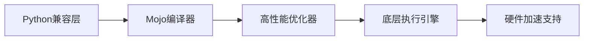
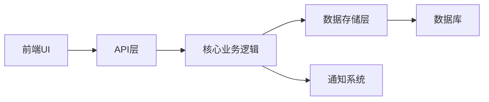
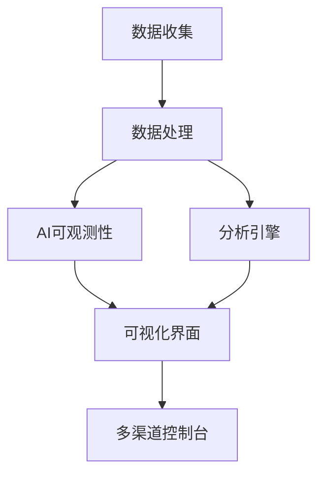
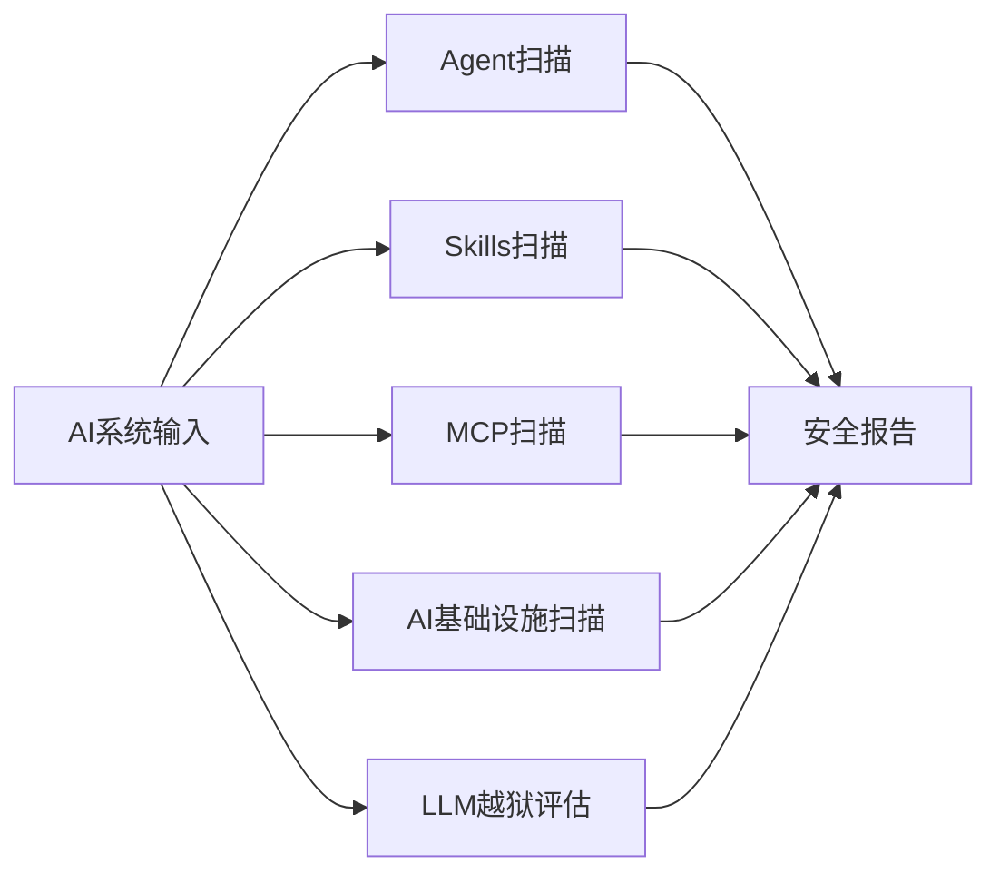

## 今日热点

AI代理工具链与本地优先应用引领今日GitHub热榜，开发者正积极构建自主运行的AI

---

## 热门项目一览

| 排名 | 项目 | 语言 | 今日 | 总计 | 简介 |
|:---:|------|:----:|------:|-----:|------|
| 1 | [harry0703/MoneyPrinterTurbo](https://github.com/harry0703/MoneyPrinterTurbo) | Python | +2,761 | 112,937 | 利用 AI 大模型和自动化工作流，根据主题或关键词一键... |
| 2 | [mattpocock/skills](https://github.com/mattpocock/skills) | Shell | +2,192 | 226,474 | Skills for Real Engineers. ... |
| 3 | [AprilNEA/OpenLogi](https://github.com/AprilNEA/OpenLogi) | Rust | +1,545 | 11,872 | ⚡️A native, local-first alt... |
| 4 | [volcengine/OpenViking](https://github.com/volcengine/OpenViking) | Python | +950 | 31,023 | Self-evolving Context Datab... |
| 5 | [santifer/career-ops](https://github.com/santifer/career-ops) | JavaScript | +816 | 66,678 | Open-source AI job search: ... |
| 6 | [obra/superpowers](https://github.com/obra/superpowers) | Shell | +727 | 274,943 | An agentic skills framework... |
| 7 | [mahlernim/google-timeline-visualizer](https://github.com/mahlernim/google-timeline-visualizer) | Kotlin | +657 | 1,552 | Visualize your year in trav... |
| 8 | [chaitanyagiri/munder-difflin](https://github.com/chaitanyagiri/munder-difflin) | TypeScript | +507 | 3,128 | local multi-agent harness |
| 9 | [cursor/plugins](https://github.com/cursor/plugins) | TypeScript | +449 | 4,083 | Cursor plugin specification... |
| 10 | [akitaonrails/ai-memory](https://github.com/akitaonrails/ai-memory) | Rust | +332 | 3,602 | Solution for long term memo... |
| 11 | [modular/modular](https://github.com/modular/modular) | Mojo | +268 | 27,939 | The Modular Platform (inclu... |
| 12 | [JuliusBrussee/caveman](https://github.com/JuliusBrussee/caveman) | Go | +258 | 99,630 | 🪨 why use many token when f... |

---

## 趋势洞察

```
┌─────────────────────────────────────────────────────────────────┐
│  AI/ML 工具         ████████████████████████  12 个项目        │
│  其他               ████                      2 个项目        │
│  智能家居             ██                        1 个项目        │
│  项目管理             ██                        1 个项目        │
│  数据分析             ██                        1 个项目        │
└─────────────────────────────────────────────────────────────────┘
```

---

## 项目深度解读

### 1. harry0703/MoneyPrinterTurbo — AI视频生成工具

> **一句话总结**：利用AI大模型一键生成高清短视频，实现内容创作的自动化与高效化。

#### 价值主张

| 维度 | 说明 |
|------|------|
| **解决痛点** | 传统视频制作流程复杂、耗时，需专业技能和大量资源 |
| **目标用户** | 内容创作者、营销人员、自媒体运营者、短视频创作者 |
| **核心亮点** | AI驱动自动化 + 高清视频输出 + 一键式操作 + 多主题支持 |

#### 技术架构


**技术特色**：
- 集成多种AI大模型进行内容创作
- 自动化视频素材处理与合成流程
- 高效的渲染与输出技术

#### 热度分析

- 短时间内突破11万星，显示AI视频生成领域的巨大需求
- Fork/Star比例约15%，表明项目有较高参与度和二次开发潜力

#### 快速上手

```bash
# 安装依赖
pip install -r requirements.txt

# 运行程序
python moneyprinter.py --topic "科技未来" --output output.mp4
```

#### 注意事项

- 需确保有足够的计算资源，特别是GPU资源，以支持AI模型的运行
- 注意遵守相关平台的版权规定，特别是视频素材的使用
- 可能需要注册API密钥以使用某些AI服务
- 生成的视频质量可能取决于输入关键词的准确性和AI模型的能力


### 2. mattpocock/skills — 工程师技能集

> **一句话总结**：一个实用的Shell脚本集合，为工程师提供日常工作中的自动化工具和技巧。

#### 价值主张

| 维度 | 说明 |
|------|------|
| **解决痛点** | 提供现成的Shell脚本，解决工程师日常重复性工作 |
| **目标用户** | 开发人员、系统管理员、DevOps工程师 |
| **核心亮点** | 即用型脚本 + 高效命令组合 + 实用工具集 |

#### 技术架构

**技术特色**：
- 轻量级Shell脚本，无需复杂依赖
- 聚焦工程师日常工作场景
- 提供即插即用的解决方案

#### 热度分析

- 项目获得超22万星，近期增长迅速，表明工程师对实用脚本工具的高需求
- Fork数与Star数比例合理，说明项目被广泛使用和二次开发

#### 快速上手

```bash
# 克隆项目到本地
git clone https://github.com/mattpocock/skills.git
# 进入项目目录
cd skills
# 查看可用脚本
ls -la
```

#### 注意事项

- 部分脚本可能需要根据个人环境进行调整
- 使用前请确保理解脚本内容，特别是在生产环境中使用时
- 项目许可证信息不明确，商业使用前需确认授权条款


### 3. AprilNEA/OpenLogi — [本地罗技工具]

> **一句话总结**：用Rust开发的本地优先罗技设备配置工具，无需账户与遥测数据。

#### 价值主张

| 维度 | 说明 |
|------|------|
| **解决痛点** | 替代官方Logitech Options+，提供本地化、无账户的设备配置方案 |
| **目标用户** | 注重隐私、偏好本地解决方案的罗技设备用户 |
| **核心亮点** | + 本地优先运行 + 无需账户 + 无遥测数据 + Rust安全实现 |

#### 技术架构


**技术特色**：
- 使用Rust实现内存安全，避免C/C++常见漏洞
- 直接通过HID++协议与设备通信，不依赖官方软件
- 本地处理所有配置，无需云服务支持
- 支持按钮重映射、DPI调整和SmartShift功能

#### 热度分析

- 项目获得近12k星，单日增长超过1500星，表明近期有显著关注度提升
- Fork数相对较少(322)，说明项目可能更注重使用而非二次开发

#### 快速上手

```bash
# 克隆仓库
git clone https://github.com/AprilNEA/OpenLogi.git
# 构建项目
cargo build --release
# 运行程序
./target/release/openlogi
```

#### 注意事项

- 需要安装Rust开发环境
- 可能仅支持特定罗技设备，需查看兼容性列表
- 由于是本地工具，不同操作系统可能需要不同的配置
- 许可证信息不明确，使用前需确认开源许可条款


### 4. volcengine/OpenViking — 智能上下文数据库

> **一句话总结**：为AI Agent提供自进化上下文数据库，统一记忆、知识检索与技能管理

#### 价值主张

| 维度 | 说明 |
|------|------|
| **解决痛点** | 解决AI Agent上下文碎片化、知识更新滞后、技能调用效率低的问题 |
| **目标用户** | AI Agent开发者、智能系统架构师、AI应用研究员 |
| **核心亮点** | 自进化数据库 + 统一记忆架构 + 多模态知识检索 + 技能动态组合 |

#### 技术架构


**技术特色**：
- 自进化上下文数据库，持续学习优化
- 统一的记忆与知识架构设计
- 多模态数据检索与整合能力
- 动态技能组合与调用机制
- 高效的上下文状态管理

#### 热度分析

- 项目Star数超过3万，单日增长近千，热度持续攀升
- 作为火山引擎开源项目，处于AI Agent基础设施生态的核心位置

#### 快速上手

```bash
# 安装OpenViking
pip install openviking

# 初始化Agent上下文数据库
from openviking import OpenViking
ov = OpenViking.initialize()

# 添加记忆或技能
ov.add_memory("示例记忆内容")
ov.add_skill("示例技能名称", "技能实现代码")
```

#### 注意事项

- 需要确保有足够的计算资源支持上下文数据库的高效运行
- 注意数据隐私与安全问题，特别是处理用户交互数据时
- 定期更新以获取最新的功能优化和安全补丁


### 5. santifer/career-ops — AI求职助手

> **一句话总结**：开源AI求职工具，自动扫描职位、评估匹配度、优化简历并跟踪申请全流程。

#### 价值主张

| 维度 | 说明 |
|------|------|
| **解决痛点** | 求职者面对海量职位信息难以高效筛选、评估和申请 |
| **目标用户** | 需要找工作或跳槽的开发者、技术求职者 |
| **核心亮点** | AI评估职位匹配度 + 结构化评分系统 + 本地运行保护隐私 + 简历自动优化 + 全流程申请跟踪 |

#### 技术架构


**技术特色**：
- 集成多种AI编码工具接口
- 本地运行保护用户隐私
- 结构化职位评估算法
- 跨平台兼容性

#### 热度分析

- 项目Star数高达66,678且近期增长迅速(+816 today)，表明在开发者社区中需求旺盛
- Fork数12,817说明项目被广泛采用和二次开发，形成活跃的生态

#### 快速上手

```bash
# 安装项目依赖
npm install

# 配置AI工具接口
npm run config

# 开始扫描职位并评估
npm scan --platform=linkedin
```

#### 注意事项

- 需要配置相应的AI工具接口才能使用
- 可能需要额外的API密钥用于某些功能
- 本地运行需要足够的计算资源


### 6. obra/superpowers — 智能技能框架

> **一句话总结**：一个实用的智能体技能框架和软件开发方法论，专注于提升个人和团队的工作效率。

#### 价值主张

| 维度 | 说明 |
|------|------|
| **解决痛点** | 软件开发中的效率低下和技能应用不系统化问题 |
| **目标用户** | 软件开发者、技术团队和追求高效工作的个人 |
| **核心亮点** | 实用性导向 + 智能体技能框架 + 开发方法论 + Shell实现 + 高效工作流 |

#### 技术架构


**技术特色**：
- 基于Shell的轻量级实现，易于集成
- 模块化的技能框架设计
- 注重实用性的方法论指导

#### 热度分析

- 项目获得274,943个Star，727个今日增长，表明项目有极高的关注度和持续增长趋势
- 24,605个Fork显示社区参与度高，表明项目具有实用价值和可扩展性

#### 快速上手

```bash
# 克隆项目
git clone https://github.com/obra/superpowers.git

# 进入目录并查看可用命令
cd superpowers && ls -la
```

#### 注意事项

- 由于项目信息有限，建议查看项目README获取详细使用指南
- Shell脚本可能需要在特定环境下运行，注意系统兼容性
- 项目描述强调"that works"，表明更注重实际效果而非理论


### 7. mahlernim/google-timeline-visualizer — 旅行轨迹可视化

> **一句话总结**：基于Google位置历史数据，将用户的年度旅行轨迹转化为直观可视化图表。

#### 价值主张

| 维度 | 说明 |
|------|------|
| **解决痛点** | 将分散的位置历史数据转化为直观的旅行轨迹可视化 |
| **目标用户** | 有记录位置习惯、希望回顾年度旅行轨迹的用户 |
| **核心亮点** | 支持多种可视化形式 + 处理Google Timeline数据 + 生成年度旅行报告 |

#### 技术架构


**技术特色**：
- 使用Kotlin处理位置数据，利用其简洁高效的特性
- 支持多种可视化形式展示旅行轨迹
- 智能处理时间序列位置数据，识别旅行模式

#### 热度分析

- 项目近期Star增长迅速，单日增长657，显示旅行数据可视化需求旺盛
- 作为个人项目，社区参与度相对较高，Fork/Star比例健康

#### 快速上手

```bash
# 克隆项目
git clone https://github.com/mahlernim/google-timeline-visualizer.git

# 构建项目
./gradlew build
```

#### 注意事项

- 需要用户自行导出Google Timeline数据
- 需要Java环境运行Kotlin项目
- 可视化效果可能因数据量大小而有所不同


### 8. chaitanyagiri/munder-difflin — 多智能体本地框架

> **一句话总结**：本地多智能体系统开发框架，简化多智能体协同工作流的构建与管理。

#### 价值主张

| 维度 | 说明 |
|------|------|
| **解决痛点** | 简化本地多智能体系统开发，无需复杂云服务配置 |
| **目标用户** | AI研究人员、多智能体系统开发者、智能协作工具构建者 |
| **核心亮点** | + 本地化部署 + 多智能体协同 + 模块化架构 + 类型安全 |

#### 技术架构


**技术特色**：
- 基于TypeScript构建，提供类型安全开发环境
- 轻量级本地架构，减少云端依赖
- 模块化智能体设计，支持灵活扩展

#### 热度分析

- 项目近期增长迅猛，单日新增507 stars，显示高度社区关注度
- 高star/fork比例(9:1)，表明用户更倾向于直接使用而非二次开发

#### 快速上手

```bash
# 克隆仓库
git clone https://github.com/chaitanyagiri/munder-difflin.git

# 安装依赖
npm install

# 启动本地多智能体系统
npm run start
```

#### 注意事项

- 项目许可证信息未知，商业使用前需确认授权条款
- 项目无公开issue，社区支持可能主要通过其他渠道
- 本地运行可能需要较高计算资源，特别是在运行多个智能体时


### 9. cursor/plugins — AI 插件生态

> **一句话总结**：为 Cursor 编辑器提供标准化插件规范及官方插件集合，扩展 AI 辅助编程能力。

#### 价值主张

| 维度 | 说明 |
|------|------|
| **解决痛点** | 统一 AI 编程工具插件开发标准，提升功能扩展性和互操作性 |
| **目标用户** | Cursor 编辑器用户、AI 辅助编程开发者、效率工具爱好者 |
| **核心亮点** | 标准化插件接口 + AI 能力集成 + 高效开发框架 + 官方插件库 |

#### 技术架构


**技术特色**：
- 基于 TypeScript 的强类型插件接口定义
- 提供标准化插件开发规范和最佳实践
- 集成 AI 能力的插件开发框架

#### 热度分析

- 项目近期增长迅猛，单日新增 449 Star，显示社区对 AI 编程工具的高度关注
- 作为新兴 AI 编程编辑器的官方插件库，具有强大的生态构建潜力

#### 快速上手

```bash
# 克隆官方插件仓库
git clone https://github.com/cursor/plugins.git
# 安装依赖
npm install
# 构建插件
npm run build
```

#### 注意事项

- 需要 Cursor 编辑器环境才能使用这些插件
- 插件开发需遵循特定规范和 API，确保与 AI 功能的兼容性
- 部分高级 AI 功能可能需要额外订阅或 API 密钥


### 10. akitaonrails/ai-memory — AI记忆中枢

> **一句话总结**：为AI代理提供长期记忆解决方案，实现跨代理连续对话与协作。

#### 价值主张

| 维度 | 说明 |
|------|------|
| **解决痛点** | 解决AI代理缺乏长期记忆能力，无法保持上下文连贯性的问题 |
| **目标用户** | AI编码助手开发者、需要长期记忆功能的CLI工具使用者 |
| **核心亮点** | 跨代理记忆共享 + 高效持久化存储 + 命令行无缝集成 + Rust高性能实现 |

#### 技术架构


**技术特色**：
- 采用Rust语言实现，确保高性能与内存安全
- 支持多种AI代理间的记忆无缝传递与共享
- 设计了高效的数据结构优化记忆检索速度

#### 热度分析

- 项目Star数快速增长，单日新增332个，表明获得社区高度关注
- Fork数与Star数比例适中，显示项目具有较好的社区参与度和实用性

#### 快速上手

```bash
# 克隆项目
git clone https://github.com/akitaonrails/ai-memory.git
cd ai-memory

# 运行示例
cargo run --example basic_usage
```

#### 注意事项

- 项目License未明确指定，商业使用前需确认授权条款
- 项目可能处于快速发展阶段，API可能会有不兼容变更
- 需要一定的Rust知识才能进行二次开发或深度定制


### 11. modular/modular — 高性能AI编程平台

> **一句话总结**：Mojo语言打造的高性能AI编程平台，融合Python易用性与C级性能。

#### 价值主张

| 维度 | 说明 |
|------|------|
| **解决痛点** | AI开发中性能与易用性难以兼顾的问题 |
| **目标用户** | AI/ML开发者、高性能计算研究人员 |
| **核心亮点** | Python兼容性 + C级性能 + 零成本抽象 + 模块化设计 |

#### 技术架构



**技术特色**：
- 统一Python与C的性能鸿沟
- 静态类型与动态类型混合系统
- 针对AI/ML工作负载的专用优化

#### 热度分析

- 近期Star增长迅速，日均新增约270，表明项目热度持续攀升
- 作为新兴AI编程语言，正在构建独特的技术社区和生态系统

#### 快速上手

```bash
# 安装Modular CLI
curl -sSL https://get.modular.com | sh

# 安装Mojo编译器
modular install mojo

# 运行第一个Mojo程序
mojo hello.mojo
```

#### 注意事项

- Mojo语言仍在快速发展中，API可能不稳定
- 部分Python库可能尚不支持Mojo
- 文档和社区资源相对有限


### 12. JuliusBrussee/caveman — AI交互优化

> **一句话总结**：通过"穴居人"风格简化语言表达，减少与Claude AI交互时的65%token使用量。

#### 价值主张

| 维度 | 说明 |
|------|------|
| **解决痛点** | AI交互中token消耗过大导致的成本高和响应慢问题 |
| **目标用户** | 需要频繁使用Claude AI的开发者、内容创作者和研究人员 |
| **核心亮点** | 语言简化算法 + 65%token减少 + 保持AI理解能力 |

#### 技术架构


**技术特色**：
- 基于Go语言实现的高效语言处理引擎
- 专有的语言简化算法，保留语义的同时减少冗余
- 针对Claude AI优化的特定表达模式库

#### 热度分析

- 项目获得近10万stars，日增长稳定，显示其在AI优化领域的显著价值
- Fork数量适中，表明项目既有方法分享也有一定的可扩展性

#### 快速上手

```bash
# 安装caveman工具
go install github.com/JuliusBrussee/caveman

# 使用caveman转换复杂提示
caveman "请详细解释人工智能在自然语言处理中的应用和挑战"
```

#### 注意事项

- 项目许可证未知，使用前需确认授权条款
- 简化效果可能因具体使用场景和任务复杂度而异
- 可能需要一定的适应期来掌握"穴居人"风格的沟通方式


### 13. RyanCodrai/turbovec — 高性能向量索引

> **一句话总结**：基于TurboQuant构建的Rust向量索引库，提供高性能相似性搜索与Python绑定。

#### 价值主张

| 维度 | 说明 |
|------|------|
| **解决痛点** | 解决大规模向量数据的高效相似性搜索需求，突破传统算法性能瓶颈 |
| **目标用户** | 机器学习工程师、数据科学家、推荐系统开发者、NLP研究人员 |
| **核心亮点** | Rust高性能实现 + Python易用绑定 + TurboQuant量化技术 + 内存安全 + 低延迟查询 |

#### 技术架构


**技术特色**：
- 基于TurboQuant的高效向量量化技术，减少内存占用
- Rust实现提供内存安全和卓越性能，适合生产环境
- Python绑定无缝集成现有Python数据科学生态
- 优化的索引结构支持亚毫秒级相似性查询
- 支持大规模向量数据集的高效处理

#### 热度分析

- 项目近1.6万星且日增230星，热度迅速攀升，反映向量搜索领域需求激增
- 零开放问题表明项目维护良好，用户反馈可能通过其他渠道处理

#### 快速上手

```bash
# 安装Python绑定
pip install turbovec

# 基本使用
import turbovec
index = turbovec.Index()
index.add(["vector1", "vector2"])
results = index.query("query_vector", k=5)
```

#### 注意事项

- 需确认项目的具体许可证类型，确保合规使用
- 性能优化可能需要根据具体应用场景调整参数
- 需了解TurboQuant技术细节以充分发挥库性能优势


### 14. makeplane/plane — 开源项目管理平台

> **一句话总结**：Plane是现代化的开源项目管理平台，提供任务、冲刺、文档和分类功能，作为Jira等商业工具的替代选择。

#### 价值主张

| 维度 | 说明 |
|------|------|
| **解决痛点** | 提供免费开源的项目管理方案，替代昂贵的商业工具如Jira、Linear等 |
| **目标用户** | 开发团队、敏捷开发小组、项目管理需求的企业组织 |
| **核心亮点** | 开源免费 + 现代化界面 + 多功能集成 + 自托管支持 + API可扩展性 |

#### 技术架构



**技术特色**：
- 基于TypeScript构建，确保代码质量和类型安全
- 采用现代前端框架提供流畅用户体验
- 支持自部署，满足数据隐私和定制化需求

#### 热度分析

- 项目获得超过5.6万Star，增长迅速，表明市场需求旺盛
- Fork数适中，显示社区参与度高，但可能处于早期阶段

#### 快速上手

```bash
# 克隆Plane仓库
git clone https://github.com/makeplane/plane.git

# 安装依赖
cd plane && npm install

# 启动开发服务器
npm run dev
```

#### 注意事项

- 项目License未知，商业使用前需确认许可条款
- 作为新兴项目，生态系统和插件可能不如成熟商业工具丰富
- 需要自行托管和维护，增加IT运维成本
- Open Issues为0，可能表示项目处于早期阶段或问题管理方式不同


### 15. PostHog/posthog — 产品分析平台

> **一句话总结**：全栈产品分析平台，提供AI可观测性、会话回放和实验分析，助力数据驱动的产品决策。

#### 价值主张

| 维度 | 说明 |
|------|------|
| **解决痛点** | 解决产品开发中缺乏全面用户行为数据和分析工具的问题 |
| **目标用户** | 产品经理、数据分析师和开发团队 |
| **核心亮点** | 全面的用户行为追踪 + AI驱动的可观测性 + 会话回放功能 |

#### 技术架构



**技术特色**：
- 基于Python构建的全栈分析系统
- 提供会话回放等高级分析功能
- 支持通过Slack等渠道进行产品控制

#### 热度分析

- 拥有38k+星标和稳定增长，显示开发者社区的高度认可
- 作为产品分析领域的领先平台，在开发者工具生态中占据重要位置

#### 快速上手

```bash
# 安装PostHog
pip install posthog

# 初始化PostHog客户端
from posthog import PostHog
posthog = PostHog('YOUR_API_KEY', host='https://app.posthog.com')

# 捕获事件
posthog.capture('distinct_id', 'event_name', properties={'property': 'value'})
```

#### 注意事项

- 需要注册PostHog账户获取API密钥才能使用
- 数据隐私需要根据当地法规进行合规处理
- 对于大型应用，可能需要考虑数据存储和性能优化


### 16. Tencent/AI-Infra-Guard — AI安全平台

> **一句话总结**：腾讯出品的全栈AI红队测试平台，通过多维度扫描保障AI系统安全。

#### 价值主张

| 维度 | 说明 |
|------|------|
| **解决痛点** | 解决AI系统安全漏洞难以全面检测的问题 |
| **目标用户** | AI安全研究员、AI系统运维人员、AI产品开发者 |
| **核心亮点** | 全栈AI安全扫描 + 多维度检测 + 红队测试工具集 |

#### 技术架构



**技术特色**：
- 多维度AI安全检测技术
- 全栈式AI系统安全评估
- 红队测试工具集成

#### 热度分析

- 项目Star数近5k且持续增长，表明AI安全领域需求旺盛
- Tencent背书加上开源策略，在AI安全领域具有较强影响力

#### 快速上手

```bash
# 克隆项目
git clone https://github.com/Tencent/AI-Infra-Guard.git

# 安装依赖
pip install -r requirements.txt

# 运行扫描
python main.py --scan-type agent --target <target-url>
```

#### 注意事项

- 项目许可证未知，使用前需确认授权条款
- 项目处于早期阶段，API和功能可能不稳定
- 需要一定的AI安全专业知识才能有效使用


### 17. agent-substrate/substrate — [代理基础系统]

> **一句话总结**：Agent Substrate 是一个用 Go 开发的代理系统核心框架，提供灵活的代理部署和管理能力。

#### 价值主张

| 维度 | 说明 |
|------|------|
| **解决痛点** | 统一代理系统的部署、管理和监控难题 |
| **目标用户** | 需要大规模代理系统的开发者和运维人员 |
| **核心亮点** | 微服务架构 + 高性能 + 可扩展性 + 易于集成 |

#### 技术架构


**技术特色**：
- 基于 Go 的高性能并发处理
- 插件化架构支持灵活扩展
- 分布式代理管理能力

#### 热度分析

- 项目近期增长稳定，日增约22个星标，显示持续关注
- 相对较低的Fork数表明项目可能处于早期阶段或专注核心功能

#### 快速上手

```bash
# 克隆项目
git clone https://github.com/agent-substrate/substrate.git
# 进入项目目录
cd substrate
# 运行示例
go run examples/main.go
```

#### 注意事项

- 项目许可证信息不明确，使用前需确认
- 由于Issue数为0，可能项目处于早期阶段，社区支持有限
- 文档可能不够完善，需要自行探索源码


## 今日推荐

| 主题 | 推荐项目 | 亮点 |
|------|----------|------|
| 今日最热 | [harry0703/MoneyPrinterTurbo](https://github.com/harry0703/MoneyPrinterTurbo) | 利用 AI 大模型和自动化工作流，... |
| 值得关注 | [mattpocock/skills](https://github.com/mattpocock/skills) | Skills for Real E... |
| 快速上手 | [AprilNEA/OpenLogi](https://github.com/AprilNEA/OpenLogi) | ⚡️A native, local... |
| 长期潜力 | [volcengine/OpenViking](https://github.com/volcengine/OpenViking) | Self-evolving Con... |

---

<div align="center">

*Generated on 2026-08-21 | Powered by GitHub Trending Reporter*

</div>