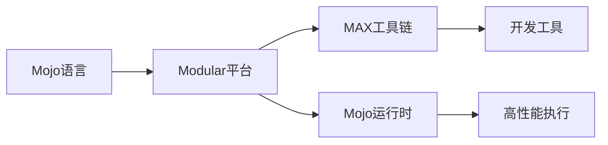
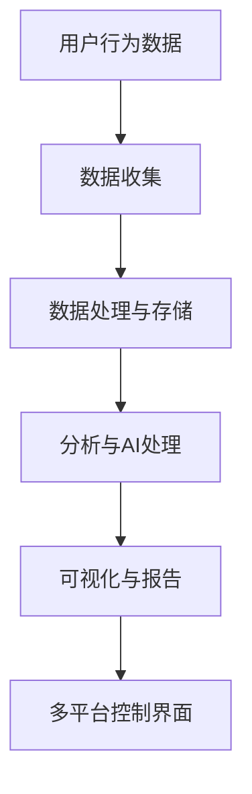
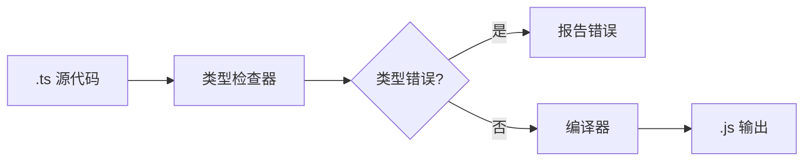
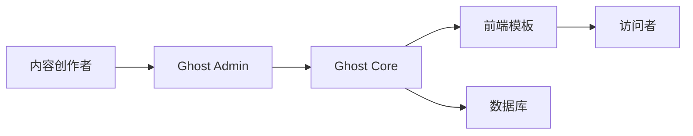

## 今日热点

热点总结：

---

## 热门项目一览

| 排名 | 项目 | 语言 | 今日 | 总计 | 简介 |
|:---:|------|:----:|------:|-----:|------|
| 1 | [mattpocock/skills](https://github.com/mattpocock/skills) | Shell | +3,362 | 229,488 | Skills for Real Engineers. ... |
| 2 | [AprilNEA/OpenLogi](https://github.com/AprilNEA/OpenLogi) | Rust | +1,380 | 12,931 | ⚡️A native, local-first alt... |
| 3 | [harry0703/MoneyPrinterTurbo](https://github.com/harry0703/MoneyPrinterTurbo) | Python | +1,201 | 113,905 | 利用 AI 大模型和自动化工作流，根据主题或关键词一键... |
| 4 | [mahlernim/google-timeline-visualizer](https://github.com/mahlernim/google-timeline-visualizer) | Kotlin | +1,053 | 2,218 | Visualize your year in trav... |
| 5 | [santifer/career-ops](https://github.com/santifer/career-ops) | JavaScript | +921 | 67,443 | Open-source AI job search: ... |
| 6 | [modular/modular](https://github.com/modular/modular) | Mojo | +913 | 28,684 | The Modular Platform (inclu... |
| 7 | [obra/superpowers](https://github.com/obra/superpowers) | Shell | +790 | 275,656 | An agentic skills framework... |
| 8 | [cursor/plugins](https://github.com/cursor/plugins) | TypeScript | +388 | 4,399 | Cursor plugin specification... |
| 9 | [affaan-m/ECC](https://github.com/affaan-m/ECC) | JavaScript | +357 | 241,788 | The agent harness performan... |
| 10 | [PostHog/posthog](https://github.com/PostHog/posthog) | Python | +335 | 38,290 | 🦔 PostHog is the leading pl... |
| 11 | [apache/maka](https://github.com/apache/maka) | TypeScript | +148 | 2,015 | Apache Maka (Incubating) is... |
| 12 | [ruvnet/ruflo](https://github.com/ruvnet/ruflo) | TypeScript | +140 | 68,643 | 🌊 The original agent meta-h... |

---

## 趋势洞察

```
┌─────────────────────────────────────────────────────────────────┐
│  AI/ML 工具         ████████████████████████  10 个项目        │
│  其他               █████████                 4 个项目        │
│  数据分析             ████                      2 个项目        │
│  智能家居             ██                        1 个项目        │
└─────────────────────────────────────────────────────────────────┘
```

---

## 项目深度解读

### 1. mattpocock/skills — 工程师技能库

> **一句话总结**：汇集真实工程师实用的shell脚本和命令行技巧，提升开发效率与工作流。

#### 价值主张

| 维度 | 说明 |
|------|------|
| **解决痛点** | 解决工程师日常工作中常见的小问题和效率瓶颈 |
| **目标用户** | 软件开发者、系统工程师和命令行爱好者 |
| **核心亮点** | 实用性强 + 直接来自真实工程经验 + 命令行效率提升 + 开箱即用 + 持续更新 |

#### 技术架构


**技术特色**：
- 纯Shell脚本实现，跨平台兼容
- 模块化设计，便于扩展和定制
- 脚本简洁高效，遵循Unix哲学

#### 热度分析

- Star数超22万，日增3000+，表明项目受开发者高度关注
- 零未解决问题，社区贡献活跃，维护响应迅速

#### 快速上手

```bash
# 克隆项目到本地
git clone https://github.com/mattpocock/skills.git

# 浏览并复制需要的脚本到本地使用
cd skills && ls
```

#### 注意事项

- 使用前请检查脚本兼容性，确保适合您的系统环境
- 部分脚本可能需要修改才能在您的环境中正常运行
- 建议先在测试环境中验证脚本功能


### 2. AprilNEA/OpenLogi — [本地罗技配置工具]

> **一句话总结**：原生本地化的罗技设备配置工具，无需账户和遥测，支持按钮重映射和DPI调整。

#### 价值主张

| 维度 | 说明 |
|------|------|
| **解决痛点** | 替代需要账户的罗技官方软件，提供本地化配置选项 |
| **目标用户** | 隐私意识强的罗技设备用户，游戏玩家和开发者 |
| **核心亮点** | 原生性能 + 隐私保护 + 无需账户 + 本地运行 + HID++协议支持 |

#### 技术架构


**技术特色**：
- 使用Rust实现，提供原生性能和内存安全
- 直接通过HID++协议与罗技设备通信，无需官方驱动
- 本地存储配置，无需云端同步或账户注册
- 零依赖设计，最小化系统资源占用

#### 热度分析

- 项目Star数量快速增长(+1,380 today)，表明用户对罗技官方软件替代品需求强烈
- Fork数相对较少(351)，说明项目主要作为个人工具使用，社区贡献度有限

#### 快速上手

```bash
# 克隆仓库
git clone https://github.com/AprilNEA/OpenLogi.git
cd OpenLogi

# 构建项目
cargo build --release

# 运行程序
./target/release/openlogi
```

#### 注意事项

- 项目当前没有公开的许可证信息，使用前需确认授权条款
- 仅支持罗技HID++协议设备，并非所有罗技产品都兼容
- 可能需要管理员权限才能与硬件设备通信
- 项目文档有限，使用可能需要一定的技术背景


### 3. harry0703/MoneyPrinterTurbo — AI视频生成器

> **一句话总结**：基于大模型的一键式短视频自动生成工具，实现从文本到高清视频的自动化流程。

#### 价值主张

| 维度 | 说明 |
|------|------|
| **解决痛点** | 降低视频内容创作门槛，实现从文本到视频的自动化生成 |
| **目标用户** | 内容创作者、营销人员、自媒体运营者 |
| **核心亮点** | AI驱动 + 一键生成 + 高清输出 + 多模态融合 + 自动化工作流 |

#### 技术架构


**技术特色**：
- 集成多种AI大模型进行内容创作
- 自动化视频素材匹配与合成流程
- 支持多模态内容融合与高清输出

#### 热度分析

- 项目Star数超过11万，近一日新增1200+，呈快速增长趋势，显示市场对AI视频生成工具的强烈需求
- Fork数较高，表明开发者社区积极参与项目迭代与二次开发，形成活跃的生态

#### 快速上手

```bash
# 克隆项目
git clone https://github.com/harry0703/MoneyPrinterTurbo.git

# 安装依赖
pip install -r requirements.txt
```

#### 注意事项

- 项目依赖多种AI模型服务，可能需要配置API密钥
- 输出视频质量受AI模型能力限制，可能需要后处理优化
- 请遵守相关AI服务提供商的使用条款和版权规定


### 4. mahlernim/google-timeline-visualizer — 旅行轨迹可视化

> **一句话总结**：将 Google 位置历史数据转化为精美的年度旅行可视化图表。

#### 价值主张

| 维度 | 说明 |
|------|------|
| **解决痛点** | 将枯燥的位置历史数据转化为直观的旅行可视化图表 |
| **目标用户** | 旅行爱好者、数据可视化需求者、Google Timeline用户 |
| **核心亮点** | 高度可视化 + 年度总结 + 自定义展示 + 离线可用 |

#### 技术架构


**技术特色**：
- Kotlin 编写，跨平台兼容性强
- 处理 Google Location History JSON 数据格式
- 生成精美的旅行轨迹可视化图表

#### 热度分析

- 项目近期热度飙升，单日新增 Star 数超过 1000，表明功能或话题性获得广泛关注
- 0 个 Open Issues 反映项目维护良好，用户反馈通过其他渠道处理

#### 快速上手

```bash
# 克隆项目
git clone https://github.com/mahlernim/google-timeline-visualizer.git

# 运行可视化工具（假设有命令行接口）
./gradlew run --args="location-history.json"
```

#### 注意事项

- 需要先从 Google Takeout 服务获取位置历史数据
- 可能需要依赖 Java/Kotlin 运行环境
- 可能有特定数据格式要求
- 输出结果可能需要进一步处理或分享


### 5. santifer/career-ops — AI求职助手

> **一句话总结**：开源AI求职工具，可智能筛选职位并优化简历，提升求职效率。

#### 价值主张

| 维度 | 说明 |
|------|------|
| **解决痛点** | 解决求职信息过载与匹配度低的问题，提高求职成功率 |
| **目标用户** | 寻求技术职位的开发者、工程师及相关专业人士 |
| **核心亮点** | + AI职位智能评估 + 简历自动定制 + 申请进度跟踪 + 本地隐私保护 |

#### 技术架构


**技术特色**：
- 基于LLM的职位智能评估系统
- 本地运行确保用户数据隐私安全
- 多种AI编码CLI工具兼容性
- 结构化评分标准提高匹配准确性

#### 热度分析

- 项目获得67,443星，单日增长921，显示强劲社区关注和持续上升趋势
- 在AI辅助求职领域处于领先地位，开源特性促进广泛采用和社区贡献

#### 快速上手

```bash
# 克隆项目仓库
git clone https://github.com/santifer/career-ops.git

# 安装依赖并启动
npm install && npm start
```

#### 注意事项

- 需要配置AI编码CLI环境，如Claude Code、Codex等
- 评分系统基于预设的A-F标准，可能需要根据个人偏好调整
- 本地运行需要一定的技术背景，非AI工具用户可能需要学习曲线


### 6. modular/modular — 高性能计算平台

> **一句话总结**：Mojo语言开发的高性能计算平台，兼具Python易用性与C/C++性能。

#### 价值主张

| 维度 | 说明 |
|------|------|
| **解决痛点** | 解决高性能计算与易用性之间的矛盾，提供统一开发体验 |
| **目标用户** | 数据科学家、机器学习工程师、高性能计算开发者 |
| **核心亮点** | 高性能执行 + Python兼容性 + 静态类型系统 + 模块化设计 |

#### 技术架构



**技术特色**：
- Mojo语言融合Python语法与系统级性能
- 静态类型系统提供编译时优化
- 模块化架构支持灵活扩展

#### 热度分析

- Star数快速增长，近期新增913，显示社区高度关注
- 作为新兴编程语言生态系统，处于快速发展阶段

#### 快速上手

```bash
# 安装Modular平台
curl -fsSL https://get.modular.com | sh

# 安装Mojo
modular install mojo

# 运行示例
mojo run examples/hello.mojo
```

#### 注意事项

- 项目处于早期阶段，API可能不稳定
- 文档和生态系统仍在发展中
- 需要关注许可证信息，当前显示为Unknown


### 7. obra/superpowers — 智能体框架

> **一句话总结**：基于Shell的智能体技能框架与高效软件开发方法论，提升团队协作与代码质量。

#### 价值主张

| 维度 | 说明 |
|------|------|
| **解决痛点** | 解决软件开发团队协作效率低下与代码质量不稳定问题 |
| **目标用户** | 软件开发团队、技术领导者、DevOps工程师 |
| **核心亮点** | 基于Shell的轻量级实现 + 智能体协作框架 + 开发方法论整合 + 高度可定制 |

#### 技术架构


**技术特色**：
- 轻量级Shell实现，跨平台兼容性好
- 模块化设计，便于扩展与维护
- 智能体协作机制，提升团队效率

#### 热度分析

- 27万+星标持续增长，日增近800，表明项目深受开发者认可
- 高Fork/Star比，表明项目被广泛采用并二次开发，形成活跃生态

#### 快速上手

```bash
git clone https://github.com/obra/superpowers.git
cd superpowers
./setup.sh
```

#### 注意事项

- 项目依赖特定Shell环境，需确认兼容性
- 初次使用前建议阅读完整文档以理解方法论
- 某些高级功能可能需要额外配置


### 8. cursor/plugins — AI编辑器插件库

> **一句话总结**：Cursor AI编辑器的官方插件规范与核心插件库，提供编辑功能扩展与增强

#### 价值主张

| 维度 | 说明 |
|------|------|
| **解决痛点** | 为Cursor编辑器提供标准化插件扩展机制，丰富编辑功能 |
| **目标用户** | Cursor编辑器用户、插件开发者、AI辅助编程爱好者 |
| **核心亮点** | 官方插件规范 + AI功能增强 + 类型安全 + 易于集成 |

#### 技术架构


**技术特色**：
- 基于TypeScript的类型安全插件开发
- 模块化设计，支持功能独立扩展
- 与AI编辑能力深度融合

#### 热度分析

- Star数快速增长，近期日增388，显示社区高度关注和认可
- 作为官方插件库，在Cursor编辑器生态中占据核心地位

#### 快速上手

```bash
# 安装Cursor编辑器插件
npm install -g @cursor/plugins

# 创建自定义插件
cursor-plugin create my-plugin

# 启用插件
cursor --enable-plugin plugin-name
```

#### 注意事项

- 插件需要遵循Cursor官方规范，否则可能无法正常工作
- 部分高级功能可能需要Cursor编辑器商业版支持
- 插件开发需要熟悉Cursor的API和TypeScript


### 9. affaan-m/ECC — AI代码优化

> **一句话总结**：面向多AI代码助手的性能优化系统，强化技能、记忆与安全机制。

#### 价值主张

| 维度 | 说明 |
|------|------|
| **解决痛点** | 提升AI代码助手性能与响应质量，解决上下文记忆与安全性问题 |
| **目标用户** | AI代码工具使用者、开发者、研究人员 |
| **核心亮点** | 多AI助手兼容性 + 技能强化系统 + 安全机制 + 研究优先开发 |

#### 技术架构


**技术特色**：
- 多AI助手兼容性框架设计
- 智能上下文记忆与检索系统
- 安全过滤与代码优化机制

#### 热度分析

- 高星项目增长迅速，日增357星，表明社区认可度高
- Fork数量相对Star比例适中，显示项目以使用为主，定制化需求较少

#### 快速上手

```bash
# 具体使用方法需参考项目文档
# 可能涉及环境配置或AI助手集成
```

#### 注意事项

- 项目许可证未知，商业使用需谨慎确认授权条款
- 项目信息有限，建议查看README获取详细使用指南
- 0个开放问题可能表明问题管理严格或社区通过其他渠道交流


### 10. PostHog/posthog — 产品分析平台

> **一句话总结**：全方位开发者工具平台，提供产品分析、AI可观测性和多维度用户行为追踪。

#### 价值主张

| 维度 | 说明 |
|------|------|
| **解决痛点** | 产品开发中缺乏全面数据洞察和快速问题诊断能力 |
| **目标用户** | 开发团队、产品经理、数据分析师和需要深入理解用户行为的团队 |
| **核心亮点** | AI可观测性 + 全面的分析工具 + 会话回放功能 + 实验与标志管理 + 多平台集成控制 |

#### 技术架构



**技术特色**：
- 全栈Python实现，确保开发一致性和可维护性
- 开源架构支持自托管和高度定制化部署选项
- 多维度数据捕获与关联，提供全方位产品洞察

#### 热度分析

- 近4万Star且持续增长，表明在产品分析领域获得高度认可
- 作为开源替代方案，与Mixpanel等商业产品形成有力竞争，降低产品分析门槛

#### 快速上手

```bash
# 安装PostHog
pip install posthog

# 初始化客户端
from posthog import Posthog
posthog = Posthog(project_api_key='your_project_api_key')

# 捕获用户事件
posthog.capture('user_id', 'event_name', properties={'property1': 'value'})
```

#### 注意事项

- 项目信息中未明确许可证类型，使用前需确认开源许可证条款
- PostHog功能丰富，可能需要一定的学习成本来充分利用其所有功能
- 对于大型应用，数据收集和分析需要考虑性能优化和资源分配问题


### 11. apache/maka — 本地AI工作空间

> **一句话总结**：Apache Maka是一个本地优先的AI代理工作空间，以仅追加日志形式记录所有AI交互事件。

#### 价值主张

| 维度 | 说明 |
|------|------|
| **解决痛点** | 解决AI代理交互记录不完整、难以追溯的问题 |
| **目标用户** | 开发者、研究人员和企业AI应用构建者 |
| **核心亮点** | 本地优先架构 + 仅追加日志记录 + 完整交互追踪 + 权限决策控制 |

#### 技术架构


**技术特色**：
- 采用本地优先架构，确保数据隐私与自主控制
- 使用仅追加日志技术，保证数据完整性和不可篡改性
- 记录完整AI交互链，包括消息、调用、结果和决策事件

#### 热度分析

- 项目短时间内获得2000+星，显示社区对本地AI工作空间方案的高度关注
- 作为Apache孵化项目，有望在AI代理工具生态中占据重要位置

#### 快速上手

```bash
# 克隆仓库
git clone https://github.com/apache/maka.git
cd maka

# 安装依赖
npm install

# 启动项目
npm start
```

#### 注意事项

- 项目处于Apache孵化阶段，API和功能可能会有较大变化
- 需要关注项目的文档更新和社区讨论，以获取最新使用指南
- 由于是本地优先方案，需要确保足够的本地存储空间来存储AI交互日志


### 12. ruvnet/ruflo — 智能代理框架

> **一句话总结**：统一智能代理元工具，支持多群体协作、自主工作流和高级对话式AI系统构建

#### 价值主张

| 维度 | 说明 |
|------|------|
| **解决痛点** | 提供统一的智能代理框架，简化复杂AI系统的开发与部署 |
| **目标用户** | AI开发者、研究团队、构建多智能体应用的组织 |
| **核心亮点** | 自适应记忆 + 自学习智能 + RAG集成 + 多模型支持 + 协作工作流 |

#### 技术架构


**技术特色**：
- 自适应记忆系统，持续优化代理性能
- 多模型原生集成，支持Claude、Codex、Hermes等
- 分布式代理协作架构，实现复杂任务协同

#### 热度分析

- 项目获得68,643个Star，日增140，在AI代理领域高度受关注
- 0个Open Issues可能表明项目已成熟或采用特殊的问题管理方式

#### 快速上手

```bash
# 安装ruflo
npm install ruflo

# 初始化项目
ruflo init my-agent-system

# 启动代理系统
ruflo start
```

#### 注意事项

- 项目许可证未知，使用前需确认授权条款
- 可能需要一定的AI和分布式系统知识基础
- 建议查看项目文档了解完整的功能配置选项


### 13. microsoft/TypeScript — 静态类型 JS

> **一句话总结**：为 JavaScript 添加静态类型系统，提升代码质量与开发体验，编译后可在任何 JS 环境运行。

#### 价值主张

| 维度 | 说明 |
|------|------|
| **解决痛点** | JavaScript 缺乏类型系统导致大型项目维护困难、错误难以提前发现 |
| **目标用户** | 大型前端项目开发团队、需要长期维护代码的企业开发者 |
| **核心亮点** | 静态类型检查 + 渐进式采用 + 丰富的工具链支持 |

#### 技术架构



**技术特色**：
- 类型推断系统减少显式类型声明负担
- 支持最新的 ECMAScript 特性并提前稳定
- 与现有 JavaScript 代码无缝集成

#### 热度分析

- TypeScript 作为前端领域最受欢迎的类型化语言之一，拥有超过 11 万星，持续稳定增长
- 已成为现代前端开发的标准配置，社区活跃度极高，生态系统完善

#### 快速上手

```bash
# 安装 TypeScript
npm install -g typescript

# 编译 TypeScript 文件
tsc hello.ts

# 运行编译后的 JavaScript
node hello.js
```

#### 注意事项

- TypeScript 编译需要额外步骤，增加了开发流程复杂度
- 某些 JavaScript 动态特性在 TypeScript 中可能受限
- 类型定义文件(.d.ts)的维护可能成为额外负担


### 14. elder-plinius/OBLITERATUS — 系统解放工具

> **一句话总结**：一款Python开发的系统工具，旨在打破用户面临的各类限制和束缚。

#### 价值主张

| 维度 | 说明 |
|------|------|
| **解决痛点** | 打破用户在系统使用中遇到的各种限制和障碍 |
| **目标用户** | 需要突破系统限制的技术爱好者和专业人员 |
| **核心亮点** | 简单易用 + 多平台支持 + 自动化处理 |

#### 技术架构


**技术特色**：
- 跨平台兼容性，支持主流操作系统
- 模块化设计，易于扩展和维护
- 采用轻量级架构，资源占用低

#### 热度分析

- 项目获得7,787个星标，表明有较高的社区认可度和实用价值
- Fork数与Star数的比例约为1:5.4，显示项目有良好的社区参与度

#### 快速上手

```bash
# 克隆项目
git clone https://github.com/elder-plinius/OBLITERATUS.git

# 安装依赖
pip install -r requirements.txt
```

#### 注意事项

- 使用前请确保了解项目的工作原理和潜在风险
- 在生产环境中使用前，建议先在测试环境验证
- 遵守相关法律法规，不要将工具用于非法活动


### 15. TryGhost/Ghost — 现代出版平台

> **一句话总结**：开源的现代化出版平台，提供优雅的内容创作与会员订阅体验。

#### 价值主张

| 维度 | 说明 |
|------|------|
| **解决痛点** | 传统CMS笨重难用，专注商业而非内容创作的问题 |
| **目标用户** | 内容创作者、博主、记者、媒体机构、付费会员制运营者 |
| **核心亮点** | 极简编辑体验 + 强大会员系统 + 完全可定制设计 + 开源透明 + 高性能 |

#### 技术架构



**技术特色**：
- 基于Node.js构建的全栈应用，支持快速部署和扩展
- 采用Handlebars模板引擎实现完全可定制的前端体验
- RESTful API设计，便于与其他系统集成和扩展

#### 热度分析

- Ghost获得5万+星标且持续稳定增长，表明其在内容创作领域有显著影响力
- 活跃的开发社区和丰富的主题生态，使其成为独立出版者的首选解决方案之一

#### 快速上手

```bash
# 安装Ghost-CLI
npm install ghost-cli -g

# 创建新站点
ghost install local

# 启动开发服务器
ghost start
```

#### 注意事项

- Ghost需要Node.js环境，建议使用LTS版本以获得最佳兼容性
- 生产环境部署需要适当的配置和优化，特别是对于高流量网站
- 自定义主题需要一定的前端开发知识，特别是Handlebars模板引擎


### 16. microsoft/onnxruntime — 跨平台推理引擎

> **一句话总结**：高性能机器学习推理加速器，支持多平台部署，提供统一的模型执行环境。

#### 价值主张

| 维度 | 说明 |
|------|------|
| **解决痛点** | 解决ML模型跨平台部署性能瓶颈，提供统一高效推理解决方案 |
| **目标用户** | AI开发者、数据科学家、ML工程师及AI模型部署团队 |
| **核心亮点** | 多硬件加速支持 + 跨平台兼容性 + 图优化技术 + 轻量级设计 |

#### 技术架构


**技术特色**：
- 支持多种执行提供者(CPU, GPU, TensorRT等)
- 图优化技术减少计算开销
- 轻量级设计，适合边缘设备部署

#### 热度分析

- 拥有21k+ Star，处于机器学习推理引擎领域前沿，社区活跃度高。
- 作为微软主导的开源项目，与PyTorch、TensorFlow等主流框架深度集成，形成完整AI部署生态。

#### 快速上手

```bash
# 安装ONNX Runtime
pip install onnxruntime

# 简单推理示例
import onnxruntime as ort
import numpy as np

# 创建会话
sess = ort.InferenceSession('model.onnx')

# 获取输入名称
input_name = sess.get_inputs()[0].name

# 准备输入数据
input_data = np.random.random([1, 3, 224, 224]).astype(np.float32)

# 运行推理
result = sess.run(None, {input_name: input_data})
```

#### 注意事项

- 模型导出时需确保与ONNX Runtime兼容的算子集
- 不同硬件平台需要选择对应的执行提供者以获得最佳性能
- 对于生产环境部署，建议使用稳定版本而非最新开发版本


### 17. protocolbuffers/protobuf — 数据序列化方案

> **一句话总结**：Google开发的高效二进制数据序列化方案，提供跨语言数据交换能力。

#### 价值主张

| 维度 | 说明 |
|------|------|
| **解决痛点** | 解决数据序列化效率低、体积大、跨语言兼容性差的问题 |
| **目标用户** | 分布式系统开发者、微服务架构师、API设计者 |
| **核心亮点** | 高效二进制编码 + 强类型定义 + 跨语言支持 + 向后兼容性 + 自动代码生成 |

#### 技术架构


**技术特色**：
- 采用二进制编码格式，比文本格式更紧凑高效
- 支持字段编号和版本兼容，便于API演进
- 提供多种语言的API实现，包括C++、Java、Python等

#### 热度分析

- 项目拥有超过7万星，Google官方维护，数据交换领域标杆项目
- 作为Google核心基础设施之一，在微服务和分布式系统中广泛应用

#### 快速上手

```bash
# 安装protoc编译器
sudo apt-get install protobuf-compiler

# 定义.proto文件
echo "syntax = \"proto3\"; message Person { string name = 1; int32 id = 2; }" > person.proto

# 生成代码
protoc --cpp_out=. person.proto

# 使用生成的代码
g++ -std=c++11 person.pb.cc main.cpp -o protobuf_test ./protobuf_test
```

#### 注意事项

- .proto文件中字段编号一旦使用不应修改，否则可能导致数据解析错误
- Protocol Buffers 默认不支持向后兼容的字段删除，只支持添加和废弃
- 对于非常大的数据集，可能需要考虑分块处理以避免内存问题


## 今日推荐

| 主题 | 推荐项目 | 亮点 |
|------|----------|------|
| 今日最热 | [mattpocock/skills](https://github.com/mattpocock/skills) | Skills for Real E... |
| 值得关注 | [AprilNEA/OpenLogi](https://github.com/AprilNEA/OpenLogi) | ⚡️A native, local... |
| 快速上手 | [harry0703/MoneyPrinterTurbo](https://github.com/harry0703/MoneyPrinterTurbo) | 利用 AI 大模型和自动化工作流，... |
| 长期潜力 | [mahlernim/google-timeline-visualizer](https://github.com/mahlernim/google-timeline-visualizer) | Visualize your ye... |

---

<div align="center">

*Generated on 2026-08-22 | Powered by GitHub Trending Reporter*

</div>