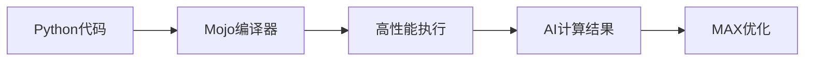
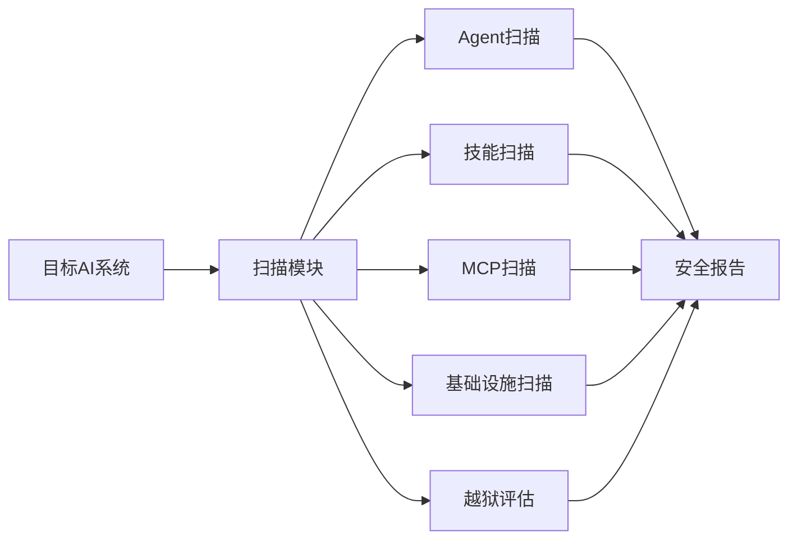

## 今日热点

AI编程助手与代理框架引领今日热榜，开发者对AI辅助编程工具需求激增，同时AI安全与基础设施项目崭露头角。

---

## 热门项目一览

| 排名 | 项目 | 语言 | 今日 | 总计 | 简介 |
|:---:|------|:----:|------:|-----:|------|
| 1 | [mattpocock/skills](https://github.com/mattpocock/skills) | Shell | +2,683 | 232,042 | Skills for Real Engineers. ... |
| 2 | [openai/codex](https://github.com/openai/codex) | Rust | +1,544 | 113,368 | Lightweight coding agent th... |
| 3 | [AprilNEA/OpenLogi](https://github.com/AprilNEA/OpenLogi) | Rust | +959 | 13,940 | ⚡️A native, local-first alt... |
| 4 | [ripienaar/free-for-dev](https://github.com/ripienaar/free-for-dev) | HTML | +829 | 133,907 | A list of SaaS, PaaS and Ia... |
| 5 | [obra/superpowers](https://github.com/obra/superpowers) | Shell | +592 | 276,191 | An agentic skills framework... |
| 6 | [mahlernim/google-timeline-visualizer](https://github.com/mahlernim/google-timeline-visualizer) | Kotlin | +441 | 2,565 | Visualize your year in trav... |
| 7 | [affaan-m/ECC](https://github.com/affaan-m/ECC) | JavaScript | +411 | 242,170 | The agent harness performan... |
| 8 | [modular/modular](https://github.com/modular/modular) | Mojo | +395 | 28,843 | The Modular Platform (inclu... |
| 9 | [multica-ai/andrej-karpathy-skills](https://github.com/multica-ai/andrej-karpathy-skills) | Unknown | +315 | 205,304 | A single CLAUDE.md file to ... |
| 10 | [cursor/plugins](https://github.com/cursor/plugins) | TypeScript | +286 | 4,663 | Cursor plugin specification... |
| 11 | [PostHog/posthog](https://github.com/PostHog/posthog) | Python | +286 | 38,615 | 🦔 PostHog is the leading pl... |
| 12 | [Wei-Shaw/sub2api](https://github.com/Wei-Shaw/sub2api) | Go | +278 | 38,784 | Sub2API 一站式开源中转服务，让 Claude、... |

---

## 趋势洞察

```
┌─────────────────────────────────────────────────────────────────┐
│  AI/ML 工具         ████████████████████████  10 个项目        │
│  其他               █████████                 4 个项目        │
│  智能家居             ██                        1 个项目        │
│  项目管理             ██                        1 个项目        │
│  数据分析             ██                        1 个项目        │
└─────────────────────────────────────────────────────────────────┘
```

---

## 项目深度解读

### 1. mattpocock/skills — 工程师技能库

> **一句话总结**：一个来自开发者真实环境的Shell脚本工具集，提供实用工程技能与命令。

#### 价值主张

| 维度 | 说明 |
|------|------|
| **解决痛点** | 提供工程师日常工作中常用的脚本与命令，减少重复工作 |
| **目标用户** | 开发者、系统工程师、DevOps工程师 |
| **核心亮点** | 实用性强 + 真实场景验证 + 精简高效 |

#### 技术架构


**技术特色**：
- 基于Shell脚本，跨平台兼容性好
- 从实际工作场景提取，实用性强
- 精简设计，专注核心功能

#### 热度分析

- 项目Star数超23万，日增2.6k+，表明社区认可度高且持续增长
- 高Fork比例说明项目不仅被使用，还被广泛定制和扩展

#### 快速上手

```bash
# 克隆项目到本地
git clone https://github.com/mattpocock/skills.git

# 进入项目目录
cd skills

# 查看可用技能
ls
```

#### 注意事项

- 项目许可证未知，商业使用前需确认授权条款
- 建议根据自身环境调整脚本参数，避免直接套用


### 2. openai/codex — 终端编程助手

> **一句话总结**：轻量级终端编程助手，通过AI技术提供代码生成与补全功能，提升开发效率

#### 价值主张

| 维度 | 说明 |
|------|------|
| **解决痛点** | 终端环境下代码生成与补全效率低，缺乏智能编程助手 |
| **目标用户** | 命令行开发者、系统程序员、自动化脚本编写者 |
| **核心亮点** | 轻量级设计 + 智能代码生成 + 终端原生集成 + Rust高性能实现 |

#### 技术架构


**技术特色**：
- Rust编写确保高性能与内存安全
- 轻量级设计适合终端环境运行
- 模块化架构便于功能扩展与定制

#### 热度分析

- 项目获得11万+星标，日增1500+，表明开发者社区对该工具高度认可
- Fork数与Star数比例健康，反映项目活跃度高，贡献者社区活跃

#### 快速上手

```bash
# 安装
cargo install codex

# 基本使用
codex init
codex generate "创建一个快速排序函数"
```

#### 注意事项
- 需要稳定的网络连接以获取AI模型服务
- 生成代码需人工审核，可能存在安全风险
- 长时间使用可能消耗较多系统资源


### 3. AprilNEA/OpenLogi — 罗技配置工具

> **一句话总结**：原生罗技设备配置工具，无需账户，支持按钮映射、DPI调整和SmartShift功能。

#### 价值主张

| 维度 | 说明 |
|------|------|
| **解决痛点** | 替代Logitech Options+，提供本地化、无账户的设备配置方案 |
| **目标用户** | 需要自定义罗技鼠标/键盘功能的隐私敏感用户 |
| **核心亮点** | 原生应用 + 无账户要求 + HID++协议支持 + 隐私保护 + 跨平台 |

#### 技术架构


**技术特色**：
- 使用Rust编写，提供内存安全和性能优势
- 通过HID++协议直接与罗技设备通信
- 本地-first架构，无需云端账户和遥测数据
- 跨平台支持，兼容Windows、macOS和Linux

#### 热度分析

- 项目近期获得大量关注，单日新增近千颗星，表明社区需求强烈
- Fork数量相对较少，说明项目主要处于使用阶段而非开发阶段
- 无开放问题，表明项目相对成熟或问题处理及时

#### 快速上手

```bash
# 安装
cargo install openlogi

# 扫描设备
openlogi scan

# 配置设备
openlogi config <device_id> --remap <button> <action>
```

#### 注意事项

- 仅支持罗技HID++协议设备，非所有罗技设备都兼容
- 需要适当的系统权限才能与硬件设备通信
- 配置更改可能需要重启设备或应用程序才能生效
- 项目可能仍在开发中，某些功能可能不够稳定


### 4. ripienaar/free-for-dev — [DevOps资源库]

> **一句话总结**：为DevOps和基础设施开发者提供全面的免费SaaS、PaaS和IaaS服务资源列表。

#### 价值主张

| 维度 | 说明 |
|------|------|
| **解决痛点** | 整合分散的免费云服务资源，减少开发者筛选时间 |
| **目标用户** | DevOps工程师、SRE、系统管理员和云架构师 |
| **核心亮点** | 资源分类细致 + 更新频率高 + 社区贡献活跃 + 覆盖面广 |

#### 技术架构

**技术特色**：
- 纯静态HTML实现，无需构建过程
- 简明清晰的Markdown格式便于维护
- 轻量级结构，支持快速浏览和搜索

#### 热度分析

- 项目Star数超13万，日均新增800+，呈现稳定增长趋势
- 作为DevOps领域重要资源库，在技术社区具有极高参考价值

#### 快速上手

```bash
# 克隆仓库
git clone https://github.com/ripienaar/free-for-dev.git

# 查看最新内容
cat README.md
```

#### 注意事项

- 免费服务条款可能随时变更，使用前请核实官方最新政策
- 部分服务可能有使用限制或需绑定支付方式，请仔细阅读条款


### 5. obra/superpowers — 开发技能框架

> **一句话总结**：基于代理模式的技能框架与软件开发方法论，提升开发者效率与能力。

#### 价值主张

| 维度 | 说明 |
|------|------|
| **解决痛点** | 提供系统化技能框架，解决开发者能力提升与高效开发方法问题 |
| **目标用户** | 软件开发者、技术团队、追求效率提升的个人 |
| **核心亮点** | 代理式框架 + 系统化方法论 + 实用工具集 + 可扩展设计 + 效率提升 |

#### 技术架构


**技术特色**：
- 基于 Shell 脚本的轻量级实现
- 模块化设计，易于扩展和定制
- 代理模式驱动的技能框架

#### 热度分析

- 项目获得超过27万星标，近期每日新增近600星，呈稳定增长态势
- 在开发者工具和方法论领域具有显著影响力，社区活跃度高

#### 快速上手

```bash
# 克隆项目
git clone https://github.com/obra/superpowers.git
# 进入目录
cd superpowers
# 运行初始化脚本
./init.sh
```

#### 注意事项
- 项目许可证未知，商业使用前需确认授权条款
- Shell 脚本可能需要特定环境支持，使用前请检查系统兼容性
- 建议先阅读项目文档，了解框架完整理念再投入使用


### 6. mahlernim/google-timeline-visualizer — 旅行轨迹可视化

> **一句话总结**：利用Google位置历史数据生成个人年度旅行可视化图表，直观展示足迹轨迹。

#### 价值主张

| 维度 | 说明 |
|------|------|
| **解决痛点** | 解决个人无法直观查看和展示自己一年旅行轨迹的问题 |
| **目标用户** | 经常旅行、想要可视化自己足迹和旅行轨迹的用户 |
| **核心亮点** | 使用Google Timeline数据 + 生成年度旅行可视化图表 + 直观展示足迹轨迹 |

#### 技术架构


**技术特色**：
- 基于Kotlin语言开发，跨平台支持
- 处理Google Location History API数据
- 使用可视化库生成直观的旅行轨迹图

#### 热度分析

- 项目获得2555个Star，单日新增441个，表明近期热度迅速上升。
- 作为个人旅行数据可视化工具，在隐私意识增强和旅行记录需求增长的背景下具有良好生态位置。

#### 快速上手

```bash
# 克隆项目
git clone https://github.com/mahlernim/google-timeline-visualizer.git

# 运行项目
./gradlew run
```

#### 注意事项

- 需要获取Google Location History数据才能使用
- 可能需要处理个人数据隐私问题
- 项目依赖Google服务，可能受API变更影响


### 7. affaan-m/ECC — AI代码助手优化

> **一句话总结**：为多个AI编程助手提供性能优化，增强代码生成质量和开发效率的综合性系统。

#### 价值主张

| 维度 | 说明 |
|------|------|
| **解决痛点** | AI代码助手响应慢、上下文理解有限、代码质量不稳定 |
| **目标用户** | 使用Claude Code、Codex、Cursor等AI工具的开发者 |
| **核心亮点** | + 技能优化 + 本能增强 + 记忆管理 + 安全保障 + 研究优先开发 |

#### 技术架构


**技术特色**：
- 多AI助手统一优化框架，提升通用性和兼容性
- 智能上下文管理，增强长程记忆和上下文连贯性
- 安全代码过滤机制，防止敏感信息泄露和潜在风险

#### 热度分析

- 项目Star数超24万，日增400+，处于快速增长期，表明市场需求强劲
- 高fork低issue比例，表明项目实用性强，社区活跃度高且问题解决效率高

#### 快速上手

```bash
# 克隆项目
git clone https://github.com/affaan-m/ECC.git

# 安装依赖
npm install

# 启动服务
npm start
```

#### 注意事项

- 项目许可证信息不明确，商业使用前需确认授权条款
- 需要配合相应的AI代码助手工具使用才能发挥完整功能
- 部分高级功能可能需要额外配置或订阅服务


### 8. modular/modular — 高性能AI平台

> **一句话总结**：Modular平台提供高性能AI计算能力，Mojo语言结合Python易用性与C++性能。

#### 价值主张

| 维度 | 说明 |
|------|------|
| **解决痛点** | 传统AI开发语言在性能和易用性之间难以平衡，开发效率与执行效率难以兼得 |
| **目标用户** | AI开发者、高性能计算研究人员、机器学习工程师 |
| **核心亮点** | Mojo语言高性能 + Python生态兼容 + 模块化设计 + 跨平台支持 + 零成本抽象 |

#### 技术架构



**技术特色**：
- Mojo语言融合Python语法与C++性能
- 零成本抽象，无需手动优化即可获得高性能
- 与Python生态系统无缝集成

#### 热度分析

- 项目Star数增长迅速，单日增长近400，显示开发者社区高度关注
- 作为新兴AI编程语言，正在快速建立开发者生态和社区影响力

#### 快速上手

```bash
# 安装Modular
curl -sSL https://get.modular.com | sh

# 安装Mojo
modular install mojo

# 运行示例程序
mojo examples/hello.mojo
```

#### 注意事项

- Mojo作为新兴语言，生态系统仍在发展中，部分Python库可能不完全兼容
- 项目文档和教程资源相对有限，学习曲线可能较陡
- 许可证信息不明确，使用前需确认商业使用条款


### 9. multica-ai/andrej-karpathy-skills — LLM优化指南

> **一句话总结**：基于Karpathy观察的Claude编程优化指南，提升AI代码生成质量

#### 价值主张

| 维度 | 说明 |
|------|------|
| **解决痛点** | 解决LLM编程中的常见陷阱，提高代码生成质量 |
| **目标用户** | 使用AI编程助手的开发者 |
| **核心亮点** | 基于Karpathy权威见解 + 简洁指南格式 + 实用编程建议 |

#### 技术架构

**技术特色**：
- 基于AI编程权威的实践经验总结
- 精简的指导文档，易于实施
- 专注于提升AI代码生成的实际效果

#### 热度分析

- 项目获得超过20万星，表明AI编程优化需求强烈
- 零开放问题，说明文档内容已满足用户需求

#### 快速上手

```bash
# 直接查看CLAUDE.md文件获取所有建议
# 在Claude Code中应用这些建议提升编程体验
```

#### 注意事项
- 本指南专为Claude Code优化，其他AI编程助手可能不完全适用
- 需要结合实际编程经验灵活应用，而非机械遵循


### 10. cursor/plugins — AI编辑器插件

> **一句话总结**：Cursor编辑器的官方插件规范与实现，扩展AI编程功能的核心组件

#### 价值主张

| 维度 | 说明 |
|------|------|
| **解决痛点** | 为Cursor编辑器提供可扩展的AI功能插件生态，增强编程体验 |
| **目标用户** | Cursor编辑器用户、AI辅助编程开发者、插件开发者 |
| **核心亮点** | + TypeScript规范实现 + AI功能扩展 + 插件标准化 + 官方示例 |

#### 技术架构


**技术特色**：
- 基于TypeScript类型系统确保插件API的强类型安全
- 采用模块化设计，支持插件间的功能组合
- 提供完整的插件生命周期管理机制

#### 热度分析

- Star增长迅速，单日增加286星，表明项目受社区高度关注
- Fork数相对较少，说明用户更倾向于直接使用而非二次开发

#### 快速上手

```bash
# 克隆项目
git clone https://github.com/cursor/plugins.git
# 安装依赖
npm install
# 构建插件
npm run build
```

#### 注意事项

- 需要配合Cursor编辑器使用，单独使用价值有限
- 插件API可能随Cursor版本更新而变化，需关注兼容性


### 11. PostHog/posthog — 全栈产品分析平台

> **一句话总结**：集成AI可观测性、分析、会话回放等工具，助力开发者构建数据驱动的智能产品。

#### 价值主张

| 维度 | 说明 |
|------|------|
| **解决痛点** | 解决产品数据分散、用户体验难以追踪、系统性能监控不全面的问题 |
| **目标用户** | 开发团队、产品经理、数据分析师和技术运营人员 |
| **核心亮点** | 全面的产品分析能力 + AI驱动的可观测性 + 多渠道集成控制 |

#### 技术架构


**技术特色**：
- Python构建的多功能分析平台，支持实时数据处理
- 集成AI技术的可观测性解决方案，提供智能洞察
- 支持Slack、Web、桌面等多渠道控制，提升团队协作效率

#### 热度分析

- 项目获得38,615个Star，近期增长迅速（今日+286），表明其在产品分析领域具有高人气和认可度。
- 作为产品分析领域的竞争者，PostHog 与 Mixpanel、Amplitude 等传统分析工具形成差异化竞争，强调AI集成和开发者体验。

#### 快速上手

```bash
# 安装PostHog Python客户端
pip install posthog

# 初始化PostHog客户端
from posthog import Posthog
posthog = Posthog('YOUR_API_KEY')

# 跟踪事件
posthog.capture('user_id', 'event_name', properties={'property': 'value'})
```

#### 注意事项

- 项目许可证信息未知，使用前需确认许可证条款
- 作为商业产品，高级功能可能需要付费订阅
- 需要配置适当的隐私设置，确保合规收集用户数据


### 12. Wei-Shaw/sub2api — AI服务中转平台

> **一句话总结**：一站式开源中转服务，整合多AI平台API，支持拼车共享降低成本

#### 价值主张

| 维度 | 说明 |
|------|------|
| **解决痛点** | 解决多AI服务API分散、成本高的问题，提供统一接入点 |
| **目标用户** | 需要使用多个AI服务的开发者和企业用户 |
| **核心亮点** | 多平台统一接入 + 拼车共享功能 + 成本优化 + 无缝集成 |

#### 技术架构


**技术特色**：
- 基于Go语言开发，性能高效且资源占用低
- 支持Claude、OpenAI、Gemini、Grok等多平台API统一接入
- 实现智能拼车机制，优化资源利用率降低成本

#### 热度分析

- Star数高且持续增长(+278 today)，表明项目受到广泛关注和认可
- Fork数高(8,039)，说明社区活跃，有大量用户进行二次开发和使用

#### 快速上手

```bash
# 克隆项目
git clone https://github.com/Wei-Shaw/sub2api.git

# 进入项目目录
cd sub2api

# 运行服务
go run main.go
```

#### 注意事项

- 项目许可证未知，使用前需确认授权条款
- 需要配置各个AI服务的API密钥才能正常使用
- 拼车共享功能可能涉及数据隐私问题，需谨慎使用


### 13. makeplane/plane — 开源项目管理平台

> **一句话总结**：现代化开源项目管理工具，提供任务、冲刺和文档管理功能，替代商业项目管理方案。

#### 价值主张

| 维度 | 说明 |
|------|------|
| **解决痛点** | 解决商业项目管理工具高昂成本和封闭生态问题 |
| **目标用户** | 软件开发团队、敏捷开发团队和企业项目管理者 |
| **核心亮点** | 开源免费 + 现代化界面 + 多项目管理 + 文档集成 + API支持 |

#### 技术架构


**技术特色**：
- 基于TypeScript的全栈开发确保代码质量和类型安全
- 采用现代化前端框架构建响应式用户界面
- 提供RESTful API支持第三方工具集成

#### 热度分析

- 项目获得57k+星标且持续增长，表明市场对开源项目管理工具有强烈需求
- Fork数适中，说明社区参与度良好，但可能不如主流项目活跃

#### 快速上手

```bash
# 克隆项目
git clone https://github.com/makeplane/plane.git
# 安装依赖
npm install
# 启动开发服务器
npm run dev
```

#### 注意事项

- 项目许可证未知，商业使用前需确认授权条款
- 作为开源项目，可能需要自行部署和维护服务器资源


### 14. Tencent/AI-Infra-Guard — AI安全测试平台

> **一句话总结**：全栈AI红队平台，提供多维度扫描与评估能力，保障AI系统安全。

#### 价值主张

| 维度 | 说明 |
|------|------|
| **解决痛点** | AI系统安全漏洞检测与防御，解决AI应用潜在风险 |
| **目标用户** | AI安全研究员、渗透测试团队、AI系统开发运维人员 |
| **核心亮点** | 全栈安全测试 + 多维度扫描 + 自动化评估 + 详细报告生成 + 易于集成 |

#### 技术架构



**技术特色**：
- 基于Python开发，模块化设计便于扩展
- 集成多种扫描技术，全面覆盖AI系统安全维度
- 自动化评估流程，提升测试效率

#### 热度分析

- 项目获星5,494且持续增长，日均新增150星，表明社区认可度高
- Fork数518显示项目有一定二次开发价值，但问题数为0需关注社区反馈渠道

#### 快速上手

```bash
git clone https://github.com/Tencent/AI-Infra-Guard.git
cd AI-Infra-Guard
pip install -r requirements.txt
python -m ai_infra_guard --help
```

#### 注意事项

- 注意许可证信息不明确，使用前需确认具体授权条款
- 可能需要配置API密钥和访问权限才能完整使用扫描功能
- 项目文档可能不够完善，建议参考代码示例和issue区获取使用指导


### 15. n8n-io/n8n — 自动化工作流平台

> **一句话总结**：工作流自动化平台，融合可视化构建与代码编辑，支持AI能力和400+集成，灵活部署。

#### 价值主张

| 维度 | 说明 |
|------|------|
| **解决痛点** | 企业工作流自动化需求，无需编程也能构建复杂流程 |
| **目标用户** | 开发者、自动化工程师、IT管理员和业务分析师 |
| **核心亮点** | 可视化工作流编辑器 + 自定义代码节点 + AI能力 + 400+集成 + 自托管/云部署 |

#### 技术架构


**技术特色**：
- 基于TypeScript的全栈应用，保证类型安全
- 插件化节点架构，支持扩展和自定义
- 内置执行引擎，支持复杂工作流逻辑和条件分支
- 支持多种数据库后端，包括PostgreSQL、MySQL等
- 提供REST API和Webhook接口，便于集成

#### 热度分析

- Star数超过20万，Fork数超过6万，表明项目拥有庞大且活跃的用户社区
- 作为工作流自动化领域的领先项目，与Zapier、Make(以前是Integromat)等形成竞争，但开源特性使其在开发者社区中更具吸引力

#### 快速上手

```bash
# 使用Docker启动n8n
docker run -it --rm --name n8n -p 5678:5678 n8nio/n8n

# 或者使用npm安装
npm install n8n
```

#### 注意事项

- n8n需要数据库支持，默认使用SQLite，生产环境建议使用PostgreSQL
- 工作流复杂度增加时，可能需要优化节点执行顺序和并行处理
- 自定义节点开发需要了解n8n的节点开发框架和API


### 16. anthropics/claude-code — AI编程助手

> **一句话总结**：Claude Code是终端内AI编程助手，能理解代码库并执行自然语言命令完成编程任务。

#### 价值主张

| 维度 | 说明 |
|------|------|
| **解决痛点** | 开发者日常编程任务繁琐、代码理解困难、Git操作复杂 |
| **目标用户** | 软件开发者、程序员、全栈工程师 |
| **核心亮点** | 自然语言交互 + 代码库理解 + 自动化任务执行 + Git工作流集成 + 代码解释功能 |

#### 技术架构


**技术特色**：
- 集成Claude大语言模型理解上下文代码
- 终端内直接运行，无需切换开发环境
- 支持复杂代码库的理解和分析
- 自然语言到代码执行的转化能力
- Git工作流的自动化处理

#### 热度分析

- 项目获得14万+星标，单日增长127，显示开发者社区高度认可
- 作为Anthropic官方工具，在AI编程助手领域占据重要生态位置

#### 快速上手

```bash
# 安装Claude Code
pip install anthropic-claude-code

# 初始化项目
claude-code init

# 使用自然语言命令
claude-code "解释这个函数的功能"
claude-code "添加错误处理到这段代码"
```

#### 注意事项

- 需要Anthropic API密钥才能使用
- 可能对大型代码库的理解有限制
- 代码生成质量依赖于模型能力和提示词质量
- 建议在非生产环境测试后再应用于关键项目


### 17. microsoft/TypeScript — 静态类型JS超集

> **一句话总结**：TypeScript为JavaScript添加静态类型系统，提升代码质量与可维护性。

#### 价值主张

| 维度 | 说明 |
|------|------|
| **解决痛点** | JavaScript缺乏类型系统导致的大型项目维护困难与运行时错误 |
| **目标用户** | 中大型项目开发团队、追求代码质量的前端开发者 |
| **核心亮点** | 静态类型检查 + 渐进式采用 + IDE智能支持 + ECMAScript新特性支持 |

#### 技术架构


**技术特色**：
- 基于JavaScript语法的类型系统扩展
- 渐进式类型支持，可与现有JS代码混用
- 完整的IDE支持与智能提示

#### 热度分析

- TypeScript作为前端开发必备工具，持续获得高关注度，Star数稳定增长
- 微软维护的开源项目，拥有活跃的社区贡献与企业级应用支持

#### 快速上手

```bash
# 安装TypeScript
npm install -g typescript

# 编译TypeScript文件
tsc yourfile.ts
```

#### 注意事项
- TypeScript需要学习类型系统，有学习曲线
- 与JavaScript的互操作性可能导致类型推断问题
- 项目规模越大，TypeScript带来的收益越明显


## 今日推荐

| 主题 | 推荐项目 | 亮点 |
|------|----------|------|
| 今日最热 | [mattpocock/skills](https://github.com/mattpocock/skills) | Skills for Real E... |
| 值得关注 | [openai/codex](https://github.com/openai/codex) | Lightweight codin... |
| 快速上手 | [AprilNEA/OpenLogi](https://github.com/AprilNEA/OpenLogi) | ⚡️A native, local... |
| 长期潜力 | [ripienaar/free-for-dev](https://github.com/ripienaar/free-for-dev) | A list of SaaS, P... |

---

<div align="center">

*Generated on 2026-08-23 | Powered by GitHub Trending Reporter*

</div>