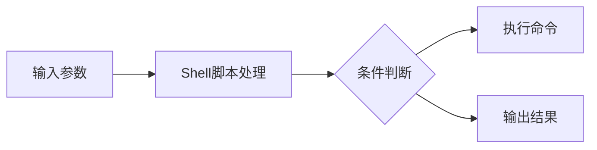
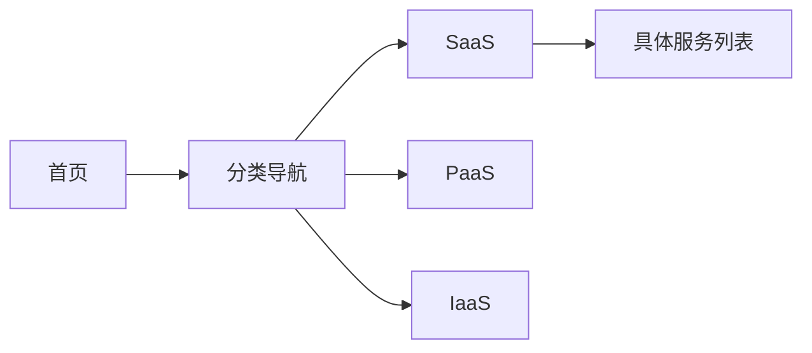
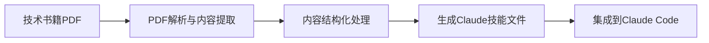
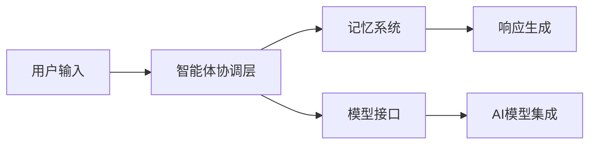
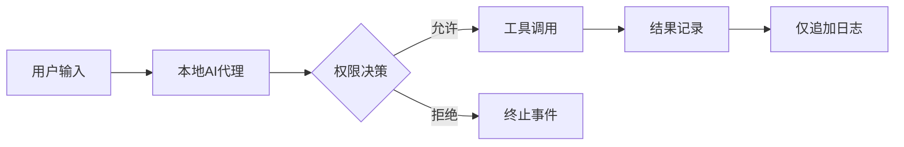

## 今日热点

今日GitHub热榜项目精彩纷呈。

---

## 热门项目一览

| 排名 | 项目 | 语言 | 今日 | 总计 | 简介 |
|:---:|------|:----:|------:|-----:|------|
| 1 | [openai/codex](https://github.com/openai/codex) | Rust | +2,715 | 115,162 | Lightweight coding agent th... |
| 2 | [mattpocock/skills](https://github.com/mattpocock/skills) | Shell | +2,447 | 233,846 | Skills for Real Engineers. ... |
| 3 | [Alishahryar1/free-claude-code](https://github.com/Alishahryar1/free-claude-code) | Python | +1,081 | 47,961 | Use Claude Code, Codex, Pi,... |
| 4 | [AprilNEA/OpenLogi](https://github.com/AprilNEA/OpenLogi) | Rust | +1,009 | 14,936 | ⚡️A native, local-first alt... |
| 5 | [basecamp/omarchy](https://github.com/basecamp/omarchy) | Shell | +750 | 29,128 | Beautiful, Modern & Opinion... |
| 6 | [ripienaar/free-for-dev](https://github.com/ripienaar/free-for-dev) | HTML | +615 | 134,423 | A list of SaaS, PaaS and Ia... |
| 7 | [NousResearch/hermes-agent](https://github.com/NousResearch/hermes-agent) | Python | +454 | 234,986 | The agent that grows with you |
| 8 | [affaan-m/ECC](https://github.com/affaan-m/ECC) | JavaScript | +427 | 242,554 | The agent harness performan... |
| 9 | [virgiliojr94/book-to-skill](https://github.com/virgiliojr94/book-to-skill) | Python | +417 | 24,657 | Turn any technical book PDF... |
| 10 | [block/buzz](https://github.com/block/buzz) | Rust | +410 | 30,103 | A hive mind communication p... |
| 11 | [freestylefly/awesome-gpt-image-2](https://github.com/freestylefly/awesome-gpt-image-2) | JavaScript | +401 | 12,702 | Prompt as Code | GPT-Image2... |
| 12 | [anthropics/claude-plugins-community](https://github.com/anthropics/claude-plugins-community) | Python | +225 | 942 | Community plugin marketplac... |

---

## 趋势洞察

```
┌─────────────────────────────────────────────────────────────────┐
│  AI/ML 工具         ████████████████████████  12 个项目        │
│  其他               ██████                    3 个项目        │
│  多媒体应用            ████                      2 个项目        │
│  智能家居             ██                        1 个项目        │
└─────────────────────────────────────────────────────────────────┘
```

---

## 项目深度解读

### 1. openai/codex — 轻量代码代理

> **一句话总结**：一款运行在终端的轻量级编程代理，提供高效的代码生成和辅助功能。

#### 价值主张

| 维度 | 说明 |
|------|------|
| **解决痛点** | 提供终端内直接编程辅助，减少上下文切换，提升编码效率 |
| **目标用户** | 开发者、程序员、命令行工具爱好者 |
| **核心亮点** | 轻量级 + 终端集成 + AI辅助编程 |

#### 技术架构


**技术特色**：
- 基于Rust构建，保证高性能和低内存占用
- 终端原生集成，无需额外环境配置
- AI驱动代码生成，提供智能编程辅助

#### 热度分析

- Star数超过11.5万，近2.7k今日增长，表明项目正处在快速上升期，备受开发者关注
- Fork数近1.8万，说明社区参与度高，有大量用户基于此项目进行二次开发

#### 快速上手

```bash
# 安装codex
cargo install codex

# 启动codex
codex

# 在终端中直接使用编程辅助功能
codex "帮我写一个快速排序函数"
```

#### 注意事项

- 项目许可证未知，使用前需确认授权条款
- 作为AI编程助手，生成的代码可能需要人工审核和优化
- 可能需要OpenAI API密钥才能使用完整功能


### 2. mattpocock/skills — 工程师实用脚本集

> **一句话总结**：为工程师精心设计的实用Shell脚本集合，提供日常工作所需的各类工具和技巧。

#### 价值主张

| 维度 | 说明 |
|------|------|
| **解决痛点** | 提供工程师日常工作中的常见任务自动化脚本 |
| **目标用户** | 开发工程师、系统管理员、DevOps工程师 |
| **核心亮点** | 实用性强 + 高质量脚本 + 持续更新 + 社区驱动 |

#### 技术架构



**技术特色**：
- 纯Shell实现，跨平台兼容性强
- 模块化设计，各脚本功能独立
- 脚本精简高效，注重实用性

#### 热度分析

- 项目Star数超过23万，近期增长迅速，单日新增星标超过2400，表明社区认可度高
- 无Open Issues，说明项目维护良好，用户问题解决率高，社区参与度活跃

#### 快速上手

```bash
# 克隆项目到本地
git clone https://github.com/mattpocock/skills.git

# 进入项目目录
cd skills

# 查看可用脚本列表
ls -la
```

#### 注意事项

- 部分脚本可能需要特定环境支持，使用前请检查依赖
- Shell脚本执行时请注意权限问题，避免执行来源不明的脚本


### 3. Alishahryar1/free-claude-code — [免费AI代码助手]

> **一句话总结**：提供多种AI代码模型免费使用，支持多平台接入，拥有海量免费token

#### 价值主张

| 维度 | 说明 |
|------|------|
| **解决痛点** | 解决付费AI代码模型使用门槛高的问题，提供免费替代方案 |
| **目标用户** | 开发者、程序员、AI爱好者，需要低成本AI代码辅助的人群 |
| **核心亮点** | 支持多种AI模型 + 免费大量token + 多平台接入 + 语音支持 + ToS友好 |

#### 技术架构


**技术特色**：
- 无需官方API密钥即可使用多种AI模型
- 支持终端、应用、IDE、手机等多平台接入
- 实现了语音识别与响应功能
- 通过特殊机制绕过付费限制

#### 热度分析

- 项目Star数近4.8万，近期增长迅速(单日新增1k+)，表明需求旺盛
- Fork数近7.9k，说明社区积极参与二次开发和定制
- Issues数量为0，可能表明项目成熟或问题通过其他渠道解决

#### 快速上手

```bash
# 克隆项目
git clone https://github.com/Alishahryar1/free-claude-code.git

# 安装依赖并运行
cd free-claude-code
pip install -r requirements.txt
python main.py
```

#### 注意事项

- 此项目可能涉及绕过官方服务条款，使用时需注意合规性
- 免费token可能有使用限制或随时变更的可能
- 项目未明确许可证，使用时需注意开源合规问题
- 由于是第三方实现，稳定性和功能更新可能不如官方服务


### 4. AprilNEA/OpenLogi — 罗技鼠标工具

> **一句话总结**：本地化罗技鼠标配置工具，无需账户，支持按钮重映射、DPI调整和SmartShift功能。

#### 价值主张

| 维度 | 说明 |
|------|------|
| **解决痛点** | 提供本地化替代方案，避免Logitech Options+的账户需求和遥测数据收集 |
| **目标用户** | 注重隐私的罗技鼠标用户，需要高级自定义功能的游戏玩家和专业人士 |
| **核心亮点** | 本地化执行 + 隐私保护 + Rust高性能实现 + HID++协议支持 + 无需账户 |

#### 技术架构


**技术特色**：
- 使用Rust编写，确保高性能和内存安全
- 直接通过HID++协议与罗技设备通信，绕过官方软件
- 完全本地化处理，无需网络连接或云端服务

#### 热度分析

- 项目近期获得大量关注，单日Star增长超1000，表明社区需求强烈
- 较少的Fork数量反映项目维护活跃，用户更倾向于直接使用而非分叉修改

#### 快速上手

```bash
# 安装
cargo install openlogi

# 列出设备
openlogi --list-devices

# 重映射按钮
openlogi --remap 1 "left-click"
```

#### 注意事项

- 项目许可证类型未知，使用前需确认授权条款
- 仅支持支持HID++协议的罗技设备
- 可能需要管理员权限才能与硬件通信
- 功能可能受限于具体设备型号的支持情况


### 6. ripienaar/free-for-dev — 免费开发者资源库

> **一句话总结**：整理提供免费层的SaaS、PaaS和IaaS平台，为DevOps和基础设施开发者提供资源参考。

#### 价值主张

| 维度 | 说明 |
|------|------|
| **解决痛点** | 开发者难以发现和筛选有免费层的云服务和工具 |
| **目标用户** | DevOps工程师、基础设施开发者、软件开发者 |
| **核心亮点** | 资源全面 + 分类清晰 + 持续更新 + 社区驱动 + 实用性强 |

#### 技术架构



**技术特色**：
- 纯HTML静态页面，加载速度快
- 响应式设计，适配多设备浏览
- 简洁明了的分类和组织结构
- 依赖社区贡献保持内容更新

#### 热度分析

- 超过13.4万星，日增600+，表明开发者社区对该资源的高度认可和需求
- 作为开发者工具资源库，已成为DevOps和云开发领域的权威参考指南

#### 快速上手

```bash
# 克隆仓库到本地
git clone https://github.com/ripienaar/free-for-dev.git

# 使用浏览器打开index.html查看内容
open index.html
```

#### 注意事项

- 项目主要依赖社区贡献更新，某些服务的免费政策可能已变化
- 部分服务可能需要注册账号或信用卡才能激活免费层
- 不同地区的服务可用性和免费额度可能存在差异


### 7. NousResearch/hermes-agent — 成长型智能代理

> **一句话总结**：随用户需求持续成长的智能代理系统，提供可扩展的AI助手功能。

#### 价值主张

| 维度 | 说明 |
|------|------|
| **解决痛点** | 解决固定功能AI助手无法适应个性化需求的问题 |
| **目标用户** | 需要定制化AI助手的开发者和研究人员 |
| **核心亮点** | 自学习能力 + 可扩展架构 + 个性化适应 |

#### 技术架构


**技术特色**：
- 持续学习机制，根据用户反馈优化响应
- 模块化架构，支持功能扩展
- 知识库动态更新，保持信息时效性

#### 热度分析

- 项目Star数接近25万，日增约450，表明社区活跃度高，需求旺盛
- 作为AI代理领域的代表项目，处于开源生态的核心位置

#### 快速上手

```bash
# 克隆仓库
git clone https://github.com/NousResearch/hermes-agent.git

# 安装依赖
pip install -r requirements.txt

# 运行示例
python examples/basic_agent.py
```

#### 注意事项

- 项目许可证未知，商业使用前需确认授权条款
- 可能需要较高的计算资源，建议使用GPU加速
- 随着功能增加，配置复杂度可能提高


### 8. affaan-m/ECC — AI代码优化系统

> **一句话总结**：为多种AI编程助手提供性能优化的系统，增强技能、记忆和安全特性。

#### 价值主张

| 维度 | 说明 |
|------|------|
| **解决痛点** | 提升AI代码助手性能，解决响应速度和代码质量优化问题 |
| **目标用户** | 使用AI编程工具的开发者和AI代码助手开发者 |
| **核心亮点** | 技能增强 + 本能优化 + 记忆管理 + 安全保障 + 研究优先开发 |

#### 技术架构


**技术特色**：
- 多AI平台兼容性，支持主流AI编程工具
- 智能记忆管理系统，提升上下文理解
- 安全过滤机制，确保代码安全性

#### 热度分析

- 高Star数表明项目广受开发者认可，近期增长稳定
- 社区活跃度高，Fork数量反映了二次开发需求旺盛

#### 快速上手

```bash
# 克隆项目
git clone https://github.com/affaan-m/ECC.git

# 安装依赖
npm install
```

#### 注意事项

- 项目许可证未知，使用前需确认开源协议
- 项目描述较为简略，建议查看README获取更详细信息
- 由于Open Issues为0，问题可能通过其他渠道反馈


### 9. virgiliojr94/book-to-skill — 书籍转技能

> **一句话总结**：将技术书籍PDF转换为Claude Code技能，实现学习与工作无缝衔接。

#### 价值主张

| 维度 | 说明 |
|------|------|
| **解决痛点** | 解决技术书籍阅读后难以在实际工作中快速参考的问题 |
| **目标用户** | 技术学习者、开发者、研究人员 |
| **核心亮点** | PDF解析 + 内容结构化 + Claude技能集成 |

#### 技术架构



**技术特色**：
- 使用Python实现PDF解析与内容提取
- 支持复杂技术内容的结构化处理
- 自动生成可交互的Claude技能文件

#### 热度分析

- 项目Star数高且增长迅速，表明技术社区对此类工具需求强烈
- Fork数适中，显示项目已被广泛尝试使用和二次开发

#### 快速上手

```bash
# 安装依赖
pip install -r requirements.txt

# 运行转换
python book_to_skill.py input.pdf output.skill
```

#### 注意事项

- 需要确保PDF内容可被正确提取，扫描版PDF可能无法处理
- 生成的技能文件可能需要根据具体需求进行微调
- 注意版权问题，仅限个人学习使用


### 10. block/buzz — 群体思维协作平台

> **一句话总结**：基于 Rust 开发的高性能蜂群思维通信平台，实现多人实时协作与思维同步。

#### 价值主张

| 维度 | 说明 |
|------|------|
| **解决痛点** | 解决分布式团队实时协作和思维同步效率低下的问题 |
| **目标用户** | 需要高效实时协作的分布式团队、创意工作者和项目管理者 |
| **核心亮点** | 基于 Rust 高性能架构 + 实时通信能力 + 思维同步机制 + 分布式架构 + 高可扩展性 |

#### 技术架构


**技术特色**：
- 基于 Rust 的高性能并发处理能力
- 实时通信与状态同步机制
- 分布式架构确保高可用性

#### 热度分析
- 项目获得3万+星标且持续增长，表明在协作工具领域有显著影响力
- 无开放问题显示项目成熟度高，社区维护良好

#### 快速上手

```bash
# 克隆项目
git clone https://github.com/block/buzz.git
# 进入项目目录
cd buzz
# 运行项目
cargo run
```

#### 注意事项
- 项目 License 不明确，使用前需确认开源协议
- 需要一定的 Rust 开发经验才能进行二次开发
- 可能需要额外的依赖和环境配置


### 11. freestylefly/awesome-gpt-image-2 — AI提示词工程

> **一句话总结**：470+ GPT-Image2案例逆向工程与20+工业级模板，将提示词工程化并持续更新。

#### 价值主张

| 维度 | 说明 |
|------|------|
| **解决痛点** | AI提示词缺乏系统性、可复用性和标准化问题 |
| **目标用户** | AI开发者、提示词工程师和AI应用创作者 |
| **核心亮点** | 大量案例逆向工程 + 工业级模板库 + Skills提炼 + 持续更新 + Prompt as Code理念 |

#### 技术架构


**技术特色**：
- 基于JavaScript的提示词工程化方法
- 470+案例逆向工程技术分析
- 工业级模板库系统化构建

#### 热度分析

- 项目Star数达12,702，日增401，显示极高的社区关注度和增长速度
- 作为AI提示词工程领域的标杆项目，已成为相关开发者的必备资源库

#### 快速上手

```bash
# 克隆项目到本地
git clone https://github.com/freestylefly/awesome-gpt-image-2.git

# 浏览模板和案例
cd awesome-gpt-image-2 && ls
```

#### 注意事项

- 注意项目许可证信息不明确，商业使用前需确认
- 模板和案例需要根据具体应用场景进行调整，不能直接套用
- 项目持续更新，建议定期关注最新内容和模板优化


### 12. anthropics/claude-plugins-community — 社区插件市场

> **一句话总结**：Claude 生态的社区插件只读市场，促进功能扩展与协作。

#### 价值主张

| 维度 | 说明 |
|------|------|
| **解决痛点** | 提供集中化的 Claude 插件发现与获取渠道 |
| **目标用户** | Claude Cowork 和 Claude Code 用户及开发者 |
| **核心亮点** | 社区驱动 + 插件目录 + 只读镜像 + 提交标准化 |

#### 技术架构

**技术特色**：
- 基于 Python 构建的插件管理系统
- 提供标准化的插件提交流程
- 采用只读镜像确保数据一致性

#### 热度分析

- 项目短期内增长迅速，单日增加225 stars，显示社区关注度高涨
- 作为官方社区的插件市场，在 Claude 生态中占据重要位置

#### 快速上手

```bash
# 访问社区插件市场
git clone https://github.com/anthropics/claude-plugins-community.git
cd claude-plugins-community
```

#### 注意事项

- 这是一个只读镜像，插件提交需要通过 clau.de/plugin-directory-submission
- 项目没有开源许可证，使用前需确认授权条款
- Open Issues 为0，可能表示问题通过其他渠道处理


### 13. Comfy-Org/ComfyUI — 节点式AI绘画平台

> **一句话总结**：基于节点界面的强大扩散模型系统，为AI绘画提供灵活可扩展的解决方案。

#### 价值主张

| 维度 | 说明 |
|------|------|
| **解决痛点** | 解决传统AI绘画工具不够灵活、难以定制复杂工作流的问题 |
| **目标用户** | AI艺术家、研究人员、开发者及需要高级定制化工作流的专业用户 |
| **核心亮点** | 节点式可视化工作流 + 高度模块化 + 强大的API支持 + 扩展性强 |

#### 技术架构


**技术特色**：
- 基于Python构建的模块化架构
- 节点式可视化编程界面
- 支持多种扩散模型后端
- 提供完整的API接口

#### 热度分析

- 项目获得超12.9万星，显示其在AI绘画领域的显著影响力，且持续增长中
- 在AI创作工具生态中占据重要位置，成为节点式AI工作流的标准解决方案

#### 快速上手

```bash
# 克隆仓库
git clone https://github.com/comfy-org/ComfyUI.git
# 安装依赖
pip install -r requirements.txt
# 运行应用
python main.py
```

#### 注意事项

- 项目可能需要较高配置的GPU以获得最佳性能
- 节点式界面对新手有一定学习曲线
- 需要一定的技术背景以充分利用其高级功能
- 许可证信息不明确，使用前需确认授权条款


### 14. VoltAgent/awesome-agent-skills — AI技能库

> **一句话总结**：精选1000+AI代理技能库，兼容Claude、Codex等多平台，提升开发者工作效率。

#### 价值主张

| 维度 | 说明 |
|------|------|
| **解决痛点** | 解决AI代理工具技能分散、难以发现和使用的问题 |
| **目标用户** | AI开发者、使用AI编程工具的技术人员 |
| **核心亮点** | 超过1000个精选技能 + 多平台兼容性 + 官方社区双重来源 |

#### 技术架构

**技术特色**：
- 精选与分类系统，确保技能质量和可用性
- 多平台兼容适配机制，支持主流AI编程工具
- 社区驱动的持续更新机制，保持资源时效性

#### 热度分析

- 超过3万星且每日新增150+星，显示强劲增长势头和社区认可度
- 作为AI开发工具生态的关键资源库，处于AI辅助开发工具的核心位置

#### 快速上手

```bash
# 克隆仓库查看所有技能
git clone https://github.com/VoltAgent/awesome-agent-skills.git

# 浏览README.md了解分类和如何使用
cat awesome-agent-skills/README.md
```

#### 注意事项

- 技能质量可能参差不齐，使用前需自行评估和测试
- 部分技能可能需要特定环境或配置才能正常工作
- 项目持续更新，建议定期查看更新以获取最新技能


### 15. ruvnet/ruflo — 智能体协调平台

> **一句话总结**：一个用于部署多智能体系统和构建对话式AI的元工具套件，支持自适应记忆和多种AI模型集成。

#### 价值主张

| 维度 | 说明 |
|------|------|
| **解决痛点** | 简化复杂多智能体系统的构建和部署，提供统一协调框架 |
| **目标用户** | AI开发者、对话系统构建者、自动化工作流设计者 |
| **核心亮点** | 多智能体协调 + 自适应记忆 + RAG集成 + 多模型支持 + 自学习能力 |

#### 技术架构



**技术特色**：
- 多智能体协同工作框架，支持复杂任务分解
- 自适应记忆系统，智能体可共享学习经验
- 统一接口支持多种主流AI模型

#### 热度分析

- Star数达69,069且持续增长(+131/天)，表明项目受广泛关注且活跃度高
- Fork数8,273显示社区参与度高，有大量二次开发和定制应用

#### 快速上手

```bash
# 克隆项目
git clone https://github.com/ruvnet/ruflo.git

# 安装依赖
npm install

# 启动示例
npm run example
```

#### 注意事项

- 项目许可证未知，使用前需确认商业使用限制
- 集成多种AI模型可能涉及不同的API成本和使用条款
- 多智能体系统的复杂度可能带来调试和维护挑战


### 16. dani-garcia/vaultwarden — 自托管密码管理

> **一句话总结**：Rust编写的非官方Bitwarden兼容服务器，提供安全自托管密码管理解决方案。

#### 价值主张

| 维度 | 说明 |
|------|------|
| **解决痛点** | 解决密码数据自托管需求，避免依赖第三方云服务 |
| **目标用户** | 注重隐私安全的技术用户和小型团队 |
| **核心亮点** | 轻量级 + 高性能 + 安全可靠 + 兼容Bitwarden客户端 |

#### 技术架构


**技术特色**：
- 使用Rust语言编写，内存安全且性能优异
- 兼容Bitwarden官方API，客户端无缝对接
- 实现端到端加密，保障用户数据安全

#### 热度分析

- 项目获得近6万星，持续稳定增长，反映社区高度认可
- 作为隐私保护领域的热门项目，在自托管解决方案中占据重要位置

#### 快速上手

```bash
# 安装Docker并运行
docker run -d --name vaultwarden \
  -e SIGNUPS_ALLOWED=true \
  -v /vw-data/:/data/ \
  vaultwarden/server:latest
```

#### 注意事项

- 需要自行管理服务器安全更新和数据备份
- 不建议用于生产环境大量用户，性能可能有限
- 需要定期更新以获取安全补丁和新功能


### 17. apache/maka — 本地AI工作空间

> **一句话总结**：基于本地优先的AI代理工作空间，以仅追加日志形式记录所有交互事件。

#### 价值主张

| 维度 | 说明 |
|------|------|
| **解决痛点** | 解决AI交互隐私保障与全程可追溯需求 |
| **目标用户** | 注重数据隐私的开发者与专业用户 |
| **核心亮点** | 本地优先运行 + 仅追加日志记录 + Apache孵化项目 |

#### 技术架构



**技术特色**：
- 采用仅追加日志架构确保数据完整性
- 本地优先设计保障用户隐私安全
- 工具调用与权限管理机制完善

#### 热度分析

- 项目Star数持续稳定增长，今日新增51个Star，显示社区关注度上升
- 作为Apache孵化项目，正处于生态建设期，社区参与度逐步提高

#### 快速上手

```bash
# 克隆项目
git clone https://github.com/apache/maka.git

# 安装依赖
npm install
```

#### 注意事项

- 项目目前处于Apache孵化阶段，API和功能可能存在变化
- 许可证信息不明确，使用前需确认授权条款
- 本地运行需要一定的计算资源支持AI模型运行


### 18. tinyhumansai/openhuman — 个人AI大脑

> **一句话总结**：构建本地化个人记忆系统的AI超级智能，可编排代理舰队和深度研究。

#### 价值主张

| 维度 | 说明 |
|------|------|
| **解决痛点** | 解决个人知识管理分散和AI助手协同效率低的问题 |
| **目标用户** | 需要高级AI助手的知识工作者和研究人员 |
| **核心亮点** | 本地优先记忆系统 + 代理舰队编排 + 深度研究能力 + Rust高性能实现 |

#### 技术架构


**技术特色**：
- 基于Rust构建的高性能AI系统
- 本地优先的记忆架构设计
- 可扩展的代理舰队编排框架

#### 热度分析

- 项目Star数超过3.6万，近期持续稳定增长，显示社区高度认可
- Fork数与Star数比例约为10%，表明项目被广泛采用和二次开发

#### 快速上手

```bash
# 克隆项目
git clone https://github.com/tinyhumansai/openhuman.git

# 安装依赖
cargo install --path .

# 初始化
openhuman init
```

#### 注意事项

- 项目License未知，使用前需确认开源协议
- 作为个人AI系统，可能需要大量本地计算资源
- 项目似乎处于早期阶段，API和功能可能不稳定


## 今日推荐

| 主题 | 推荐项目 | 亮点 |
|------|----------|------|
| 今日最热 | [openai/codex](https://github.com/openai/codex) | Lightweight codin... |
| 值得关注 | [mattpocock/skills](https://github.com/mattpocock/skills) | Skills for Real E... |
| 快速上手 | [Alishahryar1/free-claude-code](https://github.com/Alishahryar1/free-claude-code) | Use Claude Code, ... |
| 长期潜力 | [AprilNEA/OpenLogi](https://github.com/AprilNEA/OpenLogi) | ⚡️A native, local... |

---

<div align="center">

*Generated on 2026-08-24 | Powered by GitHub Trending Reporter*

</div>