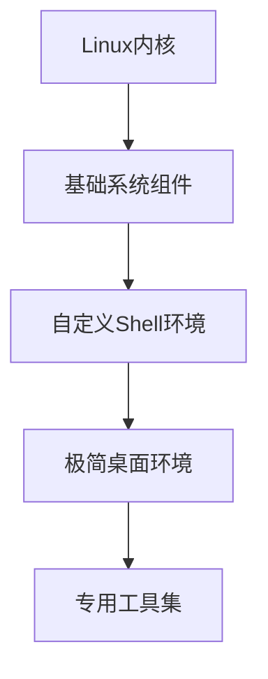
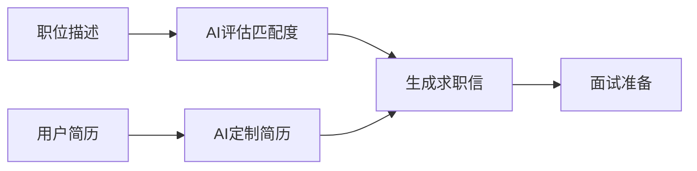
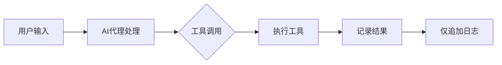
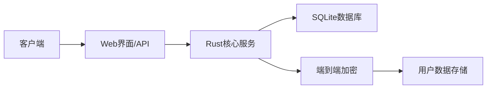
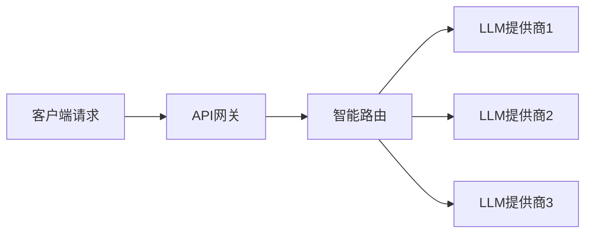

## 今日热点

今日GitHub热榜项目精彩纷呈。

---

## 热门项目一览

| 排名 | 项目 | 语言 | 今日 | 总计 | 简介 |
|:---:|------|:----:|------:|-----:|------|
| 1 | [freestylefly/awesome-gpt-image-2](https://github.com/freestylefly/awesome-gpt-image-2) | JavaScript | +2,449 | 15,504 | Prompt as Code | GPT-Image2... |
| 2 | [openai/codex](https://github.com/openai/codex) | Rust | +1,994 | 117,039 | Lightweight coding agent th... |
| 3 | [AprilNEA/OpenLogi](https://github.com/AprilNEA/OpenLogi) | Rust | +1,097 | 15,857 | ⚡️A native, local-first alt... |
| 4 | [basecamp/omarchy](https://github.com/basecamp/omarchy) | Shell | +1,056 | 30,118 | Beautiful, Modern & Opinion... |
| 5 | [NousResearch/hermes-agent](https://github.com/NousResearch/hermes-agent) | Python | +896 | 235,795 | The agent that grows with you |
| 6 | [Alishahryar1/free-claude-code](https://github.com/Alishahryar1/free-claude-code) | Python | +891 | 48,968 | Use Claude Code, Codex, Pi,... |
| 7 | [VoltAgent/awesome-agent-skills](https://github.com/VoltAgent/awesome-agent-skills) | Unknown | +602 | 31,870 | A curated collection of 100... |
| 8 | [multica-ai/andrej-karpathy-skills](https://github.com/multica-ai/andrej-karpathy-skills) | Unknown | +588 | 206,505 | A single CLAUDE.md file to ... |
| 9 | [tinyhumansai/openhuman](https://github.com/tinyhumansai/openhuman) | Rust | +515 | 37,262 | Your Personal AI super inte... |
| 10 | [anthropics/claude-plugins-community](https://github.com/anthropics/claude-plugins-community) | Python | +489 | 1,350 | Community plugin marketplac... |
| 11 | [MadsLorentzen/ai-job-search](https://github.com/MadsLorentzen/ai-job-search) | Python | +434 | 34,064 | The job search that runs on... |
| 12 | [apache/maka](https://github.com/apache/maka) | TypeScript | +411 | 2,903 | Apache Maka (Incubating) is... |

---

## 趋势洞察

```
┌─────────────────────────────────────────────────────────────────┐
│  AI/ML 工具         ████████████████████████  15 个项目        │
│  多媒体应用            █                         1 个项目        │
│  智能家居             █                         1 个项目        │
│  项目管理             █                         1 个项目        │
│  其他               █                         1 个项目        │
└─────────────────────────────────────────────────────────────────┘
```

---

## 项目深度解读

### 1. freestylefly/awesome-gpt-image-2 — AI提示词工程库

> **一句话总结**：工业级GPT图像提示词工程库，包含530+案例逆向工程与20+套模板。

#### 价值主张

| 维度 | 说明 |
|------|------|
| **解决痛点** | AI图像生成提示词难以工程化、标准化 |
| **目标用户** | AI开发者、设计师、提示词工程师 |
| **核心亮点** | 工业级模板库 + 案例逆向工程 + 技能提炼 + 持续更新 |

#### 技术架构


**技术特色**：
- 基于逆向工程的提示词构建方法
- 工业级模板标准化与复用
- 技能提炼与组合优化系统

#### 热度分析

- 项目Star数15,504且单日增长2,449，显示AI提示词工程领域热度激增
- 零Open Issues表明项目维护良好，社区协作效率高

#### 快速上手

```bash
# 克隆仓库
git clone https://github.com/freestylefly/awesome-gpt-image-2.git

# 查看模板库
cd awesome-gpt-image-2 && cat README.md
```

#### 注意事项

- 项目License未知，使用前需确认授权条款
- 提示词效果可能因AI模型版本不同而有所差异
- 需要具备一定的提示词工程基础知识才能充分利用项目价值


### 2. openai/codex — 终端编码助手

> **一句话总结**：基于 Rust 开发的轻量级终端代码生成工具，智能理解并生成代码片段。

#### 价值主张

| 维度 | 说明 |
|------|------|
| **解决痛点** | 提高开发者编写代码效率，减少重复性编码工作 |
| **目标用户** | 命令行爱好者、Rust开发者、终端工具使用者 |
| **核心亮点** | 轻量级设计 + 智能代码生成 + 终端集成 + Rust实现 |

#### 技术架构


**技术特色**：
- 基于 Rust 实现，提供高性能和内存安全
- 轻量级设计，适合在终端环境中运行
- 智能代码生成，理解上下文需求

#### 热度分析

- 高关注度项目，近期增长迅速，日均增长近2000星
- 社区活跃度高，fork数量可观，表明开发者认可度高

#### 快速上手

```bash
# 安装 codex
cargo install codex

# 使用 codex 生成代码
codex "创建一个快速排序函数"
```

#### 注意事项

- 项目许可证未知，商业使用前需确认授权条款
- OpenAI Codex 是 OpenAI 的产品，此项目可能存在命名混淆


### 3. AprilNEA/OpenLogi — 本地罗技配置工具

> **一句话总结**：本地化罗技设备配置工具，无需账户，支持按钮重映射和DPI调整，完全保护隐私。

#### 价值主张

| 维度 | 说明 |
|------|------|
| **解决痛点** | 替代官方Logitech Options+，无需账户登录，保护用户隐私 |
| **目标用户** | 注重隐私、追求本地化控制的罗技设备用户 |
| **核心亮点** | 本地化运行 + 无需账户 + HID++协议支持 + 按钮重映射 + DPI调整 |

#### 技术架构


**技术特色**：
- 使用Rust编写，确保内存安全和性能
- 通过HID++协议直接与设备通信，无需官方软件
- 完全本地化运行，不依赖云端服务
- 零遥测设计，保护用户隐私

#### 热度分析

- 项目获得15,857个Star，单日增长1,097，表明用户对隐私保护本地工具需求强烈
- 仅有429个Fork，说明项目主要作为独立工具使用，而非二次开发基础

#### 快速上手

```bash
# 安装OpenLogi
cargo install openlogi

# 扫描可用设备
openlogi scan

# 配置设备按钮
openlogi configure --device <device_id> --button <button_number> --action <action>
```

#### 注意事项

- 项目目前可能只支持特定型号的罗技设备
- 需要确保设备支持HID++协议
- 可能需要管理员/root权限才能与设备通信
- 项目处于积极开发中，API可能会有变化


### 4. basecamp/omarchy — 极简主义Linux

> **一句话总结**：一款追求极简美学与专注体验的现代化Linux操作系统。

#### 价值主张

| 维度 | 说明 |
|------|------|
| **解决痛点** | 提供无干扰、美观高效的Linux环境，解决现代操作系统过度复杂问题 |
| **目标用户** | 追求简约高效工作环境的开发者、设计师和极简主义者 |
| **核心亮点** | 极简设计哲学 + 高度定制化体验 + 专注工作流 + 美观界面 |

#### 技术架构



**技术特色**：
- 基于轻量级Linux内核构建，确保系统资源占用低
- 自定义Shell环境，优化命令行工作流
- 精简的桌面环境组件，去除冗余功能

#### 热度分析

- 项目获得超3万星，近期增长迅速，显示开发者社区对极简主义操作系统的强烈兴趣
- 零开放问题表明项目维护状态良好，但可能也意味着社区参与方式较为封闭

#### 快速上手

```bash
# 克隆项目仓库
git clone https://github.com/basecamp/omarchy.git

# 查看安装指南
cat omarchy/INSTALL.md
```

#### 注意事项

- 这是一个高度定制化的Linux发行版，可能与主流软件兼容性有限
- 项目采用"观点鲜明"的设计理念，可能会限制用户的自由选择权
- 许可证信息不明确，使用前需确认开源许可类型
- 零开放问题可能意味着问题通过其他渠道处理，社区参与方式与传统开源项目不同


### 5. NousResearch/hermes-agent — [成长型智能代理]

> **一句话总结**：一个能够持续学习和成长的智能代理系统，提供动态适应的个性化服务。

#### 价值主张

| 维度 | 说明 |
|------|------|
| **解决痛点** | 解决传统AI代理缺乏持续学习和适应能力的问题 |
| **目标用户** | 需要长期协作AI助手的研究人员与开发者 |
| **核心亮点** | 自主学习能力 + 持续成长机制 + 个性化定制 + 多场景适应 |

#### 技术架构


**技术特色**：
- 基于反馈的持续学习算法
- 多模态交互与理解能力
- 模块化架构支持灵活扩展

#### 热度分析

- 项目获得23万+星，日增近千星，显示社区高度认可与持续关注
- 在开源智能代理领域处于领先地位，拥有庞大且活跃的贡献者社区

#### 快速上手

```bash
# 克隆仓库
git clone https://github.com/NousResearch/hermes-agent.git
# 安装依赖
pip install -r requirements.txt
# 启动代理
python hermes_agent/run.py --config basic_config.yaml
```

#### 注意事项

- 项目依赖可能较新，建议使用虚拟环境安装
- 自适应学习功能需要足够的交互数据才能充分发挥优势
- 生产环境使用前应进行充分的安全评估与性能测试


### 6. Alishahryar1/free-claude-code — 免费 AI 编码

> **一句话总结**：提供免费访问 Claude Code 等多种 AI 编码工具的终端接口，支持多平台使用与语音交互。

#### 价值主张

| 维度 | 说明 |
|------|------|
| **解决痛点** | 绕过官方付费限制，为开发者提供免费的 AI 编码辅助工具 |
| **目标用户** | 需要使用 AI 编码辅助但不愿付费的开发者与学生 |
| **核心亮点** | 多平台支持 + 语音交互 + 13亿+免费令牌 + 多AI模型集成 + 终端直接访问 |

#### 技术架构


**技术特色**：
- 通过 API 重定向实现付费服务的免费访问
- 支持多种编程模型统一接口调用
- 语音识别与自然语言处理集成

#### 热度分析

- 近 5 万星数，日增近千星，显示开发者对免费 AI 编码工具的强烈需求
- 高活跃社区生态，在开源 AI 工具领域占据重要位置

#### 快速上手

```bash
# 安装项目
pip install free-claude-code

# 使用示例
claude-code "解释这段 Python 代码的作用"
```

#### 注意事项

- 项目可能违反某些 AI 服务的服务条款，使用需谨慎
- 免费访问方式可能不稳定，官方随时可能更改策略
- 建议了解相关法律和道德问题后再决定是否使用


### 7. VoltAgent/awesome-agent-skills — AI代理技能库

> **一句话总结**：精选1000+AI代理技能集合，支持多平台开发工具，提升AI辅助编程能力。

#### 价值主张

| 维度 | 说明 |
|------|------|
| **解决痛点** | 解决AI开发工具功能有限，需扩展技能提升效率的问题 |
| **目标用户** | 使用AI辅助编程的开发者、研究人员和企业团队 |
| **核心亮点** | 1000+精选技能 + 多平台兼容性 + 社区贡献机制 + 官方认可 |

#### 技术架构


**技术特色**：
- 模块化技能设计，便于集成到各种AI开发环境
- 统一的技能接口规范，确保跨平台兼容性
- 版本管理与更新机制，保证技能库活跃度

#### 热度分析

- 项目获得31,870个Star，单日增长602，表明AI代理技能领域需求旺盛
- 作为资源聚合项目，处于AI开发工具生态的关键连接点，社区参与度高

#### 快速上手

```bash
# 克隆项目到本地
git clone https://github.com/VoltAgent/awesome-agent-skills.git

# 查看支持的AI工具文档
cat README.md | grep -A 5 "Compatible Tools"
```

#### 注意事项

- 不同AI工具的技能集成方式可能不同，需查阅具体文档
- 技能质量和更新频率可能参差不齐，需自行评估和筛选
- 部分技能可能需要额外配置或API密钥才能正常使用


### 8. multica-ai/andrej-karpathy-skills — AI编程指导

> **一句话总结**：基于Karpathy对LLM编码陷阱的观察，提供Claude代码优化的精简指导文件。

#### 价值主张

| 维度 | 说明 |
|------|------|
| **解决痛点** | 解决LLM生成代码中的常见陷阱和质量问题 |
| **目标用户** | 使用Claude Code进行开发的AI辅助编程者 |
| **核心亮点** | + 权威经验基础 + 单文件简洁实现 + 实用编码指南 |

#### 技术架构

**技术特色**：
- 基于Karpathy权威LLM编程经验
- 提供简洁实用的代码优化指南
- 针对Claude Code特定优化

#### 热度分析

- 项目Star数超20万，日增588+，显示AI编程辅助工具需求旺盛
- 高Fork/Star比例表明社区积极参与和改进热情高

#### 快速上手

```bash
# 克隆项目查看CLAUDE.md文件
git clone https://github.com/multica-ai/andrej-karpathy-skills.git
cat CLAUDE.md
```

#### 注意事项

- 项目仅包含指导文件，不包含可执行代码
- 需要结合Claude Code使用才能发挥价值
- 定期更新以适应模型迭代和新发现的问题


### 9. tinyhumansai/openhuman — 个人AI智能体

> **一句话总结**：构建本地优先的个人记忆系统，作为AI代理编排和深度研究的基础平台。

#### 价值主张

| 维度 | 说明 |
|------|------|
| **解决痛点** | 分散信息整合与AI代理协同的挑战 |
| **目标用户** | 需要高级AI辅助的知识工作者和研究人员 |
| **核心亮点** | 本地优先记忆系统 + AI代理舰队编排 + 深度研究功能 + 隐私保护 |

#### 技术架构


**技术特色**：
- Rust语言实现，保证高性能和内存安全
- 本地优先架构，保护用户隐私
- 模块化AI代理系统设计

#### 热度分析

- 项目获得37,262 stars且持续快速增长(+515 today)，显示在AI个人助手领域影响力显著
- Fork数3,698，社区活跃度高，有望成为AI个人知识管理的重要基础设施

#### 快速上手

```bash
# 克隆仓库
git clone https://github.com/tinyhumansai/openhuman.git
# 进入项目目录
cd openhuman
# 构建项目
cargo build --release
```

#### 注意事项

- 项目使用Rust开发，需要安装Rust工具链
- 本地优先架构可能需要较大的存储空间
- 项目可能需要一定的AI基础知识才能充分利用
- 许可证信息未知，使用前需确认授权方式


### 10. anthropics/claude-plugins-community — Claude插件市场

> **一句话总结**：社区驱动的Claude插件市场，为Claude Cowork和Code提供功能扩展平台。

#### 价值主张

| 维度 | 说明 |
|------|------|
| **解决痛点** | 为Claude提供丰富的第三方插件扩展，弥补原生功能不足 |
| **目标用户** | Claude用户、开发者及需要扩展Claude功能的AI应用使用者 |
| **核心亮点** | 社区驱动 + 插件目录 + 只读镜像 + 官方提交入口 + 功能增强 |

#### 技术架构


**技术特色**：
- 基于Python构建的插件管理系统
- 只读镜像确保内容安全性和一致性
- 官方审核机制保证插件质量

#### 热度分析

- 项目近期热度激增，单日增长489 stars，显示社区对Claude插件生态的强烈需求
- 作为Anthropic官方维护的插件市场，在Claude生态系统中占据核心位置

#### 快速上手

```bash
# 访问插件市场
git clone https://github.com/anthropics/claude-plugins-community.git

# 提交新插件
访问 https://clau.de/plugin-directory-submission
```

#### 注意事项

- 本仓库为只读镜像，实际插件提交需通过官方渠道
- 许可证信息未明确，使用前需确认插件授权条款
- 插件集成需遵循Claude官方API规范


### 11. MadsLorentzen/ai-job-search — AI求职助手

> **一句话总结**：本地运行的AI求职框架，自动评估职位、定制简历、撰写求职信并准备面试。

#### 价值主张

| 维度 | 说明 |
|------|------|
| **解决痛点** | 传统求职流程耗时低效，AI自动化定制申请材料，提升求职效率与成功率 |
| **目标用户** | 求职者、职业转换者、需批量申请职位的用户 |
| **核心亮点** | 职位匹配度评估 + 简历智能定制 + 求职信自动生成 + 面试问题准备 |

#### 技术架构



**技术特色**：
- 基于Claude Code的AI框架实现
- 本地运行确保求职数据隐私安全
- Python实现易于扩展和二次开发

#### 热度分析

- 项目获星3.4万+且单日新增434，表明AI求职工具市场需求旺盛
- Fork数高达1.1万+，用户积极参与定制扩展，社区活跃度高

#### 快速上手

```bash
# 安装依赖
pip install -r requirements.txt

# 配置API密钥
export ANTHROPIC_API_KEY="your_api_key_here"

# 运行职位评估
python ai_job_search.py --evaluate --job-description job_description.txt
```

#### 注意事项

- 需要配置Anthropic API密钥才能使用Claude功能
- AI生成内容需人工审核调整，不能完全依赖自动化工具
- 确保遵守目标公司的简历提交要求，避免过度自动化带来的合规问题


### 12. apache/maka — 本地AI工作空间

> **一句话总结**：Apache Maka是本地优先的AI代理工作空间，通过仅追加日志记录完整AI交互过程，确保数据完整性与本地控制。

#### 价值主张

| 维度 | 说明 |
|------|------|
| **解决痛点** | 解决AI交互数据分散、隐私安全与可追溯性问题 |
| **目标用户** | 注重数据隐私的AI开发者和企业用户 |
| **核心亮点** | 本地优先架构 + 仅追加日志记录 + 完整交互追踪 + 权限控制 |

#### 技术架构



**技术特色**：
- 本地优先架构确保数据隐私与控制权
- 仅追加日志保证数据完整性和不可篡改性
- 全链路交互追踪提供完整上下文

#### 热度分析

- 项目Star数达2903且单日增长411，显示出快速增长态势，表明社区对该技术方向高度关注
- 作为Apache孵化项目，正处于早期阶段，具有较高发展潜力和社区参与度

#### 快速上手

```bash
# 克隆仓库
git clone https://github.com/apache/maka.git

# 安装依赖
npm install

# 启动工作空间
npm start
```

#### 注意事项

- 项目目前处于Apache孵化阶段，API和功能可能不稳定
- 需要关注数据存储位置和日志管理策略，确保本地存储空间充足
- 作为本地优先系统，可能需要额外的网络同步机制以实现多设备协作


### 13. rohitg00/ai-engineering-from-scratch — AI工程实践指南

> **一句话总结**：系统化AI工程学习路径，从理论到实践再到部署的完整指南。

#### 价值主张

| 维度 | 说明 |
|------|------|
| **解决痛点** | 提供零散AI知识的系统化整合，解决学习路径不清晰问题 |
| **目标用户** | AI初学者、转型AI的工程师、计算机科学学生 |
| **核心亮点** | 系统性学习路径 + 实践项目导向 + 完整工程化流程 |

#### 技术架构


**技术特色**：
- 基于Python的AI工具链教学
- 端到端的项目实践指导
- 工程化思维培养与部署实践

#### 热度分析

- 项目获得近5万Star，日均新增数百，表明在AI学习领域高度受关注
- 高Fork数显示被广泛用作个人学习的起点和参考模板

#### 快速上手

```bash
# 克隆项目到本地
git clone https://github.com/rohitg00/ai-engineering-from-scratch.git

# 进入项目目录
cd ai-engineering-from-scratch
```

#### 注意事项

- 项目需要一定的Python和机器学习基础
- 由于内容持续更新，建议关注项目最新版本
- 实践项目可能需要额外的硬件资源（如GPU）支持


### 14. AgriciDaniel/claude-obsidian — AI知识图谱构建

> **一句话总结**：结合Claude AI与Obsidian，自动构建并组织个人知识图谱，将各类信息链接为Markdown格式的互联知识网络。

#### 价值主张

| 维度 | 说明 |
|------|------|
| **解决痛点** | 解决个人知识碎片化、难以关联整合的问题，实现AI辅助的智能知识管理 |
| **目标用户** | 需要高效知识管理的学者、研究人员、创意工作者和终身学习者 |
| **核心亮点** | AI自动阅读和链接内容 + 基于Markdown的知识所有权 + 与Obsidian无缝集成 + 开源Notion替代方案 |

#### 技术架构


**技术特色**：
- 利用Claude AI进行智能内容理解与链接
- 将各种来源信息自动转换为Markdown格式
- 构建可定制的个人知识图谱结构
- 与Obsidian笔记系统深度集成
- 基于Karpathy的LLM Wiki模式实现知识自组织

#### 热度分析

- 项目获得近12k星且持续快速增长，显示AI辅助知识管理工具需求旺盛
- 作为开源Notion替代方案，在个人知识管理领域占据重要生态位置

#### 快速上手

```bash
# 安装依赖
pip install -r requirements.txt

# 配置Claude API密钥
export CLAUDE_API_KEY="your_api_key_here"

# 运行服务
python claude-obsidian.py
```

#### 注意事项

- 需要Claude API访问权限，可能有使用限制
- 知识质量依赖于Claude AI的理解能力
- 需要一定的Obsidian使用基础
- 项目许可证信息不明确，使用前需确认授权条款


### 15. makeplane/plane — 开源项目管理

> **一句话总结**：Plane 是现代化的开源项目管理平台，提供任务管理、冲刺规划和文档协作功能，作为商业工具的免费替代方案。

#### 价值主张

| 维度 | 说明 |
|------|------|
| **解决痛点** | 提供企业级项目管理功能，避免商业软件的高昂成本和供应商锁定 |
| **目标用户** | 软件开发团队、敏捷实践者和需要协作的项目管理团队 |
| **核心亮点** | 开源替代 + 任务管理 + 冲刺规划 + 文档协作 + 问题分类 |

#### 技术架构

**技术特色**：
- 基于 TypeScript 开发，提供类型安全和代码质量保障
- 采用现代化前端框架构建，确保良好的用户体验
- 开源架构允许自定义部署和功能扩展

#### 热度分析

- Star 数快速增长，单日增长 243，显示出项目的高关注度和社区活跃度
- 作为商业项目管理工具的开源替代品，正在形成活跃的开发者社区和生态系统

#### 快速上手

```bash
# 克隆项目
git clone https://github.com/makeplane/plane.git
# 安装依赖
npm install
# 启动开发服务器
npm run dev
```

#### 注意事项

- 项目需要一定的技术知识来部署和维护，适合有一定技术能力的团队
- 作为较新的开源项目，功能可能仍在快速迭代中，API 和功能可能会有变化
- 需要关注项目的许可证信息，确保符合企业的使用要求


### 16. dani-garcia/vaultwarden — 密码管理服务器

> **一句话总结**：用 Rust 实现的兼容 Bitwarden 的非官方密码管理服务器，提供安全可靠的个人密码存储解决方案。

#### 价值主张

| 维度 | 说明 |
|------|------|
| **解决痛点** | 解决密码管理服务自托管需求，提供无需付费的密码管理方案 |
| **目标用户** | 注重隐私和安全的技术用户，自托管服务爱好者 |
| **核心亮点** | 兼容Bitwarden + Rust高性能 + 自托管部署 + 零依赖 + 端到端加密 |

#### 技术架构



**技术特色**：
- 使用 Rust 语言编写，内存安全且性能优异
- 兼容 Bitwarden 官方客户端，无需修改客户端即可使用
- 轻量级设计，资源占用少，适合在资源受限的环境中运行

#### 热度分析

- 项目获得超过6.6万星，近175星/日增长，表明社区认可度高且持续增长
- 作为 Bitwarden 的替代方案，满足了用户对自托管密码管理的需求，在开源密码管理工具生态中占据重要位置

#### 快速上手

```bash
# 安装并运行 vaultwarden
docker run -d --name vaultwarden -e SIGNUPS_ALLOWED=true -v ~/.vaultwarden:/data vaultwarden/server:latest

# 访问 Web 界面
http://localhost:8000
```

#### 注意事项

- 默认情况下，新用户注册功能是关闭的，需要通过环境变量 SIGNUPS_ALLOWED=true 启用
- 官方 Bitwarden 客户端可以无缝使用，但某些高级功能可能需要订阅官方服务


### 17. tashfeenahmed/freellmapi — 免费LLM聚合API

> **一句话总结**：整合34家免费LLM提供商的635个模型端点，通过单一OpenAI兼容接口提供智能路由和自动故障转移。

#### 价值主张

| 维度 | 说明 |
|------|------|
| **解决痛点** | 解决开发者对接多个免费LLM API的繁琐工作，统一管理不同模型访问 |
| **目标用户** | 个人开发者和AI应用研究者，需要低成本实验多种LLM模型 |
| **核心亮点** | 统一接口 + 智能路由 + 自动故障转移 + 加密密钥 + 高额月度配额 |

#### 技术架构



**技术特色**：
- 聚合635个免费模型端点，提供7.4亿token月配额
- 实现OpenAI兼容接口，简化集成流程
- 智能路由和自动故障转移机制确保服务可用性

#### 热度分析

- 项目获得近2万stars，日均增长174个，显示极高的社区关注度
- Fork数量近3000，表明开发者积极参与二次开发和定制

#### 快速上手

```bash
# 克隆项目
git clone https://github.com/tashfeenahmed/freellmapi.git
# 安装依赖
npm install
# 配置环境变量
cp .env.example .env
# 启动服务
npm start
```

#### 注意事项

- 项目声明仅用于个人实验，不建议用于商业用途
- 免费API提供商可能有使用限制或随时变更的可能
- 需要自行管理API密钥的安全，避免泄露给第三方


### 18. openclaw/openclaw — 跨平台AI助手

> **一句话总结**：开源跨平台AI助手，提供统一智能体验，支持多操作系统个性化交互。

#### 价值主张

| 维度 | 说明 |
|------|------|
| **解决痛点** | 打破平台限制，提供一致的个人AI助手体验，解决设备间服务割裂问题 |
| **目标用户** | 追求隐私保护、需要跨设备一致体验的开发者与技术爱好者 |
| **核心亮点** + 跨平台兼容性 + 开源可定制 + 模块化架构 + 隐私优先设计

#### 技术架构


**技术特色**：
- 基于TypeScript构建，确保类型安全与跨平台兼容性
- 模块化架构设计，便于功能扩展与第三方集成
- 采用隐私优先设计，本地处理用户数据减少隐私泄露风险

#### 热度分析

- 项目获38万+星，日增173星，显示AI助手领域需求旺盛，社区活跃度高
- 8万+Fork表明项目有大量二次开发需求，形成活跃开发者生态

#### 快速上手

```bash
# 克隆项目
git clone https://github.com/openclaw/openclaw.git
# 安装依赖
npm install
# 启动服务
npm run start
```

#### 注意事项

- 项目许可证信息未知，使用前需确认开源协议条款
- 需要Node.js环境和TypeScript支持才能运行项目
- 作为AI助手项目，可能需要配置API密钥或特定服务才能启用完整功能


### 19. PostHog/posthog — 产品分析平台

> **一句话总结**：集成AI可观测性与分析工具的开源产品分析平台，提供全链路产品洞察。

#### 价值主张

| 维度 | 说明 |
|------|------|
| **解决痛点** | 解决产品开发中缺乏完整上下文和可观测性的问题 |
| **目标用户** | 产品开发团队、数据分析师、DevOps工程师 |
| **核心亮点** | 全面的产品可观测性 + AI驱动的分析 + 多渠道控制能力 |

#### 技术架构


**技术特色**：
- 统一的产品数据收集与分析框架
- AI驱动的智能问题诊断
- 跨平台集成能力

#### 热度分析

- 项目拥有近39,000颗星，近期增长稳定，表明其在产品分析领域有较强吸引力
- 作为开源产品分析平台，PostHog在开发者社区中占据重要位置，与Mixpanel等商业产品形成竞争

#### 快速上手

```bash
# 安装PostHog Python客户端
pip install posthog

# 初始化PostHog客户端
from posthog import Posthog
posthog = Posthog('YOUR_API_KEY')

# 捕获用户事件
posthog.capture('user_id', 'event_name', properties={'property1': 'value'})
```

#### 注意事项

- 需要配置API密钥才能使用PostHog服务
- 项目可能涉及数据隐私合规问题，使用时需考虑相关法规要求
- 作为复杂平台，完整功能可能需要较长时间学习和配置


## 今日推荐

| 主题 | 推荐项目 | 亮点 |
|------|----------|------|
| 今日最热 | [freestylefly/awesome-gpt-image-2](https://github.com/freestylefly/awesome-gpt-image-2) | Prompt as Code | ... |
| 值得关注 | [openai/codex](https://github.com/openai/codex) | Lightweight codin... |
| 快速上手 | [AprilNEA/OpenLogi](https://github.com/AprilNEA/OpenLogi) | ⚡️A native, local... |
| 长期潜力 | [basecamp/omarchy](https://github.com/basecamp/omarchy) | Beautiful, Modern... |

---

<div align="center">

*Generated on 2026-08-25 | Powered by GitHub Trending Reporter*

</div>