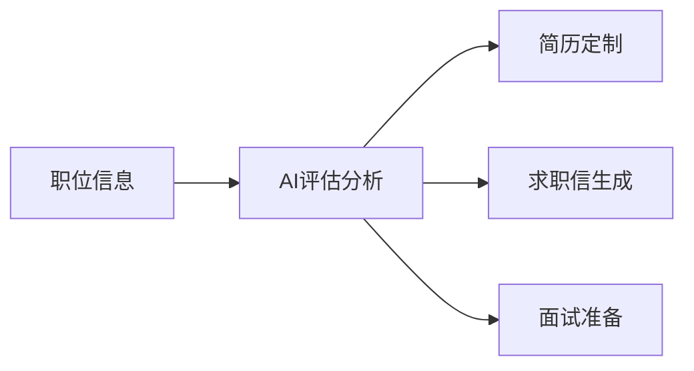
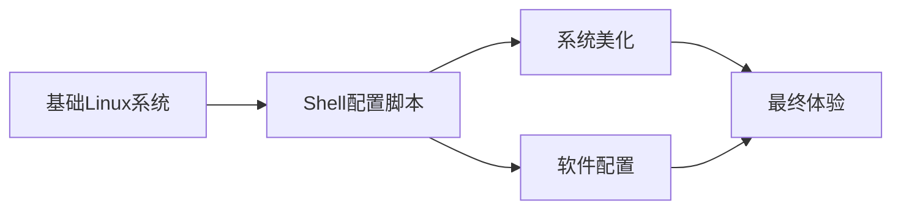

## 今日热点

AI代理生态与本地化应用引领今日热榜，Claude插件系统蓬勃发展，垂直领域AI解决方案持续涌现，提示词工程走向工业化。

---

## 热门项目一览

| 排名 | 项目 | 语言 | 今日 | 总计 | 简介 |
|:---:|------|:----:|------:|-----:|------|
| 1 | [freestylefly/awesome-gpt-image-2](https://github.com/freestylefly/awesome-gpt-image-2) | JavaScript | +1,698 | 17,736 | Prompt as Code | GPT-Image2... |
| 2 | [MadsLorentzen/ai-job-search](https://github.com/MadsLorentzen/ai-job-search) | Python | +1,265 | 35,264 | The job search that runs on... |
| 3 | [openai/codex](https://github.com/openai/codex) | Rust | +1,181 | 118,103 | Lightweight coding agent th... |
| 4 | [basecamp/omarchy](https://github.com/basecamp/omarchy) | Shell | +1,083 | 31,259 | Beautiful, Modern & Opinion... |
| 5 | [DietrichGebert/ponytail](https://github.com/DietrichGebert/ponytail) | JavaScript | +982 | 111,010 | Makes your AI agent think l... |
| 6 | [multica-ai/andrej-karpathy-skills](https://github.com/multica-ai/andrej-karpathy-skills) | Unknown | +830 | 207,202 | A single CLAUDE.md file to ... |
| 7 | [AgriciDaniel/claude-obsidian](https://github.com/AgriciDaniel/claude-obsidian) | Python | +813 | 12,711 | Self-organizing AI second b... |
| 8 | [rohitg00/ai-engineering-from-scratch](https://github.com/rohitg00/ai-engineering-from-scratch) | Python | +569 | 48,965 | Learn it. Build it. Ship it... |
| 9 | [apache/maka](https://github.com/apache/maka) | TypeScript | +543 | 3,328 | Apache Maka (Incubating) is... |
| 10 | [tinyhumansai/openhuman](https://github.com/tinyhumansai/openhuman) | Rust | +542 | 37,770 | Your Personal AI super inte... |
| 11 | [anthropics/claude-plugins-community](https://github.com/anthropics/claude-plugins-community) | Python | +351 | 1,746 | Community plugin marketplac... |
| 12 | [marin-community/marin](https://github.com/marin-community/marin) | Python | +231 | 2,101 | Open-source framework for t... |

---

## 趋势洞察

```
┌─────────────────────────────────────────────────────────────────┐
│  AI/ML 工具         ████████████████████████  13 个项目        │
│  开发框架             █                         1 个项目        │
│  多媒体应用            █                         1 个项目        │
│  其他               █                         1 个项目        │
└─────────────────────────────────────────────────────────────────┘
```

---

## 项目深度解读

### 1. freestylefly/awesome-gpt-image-2 — AI提示词库

> **一句话总结**：工业级GPT图像提示词库，提供530+案例与20+模板，助力AI图像创作。

#### 价值主张

| 维度 | 说明 |
|------|------|
| **解决痛点** | AI图像生成提示词不系统、不专业的问题 |
| **目标用户** | AI图像创作者、提示词工程师、设计师 |
| **核心亮点** | 530+逆向工程案例 + 20+工业级模板 + Skills提炼 |

#### 技术架构


**技术特色**：
- JavaScript驱动的提示词处理引擎
- 大规模案例库与分类模板系统
- 提示词技能提炼与优化机制

#### 热度分析

- 项目Star数达17,736且单日增长近1,700，热度飙升
- Fork数1,835显示社区参与度高，已被广泛应用于AI创作场景

#### 快速上手

```bash
# 克隆项目
git clone https://github.com/freestylefly/awesome-gpt-image-2.git

# 查看示例
cd awesome-gpt-image-2 && npm start
```

#### 注意事项

- 项目许可证信息不明确，使用前需确认版权条款
- 提示词效果可能随AI模型更新而变化，需持续关注项目更新
- 建议配合OpenAI API或其他图像生成模型使用以获得完整体验


### 2. MadsLorentzen/ai-job-search — AI求职助手

> **一句话总结**：基于Claude Code的AI求职框架，可自动评估职位、定制简历、撰写求职信并准备面试。

#### 价值主张

| 维度 | 说明 |
|------|------|
| **解决痛点** | 简化求职流程，自动化简历定制和申请材料准备 |
| **目标用户** | 寻找技术职位的求职者，特别是软件开发人员 |
| **核心亮点** | + AI职位评估 + 简历个性化 + 求职信自动生成 + 面试准备 |

#### 技术架构



**技术特色**：
- 基于Claude Code的AI框架实现智能化处理
- 自动化简历定制和个性化内容生成
- 全面的求职流程自动化解决方案

#### 热度分析

- Star数达35,264，今日增长1,265，表明项目近期热度极高
- Fork数12,135，表明用户参与度高，社区活跃度强

#### 快速上手

```bash
# 克隆项目
git clone https://github.com/MadsLorentzen/ai-job-search.git
# 进入项目目录
cd ai-job-search
# 安装依赖
pip install -r requirements.txt
```

#### 注意事项

- 项目依赖Claude Code框架，需要确保环境配置正确
- 可能需要API密钥来使用AI功能
- 应谨慎处理个人敏感信息，如简历内容等


### 3. openai/codex — 终端编程助手

> **一句话总结**：轻量级终端编程助手，提供智能代码生成与补全，提升开发者编码效率

#### 价值主张

| 维度 | 说明 |
|------|------|
| **解决痛点** | 解决终端环境下代码编写效率低、记忆负担重的问题 |
| **目标用户** | 终端重度用户、命令行开发者、系统程序员 |
| **核心亮点** | 智能代码补全 + 终端集成 + 轻量级设计 + 跨平台支持 |

#### 技术架构


**技术特色**：
- 基于Rust构建的高性能轻量级代码助手
- 深度集成终端环境，提供无缝编码体验
- 采用AI技术理解代码上下文，提供精准建议

#### 热度分析

- 项目获得11万+星标，日增1千+，表明开发者社区对该工具高度认可
- Fork数接近1.8万，显示项目有较高的二次开发和定制需求

#### 快速上手

```bash
# 安装
cargo install codex

# 使用
codex init  # 初始化项目
codex generate "创建一个快速排序函数"  # 生成代码
```

#### 注意事项

- 项目许可证未知，商业使用前需确认授权条款
- 作为AI辅助编码工具，生成的代码需要人工审查和测试
- 依赖网络连接进行AI推理，离线环境可能无法使用全部功能


### 4. basecamp/omarchy — 美学Linux发行版

> **一句话总结**：一个注重视觉美感、现代化设计且具有明确理念的Linux配置方案

#### 价值主张

| 维度 | 说明 |
|------|------|
| **解决痛点** | 提供视觉统一、体验现代且设计理念明确的Linux环境 |
| **目标用户** | 追求美观、一致性和极简体验的Linux终端用户 |
| **核心亮点** | 美观界面 + 现代化配置 + 设计理念统一 + 高度定制化 |

#### 技术架构



**技术特色**：
- 使用Shell脚本实现系统级配置与定制
- 注重终端与UI的美学统一设计
- 提供开箱即用的现代化Linux体验

#### 热度分析

- 项目获得3万+星且近期持续增长，反映Linux社区对美学化解决方案的高需求
- 零开放问题表明项目成熟度高，维护者已解决所有已知问题

#### 快速上手

```bash
git clone https://github.com/basecamp/omarchy.git
cd omarchy
chmod +x install.sh && ./install.sh
```

#### 注意事项

- 项目许可证未知，使用前需确认开源许可条款
- 作为高度定制的Linux方案，可能与某些专有软件存在兼容性问题
- "Opinionated"特性意味着采用特定设计理念，可能不符合所有用户偏好


### 5. DietrichGebert/ponytail — AI代码助手

> **一句话总结**：ponytail 是一个 JavaScript AI 代理工具，通过智能代码生成减少开发工作量，实现"最少的代码就是最好的代码"的理念。

#### 价值主张

| 维度 | 说明 |
|------|------|
| **解决痛点** | 减少重复性编码工作，提高开发效率 |
| **目标用户** | JavaScript 开发者，特别是需要处理大量重复代码的团队 |
| **核心亮点** | AI 驱动代码生成 + 智能代码建议 + 最少代码原则 |

#### 技术架构


**技术特色**：
- 基于 JavaScript 的轻量级实现
- AI 驱动的智能代码生成
- 遵循"最少的代码就是最好的代码"原则

#### 热度分析

- Star 数超过 11 万，且每日增长近千，表明项目热度极高且持续增长
- Fork 数量适中，说明项目在社区中有较高的采用率和二次开发价值

#### 快速上手

```bash
# 安装 ponytail
npm install ponytail

# 初始化项目
ponytail init

# 生成代码
ponytail generate --type component --name MyComponent
```

#### 注意事项

- 需要确保 AI 生成的代码符合项目规范和最佳实践
- 可能需要根据项目特定需求进行配置和定制
- 对于关键业务逻辑，建议人工审核 AI 生成的代码


### 6. multica-ai/andrej-karpathy-skills — [AI 编程指南]

> **一句话总结**：基于Karpathy对LLM编程陷阱的观察，优化Claude Code行为的精简指南。

#### 价值主张

| 维度 | 说明 |
|------|------|
| **解决痛点** | 改善AI编程助手的行为模式，减少代码生成中的常见陷阱 |
| **目标用户** | 使用AI编程助手的高级开发者与研究人员 |
| **核心亮点** | 权威经验总结 + 单文件实现 + 实用编程指导 |

#### 技术架构

由于项目仅包含一个CLAUDE.md文件，无需复杂架构图。

**技术特色**：
- 精简的提示工程方法
- 基于Karpathy实践经验的编程准则
- 针对Claude Code优化的行为指南

#### 热度分析

- 项目获超20万星，日增830星，反映AI编程助手优化需求强烈
- 高度关注Karpathy在LLM编程领域的权威观点和实践经验

#### 快速上手

```bash
# 克隆项目查看CLAUDE.md文件
git clone https://github.com/multica-ai/andrej-karpathy-skills.git
# 查看内容
cat CLAUDE.md
```

#### 注意事项

- 项目依赖Claude Code的特定实现，可能不适用于其他AI编程助手
- 内容基于Andrej Karpathy的个人经验，可能需要根据实际需求调整
- 项目结构非常简单，不包含复杂的实现细节


### 7. AgriciDaniel/claude-obsidian — AI知识管理

> **一句话总结**：结合Claude与Obsidian构建的自组织AI知识管理系统，实现智能内容链接与知识图谱构建。

#### 价值主张

| 维度 | 说明 |
|------|------|
| **解决痛点** | 解决知识碎片化与连接困难，构建智能知识网络 |
| **目标用户** | 知识工作者、研究人员、学生、内容创作者 |
| **核心亮点** | AI自动内容链接 + 纯Markdown存储 + 语义知识图谱 + 开源可控 + Obsidian生态集成 |

#### 技术架构


**技术特色**：
- 利用Claude AI进行内容理解和语义分析
- 基于Markdown的轻量级知识存储方案
- 自动建立知识点间的语义连接关系
- 与Obsidian双向集成，扩展笔记能力
- 开源实现，用户拥有完整数据控制权

#### 热度分析

- 项目热度持续攀升，单日新增800+ stars，表明AI知识管理领域需求旺盛
- 在开源PKM领域形成独特定位，成为Obsidian生态中的明星AI插件

#### 快速上手

```bash
# 克隆项目
git clone https://github.com/AgriciDaniel/claude-obsidian.git

# 安装依赖
pip install -r requirements.txt

# 配置Claude API密钥并运行
export CLAUDE_API_KEY=your_key_here
python main.py
```

#### 注意事项

- 需要Claude API访问权限，可能产生费用
- 知识积累需要时间，初期效果可能有限
- 需要一定的技术背景进行配置和优化
- 数据安全依赖于Claude API和本地存储的安全性


### 8. rohitg00/ai-engineering-from-scratch — AI工程学习指南

> **一句话总结**：提供完整的AI工程学习路径，从基础知识到项目部署，助力系统掌握AI开发全流程。

#### 价值主张

| 维度 | 说明 |
|------|------|
| **解决痛点** | AI工程学习缺乏系统性路径，难以找到从入门到实战的完整指南 |
| **目标用户** | AI/ML初学者、希望转行AI开发的工程师、计算机科学学生 |
| **核心亮点** | 完整学习路径 + 实践项目导向 + 覆盖全流程 + 社区驱动 + 资源丰富 |

#### 技术架构


**技术特色**：
- 提供从零开始的系统性AI工程学习路径
- 结合理论与实践，强调动手能力培养
- 包含前沿AI工具和框架的使用指南
- 注重工程化实践和部署环节
- 涵盖MLOps全流程知识

#### 热度分析

- 项目获得近5万星，表明其在AI学习领域的影响力巨大，是AI工程学习的重要参考资源。
- 社区活跃度高，持续贡献内容，成为AI工程学习的标杆项目。

#### 快速上手

```bash
# 克隆项目到本地
git clone https://github.com/rohitg00/ai-engineering-from-scratch.git

# 浏览项目结构，找到适合自己学习路径的部分
cd ai-engineering-from-scratch

# 查看README了解学习路径和资源
cat README.md
```

#### 注意事项

- 项目内容可能需要一定的编程基础，特别是Python。
- 学习过程中需要主动实践，仅阅读不足以掌握AI工程技能。
- 项目内容更新较快，建议定期查看最新版本。
- 某些资源可能需要额外的配置或环境设置。


### 9. apache/maka — 本地AI代理工作空间

> **一句话总结**：本地优先的AI代理工作空间，以追加日志形式记录模型交互与工具操作，确保数据隐私与完整性。

#### 价值主张

| 维度 | 说明 |
|------|------|
| **解决痛点** | 解决AI代理交互记录与数据隐私保护问题 |
| **目标用户** | AI应用开发者与研究机构 |
| **核心亮点** | 本地优先 + 仅追加日志 + 完整交互记录 |

#### 技术架构


**技术特色**：
- 本地优先设计确保数据隐私
- 仅追加日志保证数据完整性
- TypeScript实现提供类型安全

#### 热度分析

- 项目获得3,328 stars且单日增长543，显示快速增长趋势，表明社区对本地AI代理解决方案的高需求
- 作为Apache孵化项目，具有官方背书，未来可能在企业级AI应用生态中占据重要位置

#### 快速上手

```bash
# 克隆仓库
git clone https://github.com/apache/maka.git
# 安装依赖
npm install
# 启动服务
npm start
```

#### 注意事项

- 项目目前处于Apache孵化阶段，API可能会有变动
- 许可证信息不明确，使用前需确认开源协议
- 作为本地优先工具，可能需要一定的本地资源支持


### 10. tinyhumansai/openhuman — 个人AI记忆系统

> **一句话总结**：构建本地优先的个人AI记忆与代理编排系统，实现深度智能研究与生活记录。

#### 价值主张

| 维度 | 说明 |
|------|------|
| **解决痛点** | 个人数据分散，缺乏统一记忆与智能处理系统，难以形成知识闭环 |
| **目标用户** | 需要个人知识管理、AI助手与工作流自动化的知识工作者和开发者 |
| **核心亮点** | 本地优先隐私保护 + 多智能代理协同 + 深度研究整合能力 |

#### 技术架构


**技术特色**：
- 使用Rust实现高性能、内存安全的本地AI系统
- 本地优先的隐私保护架构设计
- 多智能代理协同工作流引擎

#### 热度分析

- 项目Star数超3.7万且日增542，增长迅猛，市场需求强烈
- Fork/Star比例适中，表明项目兼具实用性和可扩展性

#### 快速上手

```bash
# 克隆项目
git clone https://github.com/tinyhumansai/openhuman.git

# 构建项目
cd openhuman
cargo build --release
```

#### 注意事项

- 项目可能处于早期阶段，API和功能可能不稳定
- 作为本地优先系统，需要一定硬件资源支持
- 需关注项目的隐私政策和数据安全措施


### 11. anthropics/claude-plugins-community — 社区插件市场

> **一句话总结**：为Claude提供社区驱动的插件扩展生态，增强AI助手功能多样性。

#### 价值主张

| 维度 | 说明 |
|------|------|
| **解决痛点** | 解决Claude原生功能局限性，提供第三方扩展能力 |
| **目标用户** | Claude开发者、AI应用构建者、AI功能扩展者 |
| **核心亮点** | + 社区驱动 + 插件市场 + 功能扩展 + 开放生态 |

#### 技术架构


**技术特色**：
- 基于Python构建的插件注册与分发系统
- 社区驱动的插件审核与质量保证机制
- 支持Claude Cowork和Claude Code双平台适配

#### 热度分析

- 项目单日增长351 stars，显示社区高度关注与期待
- 作为Anthropic官方插件市场的社区镜像，具有战略生态价值

#### 快速上手

```bash
# 克隆项目仓库
git clone https://github.com/anthropics/claude-plugins-community.git

# 浏览可用插件
cd claude-plugins-community && ls plugins/
```

#### 注意事项

- 此为只读镜像，实际插件提交需通过clau.de/plugin-directory-submission
- 项目许可证信息不明确，使用前需确认授权条款
- 插件需符合Anthropic的开发规范和安全标准


### 12. marin-community/marin — 基础模型研究框架

> **一句话总结**：Marin是专注于基础模型研发的开源Python框架，提供高效工具支持模型训练与实验。

#### 价值主张

| 维度 | 说明 |
|------|------|
| **解决痛点** | 降低基础模型研发门槛，简化复杂模型训练与实验流程 |
| **目标用户** | AI研究人员、基础模型开发者、机器学习工程师 |
| **核心亮点** | 模块化设计 + 高效计算优化 + 易于扩展的架构 |

#### 技术架构


**技术特色**：
- 分布式训练支持，适应大规模模型训练需求
- 灵活的插件系统，便于定制化实验
- 内置多种评估指标，简化模型性能分析

#### 热度分析

- 项目近期增长迅猛，单日新增231个Star，显示社区高度关注
- 虽Fork数相对较少，但Issues为0表明项目维护良好，问题解决及时

#### 快速上手

```bash
# 安装Marin框架
pip install marin-framework

# 初始化项目
marin init my_project

# 开始训练
marin train --config config.yaml
```

#### 注意事项

- 项目许可证未知，商业使用前需确认授权条款
- 作为新兴项目，API可能存在变动，生产环境使用前建议关注版本稳定性


### 13. TauricResearch/TradingAgents — 金融交易智能框架

> **一句话总结**：基于多智能体和大语言模型的金融交易框架，实现自动化交易策略生成与执行。

#### 价值主张

| 维度 | 说明 |
|------|------|
| **解决痛点** | 金融交易中策略生成复杂、执行困难的问题，通过AI智能体简化流程 |
| **目标用户** | 量化交易者、金融分析师、算法开发者 |
| **核心亮点** | 多智能体协作 + 大语言模型驱动 + 自动化交易策略生成 + 实时市场分析 + 灵活框架设计 |

#### 技术架构


**技术特色**：
- 基于大语言模型的多智能体协作系统
- 模块化设计，支持自定义交易策略
- 集成多种金融市场数据源

#### 热度分析

- 项目获得超过10万星标，近期日增218星，表明项目热度持续上升
- 高活跃度项目，社区贡献频繁，在金融AI领域具有重要影响力

#### 快速上手

```bash
# 克隆项目
git clone https://github.com/TauricResearch/TradingAgents.git
cd TradingAgents

# 安装依赖
pip install -r requirements.txt

# 运行示例
python examples/basic_trading_agent.py
```

#### 注意事项

- 项目可能需要金融API密钥才能连接真实市场数据
- 使用框架时需注意风险管理，建议先在模拟环境测试
- 项目依赖可能较新，需要注意Python版本兼容性


### 14. Shubhamsaboo/awesome-llm-apps — LLM应用资源库

> **一句话总结**：收集100+免费开源AI代理、技能和RAG应用，为开发者提供丰富的LLM实现参考。

#### 价值主张

| 维度 | 说明 |
|------|------|
| **解决痛点** | 解决开发者难以找到高质量、可复用LLM应用实现的问题 |
| **目标用户** | AI开发者、机器学习工程师、LLM应用研究者 |
| **核心亮点** | 超百个实际案例 + 全部开源可商用 + 分类清晰便于查找 |

#### 技术架构

**技术特色**：
- 采用结构化分类方式组织各类LLM应用
- 提供每个应用的详细说明和运行链接
- 包含完整代码示例和部署指南
- 社区驱动，持续更新紧跟技术发展

#### 热度分析

- 项目Star数超13万，日增161，显示极高社区关注度和活跃度
- 作为LLM应用领域权威资源库，已成为开发者寻找实现方案的首选参考

#### 快速上手

```bash
# 克隆项目到本地
git clone https://github.com/Shubhamsaboo/awesome-llm-apps.git

# 浏览README获取分类和链接
cat awesome-llm-apps/README.md
```

#### 注意事项

- 项目本身是资源集合，需访问各子项目获取实际代码
- 部分应用可能需要额外API密钥或依赖才能运行
- 随LLM技术快速发展，部分项目可能已过时，需自行验证


### 15. asciimoo/hister — 自建搜索引擎

> **一句话总结**：一个用Go语言开发的轻量级自托管搜索引擎，提供隐私保护的数据搜索解决方案

#### 价值主张

| 维度 | 说明 |
|------|------|
| **解决痛点** | 解决数据隐私与控制权问题，提供无需第三方依赖的自建搜索能力 |
| **目标用户** | 注重隐私保护的开发者、中小型企业和自托管服务爱好者 |
| **核心亮点** | 完全自托管 + 隐私保护 + 轻量级 + 易于部署 |

#### 技术架构


**技术特色**：
- 基于Go语言开发，性能高效且资源占用低
- 使用倒排索引实现快速搜索响应
- 支持多种文档格式的索引与检索

#### 热度分析
- 项目获得2773 stars，单日增长98个，表明社区关注度持续攀升
- Fork数量相对较少，说明项目处于早期阶段，用户更多是关注而非二次开发

#### 快速上手

```bash
go get github.com/asciimoo/hister
hister -index /path/to/documents
```

#### 注意事项
- 项目许可证未知，使用前需确认法律风险
- 大规模索引时可能需要优化性能和存储策略
- 项目文档相对简洁，可能需要自行探索配置选项


### 16. anthropics/claude-plugins-official — [官方插件库]

> **一句话总结**：Anthropic官方维护的高质量Claude插件目录，扩展AI助手功能。

#### 价值主张

| 维度 | 说明 |
|------|------|
| **解决痛点** | 为Claude用户提供经过验证的高质量插件，解决功能扩展需求 |
| **目标用户** | Claude AI用户、开发者、企业用户 |
| **核心亮点** | 官方维护 + 质量保证 + 插件丰富 + 持续更新 + 安全可靠 |

#### 技术架构


**技术特色**：
- 插件质量审核机制确保可靠性
- 版本管理与更新系统保持插件活跃
- 分类与搜索系统提高插件发现效率

#### 热度分析

- 高Star数和持续增长表明用户对Claude插件生态的高度关注和需求
- 作为官方项目，在Claude插件生态中占据核心地位，引领插件开发方向

#### 快速上手

```bash
# 访问插件目录
git clone https://github.com/anthropics/claude-plugins-official.git

# 浏览可用插件
cd claude-plugins-official
ls plugins/
```

#### 注意事项

- 插件使用前需确认兼容性，不同Claude版本可能有不同支持度
- 官方项目可能对插件提交有严格要求和审核流程
- 遵守Anthropic的使用政策和插件开发指南


## 今日推荐

| 主题 | 推荐项目 | 亮点 |
|------|----------|------|
| 今日最热 | [freestylefly/awesome-gpt-image-2](https://github.com/freestylefly/awesome-gpt-image-2) | Prompt as Code | ... |
| 值得关注 | [MadsLorentzen/ai-job-search](https://github.com/MadsLorentzen/ai-job-search) | The job search th... |
| 快速上手 | [openai/codex](https://github.com/openai/codex) | Lightweight codin... |
| 长期潜力 | [basecamp/omarchy](https://github.com/basecamp/omarchy) | Beautiful, Modern... |

---

<div align="center">

*Generated on 2026-08-26 | Powered by GitHub Trending Reporter*

</div>