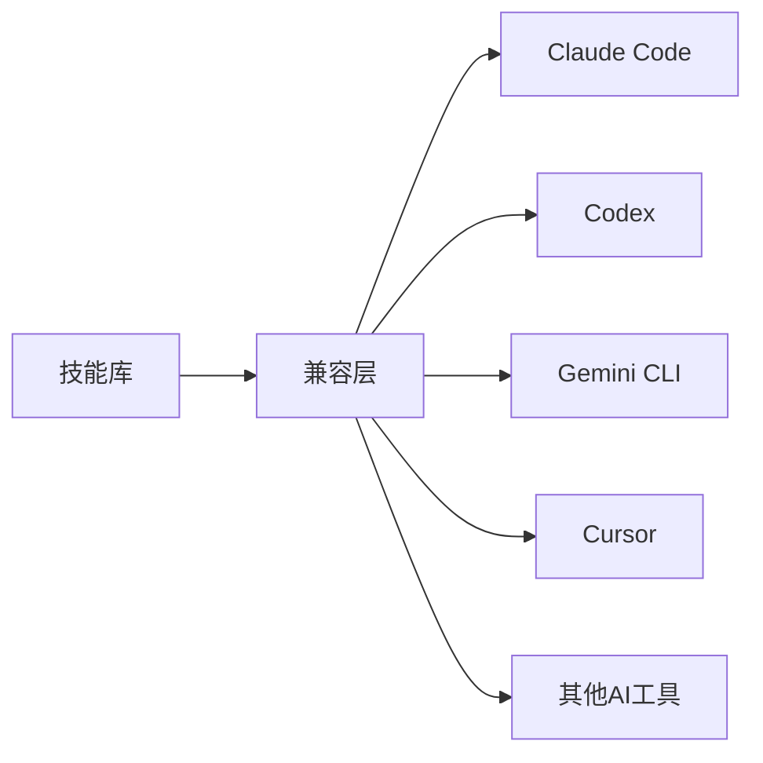

## 今日热点

Claude Code生态系统迅速扩张，AI代理技能库与专业应用场景成为焦点，开发者正积极构建本地化、专业化的AI工具链。

---

## 热门项目一览

| 排名 | 项目 | 语言 | 今日 | 总计 | 简介 |
|:---:|------|:----:|------:|-----:|------|
| 1 | [freestylefly/awesome-gpt-image-2](https://github.com/freestylefly/awesome-gpt-image-2) | JavaScript | +4,050 | 21,918 | Prompt as Code | GPT-Image2... |
| 2 | [DietrichGebert/ponytail](https://github.com/DietrichGebert/ponytail) | JavaScript | +1,598 | 112,956 | Makes your AI agent think l... |
| 3 | [MadsLorentzen/ai-job-search](https://github.com/MadsLorentzen/ai-job-search) | Python | +1,300 | 36,705 | The job search that runs on... |
| 4 | [tt-a1i/archify](https://github.com/tt-a1i/archify) | HTML | +1,035 | 19,074 | Agent skill for beautiful, ... |
| 5 | [basecamp/omarchy](https://github.com/basecamp/omarchy) | Shell | +1,024 | 32,166 | Beautiful, Modern & Opinion... |
| 6 | [rohitg00/ai-engineering-from-scratch](https://github.com/rohitg00/ai-engineering-from-scratch) | Python | +838 | 49,712 | Learn it. Build it. Ship it... |
| 7 | [AgriciDaniel/claude-obsidian](https://github.com/AgriciDaniel/claude-obsidian) | Python | +810 | 13,561 | Self-organizing AI second b... |
| 8 | [anthropics/claude-plugins-community](https://github.com/anthropics/claude-plugins-community) | Python | +538 | 2,264 | Community plugin marketplac... |
| 9 | [Alishahryar1/free-claude-code](https://github.com/Alishahryar1/free-claude-code) | Python | +536 | 50,531 | Use Claude Code, Codex, Pi,... |
| 10 | [tinyhumansai/openhuman](https://github.com/tinyhumansai/openhuman) | Rust | +525 | 38,320 | Your Personal AI super inte... |
| 11 | [marin-community/marin](https://github.com/marin-community/marin) | Python | +441 | 2,523 | Open-source framework for t... |
| 12 | [anthropics/claude-plugins-official](https://github.com/anthropics/claude-plugins-official) | Python | +308 | 34,428 | Official, Anthropic-managed... |

---

## 趋势洞察

```
┌─────────────────────────────────────────────────────────────────┐
│  AI/ML 工具         ████████████████████████  13 个项目        │
│  多媒体应用            ███                       2 个项目        │
│  开发框架             █                         1 个项目        │
└─────────────────────────────────────────────────────────────────┘
```

---

## 项目深度解读

### 1. freestylefly/awesome-gpt-image-2 — 提示词工程库

> **一句话总结**：工业级GPT-Image2提示词引擎与模板库，通过530+案例逆向工程提供结构化提示方案。

#### 价值主张

| 维度 | 说明 |
|------|------|
| **解决痛点** | AI图像生成提示词不结构化、效果不稳定的问题 |
| **目标用户** | AI艺术家、设计师、内容创作者 |
| **核心亮点** | 530+案例逆向工程 + 20+工业级模板 + 结构化Skills提炼 |

#### 技术架构


**技术特色**：
- 基于大量案例的逆向工程技术
- 结构化的提示词模板系统
- 持续更新的技能库与最佳实践

#### 热度分析

- 单日增长4000+星，显示极高的社区关注度和应用需求
- Fork数相对较少，表明项目处于早期探索阶段，用户更多在体验而非贡献

#### 快速上手

```bash
# 克隆项目
git clone https://github.com/freestylefly/awesome-gpt-image-2.git

# 查看模板库
cd awesome-gpt-image-2 && ls templates
```

#### 注意事项

- 项目许可证未知，使用时需注意版权和许可问题
- 专注于GPT-Image2模型，可能不直接适用于其他AI图像生成工具


### 2. DietrichGebert/ponytail — AI 编程增效

> **一句话总结**：通过让 AI 模拟"懒人"高级开发者的思维，实现最小化代码编写，最大化开发效率。

#### 价值主张

| 维度 | 说明 |
|------|------|
| **解决痛点** | 减少重复性代码编写，提高开发效率与质量 |
| **目标用户** | 前端/全栈开发者，AI 编程工具使用者 |
| **核心亮点** | 代码最小化策略 + AI 智能重构 + 开发效率提升 |

#### 技术架构


**技术特色**：
- 基于 AI 的代码分析能力
- 代码最小化重构算法
- 模拟资深开发者思维模式

#### 热度分析

- 项目获得超 11万星，近期增长迅速，日均增长约 1600星，表明开发者社区高度认可
- 零开放问题反映项目成熟度高，社区维护良好

#### 快速上手

```bash
# 安装 ponytail
npm install -g ponytail

# 使用 ponytail 处理代码
ponytail analyze your-code.js
```

#### 注意事项

- 项目许可未知，使用前需确认许可条款
- 依赖 AI 技术，可能存在代码安全性和隐私问题
- 作为"懒人"开发理念工具，可能不适用于所有编程场景


### 3. MadsLorentzen/ai-job-search — AI求职助手

> **一句话总结**：本地运行的AI求职框架，自动评估职位、定制简历、撰写求职信并准备面试，提升求职效率。

#### 价值主张

| 维度 | 说明 |
|------|------|
| **解决痛点** | 传统求职流程繁琐耗时，需要为每个职位单独定制申请材料 |
| **目标用户** | 需要大量申请职位的求职者，尤其是应届毕业生和转行人士 |
| **核心亮点** | 基于Claude Code的AI框架 + 本地运行保护隐私 + 全流程求职自动化 |

#### 技术架构


**技术特色**：
- 基于Claude Code大语言模型实现智能分析
- Python实现的轻量级本地部署框架
- 模块化设计支持个性化扩展和定制

#### 热度分析

- 项目获得36,705个星标且近期增长迅速(+1,300)，反映求职AI工具市场需求旺盛
- Fork数高达12,463，表明用户参与度高，社区活跃且二次开发意愿强烈

#### 快速上手

```bash
git clone https://github.com/MadsLorentzen/ai-job-search.git
cd ai-job-search
pip install -r requirements.txt
python main.py --api-key YOUR_CLAUDE_API_KEY
```

#### 注意事项

- 需要Claude API访问权限，可能涉及使用费用
- 本地运行需确保计算资源充足，建议在有一定性能的机器上部署
- AI生成内容需人工审核校对，确保专业性和准确性
- 项目许可证未知，使用前需确认商业使用限制


### 4. tt-a1i/archify — 架构可视化工具

> **一句话总结**：自包含HTML工具，用于创建美观、可验证的架构图与工作流图表。

#### 价值主张

| 维度 | 说明 |
|------|------|
| **解决痛点** | 解决复杂系统架构可视化难题，提供直观的图表展示方案 |
| **目标用户** | 软件架构师、开发团队、技术文档编写者 |
| **核心亮点** | 自包含HTML + 动态效果 + 高质量导出 + 多种图表类型 + 易于集成 |

#### 技术架构


**技术特色**：
- 单一HTML文件实现所有功能，无需额外依赖
- 使用现代Web技术实现流畅的动画效果
- 支持多种图表类型的专业渲染算法
- 提供高质量的导出功能，适合文档集成

#### 热度分析

- 项目Star数超过19k，且近期增长迅速，日均增加约1000+ stars，表明技术社区高度认可
- Fork数相对较少(1.3k)，说明项目更倾向于直接使用而非二次开发，定位为实用工具而非开发框架

#### 快速上手

```bash
# 克隆项目
git clone https://github.com/tt-a1i/archify.git

# 在浏览器中打开HTML文件
open archify.html
```

#### 注意事项

- 项目许可证未知，商业使用前需确认授权情况
- 由于是纯HTML实现，复杂图表可能在性能有限的设备上表现不佳
- 自包含特性意味着文件可能较大，需考虑加载时间


### 5. basecamp/omarchy — 现代Linux定制

> **一句话总结**：美观现代且有主见的Linux定制方案，提供统一的终端体验和开发环境。

#### 价值主张

| 维度 | 说明 |
|------|------|
| **解决痛点** | 提供统一、美观且高效的Linux开发环境，避免配置碎片化 |
| **目标用户** | 追求高效一致开发体验的开发者和终端用户 |
| **核心亮点** | 美观界面 + 高效配置 + 一致体验 + 开箱即用 |

#### 技术架构


**技术特色**：
- 基于Shell脚本实现跨平台兼容性
- 模块化配置设计，支持选择性定制
- 采用声明式配置，确保环境一致性

#### 热度分析

- 项目获得超过3.2万星，近期单日增长超过1000星，显示社区高度认可
- Fork数量适中，表明项目处于稳定维护阶段，有活跃但不过度的社区贡献

#### 快速上手

```bash
# 克隆仓库并运行安装脚本
git clone https://github.com/basecamp/omarchy.git
cd omarchy && ./install.sh
```

#### 注意事项

- 项目有较强的"观点"(opinionated)，可能不适合需要高度自定义的用户
- 依赖特定的Linux发行版，可能不完全兼容所有Linux变体


### 6. rohitg00/ai-engineering-from-scratch — AI工程实践指南

> **一句话总结**：从零开始构建、部署AI应用的完整工程化学习路径与实践指南。

#### 价值主张

| 维度 | 说明 |
|------|------|
| **解决痛点** | 提供从理论学习到工程实践的全流程AI开发指南 |
| **目标用户** | AI初学者、希望转向AI开发的软件工程师 |
| **核心亮点** | 系统性学习路径 + 实战项目导向 + 工程化部署实践 |

#### 技术架构


**技术特色**：
- 端到端AI工程化流程覆盖
- 理论与实践相结合的教学方法
- 关注生产环境部署与维护的关键环节

#### 热度分析

- 项目星标数近5万且持续快速增长，表明AI工程学习需求旺盛
- 高Fork/Star比率反映项目被广泛用于学习和二次开发

#### 快速上手

```bash
# 克隆项目
git clone https://github.com/rohitg00/ai-engineering-from-scratch.git

# 安装依赖
cd ai-engineering-from-scratch
pip install -r requirements.txt
```

#### 注意事项

- 项目许可证未知，商用前需确认授权条款
- 部分内容可能需要更新以适应最新AI技术发展


### 7. AgriciDaniel/claude-obsidian — AI 知识图谱系统

> **一句话总结**：将任意资料通过 Claude AI 处理链接，构建为用户拥有的 Markdown 知识图谱，打造开源 Notion 替代方案。

#### 价值主张

| 维度 | 说明 |
|------|------|
| **解决痛点** | 解决知识碎片化、信息过载及知识关联性差的问题 |
| **目标用户** | 知识工作者、研究人员、对个人知识管理有高要求的用户 |
| **核心亮点** | AI 自动链接整理 + 完全本地化数据所有权 + Markdown 开放格式 + Claude 深度集成 + 自组织知识图谱 |

#### 技术架构


**技术特色**：
- 利用 Claude AI 进行语义理解和内容关联分析
- 实现从非结构化数据到结构化知识的自动化处理流程
- 基于 Obsidian 生态构建，兼容其插件系统和双向链接功能
- 采用 Markdown 作为底层存储格式，确保开放性和长期可访问性

#### 热度分析

- 项目 Star 数超 13,000 且单日新增 810，显示市场对 AI 辅助知识管理工具的高度需求
- Fork 数达 1,412，表明用户不仅在使用项目还在积极参与二次开发和定制

#### 快速上手

```bash
# 克隆项目
git clone https://github.com/AgriciDaniel/claude-obsidian.git

# 安装依赖
pip install -r requirements.txt

# 配置 Claude API
export CLAUDE_API_KEY=your_api_key_here
```

#### 注意事项

- 需依赖 Claude AI 的 API，可能有使用成本和速率限制
- 数据处理和知识图谱构建需要一定时间，不适合实时性要求高的场景
- 项目许可不明确，商业使用前需确认授权条款
- 需要一定的技术背景才能完全自定义和扩展功能


### 8. anthropics/claude-plugins-community — 插件社区市场

> **一句话总结**：Claude官方社区插件市场，提供开发者扩展Claude功能的插件集合。

#### 价值主张

| 维度 | 说明 |
|------|------|
| **解决痛点** | 为Claude用户提供官方认可的插件扩展生态 |
| **目标用户** | Claude开发者、AI工具使用者、插件开发者 |
| **核心亮点** + 插件官方认证 + 社区驱动 + 集中化管理 + 只读镜像确保安全性 |

#### 技术架构


**技术特色**：
- 基于Python构建的插件管理系统
- 提供统一的插件目录API接口
- 确保插件安全性的审核机制

#### 热度分析

- 项目一天内增加538个star，显示Claude插件生态正快速增长
- 作为官方社区插件市场，在AI助手扩展领域具有生态主导地位

#### 快速上手

```bash
# 克隆仓库
git clone https://github.com/anthropics/claude-plugins-community.git

# 安装依赖
cd claude-plugins-community
pip install -r requirements.txt
```

#### 注意事项

- 这是一个只读镜像，不能直接提交插件
- 插件提交需要通过官方渠道 clau.de/plugin-directory-submission
- 项目许可证信息不明确，使用前需确认授权条款


### 9. Alishahryar1/free-claude-code — 免费AI代码助手

> **一句话总结**：提供多平台免费使用多种AI代码工具的解决方案，支持语音交互，提供大量免费tokens。

#### 价值主张

| 维度 | 说明 |
|------|------|
| **解决痛点** | 解决AI代码工具使用成本高、平台限制多的问题 |
| **目标用户** | 开发者、程序员、需要代码辅助的技术人员 |
| **核心亮点** | 免费使用 + 多平台支持 + 语音交互 + 大量免费tokens + ToS友好 |

#### 技术架构


**技术特色**：
- 跨平台支持（终端、应用、IDE、手机）
- 集成多种AI代码服务
- 语音交互功能实现
- 免费token管理系统

#### 热度分析

- 项目获得超5万星且日增500+，显示极高关注度与快速增长趋势
- 高Fork数表明社区活跃，用户可能进行二次开发或定制

#### 快速上手

```bash
# 克隆项目
git clone https://github.com/Alishahryar1/free-claude-code.git
# 安装依赖
pip install -r requirements.txt
# 运行
python main.py
```

#### 注意事项

- 项目许可证未知，可能存在使用限制或合规问题
- 免费服务可能存在速率限制或功能限制
- 需注意使用条款(Terms of Service)的合规性
- 长期稳定性有待验证，依赖第三方AI服务


### 10. tinyhumansai/openhuman — 个人AI超级智能

> **一句话总结**：构建本地优先的个人生活记忆，成为智能体工作流的深度研究编排器。

#### 价值主张

| 维度 | 说明 |
|------|------|
| **解决痛点** | 解决个人信息分散、智能体协同低效、研究深度不足的问题 |
| **目标用户** | 知识工作者、研究人员、需要AI辅助的个人用户 |
| **核心亮点** | 本地记忆构建 + 智能体舰队编排 + 深度研究能力 + 隐私保护 |

#### 技术架构


**技术特色**：
- 基于Rust构建的高性能本地AI系统
- 智能体舰队协同工作流技术
- 本地优先的隐私保护设计
- 深度研究与分析能力

#### 热度分析

- 项目获得38k+星标，日增500+，增长迅速，表明市场需求强劲
- 零开放问题，可能处于早期开发阶段或问题已全部解决
- Fork数相对较少，可能表明项目技术门槛较高

#### 快速上手

```bash
# 克隆项目
git clone https://github.com/tinyhumansai/openhuman.git

# 构建项目
cd openhuman
cargo build --release
```

#### 注意事项

- 项目许可信息未知，使用前需确认授权条款
- 作为本地优先系统，可能需要较强的硬件支持
- 项目可能处于早期阶段，API和功能可能不稳定


### 11. marin-community/marin — 基础模型框架

> **一句话总结**：marin是专注于基础模型研发的开源框架，提供高效训练和实验环境。

#### 价值主张

| 维度 | 说明 |
|------|------|
| **解决痛点** | 简化基础模型研发流程，降低技术门槛 |
| **目标用户** | AI研究人员、模型工程师、学术机构 |
| **核心亮点** | 模块化架构 + 高效训练支持 + 实验管理 + 可扩展设计 |

#### 技术架构


**技术特色**：
- 基于Python的模块化设计，便于扩展和定制
- 提供高效的分布式训练支持
- 内置实验跟踪和版本控制系统
- 支持多种基础模型架构

#### 热度分析
- 项目近期增长迅猛，单日新增441个Star，显示出社区对该框架的高度关注
- 作为基础模型研究框架，在当前AI大模型热潮中处于技术前沿位置

#### 快速上手

```bash
# 克隆项目
git clone https://github.com/marin-community/marin.git
cd marin

# 安装依赖
pip install -r requirements.txt

# 基本使用示例
python -m marin train --config examples/configs/base_model.yaml
```

#### 注意事项
- 项目许可证未知，使用前需确认开源协议
- 项目处于活跃开发阶段，API可能会有变动
- 需要一定的深度学习基础知识才能有效使用
- 可能需要高性能计算资源来支持大型模型的训练


### 12. anthropics/claude-plugins-official — 官方插件目录

> **一句话总结**：Anthropic官方维护的高质量Claude代码插件目录，为开发者提供可信赖的插件资源。

#### 价值主张

| 维度 | 说明 |
|------|------|
| **解决痛点** | 解决Claude用户寻找高质量、可信赖插件的困难 |
| **目标用户** | Claude开发者、AI应用集成者、AI工具使用者 |
| **核心亮点** | 官方认证 + 质量保证 + 插件丰富 + 更新及时 |

#### 技术架构


**技术特色**：
- 插件官方认证机制
- 插件质量评估体系
- 分类与检索系统

#### 热度分析

- 项目获得34,428个Star，308个今日新增，表明社区高度关注和认可
- 作为官方插件库，处于Claude生态系统核心位置，社区活跃度高

#### 快速上手

```bash
# 克隆仓库
git clone https://github.com/anthropics/claude-plugins-official.git

# 安装依赖
cd claude-plugins-official
pip install -r requirements.txt
```

#### 注意事项

- 插件使用前需确认与Claude API的兼容性
- 官方插件库中的插件需定期检查更新状态


### 13. VoltAgent/awesome-agent-skills — AI技能集合

> **一句话总结**：精选千余AI代理技能，兼容主流开发工具，提升AI助手能力。

#### 价值主张

| 维度 | 说明 |
|------|------|
| **解决痛点** | 开发者缺乏高质量的AI代理技能库，难以充分发挥AI助手潜力 |
| **目标用户** | AI开发者、AI工具使用者、AI研究人员 |
| **核心亮点** | 跨平台兼容性 + 1000+精选技能 + 官方与社区双源 + 持续更新 |

#### 技术架构



**技术特色**：
- 集成多种主流AI开发工具
- 技能分类与检索系统
- 社区贡献与官方审核机制

#### 热度分析

- 项目Star数超过3万，日增240+，显示社区高度认可
- 作为AI技能资源库，处于AI开发工具生态的核心位置

#### 快速上手

```bash
# 克隆项目到本地
git clone https://github.com/VoltAgent/awesome-agent-skills.git

# 查看支持的技能列表
cat README.md | grep "## Skills"
```

#### 注意事项

- 使用前需确认目标AI工具是否与项目兼容
- 技能质量参差不齐，需自行测试验证
- 定期关注更新以获取最新技能


### 14. browser-use/browser-use — AI网页自动化工具

> **一句话总结**：browser-use让AI代理能够直接操作浏览器，实现复杂网页任务的自动化执行。

#### 价值主张

| 维度 | 说明 |
|------|------|
| **解决痛点** | AI无法直接与网页交互，无法执行需要浏览器操作的复杂任务 |
| **目标用户** | AI开发者、自动化测试工程师、需要批量处理网页任务的研究人员 |
| **核心亮点** | 支持复杂网页交互 + 多模态感知能力 + 自然语言任务描述 + 智能错误恢复 |

#### 技术架构


**技术特色**：
- 结合大语言模型与浏览器自动化技术
- 提供多模态感知能力，理解网页内容和结构
- 实现智能的错误检测和恢复机制

#### 热度分析

- 项目获得超过11万星，且持续增长，表明其在AI自动化领域有显著影响力
- 社区活跃度高，Fork数量超过1.2万，说明被广泛采用和二次开发

#### 快速上手

```bash
pip install browser-use
python -c "from browser_use import BrowserAgent; agent = BrowserAgent(); agent.run('帮我搜索Python的最新版本')"
```

#### 注意事项

- 需要确保遵守目标网站的使用条款，避免被反爬虫机制拦截
- 可能需要配置适当的API密钥或认证信息
- 复杂网页可能需要额外的优化和调整


### 15. K-Dense-AI/scientific-agent-skills — 科学AI技能库

> **一句话总结**：提供163个验证科学技能和100+科学数据库，将任何AI代理转变为专业AI科学家。

#### 价值主张

| 维度 | 说明 |
|------|------|
| **解决痛点** | 解决AI代理在专业科学研究中的能力局限，提供科学领域专用技能集 |
| **目标用户** | 全球科学家、研究人员、药物开发者等科学领域专业人士 |
| **核心亮点** | 163已验证科学技能 + 100+多学科数据库 + 多AI平台兼容 + 开放技能标准 |

#### 技术架构


**技术特色**：
- 模块化科学技能设计，支持快速扩展与维护
- 多数据库连接能力，实现跨学科数据整合
- 标准化技能接口，确保与多种AI平台兼容

#### 热度分析

- 项目获34,849星标且持续增长(+138/天)，表明在科学AI领域具有显著影响力
- 作为科学技能库的领先项目，已被全球17.5万科学家采用，形成活跃的专业社区

#### 快速上手

```bash
# 安装科学AI技能库
pip install scientific-agent-skills

# 初始化技能库
scientific-agent-skills init

# 加载特定科学技能
scientific-agent-skills load biology --skill protein_analysis
```

#### 注意事项

- 项目许可证信息不明确，商业使用前需确认授权条款
- 使用科学数据库可能需要额外的API密钥和订阅服务
- 不同科学领域的技能可能需要安装特定依赖包


### 16. ConardLi/garden-skills — 前端技能库

> **一句话总结**：一个整合网页设计、知识检索和图像生成等技能的开源集合，为前端开发者提供系统化学习资源。

#### 价值主张

| 维度 | 说明 |
|------|------|
| **解决痛点** | 解决前端开发者技能碎片化、知识点分散问题 |
| **目标用户** | 前端开发人员、网页设计师、技术爱好者 |
| **核心亮点** | 系统化技能整理 + 实用代码示例 + 多领域知识覆盖 |

#### 技术架构


**技术特色**：
- 基于CSS的样式解决方案
- 多领域技能整合
- 开源社区驱动的内容更新
- 实用代码示例展示

#### 热度分析

- 项目Star数超过11k且持续增长，日均新增约113个Star，表明项目广受欢迎
- Fork数1391，显示社区积极参与贡献和二次开发

#### 快速上手

```bash
# 克隆项目到本地
git clone https://github.com/ConardLi/garden-skills.git

# 浏览项目内容
cd garden-skills && ls -la
```

#### 注意事项

- 项目需要一定的前端基础知识才能理解和使用
- 内容需要定期更新以保持时效性
- 项目采用开源协作模式，欢迎社区贡献


## 今日推荐

| 主题 | 推荐项目 | 亮点 |
|------|----------|------|
| 今日最热 | [freestylefly/awesome-gpt-image-2](https://github.com/freestylefly/awesome-gpt-image-2) | Prompt as Code | ... |
| 值得关注 | [DietrichGebert/ponytail](https://github.com/DietrichGebert/ponytail) | Makes your AI age... |
| 快速上手 | [MadsLorentzen/ai-job-search](https://github.com/MadsLorentzen/ai-job-search) | The job search th... |
| 长期潜力 | [tt-a1i/archify](https://github.com/tt-a1i/archify) | Agent skill for b... |

---

<div align="center">

*Generated on 2026-08-27 | Powered by GitHub Trending Reporter*

</div>