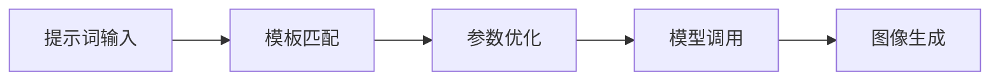
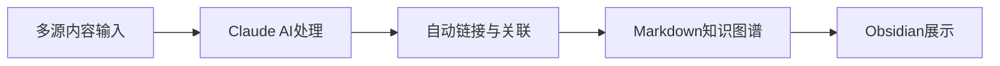
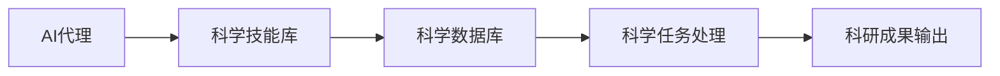
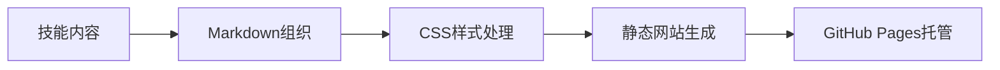
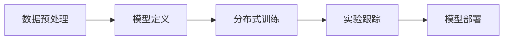
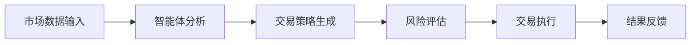
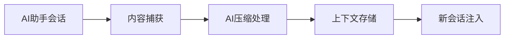
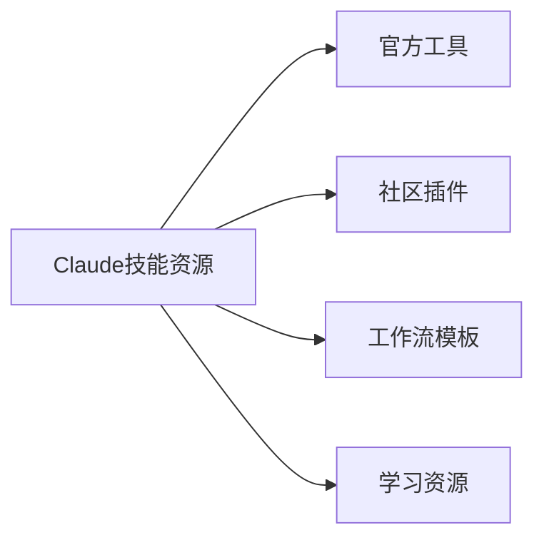
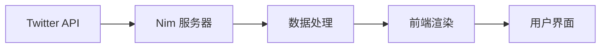
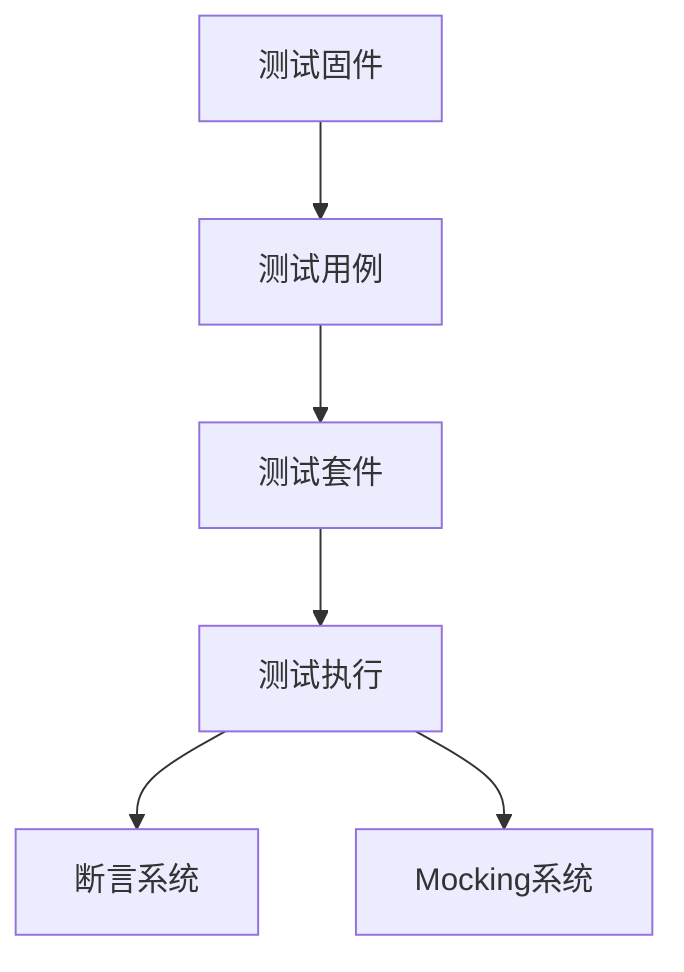

## 今日热点

AI代理技能与工具生态爆发式增长，科学、金融、创意等领域AI应用深化，Claude插件系统持续扩展，AI工程化工具链日趋成熟。

---

## 热门项目一览

| 排名 | 项目 | 语言 | 今日 | 总计 | 简介 |
|:---:|------|:----:|------:|-----:|------|
| 1 | [tt-a1i/archify](https://github.com/tt-a1i/archify) | JavaScript | +4,239 | 24,816 | Agent skill for beautiful, ... |
| 2 | [freestylefly/awesome-gpt-image-2](https://github.com/freestylefly/awesome-gpt-image-2) | JavaScript | +2,096 | 23,680 | Prompt as Code | GPT-Image2... |
| 3 | [bilawalsidhu/gods-eye-view](https://github.com/bilawalsidhu/gods-eye-view) | JavaScript | +1,984 | 9,319 | A spy satellite simulator i... |
| 4 | [DietrichGebert/ponytail](https://github.com/DietrichGebert/ponytail) | JavaScript | +1,613 | 114,526 | Makes your AI agent think l... |
| 5 | [calesthio/OpenMontage](https://github.com/calesthio/OpenMontage) | Python | +1,292 | 52,725 | World's first open-source, ... |
| 6 | [AgriciDaniel/claude-obsidian](https://github.com/AgriciDaniel/claude-obsidian) | Python | +634 | 14,182 | Self-organizing AI second b... |
| 7 | [rohitg00/ai-engineering-from-scratch](https://github.com/rohitg00/ai-engineering-from-scratch) | Python | +552 | 50,367 | Learn it. Build it. Ship it... |
| 8 | [K-Dense-AI/scientific-agent-skills](https://github.com/K-Dense-AI/scientific-agent-skills) | Python | +498 | 35,555 | Turn any AI agent into an A... |
| 9 | [OpenCut-app/OpenCut](https://github.com/OpenCut-app/OpenCut) | TypeScript | +478 | 87,598 | The open-source CapCut alte... |
| 10 | [ConardLi/garden-skills](https://github.com/ConardLi/garden-skills) | CSS | +415 | 11,448 | ConardLi's open-source Skil... |
| 11 | [JetBrains/go-modern-guidelines](https://github.com/JetBrains/go-modern-guidelines) | Go | +300 | 2,332 | Help AI coding agents write... |
| 12 | [anthropics/claude-plugins-official](https://github.com/anthropics/claude-plugins-official) | Python | +292 | 34,791 | Official, Anthropic-managed... |

---

## 趋势洞察

```
┌─────────────────────────────────────────────────────────────────┐
│  AI/ML 工具         ████████████████████████  12 个项目        │
│  其他               ██████                    3 个项目        │
│  开发框架             ████                      2 个项目        │
│  多媒体应用            ██                        1 个项目        │
│  数据分析             ██                        1 个项目        │
└─────────────────────────────────────────────────────────────────┘
```

---

## 项目深度解读

### 1. tt-a1i/archify — 架构图生成器

> **一句话总结**：一款能生成带动画效果的精美架构图、工作流图的JavaScript工具，可导出为独立HTML。

#### 价值主张

| 维度 | 说明 |
|------|------|
| **解决痛点** | 解决复杂系统架构可视化难题，提供直观清晰的图表表达 |
| **目标用户** | 系统架构师、开发工程师、技术文档编写者 |
| **核心亮点** | 支持多种图表类型 + 动态展示效果 + 独立HTML导出 + 简单易用 |

#### 技术架构


**技术特色**：
- 基于JavaScript的轻量级渲染引擎
- 支持多种图表类型的统一渲染框架
- 独立HTML文件，无需依赖外部资源

#### 热度分析

- 项目获得24,816 stars，单日增长4,239，说明近期热度极高，可能是新版本发布或功能重大更新
- Fork数为1,592，表明社区参与度较高，用户愿意基于此项目进行二次开发

#### 快速上手

```bash
# 安装archify
npm install archify

# 使用archify生成图表
archify input.yaml -o output.html
```

#### 注意事项

- 需要了解图表定义的语法规则
- 复杂图表可能需要较长时间渲染
- 导出图片质量取决于浏览器渲染能力


### 2. freestylefly/awesome-gpt-image-2 — [提示词工程库]

> **一句话总结**：工业级GPT-2图像生成提示词引擎，530+逆向案例与20+模板库

#### 价值主张

| 维度 | 说明 |
|------|------|
| **解决痛点** | 解决AI图像生成提示词设计复杂、效果不稳定问题 |
| **目标用户** | AI艺术家、设计师、开发者、提示词工程师 |
| **核心亮点** | 530+逆向案例 + 20+工业级模板 + Skills提炼系统 |

#### 技术架构



**技术特色**：
- 基于大量逆向工程案例的提示词优化系统
- 模块化模板库设计，支持参数化调整
- 结构化提示词分解与重构技术

#### 热度分析

- 项目获得超2.3万星，单日新增2000+，显示极高关注度
- 零未解决问题，表明维护良好，社区反馈及时处理

#### 快速上手

```bash
# 克隆项目
git clone https://github.com/freestylefly/awesome-gpt-image-2.git

# 进入目录
cd awesome-gpt-image-2

# 查看模板与案例
ls templates/ cases/
```

#### 注意事项

- 项目需要一定的AI图像生成基础知识
- 使用前需确认兼容的AI图像生成平台
- 部分模板可能需要API密钥或付费服务支持


### 3. bilawalsidhu/gods-eye-view — 3D地球情报可视化

> **一句话总结**：浏览器中的实时间谍卫星模拟器，展示真实数据的3D地球空间情报。

#### 价值主张

| 维度 | 说明 |
|------|------|
| **解决痛点** | 将复杂卫星数据转化为直观可交互的3D可视化体验 |
| **目标用户** | 地理信息爱好者、军事研究人员、数据可视化专业人士 |
| **核心亮点** | 实时数据可视化 + 3D地球模型 + 开源情报展示 + 交互式操作 |

#### 技术架构


**技术特色**：
- 使用WebGL技术实现高性能3D地球渲染
- 实时获取和处理开源卫星情报数据
- 基于JavaScript的跨平台浏览器实现

#### 热度分析

- 项目近期热度激增，单日Star增长近2,000个，总达9,319个
- 社区参与度高，Fork数量达1,991个，无开放Issues表明项目成熟稳定

#### 快速上手

```bash
# 克隆项目
git clone https://github.com/bilawalsidhu/gods-eye-view.git

# 安装依赖
npm install

# 启动开发服务器
npm start
```

#### 注意事项

- 项目使用了真实的卫星数据，需关注数据来源的合法性和使用限制
- 作为浏览器应用，性能可能受限于设备能力，处理大量数据时可能出现卡顿
- 项目许可证未知，商业使用前需确认授权条款


### 4. DietrichGebert/ponytail — AI 编程增效器

> **一句话总结**：通过模拟资深开发者思维，让 AI 编程助手高效生成更少、更优的代码。

#### 价值主张

| 维度 | 说明 |
|------|------|
| **解决痛点** | 开发者编写重复代码、AI 助手生成冗余代码，降低开发效率 |
| **目标用户** | 软件开发者、AI 编程助手用户、追求代码效率的开发团队 |
| **核心亮点** | 模拟资深开发者思维 + 最小化代码生成 + 优化代码质量 + 提高开发效率 |

#### 技术架构


**技术特色**：
- 模拟资深开发者思维模式
- 优化 AI 生成代码质量
- 最小化不必要的代码生成

#### 热度分析

- 项目获得超过 11.4 万 Star，近期增长迅速(+1,613 today)，表明项目受到开发者广泛关注
- 在 AI 编程辅助工具领域具有重要影响力，可能是该领域的领先项目之一

#### 快速上手

```bash
# 安装
npm install ponytail

# 使用
ponytail "你的编程需求"
```

#### 注意事项

- 项目许可证未知，使用前应确认授权方式
- 可能需要与特定的 AI 编程工具配合使用才能发挥最佳效果
- 代码生成质量依赖于 AI 模型能力和输入描述的准确性


### 5. calesthio/OpenMontage — AI视频制作系统

> **一句话总结**：开源智能视频制作系统，将AI助手转变为完整视频制作工作室，提供12条生产流程和100+工具。

#### 价值主张

| 维度 | 说明 |
|------|------|
| **解决痛点** | 专业视频制作门槛高、流程复杂，需要多种技能和工具协同 |
| **目标用户** | 内容创作者、视频制作团队、AI应用开发者 |
| **核心亮点** | 全流程AI自动化 + 12条生产管线 + 700+智能技能文件 + 开源可定制 |

#### 技术架构


**技术特色**：
- 基于AI代理的自动化视频生产流程
- 模块化工具链设计，支持100+专业工具
- 知识库驱动，包含700+专业技能文件
- 开源架构，支持社区扩展和定制

#### 热度分析

- 项目Star数超过5万，近期增长迅速，日均新增约1300星，表明社区高度关注
- Fork数与Star数比例约为1:8，显示项目以使用为主，二次开发相对较少
- Zero Open Issues表明项目维护状态良好，问题解决效率高

#### 快速上手

```bash
# 克隆仓库
git clone https://github.com/calesthio/OpenMontage.git

# 安装依赖
pip install -r requirements.txt

# 运行示例
python examples/basic_video_production.py
```

#### 注意事项

- 项目依赖大量AI工具和服务，可能需要API密钥和配置
- 系统要求较高，可能需要强大的计算资源处理视频任务
- 作为新兴项目，部分功能可能仍在开发和优化中


### 6. AgriciDaniel/claude-obsidian — AI知识管理

> **一句话总结**：基于Claude与Obsidian构建的自组织AI知识库，自动链接内容形成个人知识图谱。

#### 价值主张

| 维度 | 说明 |
|------|------|
| **解决痛点** | 碎片化信息自动整理，构建连接式知识网络，解决信息孤岛问题 |
| **目标用户** | 知识工作者、研究人员、需要高效信息管理的人群 |
| **核心亮点** | AI自动内容处理 + Markdown知识图谱 + Claude深度集成 + 开源Notion替代 |

#### 技术架构



**技术特色**：
- 利用Claude的AI能力理解并连接非结构化内容
- 将复杂信息转化为结构化Markdown知识网络
- 实现数据本地化存储，保障用户数据所有权

#### 热度分析

- 项目Star数突破14,000，单日增长600+，知识管理领域热度飙升
- 作为开源Notion替代方案，在AI驱动的PKM领域占据重要生态位置

#### 快速上手

```bash
# 克隆项目
git clone https://github.com/AgriciDaniel/claude-obsidian.git
cd claude-obsidian

# 安装依赖
pip install -r requirements.txt
python app.py
```

#### 注意事项
- 需要安装Obsidian应用以完整体验功能
- 需配置Claude API访问权限
- 项目许可证信息不明确，使用前需确认
- 项目Issue数为0，建议关注项目更新日志获取最新信息


### 7. rohitg00/ai-engineering-from-scratch — AI工程学习指南

> **一句话总结**：从零开始学习AI工程全流程，构建并部署AI产品的实践指南。

#### 价值主张

| 维度 | 说明 |
|------|------|
| **解决痛点** | 提供系统化AI工程学习路径，解决从理论到实践的鸿沟 |
| **目标用户** | AI初学者、希望转向AI领域的开发者、技术产品经理 |
| **核心亮点** | 项目驱动学习 + 完整工程流程 + 实用部署指南 |

#### 技术架构


**技术特色**：
- 理论与实践结合的学习路径
- 端到端AI产品开发流程
- 工程化部署与运维最佳实践

#### 热度分析

- 项目Star数超过5万，近期每日新增500+，表明AI工程学习需求旺盛
- 高Fork率反映社区积极参与和二次开发，形成活跃学习生态

#### 快速上手

```bash
# 克隆项目
git clone https://github.com/rohitg00/ai-engineering-from-scratch.git

# 安装依赖
cd ai-engineering-from-scratch
pip install -r requirements.txt
```

#### 注意事项

- 项目可能需要一定的机器学习和编程基础
- 建议按照项目结构顺序学习，循序渐进
- 注意许可证信息，可能影响商业用途


### 8. K-Dense-AI/scientific-agent-skills — AI科研赋能库

> **一句话总结**：将AI代理转化为科学家的专业技能库，提供163个验证技能和100+科学数据库。

#### 价值主张

| 维度 | 说明 |
|------|------|
| **解决痛点** | AI代理缺乏专业科研能力，无法处理科学领域复杂任务 |
| **目标用户** | 全球科学家、研究人员、医药研发人员 |
| **核心亮点** | 163+验证科学技能 + 100+专业数据库 + 多平台兼容性 |

#### 技术架构



**技术特色**：
- 模块化科学技能设计，便于AI代理调用
- 跨平台兼容性支持多种AI编程环境
- 专业科学知识图谱构建与检索机制

#### 热度分析

- 项目获得35,555星，今日增长498，显示科研AI领域热度持续攀升
- 全球17.5万科学家使用，表明在科研社区具有广泛影响力

#### 快速上手

```bash
# 安装科学代理技能库
pip install scientific-agent-skills

# 初始化科学家技能
from scientific_agent import ScientistSkills
skills = ScientistSkills.initialize()

# 应用特定科学技能
skills.apply_skill("protein_analysis", data)
```

#### 注意事项

- 需要具备相应科学领域知识才能有效使用
- 某些高级功能可能需要API密钥或订阅服务
- 免费版本可能存在功能限制


### 9. OpenCut-app/OpenCut — 开源视频编辑

> **一句话总结**：开源替代CapCut的跨平台视频编辑工具，提供专业级编辑功能与简洁用户体验。

#### 价值主张

| 维度 | 说明 |
|------|------|
| **解决痛点** | 提供免费开源的视频编辑方案，摆脱商业软件限制 |
| **目标用户** | 内容创作者、短视频制作者、开源软件爱好者 |
| **核心亮点** | 跨平台支持 + 专业编辑功能 + 开源可定制 + 无水印 |

#### 技术架构


**技术特色**：
- 基于TypeScript构建，提供类型安全与跨平台能力
- 采用模块化设计，支持插件扩展编辑功能
- 优化的媒体处理流水线，确保实时预览性能

#### 热度分析

- 项目获得8.7万星且持续增长，表明开源视频编辑市场需求旺盛
- Fork数量相对较少，说明项目可能处于早期开发阶段或社区贡献模式特殊

#### 快速上手

```bash
# 克隆仓库
git clone https://github.com/OpenCut-app/OpenCut.git

# 安装依赖
npm install

# 启动开发环境
npm run dev
```

#### 注意事项

- 项目可能仍在开发中，功能可能不完整
- 由于是开源替代品，可能存在与CapCut功能差异
- 许可证信息不明确，使用前需确认开源协议


### 10. ConardLi/garden-skills — 前端技能集

> **一句话总结**：一个全面的前端开发技能集合，涵盖设计、知识获取和图像生成等实用技术。

#### 价值主张

| 维度 | 说明 |
|------|------|
| **解决痛点** | 为开发者提供一站式前端技能解决方案，减少学习资源搜集成本 |
| **目标用户** | 前端开发者、Web设计师、全栈工程师 |
| **核心亮点** | 实用技巧丰富 + 覆盖领域全面 + 案例代码详尽 + 持续更新维护 |

#### 技术架构



**技术特色**：
- 基于 Markdown 的轻量级内容组织
- 纯 CSS 实现的精美视觉效果
- GitHub Pages 直接托管，便于访问和贡献

#### 热度分析

- 项目获得超过 11,000 stars 且每日新增约 400 stars，表明项目受到广泛关注和认可
- 作为个人技能收集项目，其社区参与度（1,400+ forks）显示出较高的开发者认可度

#### 快速上手

```bash
# 克隆仓库
git clone https://github.com/ConardLi/garden-skills.git

# 本地预览（如有预览工具）
cd garden-skills
# 可能有本地预览命令，如使用 live-server 等
```

#### 注意事项

- 项目可能需要定期更新以保持内容的时效性
- 由于是个人项目，贡献可能需要遵循特定的规范或流程


### 11. JetBrains/go-modern-guidelines — AI Go 编码指南

> **一句话总结**：为 AI 编程代理提供现代 Go 语言最佳实践的结构化指南，提升 AI 生成代码质量。

#### 价值主张

| 维度 | 说明 |
|------|------|
| **解决痛点** | AI 生成的 Go 代码不符合现代 Go 最佳实践和语言特性 |
| **目标用户** | AI 编程工具开发者、使用 AI 辅助 Go 开发的程序员 |
| **核心亮点** | 现代 Go 语言特性 + AI 编程适配 + 结构化规范 + 实用示例 |

#### 技术架构


**技术特色**：
- 专为 AI 编程代理优化的编码指南
- 覆盖 Go 1.18+ 最新语言特性
- 结构化的规范与实例相结合
- 可直接集成到 AI 编程工具中

#### 热度分析

- 单日增长 300 星，显示 Go 社区对现代编程指南的强烈需求
- JetBrains 品牌背书，在 Go 生态系统中具有较高权威性和影响力

#### 快速上手

```bash
# 克隆项目
git clone https://github.com/JetBrains/go-modern-guidelines.git

# 查看主要内容
cat README.md
```

#### 注意事项
- 该指南专为 AI 编程代理设计，可能与人类开发者习惯有所不同
- 需要定期更新以跟上 Go 语言的发展和新版本特性
- 使用时应结合具体项目需求和团队规范进行调整


### 12. anthropics/claude-plugins-official — 官方插件目录

> **一句话总结**：Anthropic 官方管理的高质量 Claude 插件集合，提供标准化插件发现与部署平台。

#### 价值主张

| 维度 | 说明 |
|------|------|
| **解决痛点** | 解决 Claude 插件分散、质量参差不齐的问题，提供官方认证的可靠插件 |
| **目标用户** | Claude AI 用户、开发者、企业应用集成者 |
| **核心亮点** | 官方审核机制 + 高质量筛选 + 标准化接口 + 社区驱动 + 安全保障 |

#### 技术架构


**技术特色**：
- 插件标准化接口确保兼容性和一致性
- 官方审核机制保障插件质量与安全性
- 分类标签系统提升插件发现效率

#### 热度分析

- 近期增长迅猛，表明 Claude 插件生态正在快速扩张，用户对官方插件需求强烈
- 作为官方项目，在 Claude 插件生态中占据核心地位，是开发者和用户的首选资源

#### 快速上手

```bash
# 克隆官方插件目录
git clone https://github.com/anthropics/claude-plugins-official.git

# 浏览可用插件
cd claude-plugins-official && ls plugins/
```

#### 注意事项

- 使用插件前需检查其与 Claude API 版本的兼容性
- 官方项目可能要求遵守特定的贡献指南和插件开发规范
- 插件更新频率可能不同，建议定期检查目录获取最新插件


### 13. marin-community/marin — 基础模型框架

> **一句话总结**：Marin是专注于基础模型研发的开源框架，提供高效训练与灵活架构支持。

#### 价值主张

| 维度 | 说明 |
|------|------|
| **解决痛点** | 简化基础模型研发流程，降低分布式训练和实验管理门槛 |
| **目标用户** | AI研究人员、基础模型开发团队和机器学习工程师 |
| **核心亮点** | 模块化设计 + 高效训练支持 + 研究友好 + 实用工具集 + 易于扩展 |

#### 技术架构



**技术特色**：
- 基于Python的模块化架构设计
- 提供分布式训练与资源优化支持
- 内置多种预训练模型接口和工具集

#### 热度分析
- 项目近期增长迅猛，今日stars激增255个，显示社区高度关注
- issues为零表明项目成熟度高或问题解决机制高效，维护良好

#### 快速上手

```bash
# 安装marin
pip install marin-framework

# 初始化项目
marin init my-project

# 运行示例训练
marin train --config examples/configs/base_model.yaml
```

#### 注意事项
- 项目许可证未知，商业使用前需确认授权条款
- 作为研究框架，需要一定的机器学习基础才能充分利用其功能


### 14. TauricResearch/TradingAgents — [多智能体交易框架]

> **一句话总结**：基于大语言模型的多智能体金融交易框架，实现自动化交易策略生成与执行

#### 价值主张

| 维度 | 说明 |
|------|------|
| **解决痛点** | 传统交易策略开发复杂，AI决策难以落地执行 |
| **目标用户** | 量化交易者、金融分析师、投资机构 |
| **核心亮点** | 多智能体协作 + 大语言模型决策 + 策略自动化 + 回测系统 + 实时交易接口 |

#### 技术架构



**技术特色**：
- 基于大语言模型的智能决策系统
- 多智能体协同工作机制
- 完整的交易回测与评估体系
- 灵活的策略自定义能力
- 支持多种交易接口和资产类别

#### 热度分析

- 高关注度项目，10万+星标，日增229星，表明市场对AI交易系统强烈兴趣
- 1.9万+次Fork，显示项目在量化金融社区具有较高影响力与实用价值

#### 快速上手

```bash
# 克隆项目
git clone https://github.com/TauricResearch/TradingAgents.git
cd TradingAgents

# 安装依赖
pip install -r requirements.txt

# 运行示例
python examples/basic_trading_agent.py
```

#### 注意事项

- 需要一定的金融知识和Python编程基础
- 实盘交易前需充分测试，注意风险管理
- 项目依赖的LLM API可能产生额外费用
- 需要配置相应的交易接口和API密钥


### 15. thedotmack/claude-mem — AI记忆持久化

> **一句话总结**：利用AI压缩技术实现跨会话上下文持久化，提升AI助手连续对话能力。

#### 价值主张

| 维度 | 说明 |
|------|------|
| **解决痛点** | AI助手会话间记忆缺失，无法保持连贯的上下文理解 |
| **目标用户** | 使用AI编程助手进行长期项目的开发者和研究人员 |
| **核心亮点** | 自动捕获会话内容 + AI压缩上下文 + 多平台支持 + 隐私保护 |

#### 技术架构



**技术特色**：
- 使用AI技术智能压缩上下文信息，减少冗余
- 支持多种主流AI编程助手，兼容性强
- 实现跨会话的记忆持久化，提升连续对话体验

#### 热度分析

- 项目获得超过9.2万星，近期日增143星，增长迅速，显示AI记忆功能需求强烈
- 社区活跃度高，Fork数达8千多，表明开发者积极参与二次开发和功能扩展

#### 快速上手

```bash
# 克隆项目
git clone https://github.com/thedotmack/claude-mem.git

# 安装依赖
npm install

# 启动服务
npm start
```

#### 注意事项

- 需要配置相应的AI服务API密钥
- 注意数据隐私和安全性，特别是处理敏感代码和对话内容时
- 可能需要根据使用的具体AI助手进行额外配置


### 16. ComposioHQ/awesome-claude-skills — Claude技能精选

> **一句话总结**：精选Claude AI技能与工具列表，助力用户定制高效AI工作流。

#### 价值主张

| 维度 | 说明 |
|------|------|
| **解决痛点** | 解决用户难以发现和整合Claude AI高级技能与工具的问题 |
| **目标用户** | Claude AI开发者、研究人员和高级用户 |
| **核心亮点** | 精选高质量技能资源 + 分类组织便于查找 + 社区贡献持续更新 |

#### 技术架构



**技术特色**：
- 采用Markdown组织结构，便于阅读和维护
- 分类清晰，便于用户快速查找所需资源
- 社区驱动，持续更新最新技能与工具

#### 热度分析

- 项目获得73,725个Star，显示Claude AI生态系统的活跃度和用户对技能扩展的强烈需求
- 作为资源集合项目，其高Fork数(8,449)表明用户积极参与内容定制和本地化

#### 快速上手

```bash
# 克隆项目到本地
git clone https://github.com/ComposioHQ/awesome-claude-skills.git

# 浏览README获取技能资源列表
cat awesome-claude-skills/README.md
```

#### 注意事项

- 项目依赖社区贡献，内容更新频率取决于社区活跃度
- 部分链接可能需要API访问权限或付费订阅
- 使用前应评估技能与工具的兼容性和安全性


### 17. zedeus/nitter — 轻量 Twitter 客户端

> **一句话总结**：无广告、无跟踪的 Twitter 前端替代品，提供简洁的社交媒体浏览体验。

#### 价值主张

| 维度 | 说明 |
|------|------|
| **解决痛点** | 提供无广告、无跟踪的 Twitter 体验，保护用户隐私 |
| **目标用户** | 注重隐私、厌恶广告的 Twitter 用户 |
| **核心亮点** | 无广告界面 + 开源透明 + 轻量级设计 + 数据隐私保护 |

#### 技术架构



**技术特色**：
- 使用 Nim 编写的高效后端，性能优异
- 自定义 API 解析，不依赖官方 Twitter API
- 简洁的前端设计，减少资源消耗
- 开源架构，支持自行部署

#### 热度分析

- 项目拥有14,001个star，1,160个fork，近期持续增长(+71 today)，表明社区活跃度高
- 0个Open Issues反映项目维护良好，在开源 Twitter 前端领域具有较强影响力

#### 快速上手

```bash
# 克隆项目
git clone https://github.com/zedeus/nitter.git
# 进入项目目录
cd nitter
# 构建并运行
nimble build && ./nitter
```

#### 注意事项

- 项目需要配置才能正常运行，包括域名设置和API密钥
- 使用时需遵守 Twitter 的服务条款，避免被封禁
- 作为第三方前端，可能无法访问 Twitter 的所有新功能
- 部署时需考虑API限制和速率控制，防止触发Twitter的反爬机制


### 18. google/googletest — C++测试框架

> **一句话总结**：Google 推出的功能全面、易于使用的 C++ 单元测试和模拟框架，提供丰富的断言和测试组织功能。

#### 价值主张

| 维度 | 说明 |
|------|------|
| **解决痛点** | 解决 C++ 项目缺乏标准化、功能全面的测试框架问题 |
| **目标用户** | C++ 开发者、测试工程师、高质量代码验证项目团队 |
| **核心亮点** | 简洁断言宏 + 测试固件支持 + 参数化测试 + 死亡测试 + Mocking框架 |

#### 技术架构



**技术特色**：
- 基于模板的断言系统，提供类型安全的检查
- 支持死亡测试，可验证程序终止行为
- 参数化测试允许使用不同参数运行同一测试逻辑

#### 热度分析

- 超过 39k star 和 10k+ fork，表明其在 C++ 社区中拥有极高认可度
- 作为 Google 官方维护的测试框架，已成为 C++ 生态系统的标准测试工具

#### 快速上手

```bash
# 克隆仓库
git clone https://github.com/google/googletest.git
cd googletest
# 构建测试框架
mkdir build && cd build
cmake ..
make
# 运行示例测试
./samples/sample1_unittest
```

#### 注意事项

- GoogleTest 的断言宏在失败时会终止当前测试函数，需正确理解其行为
- Mocking 功能需要额外学习 GoogleMock，两者通常一起使用
- 对于大型项目，需要合理组织测试以避免编译时间过长


### 19. actions/checkout — 代码检出工具

> **一句话总结**：GitHub官方提供的核心Action，用于CI/CD流程中安全高效地检出代码仓库。

#### 价值主张

| 维度 | 说明 |
|------|------|
| **解决痛点** | 简化CI/CD中的代码检出操作，提供统一安全的仓库访问解决方案 |
| **目标用户** | GitHub Actions用户、CI/CD工程师、自动化测试开发者 |
| **核心亮点** | 多种认证支持 + 跨平台兼容 + 灵活检出选项 + 官方维护 + 轻量实现 |

#### 技术架构


**技术特色**：
- 支持GitHub App、个人访问令牌等多种认证方式
- 提供深度克隆、单一分支等细粒度检出选项
- 跨平台兼容，支持Windows、Linux和macOS环境

#### 热度分析

- 高Star数和稳定增长表明该项目是GitHub生态系统中的基础组件，广泛使用
- 作为GitHub官方维护的核心Action，在CI/CD流程中扮演关键角色

#### 快速上手

```bash
name: CI
on: [push]

jobs:
  build:
    runs-on: ubuntu-latest
    steps:
    - uses: actions/checkout@v3
    - name: Build
      run: npm install && npm test
```

#### 注意事项

- 注意及时更新Action版本以获取安全更新和新功能
- 在使用个人访问令牌时，确保遵循最小权限原则
- 对于大型仓库，考虑使用fetch-depth参数控制克隆深度以提升性能


## 今日推荐

| 主题 | 推荐项目 | 亮点 |
|------|----------|------|
| 今日最热 | [tt-a1i/archify](https://github.com/tt-a1i/archify) | Agent skill for b... |
| 值得关注 | [freestylefly/awesome-gpt-image-2](https://github.com/freestylefly/awesome-gpt-image-2) | Prompt as Code | ... |
| 快速上手 | [bilawalsidhu/gods-eye-view](https://github.com/bilawalsidhu/gods-eye-view) | A spy satellite s... |
| 长期潜力 | [DietrichGebert/ponytail](https://github.com/DietrichGebert/ponytail) | Makes your AI age... |

---

<div align="center">

*Generated on 2026-08-28 | Powered by GitHub Trending Reporter*

</div>