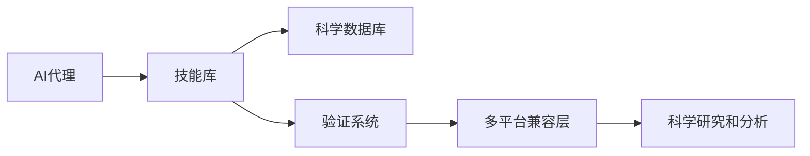
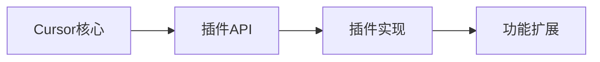
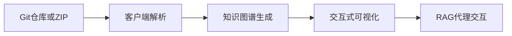
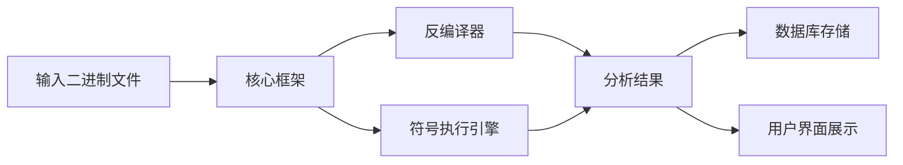
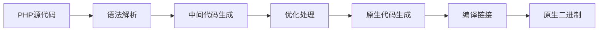
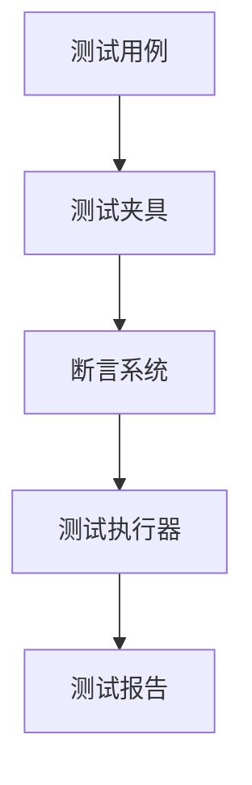

## 今日热点

今日GitHub热榜项目精彩纷呈。

---

## 热门项目一览

| 排名 | 项目 | 语言 | 今日 | 总计 | 简介 |
|:---:|------|:----:|------:|-----:|------|
| 1 | [tt-a1i/archify](https://github.com/tt-a1i/archify) | JavaScript | +4,562 | 28,072 | Agent skill for beautiful, ... |
| 2 | [bilawalsidhu/gods-eye-view](https://github.com/bilawalsidhu/gods-eye-view) | JavaScript | +3,829 | 11,313 | A spy satellite simulator i... |
| 3 | [freestylefly/awesome-gpt-image-2](https://github.com/freestylefly/awesome-gpt-image-2) | JavaScript | +1,687 | 24,411 | Prompt as Code | GPT-Image2... |
| 4 | [DietrichGebert/ponytail](https://github.com/DietrichGebert/ponytail) | JavaScript | +1,396 | 115,553 | Makes your AI agent think l... |
| 5 | [calesthio/OpenMontage](https://github.com/calesthio/OpenMontage) | Python | +1,144 | 53,436 | World's first open-source, ... |
| 6 | [tailscale/tailcat](https://github.com/tailscale/tailcat) | Go | +965 | 2,867 | like netcat, but over Tails... |
| 7 | [K-Dense-AI/scientific-agent-skills](https://github.com/K-Dense-AI/scientific-agent-skills) | Python | +720 | 36,840 | Turn any AI agent into an A... |
| 8 | [rohitg00/ai-engineering-from-scratch](https://github.com/rohitg00/ai-engineering-from-scratch) | Python | +703 | 50,683 | Learn it. Build it. Ship it... |
| 9 | [JetBrains/go-modern-guidelines](https://github.com/JetBrains/go-modern-guidelines) | Go | +574 | 2,645 | Help AI coding agents write... |
| 10 | [anthropics/claude-plugins-official](https://github.com/anthropics/claude-plugins-official) | Python | +457 | 35,093 | Official, Anthropic-managed... |
| 11 | [tashfeenahmed/freellmapi](https://github.com/tashfeenahmed/freellmapi) | TypeScript | +433 | 21,709 | 7.4 billion tokens per mont... |
| 12 | [abi/screenshot-to-code](https://github.com/abi/screenshot-to-code) | Python | +326 | 75,645 | Drop in a screenshot and co... |

---

## 趋势洞察

```
┌─────────────────────────────────────────────────────────────────┐
│  AI/ML 工具         ████████████████████████  14 个项目        │
│  开发框架             █████                     3 个项目        │
│  其他               ███                       2 个项目        │
│  数据分析             █                         1 个项目        │
└─────────────────────────────────────────────────────────────────┘
```

---

## 项目深度解读

### 1. tt-a1i/archify — 架构图生成工具

> **一句话总结**：一款生成美观可验证的架构图、工作流图的自包含HTML工具，支持动画与高质量导出。

#### 价值主张

| 维度 | 说明 |
|------|------|
| **解决痛点** | 让开发者无需复杂工具即可创建专业级技术图表 |
| **目标用户** | 软件开发人员、系统架构师、技术文档编写者 |
| **核心亮点** | 自包含HTML输出 + 支持动画效果 + 高质量导出 + 多种图表类型支持 |

#### 技术架构


**技术特色**：
- 纯JavaScript实现，无需额外依赖
- 自包含HTML文件，可直接在浏览器中打开
- 支持导出高质量图片格式

#### 热度分析
- 项目Star数超28k，单日增长超4.5k，近期获得广泛关注
- Fork数相对较少，表明项目偏向直接使用而非二次开发

#### 快速上手

```bash
# 克隆仓库
git clone https://github.com/tt-a1i/archify.git

# 安装依赖
npm install

# 运行示例
npm run example
```

#### 注意事项
- 项目许可证未知，商业使用需谨慎
- 项目近期热度增长迅速，可能处于不稳定状态
- 主要在浏览器环境运行，需要JavaScript支持


### 2. bilawalsidhu/gods-eye-view — 实时地球情报

> **一句话总结**：浏览器内运行的实时卫星数据可视化平台，提供开源的空间情报分析能力。

#### 价值主张

| 维度 | 说明 |
|------|------|
| **解决痛点** | 将复杂的卫星数据转化为直观可视化，降低空间情报获取门槛 |
| **目标用户** | 地理信息研究者 + 军事爱好者 + 数据可视化开发者 |
| **核心亮点** | 真实卫星数据 + 3D地球渲染 + 实时数据更新 + 开源情报 |

#### 技术架构


**技术特色**：
- 使用WebGL技术实现高性能3D地球渲染
- 实时数据流处理与可视化展示
- 轻量级浏览器端架构，无需额外安装

#### 热度分析

- 项目近期Star增长迅猛，单日增长3800+，显示社区高度关注
- 高Fork/Star比例(约20%)表明用户积极参与二次开发

#### 快速上手

```bash
# 克隆项目到本地
git clone https://github.com/bilawalsidhu/gods-eye-view.git

# 启动开发服务器
npm install && npm start
```

#### 注意事项

- 项目依赖实时卫星数据源，需确保网络连接稳定
- 3D渲染可能对设备性能有一定要求
- 注意数据使用权限和隐私问题


### 3. freestylefly/awesome-gpt-image-2 — [AI图像提示词库]

> **一句话总结**：工业级GPT图像生成提示词引擎与模板库，包含530+逆向工程案例和20+套专业模板。

#### 价值主张

| 维度 | 说明 |
|------|------|
| **解决痛点** | 解决AI图像生成提示词设计困难、效果不稳定的问题 |
| **目标用户** | AI图像生成开发者、设计师、提示词工程师 |
| **核心亮点** | 530+案例逆向工程 + 20+工业级模板 + 技能提炼系统 |

#### 技术架构


**技术特色**：
- 大规模提示词案例逆向工程分析
- 结构化模板库分类与检索系统
- 可扩展的提示词技能提取方法

#### 热度分析

- 项目Star数超2.4万，单日增长1,687，热度攀升迅速
- 无Open Issues，社区可能通过其他渠道交流，维护良好

#### 快速上手

```bash
# 克隆项目
git clone https://github.com/freestylefly/awesome-gpt-image-2.git

# 浏览模板目录
cd awesome-gpt-image-2 && ls templates/
```

#### 注意事项

- 项目许可证未知，使用时需注意版权问题
- 需配合相应AI图像生成API使用，项目本身不包含模型
- 案例和模板可能需要根据具体需求进行微调优化


### 4. DietrichGebert/ponytail — AI代码助手

> **一句话总结**：让AI像最懒惰的高级开发者一样思考，帮你编写最少量的高质量代码。

#### 价值主张

| 维度 | 说明 |
|------|------|
| **解决痛点** | 减少重复编码工作，提高开发效率，降低代码维护成本 |
| **目标用户** | JavaScript开发者，尤其是需要频繁编写相似代码的开发者 |
| **核心亮点** | 智能代码生成 + 代码优化 + 减少重复代码 |

#### 技术架构


**技术特色**：
- 基于AI的代码智能生成技术
- 代码质量自动评估与优化机制
- 懒加载思维减少不必要的代码生成

#### 热度分析

- 超过11.5万星，单日新增近1400星，表明项目近期热度极高，深受开发者欢迎
- 零开放问题，表明项目维护良好，社区问题解决效率高

#### 快速上手

```bash
# 安装
npm install ponytail

# 使用
ponytail generate "创建一个用户登录组件"
```

#### 注意事项

- 需要确保生成的代码符合项目编码规范和安全标准
- 可能需要根据具体项目配置AI的学习参数以获得最佳效果


### 5. calesthio/OpenMontage — AI视频制作系统

> **一句话总结**：开源AI视频制作平台，将AI助手转变为完整视频工作室，提供12个生产流程和700+技能文件。

#### 价值主张

| 维度 | 说明 |
|------|------|
| **解决痛点** | 传统视频制作流程复杂、门槛高，需要专业技能和昂贵工具 |
| **目标用户** | 内容创作者、视频制作人、AI应用开发者、创意工作者 |
| **核心亮点** | 开源代理式系统 + 12个生产流程 + 700+技能文件 + AI助手集成 |

#### 技术架构


**技术特色**：
- 基于代理的自动化视频生产架构
- 模块化工具集成与知识驱动设计
- 支持多流程并行处理的智能编排

#### 热度分析

- 项目Star数突破5万且日增千余，显示AI视频制作领域需求爆发式增长
- 作为开源项目，其零Issues状态和活跃社区贡献表明代码质量和生态健康度俱佳

#### 快速上手

```bash
# 克隆项目
git clone https://github.com/calesthio/OpenMontage.git

# 安装依赖
pip install -r requirements.txt

# 运行示例
python run_example.py
```

#### 注意事项

- 项目需要一定的AI和视频处理基础知识
- 视频生成任务可能需要较强的计算资源支持
- 作为新兴技术栈，API和功能可能仍在快速迭代中


### 6. tailscale/tailcat — 跨网络数据传输工具

> **一句话总结**：基于 Tailscale 数据平面的轻量级网络连接工具，无需控制平面即可实现安全通信。

#### 价值主张

| 维度 | 说明 |
|------|------|
| **解决痛点** | 绕过 Tailscale 控制平面，实现直接安全通信 |
| **目标用户** | 需要安全跨网络连接的开发者和运维人员 |
| **核心亮点** | 使用 Tailscale 数据平面 + 无需控制平面 + 轻量级 + 安全通信 + 简单易用 |

#### 技术架构


**技术特色**：
- 基于 Tailscale 数据平面，无需完整 Tailscale 基础设施
- 使用 Go 语言开发，跨平台性能优异
- 简化网络连接配置，提供类似 netcat 的便捷体验

#### 热度分析

- 项目 Star 数快速增长，表明开发者对简化安全网络连接工具有强烈需求
- 作为 Tailscale 生态系统的重要补充，填补了特定场景下的工具空白

#### 快速上手

```bash
# 发送数据到远程节点
echo "Hello" | tailcat <tailscale-ip>:port

# 监听端口接收数据
tailcat -l -p port
```

#### 注意事项

- 需要安装 Tailscale 客户端才能使用其数据平面
- 仅适用于已加入 Tailscale 网络的设备
- 可能存在安全风险，建议仅在可信网络中使用


### 7. K-Dense-AI/scientific-agent-skills — AI科学家技能库

> **一句话总结**：将任何AI代理转变为专业科学家，提供163种验证技能和100+科学数据库，覆盖多学科研究领域。

#### 价值主张

| 维度 | 说明 |
|------|------|
| **解决痛点** | 为AI代理提供专业科学能力，突破AI在科研分析中的局限性 |
| **目标用户** | 全球175,000+科学家、研究人员和AI开发者 |
| **核心亮点** | 163种验证技能 + 100+科学数据库 + 多平台兼容 + 开放标准支持 |

#### 技术架构



**技术特色**：
- 模块化技能设计，支持科学工作流定制
- 多平台兼容架构，无缝集成主流AI开发环境
- 科学数据整合能力，覆盖生物学、化学、医学等领域

#### 热度分析

- Star数达36,840且单日增长720，显示科学AI领域的高关注度
- 作为科学AI技能库的领导者，已形成活跃的科研AI应用生态

#### 快速上手

```bash
# 安装scientific-agent-skills
pip install scientific-agent-skills

# 初始化科学AI代理
from scientific_agent import ScientificAgent
agent = ScientificAgent()

# 使用特定科学技能
agent.use_skill("protein_analysis", data="sample_protein.fasta")
```

#### 注意事项

- 确保使用的数据符合各科学数据库的访问权限和许可协议
- 技能验证结果应结合专业知识进行人工审核，特别是在关键科学决策中
- 注意不同平台间的兼容性差异，可能需要针对特定环境进行配置调整


### 8. rohitg00/ai-engineering-from-scratch — AI工程学习指南

> **一句话总结**：系统化AI工程学习路径，从基础理论到实践项目全流程覆盖

#### 价值主张

| 维度 | 说明 |
|------|------|
| **解决痛点** | 提供AI工程从入门到实践的系统化学习路径 |
| **目标用户** | AI初学者、希望转型AI领域的开发者 |
| **核心亮点** | 系统性学习路径 + 实践导向 + 项目驱动学习 |

#### 技术架构

由于这是一个学习资源项目，没有特定的技术架构图。

**技术特色**：
- Python作为主要编程语言，符合AI开发的主流选择
- 系统化的学习路径设计，适合零基础入门
- 强调实践和项目构建，而非纯理论

#### 热度分析

- 项目获得超50k Star且单日增长700+，表明在AI学习领域有极高关注度
- 近9k Fork数显示用户积极参与实践和二次开发，社区活跃度高

#### 快速上手

```bash
git clone https://github.com/rohitg00/ai-engineering-from-scratch.git
cd ai-engineering-from-scratch
```

#### 注意事项

- 项目需要一定的编程基础，特别是Python
- 作为学习资源项目，需要用户主动实践和探索
- 项目内容可能需要定期更新以跟上AI技术的快速发展


### 9. JetBrains/go-modern-guidelines — AI Go编程指南

> **一句话总结**：JetBrains官方推出的AI辅助Go编程规范，提供现代Go语言最佳实践指导。

#### 价值主张

| 维度 | 说明 |
|------|------|
| **解决痛点** | AI生成Go代码不符合现代Go语言最佳实践和规范 |
| **目标用户** | 使用AI工具辅助Go开发的程序员和AI编码系统 |
| **核心亮点** | 包含JetBrainsGo专业知识 + 聚焦AI生成代码 + 提供具体编程指导 |

#### 技术架构


**技术特色**：
- 融合JetBrains对Go语言的深度理解
- 专门针对AI生成代码的优化指导
- 结构化的Go语言现代实践规范

#### 热度分析

- 项目star数增长迅速，今日新增574个star，表明AI辅助编程领域热度高
- 作为JetBrains官方项目，在Go语言和AI编程交叉领域具有权威性

#### 快速上手

```bash
# 克隆项目查看完整指南
git clone https://github.com/JetBrains/go-modern-guidelines.git
cd go-modern-guidelines
cat README.md
```

#### 注意事项

- 本指南主要针对AI生成Go代码，但也适用于人工编写现代Go代码
- 随着Go语言发展，指南内容可能会更新，建议关注最新版本
- 使用时需要结合具体项目需求和团队规范进行调整


### 10. anthropics/claude-plugins-official — 官方插件库

> **一句话总结**：Anthropic 官方维护的高质量 Claude 插件目录，提供经过验证的代码扩展功能。

#### 价值主张

| 维度 | 说明 |
|------|------|
| **解决痛点** | 解决 Claude 用户寻找安全、可靠的插件扩展功能的需求 |
| **目标用户** | Claude AI 用户、开发者、企业用户和研究人员 |
| **核心亮点** | 官方认证 + 高质量筛选 + 持续更新 + 安全可靠 + 丰富功能 |

#### 技术架构

**技术特色**：
- 结构化插件元数据管理系统
- 插件质量评估与认证机制
- 官方审核与安全验证流程

#### 热度分析

- 项目获 35k+ stars，近期增长迅速，显示社区高度认可
- 作为 Anthropic 官方项目，在 Claude 生态系统中占据核心位置

#### 快速上手

```bash
# 克隆官方插件库
git clone https://github.com/anthropics/claude-plugins-official.git

# 浏览插件目录
cd claude-plugins-official && ls plugins
```

#### 注意事项

- 插件需要经过 Anthropic 官方认证才能收录
- 插件质量会定期审核，不符合标准的将被移除
- 使用插件时需注意数据安全和隐私保护


### 11. tashfeenahmed/freellmapi — 免费LLM聚合平台

> **一句话总结**：聚合34个免费LLM提供商的635个模型端点，提供智能路由与故障转移的统一API服务。

#### 价值主张

| 维度 | 说明 |
|------|------|
| **解决痛点** | 解决开发者需访问多种LLM服务但不愿为每项单独付费的问题 |
| **目标用户** | 需要使用多种LLM模型进行个人实验的开发者和研究人员 |
| **核心亮点** | 智能路由系统 + 自动故障转移 + 统一OpenAI兼容接口 + 加密密钥管理 + 大额免费配额 |

#### 技术架构


**技术特色**：
- 智能路由系统根据性能和可用性动态选择最优LLM提供商
- 自动故障转移机制确保服务高可用性和连续性
- 统一OpenAI兼容接口简化不同模型的集成过程

#### 热度分析

- 项目获21,709个Star，近期增长迅速(+433)，表明社区对该项目高度关注
- Fork数达3,070，显示开发者积极采用和二次开发此项目

#### 快速上手

```bash
# 安装依赖
npm install

# 配置API密钥
export FREE_LLM_API_KEY=your_api_key

# 启动服务
npm start
```

#### 注意事项

- 仅限个人实验使用，不可用于商业目的
- 免费配额可能有使用限制，需关注提供商政策变化
- 某些模型可能有速率限制或使用条件，需遵守各提供商条款


### 12. abi/screenshot-to-code — 截图转码工具

> **一句话总结**：将设计截图自动转换为前端代码，大幅提升开发效率与设计还原度。

#### 价值主张

| 维度 | 说明 |
|------|------|
| **解决痛点** | 解决从设计稿到代码实现的转化难题，节省手动编码时间 |
| **目标用户** | 前端开发者、UI设计师、全栈工程师 |
| **核心亮点** | 多框架支持 + 自动布局还原 + 智能组件识别 |

#### 技术架构


**技术特色**：
- 基于计算机视觉的UI元素识别
- 智能布局算法还原设计结构
- 支持多种前端框架的代码生成

#### 热度分析

- 项目获得7.5万+星标，近期单日增长326星，热度持续攀升
- Fork数近万，表明社区积极参与和二次开发意愿强
- 零开放问题，说明项目维护状态良好，问题解决效率高

#### 快速上手

```bash
# 安装
pip install screenshot-to-code

# 使用
screenshot-to-code your_screenshot.png --framework tailwind
```

#### 注意事项

- 项目许可证未知，商业使用前需确认授权情况
- 复杂UI的转换可能需要人工调整，不能完全替代手动编码
- 代码质量取决于原始图像的清晰度和复杂度


### 13. cursor/plugins — AI编辑器插件生态

> **一句话总结**：Cursor编辑器插件规范与官方插件集合，扩展AI辅助编程能力。

#### 价值主张

| 维度 | 说明 |
|------|------|
| **解决痛点** | 为Cursor编辑器提供标准化插件架构，扩展AI编程辅助功能 |
| **目标用户** | Cursor编辑器用户、AI辅助开发工具使用者 |
| **核心亮点** | TypeScript插件规范 + 官方插件实现 + AI功能扩展 |

#### 技术架构



**技术特色**：
- 基于TypeScript的强类型插件规范
- 标准化的插件接口设计
- 支持AI功能扩展的架构

#### 热度分析

- 项目Star数达6008，今日新增246，表明项目正快速增长
- 作为Cursor编辑器的核心组件，在AI辅助开发工具领域具有重要生态地位

#### 快速上手

```bash
# 安装Cursor编辑器插件
npm install -g @cursor/plugin
# 创建插件项目
cursor-plugin init my-plugin
# 开发并测试插件
cursor-plugin dev
```

#### 注意事项

- 需要Cursor编辑器作为运行环境
- 插件开发需要熟悉TypeScript和Cursor的API规范
- 许可证信息不明确，使用前需确认授权条款


### 14. marin-community/marin — 基础模型框架

> **一句话总结**：一个专注于基础模型研究和开发的开源框架，简化大模型训练与部署流程。

#### 价值主张

| 维度 | 说明 |
|------|------|
| **解决痛点** | 简化基础模型研发流程，降低大模型开发门槛 |
| **目标用户** | AI研究人员、模型工程师、数据科学家 |
| **核心亮点** | 模块化设计 + 高效训练 + 易于扩展 |

#### 技术架构


**技术特色**：
- 提供预训练模型库，加速研发进程
- 支持分布式训练，适应大规模数据
- 模块化设计，便于定制和扩展

#### 热度分析

- 项目Star数近3000，近期增长迅速，日增236，表明社区关注度持续提升
- Fork数相对较少，说明项目可能处于早期阶段，但技术价值已获认可

#### 快速上手

```bash
# 安装marin框架
pip install marin-ai

# 初始化项目
marin init my-foundation-model

# 开始训练
marin train --config config.yaml
```

#### 注意事项

- 项目许可证未知，商业使用前需确认授权条款
- 项目处于早期阶段，API可能不稳定，生产环境使用需谨慎


### 15. abhigyanpatwari/GitNexus — 代码图谱引擎

> **一句话总结**：GitNexus是完全客户端运行的代码知识图谱工具，无需服务器即可将Git仓库转换为交互式可视化图谱。

#### 价值主张

| 维度 | 说明 |
|------|------|
| **解决痛点** | 解决代码库复杂度高、难以理解代码结构和关系的问题 |
| **目标用户** | 开发者、代码审查人员、技术架构师、代码重构专家 |
| **核心亮点** | 完全客户端运行 + 支持多种Git平台 + 交互式知识图谱 + 内置RAG代理 |

#### 技术架构



**技术特色**：
- 纯客户端架构，无需服务器，保护代码隐私
- 支持多平台Git仓库集成，提供统一分析体验
- 利用图RAG技术增强代码理解和导航能力

#### 热度分析

- 项目获得46K+ stars且持续增长，表明代码图谱工具有强烈市场需求
- 零Issues状态反映了项目成熟度高，用户反馈积极，社区维护良好

#### 快速上手

```bash
# 克隆项目到本地
git clone https://github.com/abhigyanpatwari/GitNexus.git

# 安装依赖
npm install

# 启动开发服务器
npm run dev
```

#### 注意事项

- 由于完全在浏览器中运行，大型代码库可能会导致性能问题
- 需要现代浏览器支持，可能不兼容所有旧版浏览器
- 零服务器架构意味着所有处理都在客户端完成，对设备性能有一定要求


### 16. NationalSecurityAgency/ghidra — 逆向工程框架

> **一句话总结**：NSA开发的全功能逆向工程平台，提供从反汇编到脚本化的完整工具链。

#### 价值主张

| 维度 | 说明 |
|------|------|
| **解决痛点** | 提供统一、强大的逆向工程工具链，解决多工具协作难题 |
| **目标用户** | 安全研究人员、恶意分析师、逆向工程师 |
| **核心亮点** | 跨平台支持 + 强大的脚本功能 + 完整的逆向工程工具集 + 可扩展架构 + GUI与命令行双模式 |

#### 技术架构



**技术特色**：
- 基于Java构建，实现跨平台兼容性
- 内置强大的反编译器，支持多种处理器架构
- 提供Python脚本接口，支持自动化分析流程
- 采用模块化设计，便于扩展和定制
- 支持多种文件格式和编译器优化识别

#### 热度分析

- 项目星标数超过7.3万，近30天增长191，表明逆向工程领域持续关注度高
- 作为NSA开源项目，在政府和军事安全领域具有特殊地位，同时吸引大量民间安全研究人员

#### 快速上手

```bash
# 下载Ghidra
wget https://github.com/NationalSecurityAgency/ghidra/releases/download/v10.3.1/ghidra_10.3.1_PUBLIC.zip

# 解压并启动
unzip ghidra_10.3.1_PUBLIC.zip
cd ghidra_10.3.1_PUBLIC
./ghidraRun
```

#### 注意事项

- 由于项目源自NSA，用户需要注意潜在的安全和隐私问题
- 某些高级功能可能需要额外的配置或专业知识才能充分利用
- 处理恶意软件时需在隔离环境中进行，避免系统感染


### 17. swoole/typephp — PHP编译器

> **一句话总结**：将PHP代码编译为原生二进制文件，提升执行效率并减少运行时依赖。

#### 价值主张

| 维度 | 说明 |
|------|------|
| **解决痛点** | PHP作为解释型语言执行效率低，无法直接编译为独立可执行文件 |
| **目标用户** | 需要高性能执行的PHP应用开发者，希望减少运行时依赖的团队 |
| **核心亮点** | 编译为原生二进制 + 提升执行效率 + 保持PHP语言兼容性 + 减少运行时依赖 |

#### 技术架构



**技术特色**：
- 基于Swoole生态技术栈，整合高性能PHP开发经验
- 可能采用LLVM等编译器基础设施实现代码优化
- 保持与PHP语言特性的高度兼容性

#### 热度分析

- 项目Star数831且今日增长188，表明近期热度迅速上升，可能发布了重要更新
- 作为Swoole生态的重要补充，填补了PHP编译为原生代码的空白，生态潜力大

#### 快速上手

```bash
# 安装typephp
pecl install typephp

# 编译PHP脚本为二进制
typephp compile your_script.php -o binary_name

# 运行编译后的二进制
./binary_name
```

#### 注意事项

- 可能存在PHP语言特性支持不完全的问题
- 编译后的二进制可能依赖特定的运行时环境
- 项目文档可能不够完善，需要参考源码理解使用方法


### 18. google/googletest — C++测试框架

> **一句话总结**：GoogleTest是功能全面、设计精良的C++单元测试与模拟框架，支持断言、测试组织和测试夹具。

#### 价值主张

| 维度 | 说明 |
|------|------|
| **解决痛点** | 为C++开发者提供标准化、跨平台的测试解决方案，解决测试编写和组织需求 |
| **目标用户** | C++开发人员、测试工程师、需要高质量代码验证的项目团队 |
| **核心亮点** | 简洁的断言宏系统 + 灵活的测试组织结构 + 强大的测试夹具支持 + 可移植的跨平台实现 |

#### 技术架构



**技术特色**：
- 基于模板的断言系统，提供类型安全的比较操作
- 支持参数化测试，允许用不同数据集运行相同测试逻辑
- 提供Test Fixture机制，支持测试环境的设置和清理

#### 热度分析

- 项目拥有近4万星，每周稳定增长150+星，表明在C++测试领域保持高度认可
- 作为Google官方维护的项目，已成为C++生态系统的标准测试工具，社区贡献活跃

#### 快速上手

```bash
# 克隆仓库
git clone https://github.com/google/googletest.git
cd googletest
# 构建项目
mkdir build && cd build
cmake ..
make
```

#### 注意事项

- 使用时需正确链接gtest和gtest_main库
- 断言失败时，默认会终止当前测试，可通过设置适当标志改变行为
- 在Windows平台上可能需要额外配置才能正常使用


### 19. ChromeDevTools/chrome-devtools-mcp — **开发者工具扩展**

> **一句话总结**：Chrome DevTools MCP扩展，为智能编程代理提供浏览器调试能力。

#### 价值主张

| 维度 | 说明 |
|------|------|
| **解决痛点** | 为编程代理提供浏览器环境调试能力，解决智能代理无法直接交互网页的问题 |
| **目标用户** | AI编程助手、自动化测试工具、网页爬虫开发者 |
| **核心亮点** | 集成Chrome DevTools能力 + 支持编程代理交互 + 提供网页元素访问 |

#### 技术架构


**技术特色**：
- 基于TypeScript构建，类型安全
- MCP协议实现，标准化接口
- 无缝集成Chrome DevTools功能

#### 热度分析
- 项目获得5万+星标，近期持续增长，表明开发者高度认可
- 作为Chrome DevTools的官方项目，在开发者工具生态中占据重要位置

#### 快速上手

```bash
# 安装MCP Chrome DevTools扩展
npm install @chrome-devtools/mcp

# 初始化配置
chrome-devtools-mcp init

# 启动服务
chrome-devtools-mcp start
```

#### 注意事项
- 项目可能需要Chrome浏览器环境支持
- 需要了解MCP(Model Context Protocol)协议
- 可能需要额外的配置才能与特定编程代理工具集成


### 20. livekit/agents — 实时语音AI框架

> **一句话总结**：提供强大而灵活的框架，使开发者能够快速构建实时语音AI代理应用。

#### 价值主张

| 维度 | 说明 |
|------|------|
| **解决痛点** | 简化实时语音AI代理的开发流程，降低技术门槛 |
| **目标用户** | 语音AI开发者、研究人员和构建智能助手团队 |
| **核心亮点** | 低延迟音频处理 + 多模态交互能力 + 可扩展架构 + 易于集成 |

#### 技术架构


**技术特色**：
- 实时低延迟音频处理技术
- 模块化设计支持快速集成
- 支持多种AI模型和语音引擎

#### 热度分析

- 项目获13,384个star，3,634个fork，且持续增长，显示强劲发展势头和社区认可度
- 作为实时语音AI领域的框架，在语音应用开发领域占据重要位置，问题解决效率高

#### 快速上手

```bash
# 安装
pip install livekit-agents

# 基本使用
from livekit.agents import VoiceAgent
agent = VoiceAgent()
agent.start()
```

#### 注意事项

- 由于许可证信息未知，使用前需确认项目许可证是否适合你的使用场景
- 实时语音AI应用对网络延迟和计算资源有较高要求，部署时需考虑基础设施配置


## 今日推荐

| 主题 | 推荐项目 | 亮点 |
|------|----------|------|
| 今日最热 | [tt-a1i/archify](https://github.com/tt-a1i/archify) | Agent skill for b... |
| 值得关注 | [bilawalsidhu/gods-eye-view](https://github.com/bilawalsidhu/gods-eye-view) | A spy satellite s... |
| 快速上手 | [freestylefly/awesome-gpt-image-2](https://github.com/freestylefly/awesome-gpt-image-2) | Prompt as Code | ... |
| 长期潜力 | [DietrichGebert/ponytail](https://github.com/DietrichGebert/ponytail) | Makes your AI age... |

---

<div align="center">

*Generated on 2026-08-29 | Powered by GitHub Trending Reporter*

</div>