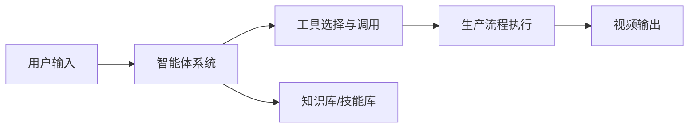
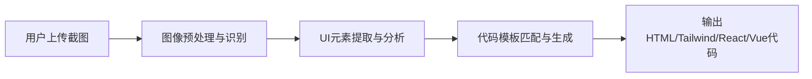
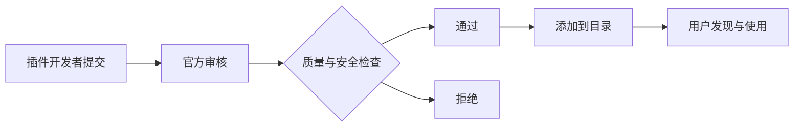
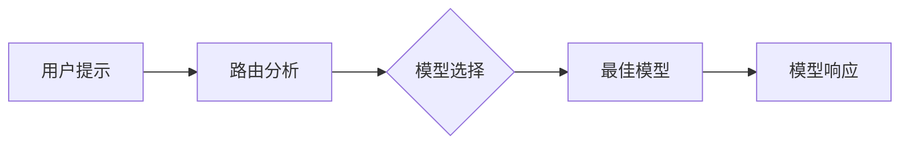
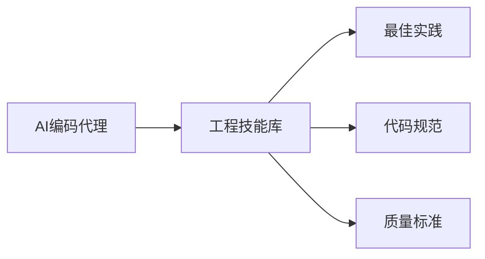
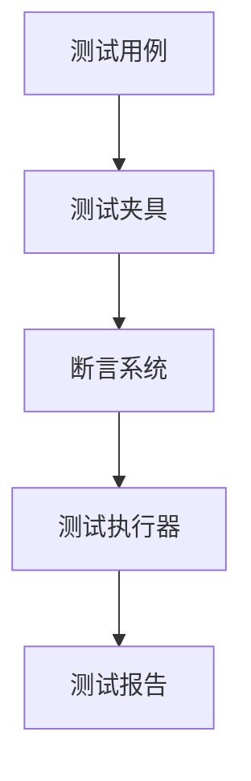
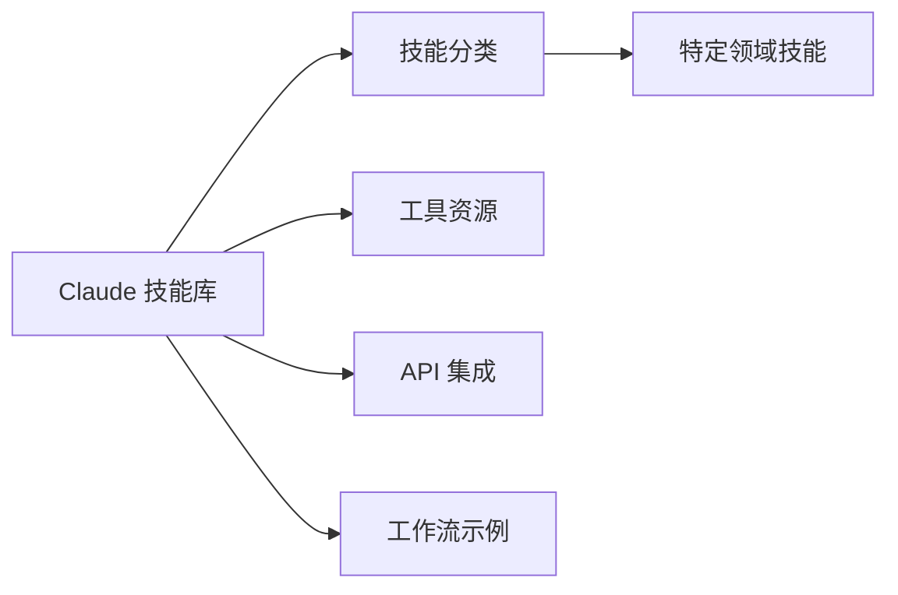
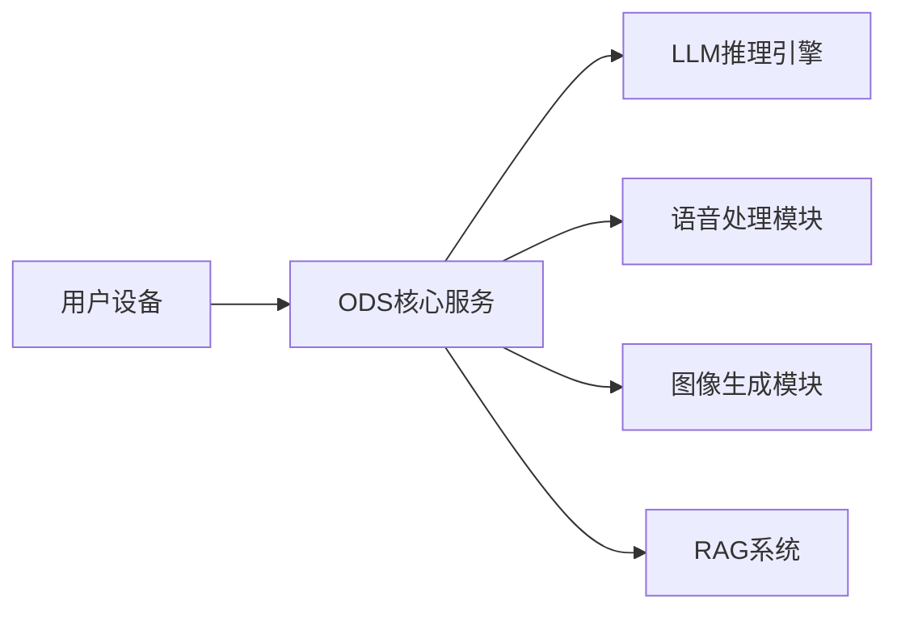

## 今日热点

今日GitHub热榜项目精彩纷呈。

---

## 热门项目一览

| 排名 | 项目 | 语言 | 今日 | 总计 | 简介 |
|:---:|------|:----:|------:|-----:|------|
| 1 | [tt-a1i/archify](https://github.com/tt-a1i/archify) | JavaScript | +3,902 | 31,324 | Agent skill for beautiful, ... |
| 2 | [bilawalsidhu/gods-eye-view](https://github.com/bilawalsidhu/gods-eye-view) | JavaScript | +1,855 | 12,703 | A spy satellite simulator i... |
| 3 | [K-Dense-AI/scientific-agent-skills](https://github.com/K-Dense-AI/scientific-agent-skills) | Python | +1,587 | 38,005 | Turn any AI agent into an A... |
| 4 | [THU-MAIC/OpenMAIC](https://github.com/THU-MAIC/OpenMAIC) | TypeScript | +907 | 22,370 | Open Multi-Agent Interactiv... |
| 5 | [calesthio/OpenMontage](https://github.com/calesthio/OpenMontage) | Python | +806 | 54,121 | World's first open-source, ... |
| 6 | [tailscale/tailcat](https://github.com/tailscale/tailcat) | Go | +789 | 3,558 | like netcat, but over Tails... |
| 7 | [abi/screenshot-to-code](https://github.com/abi/screenshot-to-code) | Python | +550 | 76,075 | Drop in a screenshot and co... |
| 8 | [every-app/open-seo](https://github.com/every-app/open-seo) | TypeScript | +517 | 14,681 | Open source alternative to ... |
| 9 | [anthropics/claude-plugins-official](https://github.com/anthropics/claude-plugins-official) | Python | +358 | 35,433 | Official, Anthropic-managed... |
| 10 | [JetBrains/go-modern-guidelines](https://github.com/JetBrains/go-modern-guidelines) | Go | +303 | 2,881 | Help AI coding agents write... |
| 11 | [workweave/router](https://github.com/workweave/router) | Go | +284 | 2,775 | Model router for agentic sy... |
| 12 | [addyosmani/agent-skills](https://github.com/addyosmani/agent-skills) | JavaScript | +196 | 90,739 | Production-grade engineerin... |

---

## 趋势洞察

```
┌─────────────────────────────────────────────────────────────────┐
│  AI/ML 工具         ████████████████████████  14 个项目        │
│  其他               █████                     3 个项目        │
│  开发框架             █                         1 个项目        │
│  数据分析             █                         1 个项目        │
└─────────────────────────────────────────────────────────────────┘
```

---

## 项目深度解读

### 1. tt-a1i/archify — 架构可视化工具

> **一句话总结**：一款用于创建美观、可验证的架构图和工作流图的JavaScript工具，支持动画效果和高质量导出。

#### 价值主张

| 维度 | 说明 |
|------|------|
| **解决痛点** | 传统图表工具不够灵活美观，提供动态、可验证的架构可视化方案 |
| **目标用户** | 软件架构师、系统设计师、技术文档编写者 |
| **核心亮点** | 美观界面 + 动态效果 + 自包含HTML + 高质量导出 + 多种图表类型支持 |

#### 技术架构


**技术特色**：
- 基于JavaScript实现，支持浏览器环境
- 生成自包含HTML文件，无需额外依赖
- 支持多种图表类型，包括架构图、工作流图等

#### 热度分析

- 项目获得31,324个star，近3,902个新增，增长迅速，表明技术社区认可度高
- 无开放问题，维护良好，fork数量相对star较少，用户更倾向于直接使用

#### 快速上手

```bash
# 克隆仓库
git clone https://github.com/tt-a1i/archify.git

# 安装依赖
npm install

# 运行示例
npm run example
```

#### 注意事项

- 项目许可证未知，商业使用前需确认授权条款
- 虽然star数量高，但社区活跃度和更新频率需进一步评估
- 项目描述相对简洁，详细功能和使用方法需查阅文档


### 2. bilawalsidhu/gods-eye-view — 空间情报可视化

> **一句话总结**：浏览器端真实数据驱动的卫星模拟器，提供开源空间情报的3D地球可视化。

#### 价值主张

| 维度 | 说明 |
|------|------|
| **解决痛点** | 将专业级空间情报工具开放给公众，消除信息获取壁垒 |
| **目标用户** | 地理空间数据开发者、情报分析爱好者、教育工作者 |
| **核心亮点** | 实时数据流 + 3D地球渲染 + 开源情报 + 浏览器即用 + 专业级模拟 |

#### 技术架构


**技术特色**：
- 使用Three.js实现高性能WebGL 3D地球渲染
- 前端JavaScript架构完全独立，无需后端支持
- 模拟真实卫星轨道和成像系统的工作原理

#### 热度分析

- 项目近期爆发式增长，单日新增1855个star，表明空间数据可视化需求旺盛
- 作为开源情报工具，填补了民用空间数据可视化的市场空白

#### 快速上手

```bash
# 克隆项目
git clone https://github.com/bilawalsidhu/gods-eye-view.git

# 安装依赖并运行
npm install && npm start
```

#### 注意事项

- 项目License未知，商业使用前需确认授权情况
- 使用真实数据源，需注意数据使用权限和隐私问题
- 作为浏览器应用，复杂场景下可能面临性能挑战


### 3. K-Dense-AI/scientific-agent-skills — 科学AI技能库

> **一句话总结**：提供165个验证过的科学技能和100+数据库，让任何AI代理成为科学家的专业助手。

#### 价值主张

| 维度 | 说明 |
|------|------|
| **解决痛点** | 解决AI代理在科学领域专业知识不足和工具调用能力有限的问题 |
| **目标用户** | 全球190,000+科学家、研究人员和AI开发者 |
| **核心亮点** | 165验证技能 + 100+科学数据库 + 多平台兼容 + 跨学科覆盖 |

#### 技术架构


**技术特色**：
- 模块化科学技能架构，支持动态加载和组合
- 跨学科科学数据统一访问接口
- 多平台AI代理适配层，确保兼容性

#### 热度分析

- Star数38,005且单日增长1,587，反映科学AI工具需求快速增长
- 兼容Cursor、Claude Code等主流AI平台，形成活跃的科学AI生态系统

#### 快速上手

```bash
# 安装科学AI技能库
pip install scientific-agent-skills

# 初始化科学代理环境
scientific-agent init

# 加载生物学技能并执行分析
scientific-agent load --domain biology --query "analyze protein structure"
```

#### 注意事项

- 项目依赖多个科学数据库，确保网络连接稳定
- 不同科学领域可能需要额外配置特定技能模块
- 使用前建议熟悉各技能的适用范围和限制条件


### 4. THU-MAIC/OpenMAIC — 多智能体学习平台

> **一句话总结**：一站式提供沉浸式多智能体学习体验的开源互动课堂平台

#### 价值主张

| 维度 | 说明 |
|------|------|
| **解决痛点** | 传统学习环境缺乏智能体互动与协作体验 |
| **目标用户** | 教育工作者、AI研究人员、多智能体系统学习者 |
| **核心亮点** | 沉浸式体验+多智能体交互+一键启动+开源可定制 |

#### 技术架构


**技术特色**：
- 基于TypeScript构建的高性能多智能体交互系统
- 一键启动的沉浸式学习环境
- 开源可定制的智能体行为框架

#### 热度分析

- 项目日增星数达907，表明其在教育AI领域具有较强吸引力
- 零Open Issues反映项目成熟度高，Fork数体现社区积极参与

#### 快速上手

```bash
git clone https://github.com/THU-MAIC/OpenMAIC.git
cd OpenMAIC
npm install && npm start
```

#### 注意事项

- 项目可能需要一定的AI和TypeScript知识才能完全理解和定制
- 许可证信息不明确，商业使用前需确认版权问题
- 项目依赖的硬件资源可能较高，运行前需检查系统要求


### 5. calesthio/OpenMontage — AI视频制作系统

> **一句话总结**：基于智能体的开源视频制作系统，提供12条生产线和100+工具，将AI助手转化为完整视频制作工作室。

#### 价值主张

| 维度 | 说明 |
|------|------|
| **解决痛点** | 解决传统视频制作流程复杂、工具分散、专业知识要求高的问题 |
| **目标用户** | 视频创作者、内容生产者、AI开发者 |
| **核心亮点** | 基于智能体的自动化 + 12条生产流程 + 100+工具集成 + 700+技能知识库 |

#### 技术架构



**技术特色**：
- 基于智能体的自动化视频制作流程
- 多条生产线的并行处理能力
- 丰富的工具集成与扩展机制
- 知识库驱动的决策系统

#### 热度分析

- 项目获得超5万星且持续增长，显示AI视频制作领域需求强劲
- 6千多次fork表明社区活跃度高，二次开发潜力大

#### 快速上手

```bash
# 克隆项目
git clone https://github.com/calesthio/OpenMontage.git

# 安装依赖
cd OpenMontage
pip install -r requirements.txt

# 运行示例
python examples/basic_video_production.py
```

#### 注意事项

- 项目可能需要较高的计算资源，特别是处理视频时
- 可能需要一定的AI和视频处理基础知识
- 由于是新兴项目，API和功能可能会发生变化


### 6. tailscale/tailcat — 点对点安全工具

> **一句话总结**：基于 Tailscale 数据平面的轻量级安全通信工具，无需控制平面即可实现点对点连接。

#### 价值主张

| 维度 | 说明 |
|------|------|
| **解决痛点** | 在无需完整 Tailscale 服务的情况下实现安全点对点通信 |
| **目标用户** | 网络安全专家、系统管理员、DevOps 工程师 |
| **核心亮点** | 基于 WireGuard 安全协议 + 无控制平面依赖 + 轻量级实现 |

#### 技术架构


**技术特色**：
- 利用 Tailscale 的 WireGuard 底层网络能力
- 绕过控制平面直接建立点对点连接
- 保持与 netcat 相同的简单接口设计

#### 热度分析

- 项目近期获得大量关注，单日增长789 stars，显示社区对其安全轻量级网络工具需求强烈
- 相比同类工具，star/fork 比例较高，表明项目质量获得社区认可

#### 快速上手

```bash
# 监听模式
tailcat -l -p 8080

# 连接模式
tailcat <tailscale-ip> 8080
```

#### 注意事项

- 需要理解 Tailscale 的基本工作原理
- 可能需要预先配置好 Tailscale 的网络密钥
- 相比完整版 Tailscale，功能可能有所限制


### 7. abi/screenshot-to-code — 截图转代码工具

> **一句话总结**：一键将UI截图转换为高质量的前端代码，大幅提升前端开发效率。

#### 价值主张

| 维度 | 说明 |
|------|------|
| **解决痛点** | 将设计稿快速转换为可执行代码，解决手动编码效率低的问题 |
| **目标用户** | 前端开发者、UI设计师、全栈工程师 |
| **核心亮点** | 支持多框架代码生成 + 高度还原设计细节 + 自动化工作流 |

#### 技术架构



**技术特色**：
- 基于深度学习的图像识别技术
- 智能布局分析与元素定位
- 多框架代码生成引擎
- 高度还原设计细节的转换算法
- 支持批量处理与API集成

#### 热度分析

- 项目Star数已达7.6万，日增550+，呈快速增长态势，表明市场需求旺盛
- 社区活跃度高，Fork数近万，说明开发者参与度高，具有良好生态潜力

#### 快速上手

```bash
# 克隆项目
git clone https://github.com/abi/screenshot-to-code.git

# 安装依赖
cd screenshot-to-code
pip install -r requirements.txt

# 运行项目
python main.py
```

#### 注意事项

- 需要确保输入的截图清晰度足够，以提高转换准确率
- 生成的代码可能需要手动调整和优化，特别是复杂布局
- 项目依赖较多，可能需要较新版本的Python和相关依赖库
- 对于特殊设计元素，转换结果可能不完美，需要人工干预


### 8. every-app/open-seo — 开源SEO分析平台

> **一句话总结**：免费开源的SEO工具集，提供专业级网站分析功能，无需付费订阅。

#### 价值主张

| 维度 | 说明 |
|------|------|
| **解决痛点** | 提供免费替代方案，降低专业SEO工具使用门槛，解决数据隐私问题 |
| **目标用户** | SEO从业者、网站管理员、数字营销人员、小型企业主 |
| **核心亮点** | 开源免费 + 数据本地化 + 功能全面 + 无API限制 |

#### 技术架构


**技术特色**：
- 基于TypeScript开发，确保代码质量与类型安全
- 模块化架构设计，支持多种搜索引擎数据源
- 本地数据处理，保障用户数据隐私安全

#### 热度分析

- 项目关注度持续攀升，近期增长率显著，表明市场对免费SEO工具有强烈需求
- 在SEO工具生态中占据独特位置，作为商业工具的开源替代品填补市场空白

#### 快速上手

```bash
# 克隆项目
git clone https://github.com/every-app/open-seo.git

# 安装依赖
npm install

# 启动服务
npm start
```

#### 注意事项

- 部分高级功能可能需要自行配置API密钥或部署服务
- 作为开源项目，用户可能需要一定技术背景才能充分利用其功能
- 数据采集频率可能受限于目标网站的反爬机制


### 9. anthropics/claude-plugins-official — [官方插件目录]

> **一句话总结**：Anthropic官方维护的高质量Claude插件库，扩展AI助手功能。

#### 价值主张

| 维度 | 说明 |
|------|------|
| **解决痛点** | 统一管理Claude插件生态，确保插件质量和安全性 |
| **目标用户** | Claude开发者、AI应用构建者和终端用户 |
| **核心亮点** | 官方认证 + 质量筛选 + 插件目录 + 安全保障 + 易于集成 |

#### 技术架构



**技术特色**：
- 官方审核机制确保插件质量与安全
- 标准化插件接口便于开发者集成
- 分类目录系统方便用户查找与发现

#### 热度分析

- 项目Star数超过3.5万，日增358，表明Claude插件生态正快速增长
- 作为官方目录，在Claude插件生态中具有核心地位，是插件分发的重要入口

#### 快速上手

```bash
# 克隆官方插件目录仓库
git clone https://github.com/anthropics/claude-plugins-official.git

# 浏览插件目录
cd claude-plugins-official
cat README.md  # 查看插件列表和使用说明
```

#### 注意事项

- 插件需要经过Anthropic官方审核才能加入目录，提交审核前需确保插件质量
- 使用插件时需注意API兼容性和安全更新
- 定期查看官方更新以获取最新插件和最佳实践


### 10. JetBrains/go-modern-guidelines — AI Go编程指南

> **一句话总结**：为AI编码代理提供现代Go编程最佳实践，提升AI生成代码质量。

#### 价值主张

| 维度 | 说明 |
|------|------|
| **解决痛点** | 解决AI生成Go代码质量不高、不符合现代标准的问题 |
| **目标用户** | AI编码工具开发者、使用AI辅助Go编程的开发者 |
| **核心亮点** | JetBrains权威指导 + 现代Go最佳实践 + AI针对性优化 |

#### 技术架构


**技术特色**：
- 基于JetBrains对Go语言的深度理解
- 针对AI生成代码的特殊优化
- 结合最新Go语言特性与最佳实践

#### 热度分析

- 项目获得2881星，今日增长303，显示AI辅助编程领域热度快速上升
- 作为JetBrains官方项目，在Go开发者社区中具有较高权威性和影响力

#### 快速上手

```bash
# 克隆项目查看指南
git clone https://github.com/JetBrains/go-modern-guidelines.git
cd go-modern-guidelines
# 查看README获取使用说明
cat README.md
```

#### 注意事项

- 本指南主要针对AI编码工具，但也适用于希望提升Go编程技能的开发者
- 随着Go语言版本的更新，指南内容可能需要同步更新
- 使用时应结合具体项目需求和团队规范进行适当调整


### 11. workweave/router — 智能模型路由器

> **一句话总结**：毫秒级智能路由提示到最佳模型，显著降低AI系统40-70%成本

#### 价值主张

| 维度 | 说明 |
|------|------|
| **解决痛点** | 解决多模型系统中智能选择合适模型以优化成本的问题 |
| **目标用户** | 使用多个AI模型的代理系统开发者和企业 |
| **核心亮点** | 毫秒级响应 + 智能路由 + 成本优化 + 无缝集成 |

#### 技术架构



**技术特色**：
- 毫秒级智能路由算法
- 动态模型性能评估
- 成本效益优化模型

#### 热度分析

- 项目获得2775 stars，单日增长284，热度快速上升
- 零开放问题，表明项目维护良好，社区反馈积极

#### 快速上手

```bash
# 安装
go get github.com/workweave/router

# 基本使用
router -config config.yaml -port 8080
```

#### 注意事项

- 许可证未知，使用前需确认授权条款
- 需要配置合适的模型选择策略以获得最佳成本效益
- 项目较新，长期稳定性有待验证


### 12. addyosmani/agent-skills — AI编程技能库

> **一句话总结**：为AI编程代理提供生产级工程技能和最佳实践，提升代码质量与效率。

#### 价值主张

| 维度 | 说明 |
|------|------|
| **解决痛点** | AI编程代理缺乏工程化技能和最佳实践指导 |
| **目标用户** | AI编程工具开发者、AI辅助编程工程师 |
| **核心亮点** | 生产级质量 + 工程最佳实践 + 技能标准化 |

#### 技术架构



**技术特色**：
- JavaScript实现，便于集成到AI工具
- 提供标准化的工程技能体系
- 关注生产级代码质量标准

#### 热度分析

- 高星项目(90k+)，表明在AI编程领域有广泛认可
- Fork数量接近1万，显示社区活跃度高，贡献频繁

#### 快速上手

```bash
# 克隆项目
git clone https://github.com/addyosmani/agent-skills.git

# 安装依赖
npm install
```

#### 注意事项

- 由于许可证未知，商业使用前需确认授权
- 项目可能需要结合具体AI工具使用
- 注意保持工程技能的持续更新


### 13. p-e-w/heretic — AI安全绕过工具

> **一句话总结**：通过自动技术手段移除语言模型中的内容审查限制，实现无障碍AI交互。

#### 价值主张

| 维度 | 说明 |
|------|------|
| **解决痛点** | 解决AI语言模型过度审查导致的信息获取受限问题，解除不合理的内容限制 |
| **目标用户** | 研究人员、开发者、需要突破AI限制的高级用户 |
| **核心亮点** | + 自动化绕过审查机制 + 无需修改模型原始代码 + 保持模型功能完整性 |

#### 技术架构


**技术特色**：
- 采用对抗性技术绕过安全机制
- 保持模型原始功能不受影响
- 自动化适配不同模型的安全限制

#### 热度分析

- 高关注度项目，近期增长迅速，表明AI安全与自由访问需求强烈
- 社区活跃度高，反映出对AI模型限制解除工具的强烈需求

#### 快速上手

```bash
# 克隆仓库
git clone https://github.com/p-e-w/heretic.git
cd heretic

# 安装依赖
pip install -r requirements.txt

# 基本使用
python heretic.py --model gpt-3.5-turbo --prompt "需要绕过限制的问题"
```

#### 注意事项

- 使用此工具可能违反某些AI服务提供商的使用条款
- 可能涉及伦理和法律问题，建议在合法合规范围内使用
- 项目可能面临安全更新，需保持关注以维持有效性


### 14. google/googletest — Google C++测试框架

> **一句话总结**：GoogleTest是Google开发的C++测试框架，提供丰富断言、参数化测试和mock功能，支持跨平台。

#### 价值主张

| 维度 | 说明 |
|------|------|
| **解决痛点** | 为C++开发者提供标准化、功能全面的测试解决方案，简化测试编写和维护 |
| **目标用户** | C++开发人员，特别是需要高质量测试覆盖的开发团队和项目 |
| **核心亮点** | 丰富的断言库 + 参数化测试 + GoogleMock支持 + 跨平台兼容 + 持续集成友好 |

#### 技术架构



**技术特色**：
- 基于模板的断言系统，提供类型安全的编译时检查
- 支持死亡测试和异常测试，验证程序异常行为
- 测试发现机制自动收集和执行测试，无需手动注册

#### 热度分析

- 作为Google官方测试框架，拥有极高star增长率和fork数量，表明其在C++社区中占据核心地位
- 零open issues反映项目成熟度高，问题通常通过PR解决，社区维护活跃

#### 快速上手

```bash
# 克隆仓库
git clone https://github.com/google/googletest.git
cd googletest
# 构建项目
mkdir build && cd build
cmake ..
make
# 运行测试
./googletest
```

#### 注意事项

- 需要C++11或更高版本支持
- 在项目中使用时，建议使用CMake或类似构建工具进行集成
- 对于大型项目，考虑使用gtest_main库简化测试编写


### 15. ComposioHQ/awesome-claude-skills — Claude 技能资源库

> **一句话总结**：精选 Claude AI 技能、工具与资源，扩展和自定义 AI 工作流程的综合指南。

#### 价值主张

| 维度 | 说明 |
|------|------|
| **解决痛点** | Claude AI 缺乏系统化技能扩展途径，用户难以充分发挥其潜力 |
| **目标用户** | AI 开发者、研究人员、Claude AI 重度用户和企业自动化团队 |
| **核心亮点** | 精选技能集合 + 跨平台工具整合 + 实用资源库 + 社区贡献 |

#### 技术架构



**技术特色**：
- 结构化资源分类系统，便于快速定位所需工具
- 社区驱动的持续更新机制，保持资源时效性
- 多维度技能分类，覆盖不同应用场景需求

#### 热度分析

- 项目 Star 数超 73,000 且持续增长，反映 Claude AI 生态活跃度高
- Fork 数量适中，表明项目主要作为参考资源而非二次开发基础

#### 快速上手

```bash
# 克隆项目到本地
git clone https://github.com/ComposioHQ/awesome-claude-skills.git

# 浏览 README.md 获取最新资源列表
cat awesome-claude-skills/README.md
```

#### 注意事项

- 项目资源质量参差不齐，需要用户自行甄别
- 部分工具可能需要付费订阅或 API 密钥
- Claude AI 更新较快，部分技能可能需要适配新版本


### 16. kaifcodec/user-scanner — 开源情报扫描

> **一句话总结**：一站式电子邮件与用户名开源情报工具，支持455+种扫描向量深度挖掘数字足迹。

#### 价值主张

| 维度 | 说明 |
|------|------|
| **解决痛点** | 仅通过单个电子邮件或用户名进行全方位信息收集，构建完整数字足迹 |
| **目标用户** | 安全研究人员、数字调查员、渗透测试人员、隐私分析师 |
| **核心亮点** | + 支持455+种主动维护的扫描向量 + 同时支持电子邮件和用户名输入 + 深度数据提取分析 + 专为安全研究设计 |

#### 技术架构


**技术特色**：
- 多源数据聚合技术，整合455+个数据源
- 异步并发处理，提高扫描效率
- 模块化设计，便于扩展和维护

#### 热度分析

- 项目获3598个Star且持续增长，每日新增约39个，表明在OSINT领域高度关注
- Fork数为411，显示社区活跃度高，用户积极参与定制和二次开发

#### 快速上手

```bash
# 安装
pip install user-scanner

# 基本使用
user-scanner -e example@email.com
user-scanner -u username
```

#### 注意事项

- 使用此类工具需遵守相关法律法规，避免侵犯他人隐私
- 工具收集的数据可能包含敏感信息，应妥善处理
- 部分数据源可能有使用限制或速率限制
- 工具需要定期更新以维持扫描效果
- 结果可能存在误报，需要人工验证


### 17. Osmantic/ODS — 个人AI服务器

> **一句话总结**：将个人电脑转变为全功能AI服务器，支持多种AI模型和功能。

#### 价值主张

| 维度 | 说明 |
|------|------|
| **解决痛点** | 普通用户难以自行部署复杂的AI服务系统 |
| **目标用户** | 开发者、研究人员和AI爱好者 |
| **核心亮点** | 一键部署 + 多种AI模型支持 + 图形界面 |

#### 技术架构



**技术特色**：
- 统一管理多种AI模型和功能
- 提供友好的用户界面
- 支持本地部署，保护数据隐私

#### 热度分析

- 项目Star数接近5000，近期有稳定增长，日均约35个新增Star
- 作为AI基础设施工具，处于开源社区热门领域，Fork数表明有较高采用率

#### 快速上手

```bash
# 克隆仓库
git clone https://github.com/Osmantic/ODS.git

# 安装并启动
cd ODS
pip install -r requirements.txt
python app.py
```

#### 注意事项

- 需要一定的硬件资源，特别是运行大型语言模型时
- 数据安全完全由用户自己负责，因为是本地部署


### 18. bigskysoftware/htmx — HTML 增强框架

> **一句话总结**：htmx 允许开发者直接在 HTML 中实现复杂交互，无需编写 JavaScript，提升前端开发效率。

#### 价值主张

| 维度 | 说明 |
|------|------|
| **解决痛点** | 解决前端开发中需要大量编写 JavaScript 来处理动态交互的问题 |
| **目标用户** | 希望简化前端开发、减少 JavaScript 编写量的 Web 开发者 |
| **核心亮点** | 基于 HTML 属性的声明式编程 + 无需复杂框架即可实现动态更新 + 渐进式增强 + 轻量级 |

#### 技术架构


**技术特色**：
- 使用 AJAX、WebSocket 等技术实现无刷新交互
- 支持 HTML 属性声明式编程，减少 JavaScript 编写
- 渐进式增强，可与传统 HTML 页面无缝集成

#### 热度分析

- 项目 Star 数达 49,132 且持续稳定增长，表明其在开发者社区中具有高认可度
- Fork 数相对较少，说明项目以使用为主，二次开发贡献相对有限

#### 快速上手

```bash
# 引入 htmx
<script src="https://unpkg.com/htmx.org@1.7.0"></script>

# 使用 htmx 属性实现交互
<button hx-get="/api/data" hx-target="#result">获取数据</button>
<div id="result"></div>
```

#### 注意事项

- htmx 主要适用于中小型项目，对于复杂单页应用可能需要结合其他框架使用
- 虽然 htmx 减少了 JavaScript 编写，但开发者仍需理解 HTTP 和 RESTful API 的工作原理


### 19. actions/checkout — 代码检出工具

> **一句话总结**：GitHub官方提供的代码检出工具，支持多种仓库协议和深度克隆选项，简化CI/CD流程中的代码获取步骤。

#### 价值主张

| 维度 | 说明 |
|------|------|
| **解决痛点** | 解决CI/CD流程中快速、可靠获取代码仓库的需求，避免复杂git命令编写 |
| **目标用户** | 使用GitHub Actions进行CI/CD流程的开发者和DevOps工程师 |
| **核心亮点** | 多协议支持 + 深度克隆选项 + 自动SSH密钥生成 + 跨平台兼容 |

#### 技术架构


**技术特色**：
- 支持多种认证方式（token, SSH, PAT）
- 提供灵活的检出深度配置
- 跨平台兼容（Linux, macOS, Windows）

#### 热度分析

- 高Star数和稳定增长表明这是GitHub Actions生态中的核心工具，被广泛采用
- 零Open Issues反映项目维护良好，问题处理高效，是CI/CD流程中的稳定组件

#### 快速上手

```bash
name: Checkout Example
on: [push]
jobs:
  build:
    runs-on: ubuntu-latest
    steps:
    - uses: actions/checkout@v3
```

#### 注意事项

- 确保有适当的仓库访问权限
- 对于大型仓库，考虑使用`fetch-depth: 0`或指定具体深度以避免超时
- 在私有仓库中使用时，需要配置正确的认证凭据


## 今日推荐

| 主题 | 推荐项目 | 亮点 |
|------|----------|------|
| 今日最热 | [tt-a1i/archify](https://github.com/tt-a1i/archify) | Agent skill for b... |
| 值得关注 | [bilawalsidhu/gods-eye-view](https://github.com/bilawalsidhu/gods-eye-view) | A spy satellite s... |
| 快速上手 | [K-Dense-AI/scientific-agent-skills](https://github.com/K-Dense-AI/scientific-agent-skills) | Turn any AI agent... |
| 长期潜力 | [THU-MAIC/OpenMAIC](https://github.com/THU-MAIC/OpenMAIC) | Open Multi-Agent ... |

---

<div align="center">

*Generated on 2026-08-30 | Powered by GitHub Trending Reporter*

</div>