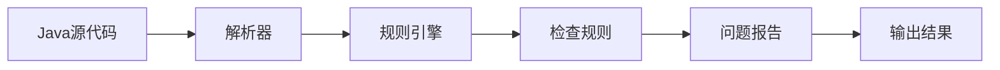
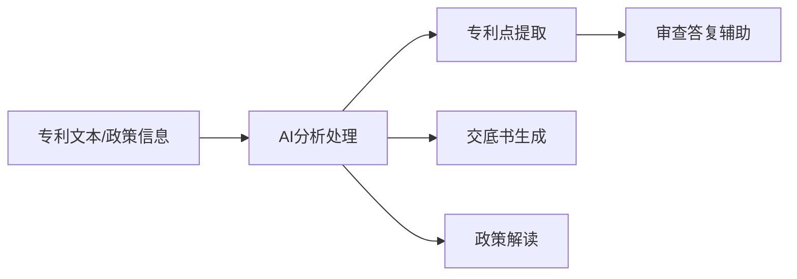
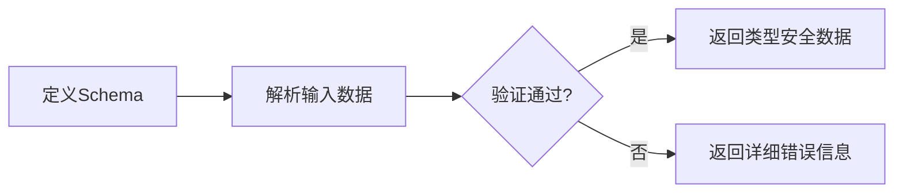

## 今日热点

今日GitHub热榜项目精彩纷呈。

---

## 热门项目一览

| 排名 | 项目 | 语言 | 今日 | 总计 | 简介 |
|:---:|------|:----:|------:|-----:|------|
| 1 | [tt-a1i/archify](https://github.com/tt-a1i/archify) | JavaScript | +3,722 | 35,027 | Agent skill for beautiful, ... |
| 2 | [THU-MAIC/OpenMAIC](https://github.com/THU-MAIC/OpenMAIC) | TypeScript | +1,370 | 24,319 | Open Multi-Agent Interactiv... |
| 3 | [K-Dense-AI/scientific-agent-skills](https://github.com/K-Dense-AI/scientific-agent-skills) | Python | +1,114 | 39,413 | Turn any AI agent into an A... |
| 4 | [tashfeenahmed/freellmapi](https://github.com/tashfeenahmed/freellmapi) | TypeScript | +504 | 22,859 | 7.4 billion tokens per mont... |
| 5 | [every-app/open-seo](https://github.com/every-app/open-seo) | TypeScript | +469 | 15,207 | Open source alternative to ... |
| 6 | [p-e-w/heretic](https://github.com/p-e-w/heretic) | Python | +369 | 29,219 | Fully automatic censorship ... |
| 7 | [Lakr233/vphone-cli](https://github.com/Lakr233/vphone-cli) | Swift | +361 | 9,686 | No description |
| 8 | [mvanhorn/last30days-skill](https://github.com/mvanhorn/last30days-skill) | Python | +230 | 60,535 | AI agent skill that researc... |
| 9 | [unclecode/crawl4ai](https://github.com/unclecode/crawl4ai) | Python | +221 | 80,281 | 🚀🤖 Crawl4AI: Open-source LL... |
| 10 | [NationalSecurityAgency/ghidra](https://github.com/NationalSecurityAgency/ghidra) | Java | +198 | 73,932 | Ghidra is a software revers... |
| 11 | [abhigyanpatwari/GitNexus](https://github.com/abhigyanpatwari/GitNexus) | TypeScript | +182 | 46,591 | GitNexus: The Zero-Server C... |
| 12 | [pollen-robotics/microduck_rl](https://github.com/pollen-robotics/microduck_rl) | Python | +168 | 820 | RL training environments fo... |

---

## 趋势洞察

```
┌─────────────────────────────────────────────────────────────────┐
│  AI/ML 工具         ████████████████████████  10 个项目        │
│  其他               ████████████              5 个项目        │
│  开发框架             ██                        1 个项目        │
│  媒体资源             ██                        1 个项目        │
│  项目管理             ██                        1 个项目        │
│  开发工具             ██                        1 个项目        │
└─────────────────────────────────────────────────────────────────┘
```

---

## 项目深度解读

### 1. tt-a1i/archify — 架构图生成器

> **一句话总结**：创建美观、可验证的架构图和工作流图，支持动画和高质量导出的自包含HTML工具。

#### 价值主张

| 维度 | 说明 |
|------|------|
| **解决痛点** | 传统架构图工具交互性差，难以动态展示复杂系统关系 |
| **目标用户** | 软件架构师、技术文档编写者、系统设计人员 |
| **核心亮点** | 自包含HTML输出 + 动画效果 + 多种图表类型支持 + 高质量导出 |

#### 技术架构

**技术特色**：
- 纯JavaScript实现，无需依赖外部框架
- 生成自包含的HTML文件，包含所有样式和脚本
- 支持多种图表类型的统一语法

#### 热度分析

- 项目Star数超过35k，单日增长3722，表明近期获得大量关注
- 零Open Issues反映项目成熟度高，维护良好

#### 快速上手

```bash
# 安装archify
npm install archify

# 创建架构图
archify create diagram.arch -o output.html

# 预览生成的HTML
open output.html
```

#### 注意事项

- 项目许可证未知，商业使用前需确认授权
- 虽然支持导出，但可能需要额外工具转换格式
- 依赖浏览器环境，无后端服务支持


### 2. THU-MAIC/OpenMAIC — 多智能体课堂系统

> **一句话总结**：提供沉浸式多智能体学习体验的开源课堂系统，一键部署AI教育环境。

#### 价值主张

| 维度 | 说明 |
|------|------|
| **解决痛点** | 传统教育中互动性不足，缺乏沉浸式多智能体学习环境 |
| **目标用户** | 教育工作者、AI研究人员、学习体验设计者 |
| **核心亮点** | 多智能体互动 + 沉浸式体验 + 一键部署 + 开源可定制 |

#### 技术架构


**技术特色**：
- TypeScript全栈开发，确保代码质量与可维护性
- 多智能体交互系统，模拟真实课堂环境与教学场景
- 模块化设计，支持自定义教学内容与交互流程

#### 热度分析

- 项目Star数激增，今日新增1,370个Star，显示社区高度关注与认可
- 作为清华大学的开源项目，在AI教育领域具有显著影响力与示范效应

#### 快速上手

```bash
# 克隆项目
git clone https://github.com/THU-MAIC/OpenMAIC.git

# 安装依赖
npm install

# 启动开发环境
npm run dev
```

#### 注意事项

- 项目许可证信息不明确，使用前需确认授权条款
- 可能需要一定的技术背景才能完全理解和定制项目功能


### 3. K-Dense-AI/scientific-agent-skills — 科学AI技能库

> **一句话总结**：为AI代理提供165个专业科学技能和100+科学数据库，赋能AI科学家。

#### 价值主张

| 维度 | 说明 |
|------|------|
| **解决痛点** | 为AI代理提供专业科学技能，解决复杂科学研究任务处理难题 |
| **目标用户** | 全球科学家、研究人员和AI开发者 |
| **核心亮点** | 165个验证技能 + 100+科学数据库 + 多平台兼容性 |

#### 技术架构


**技术特色**：
- 多学科科学技能集成系统
- 与主流AI平台无缝兼容
- 大型科学数据库网络支持

#### 热度分析

- 项目星标近4万，近期增长迅猛，显示科学AI领域高度活跃
- 作为科学AI技能库，在全球科研社区具有显著影响力

#### 快速上手

```bash
# 安装库
pip install scientific-agent-skills

# 基本使用
from scientific_agent import ScientistAgent
agent = ScientistAgent()
agent.execute_skill("protein_analysis")
```

#### 注意事项
- 项目许可证信息不明确，使用前需确认许可条款
- 部分科学数据库可能需要额外申请访问权限


### 4. tashfeenahmed/freellmapi — 免费LLM聚合

> **一句话总结**：聚合34个LLM提供商和635个模型端点，提供统一接口和智能路由，每月74亿token免费额度。

#### 价值主张

| 维度 | 说明 |
|------|------|
| **解决痛点** | 个人开发者低成本访问多种LLM API，避免高额商业费用 |
| **目标用户** | 需要实验多种LLM模型的开发者和研究人员 |
| **核心亮点** | 统一OpenAI兼容接口 + 智能路由 + 自动故障转移 + 加密密钥管理 |

#### 技术架构


**技术特色**：
- 聚合多源LLM API，统一接口标准
- 实现智能路由和故障转移机制
- 提供加密的API密钥管理方案

#### 热度分析
- 项目Star数超2.2万且每日新增500+，呈现快速增长趋势
- 0个开放Issues，表明项目问题处理良好或反馈渠道非公开

#### 快速上手

```bash
# 克隆仓库
git clone https://github.com/tashfeenahmed/freellmapi.git
cd freellmapi

# 使用Docker运行
docker-compose up -d
```

#### 注意事项
- 项目仅限个人实验使用，不推荐商业用途
- 免费LLM提供商服务可能随时变更，影响API稳定性
- 使用前需了解各提供商的使用限制和条款


### 5. every-app/open-seo — 开源SEO工具

> **一句话总结**：开源全能SEO分析平台，提供与商业工具相当的关键词研究、竞争对手分析等功能

#### 价值主张

| 维度 | 说明 |
|------|------|
| **解决痛点** | 提供免费替代商业SEO工具，降低中小企业数字营销成本 |
| **目标用户** | SEO专家、数字营销人员、网站管理员、小型企业 |
| **核心亮点** | 开源免费+全面功能+数据可视化+API支持+社区驱动 |

#### 技术架构


**技术特色**：
- 基于TypeScript的全栈开发，确保类型安全
- 模块化设计，便于扩展和维护
- 支持多种搜索引擎API集成

#### 热度分析

- 项目Star数高达15,207且持续增长(+469 today)，表明SEO工具市场需求强烈
- Fork数1,821显示社区活跃度高，用户参与度高

#### 快速上手

```bash
# 克隆项目
git clone https://github.com/every-app/open-seo.git
# 安装依赖
npm install
# 启动服务
npm start
```

#### 注意事项

- 项目许可证未知，商业使用前需确认
- 可能需要API密钥才能访问某些数据源
- 功能可能不如商业工具全面，社区贡献是发展关键


### 6. p-e-w/heretic — AI审查突破工具

> **一句话总结**：自动移除语言模型中的内容审查限制，释放AI完整表达能力。

#### 价值主张

| 维度 | 说明 |
|------|------|
| **解决痛点** | 打破语言模型的内容审查限制，实现无障碍AI交互 |
| **目标用户** | AI研究人员、开发者、需要突破内容限制的用户 |
| **核心亮点** | 完全自动化 + 无需修改模型 + 保持功能完整性 |

#### 技术架构


**技术特色**：
- 提示注入技术绕过安全机制
- 保持模型原有功能不受影响
- 自动化处理无需人工干预

#### 热度分析

- 项目获得近3万星，近期增长迅速，表明市场需求强烈
- 零开放问题，可能意味着项目成熟或社区讨论转移到其他渠道

#### 快速上手

```bash
# 安装项目
pip install heretic

# 基本使用
python -m heretic "你的提示内容"
```

#### 注意事项

- 使用此工具可能违反某些AI平台的服务条款
- 生成内容可能包含不适当或有害信息
- 仅用于研究和教育目的，不应用于恶意用途


### 7. Lakr233/vphone-cli — 虚拟电话控制台

> **一句话总结**：Swift编写的命令行工具，提供虚拟电话功能，无需真实硬件即可模拟通话体验。

#### 价值主张

| 维度 | 说明 |
|------|------|
| **解决痛点** | 提供无需物理设备的虚拟电话解决方案，适用于开发测试和演示场景 |
| **目标用户** | 开发者、测试人员、演示者，需要模拟通话场景的用户 |
| **核心亮点** | 跨平台支持 + 纯Swift实现 + 命令行控制 + 无需真实设备 + 轻量级 |

#### 技术架构


**技术特色**：
- 利用Swift的强大性能构建轻量级虚拟电话系统
- 通过命令行参数实现灵活的通话模拟控制
- 无需外部依赖，纯Swift实现保证跨平台兼容性

#### 热度分析

- Star数近万且持续增长，表明项目获得开发者广泛认可
- 高关注度显示在通讯开发领域有独特价值，填补了模拟工具空白

#### 快速上手

```bash
# 安装依赖
swift build
# 运行虚拟电话
./.build/vphone-cli --call +123456789
# 查看帮助
./.build/vphone-cli --help
```

#### 注意事项

- 需要Swift环境支持
- 仅限模拟通话，不能进行真实通话
- 可能需要额外配置音频输入输出设备


### 8. mvanhorn/last30days-skill — AI研究助手

> **一句话总结**：跨平台AI研究工具，自动搜集多源信息并生成综合摘要

#### 价值主张

| 维度 | 说明 |
|------|------|
| **解决痛点** | 信息过载时代，难以快速获取多平台全面且可靠的信息汇总 |
| **目标用户** | 研究人员、内容创作者、投资者和需要快速了解任何主题的人 |
| **核心亮点** | 多平台数据整合 + AI智能分析 + 事实核查 + 自动化研究流程 + 结构化输出 |

#### 技术架构


**技术特色**：
- 多源数据整合技术，支持Reddit、X、YouTube等平台API
- 大型语言模型驱动的信息提炼与事实核查
- 智能权重分配算法，确保信息来源可靠性

#### 热度分析

- 项目获得超过6万星，近期增长迅速，日均增长约230星，表明用户需求旺盛
- 零开放问题显示项目维护良好，社区活跃度高，处于AI研究工具生态前沿位置

#### 快速上手

```bash
# 安装项目
pip install last30days-skill

# 使用示例
last30days-skill "AI最新发展" --output summary.txt
```

#### 注意事项

- 需要关注各平台API的使用限制和合规性要求
- AI生成内容可能存在偏见或错误，建议人工验证关键信息
- 项目可能需要OpenAI API密钥或其他LLM服务访问权限


### 9. unclecode/crawl4ai — LLM友好爬虫

> **一句话总结**：专为LLM设计的高效开源网页爬虫，支持智能数据提取与处理。

#### 价值主张

| 维度 | 说明 |
|------|------|
| **解决痛点** | 传统爬虫难以适配LLM数据需求，提供专门优化的数据获取解决方案 |
| **目标用户** | AI开发者、数据科学家、需要网页数据训练LLM的研究人员 |
| **核心亮点** | LLM友好数据格式 + 智能内容提取 + 高效并发处理 + 多种数据导出 |

#### 技术架构


**技术特色**：
- 针对大语言模型优化的数据提取流程
- 内置智能内容解析与清洗功能
- 支持分布式爬取提高效率

#### 热度分析

- 项目Star数超8万且持续稳定增长，表明在AI数据获取领域有显著影响力
- 虽然Issues为0，但Discord社区活跃，说明问题主要通过非正式渠道解决

#### 快速上手

```bash
# 安装
pip install crawl4ai

# 基本使用
from crawl4ai import WebCrawler
crawler = WebCrawler()
result = crawler.crawl("https://example.com")
print(result.llm_ready_content)
```

#### 注意事项

- 使用前请检查目标网站的robots.txt规则，确保合规爬取
- 避免高频请求导致目标服务器负担，建议设置合理的爬取间隔
- 处理反爬机制时需遵守相关法律法规，尊重网站使用条款


### 10. NationalSecurityAgency/ghidra — [逆向工程框架]

> **一句话总结**：NSA开源的专业级逆向工程平台，支持多架构反汇编与高级分析功能

#### 价值主张

| 维度 | 说明 |
|------|------|
| **解决痛点** | 提供强大的二进制代码分析能力，弥补商业逆向工具不足 |
| **目标用户** | 安全研究人员、逆向工程师、恶意软件分析师 |
| **核心亮点** | 跨平台支持 + 脚本扩展能力 + 可视化分析工具 + 高级反编译器 |

#### 技术架构


**技术特色**：
- 基于Java构建的跨平台逆向工程框架
- 支持多种处理器架构的反汇编与反编译
- 提供Python脚本接口实现自动化分析
- 包含丰富的数据可视化和交互式分析工具

#### 热度分析

- 作为NSA开源项目，持续稳定增长，表明安全领域对专业逆向工具的强烈需求
- 社区活跃度高，企业级应用广泛，已成为逆向工程领域的重要基础设施

#### 快速上手

```bash
# 下载Ghidra
wget https://github.com/NationalSecurityAgency/ghidra/releases/download/Ghidra_10.2_PUBLIC/Ghidra_10.2_PUBLIC_20230727.zip

# 解压并启动
unzip Ghidra_10.2_PUBLIC_20230727.zip
cd Ghidra/
./ghidraRun
```

#### 注意事项

- 初始学习曲线较陡，需要一定的逆向工程基础知识
- 大型二进制文件分析可能消耗大量系统资源
- 部分高级功能可能需要额外的插件或配置


### 11. abhigyanpatwari/GitNexus — [浏览器端代码图谱]

> **一句话总结**：零服务器代码智能引擎，在浏览器中构建交互式知识图谱，帮助开发者快速理解代码结构。

#### 价值主张

| 维度 | 说明 |
|------|------|
| **解决痛点** | 解决开发者难以快速理解和导航大型复杂代码库结构的痛点 |
| **目标用户** | 需要探索代码库的开发者、代码审查人员和架构师 |
| **核心亮点** | 完全客户端运行 + 多种代码源支持 + 交互式知识图谱 + 内置图RAG代理 |

#### 技术架构


**技术特色**：
- 纯客户端架构，无需后端服务器支持
- 使用WebAssembly实现高性能代码解析与处理
- 采用增量索引技术高效处理大型代码库

#### 热度分析

- 项目获得46,591个星标且持续增长182/天，表明其受到开发者社区高度认可
- 零未解决问题和5,128次Fork，反映项目维护良好且社区贡献活跃

#### 快速上手

```bash
# 克隆项目到本地
git clone https://github.com/abhigyanpatwari/GitNexus.git
cd GitNexus
npm install && npm run dev
```

#### 注意事项

- 由于完全在浏览器中运行，处理超大代码库时可能会影响性能
- 需要现代浏览器支持，可能不兼容旧版浏览器
- 所有数据处理均在客户端完成，确保代码隐私安全


### pollen-robotics/microduck_rl — 机器人RL训练平台

> **一句话总结**：为Microduck机器人提供标准化强化学习训练环境，简化控制算法开发流程。

#### 价值主张

| 维度 | 说明 |
|------|------|
| **解决痛点** | 简化机器人控制算法训练环境搭建，提供统一接口 |
| **目标用户** | 机器人研究人员、RL算法开发者、机器人控制工程师 |
| **核心亮点** | 硬件平台集成 + 标准化环境接口 + 多种算法支持 |

#### 技术架构


**技术特色**：
- 基于Python的轻量级RL框架
- 与硬件平台深度集成
- 提供标准化的OpenAI Gym接口

#### 热度分析

- 项目近期热度显著，单日新增168个Star，处于活跃发展阶段
- 社区参与度适中，Fork数量表明有一定二次开发需求

#### 快速上手

```bash
git clone https://github.com/pollen-robotics/microduck_rl.git
cd microduck_rl
pip install -r requirements.txt
python examples/basic_training.py
```

#### 注意事项

- 需要Microduck硬件平台才能完整体验项目功能
- 项目许可证未知，使用前需确认授权条款
- 虽然Open Issues为0，但建议关注项目更新和文档完善情况


### 13. livekit/agents — 实时语音AI框架

> **一句话总结**：LiveKit Agents是构建实时语音AI代理的强大框架，提供低延迟多模态交互能力。

#### 价值主张

| 维度 | 说明 |
|------|------|
| **解决痛点** | 简化实时语音AI代理开发流程，降低技术实现门槛 |
| **目标用户** | AI开发者、语音应用构建者、实时通信解决方案提供商 |
| **核心亮点** | 实时语音处理 + 多模态交互 + 易于集成扩展 |

#### 技术架构


**技术特色**：
- 基于WebRTC的低延迟实时通信技术
- 支持多种语音AI模型灵活集成
- 提供完整的语音交互工作流管理

#### 热度分析

- 项目Star数持续增长，日均增加约130颗星，社区活跃度高
- 作为实时语音AI领域的重要框架，在开发者社区中具有显著影响力

#### 快速上手

```bash
# 安装LiveKit Agents
pip install livekit-agents

# 创建基本语音AI代理示例
python -m livekit.agents.basic
```

#### 注意事项

- 需要配合LiveKit服务器使用，需部署或使用云服务
- 对网络延迟有一定要求，适合低延迟场景


### 14. corsairdev/corsair — 用户连接平台

> **一句话总结**：统一身份认证与应用连接平台，简化多应用访问流程，提升用户体验。

#### 价值主张

| 维度 | 说明 |
|------|------|
| **解决痛点** | 解决用户需要在多个应用间频繁登录和切换的痛点 |
| **目标用户** | 需要同时使用多个SaaS应用的企业和个人用户 |
| **核心亮点** | 统一身份认证 + 应用集成中心 + 单点登录 + 安全访问控制 |

#### 技术架构


**技术特色**：
- 基于TypeScript构建，确保类型安全和代码质量
- 采用模块化设计，支持多种应用集成
- 实现统一的身份验证和授权机制

#### 热度分析

- 项目获得超过1万星，且每日新增126星，表明项目正处于快速增长期
- Fork数量相对较少，说明项目可能主要作为服务使用而非二次开发

#### 快速上手

```bash
# 安装依赖
npm install

# 配置环境变量
cp .env.example .env

# 启动开发服务器
npm run dev
```

#### 注意事项

- 项目许可证未知，商业使用前需确认授权条款
- Open Issues为0，可能表示项目处于早期阶段或问题管理方式特殊


### 15. checkstyle/checkstyle — Java代码规范检查工具

> **一句话总结**：Checkstyle是Java代码静态分析工具，帮助团队统一编码规范，提升代码质量与可维护性。

#### 价值主张

| 维度 | 说明 |
|------|------|
| **解决痛点** | 解决Java代码风格不一致，维护困难的问题，确保团队代码规范统一 |
| **目标用户** | Java开发团队、代码审查者、项目质量管理人员 |
| **核心亮点** | 高度可配置 + 支持多种编码标准 + 集成到构建流程 + 详细的错误报告 |

#### 技术架构



**技术特色**：
- 基于JavaCC开发的语法解析器，精确分析代码结构
- 模块化的规则系统，支持自定义规则开发
- 灵活的配置系统，支持XML、注解等多种配置方式

#### 热度分析

- 作为Java生态中最流行的代码质量工具之一，持续获得高关注度，近一个月增长115 stars
- 在Java开发工具链中占据重要位置，与FindBugs、PMD等工具形成互补

#### 快速上手

```bash
# 下载checkstyle-all.jar
java -jar checkstyle-all.jar -c sun_checks.xml yourcode/
```

#### 注意事项
- 配置文件需要根据项目需求定制，直接使用默认规则可能不符合团队实际规范
- 某些复杂规则可能影响构建性能，建议在CI/CD流程中合理配置
- 新版本可能引入规则变更，升级时需要检查规则兼容性


### 16. punkpeye/awesome-mcp-servers — MCP资源精选库

> **一句话总结**：精选的MCP服务器集合，为AI模型提供丰富的上下文交互能力与工具支持。

#### 价值主张

| 维度 | 说明 |
|------|------|
| **解决痛点** | 解决开发者寻找和评估可用MCP资源的困难，提供一站式资源平台 |
| **目标用户** | AI开发者、模型训练者、需要模型上下文交互的研究人员 |
| **核心亮点** | 资源丰富 + 分类清晰 + 社区贡献 + 持续更新 + 实用性强 |

#### 技术架构

**技术特色**：
- 采用Awesome列表标准格式，便于浏览和贡献
- 提供详细的MCP服务器说明和链接
- 社区驱动的内容更新机制

#### 热度分析

- 高Star数(93k+)表明项目在AI开发领域具有重要地位和广泛认可
- 稳定增长(+96 stars/day)显示社区活跃度高，MCP生态正在快速发展

#### 快速上手

```bash
# 克隆项目到本地
git clone https://github.com/punkpeye/awesome-mcp-servers.git

# 浏览README文件了解可用服务器列表
cat awesome-mcp-servers/README.md
```

#### 注意事项

- 项目本身是资源列表，不包含实际的服务器实现
- 使用前需要验证每个服务器的兼容性和安全性
- 部分服务器可能需要特定的API密钥或配置


### 17. handsomestWei/patent-disclosure-skill — 专利智能助手

> **一句话总结**：一站式专利智能工具，助力专利挖掘、编写与审查全流程。

#### 价值主张

| 维度 | 说明 |
|------|------|
| **解决痛点** | 解决专利挖掘难、编写复杂、政策解读不及时的问题 |
| **目标用户** | 专利代理人、发明人、企业IP管理人员 |
| **核心亮点** | 专利智能挖掘+交底书自动生成+政策实时追踪+审查答复辅助 |

#### 技术架构



**技术特色**：
- 基于AI的专利文本智能分析
- 自动化交底书生成与优化
- 政策信息实时追踪与解读

#### 热度分析

- 项目Star数达5,744，近期每日新增62个Star，处于活跃增长期
- 作为专业工具类项目，在专利领域具有较强影响力，但社区活跃度相对有限

#### 快速上手

```bash
# 克隆项目
git clone https://github.com/handsomestWei/patent-disclosure-skill.git

# 安装依赖
cd patent-disclosure-skill
pip install -r requirements.txt
```

#### 注意事项

- 由于项目许可证未知，商业使用前需确认授权情况
- 作为专利辅助工具，结果需专业人工审核确认
- 项目主要针对中国专利体系，可能不适用于其他国家的专利流程


### 18. majd/ipatool — iOS应用下载工具

> **一句话总结**：一款强大的命令行工具，可直接从App Store搜索、下载iOS、iPadOS、tvOS和visionOS的应用包。

#### 价值主张

| 维度 | 说明 |
|------|------|
| **解决痛点** | 解决iOS应用包获取困难问题，无需越狱即可获取官方应用ipa文件。 |
| **目标用户** | iOS开发者、测试人员、安全研究人员和需要备份应用的普通用户。 |
| **核心亮点** | 无需越狱 + 直接从App Store下载 + 支持多苹果系统平台 + 命令行操作高效 |

#### 技术架构


**技术特色**：
- 使用Go语言开发，跨平台性能优异
- 直接与Apple官方API交互，无需越狱环境
- 支持多苹果操作系统平台的ipa包获取

#### 热度分析

- Star数超过1万，近期每日增长约50个，表明项目持续受到开发者社区关注和认可。
- 零Open Issues反映项目维护良好，功能稳定，或通过其他渠道处理用户问题。

#### 快速上手

```bash
# 安装ipatool
brew install ipatool

# 搜索应用
ipatool search "应用名称"

# 下载应用
ipatool download "应用ID"
```

#### 注意事项

- 使用此工具可能需要Apple开发者账号或特定权限
- 下载的应用仅限个人使用，遵守App Store服务条款
- 某些应用可能有地域或设备限制，无法通过此工具下载
- 请确保遵守相关法律法规，尊重知识产权


### 19. colinhacks/zod — 类型验证库

> **一句话总结**：TypeScript优先的模式验证库，实现运行时验证与编译时类型推断的完美结合。

#### 价值主张

| 维度 | 说明 |
|------|------|
| **解决痛点** | 解决类型定义与验证逻辑分离导致的类型安全问题 |
| **目标用户** | TypeScript开发者，API构建者，需要强数据验证的应用开发者 |
| **核心亮点** | 静态类型推断 + 运行时验证 + 流畅API设计 + 详细错误报告 |

#### 技术架构



**技术特色**：
- 基于泛型的强类型推断系统
- 支持递归类型和复杂嵌套结构
- 无需额外类型定义，代码即类型

#### 热度分析

- 项目Star数超过43,000且持续稳定增长，在TypeScript验证领域处于领先地位
- 作为数据验证领域的标杆项目，已成为众多TypeScript生态系统的核心依赖

#### 快速上手

```bash
# 安装
npm install zod

# 基本使用
import { z } from 'zod';

const User = z.object({
  name: z.string(),
  age: z.number().min(18),
});

const result = User.parse({ name: "John", age: 30 });
```

#### 注意事项

- Zod的类型推断在复杂场景下可能需要手动类型注解
- 对于超大型数据集，性能优化可能需要额外考虑
- 需要熟悉Zod的错误处理机制以有效利用其错误信息


## 今日推荐

| 主题 | 推荐项目 | 亮点 |
|------|----------|------|
| 今日最热 | [tt-a1i/archify](https://github.com/tt-a1i/archify) | Agent skill for b... |
| 值得关注 | [THU-MAIC/OpenMAIC](https://github.com/THU-MAIC/OpenMAIC) | Open Multi-Agent ... |
| 快速上手 | [K-Dense-AI/scientific-agent-skills](https://github.com/K-Dense-AI/scientific-agent-skills) | Turn any AI agent... |
| 长期潜力 | [tashfeenahmed/freellmapi](https://github.com/tashfeenahmed/freellmapi) | 7.4 billion token... |

---

<div align="center">

*Generated on 2026-08-31 | Powered by GitHub Trending Reporter*

</div>