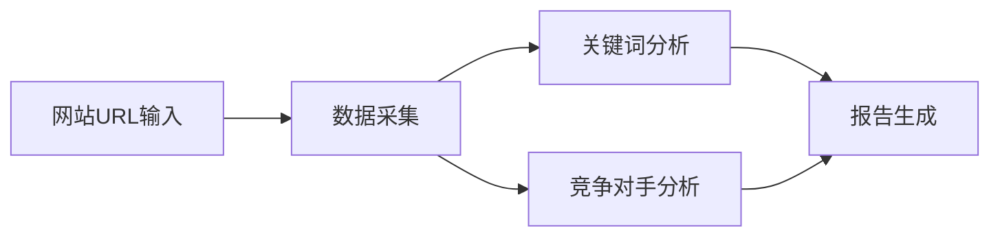
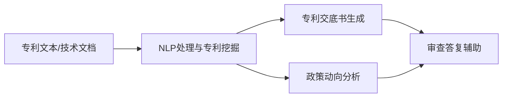
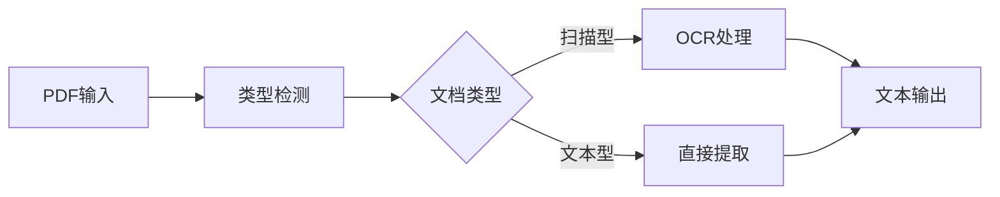
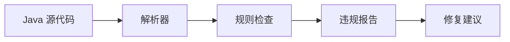
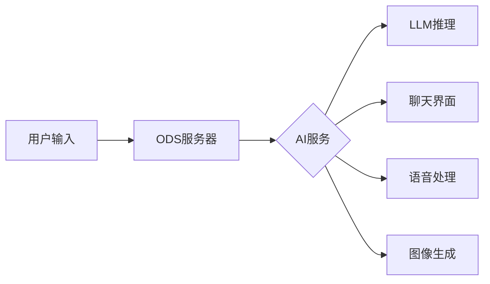

## 今日热点

AI智能体技能库与领域专用工具成为今日热榜核心，科学、安全、专利等专业领域AI应用爆发增长，同时小型LLM快速训练技术受关注。

---

## 热门项目一览

| 排名 | 项目 | 语言 | 今日 | 总计 | 简介 |
|:---:|------|:----:|------:|-----:|------|
| 1 | [tt-a1i/archify](https://github.com/tt-a1i/archify) | JavaScript | +3,991 | 39,117 | Agent skill for beautiful, ... |
| 2 | [THU-MAIC/OpenMAIC](https://github.com/THU-MAIC/OpenMAIC) | TypeScript | +2,824 | 27,412 | Open Multi-Agent Interactiv... |
| 3 | [K-Dense-AI/scientific-agent-skills](https://github.com/K-Dense-AI/scientific-agent-skills) | Python | +1,980 | 40,817 | Turn any AI agent into an A... |
| 4 | [zhaoxuya520/reverse-skill](https://github.com/zhaoxuya520/reverse-skill) | PowerShell | +1,401 | 33,244 | Reverse Engineering / Autho... |
| 5 | [every-app/open-seo](https://github.com/every-app/open-seo) | TypeScript | +610 | 15,809 | Open source alternative to ... |
| 6 | [k1tbyte/Wand-Enhancer](https://github.com/k1tbyte/Wand-Enhancer) | C# | +582 | 23,413 | Advanced UX and interoperab... |
| 7 | [handsomestWei/patent-disclosure-skill](https://github.com/handsomestWei/patent-disclosure-skill) | Python | +571 | 6,309 | 中国专利.skill：专利点挖掘与交底书（发明/实用/... |
| 8 | [p-e-w/heretic](https://github.com/p-e-w/heretic) | Python | +537 | 29,700 | Fully automatic censorship ... |
| 9 | [affaan-m/ECC](https://github.com/affaan-m/ECC) | JavaScript | +512 | 245,291 | The agent harness performan... |
| 10 | [jingyaogong/minimind](https://github.com/jingyaogong/minimind) | Python | +495 | 56,247 | 🧠 Train a 64M-parameter LLM... |
| 11 | [pollen-robotics/microduck_rl](https://github.com/pollen-robotics/microduck_rl) | Python | +385 | 1,181 | RL training environments fo... |
| 12 | [majd/ipatool](https://github.com/majd/ipatool) | Go | +373 | 10,576 | Command-line tool that allo... |

---

## 趋势洞察

```
┌─────────────────────────────────────────────────────────────────┐
│  AI/ML 工具         ████████████████████████  9 个项目        │
│  其他               ██████████                4 个项目        │
│  智能家居             ██                        1 个项目        │
│  媒体资源             ██                        1 个项目        │
│  项目管理             ██                        1 个项目        │
└─────────────────────────────────────────────────────────────────┘
```

---

## 项目深度解读

### 1. tt-a1i/archify — 架构可视化工具

> **一句话总结**：一个JavaScript工具，可创建美观、可验证的架构和工作流图表，导出为带动画的自包含HTML。

#### 价值主张

| 维度 | 说明 |
|------|------|
| **解决痛点** | 解决复杂系统架构可视化难题，提供直观动态展示方式 |
| **目标用户** | 架构师、开发人员、技术文档编写者 |
| **核心亮点** | 自包含HTML输出 + 动画效果 + 多种图表类型支持 + 高质量导出 |

#### 技术架构


**技术特色**：
- 基于JavaScript的单文件解决方案
- 支持多种图表类型和动画效果
- 生成自包含的HTML文件，无需额外依赖
- 提供高质量的导出功能

#### 热度分析

- 项目获得近4万星，单日增长近4000，表明技术社区对架构可视化工具的强烈需求
- 零开放问题显示项目维护良好，社区问题处理高效，处于活跃维护状态

#### 快速上手

```bash
# 安装archify
npm install archify

# 基本使用
archify create --type architecture --input config.yaml --output diagram.html
```

#### 注意事项

- 需要JavaScript环境运行
- 可能需要学习特定的图表定义语法
- 导出功能可能需要额外配置以获得最佳效果


### 2. THU-MAIC/OpenMAIC — 多智能体课堂

> **一句话总结**：提供一键启动的沉浸式多智能体交互学习环境，构建AI驱动的虚拟课堂体验。

#### 价值主张

| 维度 | 说明 |
|------|------|
| **解决痛点** | 传统教育互动性不足，AI学习体验碎片化，缺乏沉浸式多智能体环境 |
| **目标用户** | 教育工作者、AI研究者、计算机专业学生、教育科技开发者 |
| **核心亮点** | 一键启动 + 多智能体交互 + 沉浸式学习环境 + 开源可定制 + 清华背景 |

#### 技术架构


**技术特色**：
- 基于TypeScript构建的全栈多智能体系统
- 提供一键启动的容器化部署方案
- 支持多种AI模型和交互协议

#### 热度分析

- 项目Star数超过2.7万，单日增长2800+，呈现爆发式增长态势
- 作为清华背景的教育AI项目，在AI教育领域占据重要生态位置

#### 快速上手

```bash
# 克隆项目
git clone https://github.com/THU-MAIC/OpenMAIC.git

# 安装依赖
npm install

# 启动项目
npm start
```

#### 注意事项

- 项目许可证未知，商业使用前需确认授权方式
- 项目Star增长迅速，可能存在阶段性热度，需关注长期维护情况
- 作为多智能体系统，资源消耗可能较大，建议在适当配置的机器上运行


### 3. K-Dense-AI/scientific-agent-skills — 科学AI技能库

> **一句话总结**：将任何AI代理转变为AI科学家，提供165种验证技能和100+科学数据库。

#### 价值主张

| 维度 | 说明 |
|------|------|
| **解决痛点** | 解决AI代理在专业科学研究中的能力不足问题 |
| **目标用户** | 全球190,000+科学家，生物学、化学、医学和药物发现领域研究者 |
| **核心亮点** | 165种验证技能 + 100+科学数据库 + 多平台兼容 + 开放Agent技能标准 |

#### 技术架构


**技术特色**：
- 提供经过验证的165种科学技能，确保研究质量
- 整合100+科学数据库，覆盖多学科研究需求
- 支持Cursor、Claude Code等主流AI开发平台

#### 热度分析

- 项目Star数40,817且单日新增近2,000，呈现快速增长趋势
- 全球190,000+科学家使用，在科学AI领域具有广泛影响力

#### 快速上手

```bash
# 安装科学AI技能库
pip install scientific-agent-skills

# 初始化科学AI代理并加载技能
from scientific_agent import ScientificAgent
agent = ScientificAgent().load_skills("biology")
```

#### 注意事项

- 项目许可证信息未知，使用前需确认开源许可条款
- 作为科学研究工具，用户应验证AI生成结果的准确性
- 需确认与特定AI平台的版本兼容性问题


### 4. zhaoxuya520/reverse-skill — AI安全路由工具

> **一句话总结**：AI驱动的逆向工程与安全研究工具包，支持多平台AI编程客户端，提供智能技能路由和按需工具链。

#### 价值主张

| 维度 | 说明 |
|------|------|
| **解决痛点** | 安全研究人员缺乏智能工具路由和按需工具链配置，效率低下 |
| **目标用户** | 逆向工程师、渗透测试专家、安全研究人员 |
| **核心亮点** | AI智能路由 + 按需工具链自举 + 自动进化经验库 + 多AI客户端支持 |

#### 技术架构


**技术特色**：
- 基于PowerShell跨平台脚本执行能力
- AI智能路由技术，自动匹配最适合的安全工具
- 按需工具链自举，优化资源使用效率
- 支持Claude Code、Kiro、Cursor、Cline等多AI客户端

#### 热度分析

- 项目获得33,244星，近期增长迅猛(+1,401/天)，表明安全领域对AI辅助工具需求旺盛
- Fork数4,512，社区活跃度高，成为安全研究人员的重要参考工具

#### 快速上手

```bash
# 克隆项目并初始化
git clone https://github.com/zhaoxuya520/reverse-skill.git
cd reverse-skill
powershell -ExecutionPolicy Bypass -File .\init.ps1
```

#### 注意事项

- 项目未明确许可证，使用时需注意合规性
- 仅适用于授权的渗透测试和安全研究，禁止非法使用
- 工具可能需要专业知识才能正确使用，建议在隔离环境中运行


### 5. every-app/open-sea — 开源SEO工具

> **一句话总结**：开源替代方案，提供类似Semrush和Ahrefs的SEO分析功能，完全免费且可自托管。

#### 价值主张

| 维度 | 说明 |
|------|------|
| **解决痛点** | 提供免费替代方案，降低SEO工具使用成本 |
| **目标用户** | SEO专业人士、网站管理员、数字营销人员 |
| **核心亮点** | 开源免费 + 数据自控 + 功能全面 + 隐私保护 + 可定制 |

#### 技术架构



**技术特色**：
- 基于TypeScript开发，提供类型安全
- 支持自托管部署，数据完全可控
- 模块化设计，易于扩展和维护

#### 热度分析

- 项目Star数超1.5万，单日新增610星，增长势头强劲
- 作为开源替代商业工具，社区活跃度高，体现对隐私和自由软件的支持

#### 快速上手

```bash
# 克隆项目
git clone https://github.com/every-app/open-seo.git

# 安装依赖
cd open-seo && npm install

# 启动项目
npm run dev
```

#### 注意事项

- 需要自行部署和维护，不提供云服务
- 可能需要配置API密钥获取第三方数据
- 功能可能不如商业工具全面，但核心功能应有尽有


### 6. k1tbyte/Wand-Enhancer — WeMod增强工具

> **一句话总结**：为WeMod游戏修改工具提供高级用户体验和跨平台互操作性增强。

#### 价值主张

| 维度 | 说明 |
|------|------|
| **解决痛点** | 改善WeMod应用的用户体验和跨平台兼容性问题 |
| **目标用户** | 游戏玩家、游戏修改爱好者、WeMod用户 |
| **核心亮点** | 高级用户界面+跨平台兼容性+增强功能扩展+性能优化 |

#### 技术架构


**技术特色**：
- 基于C#/.NET框架开发，提供高性能扩展
- 采用模块化设计，支持功能动态加载
- 提供API接口与WeMod应用无缝集成

#### 热度分析

- 项目获得23K+星标和59K+分叉，近期增长率显著，表明在游戏修改工具领域广受欢迎
- 高Fork数显示社区活跃度高，用户积极进行二次开发和功能定制

#### 快速上手

```bash
# 克隆项目
git clone https://github.com/k1tbyte/Wand-Enhancer.git
# 进入项目目录
cd Wand-Enhancer
# 使用dotnet运行
dotnet run
```

#### 注意事项

- 使用此类工具可能违反游戏服务条款，导致账号封禁
- 下载和运行未经验证的代码存在安全风险
- 仅适用于个人学习和研究目的，不建议在正式环境中使用


### 7. handsomestWei/patent-disclosure-skill — 专利智能助手

> **一句话总结**：AI驱动的中国专利全流程智能辅助工具，从挖掘到撰写一站式解决。

#### 价值主张

| 维度 | 说明 |
|------|------|
| **解决痛点** | 降低专利撰写门槛，提高专利挖掘效率，简化审查答复流程 |
| **目标用户** | 专利代理人、企业研发人员、知识产权管理人员 |
| **核心亮点** | AI辅助专利挖掘 + 智能交底书生成 + 政策动向分析 |

#### 技术架构



**技术特色**：
- 基于深度学习的专利文本理解与生成
- 专利法律条款与政策数据库智能匹配
- 多类型专利（发明/实用/外观）统一处理框架

#### 热度分析

- 项目近期热度快速上升，今日新增571星，显示专利AI工具需求旺盛
- 虽无官方Issue，但高Fork数表明社区积极进行二次开发与应用

#### 快速上手

```bash
# 克隆项目
git clone https://github.com/handsomestWei/patent-disclosure-skill.git

# 安装依赖
pip install -r requirements.txt

# 运行示例
python examples/patent_analysis.py
```

#### 注意事项

- 需要关注中国专利局最新政策更新，确保工具符合最新规定
- 专利生成结果需专业人士审核，AI辅助不能完全替代人工判断
- 注意数据隐私与安全，特别是涉及企业核心技术信息时


### 8. p-e-w/heretic — AI审查绕过工具

> **一句话总结**：自动化移除语言模型中的内容审查限制，提升模型自由度与功能完整性。

#### 价值主张

| 维度 | 说明 |
|------|------|
| **解决痛点** | 突破AI模型内置内容审查机制，解除功能限制 |
| **目标用户** | AI研究人员、开发者及需要模型处理敏感内容的用户 |
| **核心亮点** | 自动化检测审查 + 无需修改模型代码 + 保持性能稳定 |

#### 技术架构


**技术特色**：
- 基于模式识别的审查检测技术
- 动态生成绕过提示词
- 支持多种主流语言模型架构

#### 热度分析

- 项目Star数近3万，近期增长迅速，每日新增500+ stars，需求旺盛
- Issues数量为0，表明项目成熟度高或问题私下解决

#### 快速上手

```bash
# 安装依赖
pip install -r requirements.txt

# 基本使用
python heretic.py --model gpt-3.5-turbo --prompt "需要绕过审查的提示"
```

#### 注意事项

- 使用此类工具可能违反AI服务提供商的使用条款
- 绕过内容审查可能带来伦理和安全风险
- 仅限合法合规的研究与实验用途


### 9. affaan-m/ECC — 智能代理系统

> **一句话总结**：AI代码代理性能优化系统，提升多种代码工具的智能与效率

#### 价值主张

| 维度 | 说明 |
|------|------|
| **解决痛点** | 提升AI代码代理性能，解决多工具协同效率问题 |
| **目标用户** | 使用AI编程工具的开发者和研究人员 |
| **核心亮点** | + 技能优化 + 本能增强 + 记忆管理 + 安全保障 + 研究优先开发 |

#### 技术架构


**技术特色**：
- 多AI工具协同优化架构
- 智能代理性能提升机制
- 安全优先的开发范式

#### 热度分析

- 项目获得超24万star，日均增长500+，热度极高且持续上升
- 作为AI编程辅助工具，处于技术前沿，引领行业生态发展

#### 快速上手

```bash
# 克隆项目
git clone https://github.com/affaan-m/ECC.git

# 安装依赖
npm install

# 启动服务
npm start
```

#### 注意事项

- 项目许可证信息不明确，使用前需确认授权条款
- 项目描述提到支持多种AI工具，但具体兼容性需进一步验证
- 由于项目star数极高，建议关注官方更新和社区反馈


### 10. jingyaogong/minimind — 快速LLM训练

> **一句话总结**：仅需2小时即可从零训练6400万参数的高效轻量级LLM模型。

#### 价值主张

| 维度 | 说明 |
|------|------|
| **解决痛点** | 解决大模型训练资源消耗大、周期长的痛点，降低LLM入门门槛 |
| **目标用户** | 研究人员、开发者、教育工作者和小型AI团队 |
| **核心亮点** | 高效训练流程 + 低资源需求 + 快速迭代能力 + 易于部署 |

#### 技术架构


**技术特色**：
- 采用高效的训练策略，显著缩短训练时间
- 优化的模型架构，在保持性能的同时降低资源需求
- 简化的训练流程，使非专业人员也能快速上手

#### 热度分析

- 项目获得超5.6万Star，日增近500，表明LLM训练领域有强烈需求
- 高社区活跃度，表明该项目对AI实践者有较大吸引力

#### 快速上手

```bash
# 克隆项目
git clone https://github.com/jingyaogong/minimind.git
cd minimind

# 开始训练
python train.py --model_size 64M --data_path ./data
```

#### 注意事项

- 训练效果可能与硬件配置和环境相关，建议在良好硬件条件下运行
- 项目可能需要一定深度学习基础才能完全理解和优化
- 注意遵守项目的许可证规定，虽然当前许可证信息不明确


### 11. pollen-robotics/microduck_rl — 机器人RL训练框架

> **一句话总结**：为Microduck机器人提供完整的强化学习训练环境与工具链。

#### 价值主张

| 维度 | 说明 |
|------|------|
| **解决痛点** | 解决机器人强化学习训练环境搭建复杂、缺乏专用工具的问题 |
| **目标用户** | 机器人研究人员、强化学习开发者、小型机器人平台用户 |
| **核心亮点** | 专用机器人RL环境 + 简化训练流程 + 模块化设计 + 易于扩展 |

#### 技术架构


**技术特色**：
- 基于Python的模块化设计，便于扩展和定制
- 支持多种强化学习算法框架集成
- 提供完整的训练监控与可视化工具

#### 热度分析

- 项目近期爆发式增长，单日新增385个Star，表明社区关注度极高
- 作为机器人RL领域新兴项目，正迅速建立生态影响力

#### 快速上手

```bash
# 克隆仓库
git clone https://github.com/pollen-robotics/microduck_rl.git
cd microduck_rl

# 安装依赖并运行示例
pip install -r requirements.txt
python examples/basic_training.py
```

#### 注意事项

- 项目许可证信息不明确，使用前需确认开源协议
- 可能需要特定的硬件支持才能完全运行环境
- 文档尚在完善中，部分高级功能可能需要查看源码理解


### 12. majd/ipatool — iOS应用包管理工具

> **一句话总结**：命令行工具，用于从App Store搜索和下载iOS/iPadOS/tvOS/visionOS的应用包(ipa文件)。

#### 价值主张

| 维度 | 说明 |
|------|------|
| **解决痛点** | iOS应用开发者和测试者需要获取App Store中的应用包进行逆向工程、测试或分析 |
| **目标用户** | iOS应用开发者、安全研究人员、逆向工程师、测试人员 |
| **核心亮点** | 支持多苹果平台应用包下载 + 命令行操作便捷高效 + 无需越狱即可获取应用 + 支持搜索和筛选功能 |

#### 技术架构


**技术特色**：
- 使用Go语言实现，跨平台性能优异
- 直接与Apple App Store API交互获取应用信息
- 实现了IPA文件的合法下载机制

#### 热度分析

- 项目Star数超过10k，近期每日新增约370个Star，增长迅速，表明社区认可度高
- 零Open Issues反映项目维护良好，问题解决及时，用户反馈渠道可能通过其他方式

#### 快速上手

```bash
# 安装工具
go install github.com/majd/ipatool@latest

# 搜索应用
ipatool search "应用名称"

# 下载应用
ipatool download "应用ID"
```

#### 注意事项

- 仅适用于合法用途，不得用于侵犯知识产权
- 可能需要Apple开发者账号才能下载某些应用
- 下载的应用仅用于学习和研究目的
- 使用前应确保遵守Apple的服务条款和相关法律法规


### 13. firecrawl/pdf-inspector — PDF智能分析器

> **一句话总结**：快速Rust库，用于PDF检查、分类和文本提取，智能区分扫描与文本型PDF。

#### 价值主张

| 维度 | 说明 |
|------|------|
| **解决痛点** | 高效处理不同类型PDF，解决扫描文档文本提取难题 |
| **目标用户** | 需要处理大量PDF文档的开发者和企业 |
| **核心亮点** | 高性能 + 智能分类 + 文本提取 + 类型检测 + Rust安全 |

#### 技术架构



**技术特色**：
- 基于Rust实现，内存安全且高性能
- 智能区分扫描与文本型PDF文档
- 高效文本提取与分类算法

#### 热度分析

- Star数超17k且持续增长，表明项目受社区高度认可
- 无开放问题，维护状态良好，适合生产环境使用

#### 快速上手

```bash
# 添加依赖到Cargo.toml
firecrawl-pdf = "0.1.0"

# 基本使用示例
use firecrawl_pdf::PdfInspector;
let inspector = PdfInspector::new();
let result = inspector.inspect("path/to/document.pdf");
```

#### 注意事项

- 项目License未知，商业使用前需确认授权条款
- 需要Rust环境，非Rust开发者可能需要额外集成工作
- OCR功能可能需要额外依赖，影响部署体积


### 14. checkstyle/checkstyle — Java 代码规范工具

> **一句话总结**：自动化 Java 代码风格检查工具，支持多种编码标准，提升代码质量和一致性。

#### 价值主张

| 维度 | 说明 |
|------|------|
| **解决痛点** | 确保团队代码风格统一，减少人工代码审查负担，提高代码可读性 |
| **目标用户** | Java 开发团队、代码审查人员、追求代码质量的项目负责人 |
| **核心亮点** | 高度可配置规则集 + 实时反馈 + 多种集成方式 + 详细违规报告 |

#### 技术架构



**技术特色**：
- 基于 AST 的代码解析技术，精确识别代码结构
- 模块化的规则引擎，支持自定义规则扩展
- 灵活的配置系统，适应不同团队规范需求

#### 热度分析

- 项目获得近万 stars，近期稳定增长，表明在 Java 社区中具有广泛认可和持续价值
- 作为代码质量工具领域的标杆项目，已成为 Java 开发生态系统的重要组成部分

#### 快速上手

```bash
# 下载 Checkstyle
curl -O https://github.com/checkstyle/checkstyle/releases/download/checkstyle-10.3/checkstyle-10.3-all.jar

# 运行 Checkstyle 检查
java -jar checkstyle-10.3-all.jar -c google_checks.xml MyJavaFile.java
```

#### 注意事项

- 初次使用时需要根据团队需求调整规则配置，默认规则可能不完全符合项目要求
- 复杂的自定义规则编写需要深入了解 Checkstyle 的 API 和代码解析机制
- 对于大型项目，建议将 Checkstyle 集成到构建流程中，而非手动执行


### 15. kaifcodec/user-scanner — OSINT信息收集

> **一句话总结**：一站式电子邮件和用户名开源情报工具，通过465+扫描向量深度提取数字足迹。

#### 价值主张

| 维度 | 说明 |
|------|------|
| **解决痛点** | 从单一邮箱/用户名获取多平台在线数据，简化信息收集流程 |
| **目标用户** | 安全研究人员、调查人员、数字取证专家 |
| **核心亮点** | 大规模扫描向量 + 多平台整合 + 自动化信息收集 + 深度数据提取 |

#### 技术架构


**技术特色**：
- 支持邮箱和用户名双重输入模式
- 集成465+活跃扫描向量，覆盖主流平台
- 模块化设计便于扩展新的扫描目标

#### 热度分析

- 项目近期热度显著增长，今日新增93个stars，表明社区认可度高
- 相比fork数，stars增长更快，说明项目实用性强，受研究人员青睐

#### 快速上手

```bash
# 克隆项目
git clone https://github.com/kaifcodec/user-scanner.git
cd user-scanner

# 安装依赖并运行
pip install -r requirements.txt
python user-scanner.py -u username@example.com
```

#### 注意事项

- 使用前请确保遵守目标平台的使用条款，避免违反服务协议
- 大量请求可能导致IP被临时封禁，建议合理设置请求间隔
- 仅用于合法安全研究和调查目的，不得用于非法活动


### 16. Osmantic/ODS — 个人AI服务器平台

> **一句话总结**：将个人电脑转变为全能AI服务器，支持LLM推理、聊天UI、语音和图像生成等功能。

#### 价值主张

| 维度 | 说明 |
|------|------|
| **解决痛点** | 让个人用户无需高端硬件即可部署本地AI服务 |
| **目标用户** | AI开发者、研究人员和技术爱好者 |
| **核心亮点** | 本地部署 + 多模态支持 + 一键部署 + 开源免费 + 工作流支持 |

#### 技术架构



**技术特色**：
- 支持多种AI模型本地部署，保护数据隐私
- 提供统一API接口，简化AI应用开发
- 工作流引擎支持复杂AI任务编排

#### 热度分析

- Star数达5554且持续增长，表明项目受社区关注度高
- Fork数778，显示项目有活跃的二次开发和贡献社区

#### 快速上手

```bash
# 克隆项目
git clone https://github.com/Osmantic/ODS.git
# 安装依赖
pip install -r requirements.txt
# 启动服务
python ods.py
```

#### 注意事项

- 本地部署需要足够的计算资源，特别是运行大型语言模型时
- 可能需要根据具体硬件配置调整模型参数以获得最佳性能
- 项目依赖可能随更新而变化，建议查看最新文档


## 今日推荐

| 主题 | 推荐项目 | 亮点 |
|------|----------|------|
| 今日最热 | [tt-a1i/archify](https://github.com/tt-a1i/archify) | Agent skill for b... |
| 值得关注 | [THU-MAIC/OpenMAIC](https://github.com/THU-MAIC/OpenMAIC) | Open Multi-Agent ... |
| 快速上手 | [K-Dense-AI/scientific-agent-skills](https://github.com/K-Dense-AI/scientific-agent-skills) | Turn any AI agent... |
| 长期潜力 | [zhaoxuya520/reverse-skill](https://github.com/zhaoxuya520/reverse-skill) | Reverse Engineeri... |

---

<div align="center">

*Generated on 2026-09-01 | Powered by GitHub Trending Reporter*

</div>