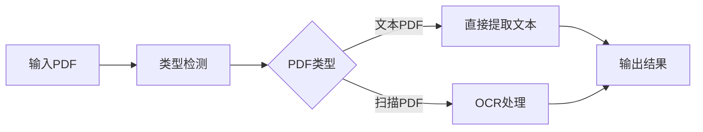

## 今日热点

今日GitHub热榜项目精彩纷呈。

---

## 热门项目一览

| 排名 | 项目 | 语言 | 今日 | 总计 | 简介 |
|:---:|------|:----:|------:|-----:|------|
| 1 | [THU-MAIC/OpenMAIC](https://github.com/THU-MAIC/OpenMAIC) | TypeScript | +3,128 | 29,578 | Open Multi-Agent Interactiv... |
| 2 | [jingyaogong/minimind](https://github.com/jingyaogong/minimind) | Python | +1,005 | 57,144 | 🧠 Train a 64M-parameter LLM... |
| 3 | [K-Dense-AI/scientific-agent-skills](https://github.com/K-Dense-AI/scientific-agent-skills) | Python | +912 | 41,579 | Turn any AI agent into an A... |
| 4 | [affaan-m/ECC](https://github.com/affaan-m/ECC) | JavaScript | +623 | 245,790 | The agent harness performan... |
| 5 | [iv-org/invidious](https://github.com/iv-org/invidious) | Crystal | +577 | 23,785 | Invidious is an alternative... |
| 6 | [firecrawl/pdf-inspector](https://github.com/firecrawl/pdf-inspector) | Rust | +541 | 17,966 | Fast Rust library for PDF i... |
| 7 | [handsomestWei/patent-disclosure-skill](https://github.com/handsomestWei/patent-disclosure-skill) | Python | +501 | 6,753 | 中国专利.skill：专利点挖掘与交底书（发明/实用/... |
| 8 | [browser-use/video-use](https://github.com/browser-use/video-use) | Python | +472 | 22,991 | Edit videos with coding agents |
| 9 | [VoltAgent/awesome-design-md](https://github.com/VoltAgent/awesome-design-md) | Unknown | +323 | 112,838 | A collection of DESIGN.md f... |
| 10 | [Imbad0202/academic-research-skills](https://github.com/Imbad0202/academic-research-skills) | Python | +193 | 44,943 | Academic Research Skills fo... |
| 11 | [unclecode/crawl4ai](https://github.com/unclecode/crawl4ai) | Python | +145 | 80,879 | 🚀🤖 Crawl4AI: Open-source LL... |
| 12 | [3b1b/manim](https://github.com/3b1b/manim) | Python | +86 | 92,586 | Animation engine for explan... |

---

## 趋势洞察

```
┌─────────────────────────────────────────────────────────────────┐
│  AI/ML 工具         ████████████████████████  9 个项目        │
│  多媒体应用            █████                     2 个项目        │
│  其他               █████                     2 个项目        │
│  智能家居             ██                        1 个项目        │
└─────────────────────────────────────────────────────────────────┘
```

---

## 项目深度解读

### 1. THU-MAIC/OpenMAIC — 多智能体教学平台

> **一句话总结**：开源多智能体互动课堂系统，一键获得沉浸式AI学习体验

#### 价值主张

| 维度 | 说明 |
|------|------|
| **解决痛点** | 传统教育缺乏互动性和个性化，难以模拟真实复杂场景 |
| **目标用户** | 教育工作者、AI研究人员、学生及对多智能体系统感兴趣的开发者 |
| **核心亮点** | 沉浸式学习体验 + 多智能体交互 + 一键部署 + 开源可定制 + 清华技术背书 |

#### 技术架构


**技术特色**：
- 基于TypeScript开发，保证代码质量和类型安全
- 多智能体协同学习框架，支持复杂互动场景
- 一键部署系统，降低使用门槛
- 开源架构，便于定制和扩展

#### 热度分析

- 项目Star数接近3万，单日增长超3000，表明近期热度极高，可能有关键更新或突破
- 作为清华开源项目，在AI教育领域具有权威性，社区活跃度高

#### 快速上手

```bash
# 克隆项目
git clone https://github.com/THU-MAIC/OpenMAIC.git

# 安装依赖
npm install

# 启动项目
npm start
```

#### 注意事项

- 项目可能需要较高的计算资源，特别是运行多个智能体时
- 由于是开源项目，使用时需注意遵守相关许可证条款（虽然具体许可证未知）
- 建议在使用前阅读项目文档，了解最佳实践和配置方法


### 2. jingyaogong/minimind — 高效LLM训练

> **一句话总结**：一个能在2小时内从零训练6400万参数LLM的高效Python框架。

#### 价值主张

| 维度 | 说明 |
|------|------|
| **解决痛点** | 降低LLM训练门槛，解决训练周期长、资源消耗大的问题 |
| **目标用户** | 研究人员、开发者、AI教育工作者 |
| **核心亮点** | 高效训练 + 低资源需求 + 完整实现 + 易于理解 |

#### 技术架构


**技术特色**：
- 分布式训练技术加速模型收敛
- 高效的内存和计算资源利用
- 简化的训练流程和配置

#### 热度分析

- 项目star数超过5.7万且持续快速增长，表明LLM高效训练需求强烈
- 在开源LLM社区中处于热门位置，适合作为学习LLM训练的入门项目

#### 快速上手

```bash
# 克隆项目
git clone https://github.com/jingyaogong/minimind.git
cd minimind

# 运行训练脚本
python train.py --model_size 64M
```

#### 注意事项

- 项目许可证未知，使用前需确认授权条款
- 2小时训练时间可能依赖于特定硬件配置，实际时间可能因环境而异


### 3. K-Dense-AI/scientific-agent-skills — 科学智能增强

> **一句话总结**：将任何AI代理转变为科学家的专业技能库，提供165种验证技能和100+科学数据库。

#### 价值主张

| 维度 | 说明 |
|------|------|
| **解决痛点** | AI代理缺乏专业科学知识，无法处理复杂科研任务 |
| **目标用户** | 全球190,000+科学家、研究人员、药物开发者 |
| **核心亮点** | 165种验证技能 + 100+科学数据库 + 多平台兼容性 |

#### 技术架构


**技术特色**：
- 模块化科学技能设计，便于AI代理调用
- 跨平台兼容，支持多种AI编码环境
- 大规模科学数据集整合与验证

#### 热度分析

- 项目获得4万+星标，单日增长900+，热度持续攀升
- 作为科学AI技能库的领导者，在科研AI领域占据重要生态位置

#### 快速上手

```bash
# 安装科学技能库
pip install scientific-agent-skills

# 初始化AI科学家代理
from scientific_agent import ScientistAgent
agent = ScientistAgent()

# 使用特定科学技能
agent.use_skill("protein_analysis", data="protein_sequence.fasta")
```

#### 注意事项

- 项目许可证信息不明确，使用前需确认授权条款
- 部分高级功能可能需要订阅或付费
- 与特定AI平台的集成可能需要额外配置


### 4. affaan-m/ECC — AI代码助手优化

> **一句话总结**：ECC是AI代码助手性能优化系统，通过技能、本能、记忆和安全机制提升编程效率。

#### 价值主张

| 维度 | 说明 |
|------|------|
| **解决痛点** | 解决AI代码助手响应慢、质量不稳定、安全性不足问题 |
| **目标用户** | 使用Claude、Codex、Cursor等AI编程工具的开发者 |
| **核心亮点** | + 技能优化 + 本能反应 + 记忆增强 + 安全保障 + 研究优先开发 |

#### 技术架构


**技术特色**：
- 跨平台AI代码助手统一优化框架
- 智能记忆与学习系统提升响应质量
- 安全机制确保代码生成安全可靠

#### 热度分析

- 项目Star数高达24万+，日增600+，表明项目受到广泛关注和认可
- Fork数3.7万，说明社区积极参与和二次开发，生态活跃

#### 快速上手

```bash
# 克隆项目
git clone https://github.com/affaan-m/ECC.git

# 安装依赖
npm install
```

#### 注意事项

- 项目许可证未知，使用前需确认授权条款
- 项目无开放问题，可能表明维护良好或问题处理机制高效
- 项目专注于多个AI代码助手，可能需要针对特定工具进行配置


### 5. iv-org/invidious — YouTube 替代前端

> **一句话总结**：开源的 YouTube 前端替代品，提供无广告、隐私友好的视频观看体验。

#### 价值主张

| 维度 | 说明 |
|------|------|
| **解决痛点** | 绕过 YouTube 广告和隐私追踪，提供纯净的视频观看体验 |
| **目标用户** | 注重隐私、厌恶广告、希望有自定义 YouTube 体验的用户 |
| **核心亮点** | 无广告体验 + 隐私保护 + 自定义界面 + 账户同步 + 开源透明 |

#### 技术架构


**技术特色**：
- 使用 Crystal 语言编写，性能高效且内存占用低
- 自托管解决方案，数据不经过 Google 服务器
- 支持多实例部署，可扩展性强

#### 热度分析

- 项目 Star 数持续稳定增长，表明社区认可度高且需求稳定
- 作为 YouTube 隐私保护替代方案，在隐私意识增强背景下具有独特生态位置

#### 快速上手

```bash
# 安装依赖
sudo apt install crystal libssl-dev libyaml-dev libpcre3-dev libxml2-dev libgmp-dev

# 克隆仓库
git clone https://github.com/iv-org/invidious.git
cd invidious

# 安装依赖并运行
shards install && crystal run src/invidious.cr
```

#### 注意事项

- 需要自行配置 API 密钥才能正常使用
- 服务器资源消耗相对较高，建议配置充足的内存
- 某些 YouTube 功能可能无法完全复制，如直播、特定互动功能


### 6. firecrawl/pdf-inspector — PDF智能分析器

> **一句话总结**：快速Rust库用于PDF检查、分类和文本提取，智能区分扫描版和文本PDF。

#### 价值主张

| 维度 | 说明 |
|------|------|
| **解决痛点** | 解决PDF类型识别困难，无法智能处理不同格式PDF的问题 |
| **目标用户** | 需要处理大量PDF文档的开发者和企业用户 |
| **核心亮点** | 高性能Rust实现 + 智能PDF类型检测 + 快速文本提取 |

#### 技术架构



**技术特色**：
- 基于Rust的高性能实现，处理速度极快
- 智能区分扫描版和文本版PDF，无需预先知道PDF类型
- 高效的文本提取算法，保留原始文档结构

#### 热度分析

- 项目获得近18k星，单日增长500+，表明社区对该工具需求旺盛
- 作为Firecrawl生态系统的一部分，受益于Firecrawl的品牌效应和用户基础

#### 快速上手

```bash
# 添加依赖到Cargo.toml
firecrawl-pdf-inspector = "0.1"

# 使用示例
cargo run --example basic_usage
```

#### 注意事项

- 项目许可证信息未知，商业使用前需确认许可条款
- OCR功能可能依赖外部库，需注意相关依赖的许可证兼容性
- 对于加密或受保护的PDF文件，可能需要额外处理


### 7. handsomestWei/patent-disclosure-skill — 专利AI助手

> **一句话总结**：AI赋能专利全流程，从挖掘到撰写再到答复，一站式解决专利创作难题。

#### 价值主张

| 维度 | 说明 |
|------|------|
| **解决痛点** | 降低专利撰写门槛，提升专利挖掘效率，解决专业知识不足问题 |
| **目标用户** | 专利代理人、企业研发人员、知识产权律师、创新团队 |
| **核心亮点** | AI辅助专利撰写 + 专利点智能挖掘 + 多类型专利支持 + 政策动态追踪 + 审查答复辅助 |

#### 技术架构


**技术特色**：
- 基于大语言模型的专利文本理解与生成
- 专利领域知识图谱构建与应用
- 多模态专利信息处理与分析

#### 热度分析

- 项目Star数达6,753且单日增长501，显示在专利技术领域有极高关注度
- 0个Open Issues表明项目维护良好，用户反馈问题少，社区活跃度高

#### 快速上手

```bash
# 克隆项目
git clone https://github.com/handsomestWei/patent-disclosure-skill.git

# 安装依赖
cd patent-disclosure-skill
pip install -r requirements.txt

# 运行示例
python examples/demo.py
```

#### 注意事项

- 项目需要专利领域基础知识才能有效使用
- 可能需要配置API密钥或特定环境变量
- 中文专利处理可能需要特定字体支持
- 政策数据可能需要定期更新以保持时效性


### 8. browser-use/video-use — AI视频编程编辑

> **一句话总结**：通过编程代理实现AI驱动的视频编辑，为开发者提供代码控制视频处理的创新方式。

#### 价值主张

| 维度 | 说明 |
|------|------|
| **解决痛点** | 降低视频编辑技术门槛，允许通过编程方式实现复杂视频处理 |
| **目标用户** | 开发者、视频内容创作者和自动化需求用户 |
| **核心亮点** | 代码控制视频编辑+AI辅助处理+自动化工作流+跨平台支持 |

#### 技术架构


**技术特色**：
- 结合大语言模型与视频处理算法
- 通过API实现编程控制视频编辑流程
- 支持批量处理和自动化视频编辑任务

#### 热度分析

- 高星增长迅速，表明社区对AI视频编辑工具的强烈兴趣
- 处于AI视频处理前沿，与browser-use生态系统形成互补

#### 快速上手

```bash
# 安装依赖
pip install browser-use video-use

# 基本使用示例
python -m videouse --input video.mp4 --output edited_video.mp4 --script edit_script.py
```

#### 注意事项

- 需要理解基本编程概念才能有效使用
- 可能需要GPU加速处理大型视频文件


### 9. VoltAgent/awesome-design-md — 设计系统资源库

> **一句话总结**：收集流行品牌设计系统DESIGN.md文件，帮助开发者快速匹配品牌UI设计。

#### 价值主张

| 维度 | 说明 |
|------|------|
| **解决痛点** | 解决开发者快速匹配品牌设计系统的需求 |
| **目标用户** | 前端开发者、UI设计师、产品经理 |
| **核心亮点** | + 品牌设计系统集合 + 代码生成支持 + 即用型设计规范 |

#### 技术架构


**技术特色**：
- 设计系统文档标准化处理
- 品牌设计语言解析
- 代码自动生成机制

#### 热度分析

- 项目获得超过11万星，每日新增300+星，增长迅速
- 社区活跃度高，Fork数超过1.2万，表明开发者广泛采用

#### 快速上手

```bash
# 克隆项目仓库
git clone https://github.com/VoltAgent/awesome-design-md.git

# 查看可用设计系统
cd awesome-design-md && ls

# 将特定品牌的设计系统文件复制到项目中
cp ./apple/DESIGN.md ./your-project/
```

#### 注意事项

- 需要配合AI编码工具使用才能实现完整的代码生成功能
- 不同设计系统可能存在兼容性问题，需根据项目需求选择
- 建议在使用前检查DESIGN.md文件的更新状态


### 10. Imbad0202/academic-research-skills — 学术研究助手

> **一句话总结**：为Claude Code提供学术研究全流程辅助，从研究到最终定稿的系统性工具。

#### 价值主张

| 维度 | 说明 |
|------|------|
| **解决痛点** | 解决学术研究各环节效率低、质量参差不齐的问题 |
| **目标用户** | 学术研究人员、学生、论文作者 |
| **核心亮点** | 系统性流程指导 + Claude Code深度集成 + 全周期研究支持 |

#### 技术架构


**技术特色**：
- 基于Claude Code的AI辅助研究流程
- 提供结构化的学术研究方法论
- 全周期研究质量保障机制

#### 热度分析

- 项目获得44,943个Star，近单日增长193个，显示学术研究AI工具有持续高需求
- Fork数3,551表明用户积极参与项目定制与扩展，形成活跃的学术研究AI工具生态

#### 快速上手

```bash
# 克隆项目到本地
git clone https://github.com/Imbad0202/academic-research-skills.git

# 安装依赖
pip install -r requirements.txt

# 在Claude Code中加载研究技能
claude load academic-research-skills
```

#### 注意事项

- 项目依赖Claude Code环境，需要确保正确配置
- 学术研究仍需人工审核，AI辅助应作为补充而非替代
- 使用时需注意学术诚信，避免过度依赖AI生成内容


### 11. unclecode/crawl4ai — AI友好爬虫

> **一句话总结**：专为LLM设计的开源网页爬虫，支持智能内容提取与结构化处理。

#### 价值主张

| 维度 | 说明 |
|------|------|
| **解决痛点** | 传统爬虫难以直接为AI提供高质量训练数据 |
| **目标用户** | AI开发者、数据科学家、研究人员 |
| **核心亮点** | LLM友好输出 + 智能内容解析 + 结构化数据处理 |

#### 技术架构


**技术特色**：
- 基于LLM优化的内容提取算法
- 支持复杂网页结构和动态内容
- 智能识别和过滤无关信息

#### 热度分析

- 项目Star数超8万且持续增长，在AI爬虫领域具有显著影响力
- Fork数与Star数比例约为10:1，表明项目被广泛使用和二次开发

#### 快速上手

```bash
# 安装crawl4ai
pip install crawl4ai

# 基本使用示例
from crawl4ai import WebCrawler
crawler = WebCrawler()
result = crawler.crawl("https://example.com")
print(result.content)
```

#### 注意事项

- 注意遵守目标网站的robots.txt和使用条款
- 大规模爬取可能需要考虑IP轮换和请求频率控制
- 动态网页可能需要额外配置或使用无头浏览器


### 12. 3b1b/manim — 数学动画引擎

> **一句话总结**：基于Python的数学动画引擎，让抽象数学概念可视化，助力教育者创建高质量数学解释视频。

#### 价值主张

| 维度 | 说明 |
|------|------|
| **解决痛点** | 将抽象数学概念可视化，使复杂知识更易理解 |
| **目标用户** | 数学教育工作者、内容创作者、数学爱好者 |
| **核心亮点** | Python编程实现 + 高质量动画渲染 + 数学专用场景支持 |

#### 技术架构


**技术特色**：
- 基于Python的声明式API，简化复杂数学动画创建
- 支持LaTeX公式渲染，确保数学符号精确显示
- 可扩展架构，支持自定义动画和场景

#### 热度分析

- 超高关注度，近10万星标，数学教育领域标杆项目
- 活跃开发者社区，持续迭代更新，成为数学可视化标准工具

#### 快速上手

```bash
# 安装manim
pip install manim

# 创建基础场景
python -m manim example_scenes.py SquareToCircle -p
```

#### 注意事项

- 项目依赖较多，安装时可能需要处理版本兼容问题
- 高质量渲染需要较强的计算资源，建议使用GPU加速
- 学习曲线较陡，需要一定的Python和数学基础


### 13. Gitlawb/openclaude — 开源 Claude 实现

> **一句话总结**：开源的 Claude AI 助手实现，可在任何地方运行，支持多种模型。

#### 价值主张

| 维度 | 说明 |
|------|------|
| **解决痛点** | 提供开源可定制的 Claude AI 助手，摆脱闭源限制 |
| **目标用户** | 开发者、AI 爱好者、需要本地部署 AI 助手的用户 |
| **核心亮点** | + 跨平台运行 + 支持多种模型 + 开源可定制 + 隐私保护 |

#### 技术架构


**技术特色**：
- 基于 TypeScript 开发，确保类型安全
- 支持多种 AI 模型，兼容 Claude API
- 跨平台架构，可在多种环境中运行

#### 热度分析

- 项目 Star 数超过 3 万，且近期每日新增约 80 个 Star，表明项目处于快速增长阶段
- 高 Fork 数量显示社区积极参与和二次开发，生态活跃

#### 快速上手

```bash
# 克隆项目
git clone https://github.com/Gitlawb/openclaude.git
# 安装依赖
npm install
# 启动服务
npm start
```

#### 注意事项

- 项目许可证未知，使用前需确认开源许可条款
- 项目描述简短，建议查看 README 获取更详细的使用说明
- 由于 Open Issues 为 0，可能需要在其他渠道获取技术支持


### 14. averygan/reclip — 视频下载工具

> **一句话总结**：轻量级自托管媒体下载器，提供简洁Web界面，支持多网站视频下载。

#### 价值主张

| 维度 | 说明 |
|------|------|
| **解决痛点** | 解决用户从各种网站下载视频的需求，无需安装多个专用工具 |
| **目标用户** | 需要从不同网站下载视频内容的普通用户和内容创作者 |
| **核心亮点** | 轻量级设计 + 自托管部署 + 简洁Web界面 + 多网站支持 |

#### 技术架构


**技术特色**：
- 基于Web的轻量级架构，无需客户端安装
- 支持多网站视频解析，扩展性强
- 自托管部署，保护用户隐私

#### 热度分析

- 项目获得7704个Star，增长稳定，表明用户需求旺盛
- Fork数1318，说明社区积极参与和二次开发

#### 快速上手

```bash
# 克隆项目
git clone https://github.com/averygan/reclip.git
# 进入目录并启动
cd reclip && docker-compose up -d
```

#### 注意事项

- 需要注意版权问题，仅下载有权限的内容
- 某些网站可能有反爬机制，可能导致下载失败
- 自托管需要一定的技术基础进行维护


## 今日推荐

| 主题 | 推荐项目 | 亮点 |
|------|----------|------|
| 今日最热 | [THU-MAIC/OpenMAIC](https://github.com/THU-MAIC/OpenMAIC) | Open Multi-Agent ... |
| 值得关注 | [jingyaogong/minimind](https://github.com/jingyaogong/minimind) | 🧠 Train a 64M-par... |
| 快速上手 | [K-Dense-AI/scientific-agent-skills](https://github.com/K-Dense-AI/scientific-agent-skills) | Turn any AI agent... |
| 长期潜力 | [affaan-m/ECC](https://github.com/affaan-m/ECC) | The agent harness... |

---

<div align="center">

*Generated on 2026-09-02 | Powered by GitHub Trending Reporter*

</div>