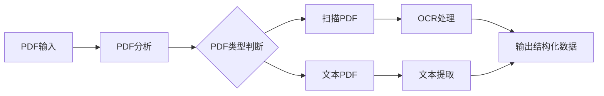
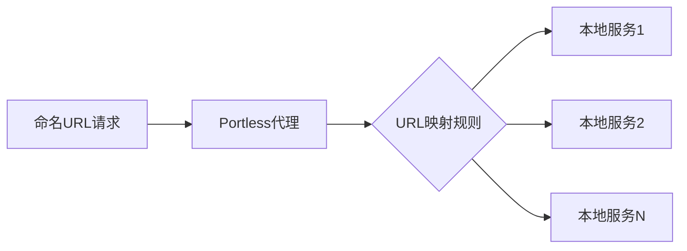
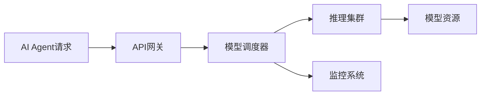

## 今日热点

AI代理工具链与性能优化成为今日焦点，代理技能库和开发工具生态持续扩张，AI正在深度融入各领域专业应用。

---

## 热门项目一览

| 排名 | 项目 | 语言 | 今日 | 总计 | 简介 |
|:---:|------|:----:|------:|-----:|------|
| 1 | [DietrichGebert/ponytail](https://github.com/DietrichGebert/ponytail) | JavaScript | +1,354 | 121,713 | Makes your AI agent think l... |
| 2 | [mattpocock/skills](https://github.com/mattpocock/skills) | Shell | +1,166 | 245,301 | Skills for Real Engineers. ... |
| 3 | [pacifio/atlas](https://github.com/pacifio/atlas) | Rust | +888 | 2,921 | Source control for agents. ... |
| 4 | [debpalash/VoiceStudio](https://github.com/debpalash/VoiceStudio) | Python | +832 | 14,866 | VoiceStudio is the open-sou... |
| 5 | [Imbad0202/academic-research-skills](https://github.com/Imbad0202/academic-research-skills) | Python | +799 | 45,591 | Academic Research Skills fo... |
| 6 | [Gitlawb/openclaude](https://github.com/Gitlawb/openclaude) | TypeScript | +775 | 32,014 | runs anywhere. uses anything |
| 7 | [firecrawl/pdf-inspector](https://github.com/firecrawl/pdf-inspector) | Rust | +586 | 18,543 | Fast Rust library for PDF i... |
| 8 | [NousResearch/hermes-agent](https://github.com/NousResearch/hermes-agent) | Python | +533 | 240,158 | The agent that grows with you |
| 9 | [affaan-m/ECC](https://github.com/affaan-m/ECC) | JavaScript | +516 | 246,385 | The agent harness performan... |
| 10 | [blader/humanizer](https://github.com/blader/humanizer) | Python | +374 | 40,474 | Agent skill that removes si... |
| 11 | [google-research/timesfm](https://github.com/google-research/timesfm) | Python | +343 | 29,891 | TimesFM (Time Series Founda... |
| 12 | [JuliusBrussee/caveman](https://github.com/JuliusBrussee/caveman) | Go | +238 | 102,665 | 🪨 why use many token when f... |

---

## 趋势洞察

```
┌─────────────────────────────────────────────────────────────────┐
│  AI/ML 工具         ████████████████████████  14 个项目        │
│  其他               ███                       2 个项目        │
│  多媒体应用            █                         1 个项目        │
│  智能家居             █                         1 个项目        │
│  数据分析             █                         1 个项目        │
└─────────────────────────────────────────────────────────────────┘
```

---

## 项目深度解读

### 1. DietrichGebert/ponytail — AI代码优化工具

> **一句话总结**：通过智能优化减少AI生成的代码量，以最少的代码实现最大功能。

#### 价值主张

| 维度 | 说明 |
|------|------|
| **解决痛点** | 解决AI生成代码冗余、效率低下的问题 |
| **目标用户** | AI开发者、编程助手使用者、代码优化需求者 |
| **核心亮点** | 代码最小化 + 智能优化 + 高效执行 |

#### 技术架构


**技术特色**：
- 代码冗余智能检测技术
- 代码最小化优化算法
- 高效执行路径分析

#### 热度分析

- 项目Star数超过12万，近期增长迅速，日均增长约1300+，表明市场高度认可
- 零未解决问题反映项目成熟度高，维护状态良好

#### 快速上手

```bash
# 安装
npm install ponytail

# 基本使用
const ponytail = require('ponytail');
const optimizedCode = ponytail.optimize(yourAIgeneratedCode);
```

#### 注意事项

- 可能需要配合AI编程工具使用效果最佳
- 复杂项目中的代码优化可能需要人工干预


### 2. mattpocock/skills — AI代理技能库

> **一句话总结**：为真实工程师设计的AI代理技能集合，源自作者的.agents目录。

#### 价值主张

| 维度 | 说明 |
|------|------|
| **解决痛点** | 工程师缺乏高质量的AI代理技能和提示模板 |
| **目标用户** | 需要提高AI工具使用效率的开发者和工程师 |
| **核心亮点** | 实用性高 + 直接可用 + 持续更新 + 社区驱动 |

#### 技术架构


**技术特色**：
- 基于Shell脚本实现，跨平台兼容性强
- 结构化组织技能，便于查找和使用
- 简洁高效，不依赖复杂环境

#### 热度分析

- 项目获得超过24万星，每日新增超过1000星，增长势头强劲
- 零开放问题表明项目维护良好，社区贡献度高

#### 快速上手

```bash
# 克隆项目到本地
git clone https://github.com/mattpocock/skills.git

# 查看可用技能
cd skills && ls -la
```

#### 注意事项

- 需要基本的Shell知识才能理解和使用这些技能
- 某些技能可能需要特定的AI平台支持
- 使用前应检查技能是否与当前AI模型兼容


### 3. pacifio/atlas — AI代理管理

> **一句话总结**：统一管理多个AI编程代理的代码变更与协作，实现智能开发流程一体化

#### 价值主张

| 维度 | 说明 |
|------|------|
| **解决痛点** | 多个AI代理代码变更分散，难以统一管理和追踪 |
| **目标用户** | AI开发团队、多智能体编程项目研究者 |
| **核心亮点** | 多代理协同管理 + 智能变更追踪 + 统一查询接口 + 版本控制集成 + AI工作流编排 |

#### 技术架构


**技术特色**：
- 基于Rust构建的高性能并发代理管理系统
- 采用类似Git的版本控制机制管理AI代理输出
- 构建智能代理间协作的知识图谱网络

#### 热度分析

- 项目单日增长888星，呈现爆发式增长态势，反映AI代理管理工具需求激增
- Fork数相对较少，表明项目处于早期采纳阶段，用户以体验为主

#### 快速上手

```bash
git clone https://github.com/pacifio/atlas.git
cd atlas
cargo run -- -h
```

#### 注意事项

- 项目许可证尚未明确，商业使用前需确认授权条款
- 目前文档相对有限，可能需要通过源码了解API使用方式
- 项目处于活跃开发阶段，API可能会有较大变动


### 4. debpalash/VoiceStudio — 开源语音工具

> **一句话总结**：完全本地化的开源语音处理平台，提供646种语言的语音克隆与视频配音功能。

#### 价值主张

| 维度 | 说明 |
|------|------|
| **解决痛点** | 解决云端语音服务的隐私问题，提供本地化ElevenLabs替代方案 |
| **目标用户** | 内容创作者、语音开发者、多语言制作团队、有声书制作者 |
| **核心亮点** | 完全本地运行 + 646种语言支持 + 多功能语音处理 + 开源可定制 + 视频配音支持 |

#### 技术架构


**技术特色**：
- 基于 Python 开发，跨平台兼容性强
- 支持多达646种语言的语音处理能力
- 本地运行架构，保障用户数据隐私安全

#### 热度分析

- 项目近期增长迅猛，单日Star增加832，社区关注度极高
- 作为 ElevenLabs 的开源替代方案，填补了本地语音处理工具的市场空白

#### 快速上手

```bash
# 克隆项目
git clone https://github.com/debpalash/VoiceStudio.git
# 安装依赖
pip install -r requirements.txt
# 运行项目
python voicestudio.py
```

#### 注意事项

- 项目许可证未知，商业使用前需确认授权情况
- 本地运行可能需要较强的计算资源，特别是处理长音频时
- 646种语言的支持可能需要额外下载语言包
- 项目没有开放Issue，可能通过其他渠道提供支持


### 5. Imbad0202/academic-research-skills — 学术研究助手

> **一句话总结**：提供从研究到完成的完整学术工作流程，助力高效产出高质量学术成果。

#### 价值主张

| 维度 | 说明 |
|------|------|
| **解决痛点** | 简化学术研究全流程，解决从研究到写作的效率与质量问题 |
| **目标用户** | 学术研究人员、学生、学者等需要撰写论文的专业人士 |
| **核心亮点** | 研究流程自动化 + AI写作辅助 + 评审功能 + 修订支持 + 多格式输出 |

#### 技术架构


**技术特色**：
- 基于Python的模块化学术工具集
- 集成Claude AI实现智能研究辅助
- 支持多种学术格式与引用标准

#### 热度分析

- 项目获得4.5万+星，近期增长显著，表明AI辅助学术工具需求旺盛
- 无开放问题反映项目成熟度高，社区活跃度稳定

#### 快速上手

```bash
# 克隆项目
git clone https://github.com/Imbad0202/academic-research-skills.git

# 安装依赖
pip install -r requirements.txt
```

#### 注意事项

- 项目可能需要Claude API访问权限
- 建议先阅读项目文档了解具体功能使用方法
- 注意遵守学术道德规范，合理使用AI辅助工具


### 6. Gitlawb/openclaude — 开放Claude客户端

> **一句话总结**：跨平台开源Claude API客户端，支持本地部署与多环境使用。

#### 价值主张

| 维度 | 说明 |
|------|------|
| **解决痛点** | 突破官方平台限制，实现Claude模型在任意环境自由部署使用 |
| **目标用户** | 开发者、研究人员、需要灵活部署AI模型的技术用户 |
| **核心亮点** + 跨平台兼容性 + 本地部署能力 + API无缝集成 + 多场景适配 |

#### 技术架构


**技术特色**：
- 基于TypeScript构建，提供类型安全与跨平台兼容
- 模块化设计支持多种后端灵活切换
- 轻量级架构确保低资源消耗与高性能

#### 热度分析

- 项目Star数超3.2万，日增775+，呈现爆发式增长态势
- 高Fork比例反映社区活跃度高，用户二次开发意愿强烈

#### 快速上手

```bash
# 安装
npm install -g openclaude

# 配置API密钥
openclaude config set ANTHROPIC_API_KEY=your_api_key

# 使用
openclaude "你的提示内容"
```

#### 注意事项

- 需要有效的Anthropic API密钥才能使用服务
- 请遵守Anthropic的使用条款和API限制
- 本地部署时需注意资源消耗，特别是处理长文本时
- 建议定期更新以获得最新功能和安全补丁


### 7. firecrawl/pdf-inspector — 高效PDF检测

> **一句话总结**：快速Rust库用于PDF检查、分类和文本提取，智能区分扫描PDF与文本PDF以实现智能路由。

#### 价值主张

| 维度 | 说明 |
|------|------|
| **解决痛点** | 解决PDF内容快速分类和文本提取的效率问题 |
| **目标用户** | 需要处理大量PDF文件的开发者和企业 |
| **核心亮点** | 高性能 + 智能分类 + 多功能检测 |

#### 技术架构



**技术特色**：
- 基于Rust的高性能处理能力
- 智能区分扫描PDF与文本PDF
- 高效的文本提取算法

#### 热度分析

- 项目获得18,543颗星，单日增长586，显示出强劲的发展势头和社区认可度
- Fork数为1,246，表明社区有较高的参与度和贡献意愿

#### 快速上手

```bash
# 添加依赖
cargo add pdf-inspector

# 基本使用示例
let inspector = PdfInspector::new("document.pdf");
let pdf_type = inspector.classify();
let text = inspector.extract_text();
```

#### 注意事项

- 项目许可证未知，商业使用前需要确认许可条款
- 虽然项目描述简洁，但可能需要查看文档了解完整功能
- 由于是Rust库，需要一定的Rust编程基础


### 8. NousResearch/hermes-agent — 成长型智能代理

> **一句话总结**：能够与用户共同学习和进化的自适应智能代理系统，提供个性化长期交互体验。

#### 价值主张

| 维度 | 说明 |
|------|------|
| **解决痛点** | 解决传统AI代理难以适应个性化需求和长期交互场景的问题 |
| **目标用户** | 需要定制化AI代理的开发者、研究人员和企业应用场景 |
| **核心亮点** | 自适应学习机制 + 长期上下文记忆 + 个性化交互优化 + 持续进化能力 |

#### 技术架构


**技术特色**：
- 持续学习与记忆更新机制
- 多模态交互理解能力
- 自适应决策优化算法

#### 热度分析

- 项目获24万+星标，日增500+，表明项目处于快速增长期且备受关注
- 高Fork比例显示项目代码质量高，被广泛用于二次开发和商业应用

#### 快速上手

```bash
# 克隆仓库并安装依赖
git clone https://github.com/NousResearch/hermes-agent.git
cd hermes-agent
pip install -r requirements.txt
python main.py --config config/default.yaml
```

#### 注意事项

- 项目许可证信息不明确，使用前需确认授权条款
- 项目可能需要一定的AI和机器学习基础知识才能有效使用
- 由于Open Issues为0，建议关注项目讨论区获取最新信息


### 9. affaan-m/ECC — AI助手性能优化

> **一句话总结**：AI代码助手性能优化系统，提升开发效率与代码质量

#### 价值主张

| 维度 | 说明 |
|------|------|
| **解决痛点** | AI代码助手响应慢、代码质量不稳定、缺乏上下文记忆 |
| **目标用户** | 使用AI编程工具的开发者、研究人员、技术团队 |
| **核心亮点** | 技能增强 + 本能优化 + 记忆管理 + 安全保障 + 研究导向 |

#### 技术架构


**技术特色**：
- 多层次AI代码处理流程
- 自适应性能优化机制
- 安全与效率平衡的架构设计

#### 热度分析

- 高Star数和持续增长的Fork表明项目在AI开发工具领域有显著影响力
- 零Open Issues反映项目成熟度高，维护良好

#### 快速上手

```bash
# 克隆项目
git clone https://github.com/affaan-m/ECC.git

# 安装依赖
npm install
```

#### 注意事项

- 项目许可信息未知，使用前需确认
- 可能需要特定的AI代码助手环境才能发挥最佳性能


### 10. blader/humanizer — AI文本去机械化

> **一句话总结**：一款去除AI生成文本机械痕迹的Python工具，使AI内容更接近自然人类写作。

#### 价值主张

| 维度 | 说明 |
|------|------|
| **解决痛点** | 消除AI生成文本的机械感，提升内容自然度和可读性 |
| **目标用户** | 内容创作者、AI系统开发者、内容审核人员 |
| **核心亮点** | 高效去除AI特征 + 保持语义完整 + 多语言支持 + 开源可定制 + 简单易用 |

#### 技术架构


**技术特色**：
- 基于深度学习识别AI文本特有的模式化特征
- 采用风格迁移算法实现文本自然化处理
- 通过上下文理解保持语义连贯性和逻辑性

#### 热度分析
- 项目Star数突破4万，单日增长374，显示极高的关注度与快速增长趋势
- 在AI内容真实性需求激增的背景下，具有独特的技术价值和市场潜力

#### 快速上手

```bash
# 安装humanizer
pip install humanizer

# 基本使用
python -m humanizer --input "AI生成的文本文件" --output "处理后的人类化文本"
```

#### 注意事项
- 处理后的文本仍需人工审核，确保内容准确性和适当性
- 不同语言和领域的文本处理效果可能存在差异，需针对性调整参数
- 长文本处理可能需要分段进行以获得最佳效果


### 11. google-research/timesfm — 时间序列预测模型

> **一句话总结**：Google Research开发的高性能预训练时间序列基础模型，提供准确的时间序列预测能力。

#### 价值主张

| 维度 | 说明 |
|------|------|
| **解决痛点** | 解决时间序列预测需要大量标注数据和领域知识的传统限制 |
| **目标用户** | 数据科学家、时间序列分析师、预测建模研究人员 |
| **核心亮点** | 预训练基础模型架构 + 高精度预测能力 + 零样本学习支持 + 多变量时间序列处理 |

#### 技术架构


**技术特色**：
- 基于Transformer架构的时间序列建模
- 预训练-微调范式减少数据需求
- 支持多变量时间序列预测

#### 热度分析

- 项目获近3万星，单日增长343星，表明时间序列基础模型领域热度高涨
- 作为Google Research出品的项目，在学术界和工业界都有重要影响力

#### 快速上手

```bash
# 安装TimesFM
pip install timesfm

# 基本使用示例
import timesfm
model = timesfm.TimesFM()
model.fit(train_data)
predictions = model.predict(test_data)
```

#### 注意事项

- 模型可能需要较大的计算资源进行训练
- 对于超长期预测可能需要特定调整
- 需要确保输入数据格式符合模型要求


### 12. JuliusBrussee/caveman — AI Token精简器

> **一句话总结**：通过使用类似穴居人的简化语言，减少Claude AI API调用的token消耗65%，降低成本提高效率。

#### 价值主张

| 维度 | 说明 |
|------|------|
| **解决痛点** | 降低Claude AI API调用成本，提高响应效率 |
| **目标用户** | Claude AI开发者、API重度使用者、成本敏感型用户 |
| **核心亮点** | 减少65%token消耗 + 保持代码质量 + 简单易用 |

#### 技术架构


**技术特色**：
- 基于Go语言开发，性能高效
- 智能语言简化算法，保持语义完整性
- 与Claude API无缝集成

#### 热度分析

- 项目获得10万+星标，日增长稳定，表明用户认可其降低API成本的价值
- 作为AI工具链中的重要优化组件，在Claude开发者社区具有较高影响力

#### 快速上手

```bash
# 安装
go install github.com/JuliusBrussee/caveman@latest

# 使用
echo "your complex prompt here" | caveman | claude
```

#### 注意事项

- 可能影响某些复杂任务的准确性，需根据场景使用
- 需要Claude API访问权限
- 简化程度可能需要根据具体任务调整


### 13. ChromeDevTools/chrome-devtools-mcp — AI编码工具

> **一句话总结**：为AI编码智能体提供Chrome开发者工具，增强代码调试与开发体验。

#### 价值主张

| 维度 | 说明 |
|------|------|
| **解决痛点** | 为AI编码智能体提供专业调试工具，解决智能体代码调试能力有限的问题 |
| **目标用户** | AI编码智能体开发者、自动化测试工具开发者 |
| **核心亮点** | 集成Chrome DevTools + 支持AI交互 + 提供代码调试能力 + 增强智能体开发体验 |

#### 技术架构


**技术特色**：
- 基于TypeScript开发，提供类型安全
- 集成Chrome DevTools原生功能
- 支持与AI智能体的无缝交互

#### 热度分析

- 项目获得超过5万星，每日新增148星，表明增长迅速，开发者社区认可度高
- 作为Chrome DevTools的扩展项目，处于AI辅助开发工具生态的核心位置，与主流AI编码工具形成互补

#### 快速上手

```bash
# 克隆仓库
git clone https://github.com/ChromeDevTools/chrome-devtools-mcp.git

# 安装依赖
npm install
```

#### 注意事项

- 需要Chrome浏览器环境支持
- 可能需要配置API密钥或访问权限


### 14. vercel-labs/portless — 本地URL命名工具

> **一句话总结**：为本地开发环境提供稳定、命名的URL替代传统端口号，提升开发体验。

#### 价值主张

| 维度 | 说明 |
|------|------|
| **解决痛点** | 开发中记忆和管理多个随机端号困难 |
| **目标用户** | Web应用开发者、全栈工程师、DevOps工程师 |
| **核心亮点** | 持久命名URL + 无需配置端口冲突 + 支持本地代理 |

#### 技术架构



**技术特色**：
- 基于本地DNS或代理的URL重定向技术
- 自动检测和映射本地运行的服务
- 无需修改现有代码即可集成

#### 热度分析

- 项目获得11799个Star且持续增长(+73 today)，表明其在开发者社区中受到高度关注
- 作为Vercel实验室项目，借助Vercel的品牌影响力，在Web开发工具生态中占据重要位置

#### 快速上手

```bash
# 安装Portless
npm install -g @portless/cli

# 启动Portless并配置服务
portless start --service myapp=http://localhost:3000
```

#### 注意事项

- 需要了解本地网络配置以确保命名URL可访问
- 可能需要管理员权限在某些系统上修改本地DNS设置
- 与某些防火墙或安全软件可能有兼容性问题


### 15. sngyai/Sequoia-X — 智能选股系统

> **一句话总结**：A股自动选股系统，支持多种技术形态扫描和飞书自动化推送。

#### 价值主张

| 维度 | 说明 |
|------|------|
| **解决痛点** | 解决A股投资者手动筛选股票效率低、错失交易机会的问题 |
| **目标用户** | A股投资者、量化交易爱好者、股票分析师 |
| **核心亮点** | 多种技术形态自动扫描 + 收盘后自动运行 + 飞书推送 + 高效选股 |

#### 技术架构


**技术特色**：
- 基于Python实现，易于扩展和维护
- 支持多种技术形态的自动识别算法
- 集成飞书推送功能，实现结果自动化分发
- 定时任务机制，可在收盘后自动运行

#### 热度分析

- 项目获得6,127个Star，且近期增长稳定，日均新增约60个Star，表明项目活跃度高且受关注
- 作为开源选股系统，在量化交易领域具有一定影响力，社区活跃度良好

#### 快速上手

```bash
# 克隆项目
git clone https://github.com/sngyai/Sequoia-X.git
cd Sequoia-X

# 安装依赖
pip install -r requirements.txt

# 配置飞书推送并运行
python run.py --config config.example.yaml
```

#### 注意事项

- 项目未明确说明许可证，使用时需注意授权问题
- 股票市场存在风险，系统选股结果仅供参考，不构成投资建议
- 可能需要配置股票数据源和飞书机器人才能正常运行
- 项目未提及是否支持实时数据，可能仅支持历史数据或延时数据


### 16. superlinked/sie — AI模型推理平台

> **一句话总结**：高性能开源推理服务器，为AI代理提供模型集群部署与统一管理服务。

#### 价值主张

| 维度 | 说明 |
|------|------|
| **解决痛点** | 解决AI模型部署分散、管理复杂、资源利用率低的问题 |
| **目标用户** | AI应用开发者、机器学习工程师、AI系统架构师 |
| **核心亮点** | 统一管理多模型 + 高效推理服务 + 弹性集群扩展 + 监控与日志 |

#### 技术架构



**技术特色**：
- 支持多种AI模型的统一部署与管理
- 提供高性能推理服务与智能负载均衡
- 实现弹性资源调度与集群自动扩展

#### 热度分析

- 项目获得3083 stars且持续增长(+60 today)，表明社区认可度高，需求旺盛
- Open Issues为0，说明项目维护良好，社区问题解决效率高

#### 快速上手

```bash
# 安装依赖
pip install superlinked

# 启动服务器
sie-server start --config config.yaml

# 部署模型
sie-model deploy --path /path/to/model
```

#### 注意事项

- 项目许可证未知，商业使用前需确认授权条款
- 作为生产环境使用前，建议先进行充分测试和性能评估


### 17. zyronon/TypeWords — 英语打字练习

> **一句话总结**：一款基于Vue的英语打字练习工具，通过游戏化方式提升用户英语输入速度和准确度。

#### 价值主张

| 维度 | 说明 |
|------|------|
| **解决痛点** | 解决英语输入效率低下、学习枯燥的问题 |
| **目标用户** | 英语学习者、打字练习需求者、语言爱好者 |
| **核心亮点** | 游戏化学习 + 实时反馈 + 多难度级别 + 数据统计 + 进度追踪 |

#### 技术架构


**技术特色**：
- 基于Vue组件化开发，实现界面与逻辑分离
- 实时打字验证算法，提供即时反馈
- 本地存储用户数据，追踪学习进度
- 响应式设计，适配多种设备屏幕
- 使用现代前端技术栈，提升用户体验

#### 热度分析

- 高星增长稳定，日均新增20+ stars，显示用户认可度高
- Fork数量约为stars的12%，表明社区参与度良好，用户愿意基于项目进行二次开发

#### 快速上手

```bash
# 克隆项目
git clone https://github.com/zyronon/TypeWords.git

# 安装依赖
npm install

# 启动开发服务器
npm run dev
```

#### 注意事项
- 项目许可证未知，商业使用前需确认授权方式
- 主要面向英语学习者，对非英语用户支持有限
- 可能需要一定的前端基础知识才能进行深度定制


### 18. protocolbuffers/protobuf — 高效序列化

> **一句话总结**：Protocol Buffers是Google的高效二进制数据序列化方案，提供跨语言数据交换和持久化能力。

#### 价值主张

| 维度 | 说明 |
|------|------|
| **解决痛点** | 解决XML和JSON等格式序列化效率低、体积大的问题 |
| **目标用户** | 需要高效数据交换的分布式系统、微服务和API开发者 |
| **核心亮点** | 高效二进制编码 + 强类型定义 + 跨语言支持 + 向后兼容 + 自动代码生成 |

#### 技术架构


**技术特色**：
- 基于二进制的高效编码，比JSON/XML小3-10倍
- 支持向前和向后兼容，不影响已有系统
- 提供丰富的语言API和工具链支持

#### 热度分析

- 高星项目且稳定增长，是数据序列化领域的标杆项目
- 作为Google核心基础设施，拥有活跃的企业级开发社区

#### 快速上手

```bash
# 安装protoc编译器
sudo apt install protobuf-compiler

# 创建一个简单的proto文件
echo 'syntax = "proto3"; message Person { string name = 1; int32 age = 2; }' > person.proto

# 生成Go语言代码
protoc --go_out=. person.proto

# 使用生成的代码进行序列化
go run main.go
```

#### 注意事项

- Protocol Buffers定义一旦发布，不建议随意修改字段编号
- 对于非常大的数据集，需要考虑分块处理以避免内存问题
- 不同语言版本间可能存在细微的API差异，需查阅官方文档


### 19. fmtlib/fmt — C++格式化库

> **一句话总结**：为C++提供安全、快速、跨平台的字符串格式化解决方案。

#### 价值主张

| 维度 | 说明 |
|------|------|
| **解决痛点** | 替代传统C++格式化函数，提供类型安全和更高性能 |
| **目标用户** | 需要高效字符串处理的C++开发者，尤其是系统级应用开发者 |
| **核心亮点** | 编译时类型检查 + 高性能实现 + 跨平台兼容 + 丰富格式选项 + 零依赖 |

#### 技术架构


**技术特色**：
- 基于模板的编译时类型检查，避免运行时格式错误
- 高效算法实现，性能接近C风格的printf函数
- 支持自定义类型格式化，通过重载format_as函数实现

#### 热度分析
- Star数超2.4万且持续增长，Fork近3千，表明项目在C++社区广受欢迎
- 作为C++20格式化提案的基础库，在C++生态系统中具有重要地位

#### 快速上手

```bash
# 安装fmt
git clone https://github.com/fmtlib/fmt.git
cd fmt
mkdir build && cd build
cmake ..
make

# 使用示例
#include <fmt/core.h>
int main() {
    std::string s = fmt::format("The answer is {}", 42);
    fmt::print("{}", s);
    return 0;
}
```

#### 注意事项
- 需要C++11或更高版本支持
- 在某些平台上可能需要调整编译选项以获得最佳性能
- 项目仍在积极开发中，API可能会有小幅变化


## 今日推荐

| 主题 | 推荐项目 | 亮点 |
|------|----------|------|
| 今日最热 | [DietrichGebert/ponytail](https://github.com/DietrichGebert/ponytail) | Makes your AI age... |
| 值得关注 | [mattpocock/skills](https://github.com/mattpocock/skills) | Skills for Real E... |
| 快速上手 | [pacifio/atlas](https://github.com/pacifio/atlas) | Source control fo... |
| 长期潜力 | [debpalash/VoiceStudio](https://github.com/debpalash/VoiceStudio) | VoiceStudio is th... |

---

<div align="center">

*Generated on 2026-09-03 | Powered by GitHub Trending Reporter*

</div>