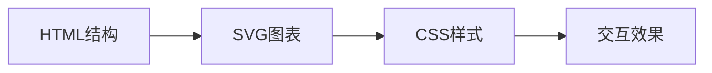
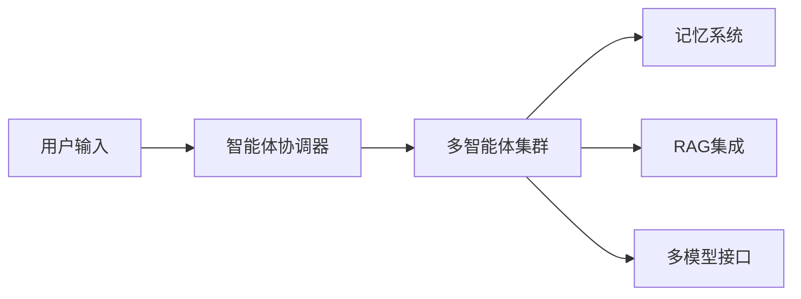
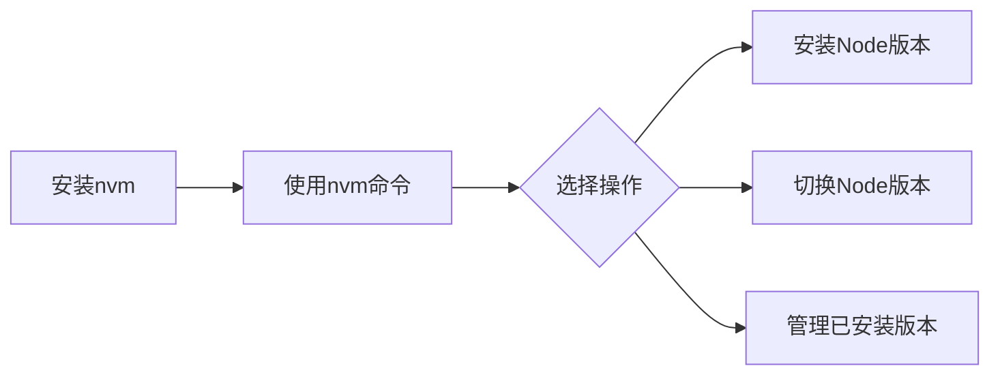

## 今日热点

AI Agent与Claude Code生态爆发式增长，开发者构建技能库与性能优化系统，推动AI辅助开发工具迈向专业化与实用化。

---

## 热门项目一览

| 排名 | 项目 | 语言 | 今日 | 总计 | 简介 |
|:---:|------|:----:|------:|-----:|------|
| 1 | [DietrichGebert/ponytail](https://github.com/DietrichGebert/ponytail) | JavaScript | +2,845 | 128,005 | Makes your AI agent think l... |
| 2 | [mattpocock/skills](https://github.com/mattpocock/skills) | Shell | +2,692 | 252,714 | Skills for Real Engineers. ... |
| 3 | [affaan-m/ECC](https://github.com/affaan-m/ECC) | JavaScript | +1,314 | 249,955 | The agent harness performan... |
| 4 | [blader/humanizer](https://github.com/blader/humanizer) | Python | +990 | 43,507 | Agent skill that removes si... |
| 5 | [cathrynlavery/diagram-design](https://github.com/cathrynlavery/diagram-design) | HTML | +855 | 31,717 | 38 editorial diagram types ... |
| 6 | [anomalyco/opencode](https://github.com/anomalyco/opencode) | TypeScript | +725 | 204,700 | The open source coding agent. |
| 7 | [magnitudedev/magnitude](https://github.com/magnitudedev/magnitude) | TypeScript | +674 | 3,233 | Open source inference serve... |
| 8 | [NousResearch/hermes-agent](https://github.com/NousResearch/hermes-agent) | Python | +575 | 242,040 | The agent that grows with you |
| 9 | [anthropics/skills](https://github.com/anthropics/skills) | Python | +475 | 174,582 | Public repository for Agent... |
| 10 | [humanlayer/skills](https://github.com/humanlayer/skills) | TypeScript | +442 | 2,729 | No description |
| 11 | [bikini/exploitarium](https://github.com/bikini/exploitarium) | Python | +230 | 4,714 | A single archive of public ... |
| 12 | [ruvnet/ruflo](https://github.com/ruvnet/ruflo) | TypeScript | +136 | 70,708 | 🌊 The original agent meta-h... |

---

## 趋势洞察

```
┌─────────────────────────────────────────────────────────────────┐
│  AI/ML 工具         ████████████████████████  11 个项目        │
│  其他               ████████                  4 个项目        │
│  开发工具             ██                        1 个项目        │
└─────────────────────────────────────────────────────────────────┘
```

---

## 项目深度解读

### 1. DietrichGebert/ponytail — AI代码助手

> **一句话总结**：让AI代理像最懒的高级开发者一样思考，自动化生成最优代码，减少手动编写量。

#### 价值主张

| 维度 | 说明 |
|------|------|
| **解决痛点** | 解决重复性编码工作多、开发效率低的问题 |
| **目标用户** | 开发者、AI应用构建者、自动化流程需求方 |
| **核心亮点** | 智能代码生成 + 自动化优化 + 开发效率提升 |

#### 技术架构


**技术特色**：
- 基于JavaScript的AI代码生成引擎
- 模拟"懒人"开发者的优化思维
- 自动化代码优化与重构

#### 热度分析

- 项目拥有超过12.8万星，近期单日增长2845星，表明热度持续攀升
- 无开放问题(issue)，说明项目成熟度高，用户反馈良好

#### 快速上手

```bash
# 安装ponytail
npm install ponytail

# 使用ponytail生成代码
ponytail --prompt "创建一个React组件"
```

#### 注意事项

- 项目许可证未知，使用前需确认授权方式
- 可能需要AI服务API密钥才能使用完整功能
- 作为AI辅助工具，生成的代码需要人工审查


### 2. mattpocock/skills — 工程师技能库

> **一句话总结**：收集整理工程师日常工作中实用的Shell脚本和命令，提高工作效率和自动化能力。

#### 价值主张

| 维度 | 说明 |
|------|------|
| **解决痛点** | 为工程师提供现成的实用脚本和命令，避免重复造轮子 |
| **目标用户** | 软件开发工程师、系统管理员、DevOps工程师 |
| **核心亮点** | 实用性强 + 涵盖面广 + 持续更新 + 开源免费 |

#### 技术架构

**技术特色**：
- 轻量级Shell脚本，无需复杂依赖
- 模块化设计，便于按需使用
- 命令行工具，与现有工作流无缝集成

#### 热度分析

- Star数高达25万+，且单日新增近2700，表明项目具有极高人气和实用价值
- Fork数与Star数比例合理，说明项目被广泛使用而非仅收藏
- Issues数为0，可能表明问题通过其他渠道解决或项目设计简单不易出错

#### 快速上手

```bash
git clone https://github.com/mattpocock/skills.git
cd skills
ls  # 查看可用脚本
```

#### 注意事项

- 需要基本的Shell脚本知识才能理解和使用
- 使用前应检查脚本兼容性和安全性
- 可能需要根据个人环境进行适当调整


### 3. affaan-m/ECC — 智能编程优化系统

> **一句话总结**：AI编程助手性能优化系统，提升Claude、Codex等工具的技能、本能与安全性能。

#### 价值主张

| 维度 | 说明 |
|------|------|
| **解决痛点** | AI编程助手性能低下，缺乏系统优化框架 |
| **目标用户** | 开发者，使用AI编程辅助工具的用户 |
| **核心亮点** | 技能优化 + 本能增强 + 记忆系统 + 安全保障 + 研究导向开发 |

#### 技术架构


**技术特色**：
- 多AI工具统一优化框架
- 技能与本能协同处理机制
- 安全与记忆双保险系统

#### 热度分析

- 超过25万星，近期增长迅猛，日均增加1300+星
- 无公开问题，表明项目已成熟稳定或采用其他沟通渠道

#### 快速上手

```bash
# 克隆仓库
git clone https://github.com/affaan-m/ECC.git

# 安装依赖
npm install

# 配置AI工具
npm run config
```

#### 注意事项

- 项目许可证未知，使用前需确认授权条款
- 集成多个AI工具可能需要额外配置API密钥
- 项目无公开问题，可能需要通过其他渠道获取支持


### 4. blader/humanizer — AI文本去机械化

> **一句话总结**：去除AI生成文本中的机械感，使其更接近自然人类写作风格

#### 价值主张

| 维度 | 说明 |
|------|------|
| **解决痛点** | 消除AI文本的机械感和可识别性，提升文本自然度 |
| **目标用户** | 内容创作者、AI文本使用者、需生成自然文本的开发者 |
| **核心亮点** | 智能特征识别 + 语义保持 + 多种处理模式 + 简单易用 |

#### 技术架构


**技术特色**：
- 基于深度学习的文本风格转换技术
- 智能识别并消除AI生成文本的常见特征模式
- 在保持原文语义的同时提升文本自然度

#### 热度分析

- 项目Star数高达43,507且近期增长迅速(+990 today)，显示AI文本去机械化需求旺盛
- Fork数相对较少(3,647)，表明用户更倾向于直接使用而非二次开发，工具属性强

#### 快速上手

```bash
# 安装
pip install humanizer

# 使用示例
python -m humanizer --input "AI生成的文本" --output "处理后文本"
```

#### 注意事项

- 使用此工具时需注意版权和伦理问题，避免滥用
- 可能无法完全消除所有AI特征，效果取决于原始文本质量和处理参数
- 建议在使用前测试不同参数以获得最佳效果


### 5. cathrynlavery/diagram-design — 编辑图表库

> **一句话总结**：提供38种精美编辑图表类型，纯HTML/SVG实现，无需依赖。

#### 价值主张

| 维度 | 说明 |
|------|------|
| **解决痛点** | 解决专业图表设计依赖复杂工具和库的问题 |
| **目标用户** | 需要高质量图表的前端开发者、设计师和内容创作者 |
| **核心亮点** | 纯HTML/SVG实现 + 38种专业图表类型 + 自包含设计 |

#### 技术架构



**技术特色**：
- 纯HTML/SVG实现，无需额外依赖
- 模块化设计，每种图表类型独立可复用
- 无阴影设计，保持简洁专业风格

#### 热度分析

- 项目获得31,717星，近期增长迅速(+855)，表明社区高度认可
- 零开放问题，显示项目成熟度高，维护良好

#### 快速上手

```bash
# 克隆项目
git clone https://github.com/cathrynlavery/diagram-design.git

# 直接在浏览器中打开index.html查看所有图表类型
```

#### 注意事项

- 项目未明确许可证，使用前需确认授权方式
- 仅支持静态展示，不包含数据动态更新功能
- 需要一定HTML/CSS基础进行自定义修改


### 6. anomalyco/opencode — AI编程助手

> **一句话总结**：开源智能编程代理工具，通过AI辅助开发者高效编写、优化和管理代码。

#### 价值主张

| 维度 | 说明 |
|------|------|
| **解决痛点** | 提升编程效率，解决代码质量问题，减少重复性编码工作 |
| **目标用户** | 专业开发者、编程学习者、代码审查人员 |
| **核心亮点** | 智能代码生成 + 多语言支持 + 上下文理解 + 自动优化 + 代码解释 |

#### 技术架构


**技术特色**：
- 基于大语言模型的代码理解与生成能力
- 支持多种编程语言的无缝切换
- 深度理解项目上下文，提供个性化建议

#### 热度分析

- 项目Star数突破20万，日增700+，呈现爆发式增长态势
- 社区活跃度高，Fork比例适中，表明工具实用性强且易于贡献

#### 快速上手

```bash
# 安装
npm install -g @anomalyco/opencode

# 初始化项目
opencode init

# 开始辅助编程
opencode "实现一个快速排序算法"
```

#### 注意事项

- 需要稳定网络连接以调用AI模型
- 生成的代码需要人工审核，不能完全依赖自动生成
- 建议在非生产环境中先测试生成的代码质量


### 7. magnitudedev/magnitude — 本地模型推理服务器

> **一句话总结**：开源推理服务器，在本地硬件上运行最佳AI模型，无缝集成现有代理工具。

#### 价值主张

| 维度 | 说明 |
|------|------|
| **解决痛点** | 解决本地AI模型部署和集成的复杂性，让用户能轻松在本地运行最佳模型 |
| **目标用户** | 需要本地部署AI模型进行推理的开发者和AI应用用户 |
| **核心亮点** | 自动选择最佳本地模型 + 多种代理工具兼容 + 轻量级部署 |

#### 技术架构


**技术特色**：
- 硬件自适应模型选择机制
- 轻量级本地推理架构设计
- 多代理工具统一兼容接口
- TypeScript实现跨平台支持

#### 热度分析

- Star数3,233且近期增长674，表明项目受到社区高度关注和认可
- 零Open Issues反映项目维护良好，问题解决效率高

#### 快速上手

```bash
# 克隆项目
git clone https://github.com/magnitudedev/magnitude.git

# 安装依赖
npm install

# 启动服务
npm start
```

#### 注意事项

- 许可证信息不明确，使用前需确认
- 可能需要配置模型文件和代理工具集成
- 需要确认具体的硬件兼容性要求


### 8. NousResearch/hermes-agent — 成长型智能代理

> **一句话总结**：一个能够自主学习、不断成长的智能代理系统，适应多样化任务需求。

#### 价值主张

| 维度 | 说明 |
|------|------|
| **解决痛点** | 智能代理系统缺乏持续学习和适应能力，难以处理多样化任务 |
| **目标用户** | AI研究人员、开发者和需要智能自动化解决方案的企业 |
| **核心亮点** | 自主学习能力 + 适应性架构 + 模块化设计 + 可扩展性 |

#### 技术架构


**技术特色**：
- 基于强化学习的自适应决策机制
- 模块化设计支持灵活扩展
- 多任务学习框架，实现知识迁移

#### 热度分析

- 项目Star数高达24万，日增575，呈现快速增长态势，表明市场认可度高
- Fork数近5万，社区活跃度高，在AI代理领域具有重要生态地位

#### 快速上手

```bash
# 安装依赖
pip install hermes-agent

# 初始化配置
hermes-init --config basic_config.yaml

# 运行示例任务
hermes-run --task example_task
```

#### 注意事项

- 项目依赖较多Python库，安装前需检查环境兼容性
- 由于项目持续更新，建议关注最新文档和API变更


### 9. anthropics/skills — AI技能库

> **一句话总结**：Anthropic官方开源的AI Agent技能组件库，提供可组合的能力模块。

#### 价值主张

| 维度 | 说明 |
|------|------|
| **解决痛点** | 为AI Agent提供标准化、可复用的能力组件库 |
| **目标用户** | AI Agent开发者、研究人员和集成工程师 |
| **核心亮点** | 模块化设计 + 开源生态 + Anthropic官方背书 + 易于扩展 |

#### 技术架构


**技术特色**：
- 基于Python的轻量级实现
- 支持技能动态注册与组合
- 与Anthropic Claude模型深度集成

#### 热度分析

- 作为Anthropic官方项目，获得超高关注度，日均增长近500星
- 在AI Agent开发领域具有标杆地位，引领技能组件标准化

#### 快速上手

```bash
# 安装技能库
pip install anthropic-skills

# 初始化技能
from anthropic_skills import SkillRegistry
registry = SkillRegistry()

# 注册并使用技能
registry.register("web_search", WebSearchSkill())
agent = ClaudeAgent(registry)
```

#### 注意事项

- 需要Anthropic API密钥才能使用完整功能
- 技能库可能与特定版本的Claude模型绑定，使用前需确认兼容性
- 作为项目初期版本，API可能存在变更风险


### 10. humanlayer/skills — AI技能库

> **一句话总结**：一个用于构建AI助手可执行技能的开源库，使AI能够执行实际操作。

#### 价值主张

| 维度 | 说明 |
|------|------|
| **解决痛点** | 解决AI助手无法执行实际操作的问题 |
| **目标用户** | AI应用开发者和需要AI执行实际任务的团队 |
| **核心亮点** | + 易于集成到现有AI系统 + 支持多种技能扩展 + 提供安全执行环境 |

#### 技术架构


**技术特色**：
- 基于TypeScript开发，提供类型安全
- 模块化技能设计，支持自定义扩展
- 提供技能执行的安全隔离机制

#### 热度分析

- 项目近期获得大量关注，Star数快速增长，表明AI技能库领域需求旺盛
- Fork数相对较少，说明项目可能处于早期阶段，社区生态正在形成

#### 快速上手

```bash
# 安装依赖
npm install @humanlayer/sdk

# 初始化技能库
npx humanlayer init

# 添加新技能
npx humanlayer add skill-name
```

#### 注意事项

- 需要谨慎处理技能执行的安全权限问题
- 技能库可能需要与特定的AI框架配合使用
- 项目文档可能还不够完善，建议查看最新代码示例


### 11. bikini/exploitarium — 漏洞利用库

> **一句话总结**：公开漏洞利用概念验证与研究集合，降低安全研究入门门槛，促进漏洞共享与发现。

#### 价值主张

| 维度 | 说明 |
|------|------|
| **解决痛点** | 集中化收集分散的漏洞利用资源，减少研究人员查找POC的时间成本 |
| **目标用户** | 安全研究员、渗透测试人员、漏洞赏金猎人、网络安全学生 |
| **核心亮点** | + 集中化漏洞资源库 + 包含详细研究报告 + 鼓励社区贡献CVE |

#### 技术架构


**技术特色**：
- 聚合多种漏洞类型的POC代码与研究文档
- 结构化组织便于快速查找和参考特定漏洞
- 包含详细漏洞分析报告，提供上下文信息

#### 热度分析

- 项目获4714星标且单日增长230星，显示在安全研究社区高度关注
- 1253个分叉表明社区积极参与资源扩展与二次开发

#### 快速上手

```bash
# 克隆项目仓库
git clone https://github.com/bikini/exploitarium.git

# 浏览目录结构查看不同类型的漏洞利用
cd exploitarium && find . -type f -name "*.py" | head -10
```

#### 注意事项

- 这些漏洞利用代码仅用于安全研究和授权测试，未经授权使用可能导致法律问题
- 使用前应充分理解代码逻辑，避免在未授权环境中执行
- 项目中的漏洞可能已被修复，使用前应检查目标系统是否已打补丁
- 作者提醒不要滥用这些资源，应负责任地使用和报告漏洞


### 12. ruvnet/ruflo — 智能体框架

> **一句话总结**：一个支持多智能体协作、自适应记忆和RAG集成的AI代理元工具包。

#### 价值主张

| 维度 | 说明 |
|------|------|
| **解决痛点** | 简化复杂AI系统构建，解决多智能体协调与自主工作流管理难题 |
| **目标用户** | AI开发者、多智能体系统研究人员、高级AI集成企业 |
| **核心亮点** | 多智能体协作 + 自适应记忆 + RAG集成 + 多模型支持 + 自主工作流 |

#### 技术架构



**技术特色**：
- 基于TypeScript构建，提供类型安全开发环境
- 支持Claude、Codex、Hermes等多种AI模型原生集成
- 自适应记忆系统增强长期交互与学习能力

#### 热度分析

- 项目获7万+星标，日增136星，表明正处于活跃增长期
- 0开放问题反映项目维护良好，社区问题解决效率高

#### 快速上手

```bash
# 安装ruflo
npm install ruflo

# 初始化项目
ruflo init

# 启动代理系统
ruflo start
```

#### 注意事项

- 项目许可证未知，商业使用前需确认授权情况
- 项目依赖多种AI模型，需确保有相应的API访问权限
- 由于是复杂系统，可能需要较高的技术理解能力与配置经验


### 13. fmtlib/fmt — C++格式化库

> **一句话总结**：高性能、类型安全的C++格式化库，提供类Python风格的字符串格式化功能

#### 价值主张

| 维度 | 说明 |
|------|------|
| **解决痛点** | 替代printf和iostream，解决类型安全与性能问题 |
| **目标用户** | C++开发者，特别是系统级应用开发者 |
| **核心亮点** | 类型安全 + 高性能 + 编译时检查 + 无依赖 + 跨平台 |

#### 技术架构


**技术特色**：
- 编译时格式字符串检查，避免运行时错误
- 完全类型安全的参数处理，杜绝printf族的常见错误
- 高性能实现，比标准库格式化快很多

#### 热度分析

- 拥有25k+星标，增长稳定，表明在C++社区中广受认可
- 已被Abseil、Spotify等众多知名项目采用，成为行业标准解决方案

#### 快速上手

```bash
# 安装fmt
git clone https://github.com/fmtlib/fmt.git
cd fmt
mkdir build && cd build
cmake ..
make

# 使用示例
#include <fmt/core.h>
int main() {
    std::string result = fmt::format("The answer is {}", 42);
    fmt::print("Result: {}\n", result);
    return 0;
}
```

#### 注意事项

- 需要C++11或更高版本支持
- 对于嵌入式系统，可能需要配置以减小代码体积
- 某些高级功能可能需要特定编译器支持


### 14. WorldFlowAI/everything-claude-code — AI开发工具包

> **一句话总结**：提供Claude AI开发的完整工具链，包含agents、commands、skills等组件，提升AI辅助开发效率。

#### 价值主张

| 维度 | 说明 |
|------|------|
| **解决痛点** | 简化与Claude AI的集成开发流程，提供标准化工具组件 |
| **目标用户** | AI辅助开发者、Claude AI使用者、自动化工具开发者 |
| **核心亮点** | 模块化设计 + 可扩展架构 + 开箱即用组件 + 规则引擎 + 钩子系统 |

#### 技术架构


**技术特色**：
- 基于JavaScript的模块化架构设计
- 提供可扩展的组件系统
- 支持自定义规则和钩子机制

#### 热度分析

- 项目获得2374个star，且近期增长迅速(+95 today)，表明社区对该项目高度关注
- 363个fork数显示开发者群体积极参与，项目具有良好的社区参与度

#### 快速上手

```bash
npm install everything-claude-code
# 或
git clone https://github.com/WorldFlowAI/everything-claude-code.git
cd everything-claude-code
npm install
```

#### 注意事项

- 项目许可证信息未知，使用前需确认许可条款
- 项目依赖Claude AI，需要相应的API访问权限
- 由于Open Issues为0，可能项目处于早期阶段，社区支持有限


### 15. BraveOPotato/FckSignups — 免注册工具集

> **一句话总结**：汇集无需注册的开源浏览器工具，解决用户隐私顾虑和使用门槛问题。

#### 价值主张

| 维度 | 说明 |
|------|------|
| **解决痛点** | 解决用户需要繁琐注册才能使用工具的问题 |
| **目标用户** | 注重隐私、追求效率的开发者和普通用户 |
| **核心亮点** | 无需注册 + 开源免费 + 浏览器即用 + 保护隐私 + 工具多样 |

#### 技术架构

**技术特色**：
- 基于TypeScript构建，确保代码质量
- 轻量级实现，专注于工具列表的展示
- 采用静态网站生成器，快速部署

#### 热度分析

- 项目Star数近3000且持续增长，表明用户对免注册工具有强烈需求
- Fork数相对较少，说明项目更多作为参考资源而非二次开发目标

#### 快速上手

```bash
# 克隆仓库
git clone https://github.com/BraveOPotato/FckSignups.git

# 浏览项目目录查看工具列表
cd FckSignups && ls
```

#### 注意事项

- 工具链接可能需要定期验证，确保可用性
- 部分工具可能有功能限制，因为无需注册版本通常功能较少
- 使用时需注意工具的安全性和隐私政策


### 16. nvm-sh/nvm — Node版本管理

> **一句话总结**：一个POSIX兼容的bash脚本，可同时管理多个Node.js版本，简化开发环境配置。

#### 价值主张

| 维度 | 说明 |
|------|------|
| **解决痛点** | 解决同一机器上多Node版本共存和切换问题，避免版本冲突 |
| **目标用户** | 需要使用多个Node版本的前后端开发者及DevOps工程师 |
| **核心亮点** | 版本隔离 + 轻松切换 + 自动安装 + 命令行友好 + 环境配置 |

#### 技术架构



**技术特色**：
- 纯Shell脚本实现，无需额外依赖
- 通过环境变量和路径管理实现版本隔离
- 支持从官方源或自定义源下载Node.js二进制文件

#### 热度分析

- 高星项目(94,925 stars)持续稳定增长，日均22 stars，表明Node.js开发社区对其高度认可
- 作为Node.js生态的基础工具，已成为前端开发的标准配置之一，社区活跃度高

#### 快速上手

```bash
# 安装nvm
curl -o- https://raw.githubusercontent.com/nvm-sh/nvm/v0.39.0/install.sh | bash

# 加载nvm到当前shell
export NVM_DIR="$HOME/.nvm"
[ -s "$NVM_DIR/nvm.sh" ] && \. "$NVM_DIR/nvm.sh"

# 安装并使用Node.js
nvm install 16
nvm use 16
```

#### 注意事项

- 安装后需要重新加载shell环境或重启终端才能使用nvm命令
- 在某些系统上可能需要配置shell配置文件(.bashrc, .zshrc等)以确保nvm自动加载
- 使用nvm时，Node.js的npm会被安装到特定版本的目录中，不同版本间的npm是独立的


## 今日推荐

| 主题 | 推荐项目 | 亮点 |
|------|----------|------|
| 今日最热 | [DietrichGebert/ponytail](https://github.com/DietrichGebert/ponytail) | Makes your AI age... |
| 值得关注 | [mattpocock/skills](https://github.com/mattpocock/skills) | Skills for Real E... |
| 快速上手 | [affaan-m/ECC](https://github.com/affaan-m/ECC) | The agent harness... |
| 长期潜力 | [blader/humanizer](https://github.com/blader/humanizer) | Agent skill that ... |

---

<div align="center">

*Generated on 2026-09-06 | Powered by GitHub Trending Reporter*

</div>