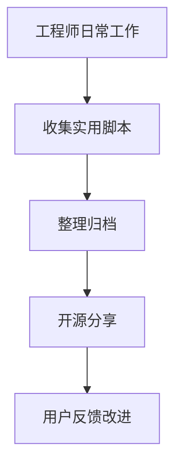
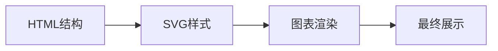
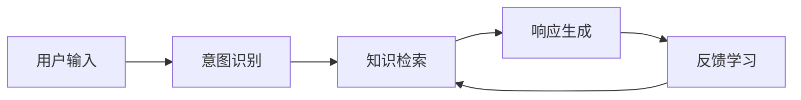
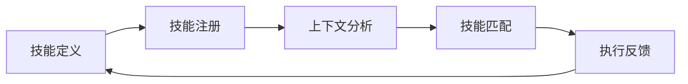
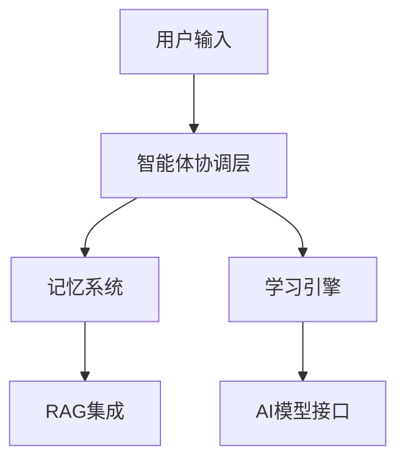
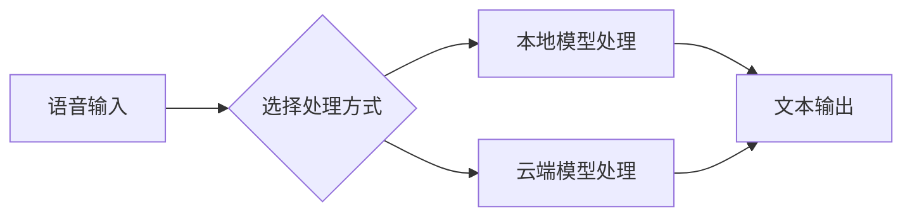

## 今日热点

今日GitHub热榜聚焦AI代理生态系统爆发式增长，各类技能库与优化工具涌现，同时本地化模型应用和无注册工具需求上升，反映了AI开发工具链的成熟与多元化。

---

## 热门项目一览

| 排名 | 项目 | 语言 | 今日 | 总计 | 简介 |
|:---:|------|:----:|------:|-----:|------|
| 1 | [mattpocock/skills](https://github.com/mattpocock/skills) | Shell | +2,207 | 254,693 | Skills for Real Engineers. ... |
| 2 | [DietrichGebert/ponytail](https://github.com/DietrichGebert/ponytail) | JavaScript | +1,539 | 129,486 | Makes your AI agent think l... |
| 3 | [affaan-m/ECC](https://github.com/affaan-m/ECC) | JavaScript | +1,485 | 251,435 | The agent harness performan... |
| 4 | [blader/humanizer](https://github.com/blader/humanizer) | Python | +748 | 44,317 | Agent skill that removes si... |
| 5 | [cathrynlavery/diagram-design](https://github.com/cathrynlavery/diagram-design) | HTML | +620 | 32,444 | 38 editorial diagram types ... |
| 6 | [magnitudedev/magnitude](https://github.com/magnitudedev/magnitude) | TypeScript | +604 | 3,703 | Open source inference serve... |
| 7 | [anomalyco/opencode](https://github.com/anomalyco/opencode) | TypeScript | +551 | 205,290 | The open source coding agent. |
| 8 | [NousResearch/hermes-agent](https://github.com/NousResearch/hermes-agent) | Python | +520 | 242,581 | The agent that grows with you |
| 9 | [humanlayer/skills](https://github.com/humanlayer/skills) | TypeScript | +451 | 3,171 | No description |
| 10 | [BraveOPotato/FckSignups](https://github.com/BraveOPotato/FckSignups) | TypeScript | +436 | 3,341 | A list of tools that are op... |
| 11 | [coreyhaines31/marketingskills](https://github.com/coreyhaines31/marketingskills) | JavaScript | +329 | 47,549 | Marketing skills for Claude... |
| 12 | [ruvnet/ruflo](https://github.com/ruvnet/ruflo) | TypeScript | +276 | 71,003 | 🌊 The original agent meta-h... |

---

## 趋势洞察

```
┌─────────────────────────────────────────────────────────────────┐
│  AI/ML 工具         ████████████████████████  15 个项目        │
│  其他               ███                       2 个项目        │
│  开发工具             █                         1 个项目        │
└─────────────────────────────────────────────────────────────────┘
```

---

## 项目深度解读

### 1. mattpocock/skills — 工程师技能库

> **一句话总结**：实战验证的Shell脚本集合，直接从工程师日常工作中提取，提升命令行效率。

#### 价值主张

| 维度 | 说明 |
|------|------|
| **解决痛点** | 提供经过实战验证的Shell脚本，避免重复造轮子 |
| **目标用户** | 需要提高Shell脚本能力和命令行效率的开发者 |
| **核心亮点** | 实战验证 + 日常提取 + 高效实用 + 简洁明了 |

#### 技术架构



**技术特色**：
- 纯Shell脚本实现，跨平台兼容性好
- 小巧精悍的单一功能脚本集合
- 注重实用性和效率的命令行工具

#### 热度分析

- Star数超25万，日增2000+，表明在开发者社区中广受欢迎
- Fork与Star比例约1:12，说明项目以使用为主，二次开发相对较少

#### 快速上手

```bash
git clone https://github.com/mattpocock/skills.git
cd skills && ls -la
```

#### 注意事项

- 项目未明确许可证，使用前需确认授权条款
- Shell脚本可能需要根据不同环境进行适当调整
- 建议在使用前理解脚本内容，避免潜在的安全风险


### 2. DietrichGebert/ponytail — AI代码助手

> **一句话总结**：让AI代理模拟资深开发者思维，以最小化代码量实现最大功能价值。

#### 价值主张

| 维度 | 说明 |
|------|------|
| **解决痛点** | 减少重复编码工作，通过AI智能生成高质量代码 |
| **目标用户** | 开发者、AI工具使用者、自动化流程构建者 |
| **核心亮点** | 资深开发思维模拟 + 代码智能生成 + 开发效率提升 + 极简主义设计 |

#### 技术架构


**技术特色**：
- JavaScript轻量级实现，便于集成到各种开发环境
- 模拟资深开发者的问题解决思路和代码优化经验
- 采用最小化代码原则，避免过度工程化

#### 热度分析

- 项目获得12.9万Stars，日增1500+，表明开发者社区对其高度认可
- 近7000次Fork显示项目有较强的可扩展性和二次开发潜力

#### 快速上手

```bash
# 安装ponytail
npm install ponytail

# 基本使用
const ponytail = require('ponytail');
const result = ponytail.think('实现一个用户登录功能');
console.log(result);
```

#### 注意事项

- 项目许可证未知，商业使用前需确认授权条款
- AI生成代码可能需要人工审核和调整，不适合直接用于关键系统
- 可能需要额外的AI模型或API支持才能完全发挥功能


### 3. affaan-m/ECC — AI代理优化

> **一句话总结**：为AI代码助手提供性能优化，提升开发效率的JavaScript系统。

#### 价值主张

| 维度 | 说明 |
|------|------|
| **解决痛点** | AI代码助手响应慢、资源占用高、记忆能力有限 |
| **目标用户** | 使用Claude Code、Codex、Cursor等AI开发工具的开发者 |
| **核心亮点** | 技能优化 + 本能反应增强 + 记忆系统提升 + 安全强化 + 研究优先开发 |

#### 技术架构


**技术特色**：
- 采用JavaScript实现跨平台兼容性
- 集成多种AI开发工具接口
- 优化AI代理的资源使用效率
- 实现记忆系统的持久化与检索优化
- 提供安全检查与防护机制

#### 热度分析

- 项目获得25万+星标，近1485/日增长，显示开发社区高度认可
- Fork数与Star数比例约为15%，表明用户不仅关注更积极参与使用

#### 快速上手

```bash
# 克隆项目
git clone https://github.com/affaan-m/ECC.git

# 安装依赖
npm install

# 启动服务
npm start
```

#### 注意事项

- 项目许可证未知，使用前需确认授权条款
- 项目没有开放的Issues，可能通过其他渠道提供支持
- 需要配合特定的AI开发工具使用才能发挥最佳效果


### 4. blader/humanizer — AI文本去痕

> **一句话总结**：一款智能工具，通过处理文本特征消除AI生成痕迹，使内容更自然人性化。

#### 价值主张

| 维度 | 说明 |
|------|------|
| **解决痛点** | AI生成文本缺乏人类写作的自然性和个性化特征 |
| **目标用户** | 内容创作者、营销人员、AI工具使用者 |
| **核心亮点** | 智能识别AI特征 + 自然化处理文本 + 保持原文语义 |

#### 技术架构


**技术特色**：
- 基于深度学习的文本特征分析技术
- 高效的语义保持与自然化转换算法
- 灵活的API接口与多种使用场景支持

#### 热度分析

- 项目获得44,317个Star，近期增长748，表明项目热度高且持续增长。
- 零Open Issues显示项目维护良好，用户反馈问题少，已进入稳定阶段。

#### 快速上手

```bash
# 安装humanizer
pip install humanizer

# 使用humanizer处理文本
python -m humanizer --input "AI生成的文本" --output "处理后的文本"
```

#### 注意事项

- 注意保护文本版权和隐私，确保合法使用
- 处理后文本可能仍保留部分AI特征，建议结合人工审核
- 遵守相关平台的内容规范，避免滥用导致账号风险


### 5. cathrynlavery/diagram-design — 专业图表设计库

> **一句话总结**：纯HTML/SVG实现的38种专业图表库，为代码编辑环境提供高质量、无阴影的编辑式图表。

#### 价值主张

| 维度 | 说明 |
|------|------|
| **解决痛点** | 解决现有图表库风格不统一、依赖复杂、阴影过多的问题 |
| **目标用户** | 开发者、技术文档编写者、需要高质量图表的设计师 |
| **核心亮点** | 纯HTML/SVG实现 + 38种专业图表类型 + 无阴影设计 + 自包含 |

#### 技术架构



**技术特色**：
- 纯前端实现，无需服务器支持
- 自包含设计，便于集成到各种项目中
- 精简的样式设计，去除不必要的阴影效果
- 专为代码编辑环境优化

#### 热度分析

- Star数超过3.2万，近期每日增长600+，表明项目热度极高
- 零Open Issues，说明项目维护良好，用户问题得到及时解决

#### 快速上手

```html
<!-- 引入图表库 -->
<script src="diagram-design.js"></script>

<!-- 创建图表容器 -->
<div id="chart"></div>

<!-- 初始化图表 -->
<script>
  new Diagram('chart', 'flowchart', options);
</script>
```

#### 注意事项

- 项目许可证未知，商业使用前需要确认授权
- 仅适用于支持HTML/SVG的现代浏览器
- 不支持Mermaid语法，需要学习新的图表定义方式


### 6. magnitudedev/magnitude — 本地模型推理服务器

> **一句话总结**：开源推理服务器，在本地硬件上运行最佳模型，无缝集成现有AI代理。

#### 价值主张

| 维度 | 说明 |
|------|------|
| **解决痛点** | 解决本地模型部署困难，优化硬件利用率问题 |
| **目标用户** | 开发者、AI研究人员、本地AI应用构建者 |
| **核心亮点** | 自动选择最佳本地模型 + 多代理兼容性 + 硬件优化 + 开源免费 + 易于集成 |

#### 技术架构


**技术特色**：
- 自动检测硬件并选择最适合的本地模型
- 支持多种AI代理的无缝集成
- 优化本地模型推理性能

#### 热度分析

- 项目近期热度显著增长，单日新增Star数达604，表明社区关注度快速提升
- 作为本地AI推理解决方案，处于AI工具生态前沿，吸引关注隐私和离线使用的用户

#### 快速上手

```bash
# 克隆仓库
git clone https://github.com/magnitudedev/magnitude.git

# 安装依赖并启动
cd magnitude && npm install && npm start
```

#### 注意事项

- 项目许可证未知，商业使用前需确认授权条款
- 本地模型运行效果取决于硬件配置，建议根据设备性能选择适当模型
- 与多种AI代理兼容性可能随版本更新而变化，需关注兼容性更新


### 7. anomalyco/opencode — 智能编程助手

> **一句话总结**：AI驱动的开源编程代理工具，自动生成和优化代码，提升开发效率

#### 价值主张

| 维度 | 说明 |
|------|------|
| **解决痛点** | 解决开发者编码效率低、重复工作多的问题 |
| **目标用户** | 专业开发者、开源贡献者、编程学习者 |
| **核心亮点** | AI代码生成 + 多语言支持 + 自动优化 + 智能重构 |

#### 技术架构


**技术特色**：
- 基于大型语言模型的代码理解与生成
- 支持多种编程语言的智能解析与转换
- 集成主流开发环境与版本控制系统

#### 热度分析

- 高达20万+星标，日增500+，显示极高的社区认可度和使用价值
- 2.6万+次Fork，表明开发者社区积极参与项目扩展与定制

#### 快速上手

```bash
# 安装OpenCode
npm install -g opencode

# 初始化项目
opencode init my-project

# 启动开发助手
opencode dev
```

#### 注意事项

- 项目许可证信息不明确，使用前需确认合规性
- 代码生成质量依赖于模型训练数据，可能存在安全风险
- 适用于辅助开发，但不建议完全替代人工代码审查


### 8. NousResearch/hermes-agent — 自成长智能体

> **一句话总结**：一个能够随着用户使用不断学习和进化的智能代理系统

#### 价值主张

| 维度 | 说明 |
|------|------|
| **解决痛点** | 解决AI代理系统难以适应不同用户需求的局限性 |
| **目标用户** | 开发者、研究人员和企业用户 |
| **核心亮点** | 自学习能力 + 个性化适应 + 持续进化 + 多领域应用 |

#### 技术架构



**技术特色**：
- 采用持续学习机制，实现知识不断更新
- 模块化设计支持多种任务场景
- 分布式架构确保高性能处理

#### 热度分析

- 项目Star数增长迅速，单日新增520+，显示高度活跃
- 高Fork/Star比例表明项目在开发者社区中具有广泛影响力

#### 快速上手

```bash
# 安装依赖
pip install hermes-agent

# 初始化代理
hermes init

# 启动代理服务
hermes serve --port 8000
```

#### 注意事项
- 项目许可证未知，使用前需确认授权条款
- 依赖的AI模型可能需要额外配置API密钥
- 自学习功能需要足够多的交互数据才能发挥最佳效果


### 9. humanlayer/skills — 人机技能库

> **一句话总结**：构建AI助手的人类交互技能，实现自然流畅的人机对话体验。

#### 价值主张

| 维度 | 说明 |
|------|------|
| **解决痛点** | 解决AI助手缺乏人类交互技能和上下文理解的问题 |
| **目标用户** | AI应用开发者、智能助手构建者、人机交互研究员 |
| **核心亮点** | 技能可组合化 + 上下文感知 + 多模态交互支持 + 技能链式执行 |

#### 技术架构



**技术特色**：
- 采用TypeScript强类型系统确保技能接口一致性
- 技能组合引擎支持复杂交互流程构建
- 上下文感知机制实现精准技能选择

#### 热度分析

- 项目近期star增长迅速，显示人机交互领域热度攀升
- 作为新兴AI辅助工具，在开发者社区获得高度关注

#### 快速上手

```bash
# 安装humanlayer技能库
npm install humanlayer-skills

# 初始化新技能
npx humanlayer init my-skill

# 运行技能示例
npx humanlayer run examples/basic
```

#### 注意事项
- 技能开发需要理解人机交互设计原则
- 自定义技能需遵循预定义接口规范
- 生产环境使用前建议进行充分测试


### 10. BraveOPotato/FckSignups — 免注册工具集

> **一句话总结**：精选无需注册的开源在线工具，保护用户隐私并提供便捷体验。

#### 价值主张

| 维度 | 说明 |
|------|------|
| **解决痛点** | 解决用户不愿注册账号但仍需使用在线工具的痛点 |
| **目标用户** | 注重隐私、追求效率的开发者和普通用户 |
| **核心亮点** | 无需注册 + 开源工具 + 浏览器内使用 + 精选高质量 |

#### 技术架构


**技术特色**：
- 使用TypeScript确保代码质量
- 轻量级文档结构便于维护
- 社区驱动的内容更新机制

#### 热度分析

- 项目近期Star增长迅速，单日新增436星，表明需求强烈
- 作为实用型工具集合，具有高实用价值和分享价值

#### 快速上手

```bash
# 克隆项目
git clone https://github.com/BraveOPotato/FckSignups.git

# 查看工具列表
cat README.md
```

#### 注意事项

- 工具链接可能需要定期验证有效性
- 部分工具可能有使用限制或功能变化
- 贡献新工具时需确保符合开源、无注册要求


### 11. coreyhaines31/marketingskills — AI营销技能库

> **一句话总结**：为AI代理和开发者提供系统化营销技能资源，覆盖CRO、文案、SEO及增长工程。

#### 价值主张

| 维度 | 说明 |
|------|------|
| **解决痛点** | 弥补AI在营销领域的专业知识短板，提供结构化营销技能 |
| **目标用户** | AI开发者、营销人员、使用Claude Code的专业人士 |
| **核心亮点** | 全领域营销覆盖 + AI定制化内容 + 实用工具集成 |

#### 技术架构


**技术特色**：
- 结构化营销知识体系，便于AI理解和应用
- 跨领域营销技能整合，提供全方位解决方案
- 适配AI代理的特殊需求，优化知识表达方式

#### 热度分析

- 项目获得47,549个星标，近期增长迅速(+329/天)，显示AI营销领域需求旺盛
- 高star与fork比例(约6.4:1)，表明项目以内容价值为主，技术二次开发需求较低

#### 快速上手

```bash
# 克隆项目到本地
git clone https://github.com/coreyhaines31/marketingskills.git

# 浏览项目结构和营销技能内容
cd marketingskills && tree -L 2
```

#### 注意事项

- 项目许可证未知，商业使用前需确认授权条款
- 项目内容可能需要根据具体AI平台进行适配调整
- 营销策略和算法需定期更新以保持时效性


### 12. ruvnet/ruflo — AI智能体平台

> **一句话总结**：一个强大的多智能体框架，支持自适应记忆和RAG集成，可构建复杂的对话AI系统。

#### 价值主张

| 维度 | 说明 |
|------|------|
| **解决痛点** | 缺乏统一平台来部署和管理复杂的AI智能体系统 |
| **目标用户** | AI研究人员、开发者、构建对话AI系统的团队 |
| **核心亮点** | 自适应记忆 + 自学习智能 + RAG集成 + 多模型支持 + 智能体群体协调 |

#### 技术架构



**技术特色**：
- 自适应记忆系统，智能体可保留和利用历史交互
- 多模型集成，支持Claude Code、Codex、Hermes等多种AI
- 智能体群体协调，实现多智能体协同工作

#### 热度分析

- 项目获得71,003个Star且持续增长(+276 today)，表明其在AI智能体领域受到高度关注
- Fork数8,438说明社区活跃度高，被广泛用于二次开发和实验

#### 快速上手

```bash
# 安装ruflo
npm install ruflo

# 初始化项目
ruflo init my-agent-project

# 启动智能体
ruflo start
```

#### 注意事项

- 由于没有明确的许可证信息，使用前应确认其许可条款
- 项目涉及多种AI模型集成，可能需要相应的API密钥
- 项目文档可能不够完善，可能需要深入阅读源码以充分理解


### 13. aipoch/open-science — AI研究平台

> **一句话总结**：本地优先、模型无关的AI研究工作台，集成科学代理与可重现实验环境。

#### 价值主张

| 维度 | 说明 |
|------|------|
| **解决痛点** | 解决AI研究工具分散、环境不一致、实验难以复现的问题 |
| **目标用户** | 研究人员、数据科学家和AI实验开发者 |
| **核心亮点** | 本地优先架构 + 模型无关设计 + 科学代理集成 + 多语言支持 + 可重现实验追踪 |

#### 技术架构


**技术特色**：
- 基于TypeScript构建，实现跨平台兼容
- 本地优先架构，保障数据隐私与自主控制
- 模块化设计，支持多种AI模型无缝集成

#### 热度分析

- 项目Star数达3886且近期增长迅速，显示社区高度关注
- Fork数相对较少(239)，表明项目可能处于早期阶段但活跃度高

#### 快速上手

```bash
# 克隆仓库
git clone https://github.com/aipoch/open-science.git

# 安装依赖
npm install

# 启动应用
npm start
```

#### 注意事项

- 由于项目License未知，使用前需要确认许可证条款
- 项目处于早期阶段，API和功能可能会有较大变化


### 14. The-Swarm-Corporation/AutoHedge — AI对冲基金

> **一句话总结**：利用群体智能和AI代理技术，实现自动化市场分析、风险管理和交易执行的对冲基金系统。

#### 价值主张

| 维度 | 说明 |
|------|------|
| **解决痛点** | 降低对冲基金创建门槛，无需专业知识即可建立自动化交易系统 |
| **目标用户** | 个人投资者、量化交易爱好者、金融科技开发者 |
| **核心亮点** | AI代理决策 + 群体智能算法 + 自动化风险控制 + 快速部署 + 模块化设计 |

#### 技术架构


**技术特色**：
- 多智能体协同学习机制，提升市场适应性
- 自主进化式风险控制系统，动态调整策略
- 微服务架构设计，便于功能扩展和维护

#### 热度分析

- 项目Star数增长强劲，单日新增142个，显示社区关注度持续攀升
- 高Fork/Star比表明项目有较强实用性和二次开发价值

#### 快速上手

```bash
# 克隆项目
git clone https://github.com/The-Swarm-Corporation/AutoHedge.git

# 安装依赖
pip install -r requirements.txt

# 初始化配置
python setup.py init
```

#### 注意事项

- 项目许可证未知，使用前需确认授权条款
- 金融交易存在风险，建议先在模拟环境测试
- 项目无公开Issues，可能意味着社区支持有限或处于早期阶段


### 15. Stremio/stremio-web — 自由流媒体平台

> **一句话总结**：开源聚合流媒体平台，整合多源内容，提供统一观影体验。

#### 价值主张

| 维度 | 说明 |
|------|------|
| **解决痛点** | 打破流媒体平台壁垒，整合分散内容资源，一站式观影体验 |
| **目标用户** | 追求便捷多平台内容整合的影音爱好者和技术用户 |
| **核心亮点** | 跨平台内容聚合 + 插件扩展系统 + 个人化推荐 + 开源透明 |

#### 技术架构


**技术特色**：
- 基于 JavaScript 的全栈实现，确保跨平台兼容性
- 模块化插件架构，支持第三方扩展
- 响应式设计适配多终端设备

#### 热度分析

- 项目持续获得高关注度，近期增长稳定，表明用户认可度高
- 作为开源流媒体解决方案，在特定用户群体中具有较强影响力

#### 快速上手

```bash
# 克隆项目
git clone https://github.com/Stremio/stremio-web.git
# 安装依赖
npm install
# 启动开发服务器
npm start
```

#### 注意事项

- 项目使用未知许可证，使用前需确认授权条款
- 可能需要配置流媒体源和插件才能完全发挥功能
- 代码量较大，初次上手可能需要一定时间理解项目结构


### 16. OpenWhispr/openwhispr — 隐私语音转文

> **一句话总结**：注重隐私保护的跨平台语音转文本应用，支持本地和云端模型处理。

#### 价值主张

| 维度 | 说明 |
|------|------|
| **解决痛点** | 解决语音转文本中的隐私泄露风险和模型依赖限制 |
| **目标用户** | 注重数据隐私的专业人士，如法律、医疗领域工作者 |
| **核心亮点** | 本地处理 + 云端可选 + 跨平台支持 + 隐私优先 + 开源免费 |

#### 技术架构



**技术特色**：
- 基于Nvidia Parakeet/Whisper实现本地语音识别
- 提供BYOK(Bring Your Own Key)云端选项
- 跨平台JavaScript架构设计
- 隐私优先的数据处理流程

#### 热度分析

- 项目获7,410个star且持续增长(+121 today)，显示社区认可度高
- 932次fork表明社区有较强二次开发意愿和活跃度

#### 快速上手

```bash
# 克隆仓库
git clone https://github.com/OpenWhispr/openwhispr.git

# 安装依赖
npm install

# 启动应用
npm start
```

#### 注意事项

- 本地模型处理可能需要较强的计算资源支持
- 云端选项可能涉及额外费用，需注意使用成本
- 项目许可证信息不明确，使用前建议进一步核实
- 不同操作系统环境可能存在兼容性问题


### 17. openai/skills — AI 编程技能库

> **一句话总结**：一个结构化的 AI 编程技能目录，帮助开发者高效使用 Codex 模型完成编程任务。

#### 价值主张

| 维度 | 说明 |
|------|------|
| **解决痛点** | 提供结构化编程技能参考，解决 AI 辅助编程效率低下问题 |
| **目标用户** | AI 辅助编程的开发者和研究人员 |
| **核心亮点** | 结构化技能分类 + Codex 深度集成 + 社区驱动扩展 |

#### 技术架构


**技术特色**：
- 结构化技能分类体系，便于快速检索
- 与 OpenAI API 深度集成，提供精准代码生成
- 社区驱动的技能扩展机制，持续丰富技能库

#### 热度分析

- 高 Star 增长表明开发者对 AI 辅助编程工具的强烈需求
- 作为 OpenAI 官方项目，在 AI 编程领域具有标杆地位

#### 快速上手

```bash
# 克隆项目
git clone https://github.com/openai/skills.git

# 安装依赖
pip install -r requirements.txt

# 查看技能目录
python skills.py --list
```

#### 注意事项

- 需要确保有 OpenAI API 访问权限
- 技能效果可能因 Codex 版本更新而变化
- 建议结合具体开发场景选择合适的技能


### 18. llvm/llvm-project — 编译器基础设施

> **一句话总结**：提供模块化、高性能的编译器基础设施，支持多种编程语言和优化技术。

#### 价值主张

| 维度 | 说明 |
|------|------|
| **解决痛点** | 解决编译器开发复杂性和性能瓶颈，提供可重用的编译组件 |
| **目标用户** | 编译器开发者、编程语言设计者、系统软件工程师、研究人员 |
| **核心亮点** | 模块化架构 + LLVM IR中间表示 + 全面的优化框架 + 跨平台支持 + 活跃的社区生态 |

#### 技术架构


**技术特色**：
- 基于SSA的中间表示设计，提供强大的数据流分析能力
- 编译器即库(CAPI)架构，便于集成和扩展
- 全面的优化框架，支持从简单到复杂的各种优化技术

#### 热度分析
- 作为现代编译技术基石，持续获得高关注度，Star数稳定增长，反映其在开发者社区中的核心地位
- 在学术界和工业界均有广泛应用，是众多编程语言和编译器的底层支持

#### 快速上手

```bash
# 克隆LLVM项目
git clone https://github.com/llvm/llvm-project.git
cd llvm-project

# 创建构建目录并构建
mkdir build && cd build
cmake -G "Unix Makefiles" ../llvm
make -j4

# 使用Clang编译示例
cd ../examples/HelloWorld
build/bin/clang++ -o HelloWorld HelloWorld.cpp
./HelloWorld
```

#### 注意事项
- LLVM项目庞大且复杂，完整构建需要大量时间和系统资源
- 学习曲线较陡，建议从Clang等前端工具开始了解
- 不同组件间有复杂依赖关系，需谨慎处理版本兼容性问题


## 今日推荐

| 主题 | 推荐项目 | 亮点 |
|------|----------|------|
| 今日最热 | [mattpocock/skills](https://github.com/mattpocock/skills) | Skills for Real E... |
| 值得关注 | [DietrichGebert/ponytail](https://github.com/DietrichGebert/ponytail) | Makes your AI age... |
| 快速上手 | [affaan-m/ECC](https://github.com/affaan-m/ECC) | The agent harness... |
| 长期潜力 | [blader/humanizer](https://github.com/blader/humanizer) | Agent skill that ... |

---

<div align="center">

*Generated on 2026-09-07 | Powered by GitHub Trending Reporter*

</div>