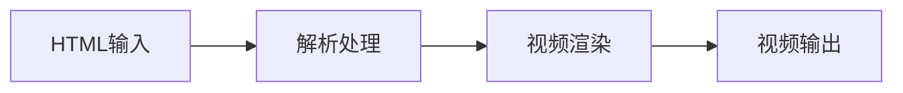

## 今日热点

今日GitHub热榜项目精彩纷呈。

---

## 热门项目一览

| 排名 | 项目 | 语言 | 今日 | 总计 | 简介 |
|:---:|------|:----:|------:|-----:|------|
| 1 | [affaan-m/ECC](https://github.com/affaan-m/ECC) | JavaScript | +1,897 | 252,912 | The agent harness performan... |
| 2 | [microsoft/markitdown](https://github.com/microsoft/markitdown) | Python | +886 | 180,370 | Python tool for converting ... |
| 3 | [coreyhaines31/marketingskills](https://github.com/coreyhaines31/marketingskills) | JavaScript | +580 | 48,182 | Marketing skills for Claude... |
| 4 | [The-Swarm-Corporation/AutoHedge](https://github.com/The-Swarm-Corporation/AutoHedge) | Python | +517 | 5,287 | Build your autonomous hedge... |
| 5 | [BraveOPotato/FckSignups](https://github.com/BraveOPotato/FckSignups) | TypeScript | +501 | 3,858 | A list of tools that are op... |
| 6 | [heygen-com/hyperframes](https://github.com/heygen-com/hyperframes) | TypeScript | +474 | 46,104 | Write HTML. Render video. B... |
| 7 | [ruvnet/ruflo](https://github.com/ruvnet/ruflo) | TypeScript | +394 | 71,417 | 🌊 The original agent meta-h... |
| 8 | [openai/skills](https://github.com/openai/skills) | Python | +351 | 26,067 | Skills Catalog for Codex |
| 9 | [MoonTechLab/LunaTV](https://github.com/MoonTechLab/LunaTV) | TypeScript | +197 | 9,781 | 本项目采用 CC BY-NC-SA 协议，禁止任何商业... |
| 10 | [bytedance/deer-flow](https://github.com/bytedance/deer-flow) | Python | +195 | 81,874 | An open-source long-horizon... |
| 11 | [pascalorg/editor](https://github.com/pascalorg/editor) | TypeScript | +168 | 22,364 | Create and share 3D archite... |
| 12 | [jo-inc/camofox-browser](https://github.com/jo-inc/camofox-browser) | JavaScript | +135 | 9,776 | Stealth headless browser fo... |

---

## 趋势洞察

```
┌─────────────────────────────────────────────────────────────────┐
│  AI/ML 工具         ████████████████████████  10 个项目        │
│  开发工具             ████                      2 个项目        │
│  媒体资源             ██                        1 个项目        │
│  项目管理             ██                        1 个项目        │
└─────────────────────────────────────────────────────────────────┘
```

---

## 项目深度解读

### 1. affaan-m/ECC — AI代码助手优化

> **一句话总结**：专为AI代码助手设计的性能优化系统，提升开发效率与代码质量。

#### 价值主张

| 维度 | 说明 |
|------|------|
| **解决痛点** | AI代码助手响应慢、上下文理解有限、缺乏记忆能力 |
| **目标用户** | 使用AI辅助编程的开发者和团队 |
| **核心亮点** | 技能优化 + 本能提升 + 记忆系统 + 安全增强 + 研究优先 |

#### 技术架构


**技术特色**：
- 智能上下文管理技术
- 多层次记忆增强系统
- 安全防护与代码优化

#### 热度分析

- 项目Star数超25万，日增近2000，增长势头强劲
- 作为AI辅助开发工具的代表，在开发者社区中具有极高关注度

#### 快速上手

```bash
# 克隆项目
git clone https://github.com/affaan-m/ECC.git

# 安装依赖
npm install
```

#### 注意事项

- 项目许可证未知，使用前需确认授权条款
- 项目可能需要与特定的AI代码助手工具配合使用
- 由于Open Issues为0，可能表示项目已成熟或问题管理方式特殊


### 2. microsoft/markitdown — 文档转Markdown

> **一句话总结**：Microsoft 开发的 Python 工具，可将各类文件和 Office 文档高效转换为 Markdown 格式。

#### 价值主张

| 维度 | 说明 |
|------|------|
| **解决痛点** | 解决跨平台文档统一格式转换和知识管理需求 |
| **目标用户** | 开发者、技术文档撰写者、知识管理人员 |
| **核心亮点** | 多格式支持 + 微软官方出品 + 高保真转换 + 易于集成 |

#### 技术架构


**技术特色**：
- 支持Word、Excel、PowerPoint等多种微软Office格式
- 采用智能布局识别算法保留原文档结构
- 提供批量处理和递归目录转换功能

#### 热度分析

- 项目获得超过18万星，每日新增近900星，表明社区高度认可
- 微软官方项目，在文档处理领域具有生态位优势

#### 快速上手

```bash
# 安装
pip install markitdown

# 基本使用
markitdown input.docx output.md
```

#### 注意事项

- 需要安装 Python 环境
- 某些复杂格式文档可能转换不完全
- 转大型文件可能需要较长时间和较多内存


### 3. coreyhaines31/marketingskills — AI营销技能

> **一句话总结**：为Claude Code和AI代理提供专业营销技能，覆盖转化、内容、SEO和增长策略。

#### 价值主张

| 维度 | 说明 |
|------|------|
| **解决痛点** | 解决AI缺乏专业营销知识的问题 |
| **目标用户** | AI开发者、营销自动化工程师 |
| **核心亮点** | 转化率优化 + SEO策略 + 数据分析 + 增长工程 + 专业文案 |

#### 技术架构


**技术特色**：
- 模块化营销技能库设计
- 针对Claude Code优化的提示工程
- 整合多种营销方法论和最佳实践

#### 热度分析

- 项目获近5万星，近期增长迅速，表明市场对AI营销工具需求旺盛
- 高星低issues比例反映项目成熟度高，社区维护良好

#### 快速上手

```bash
# 安装依赖
npm install marketingskills

# 在Claude Code中使用
const marketing = require('marketingskills');
marketing.optimizeConversion('your-content');
```

#### 注意事项

- 项目许可证未知，商业使用前需确认授权条款
- 需要配合Claude Code使用，单独使用可能功能受限
- 营销策略需根据具体业务场景调整，不应直接套用


### 4. The-Swarm-Corporation/AutoHedge — AI对冲基金自动化

> **一句话总结**：基于群体智能和AI的自动化对冲基金系统，实现市场分析、风险管理和交易执行的全流程自动化。

#### 价值主张

| 维度 | 说明 |
|------|------|
| **解决痛点** | 传统对冲基金依赖人工决策，效率低且无法实时响应市场变化 |
| **目标用户** | 对冲基金管理者、量化交易者、金融科技从业者和个人投资者 |
| **核心亮点** | 群体智能决策系统 + AI代理自动化交易 + 分钟级部署 + 实时风险管理 |

#### 技术架构


**技术特色**：
- 群体智能算法应用于金融决策系统
- 多代理协同工作提升决策准确性
- 模块化设计便于功能扩展和定制

#### 热度分析

- 项目近期增长迅猛，单日新增517星，显示市场对该技术高度关注
- 809次fork表明开发者社区积极参与二次开发和功能扩展

#### 快速上手

```bash
git clone https://github.com/The-Swarm-Corporation/AutoHedge.git
cd AutoHedge
pip install -r requirements.txt
python setup.py install
```

#### 注意事项

- 许可证未知，使用前需确认开源协议和商业使用限制
- 金融交易系统涉及高风险，建议先在模拟环境测试
- 项目无开放问题，可能通过其他渠道支持或维护模式特殊


### 5. BraveOPotato/FckSignups — 免注册工具集

> **一句话总结**：精选开源免注册在线工具，解决用户快速使用工具无需账号注册的痛点。

#### 价值主张

| 维度 | 说明 |
|------|------|
| **解决痛点** | 解决寻找无需注册即可使用的在线工具困难 |
| **目标用户** | 注重隐私、临时使用工具的开发者和普通用户 |
| **核心亮点** | 无需注册 + 开源工具 + 浏览器直接使用 + 分类清晰 + 持续更新 |

#### 技术架构


**技术特色**：
- 采用静态网站架构，确保快速加载和稳定访问
- 简洁的Markdown格式维护工具列表，便于社区贡献
- 响应式设计适配各种设备屏幕

#### 热度分析

- 单日增长500+ stars，表明社区对免注册工具有强烈需求和认可
- 作为开发者资源类项目，在开源工具生态中占据独特定位，有望持续增长

#### 快速上手

```bash
# 克隆项目
git clone https://github.com/BraveOPotato/FckSignups.git

# 本地预览（如果使用静态网站生成器）
cd FckSignups && npm install && npm run dev
```

#### 注意事项

- 工具链接可能随时间失效，需要社区定期维护和更新
- 部分工具可能需要本地安装才能获得完整功能
- 使用工具前建议检查其隐私政策，特别是处理敏感数据时


### 6. heygen-com/hyperframes — HTML视频引擎

> **一句话总结**：将HTML代码直接转换为视频的创新工具，专为AI代理设计，简化自动化内容创作流程。

#### 价值主张

| 维度 | 说明 |
|------|------|
| **解决痛点** | 传统视频制作门槛高，HTML到视频转换提供简单替代方案 |
| **目标用户** | AI开发者、内容创作者、自动化视频生成需求者 |
| **核心亮点** | HTML驱动视频生成 + 代理(agent)集成 + 自动化工作流 |

#### 技术架构



**技术特色**：
- 基于HTML的视频渲染技术，降低视频制作门槛
- 支持AI代理集成，实现自动化内容生成
- 使用TypeScript开发，提供类型安全性和可维护性

#### 热度分析

- 项目获得46k+星，日增长474，表明市场需求旺盛且产品受到高度认可
- Open Issues为0，反映项目维护良好，社区问题处理高效

#### 快速上手

```bash
# 安装hyperframes
npm install hyperframes

# 基本使用示例
import { renderVideo } from 'hyperframes';
renderVideo('<h1>Hello World</h1>', 'output.mp4');
```

#### 注意事项

- 需要关注项目许可证信息，目前显示为Unknown
- HTML到视频转换可能存在复杂样式兼容性问题
- 性能可能受HTML复杂度和渲染时长影响


### 7. ruvnet/ruflo — AI代理工具包

> **一句话总结**：智能代理元工具，支持多玩家群体部署和自主工作流协调

#### 价值主张

| 维度 | 说明 |
|------|------|
| **解决痛点** | 解决AI代理协同、自主工作流管理和多模型集成难题 |
| **目标用户** | AI开发者、企业构建对话式系统、自动化工作流团队 |
| **核心亮点** | 自适应记忆 + 自学习智能 + 多模型原生集成 + RAG支持 + 群体协调 |

#### 技术架构


**技术特色**：
- 多代理系统协同架构，支持群体智能
- 自适应记忆系统，增强上下文理解能力
- 原生集成多种AI模型，包括Claude、Codex和Hermes

#### 热度分析

- 高星高fork项目，近期增长迅速，显示强劲社区认可度
- 零开放问题，表明项目成熟度高，维护良好

#### 快速上手

```bash
# 安装ruflo
npm install ruflo

# 初始化代理系统
ruflo init

# 启动代理工作流
ruflo run --model claude --swarm 3
```

#### 注意事项

- 项目许可证未知，使用前需确认许可条款
- 需要确保已配置相应的AI模型API密钥
- 项目复杂度较高，可能需要一定的AI和分布式系统知识


### 10. bytedance/deer-flow — 长期超智能体

> **一句话总结**：字节开源的长期超智能体框架，通过多组件协同处理复杂任务，支持从分钟到小时级别的任务执行。

#### 价值主张

| 维度 | 说明 |
|------|------|
| **解决痛点** | 解决智能体系统长期任务执行、多组件协同和复杂任务编排的挑战 |
| **目标用户** | AI研究人员、智能体系统开发者、复杂任务处理团队 |
| **核心亮点** | 长期任务处理能力 + 多组件协同架构 + 沙盒环境隔离 + 智能记忆系统 + 子智能体调度 |

#### 技术架构


**技术特色**：
- 采用分层架构设计，实现任务分解与智能体协同
- 集成沙盒环境确保任务执行安全性与隔离性
- 构建记忆系统支持长期任务上下文维护

#### 热度分析

- 项目获得超过8万星且持续增长，表明在AI智能体领域有显著影响力
- 高Fork数反映项目架构被广泛认可，适合作为复杂智能体系统的基础框架

#### 快速上手

```bash
# 克隆项目
git clone https://github.com/bytedance/deer-flow.git

# 安装依赖
pip install -r requirements.txt

# 运行示例
python examples/basic_agent.py
```

#### 注意事项

- 项目许可证信息未知，使用前需确认开源协议
- 项目文档可能不够完善，需要参考源码和示例理解架构
- 部署复杂度较高，需要一定的AI系统和分布式系统知识


### 11. pascalorg/editor — 3D建筑编辑器

> **一句话总结**：基于Web的3D建筑设计工具，支持实时协作与云端分享。

#### 价值主张

| 维度 | 说明 |
|------|------|
| **解决痛点** | 为建筑师提供无需专业软件的在线3D设计平台 |
| **目标用户** | 建筑师、设计师、3D建模爱好者 |
| **核心亮点** | 实时协作 + 云端存储 + 跨平台访问 + 轻量化 + 易用性 |

#### 技术架构


**技术特色**：
- 基于TypeScript构建，确保代码质量和类型安全
- 采用WebGL技术实现高性能3D渲染和交互
- 支持实时协作功能，允许多人同时编辑同一项目

#### 热度分析

- 项目获22,364个Star，近期每日新增约168个，表明热度持续上升且增长稳定
- 作为专业领域的开源工具，在建筑设计领域具有独特定位，吸引专业用户和爱好者

#### 快速上手

```bash
# 克隆项目
git clone https://github.com/pascalorg/editor.git

# 安装依赖
npm install

# 启动开发服务器
npm run dev
```

#### 注意事项

- 项目许可证未知，使用前需确认授权条款
- 作为3D编辑器，需要浏览器支持WebGL功能，部分老旧设备可能无法正常运行
- 项目Open Issues为0，可能问题通过其他渠道交流或采用不同的问题管理方式


### 12. jo-inc/camofox-browser — 隐形无头浏览器

> **一句话总结**：专为AI代理设计的隐形无头浏览器，可绕过Cloudflare和反爬虫检测，作为Puppeteer/Playwright的替代品。

#### 价值主张

| 维度 | 说明 |
|------|------|
| **解决痛点** | 解决AI代理和自动化脚本被网站反爬虫系统阻止的问题 |
| **目标用户** | 需要进行网页爬取、自动化测试的AI开发者 |
| **核心亮点** | 隐形浏览模式 + 绕过Cloudflare + 模拟真实用户行为 + 与Puppeteer/Playwright兼容 |

#### 技术架构


**技术特色**：
- 基于Chromium的无头浏览器，但添加了隐形功能
- 模拟真实用户行为，降低被检测为机器人的风险
- 提供与Puppeteer/Playwright兼容的API接口

#### 热度分析

- 项目获得近万stars，表明在AI代理和网页爬取领域有高需求
- 作为Puppeteer/Playwright的替代方案，在自动化测试和网页抓取领域有重要生态位置

#### 快速上手

```bash
# 安装Camofox
npm install camofox

# 基本使用示例
const camofox = require('camofox');
(async () => {
  const browser = await camofox.launch();
  const page = await browser.newPage();
  await page.goto('https://example.com');
  const content = await page.content();
  console.log(content);
  await browser.close();
})();
```

#### 注意事项

- 使用隐形浏览模式可能涉及某些网站的服务条款问题
- 长时间或大规模使用可能导致IP被封禁
- 某些高级反爬虫系统可能仍然能够检测到隐形浏览模式


### 13. mksglu/context-mode — AI上下文优化

> **一句话总结**：通过沙盒化工具输出、持久化会话内存和MCP+hooks跨平台路由，优化AI编程代理的上下文窗口。

#### 价值主张

| 维度 | 说明 |
|------|------|
| **解决痛点** | AI编程代理上下文窗口受限导致的处理效率低下问题 |
| **目标用户** | AI应用开发者、智能编程助手用户、大型代码库维护者 |
| **核心亮点** | 沙盒化工具输出(减少98%) + 持久化会话记忆 + 17平台路由集成 + MCP协议支持 |

#### 技术架构


**技术特色**：
- 沙盒化工具输出技术，显著降低资源消耗
- 会话记忆持久化机制，保持上下文连续性
- MCP协议实现跨平台统一路由标准

#### 热度分析

- 项目获得高关注度(20k+ stars)，近期增长稳定(+96 stars/day)
- 社区活跃度高，fork数适中，表明项目处于成熟稳定期

#### 快速上手

```bash
# 安装依赖
npm install context-mode

# 初始化配置
context-mode init

# 启动服务
context-mode start
```

#### 注意事项

- 许可证信息不明确，使用前需确认开源协议
- 项目依赖的MCP协议需要预先了解
- 17平台集成可能需要额外配置和认证


### 14. lightpanda-io/browser — AI浏览器

> **一句话总结**：专为AI和自动化场景设计的高性能无头浏览器，提供轻量级网页交互能力。

#### 价值主张

| 维度 | 说明 |
|------|------|
| **解决痛点** | 解决传统浏览器在AI自动化中的资源消耗高、效率低的问题 |
| **目标用户** | AI开发者、自动化测试工程师、网页数据采集者 |
| **核心亮点** | 高性能 + 低内存占用 + AI优化 + 自动化友好 + 跨平台 |

#### 技术架构


**技术特色**：
- 基于Zig语言实现，提供高性能和内存安全保证
- 专为AI场景优化，减少不必要功能，专注核心交互
- 简化的API设计，便于与AI系统无缝集成

#### 热度分析

- 项目Star数近35k且持续增长(+58/天)，表明社区关注度极高
- Fork数相对较低，可能表明项目处于早期阶段，用户更倾向于直接使用

#### 快速上手

```bash
# 克隆仓库
git clone https://github.com/lightpanda-io/browser.git
# 构建项目
zig build
# 运行示例
zig run examples/basic.zig
```

#### 注意事项

- 项目License未知，商业使用前需确认授权条款
- 作为较新的项目，API可能不稳定，生产环境使用需谨慎
- Zig语言生态相对较小，可能面临社区资源限制


## 今日推荐

| 主题 | 推荐项目 | 亮点 |
|------|----------|------|
| 今日最热 | [affaan-m/ECC](https://github.com/affaan-m/ECC) | The agent harness... |
| 值得关注 | [microsoft/markitdown](https://github.com/microsoft/markitdown) | Python tool for c... |
| 快速上手 | [coreyhaines31/marketingskills](https://github.com/coreyhaines31/marketingskills) | Marketing skills ... |
| 长期潜力 | [The-Swarm-Corporation/AutoHedge](https://github.com/The-Swarm-Corporation/AutoHedge) | Build your autono... |

---

<div align="center">

*Generated on 2026-09-08 | Powered by GitHub Trending Reporter*

</div>