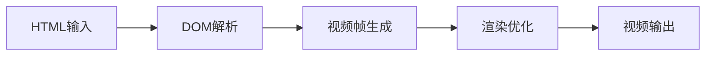
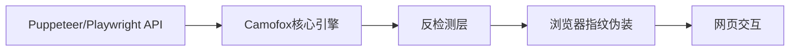
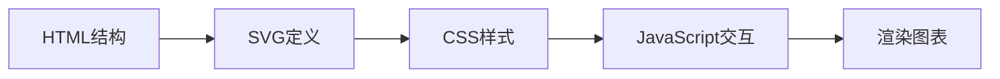
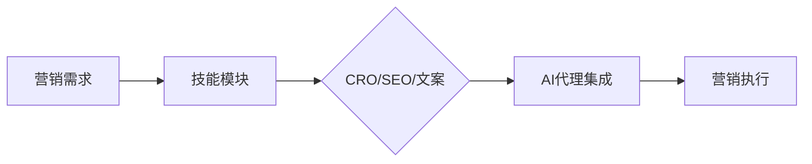

## 今日热点

AI代理技能生态系统迅速扩张，各类专业工具涌现，涵盖从代码优化、浏览器交互到特定领域应用，显示AI代理正从通用向专业化方向发展。

---

## 热门项目一览

| 排名 | 项目 | 语言 | 今日 | 总计 | 简介 |
|:---:|------|:----:|------:|-----:|------|
| 1 | [heygen-com/hyperframes](https://github.com/heygen-com/hyperframes) | TypeScript | +2,627 | 47,819 | Write HTML. Render video. B... |
| 2 | [microsoft/markitdown](https://github.com/microsoft/markitdown) | Python | +2,047 | 181,746 | Python tool for converting ... |
| 3 | [affaan-m/ECC](https://github.com/affaan-m/ECC) | JavaScript | +1,427 | 254,356 | The agent harness performan... |
| 4 | [jo-inc/camofox-browser](https://github.com/jo-inc/camofox-browser) | JavaScript | +871 | 10,547 | Stealth headless browser fo... |
| 5 | [cathrynlavery/diagram-design](https://github.com/cathrynlavery/diagram-design) | HTML | +710 | 34,956 | 38 editorial diagram types ... |
| 6 | [coreyhaines31/marketingskills](https://github.com/coreyhaines31/marketingskills) | JavaScript | +666 | 48,864 | Marketing skills for Claude... |
| 7 | [ayghri/i-have-adhd](https://github.com/ayghri/i-have-adhd) | Python | +656 | 30,746 | A skill to stop your coding... |
| 8 | [mksglu/context-mode](https://github.com/mksglu/context-mode) | TypeScript | +651 | 21,425 | Context window optimization... |
| 9 | [MoonTechLab/LunaTV](https://github.com/MoonTechLab/LunaTV) | TypeScript | +505 | 10,204 | 本项目采用 CC BY-NC-SA 协议，禁止任何商业... |
| 10 | [The-Swarm-Corporation/AutoHedge](https://github.com/The-Swarm-Corporation/AutoHedge) | Python | +494 | 5,733 | Build your autonomous hedge... |
| 11 | [openai/skills](https://github.com/openai/skills) | Python | +490 | 26,542 | Skills Catalog for Codex |
| 12 | [obra/superpowers](https://github.com/obra/superpowers) | Shell | +452 | 283,408 | An agentic skills framework... |

---

## 趋势洞察

```
┌─────────────────────────────────────────────────────────────────┐
│  AI/ML 工具         ████████████████████████  13 个项目        │
│  媒体资源             █                         1 个项目        │
│  开发工具             █                         1 个项目        │
│  其他               █                         1 个项目        │
└─────────────────────────────────────────────────────────────────┘
```

---

## 项目深度解读

### 1. heygen-com/hyperframes — HTML视频引擎

> **一句话总结**：将HTML代码直接渲染为视频，为AI代理提供内容生成能力。

#### 价值主张

| 维度 | 说明 |
|------|------|
| **解决痛点** | 解决从HTML到视频内容生成的技术鸿沟，无需复杂视频编辑工具 |
| **目标用户** | AI代理系统、内容创作者、自动化视频生成工具开发者 |
| **核心亮点** | HTML到视频的直接转换 + 高性能渲染 + 代理系统友好 + 跨平台支持 |

#### 技术架构



**技术特色**：
- 基于HTML/CSS的声明式视频内容创建
- 高性能渲染引擎，支持复杂动画和过渡效果
- 为AI代理系统设计的API和工具链
- 支持多种视频格式和分辨率输出

#### 热度分析

- 项目Star数近5万，且单日增长超过2600，表明受到广泛关注
- 零开放Issues反映了项目成熟度高或问题处理机制高效

#### 快速上手

```bash
# 安装hyperframes
npm install hyperframes

# 基本使用示例
import { renderToVideo } from 'hyperframes';

const htmlContent = '<h1>Hello World</h1><p>Generated from HTML</p>';
await renderToVideo(htmlContent, 'output.mp4');
```

#### 注意事项

- 项目License未知，商业使用前需确认授权条款
- 虽然Issues为0，但建议关注项目更新，因为API可能会有变化
- 复杂HTML和CSS特性可能不被完全支持，需测试特定需求


### 2. microsoft/markitdown — 文档转换工具

> **一句话总结**：微软开发的Python工具，可将各类文档和Office文件高效转换为Markdown格式。

#### 价值主张

| 维度 | 说明 |
|------|------|
| **解决痛点** | 统一多格式文档为Markdown，解决跨平台内容管理难题 |
| **目标用户** | 开发者、研究人员和需要处理多格式文档的内容创作者 |
| **核心亮点** | 支持多种格式转换 + 微软官方出品 + 保持原始文档结构 + 高效处理 |

#### 技术架构


**技术特色**：
- 基于Python的跨平台解决方案，确保广泛兼容性
- 智能解析文档结构，保留格式和层级关系
- 支持批量处理，提高文档转换效率

#### 热度分析

- 项目获星超18万，日增2000+，表明文档转换需求旺盛且持续增长
- 微软背书加上开源策略，使其成为文档转换领域的标杆项目

#### 快速上手

```bash
# 安装
pip install markitdown

# 使用
markitdown input.docx output.md
```

#### 注意事项

- 项目对某些特殊格式或复杂布局的支持可能有限
- 转换大型文档或批量处理时可能需要较多内存资源
- 建议在使用前先测试关键文档的转换效果


### 3. affaan-m/ECC — AI编程优化系统

> **一句话总结**：多维度优化AI编程助手性能，提升Claude Code、Codex等工具的代码生成效率与安全性

#### 价值主张

| 维度 | 说明 |
|------|------|
| **解决痛点** | AI编程助手响应慢、代码质量不稳定、安全性不足 |
| **目标用户** | AI辅助编程开发者与研究AI编码工具的工程师 |
| **核心亮点** | 技能增强 + 本能优化 + 记忆管理 + 安全保障 |

#### 技术架构


**技术特色**：
- 基于JavaScript的性能优化框架，轻量级且跨平台兼容
- 多层次AI代理行为建模，提升代码生成质量
- 研究优先的开发方法论，持续迭代优化算法

#### 热度分析

- 项目获得25万+星标，日增1400+，表明AI编程助手优化领域需求旺盛
- Fork/Star比例约1:6.6，用户参与度高，社区贡献活跃

#### 快速上手

```bash
# 克隆项目
git clone https://github.com/affaan-m/ECC.git
# 安装依赖
npm install
# 启动优化服务
npm start
```

#### 注意事项

- 项目许可证未知，商业使用前需确认授权条款
- 项目无公开Issues，可能通过其他渠道反馈问题，建议先查看社区讨论区
- 集成前需确认与目标AI编程工具的兼容性


### 4. jo-inc/camofox-browser — AI无头浏览器

> **一句话总结**：专为AI代理设计的隐形浏览器，绕过Cloudflare和反爬虫检测，无缝替代Puppeteer/Playwright。

#### 价值主张

| 维度 | 说明 |
|------|------|
| **解决痛点** | 解决AI代理访问网站时被识别和阻止的问题 |
| **目标用户** | AI开发者、数据抓取者、自动化测试工程师 |
| **核心亮点** | 绕过Cloudflare + 隐形浏览模式 + API兼容 + 防检测技术 + 专为AI优化 |

#### 技术架构



**技术特色**：
- 模拟真实浏览器行为，降低被检测风险
- 内置绕过Cloudflare和其他保护机制
- 提供与主流无头浏览器相同的API接口

#### 热度分析

- 项目Star数突破10,000，单日增长871，表明正获得广泛关注和快速采用
- Fork数与Star数的比例约为1:10，说明用户更倾向于直接使用而非分支开发

#### 快速上手

```bash
# 安装
npm install camofox

# 基本使用
const camofox = require('camofox');
const browser = await camofox.launch();
const page = await browser.newPage();
```

#### 注意事项

- 项目可能不适用于所有网站的反检测机制
- 长期使用可能违反某些网站的服务条款
- 使用时需遵守目标网站的robots.txt规则和法律法规


### 5. cathrynlavery/diagram-design — 专业图表库

> **一句话总结**：38种精美HTML+SVG图表类型，专为AI代码助手设计，无依赖无阴影。

#### 价值主张

| 维度 | 说明 |
|------|------|
| **解决痛点** | 解决AI工具中图表质量差、依赖复杂的问题 |
| **目标用户** | AI代码助手使用者、技术文档编写者、前端开发者 |
| **核心亮点** | 自包含HTML+SVG实现 + 38种专业图表类型 + 无阴影设计 |

#### 技术架构



**技术特色**：
- 纯HTML+SVG实现，无需额外依赖
- 精简设计风格，无阴影干扰视觉
- 自包含组件，可直接嵌入任何网页

#### 热度分析

- 项目高星(34k+)且持续增长(+710/天)，表明图表设计需求旺盛
- 无开放Issues，说明项目维护良好，用户问题少

#### 快速上手

```bash
# 直接克隆项目
git clone https://github.com/cathrynlavery/diagram-design.git

# 在浏览器中打开index.html查看所有图表
```

#### 注意事项

- 项目依赖未知，使用前需检查许可证
- 主要设计为AI工具使用，可能不适合所有业务场景
- 图表类型有限，如需更多类型可能需要自定义开发


### 6. coreyhaines31/marketingskills — 营销技能库

> **一句话总结**：为AI代理提供专业营销能力集，涵盖转化优化、文案创作和SEO策略。

#### 价值主张

| 维度 | 说明 |
|------|------|
| **解决痛点** | 为AI代理提供专业营销能力，解决营销自动化与智能化需求 |
| **目标用户** | 开发者、营销人员、AI代理构建者 |
| **核心亮点** | 多领域营销技能集成 + AI代理专用 + 实用营销策略库 |

#### 技术架构



**技术特色**：
- JavaScript实现，便于跨平台集成
- 模块化设计，支持多种营销场景
- 专注于AI代理的营销能力增强

#### 热度分析

- 项目获得近5万星，单日增长666星，显示高度社区认可和需求
- 作为AI辅助营销工具，处于技术前沿领域，具有持续增长潜力

#### 快速上手

```bash
# 安装项目依赖
npm install marketingskills

# 导入营销技能模块
const { copywriting, SEO, CRO } = require('marketingskills');

# 使用SEO工具优化内容
SEO.optimizeContent('your-content');
```

#### 注意事项

- 项目许可证未知，使用前需确认授权条款
- 作为营销工具，需确保遵守相关平台的使用政策
- 集成到AI代理时需考虑API调用限制和成本


### 7. ayghri/i-have-adhd — ADHD代码优化

> **一句话总结**：通过优化输出格式，使AI代码助手生成的内容更加清晰、易于理解，特别适合ADHD用户。

#### 价值主张

| 维度 | 说明 |
|------|------|
| **解决痛点** | 解决代码助手输出信息过载、关键点不明确的问题 |
| **目标用户** | ADHD开发者、需要清晰代码输出的程序员 |
| **核心亮点** | ADHD友好格式化 + 信息简化 + 关键点突出 + 减少认知负担 |

#### 技术架构


**技术特色**：
- 智能信息过滤与简化算法
- 关键代码段自动识别技术
- ADHD认知模式适配的格式化处理

#### 热度分析

- 项目获得超3万星且每日新增600+星，增长迅猛，显示高度实用价值
- Fork数相对较低，表明项目更多作为实用工具被采用而非二次开发

#### 快速上手

```bash
pip install i-have-adhd
# 或
git clone https://github.com/ayghri/i-have-adhd.git
cd i-have-adhd
python setup.py install
```

#### 注意事项

- 项目许可证未知，使用前需确认授权条款
- 主要针对ADHD用户，普通开发者可能感知不明显
- 可能需要与现有AI代码助手配合使用才能发挥效果


### 8. mksglu/context-mode — AI上下文优化

> **一句话总结**：优化AI编程代理上下文窗口，减少资源消耗并提升跨平台集成能力。

#### 价值主张

| 维度 | 说明 |
|------|------|
| **解决痛点** | 解决AI代理上下文窗口过大导致的资源浪费和效率低下问题 |
| **目标用户** | AI编程代理开发者、需要优化AI上下文效率的开发者 |
| **核心亮点** | 上下文窗口优化 + 沙盒化工具输出 + 会话内存持久化 + 跨平台路由 |

#### 技术架构


**技术特色**：
- 沙盒化工具输出减少98%资源消耗
- 持久化会话内存保持上下文连续性
- 通过MCP + hooks实现17平台集成

#### 热度分析

- 项目Star数高且持续快速增长，单日新增651星，显示强烈社区关注
- Issues数量为0，表明项目维护良好，问题处理高效

#### 快速上手

```bash
# 安装依赖
npm install context-mode

# 初始化配置
npx context-mode init

# 启动服务
npx context-mode start
```

#### 注意事项

- 项目许可证未知，商业使用前需确认许可条款
- 需要与特定的AI编程代理集成才能发挥完整功能
- 17个平台的集成可能需要额外的配置和适配工作


### 9. MoonTechLab/LunaTV — 流媒体平台

> **一句话总结**：基于TypeScript开发的现代化流媒体解决方案，提供高质量视频播放与自定义体验。

#### 价值主张

| 维度 | 说明 |
|------|------|
| **解决痛点** | 提供轻量级、可定制的流媒体服务，降低视频平台部署门槛 |
| **目标用户** | 中小型内容创作者、教育机构、企业内训部门 |
| **核心亮点** | 跨平台兼容 + 自定义播放器 + 低延迟流媒体 + 响应式设计 |

#### 技术架构


**技术特色**：
- 基于TypeScript全栈开发，确保代码类型安全与可维护性
- 采用自适应流媒体技术，根据网络状况动态调整视频质量
- 支持多种视频格式与协议，兼容不同播放环境与设备

#### 热度分析

- 项目持续获得高星关注，单日增长500+，表明社区认可度高
- Fork/Star比例接近1:1，反映项目具有高可复用性与二次开发价值

#### 快速上手

```bash
# 克隆项目
git clone https://github.com/MoonTechLab/LunaTV.git

# 安装依赖
npm install

# 启动开发服务器
npm run dev
```

#### 注意事项

- 项目采用CC BY-NC-SA协议，禁止商业化使用，仅适用于非商业场景
- 任何衍生项目必须保留原始项目地址并以相同协议开源


### 10. The-Swarm-Corporation/AutoHedge — AI对冲基金

> **一句话总结**：基于群体智能和AI代理的自动化对冲基金构建系统，实现分钟级市场分析、风险管理和交易执行。

#### 价值主张

| 维度 | 说明 |
|------|------|
| **解决痛点** | 传统对冲基金构建复杂、门槛高、需要专业团队的问题 |
| **目标用户** | 个人投资者、量化交易爱好者、小型金融科技公司 |
| **核心亮点** | 群体智能决策 + AI代理自动化 + 分钟级部署 + 低门槛进入 + 全自动交易执行 |

#### 技术架构


**技术特色**：
- 群体智能算法提高决策准确性
- 多AI代理协同工作增强市场适应性
- 自动化风险控制系统降低投资风险

#### 热度分析

- 项目Star数达5,733且今日增长494，显示近期热度快速上升
- Fork数841，表明开发者社区活跃度高，项目具有实用价值

#### 快速上手

```bash
# 安装依赖
pip install autohedge

# 初始化对冲基金
autohedge init --name "MyFund" --capital 10000

# 启动交易系统
autohedge start
```

#### 注意事项

- 项目License未知，需注意使用权限
- 自动化交易存在风险，建议先在模拟环境测试
- 金融市场波动大，AI系统无法完全规避风险


### 11. openai/skills — [AI编程技能库]

> **一句话总结**：Codex模型的编程技能目录，提供结构化代码生成能力

#### 价值主张

| 维度 | 说明 |
|------|------|
| **解决痛点** | 解决AI代码生成能力碎片化、缺乏系统化组织的问题 |
| **目标用户** | AI开发者、自动化工具构建者、大型代码生成平台 |
| **核心亮点** | 系统化技能分类 + 结构化代码生成 + 可扩展技能库 + 与Codex深度集成 |

#### 技术架构


**技术特色**：
- 基于Python的技能管理系统
- 与OpenAI Codex模型深度集成
- 支持技能的动态扩展与更新

#### 热度分析

- 项目获得超过26k星，近期增长迅速，表明AI编程领域热度持续上升
- 作为OpenAI官方项目，在AI代码生成生态中占据核心位置

#### 快速上手

```bash
# 克隆仓库
git clone https://github.com/openai/skills.git
# 安装依赖
pip install -r requirements.txt
# 运行示例
python examples/basic_usage.py
```

#### 注意事项

- 需要OpenAI API访问权限才能使用完整功能
- 技能库可能需要持续更新以适应新的编程需求
- 作为实验性项目，API和功能可能发生变化


### 12. obra/superpowers — 智能开发框架

> **一句话总结**：一个结合智能代理与实用技能的软件开发框架，提升开发效率与技能应用能力。

#### 价值主张

| 维度 | 说明 |
|------|------|
| **解决痛点** | 解决软件开发中技能应用分散、效率低下的问题 |
| **目标用户** | 追求高效开发的软件工程师和技术团队 |
| **核心亮点** | 代理化技能框架 + 实用方法论 + Shell实现 + 高效工作流 |

#### 技术架构


**技术特色**：
- 基于Shell的轻量级实现，跨平台兼容性强
- 代理化技能框架，自动化处理开发任务
- 实用方法论整合，提升开发流程效率

#### 热度分析

- 项目获得28万+星标，持续稳定增长，表明广泛认可度高
- 0开放问题反映项目维护良好，社区问题处理高效

#### 快速上手

```bash
# 克隆项目
git clone https://github.com/obra/superpowers.git
# 进入目录
cd superpowers
# 查看使用说明
./superpowers --help
```

#### 注意事项

- 项目依赖Shell环境，确保系统兼容性
- 需要理解项目方法论以最大化发挥框架效用
- 开源许可证信息不明确，使用前需确认授权条款


### 13. multica-ai/andrej-karpathy-skills — AI 编程优化

> **一句话总结**：基于 Andrej Karpathy 的 LLM 编程经验，优化 Claude Code 编程行为的指导文件。

#### 价值主张

| 维度 | 说明 |
|------|------|
| **解决痛点** | 解决 LLM 编程中的常见陷阱和低效代码生成问题 |
| **目标用户** | 使用 Claude Code 进行编程的开发者和研究人员 |
| **核心亮点** | 实用编程技巧 + 大模型编程最佳实践 + 经验总结 |

#### 技术架构

**技术特色**：
- 基于 Andrej Karpathy 的实战编程经验
- 提供具体可执行的编程优化建议
- 简洁明了的单文件解决方案

#### 热度分析

- 项目获得超21万 star，表明在 AI 编程领域有极高认可度
- 社区活跃度高，反映了开发者对 LLM 编程优化的强烈需求

#### 快速上手

本项目仅包含 CLAUDE.md 文件，无需安装或执行代码。直接阅读文件内容即可获取编程优化建议。

#### 注意事项

- 本项目仅提供指导性内容，不包含可执行代码
- 内容基于特定 AI 编程工具(Claude Code)的优化经验
- 使用时应结合自身编程需求进行适当调整


### 14. browser-use/browser-use — 浏览器智能体

> **一句话总结**：让AI代理能够自主操作浏览器的Python框架，实现复杂网页任务自动化。

#### 价值主张

| 维度 | 说明 |
|------|------|
| **解决痛点** | 解决AI无法直接与网页交互的难题，实现端到端自动化任务 |
| **目标用户** | AI开发者、自动化测试工程师、数据采集研究人员 |
| **核心亮点** | 大语言模型控制 + 浏览器自动化 + 自然语言任务理解 |

#### 技术架构


**技术特色**：
- 基于大语言模型的智能任务理解与分解能力
- 无缝集成Playwright等浏览器自动化技术栈
- 支持复杂多步骤网页交互与状态记忆

#### 热度分析

- 项目Star数超11万，日增228星，增长迅猛，热度极高
- 作为AI浏览器交互领域的先驱项目，具有先发优势和社区影响力

#### 快速上手

```bash
# 安装browser-use
pip install browser-use

# 基本使用示例
from browser_use import BrowserAgent
agent = BrowserAgent()
agent.run("帮我查找最近的新闻并总结前三条")
```

#### 注意事项

- 需要配合OpenAI等大语言模型API使用，可能产生额外费用
- 网页结构变化可能导致自动化脚本失效，需要定期维护
- 使用时应遵守目标网站的robots.txt和使用条款，避免违规操作


### 15. viarotel-org/escrcpy — Android远程控制

> **一句话总结**：基于Web界面的Android设备远程控制工具，提供图形化操作界面，简化scrcpy使用体验。

#### 价值主张

| 维度 | 说明 |
|------|------|
| **解决痛点** | 将命令行工具scrcpy转化为可视化界面，降低使用门槛 |
| **目标用户** | 开发者、测试人员、需要远程控制Android设备的普通用户 |
| **核心亮点** | Web界面可视化 + 无需安装客户端 + 跨平台支持 + 实时屏幕镜像 |

#### 技术架构


**技术特色**：
- 使用Web技术实现跨平台客户端，无需安装特定软件
- 通过ADB协议与Android设备通信，确保稳定连接
- 转发scrcpy视频流和输入控制，实现实时交互

#### 热度分析

- 项目获得11,419个Star且持续增长(+178 today)，表明用户需求旺盛
- Fork数量797，显示社区积极参与二次开发和功能扩展
- Issues数量为0，可能表明项目成熟度高或问题处理高效

#### 快速上手

```bash
# 安装依赖
npm install

# 启动服务
npm start

# 访问Web界面
http://localhost:3000
```

#### 注意事项

- 需要先安装ADB并配置环境变量
- Android设备需开启USB调试模式
- 网络连接可能存在延迟，影响操作体验


### 16. openai/plugins — AI插件系统

> **一句话总结**：OpenAI官方插件系统，扩展AI能力边界，实现与外部工具的无缝集成。

#### 价值主张

| 维度 | 说明 |
|------|------|
| **解决痛点** | 为OpenAI模型提供外部工具访问能力，突破纯文本限制 |
| **目标用户** | AI应用开发者、企业用户、AI工具集成商 |
| **核心亮点** | 安全的代码执行 + API集成能力 + 沙盒环境 + 插件市场 + 开发者友好 |

#### 技术架构


**技术特色**：
- 插件沙盒隔离机制确保安全
- 标准化插件接口便于开发者扩展
- 异步执行流程避免阻塞主模型推理

#### 热度分析

- 项目Star数近6千且持续增长，显示开发者社区对AI插件系统的高度关注
- 作为OpenAI官方项目，处于AI生态系统的关键连接点

#### 快速上手

```bash
# 克隆项目
git clone https://github.com/openai/plugins.git
# 安装依赖
npm install
# 启动开发服务器
npm run dev
```

#### 注意事项

- 插件开发需遵循OpenAI的安全指南
- API调用需处理可能的失败情况
- 注意插件权限范围，避免过度授权


## 今日推荐

| 主题 | 推荐项目 | 亮点 |
|------|----------|------|
| 今日最热 | [heygen-com/hyperframes](https://github.com/heygen-com/hyperframes) | Write HTML. Rende... |
| 值得关注 | [microsoft/markitdown](https://github.com/microsoft/markitdown) | Python tool for c... |
| 快速上手 | [affaan-m/ECC](https://github.com/affaan-m/ECC) | The agent harness... |
| 长期潜力 | [jo-inc/camofox-browser](https://github.com/jo-inc/camofox-browser) | Stealth headless ... |

---

<div align="center">

*Generated on 2026-09-09 | Powered by GitHub Trending Reporter*

</div>