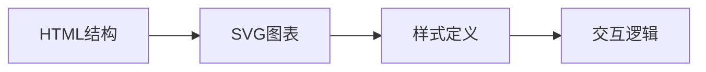
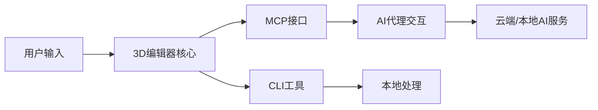

## 今日热点

今日GitHub热榜项目精彩纷呈。

---

## 热门项目一览

| 排名 | 项目 | 语言 | 今日 | 总计 | 简介 |
|:---:|------|:----:|------:|-----:|------|
| 1 | [ayghri/i-have-adhd](https://github.com/ayghri/i-have-adhd) | Python | +4,650 | 34,815 | A skill to stop your coding... |
| 2 | [cathrynlavery/diagram-design](https://github.com/cathrynlavery/diagram-design) | HTML | +2,249 | 36,675 | 38 editorial diagram types ... |
| 3 | [liquidslr/system-design-notes](https://github.com/liquidslr/system-design-notes) | Unknown | +1,397 | 18,047 | Notes of the book System De... |
| 4 | [affaan-m/ECC](https://github.com/affaan-m/ECC) | JavaScript | +1,133 | 255,216 | The agent harness performan... |
| 5 | [freestylefly/awesome-gpt-image-2](https://github.com/freestylefly/awesome-gpt-image-2) | JavaScript | +705 | 30,109 | Prompt as Code | GPT-Image2... |
| 6 | [obra/superpowers](https://github.com/obra/superpowers) | Shell | +688 | 284,069 | An agentic skills framework... |
| 7 | [Tencent/teamai-cli](https://github.com/Tencent/teamai-cli) | TypeScript | +556 | 3,060 | Make Every Team AI Native |
| 8 | [openai/plugins](https://github.com/openai/plugins) | JavaScript | +498 | 6,217 | OpenAI Plugins |
| 9 | [vastsa/PI-Desktop](https://github.com/vastsa/PI-Desktop) | TypeScript | +417 | 1,705 | Local-first AI coding agent... |
| 10 | [TauricResearch/TradingAgents](https://github.com/TauricResearch/TradingAgents) | Python | +367 | 104,007 | TradingAgents: Multi-Agents... |
| 11 | [rohitg00/ai-engineering-from-scratch](https://github.com/rohitg00/ai-engineering-from-scratch) | Python | +343 | 53,734 | Learn it. Build it. Ship it... |
| 12 | [earthtojake/text-to-cad](https://github.com/earthtojake/text-to-cad) | Python | +124 | 15,062 | A library of agent skills f... |

---

## 趋势洞察

```
┌─────────────────────────────────────────────────────────────────┐
│  AI/ML 工具         ████████████████████████  12 个项目        │
│  其他               ██                        1 个项目        │
└─────────────────────────────────────────────────────────────────┘
```

---

## 项目深度解读

### 1. ayghri/i-have-adhd — ADHD代码助手

> **一句话总结**：为ADHD开发者优化的代码输出工具，减少干扰信息，突出关键内容。

#### 价值主张

| 维度 | 说明 |
|------|------|
| **解决痛点** | 解决ADHD开发者面对AI助手信息过载、注意力分散的问题 |
| **目标用户** | 注意力缺陷多动障碍(ADHD)的软件开发者和程序员 |
| **核心亮点** | ADHD友好输出格式 + 减少信息过载 + 突出关键点 + 简化交互 |

#### 技术架构


**技术特色**：
- 信息过滤算法减少认知负荷
- 结构化输出提高信息获取效率
- 可定制化适应不同ADHD需求

#### 热度分析

- 项目获得34,815个Star，单日增长4,650，表明ADHD开发者社区对此工具高度认可
- 在开发者工具领域占据特殊细分市场，针对特定人群需求，形成独特生态位

#### 快速上手

```bash
# 安装
pip install i-have-adhd

# 使用
python -m i_have_adhd "你的代码问题"
```

#### 注意事项

- 该工具主要针对ADHD开发者，其他用户可能无法完全理解其设计理念
- 使用前可能需要根据个人ADHD症状特点进行配置优化
- 可能与特定AI编程助手集成效果最佳


### 2. cathrynlavery/diagram-design — 精美图表库

> **一句话总结**：提供38种高质量编辑图表，纯HTML/SVG实现，无需依赖，专为代码编辑器设计。

#### 价值主张

| 维度 | 说明 |
|------|------|
| **解决痛点** | 解决代码编辑器中高质量图表展示需求，摆脱Mermaid限制 |
| **目标用户** | 开发者、技术文档编写者、AI工具使用者 |
| **核心亮点** | 纯HTML/SVG实现 + 38种精美图表类型 + 无阴影设计 + 自包含 + 不依赖Mermaid |

#### 技术架构



**技术特色**：
- 纯前端实现，无需后端支持
- 自包含设计，所有资源内嵌
- 轻量级，加载速度快

#### 热度分析

- 项目star数高达3.6万，近期增长迅速，日均增加约2200个star，表明社区认可度高
- fork数相对star数较低，说明项目主要作为参考使用而非二次开发

#### 快速上手

```bash
# 克隆项目
git clone https://github.com/cathrynlavery/diagram-design.git

# 直接在浏览器中打开index.html查看所有图表示例
```

#### 注意事项

- 项目许可证未知，商业使用前需确认授权方式
- 主要为静态展示，不包含复杂交互功能
- 依赖HTML/CSS环境，不适合纯文本环境使用


### 3. liquidslr/system-design-notes — 系统设计面试指南

> **一句话总结**：系统设计面试实用笔记，帮助开发者掌握核心设计思路与解题技巧。

#### 价值主张

| 维度 | 说明 |
|------|------|
| **解决痛点** | 解决系统设计面试缺乏系统性指导与实战案例的问题 |
| **目标用户** | 准备技术面试的中高级工程师及计算机专业学生 |
| **核心亮点** | 结构清晰 + 实用性强 + 覆盖全面 + 持续更新 |

#### 技术架构


**技术特色**：
- 采用分层架构展示系统设计全过程
- 提供实际案例与常见问题解答
- 包含设计模式与最佳实践总结

#### 热度分析

- 项目获得18k+星标，近期增长显著，反映系统设计面试资源需求旺盛
- 作为开源学习资料，社区活跃度高，成为系统设计学习的重要参考

#### 快速上手

```bash
# 克隆项目到本地
git clone https://github.com/liquidslr/system-design-notes.git

# 进入项目目录查看内容
cd system-design-notes && ls
```

#### 注意事项
- 笔记内容基于书籍整理，建议结合原书深入学习系统设计原理
- 面试准备应结合实际项目经验，仅靠笔记可能不够全面
- 系统设计领域广泛，笔记内容可能不覆盖所有技术栈和场景


### 4. affaan-m/ECC — AI编程优化器

> **一句话总结**：AI编程助手性能优化系统，提升Claude Code、Cursor等工具的开发效率与安全性。

#### 价值主张

| 维度 | 说明 |
|------|------|
| **解决痛点** | 提升AI编程助手性能，解决响应速度与安全性问题 |
| **目标用户** | 使用AI编程助手的开发者与研究人员 |
| **核心亮点** | 技能优化 + 本能增强 + 记忆管理 + 安全保障 + 研究优先 |

#### 技术架构


**技术特色**：
- 多维度AI编程助手性能优化技术
- 记忆管理与安全保障机制
- 研究优先的开发方法论

#### 热度分析

- 项目获得25万+星标，日增千余星，增长势头强劲
- 无开放问题，表明项目维护完善，社区活跃度高

#### 快速上手

```bash
# 克隆项目
git clone https://github.com/affaan-m/ECC.git

# 安装依赖
npm install
```

#### 注意事项

- 项目许可证未知，使用前需确认授权条款
- 项目主要针对特定AI编程工具优化，通用性可能有限
- 由于无开放问题，可能社区反馈渠道有限


### 5. freestylefly/awesome-gpt-image-2 — AI提示词工程库

> **一句话总结**：工业级GPT-Image2提示词引擎与模板库，530+案例逆向工程，20+套专业模板

#### 价值主张

| 维度 | 说明 |
|------|------|
| **解决痛点** | 解决AI图像生成提示词质量低、效率低、效果不可控问题 |
| **目标用户** | AI艺术家、设计师、开发者、内容创作者 |
| **核心亮点** | 530+案例逆向工程 + 20+工业级模板 + 技能提炼体系 + 持续更新 |

#### 技术架构

**技术特色**：
- 基于大量实际案例的逆向工程技术
- 结构化提示词模板系统
- 技能提炼与知识图谱构建

#### 热度分析

- 高Star增长(+705/天)表明项目热度持续上升，社区认可度高
- 作为AI提示词工程领域标杆项目，已成为AI内容创作者的重要资源库

#### 快速上手

```bash
# 克隆项目仓库
git clone https://github.com/freestylefly/awesome-gpt-image-2.git

# 浏览提示词库和模板
cd awesome-gpt-image-2 && ls
```

#### 注意事项

- 项目主要提供提示词模板，需要配合支持GPT-Image2的AI工具使用
- 部分提示词可能需要根据具体AI模型进行微调
- 使用时需遵守相关AI服务提供商的使用条款


### 6. obra/superpowers — 高效开发框架

> **一句话总结**：一个通过代理技能框架提升开发效率的实用方法论。

#### 价值主张

| 维度 | 说明 |
|------|------|
| **解决痛点** | 解决开发者技能提升和开发效率低下的核心问题 |
| **目标用户** | 软件开发者和技术团队 |
| **核心亮点** | 实用性导向 + 技能框架 + 方法论整合 + 高效实践 |

#### 技术架构


**技术特色**：
- 基于Shell的轻量级实现
- 聚焦实际开发场景
- 强调可操作性而非理论

#### 热度分析

- 高星高fork项目，日均增长约700 stars，表明社区认可度高
- 零开放问题，反映项目成熟度高或问题处理机制高效

#### 快速上手

```bash
# 克隆项目
git clone https://github.com/obra/superpowers.git
# 进入目录
cd superpowers
# 查看使用指南
cat README.md
```

#### 注意事项

- 项目许可证未知，商业使用前需确认授权
- 作为方法论框架，可能需要根据具体场景调整应用方式
- Shell实现可能依赖于特定环境，需确保兼容性


### 7. Tencent/teamai-cli — 团队AI原生工具

> **一句话总结**：命令行工具赋能团队将AI能力无缝集成到日常工作流程中。

#### 价值主张

| 维度 | 说明 |
|------|------|
| **解决痛点** | 团队AI能力整合困难，缺乏统一的AI协作入口 |
| **目标用户** | 需要集成AI能力到工作流程的开发团队和协作团队 |
| **核心亮点** | 命令行交互界面 + AI能力集成 + 团队协作支持 + 可扩展架构 + 腾讯技术背书 |

#### 技术架构


**技术特色**：
- 基于TypeScript构建，确保类型安全和开发效率
- 模块化设计，支持多种AI服务集成
- 命令行界面优化，提供流畅的交互体验

#### 热度分析

- 项目近期Star数激增，表明社区对其AI原生团队解决方案高度认可
- 作为腾讯开源项目，在AI和团队协作领域具有显著生态影响力

#### 快速上手

```bash
# 安装
npm install -g teamai-cli

# 初始化团队AI环境
teamai init

# 使用AI功能
teamai ask "项目代码问题"
```

#### 注意事项

- 需要配置AI服务的API密钥才能使用核心功能
- 项目处于早期阶段，API和功能可能发生变化
- 建议在使用前仔细阅读文档，确保正确配置


### 8. openai/plugins — AI扩展框架

> **一句话总结**：为OpenAI应用构建标准化插件生态，拓展AI能力边界与场景覆盖

#### 价值主张

| 维度 | 说明 |
|------|------|
| **解决痛点** | 突破AI原生功能限制，实现能力可扩展与场景定制化 |
| **目标用户** | AI应用开发者、企业解决方案构建者、AI能力集成者 |
| **核心亮点** | 统一接口规范+安全沙盒机制+多平台兼容性+版本控制 |

#### 技术架构


**技术特色**：
- 采用声明式插件注册机制，简化开发流程
- 实现基于OAuth的安全认证与数据隔离
- 支持异步处理与结果缓存，优化响应性能

#### 热度分析

- 项目呈指数级增长态势，单日新增近500星，反映开发者高度关注
- 作为OpenAI官方生态核心组件，处于AI应用开发技术前沿位置

#### 快速上手

```bash
# 克隆仓库
git clone https://github.com/openai/plugins.git

# 安装依赖
cd plugins && npm install

# 启动开发服务器
npm run dev
```

#### 注意事项

- 插件开发需遵循OpenAI安全准则，严格限制敏感数据处理
- 生产环境部署前需进行充分的安全审计与性能压力测试


### 9. vastsa/PI-Desktop — 本地AI编程助手

> **一句话总结**：基于Electron和Rust的本地优先AI编程助手，支持插件扩展。

#### 价值主张

| 维度 | 说明 |
|------|------|
| **解决痛点** | 解决云端AI编程工具隐私和延迟问题 |
| **目标用户** | 注重隐私和离线功能的开发者 |
| **核心亮点** | 本地优先 + Rust高性能核心 + 插件生态 |

#### 技术架构


**技术特色**：
- Electron提供跨平台桌面体验
- Rust核心确保高性能和安全性
- 插件系统支持功能扩展
- 本地优先保障隐私和低延迟

#### 热度分析

- 项目近期增长迅速，单日新增417 stars，显示社区对该技术方向的强烈兴趣
- 相对较少的fork数量(156)表明项目可能处于早期阶段，社区贡献尚未大规模展开

#### 快速上手

```bash
# 克隆仓库
git clone https://github.com/vastsa/PI-Desktop.git

# 安装依赖
npm install

# 启动应用
npm start
```

#### 注意事项

- 项目许可证未知，使用前需确认许可条款
- 项目处于早期阶段，API和功能可能不稳定
- 需要Rust环境支持核心功能
- 插件生态系统仍在建设中


### 10. TauricResearch/TradingAgents — 多智能体交易框架

> **一句话总结**：基于大语言模型的多智能体金融交易框架，实现自动化交易决策和执行。

#### 价值主张

| 维度 | 说明 |
|------|------|
| **解决痛点** | 解决金融交易中人工决策效率低、情绪化交易及多策略协同问题 |
| **目标用户** | 量化交易开发者、金融分析师、算法交易研究员 |
| **核心亮点** | 多智能体协作 + LLM决策支持 + 自动化交易执行 + 策略优化 + 回测框架 |

#### 技术架构


**技术特色**：
- 基于大语言模型的多智能体协作决策系统
- 支持多种交易策略并行执行与优化
- 完整的回测与性能评估框架
- 模块化设计便于扩展新策略和智能体
- 实时市场数据接入与处理能力

#### 热度分析

- 项目获得10万+星标，显示其在量化交易领域的高度关注和认可
- 近期367颗新增星标，表明项目保持活跃更新，社区参与度高
- 近2万次Fork，显示项目被广泛采用和二次开发

#### 快速上手

```bash
# 克隆项目
git clone https://github.com/TauricResearch/TradingAgents.git
cd TradingAgents

# 安装依赖
pip install -r requirements.txt
```

#### 注意事项

- 需要配置API密钥以获取市场数据
- 建议在模拟环境中测试策略后再实盘应用
- LLM决策可能存在不确定性，需设置严格的风险控制
- 项目依赖较多，需确保Python环境兼容性
- 金融市场风险高，任何自动化交易系统都需要谨慎使用


### 11. rohitg00/ai-engineering-from-scratch — AI工程入门指南

> **一句话总结**：从零开始系统学习AI工程，通过实践项目掌握核心技能，完成从学习到部署的完整路径。

#### 价值主张

| 维度 | 说明 |
|------|------|
| **解决痛点** | 解决AI初学者缺乏系统学习路径和实战经验的问题 |
| **目标用户** | AI/ML初学者、希望转型AI领域的开发者、计算机专业学生 |
| **核心亮点** | 系统性学习路径 + 实战项目导向 + 从理论到实践全覆盖 |

#### 技术架构


**技术特色**：
- 基于Python的AI工程实践框架
- 循序渐进的学习结构设计
- 理论与实践相结合的教学方法

#### 热度分析

- 项目获得5.3万星且持续增长，表明AI工程学习需求旺盛
- Fork数接近1万，显示社区参与度高，是AI学习领域的重要资源

#### 快速上手

```bash
# 克隆项目并设置环境
git clone https://github.com/rohitg00/ai-engineering-from-scratch.git
cd ai-engineering-from-scratch
pip install -r requirements.txt
```

#### 注意事项

- 项目需要一定的Python编程基础，建议先掌握Python基础语法
- 学习过程中应按照项目顺序逐步进行，不要跳过基础部分
- 实践项目部分可能需要一定的计算资源，建议配置GPU环境


### 12. earthtojake/text-to-cad — 文本转CAD库

> **一句话总结**：将自然语言描述直接转换为CAD模型的设计工具库，大幅简化3D建模流程。

#### 价值主张

| 维度 | 说明 |
|------|------|
| **解决痛点** | 将文本描述直接转换为CAD模型，解决传统3D建模操作复杂、门槛高的问题 |
| **目标用户** | 工业设计师、工程师、建筑师及3D建模爱好者 |
| **核心亮点** | 自然语言输入 + 多格式输出 + 智能模型生成 + 参数化设计 + 自动优化 |

#### 技术架构


**技术特色**：
- 基于大语言模型的语义理解技术，解析设计意图
- 参数化建模引擎，将抽象描述转化为精确几何体
- 多格式CAD文件导出支持，兼容主流设计软件

#### 热度分析

- 项目Star数超过15k，近24小时新增124星，表明项目正处于快速增长期
- Fork数达1.5k，社区活跃度高，开发者参与度强

#### 快速上手

```bash
# 安装依赖
pip install text-to-cad

# 基本使用
from text_to_cad import TextToCad
t2c = Text_to_cad()
model = t2c.create("一个10cm高的圆柱体")
model.save("model.stl")
```

#### 注意事项

- 项目开源许可证信息不明确，使用前需确认授权条款
- 项目可能需要依赖大型语言模型API，可能产生额外费用
- 复杂几何体的生成可能需要更精确的描述参数
- 输出模型可能需要后处理才能满足专业设计要求


### 13. pascalorg/editor — AI建筑编辑器

> **一句话总结**：开源3D建筑编辑器，集成本地CLI、MCP工具，支持人类与AI协同设计工作流。

#### 价值主张

| 维度 | 说明 |
|------|------|
| **解决痛点** | 提供AI友好的3D建筑设计工具，弥合专业设计与AI辅助之间的鸿沟 |
| **目标用户** | 建筑设计师、城市规划师、AI开发者、3D建模爱好者 |
| **核心亮点** | AI协同设计 + 本地CLI工具 + MCP集成 + 开源可定制 |

#### 技术架构



**技术特色**：
- 基于 TypeScript 开发，确保类型安全和跨平台兼容性
- 集成 MCP (Model Context Protocol) 工具，增强AI协作能力
- 本地 CLI 工具提供离线设计能力，保障数据隐私

#### 热度分析

- 项目获得22,968个星标，今日增长107个，显示出强劲的开发社区关注度和使用热情
- 零开放问题表明项目维护良好，可能采用其他渠道(如Discord、论坛)处理用户反馈
- Fork数2,896表明项目具有较高的可扩展性和二次开发价值

#### 快速上手

```bash
# 克隆仓库
git clone https://github.com/pascalorg/editor.git

# 安装依赖
npm install

# 启动编辑器
npm start
```

#### 注意事项

- 项目许可证信息未知，使用前需确认开源协议
- 作为AI辅助工具，可能需要额外的AI服务配置才能发挥全部功能
- 项目处于活跃开发阶段，API可能有变化，建议关注更新日志


## 今日推荐

| 主题 | 推荐项目 | 亮点 |
|------|----------|------|
| 今日最热 | [ayghri/i-have-adhd](https://github.com/ayghri/i-have-adhd) | A skill to stop y... |
| 值得关注 | [cathrynlavery/diagram-design](https://github.com/cathrynlavery/diagram-design) | 38 editorial diag... |
| 快速上手 | [liquidslr/system-design-notes](https://github.com/liquidslr/system-design-notes) | Notes of the book... |
| 长期潜力 | [affaan-m/ECC](https://github.com/affaan-m/ECC) | The agent harness... |

---

<div align="center">

*Generated on 2026-09-10 | Powered by GitHub Trending Reporter*

</div>