## 今日热点

AI代理技能框架与本地化

---

## 热门项目一览

| 排名 | 项目 | 语言 | 今日 | 总计 | 简介 |
|:---:|------|:----:|------:|-----:|------|
| 1 | [ayghri/i-have-adhd](https://github.com/ayghri/i-have-adhd) | Python | +3,882 | 38,507 | A skill to stop your coding... |
| 2 | [bilawalsidhu/gods-eye-view](https://github.com/bilawalsidhu/gods-eye-view) | JavaScript | +1,762 | 24,465 | A spy satellite simulator i... |
| 3 | [cathrynlavery/diagram-design](https://github.com/cathrynlavery/diagram-design) | HTML | +1,294 | 37,810 | 38 editorial diagram types ... |
| 4 | [freestylefly/awesome-gpt-image-2](https://github.com/freestylefly/awesome-gpt-image-2) | JavaScript | +962 | 30,889 | Prompt as Code | GPT Image ... |
| 5 | [liquidslr/system-design-notes](https://github.com/liquidslr/system-design-notes) | Unknown | +900 | 18,834 | Notes of the book System De... |
| 6 | [Tencent/teamai-cli](https://github.com/Tencent/teamai-cli) | TypeScript | +841 | 3,838 | Make Every Team AI Native |
| 7 | [THU-MAIC/OpenMAIC](https://github.com/THU-MAIC/OpenMAIC) | TypeScript | +837 | 35,371 | Open Multi-Agent Interactiv... |
| 8 | [obra/superpowers](https://github.com/obra/superpowers) | Shell | +732 | 284,734 | An agentic skills framework... |
| 9 | [diegosouzapw/OmniRoute](https://github.com/diegosouzapw/OmniRoute) | TypeScript | +626 | 64,280 | Never stop coding. Free MIT... |
| 10 | [vastsa/PI-Desktop](https://github.com/vastsa/PI-Desktop) | TypeScript | +624 | 2,334 | Local-first AI coding agent... |
| 11 | [alsk1992/CloddsBot](https://github.com/alsk1992/CloddsBot) | TypeScript | +277 | 1,691 | Open Source AI trading agen... |
| 12 | [AlexsJones/llmfit](https://github.com/AlexsJones/llmfit) | Rust | +258 | 35,769 | Hundreds of models & provid... |

---

## 趋势洞察

```
┌─────────────────────────────────────────────────────────────────┐
│  AI/ML 工具         ████████████████████████  13 个项目        │
│  媒体资源             █                         1 个项目        │
│  数据分析             █                         1 个项目        │
│  其他               █                         1 个项目        │
└─────────────────────────────────────────────────────────────────┘
```

---

## 项目深度解读

### 1. ayghri/i-have-adhd — ADHD友好输出

> **一句话总结**：一个优化代码输出的工具，专为ADHD用户设计，减少信息过载，提高可读性。

#### 价值主张

| 维度 | 说明 |
|------|------|
| **解决痛点** | 解决编程输出信息过载导致注意力分散的问题 |
| **目标用户** | 有ADHD的程序员和需要简化信息输出的开发者 |
| **核心亮点** | 简洁输出 + 结构化信息 + 减少认知负担 |

#### 技术架构


**技术特色**：
- 基于注意力模式的信息筛选机制
- 动态调整输出密度和复杂度
- 保持代码功能完整性的同时优化呈现

#### 热度分析

- 项目近期增长迅猛，单日增加近4K星，反映ADHD友好工具需求旺盛
- 在开发者工具领域形成独特定位，关注特殊群体的开发体验

#### 快速上手

```bash
# 安装
pip install i-have-adhd

# 使用
your_command | i-have-adhd
```

#### 注意事项

- 可能需要根据个人ADHD症状类型调整参数设置
- 某些复杂代码结构可能需要额外配置以获得最佳输出效果
- 建议结合个人阅读习惯进行二次优化


### 2. bilawalsidhu/gods-eye-view — 实时地球情报平台

> **一句话总结**：浏览器中的真实数据卫星模拟器，提供逼真的3D地球实时空间情报可视化。

#### 价值主张

| 维度 | 说明 |
|------|------|
| **解决痛点** | 将专业卫星情报数据转化为普通人可访问的实时可视化工具 |
| **目标用户** | 地理信息爱好者、军事观察员、数据分析师、教育工作者 |
| **核心亮点** | 实时数据获取 + 逼真3D可视化 + 开源情报 + 浏览器访问 + 无需专业设备 |

#### 技术架构

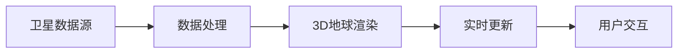

**技术特色**：
- 使用WebGL技术实现高性能3D地球渲染
- 实时处理并展示开源卫星情报数据
- 响应式设计确保跨浏览器兼容性

#### 热度分析

- 项目Star数超过24k且单日增长近1.8k，表明项目近期获得极大关注
- 高Fork数(5k+)显示社区活跃度高，用户积极参与二次开发

#### 快速上手

```bash
# 克隆项目
git clone https://github.com/bilawalsidhu/gods-eye-view.git

# 安装依赖并启动
cd gods-eye-view
npm install
npm start
```

#### 注意事项

- 项目依赖实时卫星数据源，需确保网络连接稳定
- 由于处理大量地理数据，可能需要较高性能的设备以获得流畅体验
- 项目未明确许可证，使用时需注意版权问题


### 3. cathrynlavery/diagram-design — 图表设计库

> **一句话总结**：提供38种精美编辑图表的纯HTML/SVG实现，无需依赖，即插即用。

#### 价值主张

| 维度 | 说明 |
|------|------|
| **解决痛点** | 解决专业图表设计依赖复杂工具和框架的问题 |
| **目标用户** | 需要快速创建专业图表的开发者和设计师 |
| **核心亮点** | 纯HTML/SVG实现 + 38种图表类型 + 无依赖 + 精美设计 |

#### 技术架构

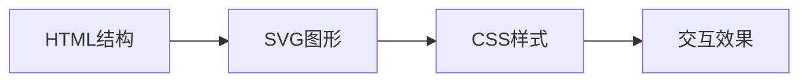

**技术特色**：
- 纯HTML/SVG实现，无需JavaScript依赖
- 38种精心设计的图表类型，覆盖常见需求
- 轻量级，可直接嵌入任何网页项目

#### 热度分析

- 项目获得高关注度，近期Star增长迅速，表明社区对其设计理念和实现方式的认可
- 无Open Issues显示项目成熟度高，维护状况良好，适合生产环境使用

#### 快速上手

```bash
# 直接克隆项目到本地
git clone https://github.com/cathrynlavery/diagram-design.git

# 在网页中引入所需图表的HTML片段
# 或直接复制SVG代码到你的项目中
```

#### 注意事项

- 项目不包含阴影效果，设计风格简约
- 不使用Mermaid等图表库，完全自主实现
- 需要一定的HTML/CSS知识进行定制化修改


### 4. freestylefly/awesome-gpt-image-2 — GPT图像提示词库

> **一句话总结**：GPT图像生成提示词与案例库，提供530+案例和20+工业级模板，持续更新。

#### 价值主张

| 维度 | 说明 |
|------|------|
| **解决痛点** | 解决GPT图像生成中提示词设计和优化的问题，提供高质量参考 |
| **目标用户** | AI艺术家、设计师、开发者及GPT图像生成爱好者 |
| **核心亮点** | 530+案例 + 20+工业级模板 + 可复用技能 + 版本对比专区 |

#### 技术架构

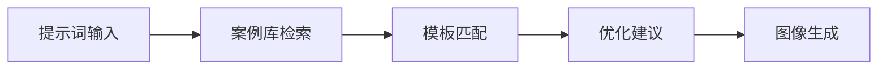

**技术特色**：
- 结构化提示词组织系统
- 模板化可复用技能库
- 版本对比与优化机制

#### 热度分析
- 项目Star数超3万，近期单日增长近千，热度持续攀升
- 零未解决问题，社区维护良好，已成为GPT图像生成领域重要资源库

#### 快速上手

```bash
# 克隆项目仓库
git clone https://github.com/freestylefly/awesome-gpt-image-2.git

# 浏览案例库和模板
cd awesome-gpt-image-2 && ls -la
```

#### 注意事项
- 项目主要提供提示词和案例，需要配合GPT图像生成工具使用
- 提示词效果可能因GPT版本不同而有所差异，建议参考项目中的对比记录
- 持续更新中，建议关注最新版本和新增内容


### 5. liquidslr/system-design-notes — 系统设计面试指南

> **一句话总结**：整理系统设计面试书籍核心知识点，为工程师提供结构化面试准备方案

#### 价值主张

| 维度 | 说明 |
|------|------|
| **解决痛点** | 解决工程师系统设计面试缺乏系统化学习资源和实践案例的问题 |
| **目标用户** | 准备技术面试的软件工程师、系统架构师、技术面试官 |
| **核心亮点** | 基于经典书籍整理 + 结构化知识体系 + 实用案例解析 + 面试技巧分享 |

#### 技术架构


**技术特色**：
- 基于知名面试书籍的内容结构化整理
- 提供从基础到高级的系统设计学习路径
- 案例驱动的知识呈现方式

#### 热度分析
- 项目获得18k+高星，近期增长迅速(+900星/天)，反映系统设计面试需求旺盛
- 高fork数(3.5k+)体现社区对内容的高度认可和二次开发需求

#### 快速上手

```bash
# 克隆项目到本地
git clone https://github.com/liquidslr/system-design-notes.git

# 浏览目录结构
cd system-design-notes && tree -L 2
```

#### 注意事项
- 本项目基于书籍整理，建议结合原书《System Design Interview - An Insider's Guide》一起学习
- 笔记可能不包含最新面试趋势，需关注系统设计领域的新发展
- 理解比记忆更重要，应注重原理而非死记硬背案例


### 6. Tencent/teamai-cli — 团队AI原生工具

> **一句话总结**：腾讯开源的CLI工具，助力团队实现AI原生工作流，提升协作效率。

#### 价值主张

| 维度 | 说明 |
|------|------|
| **解决痛点** | 团队在整合AI工具到日常工作流中缺乏统一入口和高效解决方案 |
| **目标用户** | 开发团队、产品经理、数据分析师等需要AI辅助的协作团队 |
| **核心亮点** | 统一的AI工具接入平台 + 团队知识库智能整合 + 命令行操作便捷性 + 自定义AI工作流 + 腾讯AI技术加持 |

#### 技术架构

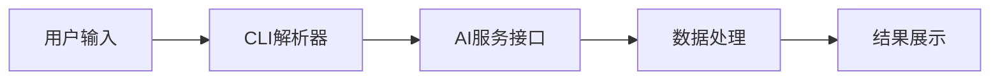

**技术特色**：
- 基于TypeScript开发，保证类型安全
- 提供统一的AI服务调用接口
- 支持自定义团队AI工作流
- 集成腾讯AI能力

#### 热度分析

- 项目近期获得841个Star，增长迅猛，表明市场需求强烈
- 作为腾讯出品，有望在AI原生团队协作领域占据重要生态位置

#### 快速上手

```bash
# 安装teamai-cli
npm install -g @tencent/teamai-cli

# 初始化团队AI配置
teamai init

# 使用AI助手完成任务
teamai ask "如何优化我们的产品性能？"
```

#### 注意事项

- 需要腾讯云账号才能使用部分高级AI功能
- 团队知识库的构建需要一定时间积累
- 可能需要学习特定的命令格式以充分利用功能


### 7. THU-MAIC/OpenMAIC — 多智能体课堂

> **一句话总结**：开源多智能体互动课堂平台，提供沉浸式学习体验，一键启动。

#### 价值主张

| 维度 | 说明 |
|------|------|
| **解决痛点** | 传统课堂互动性不足、个性化学习体验差的问题 |
| **目标用户** | 教育工作者、学生、研究人员及AI爱好者 |
| **核心亮点** | 多智能体互动 + 沉浸式学习体验 + 一键启动 + 开源可定制 |

#### 技术架构

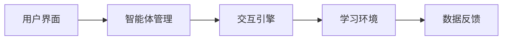

**技术特色**：
- 基于TypeScript构建，提供类型安全和良好的开发体验
- 多智能体协同学习架构，支持复杂的互动场景
- 一键启动的便捷部署方式，降低使用门槛

#### 热度分析

- 项目获得35,371个Star，近期增长迅速(+837 today)，表明社区高度关注
- 作为清华大学的开源项目，在教育AI领域具有显著影响力

#### 快速上手

```bash
# 克隆项目
git clone https://github.com/THU-MAIC/OpenMAIC.git
# 安装依赖
npm install
# 启动项目
npm start
```

#### 注意事项

- 项目许可证未知，使用时需注意授权问题
- 可能需要一定的技术背景才能进行二次开发
- 作为教育类项目，使用时需关注数据隐私和安全问题


### 8. obra/superpowers — 智能开发框架

> **一句话总结**：一套实用的智能技能框架和软件开发方法论，提升开发效率和质量。

#### 价值主张

| 维度 | 说明 |
|------|------|
| **解决痛点** | 解决软件开发中效率低下和技能不系统的问题 |
| **目标用户** | 软件开发者、技术团队和工程管理者 |
| **核心亮点** | 智能技能框架 + 实用方法论 + 高效开发流程 + 团队协作模式 |

#### 技术架构

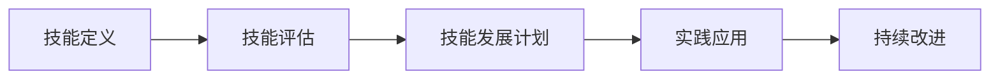

**技术特色**：
- 基于Shell的轻量级实现，跨平台兼容
- 模块化的技能框架设计，可扩展性强
- 实用主义的开发方法论，注重实践效果

#### 热度分析

- 项目拥有28万+ stars，且每天新增700+ stars，增长迅速
- 高fork数表明社区活跃度高，被广泛采用和定制

#### 快速上手

```bash
git clone https://github.com/obra/superpowers.git
cd superpowers && ./install.sh
source superpowers.sh
```

#### 注意事项

- 项目没有明确许可证，使用时需注意版权问题
- 可能需要一定的Shell脚本知识和开发经验
- 方法论可能需要团队协作才能发挥最大效果


### 9. diegosouzapw/OmniRoute — 统一AI网关

> **一句话总结**：一站式AI模型聚合网关，统一接入352+提供商，智能回退与压缩节省95% token

#### 价值主张

| 维度 | 说明 |
|------|------|
| **解决痛点** | AI模型接口分散、成本高、管理复杂的问题 |
| **目标用户** | 需要使用多种AI模型的开发者、企业和AI应用开发者 |
| **核心亮点** | 352+提供商统一接入 + 配额感知自动回退 + RTK压缩技术节省95%token |

#### 技术架构

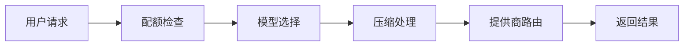

**技术特色**：
- RTK+Caveman压缩技术大幅降低token消耗
- 配额感知的智能回退机制
- 统一的多提供商接口抽象层

#### 热度分析

- 项目获得64,280个Star，单日增长626，正处于快速增长期
- 8,998个Fork和550+贡献者显示项目活跃度高，形成良好开源生态

#### 快速上手

```bash
# 克隆项目
git clone https://github.com/diegosouzapw/OmniRoute.git

# 安装依赖并启动
npm install && npm start
```

#### 注意事项

- 需要配置各个AI提供商的API密钥才能正常使用
- 不同模型的配额限制和使用成本需要仔细管理
- 压缩技术可能会影响某些模型的输出质量


### 10. vastsa/PI-Desktop — 本地AI编程助手

> **一句话总结**：基于Electron与Rust的本地优先AI编程桌面助手，提供插件扩展能力。

#### 价值主张

| 维度 | 说明 |
|------|------|
| **解决痛点** | 解决云端AI编程工具的隐私顾虑与延迟问题 |
| **目标用户** | 注重隐私与性能的开发者与AI编程爱好者 |
| **核心亮点** | 本地AI运行 + Rust高性能核心 + 插件扩展 + 跨平台支持 + 隐私保护 |

#### 技术架构

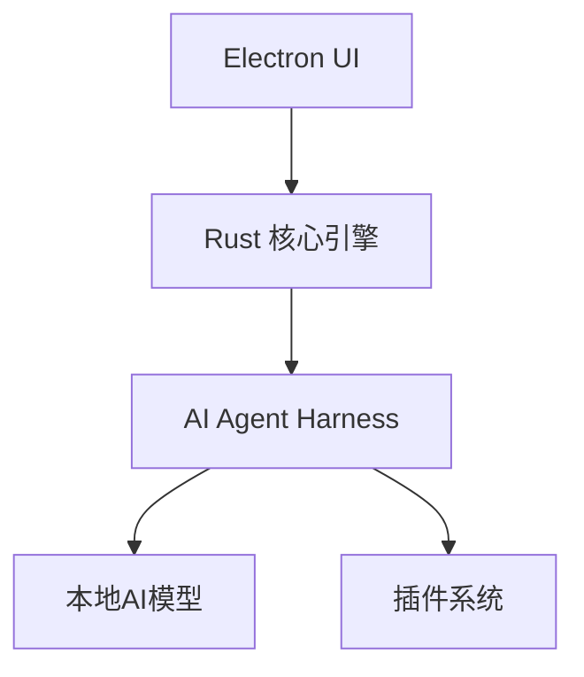

**技术特色**：
- 结合Electron开发效率与Rust性能优势
- 本地AI处理确保数据隐私与低延迟响应
- 模块化插件架构支持功能扩展

#### 热度分析

- 项目近期热度显著上升，单日增长624星，表明受到开发者广泛关注
- 相对较低的Fork数显示社区更处于评估阶段，实际参与度有待提升

#### 快速上手

```bash
git clone https://github.com/vastsa/PI-Desktop.git
cd PI-Desktop
npm install && npm start
```

#### 注意事项

- 项目许可证未知，使用时需注意版权合规性
- 本地AI运行对硬件配置有一定要求，特别是GPU资源
- 作为新兴项目，API和功能可能存在不稳定变化


### 11. alsk1992/CloddsBot — AI交易机器人

> **一句话总结**：开源AI交易代理，跨千余市场自主执行交易，基于Claude构建并支持自托管。

#### 价值主张

| 维度 | 说明 |
|------|------|
| **解决痛点** | 自动化跨市场交易，消除人为干预，提高交易效率与风险管理 |
| **目标用户** | 加密货币交易者、量化团队、寻求自动化交易解决方案的机构 |
| **核心亮点** | 跨千余市场支持 + AI驱动决策 + 自主风险管理 + 自托管部署 + 实时执行 |

#### 技术架构

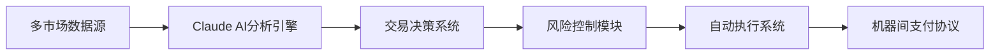

**技术特色**：
- 基于Claude AI构建的智能分析引擎
- 支持1000+市场的统一接入层
- 机器间支付协议实现自动化结算
- 自托管架构保障数据安全与隐私

#### 热度分析

- 项目Star数1691且单日增长277，显示快速增长趋势和社区高度关注
- Fork数259表明有一定社区参与度和二次开发潜力

#### 快速上手

```bash
# 克隆仓库
git clone https://github.com/alsk1992/CloddsBot.git
cd CloddsBot
# 安装依赖并配置
npm install && npm run config
# 启动服务
npm start
```

#### 注意事项

- 项目许可证信息不明确，使用前需确认授权条款
- 作为自动化交易系统，存在市场风险和潜在亏损可能
- 跨市场操作需注意不同平台的API限制和合规要求


### 12. AlexsJones/llmfit — 硬件适配检测

> **一句话总结**：通过单次命令检测硬件兼容性，支持数百种AI模型与提供商。

#### 价值主张

| 维度 | 说明 |
|------|------|
| **解决痛点** | 解决用户无法确定硬件能否运行特定AI模型的问题 |
| **目标用户** | AI开发者、研究人员和普通用户 |
| **核心亮点** | 支持数百种模型 + 一键检测硬件兼容性 + 跨平台支持 |

#### 技术架构


**技术特色**：
- 使用Rust编写，确保高性能和内存安全
- 自动检测硬件配置和兼容性
- 支持多种AI模型提供商和框架

#### 热度分析

- 项目获得超过35k星且持续增长，表明社区对AI硬件兼容性需求强烈
- 零开放Issues反映项目成熟度高，问题解决机制有效

#### 快速上手

```bash
# 安装
cargo install llmfit

# 运行检测
llmfit
```

#### 注意事项

- 需要安装Rust环境才能编译和运行
- 检测结果可能因系统配置而异，建议参考官方文档获取最佳实践


### 13. nashsu/llm_wiki — 智能知识库

> **一句话总结**：基于大语言模型的跨平台桌面应用，将文档自动转化为互联知识库，实现持久化信息管理。

#### 价值主张

| 维度 | 说明 |
|------|------|
| **解决痛点** | 传统RAG每次从头检索回答，无法构建持久化知识结构 |
| **目标用户** | 需要管理大量文档并构建知识体系的研究者、学者和知识工作者 |
| **核心亮点** | 增量构建知识库 + 跨平台支持 + 自动文档互联 + 持久化存储 + 知识图谱可视化 |

#### 技术架构


**技术特色**：
- 采用增量式知识构建而非传统RAG模式
- 基于LLM的自动知识关联与结构化处理
- 跨平台桌面应用实现，兼容多种操作系统
- 知识图谱可视化展示，直观呈现知识关联
- 高效持久化存储机制，支持长期知识积累

#### 热度分析

- 项目Star数已达18,155，今日增长142，表明项目处于高速增长期，用户对智能知识管理工具需求强烈
- 作为开源项目，社区活跃度高，Fork数达2,100，说明开发者社区对其技术实现和架构有浓厚兴趣

#### 快速上手

```bash
# 安装依赖
npm install

# 构建项目
npm run build

# 启动应用
npm start
```

#### 注意事项

- 需要确保文档格式兼容性，不同格式可能需要预处理
- 知识库构建过程可能需要较强的计算资源，特别是处理大量文档时
- 注意LLM API的使用限制和成本控制，避免超额计费
- 数据隐私和安全性需要特别关注，特别是处理敏感文档时


### 14. vercel-labs/skills — AI代理技能工具

> **一句话总结**：开放式的AI代理技能工具，通过npx命令即可使用，为AI代理提供各种能力扩展。

#### 价值主张

| 维度 | 说明 |
|------|------|
| **解决痛点** | 为AI代理提供可扩展的技能库，增强AI能力边界 |
| **目标用户** | AI开发者、研究人员和需要扩展AI能力的用户 |
| **核心亮点** | 模块化技能设计 + 易于集成 + 开源生态 + npx即用 |

#### 技术架构

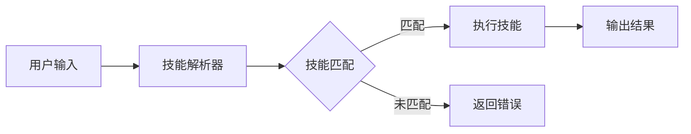

**技术特色**：
- 基于TypeScript开发，类型安全
- 模块化技能设计，便于扩展
- 通过npx即用，无需全局安装

#### 热度分析

- 项目获得超过31k星，日增122星，增长迅速，表明社区高度认可
- 作为Vercel Labs项目，受益于Vercel生态影响，在AI工具领域占据重要位置

#### 快速上手

```bash
# 使用npx运行skills工具
npx skills
# 或者指定特定技能
npx skills [skill-name]
```

#### 注意事项

- 项目当前没有公开的Issues，可能通过其他渠道进行问题反馈
- 许可证信息不明确，使用前需确认开源协议
- 作为实验室项目，API和功能可能随时变化


### 15. JustVugg/colibri — 轻量MoE引擎

> **一句话总结**：纯C实现的无依赖MoE模型运行引擎，支持从磁盘流式加载专家模型。

#### 价值主张

| 维度 | 说明 |
|------|------|
| **解决痛点** | 解决在普通硬件上运行大型MoE模型资源限制问题 |
| **目标用户** | 需要在本地运行大模型的研究者和开发者 |
| **核心亮点** | 纯C实现 + 零依赖 + 专家模型流式加载 |

#### 技术架构

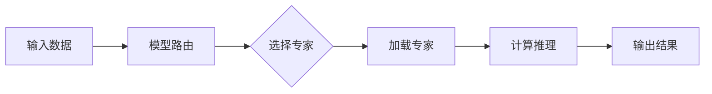

**技术特色**：
- 纯C实现，无外部依赖，编译简单
- 专家模型从磁盘流式加载，减少内存占用
- 轻量级引擎设计，适合资源受限环境

#### 热度分析

- 项目Star数超过27k，近期增长稳定，显示社区高度认可
- 零Open Issues表明项目成熟度高，维护状态良好

#### 快速上手

```bash
# 克隆项目
git clone https://github.com/JustVugg/colibri.git
# 编译运行
cd colibri && make && ./colibri
```

#### 注意事项

- 项目License未知，商业使用前需确认授权
- 纯C实现意味着需要手动管理内存，需注意内存安全
- 专家模型需要预先准备和配置


## 今日推荐

| 主题 | 推荐项目 | 亮点 |
|------|----------|------|
| 今日最热 | [ayghri/i-have-adhd](https://github.com/ayghri/i-have-adhd) | A skill to stop y... |
| 值得关注 | [bilawalsidhu/gods-eye-view](https://github.com/bilawalsidhu/gods-eye-view) | A spy satellite s... |
| 快速上手 | [cathrynlavery/diagram-design](https://github.com/cathrynlavery/diagram-design) | 38 editorial diag... |
| 长期潜力 | [freestylefly/awesome-gpt-image-2](https://github.com/freestylefly/awesome-gpt-image-2) | Prompt as Code | ... |

---

<div align="center">

*Generated on 2026-09-11 | Powered by GitHub Trending Reporter*

</div>