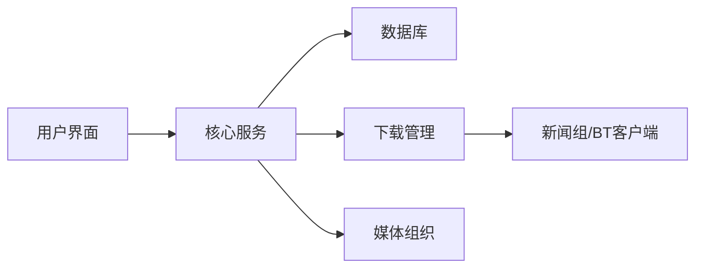
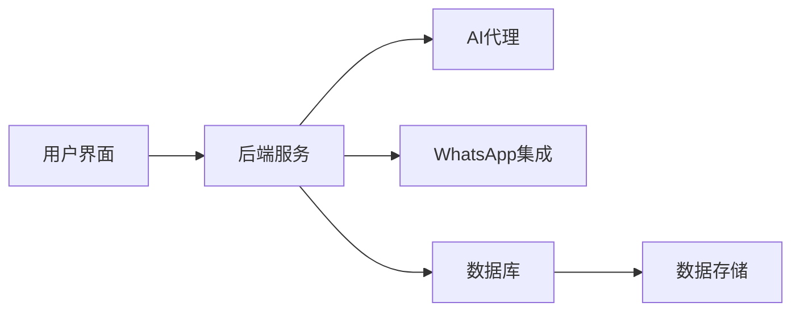
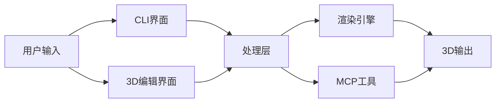

## 今日热点

今日GitHub热榜项目精彩纷呈。

---

## 热门项目一览

| 排名 | 项目 | 语言 | 今日 | 总计 | 简介 |
|:---:|------|:----:|------:|-----:|------|
| 1 | [bilawalsidhu/gods-eye-view](https://github.com/bilawalsidhu/gods-eye-view) | JavaScript | +3,680 | 27,218 | A spy satellite simulator i... |
| 2 | [ayghri/i-have-adhd](https://github.com/ayghri/i-have-adhd) | Python | +3,463 | 41,962 | A skill to stop your coding... |
| 3 | [github/spec-kit](https://github.com/github/spec-kit) | Python | +1,015 | 135,785 | 💫 Toolkit to help you get s... |
| 4 | [obra/superpowers](https://github.com/obra/superpowers) | Shell | +729 | 285,392 | An agentic skills framework... |
| 5 | [nashsu/llm_wiki](https://github.com/nashsu/llm_wiki) | TypeScript | +647 | 18,766 | LLM Wiki is a cross-platfor... |
| 6 | [alsk1992/CloddsBot](https://github.com/alsk1992/CloddsBot) | TypeScript | +626 | 2,168 | Open Source AI trading agen... |
| 7 | [vastsa/PI-Desktop](https://github.com/vastsa/PI-Desktop) | TypeScript | +552 | 2,795 | Local-first AI coding agent... |
| 8 | [armory3d/armorpaint](https://github.com/armory3d/armorpaint) | C | +350 | 4,738 | Graphics Creation Tools |
| 9 | [p1neappleXpress/OpenFlux](https://github.com/p1neappleXpress/OpenFlux) | Go | +198 | 1,162 | Network stack research tool... |
| 10 | [Sonarr/Sonarr](https://github.com/Sonarr/Sonarr) | C# | +191 | 15,746 | Smart PVR for newsgroup and... |
| 11 | [jordan-gibbs/hyperresearch](https://github.com/jordan-gibbs/hyperresearch) | Python | +153 | 2,645 | Agent-driven research knowl... |
| 12 | [melgarafael/DeskcommCRM](https://github.com/melgarafael/DeskcommCRM) | TypeScript | +152 | 1,372 | Open-source AI sales OS — s... |

---

## 趋势洞察

```
┌─────────────────────────────────────────────────────────────────┐
│  AI/ML 工具         ████████████████████████  11 个项目        │
│  开发工具             ████                      2 个项目        │
│  智能家居             ██                        1 个项目        │
│  数据分析             ██                        1 个项目        │
│  其他               ██                        1 个项目        │
└─────────────────────────────────────────────────────────────────┘
```

---

## 项目深度解读

### 1. bilawalsidhu/gods-eye-view — 实时地球可视化

> **一句话总结**：基于真实数据的浏览器端间谍卫星模拟器，提供开源空间情报的3D地球可视化。

#### 价值主张

| 维度 | 说明 |
|------|------|
| **解决痛点** | 提供真实数据的全球空间情报可视化，无需专业卫星设备 |
| **目标用户** | 地理情报爱好者、数据可视化开发者、军事安全研究人员 |
| **核心亮点** | 实时数据+逼真3D地球+开源情报+浏览器访问+交互式探索 |

#### 技术架构


**技术特色**：
- 使用WebGL实现高性能3D地球渲染
- 实时数据流处理和可视化
- 开源情报数据的整合与展示机制

#### 热度分析

- Star数达27,218且近期增长迅速，表明项目具有高实用价值和吸引力
- Fork数与Star数比例适中，说明项目既有观赏性也有二次开发价值

#### 快速上手

```bash
# 克隆项目
git clone https://github.com/bilawalsidhu/gods-eye-view.git

# 安装依赖
npm install

# 启动开发服务器
npm start
```

#### 注意事项

- 项目可能需要较新的浏览器支持WebGL
- 数据源可能受地区访问限制
- 需要注意数据隐私和合规性问题


### 2. ayghri/i-have-adhd — [ADHD辅助工具]

> **一句话总结**：优化AI代码助手的输出格式，为ADHD用户提供清晰、结构化的信息呈现，减轻认知负担。

#### 价值主张

| 维度 | 说明 |
|------|------|
| **解决痛点** | AI代码助手输出信息冗长复杂，ADHD用户难以快速获取关键信息 |
| **目标用户** | 患有ADHD的程序员和开发者，以及对信息结构化有需求的用户 |
| **核心亮点** | 信息简化 + 结构化输出 + 减少认知负担 + 提高信息获取效率 |

#### 技术架构


**技术特色**：
- 信息过滤与简化技术
- 结构化内容生成
- 低认知负担设计

#### 热度分析

- 项目获得近4.2万Star，单日增长超3000，显示其解决了大量开发者的实际痛点
- 在AI辅助编程工具领域，针对特定用户群体的创新设计，形成独特生态位

#### 快速上手

```bash
# 安装项目
pip install i-have-adhd

# 使用示例
i-have-adhd "your complex code explanation request"
```

#### 注意事项

- 该项目主要针对ADHD用户，但对任何需要更清晰信息呈现的用户都有价值
- 使用前可能需要根据个人需求调整输出格式
- 与主流AI编程助手的兼容性需要确认


### 3. github/spec-kit — 规范驱动工具

> **一句话总结**：提供规范驱动开发工具集，帮助开发者先定义行为规范再编写实现代码。

#### 价值主张

| 维度 | 说明 |
|------|------|
| **解决痛点** | 解决开发过程中需求不明确、实现与预期不符的问题 |
| **目标用户** | 注重代码质量和可测试性的开发团队和个人开发者 |
| **核心亮点** | 提供规范模板 + 自动生成测试代码 + 支持多种测试框架 |

#### 技术架构


**技术特色**：
- 基于Python的规范解析和验证引擎
- 支持多种测试框架的无缝集成
- 提供规范到代码的自动转换机制

#### 热度分析

- 项目获得13.5万+星标，近期增长迅速，表明规范驱动开发方法受到广泛关注
- Fork数与Star数比例合理，说明项目不仅被关注，还被实际使用和二次开发

#### 快速上手

```bash
# 安装spec-kit
pip install spec-kit

# 初始化项目规范
spec-kit init my_project

# 根据规范生成测试代码
spec-kit generate tests

# 运行测试验证规范
spec-kit run tests
```

#### 注意事项

- 项目许可证信息不明确，商业使用前需确认授权条款
- 规范驱动开发需要一定的学习曲线，团队需适应先写规范后编码的工作方式
- 项目Issue数为0，可能表示项目维护活跃度高，但也可能意味着问题反馈渠道不够明确


### 4. obra/superpowers — 开发效能框架

> **一句话总结**：一个实用的智能技能框架，提供高效能的软件开发方法论和工具集。

#### 价值主张

| 维度 | 说明 |
|------|------|
| **解决痛点** | 提升开发者技能和团队协作效率，解决开发效能瓶颈 |
| **目标用户** | 软件开发团队、技术管理者和追求高效能的开发者 |
| **核心亮点** | 实用方法论 + 智能代理能力 + 工具集成 + 最佳实践 |

#### 技术架构


**技术特色**：
- 基于Shell脚本实现，轻量级且跨平台兼容
- 融合智能代理技术，增强开发决策能力
- 提供结构化的软件开发方法论，规范开发流程

#### 热度分析

- 项目获得近30万Star，每日新增700+，呈现稳定高速增长态势
- 社区参与度高，Fork数量可观，表明项目具有实用价值和生态影响力

#### 快速上手

```bash
# 克隆项目
git clone https://github.com/obra/superpowers.git
# 进入目录
cd superpowers
# 运行安装脚本
./install.sh
```

#### 注意事项

- 项目使用Shell脚本开发，需要基本的Shell环境知识
- 由于项目描述较为抽象，可能需要结合团队实际情况调整方法论
- 项目License未知，商业使用前需确认授权方式


### 5. nashsu/llm_wiki — 智能知识库构建

> **一句话总结**：LLM Wiki将文档自动转化为互联的持久化知识库，实现增量式知识构建而非传统RAG的重复检索。

#### 价值主张

| 维度 | 说明 |
|------|------|
| **解决痛点** | 解决传统RAG系统每次需从零开始检索的问题，实现知识增量构建与持久化 |
| **目标用户** | 研究人员、学者和需要管理大量文档建立知识关联的知识工作者 |
| **核心亮点** | 增量式知识构建 + 持久化存储 + 自动文档关联 + 跨平台支持 + 知识图谱可视化 |

#### 技术架构


**技术特色**：
- 增量式知识构建算法，避免重复处理文档内容
- 持久化知识存储机制，维护长期知识连贯性
- 智能文档关联技术，自动发现知识间隐含联系

#### 热度分析

- 项目获18,766个Star且单日增长647，处于快速增长期，受社区高度关注
- Fork数达2,135，表明社区积极参与二次开发和功能扩展，生态活跃度高

#### 快速上手

```bash
# 克隆项目
git clone https://github.com/nashsu/llm_wiki.git
cd llm_wiki

# 安装依赖并运行
npm install
npm run start
```

#### 注意事项

- 项目许可证未知，使用前需确认授权条款
- 作为桌面应用，可能需要特定操作系统的支持
- 大量文档处理可能需要较高的计算资源


### 6. alsk1992/CloddsBot — AI交易代理

> **一句话总结**：跨多市场的开源AI交易代理，自主扫描机会、即时执行交易并管理风险，实现机器间支付。

#### 价值主张

| 维度 | 说明 |
|------|------|
| **解决痛点** | 自动化交易效率低、跨市场操作复杂、风险管理困难 |
| **目标用户** | 量化交易者、加密货币投资者、套利交易者 |
| **核心亮点** | 跨1000+市场运行 + 基于Claude的AI决策 + 自主风险管理 + 机器间支付协议 |

#### 技术架构


**技术特色**：
- 基于Claude的AI决策引擎实现智能交易
- 支持跨链多市场数据整合与分析
- 自适应风险管理算法确保交易安全

#### 热度分析

- Star数达2168，单日增长626，表明项目近期热度极高
- 0个开放问题，表明项目维护良好，可能处于稳定发展阶段

#### 快速上手

```bash
# 克隆仓库
git clone https://github.com/alsk1992/CloddsBot.git
# 安装依赖
npm install
# 配置API密钥和环境变量
cp config.example.json config.json
# 启动交易代理
npm start
```

#### 注意事项

- 项目未明确许可证，使用前需确认授权条款
- 涉及真实资金交易，存在市场风险，建议先在测试环境运行
- 需要为多个交易所配置API密钥，注意保护账户安全


### 7. vastsa/PI-Desktop — 本地AI编程助手

> **一句话总结**：本地优先的AI编程助手桌面应用，结合Electron界面与Rust核心引擎，支持插件扩展。

#### 价值主张

| 维度 | 说明 |
|------|------|
| **解决痛点** | 解决云端AI工具隐私与延迟问题，提供本地化编程辅助 |
| **目标用户** | 注重数据隐私和离线工作的开发者、程序员 |
| **核心亮点** | 本地优先架构 + Electron+Rust混合实现 + 可扩展插件系统 |

#### 技术架构


**技术特色**：
- Electron与Rust混合架构，平衡UI性能与计算效率
- 本地优先设计，保障用户代码与数据隐私安全
- 模块化插件系统，支持功能灵活扩展

#### 热度分析

- 项目Star数2795且单日增长552，显示极高关注度，契合AI编程工具热点
- Fork数219表明社区参与度较高，有二次开发意愿

#### 快速上手

```bash
# 克隆项目
git clone https://github.com/vastsa/PI-Desktop.git
# 安装依赖
npm install
# 运行应用
npm start
```

#### 注意事项

- 项目许可证信息不明确，使用时需注意版权问题
- 本地AI助手可能需要较高硬件配置，尤其是处理大型代码库时
- 插件生态系统尚在发展，功能可能受限于社区贡献


### 8. armory3d/armorpaint — 3D纹理绘制工具

> **一句话总结**：基于Armory3D引擎的专业3D纹理绘制工具，提供直观的PBR材质创作体验。

#### 价值主张

| 维度 | 说明 |
|------|------|
| **解决痛点** | 简化3D纹理创作流程，提升材质设计效率 |
| **目标用户** | 3D艺术家、游戏开发者、材质设计师 |
| **核心亮点** | 实时渲染预览 + 基于物理的材质编辑 + 多图层支持 + 纹理烘焙工具 + 直观的用户界面 |

#### 技术架构


**技术特色**：
- 基于物理的渲染(PBR)材质编辑技术
- 多图层混合与纹理合成算法
- 实时预览与渲染管线优化

#### 热度分析

- 项目获得4738个Star且单日新增350个，显示出强劲的增长势头和开发者社区认可
- 作为Armory3D生态系统的重要组成部分，正在构建完整的3D内容创作工具链

#### 快速上手

```bash
# 克隆项目
git clone https://github.com/armory3d/armorpaint.git
# 进入项目目录
cd armorpaint
# 构建项目
make
# 运行程序
./armorpaint
```

#### 注意事项

- 项目需要一定的图形学基础知识才能充分利用
- 需要确保系统满足OpenGL等图形API的要求
- 由于项目仍在活跃开发中，API可能会有变化


### 9. p1neappleXpress/OpenFlux — 网络隧道工具

> **一句话总结**：具有可插拔传输功能的高性能网络研究工具，提供灵活的 TCP 隧道能力。

#### 价值主张

| 维度 | 说明 |
|------|------|
| **解决痛点** | 为网络研究和安全测试提供可定制的隧道解决方案 |
| **目标用户** | 网络安全研究员、网络开发者、系统管理员 |
| **核心亮点** | 可插拔传输架构 + 高性能Go实现 + 研究专用工具集 |

#### 技术架构


**技术特色**：
- 基于 Go 语言实现，提供高效并发处理能力
- 可插拔传输架构，支持多种传输协议灵活切换
- 专为网络研究设计，提供详细的流量分析功能

#### 热度分析

- 项目获得 1,162 个 Star，单日新增 198，增长迅速，表明技术价值获认可
- Fork 数量较少（88），说明项目处于早期阶段，社区贡献尚未大规模展开

#### 快速上手

```bash
# 安装 OpenFlux
go get github.com/p1neappleXpress/OpenFlux

# 启动服务器端
openflux server -l :8080

# 启动客户端连接
openflux client -s server:8080 -d localhost:80
```

#### 注意事项

- 项目许可证未知，使用前需确认法律合规性
- 目前 Open Issues 为 0，可能表示项目处于早期阶段，稳定性有待验证
- 作为研究工具，使用时需注意网络法规和合规要求


### 10. Sonarr/Sonarr — 智能电视管家

> **一句话总结**：为新闻组和 BT 用户提供的自动化电视节目管理工具，实现智能追踪与整理。

#### 价值主张

| 维度 | 说明 |
|------|------|
| **解决痛点** | 解决电视节目自动获取、整理与管理的繁琐流程 |
| **目标用户** | 新闻组与 BT 用户，电视节目收藏爱好者 |
| **核心亮点** | 自动化剧集追踪 + 多源下载整合 + 智能媒体组织 |

#### 技术架构



**技术特色**：
- 基于 .NET 构建的跨平台服务应用
- RESTful API 提供丰富的扩展能力
- 插件架构支持多种下载源集成

#### 热度分析

- 项目持续高热度增长，日均新增百余 Stars，表明社区活跃度高
- 作为媒体管理工具生态的重要一环，与 Radarr、Lidarr 等形成完整解决方案

#### 快速上手

```bash
# Docker 安装方式
docker run -d --name sonarr \
    -v /path/to/config:/config \
    -v /path/to/tvseries:/tv \
    -v /path/to/downloads:/downloads \
    -e PUID=1000 \
    -e PGID=1000 \
    -e TZ=Europe/London \
    linuxserver/sonarr

# 访问 Web 界面
http://localhost:8989
```

#### 注意事项

- 需要注意版权法规，确保下载内容合法合规
- 配置适当的存储空间，因为长期使用会积累大量媒体文件
- 建议配合下载工具如 NZBGet 或 Transmission 使用以获得最佳体验


### 11. jordan-gibbs/hyperresearch — AI研究知识库

> **一句话总结**：基于AI代理的自动化研究系统，将网络信息收集整合为可搜索的知识维基。

#### 价值主张

| 维度 | 说明 |
|------|------|
| **解决痛点** | 研究信息分散难以整合，研究过程耗时且难以持续追踪 |
| **目标用户** | 研究人员、分析师、内容创作者和知识工作者 |
| **核心亮点** | AI代理自动收集 + 智能信息合成 + 持久化知识存储 + 高效搜索功能 |

#### 技术架构


**技术特色**：
- 基于Python的AI代理系统实现
- 自动化网络信息收集与处理流程
- 持久化知识存储与高效检索机制

#### 热度分析

- 项目获得2645星且近期增长迅速(+153/天)，表明社区对该AI研究工具有强烈兴趣
- 零开放问题显示项目维护状态良好，可能已进入稳定阶段或问题处理高效

#### 快速上手

```bash
# 克隆项目
git clone https://github.com/jordan-gibbs/hyperresearch.git
cd hyperresearch

# 安装依赖
pip install -r requirements.txt

# 运行项目
python main.py
```

#### 注意事项

- 项目许可证未知，商业使用前需确认授权条款
- 作为AI驱动的研究工具，需注意数据来源的可靠性和版权问题
- 建议在使用前了解AI代理的工作机制和数据处理方式


### 12. melgarafael/DeskcommCRM — AI销售CRM

> **一句话总结**：开源AI驱动销售操作系统，自托管CRM集成WhatsApp与智能代理

#### 价值主张

| 维度 | 说明 |
|------|------|
| **解决痛点** | 企业需要开源、自托管的AI驱动销售CRM替代商业解决方案 |
| **目标用户** | 依赖聊天渠道销售的中小型企业，注重数据隐私 |
| **核心亮点** | 自托管部署 + AI销售代理 + WhatsApp集成 + 多租户支持 + LGPD合规 |

#### 技术架构



**技术特色**：
- TypeScript全栈开发，保证类型安全
- 自托管部署模式，增强数据控制权
- 集成WAHA实现WhatsApp无缝对接
- 多租户架构，支持多企业使用
- MCP兼容，易于扩展集成

#### 热度分析

- 项目短期内Star增长迅速，单日新增152星，显示市场认可度高
- Fork数量适中，表明社区有活跃但尚未大规模采用，处于早期成长阶段

#### 快速上手

```bash
# 克隆项目
git clone https://github.com/melgarafael/DeskcommCRM.git

# 进入项目目录
cd DeskcommCRM

# 使用Docker启动
docker-compose up -d
```

#### 注意事项

- 项目许可证未知，商业使用前需确认授权条款
- 作为自托管系统，用户需具备一定的技术能力进行部署和维护
- 项目Open Issues为0，可能意味着项目处于早期阶段或问题管理方式不同
- 集成WhatsApp可能需要额外的API配置和认证


### 13. jihe520/MathModelAgent — 数学建模自动化

> **一句话总结**：自动化完成数学建模全流程，直接生成可提交的完整论文，大幅提升建模效率。

#### 价值主张

| 维度 | 说明 |
|------|------|
| **解决痛点** | 解决数学建模流程繁琐、耗时痛点，实现从问题到论文的自动化生成 |
| **目标用户** | 数学建模竞赛参与者、科研人员、学生 |
| **核心亮点** | 自动化建模流程 + 智能论文生成 + 多种数学模型库集成 + 高效计算引擎 |

#### 技术架构


**技术特色**：
- 基于AI的自动建模能力，智能选择最适合的数学模型
- 多种数学模型库集成，覆盖常见建模场景
- 智能论文格式化生成，符合学术规范

#### 热度分析

- 项目近5000个Star，日均增长130+，热度持续攀升且增速明显
- Fork数相对较少，表明项目处于早期探索阶段，用户更多关注而非二次开发

#### 快速上手

```bash
# 克隆项目
git clone https://github.com/jihe520/MathModelAgent.git

# 安装依赖
pip install -r requirements.txt

# 运行示例
python main.py --input example_problem.txt
```

#### 注意事项

- 项目许可证信息不明确，商业使用前需确认授权方式
- 自动生成的论文可能需要人工审核和修改，确保内容准确性
- 复杂数学建模场景可能需要人工干预调整模型参数和求解策略


### 14. alphaXiv/OpenResearch — 并行研究代理系统

> **一句话总结**：基于Rust的高性能并行研究代理系统，支持多种AI模型协同工作

#### 价值主张

| 维度 | 说明 |
|------|------|
| **解决痛点** | 解决单模型研究效率低、资源利用率不足的问题 |
| **目标用户** | 研究人员、数据科学家、AI开发者 |
| **核心亮点** | 高性能并行处理+多模型支持+资源优化+可扩展架构 |

#### 技术架构


**技术特色**：
- 基于Rust的高性能并发处理框架
- 支持多种AI模型的统一接口设计
- 智能任务分配与资源优化机制

#### 热度分析
- 项目Star数快速增长，显示社区高度关注
- 零OpenIssues表明项目维护良好，问题解决及时

#### 快速上手

```bash
# 安装
cargo install openresearch

# 运行研究任务
openresearch --model gpt-4 --parallel 4 --input research_query.txt
```

#### 注意事项
- 项目License未知，使用前需确认授权条款
- 需要确保有足够的计算资源支持并行处理
- 可能需要配置AI模型访问权限和API密钥


### 15. pascalorg/editor — 3D建筑设计工具

> **一句话总结**：开源3D建筑设计编辑器，集成本地CLI与MCP工具，支持人机协作工作流程

#### 价值主张

| 维度 | 说明 |
|------|------|
| **解决痛点** | 简化3D建筑设计流程，打破传统工具与AI协作的壁垒 |
| **目标用户** | 建筑师、设计师、AI研究人员及3D建模爱好者 |
| **核心亮点** | 开源架构+本地CLI工具+MCP集成+人机协作工作流+3D编辑能力 |

#### 技术架构



**技术特色**：
- 基于TypeScript的全栈开发架构，确保类型安全与代码质量
- 集成MCP协议实现AI代理与设计工具的无缝协作
- 本地CLI工具链提供轻量级操作入口，增强工具可用性

#### 热度分析

- 项目Star数持续增长，日增百余星，表明社区认可度高且发展势头强劲
- Fork数近三千，显示开发者社区积极参与贡献，形成活跃的二次开发生态

#### 快速上手

```bash
# 克隆仓库
git clone https://github.com/pascalorg/editor.git

# 安装依赖
cd editor
npm install

# 启动应用
npm start
```

#### 注意事项

- 项目需要一定的3D建模和建筑设计基础知识
- 由于项目许可证信息未知，商业使用前需确认授权条款
- 集成AI功能可能需要额外的模型和环境配置


### 16. nab138/iloader — 应用侧载工具

> **一句话总结**：简洁易用的应用侧载工具，帮助用户安全便捷地安装第三方应用程序。

#### 价值主张

| 维度 | 说明 |
|------|------|
| **解决痛点** | 用户难以安全、便捷地安装非官方应用，官方商店限制多 |
| **目标用户** | 希望安装第三方应用但寻求简化操作流程的用户 |
| **核心亮点** | 用户友好界面 + 安全验证机制 + 多平台支持 + 简化安装流程 |

#### 技术架构


**技术特色**：
- 使用TypeScript确保代码质量和类型安全
- 采用模块化设计便于扩展和维护
- 包含应用验证机制保障安全性

#### 热度分析

- 项目获得近3K星标且持续增长，表明其功能实用且获得社区广泛认可
- 作为侧载工具，填补了官方应用商店限制与用户需求之间的空白，具有独特生态价值

#### 快速上手

```bash
# 安装iLoader
npm install -g iLoader

# 使用iLoader安装应用
iloader install <应用名称或URL>
```

#### 注意事项

- 安装非官方应用可能存在安全风险，建议仅从可信来源下载
- 某些平台可能对侧载应用有限制，使用前请了解相关规定


## 今日推荐

| 主题 | 推荐项目 | 亮点 |
|------|----------|------|
| 今日最热 | [bilawalsidhu/gods-eye-view](https://github.com/bilawalsidhu/gods-eye-view) | A spy satellite s... |
| 值得关注 | [ayghri/i-have-adhd](https://github.com/ayghri/i-have-adhd) | A skill to stop y... |
| 快速上手 | [github/spec-kit](https://github.com/github/spec-kit) | 💫 Toolkit to help... |
| 长期潜力 | [obra/superpowers](https://github.com/obra/superpowers) | An agentic skills... |

---

<div align="center">

*Generated on 2026-09-12 | Powered by GitHub Trending Reporter*

</div>