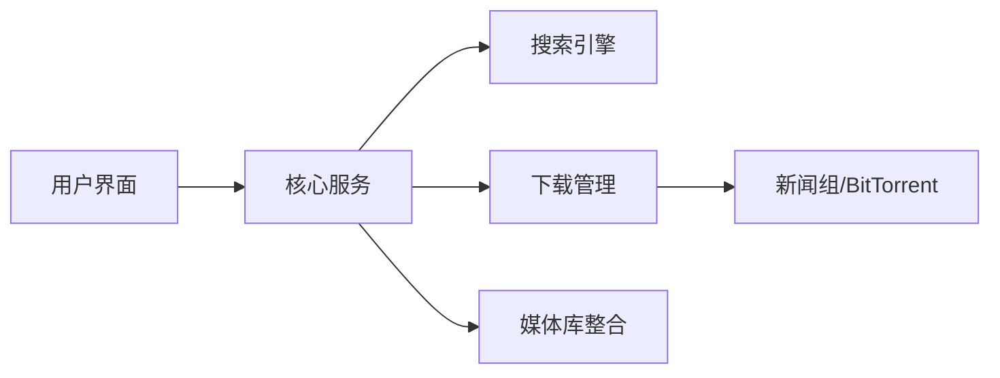

## 今日热点

今日GitHub热榜项目精彩纷呈。

---

## 热门项目一览

| 排名 | 项目 | 语言 | 今日 | 总计 | 简介 |
|:---:|------|:----:|------:|-----:|------|
| 1 | [bilawalsidhu/gods-eye-view](https://github.com/bilawalsidhu/gods-eye-view) | JavaScript | +2,265 | 30,021 | A spy satellite simulator i... |
| 2 | [melgarafael/DeskcommCRM](https://github.com/melgarafael/DeskcommCRM) | TypeScript | +504 | 1,829 | Open-source AI sales OS — s... |
| 3 | [alsk1992/CloddsBot](https://github.com/alsk1992/CloddsBot) | TypeScript | +376 | 2,522 | Open Source AI trading agen... |
| 4 | [p1neappleXpress/OpenFlux](https://github.com/p1neappleXpress/OpenFlux) | Go | +355 | 1,409 | Network stack research tool... |
| 5 | [jihe520/MathModelAgent](https://github.com/jihe520/MathModelAgent) | Python | +262 | 5,144 | 🤖📐专为数学建模设计的 Agent & skills ... |
| 6 | [armory3d/armorpaint](https://github.com/armory3d/armorpaint) | C | +237 | 4,919 | Graphics Creation Tools |
| 7 | [Shubhamsaboo/awesome-llm-apps](https://github.com/Shubhamsaboo/awesome-llm-apps) | Python | +230 | 137,646 | 100+ AI Agents, Agent Skill... |
| 8 | [Sonarr/Sonarr](https://github.com/Sonarr/Sonarr) | C# | +227 | 15,933 | Smart PVR for newsgroup and... |
| 9 | [asgeirtj/system_prompts_leaks](https://github.com/asgeirtj/system_prompts_leaks) | JavaScript | +217 | 65,446 | Extracted system prompts fr... |
| 10 | [multimodal-art-projection/YuE](https://github.com/multimodal-art-projection/YuE) | Python | +210 | 7,311 | YuE2: frontier music genera... |
| 11 | [nab138/iloader](https://github.com/nab138/iloader) | TypeScript | +209 | 3,094 | User friendly sideloader |
| 12 | [vxcontrol/pentagi](https://github.com/vxcontrol/pentagi) | Go | +189 | 23,474 | Fully autonomous AI Agents ... |

---

## 趋势洞察

```
┌─────────────────────────────────────────────────────────────────┐
│  AI/ML 工具         ████████████████████████  10 个项目        │
│  其他               ████                      2 个项目        │
│  多媒体应用            ██                        1 个项目        │
│  智能家居             ██                        1 个项目        │
│  开发工具             ██                        1 个项目        │
│  数据分析             ██                        1 个项目        │
└─────────────────────────────────────────────────────────────────┘
```

---

## 项目深度解读

### 1. bilawalsidhu/gods-eye-view — 实时地球情报平台

> **一句话总结**：浏览器中的真实卫星数据可视化，提供照片级3D地球上的实时空间情报。

#### 价值主张

| 维度 | 说明 |
|------|------|
| **解决痛点** | 将复杂的卫星数据转化为直观、可交互的3D可视化体验，降低空间情报获取门槛 |
| **目标用户** | 地理信息研究者、军事爱好者、数据可视化开发者、空间情报分析师 |
| **核心亮点** | 实时卫星数据可视化 + 高精度3D地球模型 + 开源情报展示 + 浏览器直接运行 + 照片级真实感 |

#### 技术架构


**技术特色**：
- 基于WebGL的高性能3D渲染技术
- 实时卫星数据获取与处理系统
- 浏览器端运行的轻量级架构
- 开源情报数据的高效可视化
- 响应式交互设计

#### 热度分析

- 项目获得30,021个星标，单日增长2,265，表明该项目近期获得了极大关注，可能是由于地缘政治事件或卫星数据公开的推动
- Fork数为6,037，表明该项目具有良好的可扩展性和二次开发潜力，吸引了大量开发者关注

#### 快速上手

```bash
# 克隆项目
git clone https://github.com/bilawalsidhu/gods-eye-view.git

# 安装依赖
npm install

# 启动开发服务器
npm start
```

#### 注意事项

- 项目未明确许可证类型，使用前需确认开源协议
- 可能需要稳定的网络连接以获取实时卫星数据
- 浏览器性能要求较高，低端设备可能运行不畅
- 数据源和隐私政策需进一步确认


### 2. melgarafael/DeskcommCRM — AI销售CRM

> **一句话总结**：开源AI驱动的自托管CRM系统，集成WhatsApp与智能代理，替代商业聊天销售平台。

#### 价值主张

| 维度 | 说明 |
|------|------|
| **解决痛点** | 提供可自托管、集成AI和WhatsApp的开源CRM，降低企业依赖商业平台成本 |
| **目标用户** | 依赖聊天进行销售业务的中小型企业，寻求数据自主权和成本优化 |
| **核心亮点** | 自托管部署 + AI销售代理 + WhatsApp集成 + 多租户支持 + 数据合规 |

#### 技术架构


**技术特色**：
- 基于TypeScript构建的全栈应用，确保代码质量和类型安全
- 自托管架构，保障数据隐私和企业自主控制权
- 集成WAHA实现WhatsApp深度集成，拓展销售渠道

#### 热度分析

- 项目在短时间内获得大量Star(+504 today)，显示市场对开源AI CRM的强烈需求
- Fork数量适中，表明项目处于早期采用阶段，社区正在形成中

#### 快速上手

```bash
# 克隆项目
git clone https://github.com/melgarafael/DeskcommCRM.git

# 安装依赖
npm install

# 启动开发服务器
npm run dev
```

#### 注意事项

- 项目许可证未知，商业使用前需确认授权条款
- 作为自托管系统，用户需具备一定的技术能力进行部署和维护
- 项目尚未提及与主流CRM数据迁移的兼容性方案


### 3. alsk1992/CloddsBot — AI交易机器人

> **一句话总结**：开源AI交易代理，自动跨1000+市场交易，基于Claude构建，支持机器间支付协议。

#### 价值主张

| 维度 | 说明 |
|------|------|
| **解决痛点** | 自动化跨市场交易，无需人工干预，全天候执行交易策略 |
| **目标用户** | 加密货币交易者、量化投资者、自动化交易爱好者 |
| **核心亮点** | 跨1000+市场交易 + 基于Claude的AI决策 + 自托管安全 + 风险管理 + 机器间支付协议 |

#### 技术架构


**技术特色**：
- 基于Claude大模型的AI交易决策系统
- 支持跨多个区块链和中心化交易所的统一接口
- 自托管架构确保用户资金安全与隐私

#### 热度分析

- 项目获得2522颗星星，今日增长376，显示高关注度与快速上升趋势
- 0开放问题表明项目成熟度高，但社区反馈参与度可能不足

#### 快速上手

```bash
# 克隆项目
git clone https://github.com/alsk1992/CloddsBot.git
cd CloddsBot

# 安装依赖并运行
npm install
npm start -- --markets binance,kalshi,polymarket
```

#### 注意事项

- 项目需要用户有一定的技术背景才能正确部署和配置
- 交易存在风险，即使是AI系统也无法保证盈利
- 项目许可证未知，商业使用前需确认授权条款
- 自托管需要用户承担服务器维护和安全责任


### 4. p1neappleXpress/OpenFlux — 网络隧道研究工具

> **一句话总结**：支持可插拔传输的网络堆栈研究工具，提供灵活的TCP隧道功能。

#### 价值主张

| 维度 | 说明 |
|------|------|
| **解决痛点** | 解决网络研究中隧道传输灵活性和协议扩展性问题 |
| **目标用户** | 网络安全研究员、系统开发者、网络架构师 |
| **核心亮点** | 可插拔传输架构 + 高度可配置性 + 研究导向设计 |

#### 技术架构


**技术特色**：
- 基于Go语言实现，提供高性能网络处理能力
- 模块化设计支持多种传输协议动态切换
- 专为网络研究定制的灵活架构，便于实验和验证

#### 热度分析

- 项目近期热度显著增长，单日新增Stars超过350，显示社区高度关注
- 相对较高的Star/Fork比例(约13.5:1)表明项目以使用为主，二次开发较少

#### 快速上手

```bash
# 克隆项目
git clone https://github.com/p1neappleXpress/OpenFlux.git
cd OpenFlux

# 构建并运行
go build -o openflux
./openflux --config config.yaml
```

#### 注意事项

- 项目许可证未知，商业使用前需确认授权条款
- 作为研究工具，可能存在实验性功能，生产环境使用需谨慎
- 项目Issues为0，可能意味着项目处于早期阶段或问题通过其他渠道解决


### 5. jihe520/MathModelAgent — 数学建模自动化工具

> **一句话总结**：AI驱动的数学建模自动化工具，从问题分析到论文生成一站式解决。

#### 价值主张

| 维度 | 说明 |
|------|------|
| **解决痛点** | 传统数学建模过程繁琐、专业门槛高，难以快速生成高质量论文 |
| **目标用户** | 数学建模参赛者、科研人员、学生及相关领域工作者 |
| **核心亮点** | 自动化建模流程 + 智能论文生成 + 一站式解决方案 + 专业数学支持 |

#### 技术架构


**技术特色**：
- 基于大语言模型的智能数学问题理解与分析
- 自动化数学建模流程设计与执行
- 智能论文生成与排版技术

#### 热度分析

- 项目Star数达5,144且近期增长迅速(+262 today)，表明在数学建模领域有较高关注度和实用价值
- Fork数403，表明社区有较高的二次开发和应用意愿，项目生态正在形成

#### 快速上手

```bash
# 安装依赖
pip install -r requirements.txt

# 运行项目
python main.py --problem "问题描述"
```

#### 注意事项

- 需要明确数学模型的有效性和准确性，AI生成的模型可能需要人工验证
- 论文格式的规范性可能需要进一步调整以满足特定比赛或期刊要求
- 许可证信息不明确，使用前需确认开源协议


### 6. armory3d/armorpaint — [3D纹理绘制]

> **一句话总结**：基于Armory3D引擎的专业3D纹理绘制工具，提供实时材质编辑与PBR支持。

#### 价值主张

| 维度 | 说明 |
|------|------|
| **解决痛点** | 为3D艺术家提供高效纹理绘制与材质编辑一体化解决方案 |
| **目标用户** | 3D艺术家、游戏开发者、动画设计师 |
| **核心亮点** | 实时预览 + 专业绘画工具集 + PBR材质支持 |

#### 技术架构


**技术特色**：
- 基于Armory3D引擎的底层渲染管线
- 支持物理基础渲染(PBR)材质系统
- 提供节点式材质编辑功能

#### 热度分析

- 项目获得近5K星，近期增长迅速，表明受开发者高度关注
- 零开放问题显示项目维护良好，社区问题处理高效

#### 快速上手

```bash
# 克隆项目仓库
git clone https://github.com/armory3d/armorpaint.git

# 构建并运行
cd armorpaint
make run
```

#### 注意事项

- 项目依赖Armory3D引擎，需要先配置相关环境
- 目前许可证信息不明确，使用前需确认授权条款
- 建议参考项目Wiki获取详细的安装和配置指南


### 7. Shubhamsaboo/awesome-llm-apps — AI应用资源库

> **一句话总结**：收集100+免费开源的AI智能体、技能和RAG应用的综合资源库。

#### 价值主张

| 维度 | 说明 |
|------|------|
| **解决痛点** | 提供集中化的LLM应用资源，解决开发者寻找高质量AI应用困难的问题 |
| **目标用户** | AI开发者、研究人员、企业技术团队和应用构建者 |
| **核心亮点** | + 资源丰富多样 + 完全免费开源 + 持续更新维护 + 分类清晰易用 |

#### 技术架构


**技术特色**：
- 基于Python生态构建的AI应用集合
- 包含完整的文档和使用指南
- 提供多样化的LLM应用场景和实现方式

#### 热度分析

- 项目Star数超过13万，日增长230+，在AI应用资源库领域热度极高
- 作为LLM应用领域的awesome列表，已成为开发者寻找AI应用的重要参考

#### 快速上手

```bash
# 克隆项目到本地
git clone https://github.com/Shubhamsaboo/awesome-llm-apps.git

# 浏览项目目录，查看各类AI应用
cd awesome-llm-apps
ls
```

#### 注意事项

- 项目本身是资源集合，不包含具体应用的代码，需要访问各个子项目获取实现
- 部分应用可能需要特定的API密钥或环境配置才能正常运行
- 随着AI技术快速发展，部分资源可能需要更新以保持最新状态


### 8. Sonarr/Sonarr — 智能剧集管理器

> **一句话总结**：Sonarr是自动追踪、下载和管理电视节目的智能PVR应用。

#### 价值主张

| 维度 | 说明 |
|------|------|
| **解决痛点** | 解决手动搜索、下载和组织电视节目的繁琐问题，实现全自动化管理 |
| **目标用户** | 使用新闻组和BitTorrent下载电视节目的技术爱好者 |
| **核心亮点** | 自动剧集追踪 + 多源下载管理 + 元数据丰富 + 媒体库整合 + 个性化规则设置 |

#### 技术架构



**技术特色**：
- 基于C#/.NET构建，跨平台兼容性强
- RESTful API设计，便于集成和扩展
- 自动化监控和下载流程，提高效率

#### 热度分析

- Sonarr拥有15,933个星标和227个新增星标，显示出持续稳定的高人气和活跃用户社区
- 作为媒体管理工具生态中的重要一环，与Radarr、Lidarr等项目形成完整媒体解决方案

#### 快速上手

```bash
# Docker安装方式
docker run -d --name sonarr \
    -v /path/to/config:/config \
    -v /path/to/tvseries:/tv \
    -v /path/to/downloads:/downloads \
    -e PUID=1000 \
    -e PGID=1000 \
    -e TZ=Europe/London \
    --net=host \
    linuxserver/sonarr
```

#### 注意事项

- 需要合法使用新闻组和BitTorrent服务，遵守版权法规
- 配置相对复杂，需要一定的技术背景
- 资源消耗较大，建议在专用服务器上运行


### 9. asgeirtj/system_prompts_leaks — AI系统提示词库

> **一句话总结**：收集整理各大AI模型的系统提示词，为研究人员和开发者提供权威参考资源。

#### 价值主张

| 维度 | 说明 |
|------|------|
| **解决痛点** | 解决了获取各大AI模型系统提示词的困难，提供集中化资源 |
| **目标用户** | AI研究人员、开发者、提示词工程师和技术爱好者 |
| **核心亮点** | 多平台覆盖 + 定期更新 + 结构化整理 + JavaScript实现 |

#### 技术架构


**技术特色**：
- 使用JavaScript实现，兼容多种环境
- 采用结构化数据存储，便于检索和理解
- 建立自动化更新机制，保持内容时效性
- 提供清晰的访问接口，方便集成使用

#### 热度分析

- 项目获得6.5万+星标且持续增长，表明社区高度认可和需求旺盛
- 高Fork数反映项目被广泛用于二次开发和集成，形成活跃的技术生态

#### 快速上手

```bash
# 克隆项目到本地
git clone https://github.com/asgeirtj/system_prompts_leaks.git

# 安装依赖
cd system_prompts_leaks
npm install

# 查看提示词内容
cat prompts/claude_opus.txt
```

#### 注意事项

- 使用这些系统提示词时需遵守各平台的使用条款和API政策
- 系统提示词可能随模型更新而变化，建议关注项目更新日志
- 某些提示词可能包含敏感信息，使用时需注意数据安全和隐私保护


### 10. multimodal-art-projection/YuE — 音乐生成AI

> **一句话总结**：基于符号规划和智能代理的前沿音乐生成系统，支持零样本翻唱与音乐编辑。

#### 价值主张

| 维度 | 说明 |
|------|------|
| **解决痛点** | 传统音乐生成系统难以控制音乐结构和语义表达 |
| **目标用户** | 音乐创作者、AI研究人员、音乐技术爱好者 |
| **核心亮点** | 符号音乐规划 + 零样本翻唱能力 + 智能音乐编辑代理 |

#### 技术架构


**技术特色**：
- 结合符号表示与深度学习的混合架构
- 零样本学习实现无需训练的翻唱能力
- 智能代理系统支持交互式音乐编辑

#### 热度分析

- 项目获得7311颗星，近一日新增210颗，显示快速增长趋势，表明技术突破获得认可
- 作为开源音乐生成项目，在AI音乐创作领域具有重要影响力，填补了现有技术空白

#### 快速上手

```bash
# 克隆项目
git clone https://github.com/multimodal-art-projection/YuE.git

# 安装依赖
cd YuE && pip install -r requirements.txt

# 运行示例
python demo.py --input prompt.txt --output output.wav
```

#### 注意事项

- 项目需要较高的计算资源，建议使用GPU加速
- 音乐生成质量可能受输入提示的清晰度影响
- 项目可能需要一定的音乐理论知识以获得最佳效果
- 目前许可证信息不明确，使用前需确认开源协议


### 11. nab138/iloader — 便捷侧载工具

> **一句话总结**：用户友好的应用程序侧载工具，简化非官方应用的安装流程。

#### 价值主张

| 维度 | 说明 |
|------|------|
| **解决痛点** | 简化绕过应用商店限制的第三方应用安装过程 |
| **目标用户** | 希望安装官方应用外普通用户及应用测试开发者 |
| **核心亮点** | 直观图形界面 + 跨平台支持 + 安全安装验证 |

#### 技术架构


**技术特色**：
- 基于TypeScript开发，提供类型安全保障
- 模块化架构设计，便于功能扩展
- 跨平台兼容性，支持多种操作系统

#### 热度分析

- Star数3,094且单日增长209，项目正处于快速上升期，社区关注度极高
- Fork数211相对较少，表明项目以使用为主，贡献生态尚未完全形成

#### 快速上手

```bash
# 克隆项目
git clone https://github.com/nab138/iloader.git

# 安装依赖
npm install
```

#### 注意事项

- 使用前需确认目标设备已开启"未知来源应用"安装权限
- 建议仅从可信来源下载应用，避免安全风险
- 项目许可证信息不明确，商业使用前需确认授权条款


### 12. vxcontrol/pentagi — AI渗透测试平台

> **一句话总结**：全自主AI智能体系统，无需人工干预即可执行复杂渗透测试任务，自动化网络安全评估。

#### 价值主张

| 维度 | 说明 |
|------|------|
| **解决痛点** | 解决渗透测试专业知识门槛高、耗时耗力且易出错的问题 |
| **目标用户** | 网络安全专业人员、渗透测试工程师、安全研究员 |
| **核心亮点** | 全自主执行 + 复杂任务处理 + 多智能体协作 + 自动化报告生成 |

#### 技术架构


**技术特色**：
- 基于Go语言的高性能实现
- 多智能体协同工作架构
- 全自主决策与执行能力
- 复杂漏洞检测与利用

#### 热度分析

- 项目获得23,474 stars，近期增长189，表明渗透测试自动化领域需求旺盛
- 0 open issues可能表明项目维护良好或问题通过其他渠道解决，社区活跃度高

#### 快速上手

```bash
# 克隆项目
git clone https://github.com/vxcontrol/pentagi.git
cd pentagi

# 运行测试
./pentagi --target <目标IP> --output <报告路径>
```

#### 注意事项

- 需确保在合法授权范围内使用，避免法律风险
- 可能需要较高的系统资源，特别是处理复杂目标时
- 定期更新以获取最新的漏洞检测能力
- 注意保护测试过程中收集的数据，避免信息泄露


### 13. yuliskov/SmartTube — Android TV媒体浏览器

> **一句话总结**：为Android TV提供自定义规则的媒体浏览体验，突破官方应用限制。

#### 价值主张

| 维度 | 说明 |
|------|------|
| **解决痛点** | Android TV官方媒体应用限制多，用户无法按需自定义内容和界面 |
| **目标用户** | 希望在Android TV上获得更自由媒体浏览体验的技术用户 |
| **核心亮点** | 自定义播放规则 + 无广告体验 + 多平台支持 + 开源可定制 |

#### 技术架构


**技术特色**：
- 自定义媒体源解析机制，支持多种流媒体平台
- 优化的Android TV界面适配，提供遥控器友好操作
- 开源架构，允许社区贡献和功能扩展

#### 热度分析

- 项目获得33,228星，近期增长稳定，日均+136星，表明用户需求持续旺盛
- 作为Android TV领域的开源解决方案，填补了官方应用功能限制的市场空白

#### 快速上手

```bash
# 克隆项目
git clone https://github.com/yuliskov/SmartTube.git

# 构建APK
./gradlew assembleDebug
```

#### 注意事项

- 此应用可能涉及第三方媒体平台的版权问题
- 需要Android TV设备或支持Android TV的模拟器才能使用
- 作为非官方应用，可能存在不稳定或兼容性问题


### 14. SnailSploit/Claude-Red — AI安全技能库

> **一句话总结**：为Claude AI系统精心策划的安全攻击技能库，提供专家级渗透测试方法论。

#### 价值主张

| 维度 | 说明 |
|------|------|
| **解决痛点** | 解决安全研究人员缺乏结构化、专家级攻击技术参考的痛点 |
| **目标用户** | 安全研究员、渗透测试人员和红队专家 |
| **核心亮点** | 结构化技能库 + 专家级方法论 + 多攻击面覆盖 + Claude系统集成 |

#### 技术架构


**技术特色**：
- 基于Markdown的结构化技能存储系统
- 针对Claude AI优化的提示词设计
- 覆盖从SQL注入到EDR evasion的多种攻击面

#### 热度分析

- 项目Star数达3619且近期增长迅速(今日+113)，显示其在安全社区高度关注
- Fork数555表明项目有较高二次开发价值，社区参与度良好

#### 快速上手

```bash
# 克隆项目
git clone https://github.com/SnailSploit/Claude-Red.git

# 查看可用技能
ls Claude-Red/skills
```

#### 注意事项

- 仅用于授权的安全测试和研究目的
- 使用时需遵守当地法律法规和道德准则
- 技能库内容可能需要根据实际情况进行调整


### 15. Flowseal/zapret-discord-youtube — [网络访问工具]

> **一句话总结**：通过批处理脚本实现绕过Discord和YouTube访问限制的Windows工具。

#### 价值主张

| 维度 | 说明 |
|------|------|
| **解决痛点** | 解决在受限网络环境下无法正常访问Discord和YouTube的问题 |
| **目标用户** | 需要访问被限制社交和视频平台的Windows用户 |
| **核心亮点** | 简单易用 + 无需安装 + 即插即用 + 自动更新 |

#### 技术架构


**技术特色**：
- 利用Windows批处理脚本实现系统级网络重定向
- 通过修改hosts文件和DNS设置绕过网络限制
- 无需额外安装，直接运行即可生效

#### 热度分析

- 高Star数(33k+)且持续增长(+65 today)表明项目有大量稳定用户需求
- Fork数相对较低(2.5k)暗示项目功能完整，用户较少需要修改源码

#### 快速上手

```bash
# 下载批处理文件
# 右键以管理员身份运行
# 按照提示完成配置
```

#### 注意事项

- 使用前需确保以管理员权限运行
- 可能影响系统网络设置，使用后需了解如何恢复
- 在某些地区使用此类工具可能存在法律风险


### 16. max-sixty/worktrunk — Git工作流管理

> **一句话总结**：专为并行AI代理工作流程设计的Git工作树管理CLI工具，简化多分支协作。

#### 价值主张

| 维度 | 说明 |
|------|------|
| **解决痛点** | 传统Git工作树管理复杂，难以支持多AI代理并行工作流程 |
| **目标用户** | 需要并行开发、AI协作的Git用户 |
| **核心亮点** | 并行工作流支持 + 智能分支管理 + CLI高效操作 + AI代理优化 |

#### 技术架构


**技术特色**：
- 基于Rust构建，提供高性能和内存安全
- 智能Git工作树管理，支持复杂分支策略
- 专为AI代理协作优化的工作流设计

#### 热度分析

- 项目Star数超7,000且持续增长，显示开发者社区对其高度认可
- Fork数相对较少，表明项目处于稳定维护期，用户更倾向于直接使用

#### 快速上手

```bash
# 安装worktrunk
cargo install worktrunk

# 创建新的工作树
worktrunk create feature-branch

# 列出所有工作树
worktrunk list
```

#### 注意事项

- 需要安装Rust环境才能编译和安装
- 项目可能需要较新的Git版本支持
- 对于不熟悉Git工作树概念的用户可能需要学习曲线


## 今日推荐

| 主题 | 推荐项目 | 亮点 |
|------|----------|------|
| 今日最热 | [bilawalsidhu/gods-eye-view](https://github.com/bilawalsidhu/gods-eye-view) | A spy satellite s... |
| 值得关注 | [melgarafael/DeskcommCRM](https://github.com/melgarafael/DeskcommCRM) | Open-source AI sa... |
| 快速上手 | [alsk1992/CloddsBot](https://github.com/alsk1992/CloddsBot) | Open Source AI tr... |
| 长期潜力 | [p1neappleXpress/OpenFlux](https://github.com/p1neappleXpress/OpenFlux) | Network stack res... |

---

<div align="center">

*Generated on 2026-09-13 | Powered by GitHub Trending Reporter*

</div>