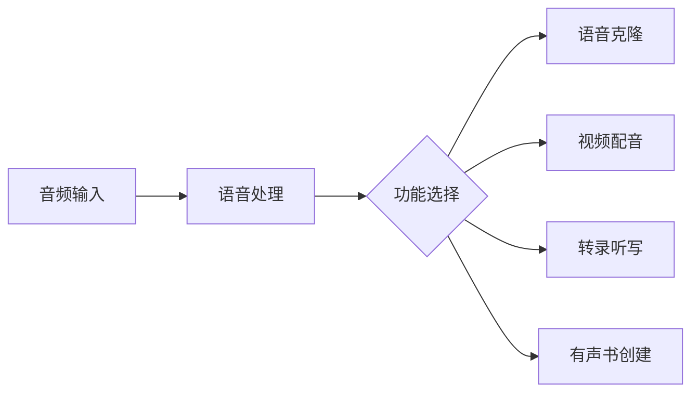
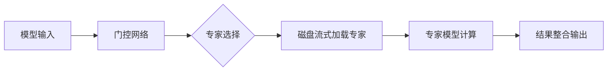
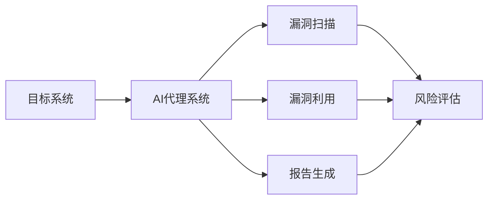
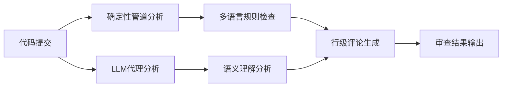
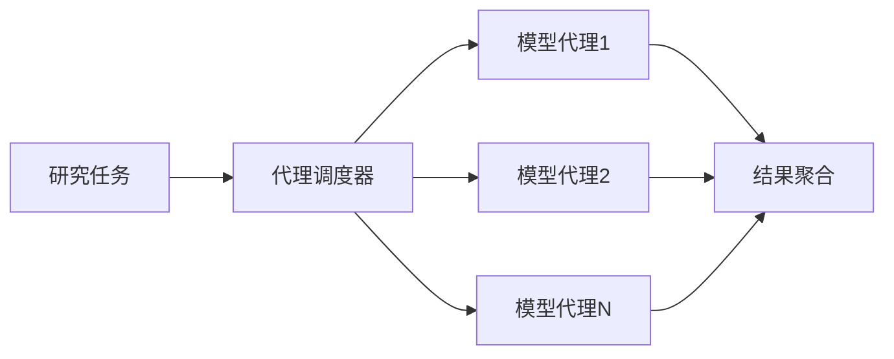

## 今日热点

AI代理专业化与本地化成为今日热点，垂直领域智能代理与轻量化模型实现引领趋势，开发者正推动AI技术向更专业、更高效方向发展。

---

## 热门项目一览

| 排名 | 项目 | 语言 | 今日 | 总计 | 简介 |
|:---:|------|:----:|------:|-----:|------|
| 1 | [bilawalsidhu/gods-eye-view](https://github.com/bilawalsidhu/gods-eye-view) | JavaScript | +2,680 | 32,039 | A spy satellite simulator i... |
| 2 | [debpalash/VoiceStudio](https://github.com/debpalash/VoiceStudio) | Python | +2,632 | 27,014 | VoiceStudio is the open-sou... |
| 3 | [JustVugg/colibri](https://github.com/JustVugg/colibri) | C | +868 | 29,996 | Run frontier MoE models on ... |
| 4 | [asgeirtj/system_prompts_leaks](https://github.com/asgeirtj/system_prompts_leaks) | JavaScript | +706 | 66,103 | Extracted system prompts fr... |
| 5 | [vxcontrol/pentagi](https://github.com/vxcontrol/pentagi) | Go | +590 | 24,025 | Fully autonomous AI Agents ... |
| 6 | [tonhowtf/omniget](https://github.com/tonhowtf/omniget) | Rust | +507 | 11,746 | Download Udemy and Hotmart ... |
| 7 | [SnailSploit/Claude-Red](https://github.com/SnailSploit/Claude-Red) | Python | +506 | 4,194 | claude-red is a curated lib... |
| 8 | [multimodal-art-projection/YuE](https://github.com/multimodal-art-projection/YuE) | Python | +487 | 7,801 | YuE2: frontier music genera... |
| 9 | [jiji262/douyin-downloader](https://github.com/jiji262/douyin-downloader) | Python | +452 | 11,431 | A practical Douyin download... |
| 10 | [alibaba/open-code-review](https://github.com/alibaba/open-code-review) | Go | +443 | 23,617 | Fast, efficient, battle-tes... |
| 11 | [melgarafael/DeskcommCRM](https://github.com/melgarafael/DeskcommCRM) | TypeScript | +432 | 2,232 | Open-source AI sales OS — s... |
| 12 | [calesthio/OpenMontage](https://github.com/calesthio/OpenMontage) | Python | +380 | 58,519 | World's first open-source, ... |

---

## 趋势洞察

```
┌─────────────────────────────────────────────────────────────────┐
│  AI/ML 工具         ████████████████████████  11 个项目        │
│  多媒体应用            ██████                    3 个项目        │
│  媒体资源             ██                        1 个项目        │
│  项目管理             ██                        1 个项目        │
│  开发工具             ██                        1 个项目        │
│  数据分析             ██                        1 个项目        │
│  其他               ██                        1 个项目        │
└─────────────────────────────────────────────────────────────────┘
```

---

## 项目深度解读

### 1. bilawalsidhu/gods-eye-view — [实时卫星监控平台]

> **一句话总结**：基于真实数据的浏览器端卫星监控模拟器，提供逼真的3D地球空间情报可视化。

#### 价值主张

| 维度 | 说明 |
|------|------|
| **解决痛点** | 将专业级卫星监控工具平民化，让公众能访问实时空间情报 |
| **目标用户** | 地理空间研究者、军事爱好者、开源情报分析师、普通用户 |
| **核心亮点** | + 真实卫星数据可视化 + 浏览器端3D渲染 + 实时更新显示 |

#### 技术架构


**技术特色**：
- 基于WebGL的3D地球渲染引擎实现逼真视觉效果
- 实时数据流处理与轻量级浏览器端架构设计
- 多源卫星数据整合与可视化映射技术

#### 热度分析

- 项目Star数突破3万且单日激增2680，显示近期爆发式关注
- 高Fork数(6429)反映社区积极参与和二次开发活跃

#### 快速上手

```bash
# 克隆仓库
git clone https://github.com/bilawalsidhu/gods-eye-view.git

# 启动本地开发服务器
cd gods-eye-view && npm start
```

#### 注意事项
- 需要稳定的网络连接以获取实时卫星数据源
- 可能需要较新浏览器以支持WebGL 3D渲染功能
- 数据访问可能受地理限制或服务频率限制


### 2. debpalash/VoiceStudio — 全栈语音工作室

> **一句话总结**：开源本地语音处理平台，提供克隆、配音、转录等全栈语音功能，支持646种语言。

#### 价值主张

| 维度 | 说明 |
|------|------|
| **解决痛点** | 提供开源替代ElevenLabs的本地化语音处理方案 |
| **目标用户** | 内容创作者、开发者和多媒体制作人员 |
| **核心亮点** | 语音克隆 + 多语言支持 + 视频配音 + 听力创建 + 语音转文字 |

#### 技术架构



**技术特色**：
- 基于646种语言的本地化语音处理模型
- 完全开源替代商业ElevenLabs服务
- 支持端到端语音工作流处理

#### 热度分析

- 项目近期增长迅猛，单日新增2,632个Star，显示极高关注度
- 作为语音技术领域开源替代方案，在开发者社区具有重要生态位置

#### 快速上手

```bash
# 克隆仓库
git clone https://github.com/debpalash/VoiceStudio.git

# 安装依赖
pip install -r requirements.txt

# 运行应用
python app.py
```

#### 注意事项

- 项目可能需要较高计算资源进行本地语音处理
- 需要确认开源许可证合规性，当前显示为Unknown
- 可能需要额外下载模型文件才能完全运行所有功能


### 3. JustVugg/colibri — 轻量级MoE引擎

> **一句话总结**：纯C实现零依赖的MoE模型运行引擎，支持专家模型磁盘流式加载，让普通硬件运行前沿大模型。

#### 价值主张

| 维度 | 说明 |
|------|------|
| **解决痛点** | 解决在普通硬件上运行大型MoE模型的资源限制问题 |
| **目标用户** | 需要在本地运行大模型的研究人员和开发者 |
| **核心亮点** | 纯C实现 + 零依赖 + 专家模型磁盘流式加载 |

#### 技术架构



**技术特色**：
- 纯C实现，无外部依赖，高度可移植
- 专家模型从磁盘流式加载，大幅降低内存需求
- 高效的MoE推理机制，优化计算资源利用

#### 热度分析

- 项目Star数近3万，单日新增800+，增长迅猛，表明市场需求强烈
- Issues数量为0，说明项目已相当成熟稳定，用户反馈问题少

#### 快速上手

```bash
# 克隆仓库
git clone https://github.com/JustVugg/colibri.git
cd colibri

# 编译并运行模型
make && ./colibri model_path
```

#### 注意事项

- 项目使用纯C实现，可能需要一定的C语言编程知识
- 需要确保有足够的磁盘空间存储专家模型
- 由于是流式加载，首次运行可能需要时间从磁盘加载数据


### 4. asgeirtj/system_prompts_leaks — AI提示词库

> **一句话总结**：收集整理各大AI模型系统提示词，为AI研究与提示词工程提供参考依据。

#### 价值主张

| 维度 | 说明 |
|------|------|
| **解决痛点** | 解决AI系统提示词不透明问题，提供研究参考 |
| **目标用户** | AI研究者、提示词工程师、AI安全研究员 |
| **核心亮点** | 多平台覆盖 + 定期更新 + 结构化整理 + 版本追踪 |

#### 技术架构


**技术特色**：
- 提示词收集与验证机制
- 多平台统一分类体系
- 版本追踪与更新系统

#### 热度分析

- 高星数与持续增长表明AI提示词研究热度高，需求旺盛
- 项目作为AI透明度研究的重要参考，在AI安全社区具有重要地位

#### 快速上手

```bash
# 克隆项目仓库
git clone https://github.com/asgeirtj/system_prompts_leaks.git

# 查看特定平台的提示词
cat anthropic/claude.md
```

#### 注意事项

- 提示词可能随模型更新而变化，需关注最新版本
- 使用提示词进行研究时需遵守相关AI平台的使用条款
- 部分提示词可能包含专有信息，商业使用前需确认授权


### 5. vxcontrol/pentagi — AI渗透测试平台

> **一句话总结**：自主AI代理系统，实现复杂渗透测试任务的自动化执行

#### 价值主张

| 维度 | 说明 |
|------|------|
| **解决痛点** | 解决渗透测试专家资源稀缺，自动化执行复杂安全测试任务 |
| **目标用户** | 渗透测试团队、安全研究人员、网络安全专家 |
| **核心亮点** | 多代理协作系统 + 自主决策能力 + 全自动化渗透测试 + 大规模任务并行处理 |

#### 技术架构



**技术特色**：
- 基于Go语言构建的高性能多代理协作框架
- 自主决策算法实现复杂渗透测试策略
- 大规模并行任务处理能力

#### 热度分析

- 项目Star数增长迅速，日增590星，表明社区关注度极高
- Fork数相对Star数比例较低，说明项目主要处于关注阶段，实际使用可能有限

#### 快速上手

```bash
# 克隆项目
git clone https://github.com/vxcontrol/pentagi.git
cd pentagi

# 运行测试
./pentagi --target <target_ip> --mode full
```

#### 注意事项

- 由于项目涉及渗透测试，使用时需确保获得合法授权
- AI代理系统可能存在误判或漏判情况，需人工验证结果
- 项目License未知，使用前需确认授权条款


### 6. tonhowtf/omniget — 内容获取工具

> **一句话总结**：一款支持1,800+网站的内容下载工具，整合课程播放、阅读和音乐库功能。

#### 价值主张

| 维度 | 说明 |
|------|------|
| **解决痛点** | 解决用户无法轻松下载和管理在线课程、视频、音乐和书籍的问题 |
| **目标用户** | 在线学习者、内容创作者、知识收集者、多媒体爱好者 |
| **核心亮点** | 支持1800+网站 + 内置播放器 + 跨平台支持 + 无需终端操作 + 开源免费 |

#### 技术架构


**技术特色**：
- 基于Rust开发，提供高性能和内存安全
- 集成yt-dlp，支持广泛的媒体网站解析
- 内置多媒体播放器和阅读器，无需额外软件

#### 热度分析

- 项目Star数达11,746，单日增长507，呈现高速增长趋势，表明用户需求强烈
- Fork数1,027，表明社区活跃度高，有较多二次开发或定制需求

#### 快速上手

```bash
# 从GitHub Releases下载对应平台的安装包
# Windows: omniget-setup-x.x.x.exe
# macOS: omniget-x.x.x.dmg
# Linux: omniget-x.x.x.AppImage
```

#### 注意事项

- 该工具可能涉及版权问题，请确保下载的内容有合法授权
- 部分网站可能会更新其反下载机制，导致功能失效
- 由于是开源项目，用户应自行评估安全风险


### 7. SnailSploit/Claude-Red — 安全攻击技能库

> **一句话总结**：为Claude AI系统结构化组织各类安全攻击技能，提供从SQL注入到EDR规避的专家级方法论。

#### 价值主张

| 维度 | 说明 |
|------|------|
| **解决痛点** | 为AI安全研究员提供结构化攻击技能库，弥补AI系统安全测试能力缺失 |
| **目标用户** | 安全研究员、渗透测试人员、AI安全研究人员 |
| **核心亮点** | 结构化技能定义 + 多种攻击覆盖 + 专家级方法论 + Claude技能系统集成 + 可扩展技能库 |

#### 技术架构


**技术特色**：
- 采用结构化SKILL.md格式，便于AI理解和执行攻击技能
- 模块化设计，支持技能的独立管理和扩展
- 覆盖多种攻击面，提供全面安全测试能力

#### 热度分析

- 项目获得4194个Star，单日增长506，显示出快速增长趋势
- 作为AI安全领域新兴工具，在安全研究社区引起广泛关注

#### 快速上手

```bash
# 克隆项目
git clone https://github.com/SnailSploit/Claude-Red.git

# 查看可用技能列表
ls skills/
```

#### 注意事项

- 本项目仅用于授权的安全测试和研究目的
- 使用前需确保获得明确授权，避免非法使用
- 技能库内容可能随安全环境变化而更新，需持续关注


### 8. multimodal-art-projection/YuE — 前沿音乐生成

> **一句话总结**：YuE2结合符号规划与零样本技术，实现前沿音乐生成与智能编辑。

#### 价值主张

| 维度 | 说明 |
|------|------|
| **解决痛点** | 传统音乐生成模型缺乏精确控制与跨风格迁移能力 |
| **目标用户** | 音乐创作者、AI研究人员、音频工程师 |
| **核心亮点** | 符号音乐规划 + 零样本风格迁移 + 智能代理编辑 |

#### 技术架构


**技术特色**：
- 基于符号的音乐表示方法，提供精确控制
- 零样本风格迁移能力，无需重新训练即可覆盖多种风格
- 代理编辑系统，支持交互式音乐修改

#### 热度分析

- 项目获得7801星，487星今日新增，表明社区高度关注且增长迅速
- 高fork比例(867)显示开发者积极参与二次开发与集成

#### 快速上手

```bash
# 克隆项目
git clone https://github.com/multimodal-art-projection/YuE.git
cd YuE

# 安装依赖
pip install -r requirements.txt

# 运行示例
python demo.py --input your_music.wav --output generated_music.wav
```

#### 注意事项

- 项目许可证未明确说明，使用前需确认授权条款
- 由于是前沿技术，可能需要较高计算资源支持
- 项目文档可能不够完善，需要参考代码示例理解使用方法


### 9. jiji262/douyin-downloader — 抖音下载工具

> **一句话总结**：功能全面的抖音内容下载工具，支持批量下载、去水印和多种内容格式。

#### 价值主张

| 维度 | 说明 |
|------|------|
| **解决痛点** | 解决用户无法直接下载抖音内容的问题，支持批量下载和去水印 |
| **目标用户** | 需要下载保存抖音内容的普通用户、内容创作者和数据分析人员 |
| **核心亮点** | 批量下载 + 去水印 + 多格式支持 + 进度显示 + SQLite去重 |

#### 技术架构


**技术特色**：
- 使用Python实现跨平台兼容性
- 实现了智能重试机制提高下载成功率
- 采用SQLite数据库实现去重功能，避免重复下载
- 浏览器回退机制增强下载稳定性

#### 热度分析

- 项目Star数超过11,000，近期增长迅速，显示抖音内容下载需求旺盛
- 作为抖音内容下载工具，在内容创作者和普通用户群体中具有较高活跃度

#### 快速上手

```bash
# 安装依赖
pip install -r requirements.txt

# 下载单个视频
python douyin.py https://www.douyin.com/video/1234567890

# 批量下载用户主页内容
python douyin.py https://www.douyin.com/user/1234567890 --batch
```

#### 注意事项

- 请遵守抖音的使用条款和相关法律法规，尊重创作者的版权
- 频繁下载可能导致账号被限制，建议合理控制下载频率
- 项目可能需要定期更新以适应抖音平台的变化


### 10. alibaba/open-code-review — 智能代码审查平台

> **一句话总结**：结合确定性管道与LLM代理的高效代码审查工具，提供精确的行级评论和内置多语言规则集。

#### 价值主张

| 维度 | 说明 |
|------|------|
| **解决痛点** | 解决大规模代码审查效率低、质量参差不齐的问题，提高开发效率和代码质量 |
| **目标用户** | 企业开发团队、开源项目维护者、代码质量关注者 |
| **核心亮点** | 混合架构设计 + 精确行级评论 + 多语言内置规则集 + 多LLM兼容 |

#### 技术架构



**技术特色**：
- Go语言实现，适合高性能处理
- 混合架构结合传统规则引擎与AI能力
- 支持多语言规则集，覆盖常见安全漏洞

#### 热度分析

- Star数超2.3万且持续快速增长，表明该项目在企业级代码审查领域有显著影响力
- 零Open Issues反映项目成熟度高，维护良好，在阿里巴巴大规模生产环境中经过充分验证

#### 快速上手

```bash
# 克隆项目
git clone https://github.com/alibaba/open-code-review.git

# 安装依赖
cd open-code-review && go mod download

# 配置并运行
./open-code-review --config config.yaml
```

#### 注意事项

- 可能需要配置OpenAI或Anthropic API密钥以启用LLM功能
- 项目规模较大，首次运行可能需要较长时间初始化
- 对于私有仓库，可能需要额外的认证配置


### 11. melgarafael/DeskcommCRM — AI销售CRM系统

> **一句话总结**：开源自托管AI销售操作系统，集成CRM与WhatsApp，为聊天销售企业提供商业级替代方案。

#### 价值主张

| 维度 | 说明 |
|------|------|
| **解决痛点** | 企业需要开源、自托管、集AI的CRM系统，替代商业聊天销售平台 |
| **目标用户** | 依赖聊天渠道进行销售，追求数据自主可控的企业 |
| **核心亮点** | 自托管架构 + AI销售代理 + WhatsApp原生集成 + 多租户支持 + LGPD合规 |

#### 技术架构


**技术特色**：
- 基于TypeScript的全栈开发，类型安全性强
- 自托管架构，数据主权可控，无需依赖第三方云服务
- AI代理原生集成，提升销售转化效率与客户体验

#### 热度分析
- 单日增长432星，显示项目近期受到广泛关注，发展势头强劲
- Fork数占星标比例27%，表明社区活跃度高，用户二次开发意愿强烈

#### 快速上手

```bash
# 克隆项目
git clone https://github.com/melgarafael/DeskcommCRM.git

# 安装依赖
npm install

# 启动开发环境
npm run dev
```

#### 注意事项
- 项目许可证未知，使用前需确认开源许可条款
- 作为自托管系统，需要用户具备一定的技术能力进行部署和维护
- 项目相对较新，长期稳定性与持续更新需要观察


### 12. calesthio/OpenMontage — AI视频制作系统

> **一句话总结**：开源AI视频制作系统，提供完整工具链和智能代理，实现从编程到视频制作的无缝转换。

#### 价值主张

| 维度 | 说明 |
|------|------|
| **解决痛点** | 解决传统视频制作工具分散、流程复杂、专业技能要求高的痛点 |
| **目标用户** | 内容创作者、视频制作人及AI应用开发者 |
| **核心亮点** | 开源系统 + 多流程工具链 + 丰富代理技能库 + AI助手整合 |

#### 技术架构


**技术特色**：
- 开源AI代理系统，整合多种视频制作工具
- 12条标准化生产流程，覆盖不同视频制作场景
- 700+技能文件，提供专业级视频制作知识库

#### 热度分析

- 项目获得58,519个Star，且有持续增长（今日+380），表明其在AI视频生成领域有极高关注度
- 作为首个开源智能视频制作系统，填补了市场空白，吸引了大量开发者和内容创作者关注

#### 快速上手

```bash
# 安装OpenMontage
pip install openmontage

# 初始化视频制作项目
openmontage init my_project

# 使用AI代理生成视频
openmontage generate --prompt "创建一个关于AI的科普视频"
```

#### 注意事项

- 项目许可证未知，使用前需确认授权条款
- 作为AI驱动的视频制作系统，可能需要较强的计算资源
- 系统整合了多种工具，可能需要学习曲线来熟悉全部功能


### 13. alphaXiv/OpenResearch — 并行研究代理

> **一句话总结**：支持多种AI模型的并行研究代理框架，大幅提升研究效率与资源利用率

#### 价值主张

| 维度 | 说明 |
|------|------|
| **解决痛点** | 解决单模型研究效率低、计算资源利用不充分的问题 |
| **目标用户** | 研究人员、数据科学家、AI模型开发者 |
| **核心亮点** | 支持多模型并行 + 异步任务处理 + 资源动态分配 + 结果智能聚合 |

#### 技术架构



**技术特色**：
- 基于Rust构建，确保高性能与内存安全
- 提供统一的模型接口，支持多种AI模型接入
- 实现智能任务分配与资源管理，优化计算效率

#### 热度分析

- 项目Star数快速增长，单日增长289，表明近期受到广泛关注
- 高Star/Fork比反映项目实用价值高，更多作为工具使用而非二次开发

#### 快速上手

```bash
# 克隆项目
git clone https://github.com/alphaXiv/OpenResearch.git

# 安装依赖并运行
cargo install && cargo run -- --model gpt-3.5-turbo --research-topic "AI发展趋势"
```

#### 注意事项

- 项目许可证信息不明确，使用前需确认开源许可条款
- 项目文档可能不够完善，可能需要阅读源码了解高级功能
- Rust环境配置可能对不熟悉Rust的用户构成一定门槛


### 14. tech-leads-club/agent-skills — AI技能注册表

> **一句话总结**：为AI编程代理提供安全验证的技能扩展库，增强代码辅助工具能力。

#### 价值主张

| 维度 | 说明 |
|------|------|
| **解决痛点** | AI编程工具技能分散、缺乏安全验证，扩展困难 |
| **目标用户** | AI编程工具开发者、专业软件开发者 |
| **核心亮点** | 安全验证 + 技能库管理 + 多平台支持 + 提升开发效率 |

#### 技术架构


**技术特色**：
- 技能验证机制确保安全性
- TypeScript实现提供类型安全
- 支持多种主流AI编程工具
- 模块化设计便于扩展

#### 热度分析

- Star数5694且日增265，项目热度快速上升，开发者社区认可度高
- Open Issues为0，表明问题解决效率高或社区协作顺畅
- Fork数相对较少，可能表明项目更偏向使用而非二次开发

#### 快速上手

```bash
# 克隆项目
git clone https://github.com/tech-leads-club/agent-skills.git

# 安装依赖
npm install

# 运行示例
npm run example
```

#### 注意事项

- 项目许可证未知，商业使用前需确认授权条款
- 需要了解支持的AI代理工具的具体集成方式
- 技能库的安全验证机制需要仔细研究以确保符合项目需求


### 15. jihe520/MathModelAgent — 数学建模AI助手

> **一句话总结**：AI代理自动完成数学建模全流程，生成可直接提交的专业论文。

#### 价值主张

| 维度 | 说明 |
|------|------|
| **解决痛点** | 解决数学建模流程复杂、耗时长、专业门槛高的问题 |
| **目标用户** | 数学建模竞赛参与者、科研人员、学生 |
| **核心亮点** | 全流程自动化 + 论文自动生成 + 专业数学建模能力 |

#### 技术架构


**技术特色**：
- 基于大语言模型的数学问题理解与建模能力
- 多种数学算法的自动选择与实现
- 学术论文的智能生成与排版

#### 热度分析

- 项目获得5,385个Star，近期增长迅速（今日+246），表明在数学建模领域有较高关注度
- Fork数为411，说明有一定程度的二次开发和应用场景拓展
- Zero Open Issues，表明项目可能处于早期稳定阶段或问题处理高效

#### 快速上手

```bash
# 克隆项目
git clone https://github.com/jihe520/MathModelAgent.git

# 安装依赖
pip install -r requirements.txt

# 运行示例
python main.py --input "数学问题描述"
```

#### 注意事项

- 项目许可证未知，使用时需注意商业应用限制
- 作为AI生成工具，输出的数学建模结果需要人工验证准确性
- 可能需要一定的数学建模基础知识才能有效使用该工具


### 16. yuliskov/SmartTube — 自定义媒体播放器

> **一句话总结**：Android TV 上的无广告YouTube播放器，支持自定义界面和扩展功能。

#### 价值主张

| 维度 | 说明 |
|------|------|
| **解决痛点** | 突破官方应用限制，提供无广告、可定制的Android TV媒体浏览体验 |
| **目标用户** | 追求优质体验、希望自定义界面的Android TV高级用户 |
| **核心亮点** + 支持多账号 + 无广告播放 + 自定义界面布局 + 后台播放 + 4K/60fps支持 |

#### 技术架构


**技术特色**：
- 采用模块化设计，支持功能动态扩展
- 优化的媒体缓冲策略，减少卡顿现象
- 自定义遥控器操作逻辑，提升大屏交互体验

#### 热度分析

- Star数持续稳定增长，日均增长约7，表明项目处于活跃维护期
- Fork数相对Star数比例适中，说明项目兼具实用性与可扩展性

#### 快速上手

```bash
# 下载最新APK安装
wget https://github.com/yuliskov/SmartTube/releases/latest/download/smarttube.apk
# 安装到Android TV
adb install smarttube.apk
```

#### 注意事项

- 需要开启"未知来源应用"安装权限
- 部分高级功能可能需要Google账户登录
- 定期更新以获取最新功能和安全补丁


### 17. ever-co/ever-gauzy — 企业管理平台

> **一句话总结**：开源全能型企业管理平台，集成ERP/CRM/HRM/ATS/PM五大核心业务系统。

#### 价值主张

| 维度 | 说明 |
|------|------|
| **解决痛点** | 中小企业需要整合多种业务系统，但现有解决方案要么昂贵，要么功能单一 |
| **目标用户** | 中小型企业、创业公司、咨询机构及一体化管理解决方案需求方 |
| **核心亮点** | 多业务模块集成 + 开源可定制 + 基于现代技术栈 + 云原生架构 + 多租户支持 |

#### 技术架构


**技术特色**：
- 基于TypeScript构建的全栈应用，提供类型安全和开发效率
- 采用微服务架构，支持模块化部署和扩展
- 集成多种第三方服务，实现功能丰富性和生态扩展性

#### 热度分析
- 项目Star数超5k且单日增长近200，表明社区活跃度持续上升
- Fork数近千，说明项目有较高的二次开发价值，社区贡献意愿强

#### 快速上手

```bash
# 克隆项目
git clone https://github.com/ever-co/ever-gauzy.git

# 安装依赖
npm install

# 启动开发服务器
npm run start:dev
```

#### 注意事项
- 项目复杂度高，需要一定的开发经验才能进行定制化开发
- 作为企业级应用，部署和配置需要考虑服务器资源和安全因素
- 可能需要数据库配置和环境变量设置才能正常运行


### 18. huggingface/transformers — AI模型框架

> **一句话总结**：一站式预训练模型库，支持文本、视觉、音频和多模态模型的训练与推理。

#### 价值主张

| 维度 | 说明 |
|------|------|
| **解决痛点** | 降低最先进AI模型的使用门槛，无需从头训练即可部署高性能模型 |
| **目标用户** | AI研究人员、工程师和企业开发者，需要快速集成预训练模型 |
| **核心亮点** | 统一API接口 + 多模态支持 + 高性能优化 + 活跃社区 + 丰富文档 |

#### 技术架构


**技术特色**：
- 统一的模型接口设计，支持数百种预训练模型
- 自动分词和特征提取，简化数据处理流程
- 高性能推理优化，支持多种深度学习框架后端

#### 热度分析

- 拥有16万+星标，日增152星，是AI领域最活跃的开源项目之一
- 作为NLP和多模态AI的基础设施，处于AI生态系统的核心位置

#### 快速上手

```bash
# 安装Transformers库
pip install transformers

# 使用预训练模型进行文本分类
from transformers import pipeline
classifier = pipeline("sentiment-analysis")
result = classifier("I love using Transformers!")
print(result)
```

#### 注意事项

- 部分大模型需要较大显存，可使用参数量较小的版本或启用量化优化
- 使用时需注意模型的许可协议，特别是商业用途
- 对于特定任务，微调模型通常比直接使用预训练模型效果更好


### 19. Swordfish90/cool-retro-term — 复古终端模拟器

> **一句话总结**：cool-retro-term 是一款模仿老式CRT显示器外观的终端模拟器，提供怀旧风格的命令行体验。

#### 价值主张

| 维度 | 说明 |
|------|------|
| **解决痛点** | 传统终端外观单调，缺乏个性化和怀旧体验 |
| **目标用户** | 怀旧技术爱好者、复古计算机收藏家、寻求独特终端体验的开发者 |
| **核心亮点** | 复古CRT视觉效果 + 老式终端字体 + 动态闪烁效果 + 可自定义外观 |

#### 技术架构


**技术特色**：
- 使用QML实现动态CRT视觉效果
- 通过自定义着色器模拟老式显示器特性
- 轻量级设计，不依赖大量系统资源

#### 热度分析

- 项目获得26,244个星标且持续增长(+57 today)，表明其在终端模拟器领域具有显著影响力
- Fork数(1,017)显示社区积极参与二次开发，形成了活跃的终端复古模拟器生态

#### 快速上手

```bash
# 克隆仓库
git clone https://github.com/Swordfish90/cool-retro-term.git

# 进入目录并构建(需要Qt开发环境)
cd cool-retro-term
mkdir build && cd build && qmake .. && make
```

#### 注意事项

- 项目依赖Qt框架，确保系统已安装相应版本的Qt开发环境
- 不同操作系统下的安装步骤可能有所不同，需参考项目文档
- 由于是模拟器，某些高级终端功能可能不如专业终端模拟器完善


## 今日推荐

| 主题 | 推荐项目 | 亮点 |
|------|----------|------|
| 今日最热 | [bilawalsidhu/gods-eye-view](https://github.com/bilawalsidhu/gods-eye-view) | A spy satellite s... |
| 值得关注 | [debpalash/VoiceStudio](https://github.com/debpalash/VoiceStudio) | VoiceStudio is th... |
| 快速上手 | [JustVugg/colibri](https://github.com/JustVugg/colibri) | Run frontier MoE ... |
| 长期潜力 | [asgeirtj/system_prompts_leaks](https://github.com/asgeirtj/system_prompts_leaks) | Extracted system ... |

---

<div align="center">

*Generated on 2026-09-14 | Powered by GitHub Trending Reporter*

</div>