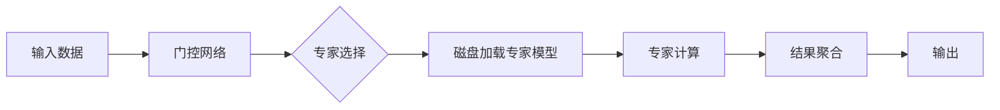
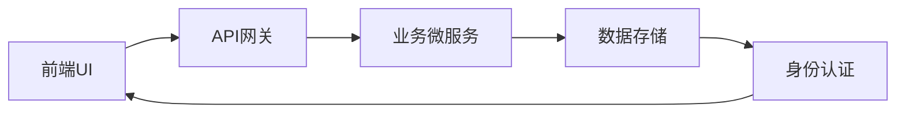
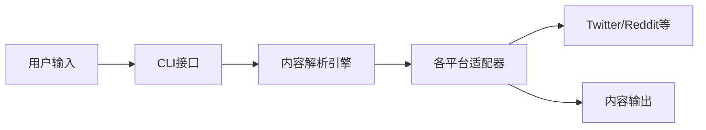
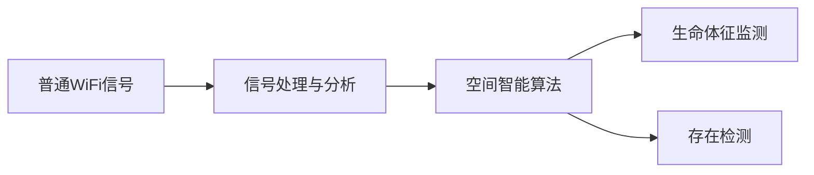
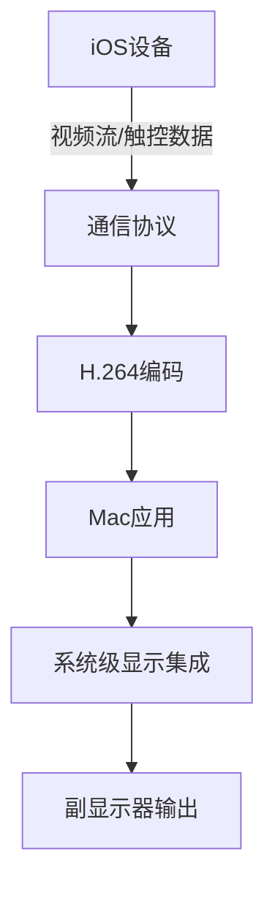
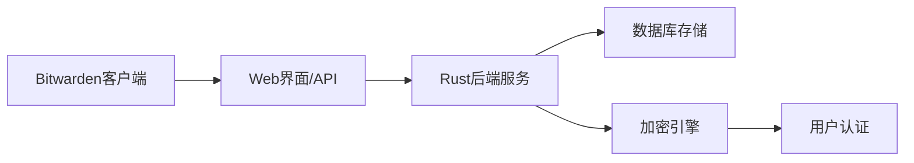
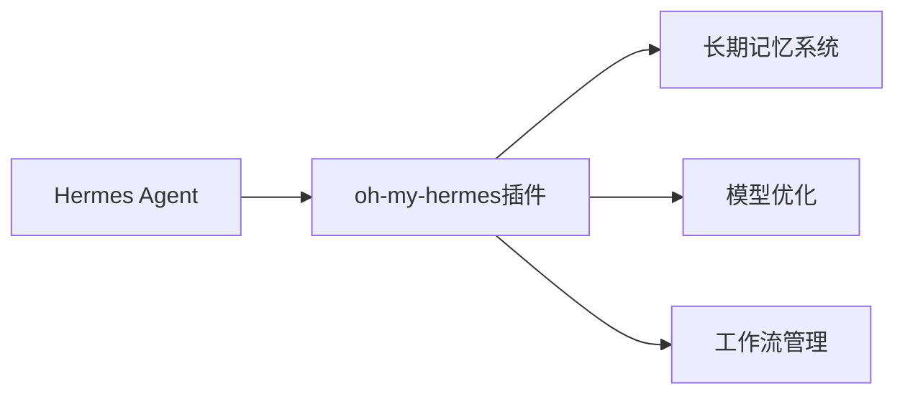

## 今日热点

今日GitHub热榜项目精彩纷呈。

---

## 热门项目一览

| 排名 | 项目 | 语言 | 今日 | 总计 | 简介 |
|:---:|------|:----:|------:|-----:|------|
| 1 | [debpalash/VoiceStudio](https://github.com/debpalash/VoiceStudio) | Python | +2,776 | 29,371 | VoiceStudio is the open-sou... |
| 2 | [JustVugg/colibri](https://github.com/JustVugg/colibri) | C | +2,173 | 32,212 | Run frontier MoE models on ... |
| 3 | [alibaba/open-code-review](https://github.com/alibaba/open-code-review) | Go | +1,571 | 25,976 | Fast, efficient, battle-tes... |
| 4 | [ever-co/ever-gauzy](https://github.com/ever-co/ever-gauzy) | TypeScript | +1,130 | 6,026 | Ever® Gauzy™ - Open Busines... |
| 5 | [asgeirtj/system_prompts_leaks](https://github.com/asgeirtj/system_prompts_leaks) | JavaScript | +764 | 66,827 | Extracted system prompts fr... |
| 6 | [TauricResearch/TradingAgents](https://github.com/TauricResearch/TradingAgents) | Python | +745 | 106,200 | TradingAgents: Multi-Agents... |
| 7 | [Panniantong/Agent-Reach](https://github.com/Panniantong/Agent-Reach) | Python | +651 | 81,379 | Give your AI agent eyes to ... |
| 8 | [SnailSploit/Claude-Red](https://github.com/SnailSploit/Claude-Red) | Python | +579 | 4,793 | claude-red is a curated lib... |
| 9 | [666ghj/MiroFish](https://github.com/666ghj/MiroFish) | Python | +560 | 73,227 | A Simple and Universal Swar... |
| 10 | [multimodal-art-projection/YuE](https://github.com/multimodal-art-projection/YuE) | Python | +559 | 8,421 | YuE2: frontier music genera... |
| 11 | [huggingface/transformers](https://github.com/huggingface/transformers) | Python | +536 | 166,009 | 🤗 Transformers: the model-d... |
| 12 | [tech-leads-club/agent-skills](https://github.com/tech-leads-club/agent-skills) | TypeScript | +512 | 6,087 | The secure, validated skill... |

---

## 趋势洞察

```
┌─────────────────────────────────────────────────────────────────┐
│  AI/ML 工具         ████████████████████████  11 个项目        │
│  其他               ████████                  4 个项目        │
│  多媒体应用            ████                      2 个项目        │
│  媒体资源             ██                        1 个项目        │
│  项目管理             ██                        1 个项目        │
│  安全工具             ██                        1 个项目        │
└─────────────────────────────────────────────────────────────────┘
```

---

## 项目深度解读

### 1. debpalash/VoiceStudio — 全功能语音处理平台

> **一句话总结**：开源本地化语音处理平台，提供语音克隆、视频配音和转录功能，支持646种语言。

#### 价值主张

| 维度 | 说明 |
|------|------|
| **解决痛点** | 解决商业语音服务联网依赖和隐私安全问题，提供完全本地化替代方案 |
| **目标用户** | 内容创作者、视频制作者、有声书作者、多语言翻译工作者 |
| **核心亮点** | 完全本地化运行 + 646种语言支持 + 多功能一体化 + 开源可定制 + 隐私保护 |

#### 技术架构


**技术特色**：
- 基于深度学习的语音合成技术
- 支持多语言模型本地部署
- 集成视频处理与音频同步功能

#### 热度分析

- 单日增长近2800星，表明社区高度关注，增长势头强劲
- 作为ElevenLabs的替代方案，在隐私保护需求高涨背景下具有显著生态位优势

#### 快速上手

```bash
# 克隆项目
git clone https://github.com/debpalash/VoiceStudio.git
cd VoiceStudio

# 安装依赖
pip install -r requirements.txt

# 运行示例
python main.py --input sample.wav --output output.wav
```

#### 注意事项

- 项目许可证未知，商业使用前需确认授权
- 本地运行需要较强的计算资源，尤其是语音克隆功能
- 多语言支持的质量可能因语言而异
- 项目文档可能不够完善，需要自行探索代码


### 2. JustVugg/colibri — [轻量MoE引擎]

> **一句话总结**：纯C实现的无依赖MoE模型运行器，支持从磁盘流式加载专家模型，实现小引擎运行大模型。

#### 价值主张

| 维度 | 说明 |
|------|------|
| **解决痛点** | 解决大模型在普通硬件上运行困难的问题，降低前沿AI模型的使用门槛 |
| **目标用户** | 资源受限环境下需要运行大模型的开发者和研究人员 |
| **核心亮点** | 纯C实现 + 零外部依赖 + 专家模型磁盘流式加载 |

#### 技术架构



**技术特色**：
- 纯C实现，无外部依赖，提高跨平台兼容性
- 专家模型流式加载技术，减少内存占用
- 优化的大模型推理算法，适应普通硬件环境

#### 热度分析

- Star数高达3万+且单日增长超2000，表明项目近期获得极大关注，可能因MoE模型应用热潮而受欢迎
- Fork数达3000+，表明项目被广泛采用和二次开发，社区活跃度高

#### 快速上手

```bash
# 下载colibri
git clone https://github.com/JustVugg/colibri.git
cd colibri

# 编译项目
make

# 运行MoE模型（假设有模型文件）
./colibri model_path experts_config
```

#### 注意事项

- 项目许可证未知，商业使用前需确认授权条款
- 项目依赖磁盘流式加载专家模型，可能对存储I/O性能有一定要求
- 纯C实现虽然高效，但可能缺少高级语言提供的开发便利性和安全性保障
- 需要自行准备专家模型文件，项目可能不提供预训练模型


### 3. alibaba/open-code-review — 智能代码审查

> **一句话总结**：阿里巴巴开源的高性能代码审查工具，结合确定性管道与LLM代理，提供精准行级评论和多语言安全规则。

#### 价值主张

| 维度 | 说明 |
|------|------|
| **解决痛点** | 传统代码审查效率低下，智能化程度不足，难以保障大规模代码质量 |
| **目标用户** | 企业开发团队、开源项目维护者、DevOps工程师、代码审查者 |
| **核心亮点** | 混合架构设计 + 精准行级评论 + 多语言内置安全规则集 |

#### 技术架构


**技术特色**：
- 混合架构结合确定性流程与AI智能分析
- 内置多语言安全规则集，覆盖NPE、线程安全、XSS、SQL注入等
- 高性能设计，经过阿里巴巴大规模场景验证

#### 热度分析

- 项目单日增长1,571个Star，表明社区热度极高，需求旺盛
- 零Open Issues反映项目维护质量高，问题处理机制完善

#### 快速上手

```bash
# 克隆项目
git clone https://github.com/alibaba/open-code-review.git
cd open-code-review

# 安装依赖并运行
go mod download && go run main.go
```

#### 注意事项

- 项目许可证信息不明确，使用前需确认许可证类型
- 作为企业级工具，可能需要配置OpenAI或Anthropic API密钥才能启用LLM功能
- 项目可能需要根据团队特定代码规范和需求进行定制化配置


### 4. ever-co/ever-gauzy — 企业综合管理平台

> **一句话总结**：开源多功能企业管理平台，整合ERP/CRM/HRM/ATS/PM核心业务功能。

#### 价值主张

| 维度 | 说明 |
|------|------|
| **解决痛点** | 中小企业多系统分散管理难题，实现业务一体化管理 |
| **目标用户** | 中小型企业、创业团队、需要综合管理解决方案的组织 |
| **核心亮点** | 开源可定制 + 全功能集成 + 基于现代技术栈 + 插件架构 + 多租户支持 |

#### 技术架构



**技术特色**：
- 基于NestJS构建的微服务架构，确保系统可扩展性
- 使用TypeScript开发，提供类型安全性和代码质量保障
- 支持多租户架构，满足不同企业独立数据需求

#### 热度分析

- 项目Star数超过6,000且单日增长超1,100，表明近期获得高度关注
- 0个Open Issues反映项目维护良好，社区问题解决效率高
- Fork数接近1,000，表明开发者社区活跃度高

#### 快速上手

```bash
# 克隆仓库
git clone https://github.com/ever-co/ever-gauzy.git

# 安装依赖
npm install

# 启动开发服务器
npm run start:dev
```

#### 注意事项

- 项目需要Node.js环境支持，建议使用最新LTS版本
- 部署可能需要配置数据库连接和环境变量
- 由于功能复杂，建议先从核心模块开始了解


### 5. asgeirtj/system_prompts_leaks — AI提示词库

> **一句话总结**：收集各大AI模型的系统提示词，为研究人员和开发者提供AI行为配置的参考。

#### 价值主张

| 维度 | 说明 |
|------|------|
| **解决痛点** | 解决了AI模型系统提示不透明，难以了解AI行为边界的问题 |
| **目标用户** | AI研究人员、开发者、提示词工程师、AI安全研究者 |
| **核心亮点** | 全面覆盖主流AI模型 + 定期更新 + 结构化整理 + 纯文本展示 |

#### 技术架构


**技术特色**：
- 简洁的数据组织结构，便于查找和参考
- 定期更新机制，保持内容时效性
- 纯文本格式展示，便于复制和使用

#### 热度分析

- Star数高达6.6万且持续快速增长，显示AI研究者对系统提示词的高度关注
- Fork数超过1万，表明社区积极参与内容贡献和二次开发

#### 快速上手

```bash
# 克隆仓库获取所有系统提示词
git clone https://github.com/asgeirtj/system_prompts_leaks.git

# 查看特定模型的提示词
cat ./system_prompts_leaks/claude-opus.txt
```

#### 注意事项

- 系统提示词可能会随AI模型更新而改变，请关注最新版本
- 使用这些提示词进行AI交互时，请遵守各AI平台的使用条款
- 部分提示词可能经过脱敏处理，不完全反映原始系统配置


### 6. TauricResearch/TradingAgents — 多智能体交易框架

> **一句话总结**：基于多智能体和大语言模型的金融交易框架，实现自动化交易决策与管理。

#### 价值主张

| 维度 | 说明 |
|------|------|
| **解决痛点** | 解决传统交易系统智能化程度低、适应性差的问题 |
| **目标用户** | 金融开发者、量化交易研究员和交易策略设计师 |
| **核心亮点** | 多智能体协作 + 大语言模型应用 + 金融交易场景适配 + 自动化决策 + 可扩展架构 |

#### 技术架构


**技术特色**：
- 基于大语言模型的多智能体协同架构
- 金融交易场景的深度适配
- 模块化设计支持策略扩展

#### 热度分析

- 项目获得10万+星标且持续增长，显示金融AI领域热度高涨
- 零开放Issues表明项目维护良好，金融AI交易工具生态的重要组成

#### 快速上手

```bash
# 克隆项目
git clone https://github.com/TauricResearch/TradingAgents.git
# 安装依赖
pip install -r requirements.txt
# 运行示例
python examples/basic_trading.py
```

#### 注意事项

- 需要具备金融交易和Python编程知识
- 实盘交易前需充分回测和风险评估
- 注意API使用限制和合规要求


### 7. Panniantong/Agent-Reach — AI网络内容采集器

> **一句话总结**：一站式多平台内容采集工具，让AI通过CLI自由访问互联网各大平台内容。

#### 价值主张

| 维度 | 说明 |
|------|------|
| **解决痛点** | 解决AI模型无法直接访问互联网实时内容的问题 |
| **目标用户** | AI开发者、研究人员、数据分析师、内容创作者 |
| **核心亮点** | 多平台支持 + 无API费用 + 命令行操作 + 实时内容获取 |

#### 技术架构



**技术特色**：
- 使用网络爬取技术绕过API限制
- 多平台内容格式统一化处理
- 通过命令行提供简洁易用的接口
- 支持实时网络内容获取与解析

#### 热度分析

- 项目Star数超8万且持续快速增长，今日新增651，表明社区活跃度高
- Fork数超7千，反映项目实用性强，用户参与度高，可能成为AI领域基础设施

#### 快速上手

```bash
# 安装
pip install agent-reach

# 使用示例
agent-reach --platform twitter --query "AI" --limit 10
agent-reach --platform reddit --subreddit "artificial" --search "machine learning"
```

#### 注意事项

- 可能存在网站反爬机制，使用时需遵守各平台的使用条款
- 频繁请求可能导致IP被临时封禁，建议合理控制请求频率
- 部分平台可能需要登录才能获取完整内容
- 项目License未知，商业使用前需确认授权方式
- 数据获取的实时性和准确性可能受网站更新影响


### 8. SnailSploit/Claude-Red — [攻击技能库]

> **一句话总结**：Claude-Red 是专为 Claude AI 设计的结构化攻击技能库，提供专家级安全攻防知识。

#### 价值主张

| 维度 | 说明 |
|------|------|
| **解决痛点** | 为安全研究人员提供结构化的攻击技能，提升 Claude AI 在安全领域的专业能力 |
| **目标用户** | 安全研究人员、渗透测试人员、红队成员、AI 安全研究员 |
| **核心亮点** | 结构化技能库 + 多攻击面覆盖 + 专家级方法论 + Claude AI 专用 + 可扩展设计 |

#### 技术架构


**技术特色**：
- 基于Markdown的结构化技能定义，便于维护和扩展
- 专为Claude AI优化的技能提示词设计
- 涵盖从基础到高级的多种攻击面，提供全面安全知识

#### 热度分析

- 项目Star数近4800，单日增长近600，显示安全社区对该类AI辅助安全工具的高度关注
- 高Fork数表明社区积极参与改进和定制，形成活跃的安全AI技能生态

#### 快速上手

```bash
# 克隆项目
git clone https://github.com/SnailSploit/Claude-Red.git

# 查看可用技能
ls -la skills/

# 使用特定技能
cat skills/sqli/SKILL.md
```

#### 注意事项

- 此项目仅用于安全研究和授权测试，未授权使用可能违反法律
- 技能库内容涉及高级攻击技术，使用者应具备相应的安全知识
- Claude AI可能对某些攻击技能有限制，实际效果可能因版本而异


### 9. 666ghj/MiroFish — 群体智能预测引擎

> **一句话总结**：基于群体智能的通用预测引擎，适用于各类预测场景，简洁高效。

#### 价值主张

| 维度 | 说明 |
|------|------|
| **解决痛点** | 复杂预测任务专用化、高门槛问题，提供通用预测解决方案 |
| **目标用户** | 需要进行各类预测的开发者、数据科学家和研究人员 |
| **核心亮点** | 群体智能算法 + 简洁Python实现 + 通用预测框架 + 高度可扩展 |

#### 技术架构


**技术特色**：
- 基于群体智能算法的预测引擎
- Python实现，易于集成和扩展
- 通用预测框架，支持多种应用场景

#### 热度分析

- 项目获得7.3万星且持续增长，在群体智能预测领域有显著影响力
- Fork数超1.1万，表明开发者社区活跃，有较高二次开发价值

#### 快速上手

```bash
# 安装MiroFish
pip install MiroFish

# 基本使用
from MiroFish import SwarmPredictor
predictor = SwarmPredictor()
result = predictor.predict(input_data)
```

#### 注意事项

- 项目许可证信息不明确，使用前需确认授权条款
- 无开放Issue，可能不支持问题反馈和社区支持
- 需要进一步了解具体API文档和最佳实践


### 10. multimodal-art-projection/YuE — 前沿音乐生成

> **一句话总结**：基于符号规划和智能体编辑的前沿音乐生成系统，支持零样本覆盖。

#### 价值主张

| 维度 | 说明 |
|------|------|
| **解决痛点** | 传统音乐生成缺乏灵活性和可控性，难以实现特定风格和编辑需求 |
| **目标用户** | 音乐创作者、AI音乐爱好者、音乐研究机构 |
| **核心亮点** | 符号规划 + 零样本覆盖 + 智能体编辑 + 高质量生成 |

#### 技术架构


**技术特色**：
- 符号规划技术实现音乐结构控制
- 零样本学习实现跨风格覆盖
- 智能体编辑实现灵活的音乐修改

#### 热度分析

- 项目Star数8,421且单日增长559，显示极高关注度和快速增长趋势
- Fork数912表明开发者社区积极参与，项目具有较高实用价值

#### 快速上手

```bash
# 克隆项目
git clone https://github.com/multimodal-art-projection/YuE.git

# 安装依赖
pip install -r requirements.txt
```

#### 注意事项

- 项目许可证未知，商业使用前需确认授权情况
- 项目可能需要较强的计算资源，尤其是生成高质量音乐时
- 音乐生成结果可能需要专业音乐知识进行评估和调整


### 11. huggingface/transformers — AI模型框架

> **一句话总结**：一站式提供最先进的预训练模型框架，支持多种模态的机器学习模型训练与推理。

#### 价值主张

| 维度 | 说明 |
|------|------|
| **解决痛点** | 简化了最先进AI模型的访问和使用，降低了模型开发门槛 |
| **目标用户** | AI研究人员、工程师、数据科学家和机器学习爱好者 |
| **核心亮点** | 统一的API接口 + 预训练模型库 + 多模态支持 + 推理与训练一体化 + 社区驱动更新 |

#### 技术架构


**技术特色**：
- 统一的模型接口，支持1000+预训练模型
- 高效的PyTorch和TensorFlow实现
- 自动化的模型优化和部署工具

#### 热度分析

- 项目获得16.6万星，日增500+，处于AI工具类项目热度巅峰
- 作为NLP领域标准库，社区贡献活跃，生态系统完善

#### 快速上手

```bash
# 安装transformers库
pip install transformers

# 使用预训练模型进行文本分类
from transformers import pipeline
classifier = pipeline('sentiment-analysis')
result = classifier('Hugging Face makes AI easy to use!')
print(result)
```

#### 注意事项

- 某些大型模型需要大量GPU资源进行推理
- 模型使用需注意相关许可证限制
- 自定义模型需要一定的深度学习知识基础


### 12. tech-leads-club/agent-skills — AI代理技能库

> **一句话总结**：为专业AI编程代理提供安全验证的技能注册表，确保扩展功能的安全可靠性。

#### 价值主张

| 维度 | 说明 |
|------|------|
| **解决痛点** | 解决AI编程代理技能扩展的安全性和可靠性问题 |
| **目标用户** | 使用AI编程工具的开发者和专业技术人员 |
| **核心亮点** | 安全验证 + 技能库 + 多平台支持 + 专业级 + 可靠性 |

#### 技术架构


**技术特色**：
- 基于TypeScript构建，提供类型安全保证
- 安全验证机制确保技能可靠性和安全性
- 支持多个主流AI编程平台的无缝集成

#### 热度分析

- 项目获得6,087个Star且单日增长512，表明社区关注度极高且增长迅速
- 零Open Issues可能表明项目维护良好或问题解决机制高效

#### 快速上手

```bash
# 克隆项目
git clone https://github.com/tech-leads-club/agent-skills.git

# 安装依赖
npm install

# 启动开发环境
npm run dev
```

#### 注意事项

- 项目许可证未知，商业使用前需确认授权条款
- 零Open Issues可能意味着问题报告渠道不明确或社区参与度有限
- 项目描述提到支持多个AI编程工具，但具体集成方式需查阅文档了解


### 13. ruvnet/RuView — WiFi空间感知

> **一句话总结**：利用普通WiFi信号实现无接触式空间智能、生命体征监测和存在检测的创新技术。

#### 价值主张

| 维度 | 说明 |
|------|------|
| **解决痛点** | 无需摄像头即可实现空间监测，解决隐私与安全的矛盾 |
| **目标用户** | 注重隐私的智能家居、办公空间和医疗监护场景用户 |
| **核心亮点** | + 无摄像头隐私保护 + 普通WiFi设备即用 + 实时生命体征监测 |

#### 技术架构



**技术特色**：
- 基于WiFi信道状态信息(CSI)的高精度信号处理
- 利用机器学习算法从信号波动中提取人体活动信息
- 无需专用硬件，兼容标准WiFi设备

#### 热度分析

- 项目Star数超过9万，近期持续稳定增长，表明技术价值获得广泛认可
- 在隐私计算和无接触感知领域具有重要生态位置，填补了市场空白

#### 快速上手

```bash
# 克隆项目仓库
git clone https://github.com/ruvnet/RuView.git

# 构建项目
cd RuView && cargo build --release
```

#### 注意事项
- 项目可能需要特定的WiFi硬件支持才能实现最佳效果
- 实际应用环境中的信号干扰可能影响检测精度
- 生命体征监测功能需要校准和参数调整以适应不同场景


### 14. reconurge/flowsint — 图形调查平台

> **一句话总结**：面向网络安全分析师的可视化图形调查平台，提供灵活可扩展的调查工作流。

#### 价值主张

| 维度 | 说明 |
|------|------|
| **解决痛点** | 将复杂的网络安全调查流程可视化，简化调查过程，提高分析效率 |
| **目标用户** | 网络安全分析师、数字取证专家、威胁情报研究员 |
| **核心亮点** | 可视化调查流程 + 灵活可扩展 + 图形化界面 + 多数据源集成 + 自定义调查模板 |

#### 技术架构


**技术特色**：
- 基于TypeScript构建，提供类型安全
- 采用图形化调查方法，提高直观性
- 支持多种数据源集成，扩展性强

#### 热度分析

- 项目获得8374颗星且当日增长280，表明网络安全领域对可视化调查工具有强烈需求
- Fork数达1028，显示开发者社区积极参与和贡献，项目在网络安全工具生态中占据重要位置

#### 快速上手

```bash
# 克隆仓库
git clone https://github.com/reconurge/flowsint.git

# 安装依赖
npm install

# 启动开发服务器
npm run dev
```

#### 注意事项

- 项目许可证未知，商业使用前需确认许可条款
- 作为网络安全工具，使用时需注意数据隐私和合规要求
- 项目可能需要一定的网络安全背景知识才能充分利用


### 15. localsend/localsend — 跨平台文件传输

> **一句话总结**：LocalSend 是开源跨平台文件传输工具，替代 AirDrop 功能，支持多设备间安全快速共享文件。

#### 价值主张

| 维度 | 说明 |
|------|------|
| **解决痛点** | 解决跨平台设备间文件传输困难问题，无需依赖特定厂商生态 |
| **目标用户** | 跨平台设备用户，需要在不同操作系统间传输文件的个人和团队 |
| **核心亮点** | 开源免费 + 跨平台支持 + 无需服务器 + 安全加密 + 简易使用 |

#### 技术架构


**技术特色**：
- 基于 Dart 和 Flutter 实现跨平台一致性体验
- 使用 WebSocket 技术实现实时通信
- 采用 P2P 直连模式，无需中间服务器

#### 热度分析

- 项目 Star 数超 9 万且持续增长，表明用户需求强烈，社区认可度高
- Fork 数适中，说明项目稳定性良好，用户更倾向于直接使用而非分叉修改

#### 快速上手

```bash
# 克隆项目
git clone https://github.com/localsend/localsend.git

# 进入项目目录
cd localsend

# 安装依赖并运行
flutter pub get && flutter run
```

#### 注意事项

- 需要确保所有设备在同一局域网内
- 应用需要授予必要的网络权限
- 部分防火墙设置可能影响设备发现功能


### 16. peetzweg/opendisplay — iOS副显示器工具

> **一句话总结**：免费开源替代方案，将iPhone/iPad作为Mac副显示器，支持低延迟高清显示和触控输入。

#### 价值主张

| 维度 | 说明 |
|------|------|
| **解决痛点** | 提供免费Sidecar/Duet替代方案，无需付费即可扩展Mac显示空间 |
| **目标用户** | 拥有Mac和iOS设备的多屏需求用户，寻找经济实惠的扩展方案 |
| **核心亮点** | + 免费开源替代方案 + 低延迟H.264编码 + 支持Retina HiDPI显示 + 触控输入支持 |

#### 技术架构



**技术特色**：
- 采用Swift跨平台开发Mac和iOS应用
- 低延迟H.264视频编码优化传输效率
- 系统级触控输入转发实现无缝交互

#### 热度分析

- Star数达3627且日增229，显示用户对免费副显示器解决方案的强烈需求
- 作为Sidecar/Duet的替代方案，填补了开源市场空白，吸引大量希望避免付费的用户

#### 快速上手

```bash
# 克隆仓库
git clone https://github.com/peetzweg/opendisplay.git

# 进入项目目录并构建
cd opendisplay && swift build
```

#### 注意事项

- 需要Mac和iOS设备均支持项目要求的系统版本
- USB连接可能需要特定配置或权限设置
- WiFi连接可能影响性能和延迟，建议优先使用USB连接
- 项目可能需要启用开发者模式或特定安全设置才能正常工作


### 17. OpenBMB/VoxCPM — 多语言语音生成

> **一句话总结**：无tokenizer的多语言文本转语音系统，支持创意声音设计和逼真声音克隆。

#### 价值主张

| 维度 | 说明 |
|------|------|
| **解决痛点** | 传统TTS系统依赖tokenizer，处理多语言和复杂语音效果受限 |
| **目标用户** | 多语言应用开发者、语音合成研究人员、声音设计师 |
| **核心亮点** | 无tokenizer架构 + 多语言支持 + 逼真声音克隆 + 创意声音设计 |

#### 技术架构


**技术特色**：
- 无tokenizer架构，直接从文本生成语音特征
- 多语言统一处理框架，无需针对不同语言单独训练
- 高质量声码器，支持逼真的声音克隆和创意设计

#### 热度分析

- 项目获得37,404星，日增216星，表明其在语音合成领域受到高度关注
- 作为OpenBMB(开放大模型社区)成员，在AI语音生成领域具有重要生态地位

#### 快速上手

```bash
# 克隆仓库
git clone https://github.com/OpenBMB/VoxCPM.git
cd VoxCPM

# 安装依赖
pip install -r requirements.txt

# 运行示例
python demo.py --text "你好，世界" --output output.wav
```

#### 注意事项

- 项目可能需要较高的计算资源，特别是进行模型训练时
- 声音克隆功能涉及隐私和伦理问题，使用时需遵守相关法律法规
- 项目文档可能需要进一步完善，以便新用户更容易上手


### 18. dani-garcia/vaultwarden — 自托管密码库

> **一句话总结**：Rust编写的非官方Bitwarden兼容服务器，提供自托管密码管理解决方案。

#### 价值主张

| 维度 | 说明 |
|------|------|
| **解决痛点** | 解决官方Bitwarden无法自托管的需求，提供完全隐私控制的密码管理 |
| **目标用户** | 注重隐私、希望数据本地化的个人和小型团队 |
| **核心亮点** | 官方API兼容性 + Rust高性能 + 轻量级部署 + 端到端加密 |

#### 技术架构



**技术特色**：
- Rust编写确保内存安全和并发性能
- 完全兼容Bitwarden客户端，无需修改
- 支持SQLite和PostgreSQL双数据库后端
- 实现端到端加密保障数据安全

#### 热度分析

- 高星项目(67k+)持续增长，日均115星，显示强劲社区支持
- 零开放问题反映项目成熟度高，维护者响应迅速

#### 快速上手

```bash
# 使用Docker快速部署
docker run -d --name vaultwarden \
  -e SIGNUPS_ALLOWED=true \
  -v /vw-data:/data \
  vaultwarden/server:latest
```

#### 注意事项

- 需配置反向代理(如Nginx)以支持HTTPS
- 生产环境建议使用PostgreSQL而非SQLite
- 需定期更新以获取安全补丁和新功能


### 19. rlaope/oh-my-hermes — AI编程助手插件

> **一句话总结**：为Hermes Agent提供的一体化插件，实现长期记忆与工作流优化，提升AI编程辅助能力。

#### 价值主张

| 维度 | 说明 |
|------|------|
| **解决痛点** | 解决AI编程助手缺乏长期记忆和工作流优化的问题 |
| **目标用户** | 使用AI编程助手的开发者与研究人员 |
| **核心亮点** | 一体化插件系统 + 长期记忆管理 + 模型优化工作流 |

#### 技术架构



**技术特色**：
- 基于Python构建的模块化插件系统
- 实现长期记忆存储与检索机制
- 优化AI模型工作流执行效率

#### 热度分析

- 项目Star数突破2000且持续增长，显示社区认可度高
- 虽无开放Issues，但Fork数表明有一定程度的二次开发和使用

#### 快速上手

```bash
# 安装oh-my-hermes
pip install oh-my-hermes

# 初始化Hermes Agent
hermes init

# 启动插件
hermes plugin activate oh-my-hermes
```

#### 注意事项

- 项目许可证信息不明确，使用时需确认授权条款
- 长期记忆功能可能需要额外的存储配置
- 与Hermes Agent版本兼容性需注意


### 20. Crosstalk-Solutions/project-nomad — 离线知识库

> **一句话总结**：离线优先的知识与教育服务器，集成百科全书、书籍、课程和地图，支持本地AI，无需联网即可使用。

#### 价值主张

| 维度 | 说明 |
|------|------|
| **解决痛点** | 解决无网络环境下的知识获取难题，提供完全自主可控的教育资源 |
| **目标用户** | 教育工作者、偏远地区居民、隐私关注者、网络受限场景用户 |
| **核心亮点** | 离线优先 + 丰富教育资源 + 本地AI支持 + 隐私安全 + 硬件自主可控 |

#### 技术架构


**技术特色**：
- 基于TypeScript构建的全栈应用，确保跨平台兼容性
- 高效的本地数据索引和检索机制，支持离线快速访问
- 模块化架构设计，支持多种教育资源类型和扩展功能
- 支持本地AI模型部署，提供智能化知识服务
- 数据同步机制，支持部分在线更新和离线使用

#### 热度分析

- 高Star数(36,935)且持续增长(+40 today)，表明项目广受欢迎且活跃度高
- Fork数(3,687)显示社区参与度高，Open Issues为0反映项目维护状态良好
- 项目定位契合当前数据隐私和离线访问需求，处于知识管理工具生态的关键位置

#### 快速上手

```bash
# 克隆项目
git clone https://github.com/Crosstalk-Solutions/project-nomad.git

# 安装依赖
npm install

# 构建并启动服务
npm run build && npm start
```

#### 注意事项

- 需要足够的本地存储空间来容纳大量教育资源(Wikipedia、书籍等)
- 本地AI功能需要额外的计算资源和配置
- 初始数据下载和索引构建可能需要较长时间
- 项目许可证信息不明确，使用前需确认授权条款
- 持续维护和更新需要关注官方发布渠道


## 今日推荐

| 主题 | 推荐项目 | 亮点 |
|------|----------|------|
| 今日最热 | [debpalash/VoiceStudio](https://github.com/debpalash/VoiceStudio) | VoiceStudio is th... |
| 值得关注 | [JustVugg/colibri](https://github.com/JustVugg/colibri) | Run frontier MoE ... |
| 快速上手 | [alibaba/open-code-review](https://github.com/alibaba/open-code-review) | Fast, efficient, ... |
| 长期潜力 | [ever-co/ever-gauzy](https://github.com/ever-co/ever-gauzy) | Ever® Gauzy™ - Op... |

---

<div align="center">

*Generated on 2026-09-15 | Powered by GitHub Trending Reporter*

</div>