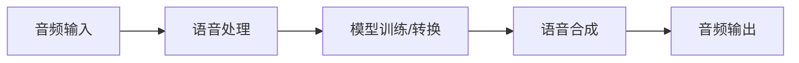
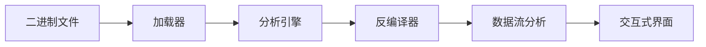
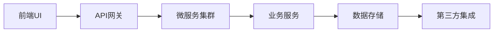
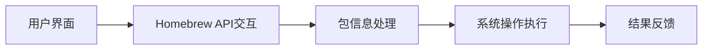
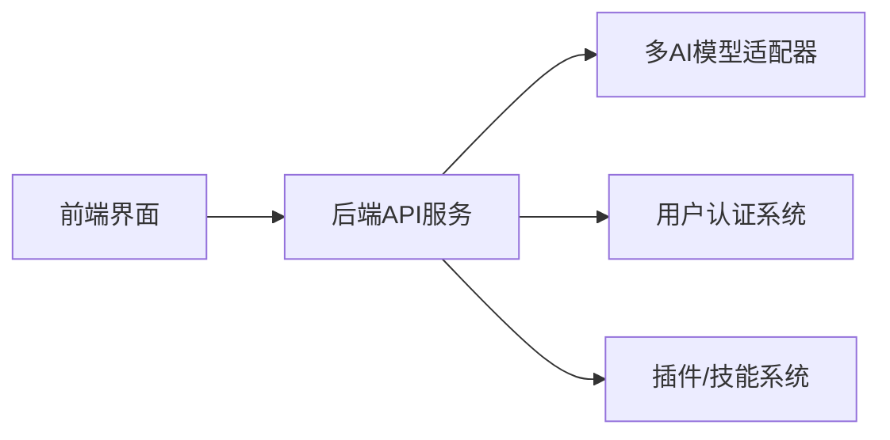
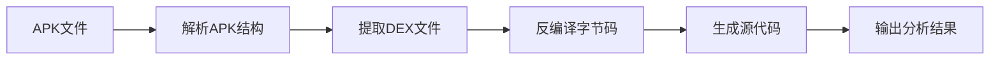

## 今日热点

今日GitHub热榜聚焦AI代理工具爆发式增长，以及开源替代品在代码审查、语音处理和企业软件领域的快速崛起，同时强调本地部署和隐私保护。

---

## 热门项目一览

| 排名 | 项目 | 语言 | 今日 | 总计 | 简介 |
|:---:|------|:----:|------:|-----:|------|
| 1 | [alibaba/open-code-review](https://github.com/alibaba/open-code-review) | Go | +2,756 | 28,837 | Fast, efficient, battle-tes... |
| 2 | [debpalash/VoiceStudio](https://github.com/debpalash/VoiceStudio) | Python | +2,072 | 31,095 | VoiceStudio is the open-sou... |
| 3 | [JustVugg/colibri](https://github.com/JustVugg/colibri) | C | +2,026 | 33,956 | Run frontier MoE models on ... |
| 4 | [NationalSecurityAgency/ghidra](https://github.com/NationalSecurityAgency/ghidra) | Java | +725 | 76,774 | Ghidra is a software revers... |
| 5 | [ever-co/ever-gauzy](https://github.com/ever-co/ever-gauzy) | TypeScript | +634 | 6,717 | Ever® Gauzy™ - Open Busines... |
| 6 | [alphaXiv/OpenResearch](https://github.com/alphaXiv/OpenResearch) | Rust | +531 | 3,435 | Turn your coding agents int... |
| 7 | [earendil-works/pi](https://github.com/earendil-works/pi) | TypeScript | +458 | 105,783 | AI agent toolkit: unified L... |
| 8 | [addyosmani/agent-skills](https://github.com/addyosmani/agent-skills) | JavaScript | +307 | 94,852 | Production-grade engineerin... |
| 9 | [Homebrew/BrewUI](https://github.com/Homebrew/BrewUI) | Swift | +271 | 1,422 | 📺 Homebrew's official macOS... |
| 10 | [tonhowtf/omniget](https://github.com/tonhowtf/omniget) | Rust | +258 | 13,009 | Download Udemy and Hotmart ... |
| 11 | [danny-avila/LibreChat](https://github.com/danny-avila/LibreChat) | TypeScript | +254 | 43,876 | Enhanced ChatGPT Clone: Fea... |
| 12 | [melgarafael/DeskcommCRM](https://github.com/melgarafael/DeskcommCRM) | TypeScript | +193 | 2,873 | Open-source AI sales OS — s... |

---

## 趋势洞察

```
┌─────────────────────────────────────────────────────────────────┐
│  AI/ML 工具         ████████████████████████  8 个项目        │
│  多媒体应用            ██████                    2 个项目        │
│  开发框架             ███                       1 个项目        │
│  智能家居             ███                       1 个项目        │
│  媒体资源             ███                       1 个项目        │
│  项目管理             ███                       1 个项目        │
└─────────────────────────────────────────────────────────────────┘
```

---

## 项目深度解读

### 1. alibaba/open-code-review — 智能审查工具

> **一句话总结**：结合确定性与AI的混合架构代码审查工具，提供多语言安全规则支持与精确行级评论。

#### 价值主张

| 维度 | 说明 |
|------|------|
| **解决痛点** | 传统代码审查效率低、准确性不足，缺乏多语言安全规则支持 |
| **目标用户** | 大型开发团队、企业级用户、高代码质量要求组织 |
| **核心亮点** | 混合架构确定性管道 + LLM Agent + 多语言内置规则集 + 精确行级评论 |

#### 技术架构


**技术特色**：
- 混合架构结合确定性与AI能力，提高审查准确率
- 内置多语言安全规则(NPE、线程安全、XSS等)
- 兼容OpenAI与Anthropic API，支持灵活配置

#### 热度分析

- 项目Star数达28,837且单日增长2,756，表明市场认可度极高
- Fork数2,060，社区活跃度高，Issues为0反映问题处理及时

#### 快速上手

```bash
# 安装工具
go install github.com/alibaba/open-code-review/cmd/cr

# 配置API密钥
cr config --set openai_api_key=your_key

# 执行代码审查
cr review --path ./src --model gpt-4
```

#### 注意事项

- 许可证信息不明确，企业使用前需确认授权条款
- 需要配置OpenAI或Anthropic API，可能产生额外成本
- 大规模部署需考虑资源消耗与性能优化


### 2. debpalash/VoiceStudio — [语音处理平台]

> **一句话总结**：开源本地化语音处理工具集，支持多语言克隆与视频配音

#### 价值主张

| 维度 | 说明 |
|------|------|
| **解决痛点** | 提供本地化语音处理替代方案，避免云服务依赖与数据隐私风险 |
| **目标用户** | 语音开发者、内容创作者、多语言内容制作者 |
| **核心亮点** | 语音克隆 + 语音设计 + 视频配音 + 多语言支持 + 本地部署 |

#### 技术架构



**技术特色**：
- 基于 Python 开发，易于集成与扩展
- 支持646种语言，覆盖范围广泛
- 本地部署架构，保障数据隐私安全

#### 热度分析

- 项目获得31,095个Star，近期增长迅猛，日均新增约70个Star
- 作为 ElevenLabs 的开源替代方案，在语音处理领域具有较高关注度

#### 快速上手

```bash
# 克隆项目
git clone https://github.com/debpalash/VoiceStudio.git

# 安装依赖
pip install -r requirements.txt

# 运行示例
python examples/basic_voice_clone.py
```

#### 注意事项

- 项目许可证未知，商业使用前需确认授权情况
- 本地部署可能需要较高的计算资源与存储空间
- 部分功能可能需要预训练模型才能正常运行


### 3. JustVugg/colibri — 轻量MoE引擎

> **一句话总结**：纯C实现的MoE模型运行引擎，零依赖，专家模型从磁盘流式加载，小引擎运行大模型。

#### 价值主张

| 维度 | 说明 |
|------|------|
| **解决痛点** | 让普通硬件运行前沿MoE模型，突破硬件资源限制 |
| **目标用户** | 需运行大型模型但受限于硬件资源的开发者和研究者 |
| **核心亮点** | 纯C实现 + 零依赖 + 专家流式加载 + 小体积大能力 + 硬件友好 |

#### 技术架构


**技术特色**：
- 专家模型按需加载，大幅降低内存占用
- 纯C实现，无依赖，跨平台兼容性好
- 高效的I/O和内存管理，适应资源受限环境

#### 热度分析
- Star数3.3万+单日增长2千，热度呈爆发式增长，可能因大型模型新突破引发关注
- Fork数3.5千，社区参与度高，开发者积极尝试二次开发与定制

#### 快速上手
```bash
# 下载模型并运行
git clone https://github.com/JustVugg/colibri.git
cd colibri
./colibri --model-path /path/to/model --input "your prompt"
```

#### 注意事项
- 项目License未知，使用前需确认授权条款
- 纯C实现对不熟悉C语言的开发者存在一定门槛
- 流式加载可能受磁盘I/O性能影响，建议使用SSD
- 模型格式需与项目兼容，可能需要特定转换工具


### 4. NationalSecurityAgency/ghidra — 逆向工程框架

> **一句话总结**：NSA开发的企业级逆向工程平台，提供全面二进制分析与反编译能力。

#### 价值主张

| 维度 | 说明 |
|------|------|
| **解决痛点** | 破解复杂二进制代码结构，提供深度软件行为分析能力 |
| **目标用户** | 安全研究员、逆向工程师、恶意分析师、数字取证专家 |
| **核心亮点** | 强大反编译引擎 + 跨平台支持 + 可扩展架构 + 多架构支持 + 自动化脚本 |

#### 技术架构



**技术特色**：
- 基于Java开发，跨平台兼容，支持Windows/Linux/macOS
- 模块化设计，通过插件系统实现功能扩展
- 自定义脚本支持，集成Python/Jython自动化分析能力
- 高级数据流分析，生成精确的控制流图
- 支持多种处理器架构和文件格式解析

#### 热度分析

- Star数量持续稳定增长，显示在安全研究领域获得广泛认可
- 作为NSA开源项目，在政府和商业安全领域具有独特影响力

#### 快速上手

```bash
# 下载Ghidra
wget https://github.com/NationalSecurityAgency/ghidra/releases/download/Ghidra_10.2.3_PUBLIC/Ghidra_10.2.3_PUBLIC.zip

# 解压并运行
unzip Ghidra_10.2.3_PUBLIC.zip
cd Ghidra_10.2.3_PUBLIC
./ghidraRun
```

#### 注意事项

- 初始学习曲线较陡峭，需要逆向工程基础知识
- 处理大型二进制文件时可能需要较高系统资源
- 部分高级功能需要Java编程知识进行自定义开发
- 定期更新以获取最新功能和漏洞修复


### 5. ever-co/ever-gauzy — 开源企业管平台

> **一句话总结**：全功能开源企业管理平台，整合ERP/CRM/HRM/ATS/PM于一体，助力企业数字化转型。

#### 价值主张

| 维度 | 说明 |
|------|------|
| **解决痛点** | 中小企业缺乏一站式、可定制的企业管理解决方案 |
| **目标用户** | 中小型企业、创业团队、需要整合业务流程的组织 |
| **核心亮点** | 开源可定制 + 全功能集成 + 云原生架构 + 微服务设计 + 多租户支持 |

#### 技术架构



**技术特色**：
- 基于NestJS构建的TypeScript后端，保证代码质量和类型安全
- 采用微服务架构，各业务模块松耦合，便于扩展和维护
- 支持多租户架构，满足不同企业的个性化需求

#### 热度分析

- 项目近期热度显著，单日增长634星，表明市场需求强劲
- 社区活跃度高，Fork数达千级，说明开发者参与度良好

#### 快速上手

```bash
# 克隆项目
git clone https://github.com/ever-co/ever-gauzy.git

# 安装依赖并运行
cd ever-gauzy
npm install && npm run start:dev
```

#### 注意事项

- 项目依赖较多，首次运行可能需要较长时间安装依赖
- 需要配置数据库连接等环境变量，建议参考项目文档
- 部分高级功能可能需要额外配置或商业支持


### 6. alphaXiv/OpenResearch — 研究智能体框架

> **一句话总结**：将编程智能体转化为研究智能体的开源框架，增强AI研究能力

#### 价值主张

| 维度 | 说明 |
|------|------|
| **解决痛点** | 编程智能体缺乏学术研究能力，无法处理专业研究任务 |
| **目标用户** | AI研究人员、学术机构、科研团队 |
| **核心亮点** | 学术内容深度处理 + 研究任务自动化 + 多模态研究支持 |

#### 技术架构


**技术特色**：
- Rust高性能实现，确保大规模研究数据处理效率
- 模块化设计，支持多种研究场景和任务类型
- 安全的内存管理，适合处理敏感研究数据

#### 热度分析
- 单日增长531星，表明项目获得学术界广泛关注
- Fork比例适中(6.6%)，显示以使用为主，二次开发较少

#### 快速上手

```bash
# 安装Rust环境
curl --proto '=https' --tlsv1.2 -sSf https://sh.rustup.rs | sh

# 克隆项目
git clone https://github.com/alphaXiv/OpenResearch.git

# 运行示例
cargo run --example research_agent
```

#### 注意事项
- 项目License未知，使用前需确认授权条款
- 依赖的第三方AI服务可能需要额外配置
- 需要一定的Rust编程基础才能深度定制


### 7. earendil-works/pi — 全能AI代理工具包

> **一句话总结**：统一LLM接口与代理循环的全能AI开发工具包，提供直观交互与编码辅助

#### 价值主张

| 维度 | 说明 |
|------|------|
| **解决痛点** | 解决LLM API碎片化、代理循环实现复杂、缺乏直观交互界面问题 |
| **目标用户** | AI应用开发者、研究人员和企业技术团队 |
| **核心亮点** | 统一多LLM API接口 + 代理循环框架 + TUI交互界面 + 编码助手CLI |

#### 技术架构


**技术特色**：
- 统一多平台LLM API抽象层，支持无缝切换不同模型
- 可扩展的代理循环框架，支持复杂任务处理
- 终端友好的交互界面，降低AI应用开发门槛

#### 热度分析

- 项目Star数突破10万，单日增长近500，呈现爆发式增长态势
- 作为AI工具领域的明星项目，已成为开发者构建AI应用的重要基础设施

#### 快速上手

```bash
# 安装pi
npm install -g @pi/core

# 初始化项目
pi init

# 启动交互式界面
pi
```

#### 注意事项

- 项目依赖最新的Node.js版本，建议使用Node 18+
- 需要配置有效的LLM API密钥才能使用核心功能
- 部分高级功能可能需要额外订阅或付费API


### 8. addyosmani/agent-skills — AI 编程能力增强

> **一句话总结**：为 AI 编码代理提供生产级工程技能，提升代码质量与效率。

#### 价值主张

| 维度 | 说明 |
|------|------|
| **解决痛点** | 解决AI编码代理在实际生产环境中缺乏工程技能的问题 |
| **目标用户** | AI 编码工具开发者、高级程序员、自动化测试团队 |
| **核心亮点** | 生产级工程标准 + 代码质量提升 + 最佳实践集成 |

#### 技术架构

**技术特色**：
- 基于JavaScript实现，便于集成各种AI编码工具
- 提供工程化标准，确保代码质量
- 模块化设计，支持灵活扩展

#### 热度分析

- 高Star数和持续增长表明项目在AI编码领域具有重要价值
- Fork数稳定，表明社区积极参与项目维护和改进

#### 快速上手

```bash
# 克隆项目
git clone https://github.com/addyosmani/agent-skills.git

# 安装依赖
npm install

# 运行示例
npm run example
```

#### 注意事项

- 项目许可证未知，商业使用前需确认授权
- 由于项目针对AI编码代理，使用者需具备一定AI和编程知识
- 建议在使用前充分阅读文档，了解最佳实践


### 9. Homebrew/BrewUI — macOS包管理工具

> **一句话总结**：为Homebrew包管理器提供图形界面，简化macOS软件安装与管理流程。

#### 价值主张

| 维度 | 说明 |
|------|------|
| **解决痛点** | 命令行操作不友好的macOS用户需要可视化包管理工具 |
| **目标用户** | 不熟悉命令行的macOS普通用户及开发者 |
| **核心亮点** | 可视化包管理 + 实时状态展示 + 一键安装卸载 + 更新提醒 |

#### 技术架构



**技术特色**：
- 基于Swift原生开发，确保macOS最佳性能体验
- 利用Homebrew核心API实现包管理功能
- 采用响应式UI设计提升交互流畅度

#### 热度分析

- 项目短期内Star增长显著，今日新增271星，显示社区高度关注
- 作为Homebrew官方GUI项目，在macOS开发者生态中具有重要地位

#### 快速上手

```bash
# 克隆项目
git clone https://github.com/Homebrew/BrewUI.git
# 进入项目目录
cd BrewUI
# 构建项目
xcodebuild -project BrewUI.xcodeproj -scheme BrewUI -configuration Release
```

#### 注意事项

- 项目处于早期开发阶段，功能可能不完整
- 需要macOS系统环境才能运行
- 依赖Homebrew核心功能，需先安装Homebrew


### 10. tonhowtf/omniget — 多媒体下载器

> **一句话总结**：一站式跨平台多媒体内容下载工具，支持1800+网站，内置播放器和阅读器。

#### 价值主张

| 维度 | 说明 |
|------|------|
| **解决痛点** | 解决用户无法便捷下载和管理多平台在线学习内容的问题 |
| **目标用户** | 需要下载和管理在线课程、视频、音乐和电子书的用户 |
| **核心亮点** | 支持1800+网站 + 跨平台桌面应用 + 内置播放器和阅读器 + 基于yt-dlp + 文件本地存储 |

#### 技术架构


**技术特色**：
- 基于Rust开发，性能优异且内存安全
- 集成yt-dlp，支持1800+网站下载
- 跨平台桌面应用，提供统一用户体验

#### 热度分析

- 项目Star数超过13,000，近期增长迅速，表明用户需求旺盛
- Fork数1,103，显示社区有较高活跃度和贡献意愿

#### 快速上手

```bash
# 官方网站下载
# Windows: https://github.com/tonhowtf/omniget/releases/latest/download/omniget-setup.exe
# macOS: https://github.com/tonhowtf/omniget/releases/latest/download/omniget-mac.zip
# Linux: https://github.com/tonhowtf/omniget/releases/latest/download/omniget-linux.AppImage
```

#### 注意事项

- 项目使用yt-dlp后端，需遵守各平台的使用条款
- 仅用于个人备份和学习目的，请勿用于商业用途或侵犯版权
- 下载内容受各平台政策限制，某些内容可能无法下载


### 11. danny-avila/LibreChat — 全功能AI聊天平台

> **一句话总结**：开源多模型AI聊天平台，支持多种主流AI服务与高级功能

#### 价值主张

| 维度 | 说明 |
|------|------|
| **解决痛点** | 提供统一接口支持多种AI模型，解决模型切换与集成的复杂性 |
| **目标用户** | 开发者、AI研究人员、需要多模型支持的企业用户 |
| **核心亮点** | 多模型支持 + 多用户认证 + 插件系统 + 代码解释器 + 消息搜索 |

#### 技术架构



**技术特色**：
- TypeScript全栈开发，类型安全
- 模块化AI模型适配器设计
- 插件化架构扩展性强

#### 热度分析

- 项目获得43,876个星标，每日增长254，表明项目处于快速增长期
- 作为开源ChatGPT替代品，在AI开源社区具有重要地位

#### 快速上手

```bash
git clone https://github.com/danny-avila/LibreChat.git
cd LibreChat
npm install
npm start
```

#### 注意事项

- 许可证信息不明确，使用前需确认
- 部署需要配置多个AI服务的API密钥
- 功能丰富，可能需要较高配置的服务器资源


### 12. melgarafael/DeskcommCRM — 智能销售系统

> **一句话总结**：开源AI驱动销售系统，集成WhatsApp与AI代理，打造全链路聊天销售体验。

#### 价值主张

| 维度 | 说明 |
|------|------|
| **解决痛点** | 解决传统CRM缺乏AI智能和聊天渠道整合能力的问题 |
| **目标用户** | 依赖WhatsApp等聊天平台进行销售的中型企业 |
| **核心亮点** | AI原生集成 + 自托管部署 + 多租户架构 + WhatsApp深度集成 |

#### 技术架构


**技术特色**：
- TypeScript全栈开发，确保类型安全与代码质量
- 原生AI代理集成，提供智能销售辅助功能
- 多租户架构设计，支持企业级部署
- LGPD合规设计，满足数据隐私保护要求

#### 热度分析

- 项目获得2873个星标，近期增长迅速，日均增长约193个星，显示市场高度认可
- 作为开源CRM替代Kommo、Intercom等商业产品，在垂直领域具备独特竞争优势

#### 快速上手

```bash
# 克隆仓库
git clone https://github.com/melgarafael/DeskcommCRM.git

# 安装依赖
npm install

# 启动开发环境
npm run dev
```

#### 注意事项

- 需要自行托管部署，对技术能力有一定要求
- WhatsApp集成可能需要额外配置API权限
- 作为较新项目，生态和文档可能尚在完善中


### 13. MG1937/ASC — Android反编译工具

> **一句话总结**：ASC是一款专为安全研究人员设计的超快速Android反编译前端工具，高效提取和分析Android应用代码。

#### 价值主张

| 维度 | 说明 |
|------|------|
| **解决痛点** | 传统Android反编译工具速度慢、效率低，难以满足安全研究需求 |
| **目标用户** | 移动安全研究人员、逆向工程师、恶意软件分析师 |
| **核心亮点** | 超快速反编译 + 专为安全研究设计 + 前端工具易于集成 + 高效代码提取 |

#### 技术架构



**技术特色**：
- 高效的DEX文件解析算法
- 优化的字节码反编译流程
- 模块化设计便于扩展功能

#### 热度分析

- 项目Star数1,219且今日增长129，表明近期受到广泛关注，热度上升明显
- Fork数200，说明有一定程度的社区参与和二次开发，Open Issues为0显示项目维护良好

#### 快速上手

```bash
# 安装依赖
pip install -r requirements.txt

# 运行反编译
python asc.py input.apk -o output_dir
```

#### 注意事项

- 由于License未知，使用时需注意法律合规问题
- 项目可能仅适用于安全研究目的，需遵守相关法律法规
- 作为反编译工具，可能涉及版权问题，建议仅在合法授权下使用


### 14. pacifio/atlas — AI代理版本控制

> **一句话总结**：为AI编程代理提供统一版本控制，整合多代理工作成果并实现集中查询。

#### 价值主张

| 维度 | 说明 |
|------|------|
| **解决痛点** | AI编程代理工作成果分散管理，难以追踪和整合 |
| **目标用户** | AI开发团队、多代理协作研究人员和自动化编程工具使用者 |
| **核心亮点** | 多代理版本控制 + 统一查询接口 + 变更追踪 + 代理协作可视化 + 集成开发环境支持 |

#### 技术架构


**技术特色**：
- 基于Rust构建的高性能代理版本控制系统
- 支持多代理并行开发的变更追踪机制
- 提供统一查询接口整合各代理工作成果

#### 热度分析

- 项目近期增长迅速，今日新增91个Star，表明社区对该技术高度关注
- 作为AI辅助编程领域的新兴工具，在自动化开发工具生态中占据重要位置

#### 快速上手

```bash
# 安装atlas
cargo install atlas

# 初始化代理仓库
atlas init

# 添加代理
atlas agent add my-agent

# 提交代理工作
atlas commit -m "Initial implementation"
```

#### 注意事项

- 项目许可证信息不明确，使用前需确认授权条款
- 作为新兴项目，API和功能可能存在较大变化
- 需要配合特定的AI代理工具使用才能发挥最大效用


## 今日推荐

| 主题 | 推荐项目 | 亮点 |
|------|----------|------|
| 今日最热 | [alibaba/open-code-review](https://github.com/alibaba/open-code-review) | Fast, efficient, ... |
| 值得关注 | [debpalash/VoiceStudio](https://github.com/debpalash/VoiceStudio) | VoiceStudio is th... |
| 快速上手 | [JustVugg/colibri](https://github.com/JustVugg/colibri) | Run frontier MoE ... |
| 长期潜力 | [NationalSecurityAgency/ghidra](https://github.com/NationalSecurityAgency/ghidra) | Ghidra is a softw... |

---

<div align="center">

*Generated on 2026-09-16 | Powered by GitHub Trending Reporter*

</div>