## 今日热点

今日GitHub热榜项目精彩纷呈。

---

## 热门项目一览

| 排名 | 项目 | 语言 | 今日 | 总计 | 简介 |
|:---:|------|:----:|------:|-----:|------|
| 1 | [alibaba/open-code-review](https://github.com/alibaba/open-code-review) | Go | +3,231 | 32,168 | Fast, efficient, battle-tes... |
| 2 | [JustVugg/colibri](https://github.com/JustVugg/colibri) | C | +1,546 | 35,091 | Run frontier MoE models on ... |
| 3 | [Tencent/WeKnora](https://github.com/Tencent/WeKnora) | Go | +1,197 | 25,430 | Open-source LLM knowledge p... |
| 4 | [abue-ammar/tinycast](https://github.com/abue-ammar/tinycast) | Swift | +1,179 | 5,652 | Tinycast — a tiny, fully na... |
| 5 | [NationalSecurityAgency/ghidra](https://github.com/NationalSecurityAgency/ghidra) | Java | +1,059 | 77,878 | Ghidra is a software revers... |
| 6 | [affaan-m/ECC](https://github.com/affaan-m/ECC) | JavaScript | +1,057 | 260,355 | The agent harness performan... |
| 7 | [alphaXiv/OpenResearch](https://github.com/alphaXiv/OpenResearch) | Rust | +1,017 | 4,470 | Turn your coding agents int... |
| 8 | [cloudflare/security-audit-skill](https://github.com/cloudflare/security-audit-skill) | JavaScript | +927 | 7,455 | A coding-agent skill for mu... |
| 9 | [ever-co/ever-gauzy](https://github.com/ever-co/ever-gauzy) | TypeScript | +778 | 7,355 | Ever® Gauzy™ - Open Busines... |
| 10 | [addyosmani/agent-skills](https://github.com/addyosmani/agent-skills) | JavaScript | +658 | 95,500 | Production-grade engineerin... |
| 11 | [Lakr233/vphone-cli](https://github.com/Lakr233/vphone-cli) | Swift | +547 | 13,384 | No description |
| 12 | [jamiepine/voicebox](https://github.com/jamiepine/voicebox) | TypeScript | +417 | 54,432 | The open-source AI voice st... |

---

## 趋势洞察

```
┌─────────────────────────────────────────────────────────────────┐
│  AI/ML 工具         ████████████████████████  14 个项目        │
│  开发工具             █████                     3 个项目        │
│  开发框架             █                         1 个项目        │
│  智能家居             █                         1 个项目        │
│  媒体资源             █                         1 个项目        │
│  项目管理             █                         1 个项目        │
└─────────────────────────────────────────────────────────────────┘
```

---

## 项目深度解读

### 1. alibaba/open-code-review — 智能代码审查

> **一句话总结**：结合确定性流水线与LLM代理的混合架构代码审查工具，提供精确行级评论和内置多语言规则集。

#### 价值主张

| 维度 | 说明 |
|------|------|
| **解决痛点** | 提高代码审查效率与质量，减少人工审查负担与潜在风险 |
| **目标用户** | 企业开发团队、开源项目维护者、代码质量管理者 |
| **核心亮点** | 混合架构 + 精确行级评论 + 多语言内置规则 + 大规模验证 + OpenAI兼容 |

#### 技术架构

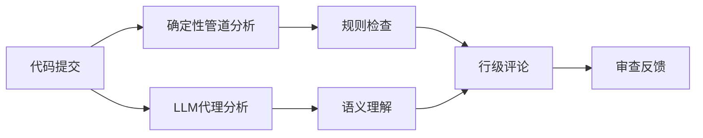

**技术特色**：
- 结合确定性管道与LLM代理的混合架构，平衡准确性与灵活性
- 支持多语言内置规则集(NPE、线程安全、XSS、SQL注入等)
- 兼容OpenAI和Anthropic API，提供灵活的AI集成方案

#### 热度分析

- 项目Star数超过3.2万，单日增长3000+，表明近期获得广泛关注
- 零Open Issues反映项目成熟度高，社区维护良好
- 作为阿里巴巴开源的企业级工具，已在自身业务大规模验证

#### 快速上手

```bash
# 克隆项目
git clone https://github.com/alibaba/open-code-review.git

# 安装依赖
cd open-code-review && go mod download

# 运行工具
go run main.go --help
```

#### 注意事项

- 项目许可证信息未知，商业使用前需确认许可证条款
- 需要配置OpenAI或Anthropic API密钥才能使用LLM功能
- 项目描述提到已在阿里巴巴规模验证，但具体性能数据未提供


### 2. JustVugg/colibri — 轻量级MoE引擎

> **一句话总结**：纯C实现的零依赖MoE模型运行引擎，支持从磁盘流式加载专家模型。

#### 价值主张

| 维度 | 说明 |
|------|------|
| **解决痛点** | 让普通硬件能运行前沿的大规模MoE模型，突破内存限制 |
| **目标用户** | 资源受限的开发者和研究人员，需要运行大模型 |
| **核心亮点** | 纯C实现 + 零依赖 + 磁盘流式加载 + 小体积引擎 + 大规模模型支持 |

#### 技术架构


**技术特色**：
- 专家模型按需从磁盘加载，避免内存溢出
- 纯C实现，无需依赖运行时环境
- 高效的内存管理机制，优化资源使用

#### 热度分析

- 项目Star数超3.5万，单日增长1500+，表明大模型社区高度关注
- 0个Open Issues，反映项目成熟度高，问题解决效率佳

#### 快速上手

```bash
# 克隆项目
git clone https://github.com/JustVugg/colibri.git
cd colibri

# 编译运行
make && ./colibri model_path
```

#### 注意事项

- 需要预先下载或准备专家模型文件
- 硬盘I/O性能可能影响模型加载速度
- 需要一定的MoE模型基础知识才能充分利用项目功能


### 3. Tencent/WeKnora — LLM知识平台

> **一句话总结**：开源LLM知识平台，将文档转化为可查询RAG、推理代理和自维护Wiki。

#### 价值主张

| 维度 | 说明 |
|------|------|
| **解决痛点** | 解决企业知识碎片化、难以有效利用LLM处理内部知识的问题 |
| **目标用户** | 企业知识管理部门、AI应用开发团队、内容创作者 |
| **核心亮点** | 文档自动结构化 + RAG系统 + 自主推理能力 + 知识自维护 + 开源可定制 |

#### 技术架构

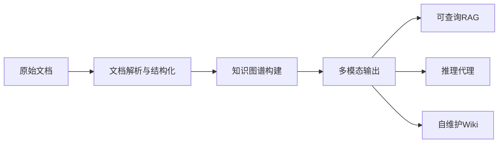

**技术特色**：
- 基于Go语言构建，高性能并发处理
- 支持多种文档格式自动解析与结构化
- 构建企业级知识图谱，支持语义检索
- 集成LLM实现知识推理与问答
- 自维护机制确保知识库持续更新

#### 热度分析

- 项目Star数达25,430且单日增长1,197，显示极高的市场关注度与采用率
- Fork数3,487表明社区活跃度高，开发者参与意愿强

#### 快速上手

```bash
# 克隆项目
git clone https://github.com/Tencent/WeKnora.git
cd WeKnora

# 安装依赖
go mod download

# 启动服务
go run cmd/server/main.go
```

#### 注意事项

- 项目许可证信息不明确，商业使用前需确认授权条款
- 作为LLM知识平台，可能需要考虑数据隐私与安全合规问题
- 项目依赖第三方LLM服务，可能产生额外成本
- 文档处理效果可能受原始文档质量影响较大
- 需要一定的Go和AI知识才能进行深度定制


### 4. abue-ammar/tinycast — [macOS效率工具]

> **一句话总结**：Tinycast是一款轻量级macOS原生工具，提供快速启动器、热键和剪贴板历史功能，提升用户操作效率。

#### 价值主张

| 维度 | 说明 |
|------|------|
| **解决痛点** | 解决macOS用户快速启动应用、管理热键和剪贴板历史的需求 |
| **目标用户** | 高效办公的macOS用户，需要频繁切换应用和操作剪贴板 |
| **核心亮点** | 全原生实现 + 极简设计 + 轻量级 + 高性能 + 自定义热键 |

#### 技术架构

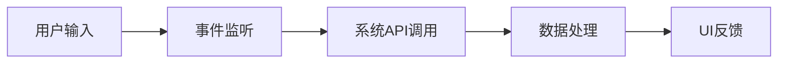

**技术特色**：
- 使用Swift语言开发，充分利用macOS原生API
- 采用轻量级设计，不依赖第三方框架
- 实现高效剪贴板监控和历史记录功能

#### 热度分析

- 项目近期热度显著，单日增长超过1000星，表明功能实用且符合用户需求
- 作为macOS原生工具，在苹果开发者社区中有较高关注度

#### 快速上手

```bash
# 克隆项目
git clone https://github.com/abue-ammar/tinycast.git

# 构建项目
cd tinycast
xcodebuild -project Tinycast.xcodeproj -scheme Tinycast -configuration Release build
```

#### 注意事项

- 项目未明确许可证信息，使用前需确认授权条款
- 仅支持macOS系统，且可能需要较新版本才能运行
- 作为系统增强工具，可能需要在系统设置中授予必要权限


### 5. NationalSecurityAgency/ghidra — 逆向工程平台

> **一句话总结**：NSA开源的企业级软件逆向工程框架，提供强大的反汇编、反编译和代码分析能力。

#### 价值主张

| 维度 | 说明 |
|------|------|
| **解决痛点** | 提供专业级逆向工具链，破解黑盒软件执行逻辑与数据结构 |
| **目标用户** | 安全研究员、逆向工程师、恶意代码分析师 |
| **核心亮点** | 跨平台支持 + 强大反编译器 + 可扩展架构 + 脚本自动化 |

#### 技术架构


**技术特色**：
- 采用Java开发，实现跨平台兼容性
- 内置多架构反编译器，支持复杂代码还原
- 模块化设计，通过插件系统实现功能扩展

#### 热度分析

- 高星项目，7.7万+星标，持续稳定增长，表明在逆向工程领域具有高认可度
- 由NSA开源，在安全研究领域具有重要影响力，形成活跃的逆向工程社区

#### 快速上手

```bash
# 下载Ghidra
wget https://github.com/NationalSecurityAgency/ghidra/releases/latest/download/ghidra_*.zip

# 解压并启动
unzip ghidra_*.zip
cd ghidra_*/ghidraRun
./ghidraRun  # Linux/Mac
```

#### 注意事项

- 由于是美国国家安全局开发的项目，使用时需注意相关法律法规
- 处理恶意代码时需在安全环境中进行，避免系统感染
- 某些高级功能可能受出口管制，国际用户使用前需了解当地法律


### 6. affaan-m/ECC — AI 代理优化

> **一句话总结**：为 AI 代码助手提供性能优化和功能增强的代理系统，支持多平台集成。

#### 价值主张

| 维度 | 说明 |
|------|------|
| **解决痛点** | 提升 AI 代码助手的性能和功能表现 |
| **目标用户** | 使用 Claude Code、Codex、Opencode、Cursor 的开发者 |
| **核心亮点** | 技能增强 + 本能优化 + 记忆功能 + 安全保障 + 研究优先开发 |

#### 技术架构

由于项目信息有限，无法确定具体的技术架构。

**技术特色**：
- 基于 JavaScript 的优化系统
- 支持多个 AI 代码平台
- 专注于性能优化和功能扩展

#### 热度分析

- 项目获得超过26万stars，日增上千，表明高度受开发者认可
- 0个开放问题可能反映项目成熟度高或问题解决效率高

#### 快速上手

由于缺乏具体的使用说明，无法提供确切的上手命令。

#### 注意事项

- 项目许可证未知，使用前需确认授权条款
- 项目描述较为简洁，建议查看 README 获取详细使用说明


### 7. alphaXiv/OpenResearch — 研究代理框架

> **一句话总结**：将编程代理扩展为专业研究助手，赋能AI学术研究与文献分析能力

#### 价值主张

| 维度 | 说明 |
|------|------|
| **解决痛点** | 突破传统编程代理局限，赋予AI深度学术研究能力 |
| **目标用户** | AI研究人员、学术开发者、科研机构 |
| **核心亮点** | 研究任务扩展 + 多模态学术数据处理 + 高性能Rust实现 + 开源可定制 |

#### 技术架构


**技术特色**：
- 基于Rust高性能实现，适合处理大规模学术文献
- 提供研究代理的扩展框架，不替代而是增强原有功能
- 支持多模态学术数据理解与分析

#### 热度分析

- 项目Star数一日激增1000+，显示AI研究社区高度关注
- 作为新兴研究代理工具，在AI辅助研究领域占据技术先发优势

#### 快速上手

```bash
# 克隆项目
git clone https://github.com/alphaXiv/OpenResearch.git

# 构建项目
cd OpenResearch && cargo build

# 运行示例
cargo run --example research_agent
```

#### 注意事项

- 项目许可证未知，商业使用前需确认授权条款
- 作为新兴项目，API和功能可能存在不稳定性
- 需要一定的Rust开发经验进行深度定制和扩展


### 8. cloudflare/security-audit-skill — 安全审计技能

> **一句话总结**：多阶段安全审计工具，提供机器可读、独立验证的安全发现结果

#### 价值主张

| 维度 | 说明 |
|------|------|
| **解决痛点** | 传统安全审计流程分散，结果难以自动化处理和验证 |
| **目标用户** | 安全审计人员、开发团队、DevOps工程师 |
| **核心亮点** | 多阶段审计流程 + 机器可读发现结果 + 独立验证机制 |

#### 技术架构

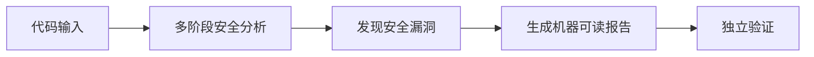

**技术特色**：
- 基于JavaScript构建，易于集成到各种开发环境
- 多阶段审计方法，提高检测准确性和覆盖率
- 机器可读输出格式，便于自动化处理和后续分析

#### 热度分析

- 单日增长927个Star，表明项目近期获得高度关注和认可
- 由Cloudflare开发，作为知名网络安全公司的项目，在安全领域具有重要生态影响力

#### 快速上手

```bash
# 安装
npm install -g @cloudflare/security-audit-skill

# 使用
security-audit-skill --path ./your-project
```

#### 注意事项

- 需要确保项目与当前开发环境兼容
- 由于是安全审计工具，可能需要额外配置才能获得最佳效果
- 项目许可证信息不明确，使用前需确认授权条款


### 9. ever-co/ever-gauzy — 企业全能管理平台

> **一句话总结**：开源全能型企业管理平台，集成ERP/CRM/HRM/ATS/PM多系统于一体，助力企业一站式管理业务。

#### 价值主张

| 维度 | 说明 |
|------|------|
| **解决痛点** | 中小企业多系统分散管理难题，实现数据统一与流程整合 |
| **目标用户** | 中小企业、创业公司、需要综合管理解决方案的组织 |
| **核心亮点** | 开源可定制 + 全模块集成 + 云端部署 + 多租户支持 + API扩展 |

#### 技术架构

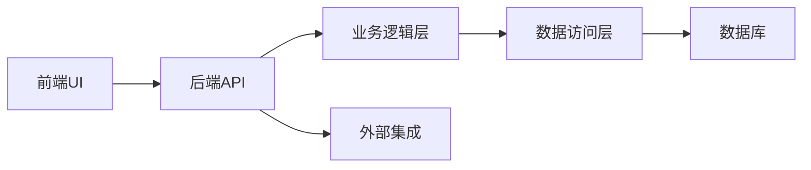

**技术特色**：
- 基于NestJS构建的TypeScript后端，提供强类型和模块化架构
- 采用GraphQL提供灵活的数据查询能力
- 支持微服务架构，便于扩展和维护
- 完整的认证授权系统，支持多种身份验证方式

#### 热度分析

- 项目近期增长迅速，单日新增778 stars，表明社区关注度极高
- 作为开源ERP解决方案，在同类项目中处于领先地位，拥有活跃的开发者和用户社区
- 注意：项目许可证信息不明确，企业在使用前需确认授权条款

#### 快速上手

```bash
# 克隆仓库
git clone https://github.com/ever-co/ever-gauzy.git

# 安装依赖
cd ever-gauzy
npm install

# 启动开发服务器
npm run start:dev
```

#### 注意事项

- 项目功能丰富，初次上手可能需要一定时间熟悉各个模块
- 部署过程相对复杂，建议参考官方文档进行配置
- 由于是开源项目，企业级使用可能需要额外的定制和测试
- 项目许可证信息不明确，商业使用前需确认授权条款


### 10. addyosmani/agent-skills — AI工程技能库

> **一句话总结**：为AI编程代理提供生产级工程能力的技能库，提升代码质量与工程实践。

#### 价值主张

| 维度 | 说明 |
|------|------|
| **解决痛点** | AI生成代码缺乏工程规范和最佳实践 |
| **目标用户** | AI模型开发者、编程工具构建者 |
| **核心亮点** | 工程最佳实践集成 + 代码质量提升 + 开发效率优化 + 工程规范标准化 |

#### 技术架构

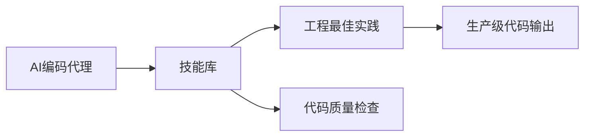

**技术特色**：
- 提供结构化的工程技能模块
- 集成现代前端开发最佳实践
- 支持多种编程语言和框架

#### 热度分析

- 项目star数持续高增长，表明开发者社区对AI编程辅助工具的强烈需求
- 在AI辅助开发领域处于领先地位，影响力持续扩大

#### 快速上手

```bash
# 克隆项目
git clone https://github.com/addyosmani/agent-skills.git

# 安装依赖
npm install

# 查看可用技能
npm run skills
```

#### 注意事项

- 需要结合具体的AI编程代理使用
- 技能库可能需要根据项目需求进行定制
- 部分技能可能需要特定环境支持


### 11. Lakr233/vphone-cli — [虚拟手机工具]

> **一句话总结**：基于Swift开发的命令行虚拟手机工具，提供移动应用测试与模拟环境。

#### 价值主张

| 维度 | 说明 |
|------|------|
| **解决痛点** | 提供无需实体设备的移动应用测试环境，降低开发成本 |
| **目标用户** | iOS开发者、移动应用测试人员、安全研究人员 |
| **核心亮点** | 轻量级部署 + 命令行操作 + 模拟真实手机行为 |

#### 技术架构

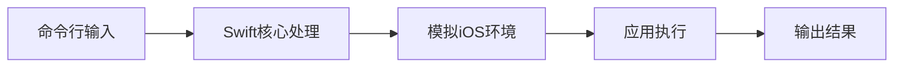

**技术特色**：
- 使用Swift构建，保证与iOS系统的兼容性
- 命令行界面设计，便于自动化集成
- 虚拟化技术实现轻量级手机环境模拟

#### 热度分析

- 项目获得13k+ Star且持续增长，表明在开发者社区中具有较高认可度
- Fork数相对较少但稳定，表明项目以使用为主，二次开发需求有限

#### 快速上手

```bash
# 克隆项目
git clone https://github.com/Lakr233/vphone-cli.git
cd vphone-cli

# 安装依赖
swift build

# 运行项目
./.build/debug/vphone-cli
```

#### 注意事项

- 需要macOS环境运行，因为基于Swift开发
- 可能需要Xcode或Swift工具链支持
- 使用时可能需要iOS开发相关知识


### 12. jamiepine/voicebox — AI语音创作平台

> **一句话总结**：开源AI语音工作室，支持语音克隆、转录与创作，实现高质量语音内容生成。

#### 价值主张

| 维度 | 说明 |
|------|------|
| **解决痛点** | 降低专业语音制作门槛，实现高质量个性化语音内容快速生成 |
| **目标用户** | 内容创作者、播客制作人、语音应用开发者、多媒体制作团队 |
| **核心亮点** | AI语音克隆技术 + 多语言支持 + 实时语音处理 + 开源可定制 |

#### 技术架构

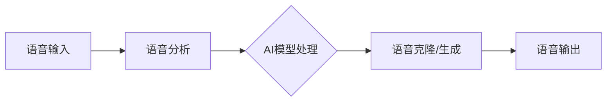

**技术特色**：
- 基于深度学习的语音处理与合成技术
- TypeScript实现确保代码类型安全与可维护性
- 开源架构支持社区扩展与功能定制

#### 热度分析

- 项目Star数超5.4万且持续快速增长，表明市场认可度高
- Fork数近7千，显示社区积极参与二次开发与功能扩展

#### 快速上手

```bash
# 克隆项目
git clone https://github.com/jamiepine/voicebox.git

# 安装依赖
npm install

# 启动应用
npm start
```

#### 注意事项

- 项目许可证信息未知，使用前需确认开源协议
- 作为AI语音工具，需注意语音数据隐私与伦理使用规范
- Open Issues为0，可能表示项目处于早期阶段或问题管理方式特殊


### 13. SnailSploit/Claude-Red — AI安全攻击库

> **一句话总结**：claude-red 是专为 Claude AI 设计的结构化安全攻击技能库，提供从 SQLi 到 EDR 逃避等多种攻击面的专家级方法论。

#### 价值主张

| 维度 | 说明 |
|------|------|
| **解决痛点** | 解决安全专家知识难以有效集成到AI系统的问题 |
| **目标用户** | 安全研究员、渗透测试人员、红队成员、AI安全开发者 |
| **核心亮点** | 结构化技能设计 + 覆盖广泛攻击面 + 专家级方法论 + Claude AI 专用 |

#### 技术架构

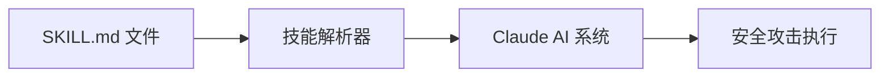

**技术特色**：
- 结构化的技能定义格式，确保方法论清晰传达
- 模块化设计，每个攻击面独立成技能文件
- 文档驱动的设计理念，保持专业性和完整性

#### 热度分析

- 项目近5.8个Star且单日激增367个，显示极高关注度和增长势头
- 作为AI安全领域创新项目，填补AI与攻击技能结合的生态空白

#### 快速上手

```bash
# 克隆项目
git clone https://github.com/SnailSploit/Claude-Red.git

# 查看可用技能
ls Claude-Red/skills/

# 使用特定技能
cat Claude-Red/skills/SQLi/SKILL.md
```

#### 注意事项

- 本项目仅用于安全研究和教育目的，请确保在合法授权环境中使用
- 技能内容涉及高级安全攻击方法，使用者应具备相关专业知识
- 项目许可证不明确，使用前请确认授权条款
- 技能库持续更新，关注最新以获取最新攻击方法和技巧


### 14. multimodal-art-projection/YuE — 前沿音乐生成

> **一句话总结**：基于符号规划和智能代理的前沿音乐生成系统，支持零样本封面与智能编辑。

#### 价值主张

| 维度 | 说明 |
|------|------|
| **解决痛点** | 传统音乐生成缺乏语义理解，难以实现高质量创意音乐创作与编辑 |
| **目标用户** | 音乐创作者、AI研究人员、音乐制作人和AI音乐爱好者 |
| **核心亮点** | 符号规划 + 零样本封面生成 + 智能代理编辑 + 前沿生成模型 |

#### 技术架构


**技术特色**：
- 基于符号的音乐表示和结构化规划
- 零样本音乐封面生成与迁移技术
- 智能代理驱动的音乐编辑与优化系统

#### 热度分析

- 项目Star数超9,300，单日增长332，显示社区高度关注与活跃度
- Fork数达1,012，表明开发者社区积极参与二次开发与应用拓展

#### 快速上手

```bash
# 克隆仓库
git clone https://github.com/multimodal-art-projection/YuE.git
cd YuE

# 安装依赖
pip install -r requirements.txt

# 运行示例
python demo.py --input prompt.txt --output generated_music.wav
```

#### 注意事项

- 项目许可证信息未知，使用前需确认授权条款
- 可能需要较高计算资源，建议使用GPU加速运行
- 作为前沿研究项目，API和功能可能会频繁更新变化


### 15. roboflow/supervision — 视觉工具集

> **一句话总结**：提供可重用的计算机视觉工具，简化视觉任务开发流程，支持多种模型和任务。

#### 价值主张

| 维度 | 说明 |
|------|------|
| **解决痛点** | 简化计算机视觉应用开发，降低技术门槛，提供统一接口 |
| **目标用户** | 机器学习工程师、数据科学家、计算机视觉研究者 |
| **核心亮点** | 多模型支持 + 统一API + 可视化工具 + 预处理功能 + 集成度高 |

#### 技术架构


**技术特色**：
- 提供统一的计算机视觉工具接口，简化开发流程
- 支持多种主流计算机视觉模型和框架的无缝集成
- 集成了丰富的数据预处理和后处理功能

#### 热度分析

- 项目增长迅速，Star 数超过5万，近期每日新增约260个Star，显示社区高度认可
- 作为Roboflow生态系统的核心组件，在计算机视觉工具领域具有显著影响力

#### 快速上手

```bash
# 安装supervision库
pip install supervision

# 基本使用示例
import supervision as sv
from ultralytics import YOLO

# 加载模型
model = YOLO("yolov8n.pt")

# 运行检测
results = model("image.jpg")

# 可视化结果
detections = sv.Detections.from_ultralytics(results[0])
annotated_image = sv.BoxAnnotator().annotate(image, detections)
```

#### 注意事项

- 项目依赖较多，建议使用虚拟环境安装
- 不同模型和任务的API可能存在差异，需要仔细阅读文档
- 对于生产环境，建议进行充分的性能测试和优化


### 16. anthropics/claude-code — 智能编码助手

> **一句话总结**：终端内AI编程助手，通过自然语言理解代码库并执行编码任务。

#### 价值主张

| 维度 | 说明 |
|------|------|
| **解决痛点** | 减少开发者重复编码工作，提高代码理解效率，简化Git操作流程 |
| **目标用户** | 开发者、程序员、软件工程师 |
| **核心亮点** | 自然语言交互 + 代码库理解 + 自动化任务执行 + Git工作流集成 + 终端内操作 |

#### 技术架构

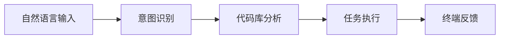

**技术特色**：
- 基于大型语言模型的自然语言理解与代码生成
- 代码库结构分析与上下文理解能力
- TypeScript实现，提供类型安全与跨平台支持

#### 热度分析

- 项目获得14.5万+星标，日均增长165星，表明开发者社区对其高度认可与需求
- 作为Anthropic公司出品的产品，在AI辅助编程领域具有领先地位，生态位置优越

#### 快速上手

```bash
# 安装Claude Code
npm install -g @anthropic-ai/claude-code

# 初始化项目
claude-code init

# 通过自然语言命令进行交互
claude-code "解释这个函数的功能"
```

#### 注意事项

- 需要有效的Anthropic API密钥才能使用
- 代码安全性需谨慎，建议审查AI生成的代码
- 可能需要稳定网络连接以与AI服务通信


### 17. supabase/supabase — 开源Postgres平台

> **一句话总结**：开源替代Firebase的Postgres开发平台，提供数据库、认证、存储等完整后端服务。

#### 价值主张

| 维度 | 说明 |
|------|------|
| **解决痛点** | 简化应用开发，无需管理服务器即可获得完整后端服务 |
| **目标用户** | Web、移动应用开发者，需要后端即服务的团队 |
| **核心亮点** | PostgreSQL数据库 + 实时数据同步 + 身份认证 + 存储服务 + Edge函数 |

#### 技术架构

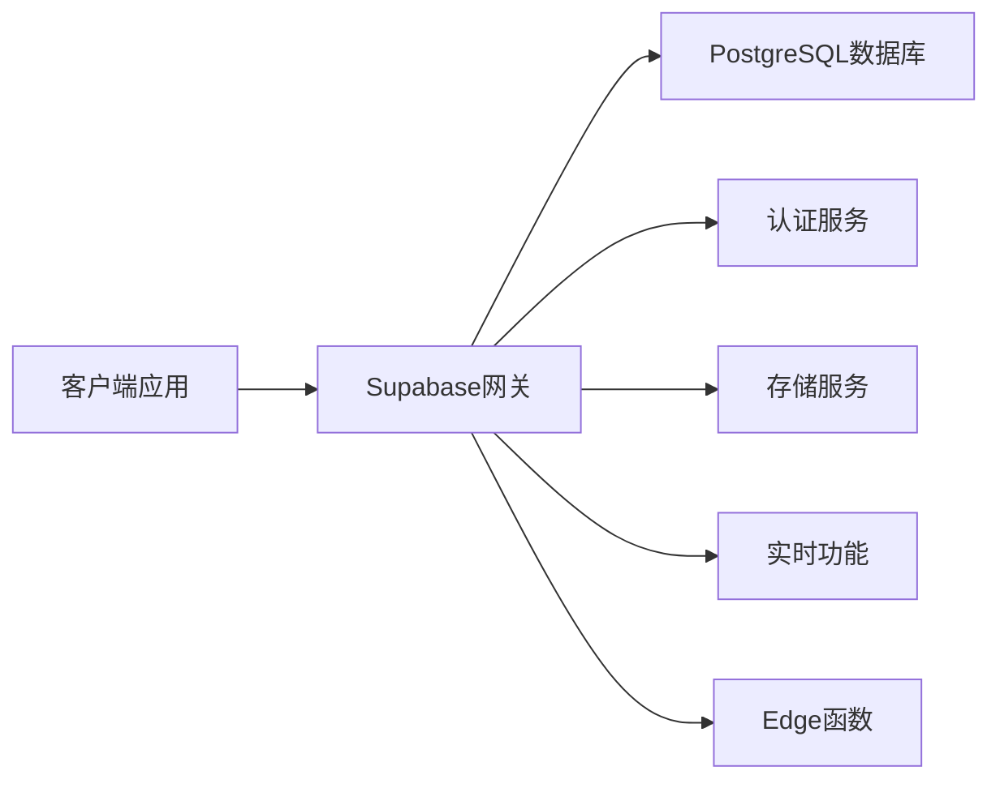

**技术特色**：
- 基于PostgreSQL构建的开源Firebase替代方案
- 提供RESTful API和实时数据订阅功能
- 支持JWT认证和Row Level安全策略
- 提供TypeScript客户端SDK简化开发流程
- 支持Edge Functions实现无服务器计算

#### 热度分析

- Star数超10万且稳定增长，表明项目活跃度高且受到开发者广泛认可
- 作为开源Firebase替代品，在开发者社区具有重要生态地位，尤其适合需要数据库即服务的项目

#### 快速上手

```bash
# 安装Supabase CLI
npm install -g supabase

# 初始化项目
supabase init

# 启动本地开发环境
supabase start
```

#### 注意事项

- 本地开发环境需要Docker支持
- 免费版有存储和API调用限制
- 自托管需要一定的PostgreSQL管理知识
- 与Firebase的API不完全兼容，迁移需要适配


### 18. cline/cline — 智能编程助手

> **一句话总结**：一款自主编程代理工具，通过SDK、IDE扩展或CLI形式提供智能代码生成与辅助功能。

#### 价值主张

| 维度 | 说明 |
|------|------|
| **解决痛点** | 提高编程效率，减少重复性编码工作 |
| **目标用户** | 软件开发者、编程爱好者 |
| **核心亮点** | 自主编程 + 多平台支持 + 智能代码生成 + IDE集成 |

#### 技术架构

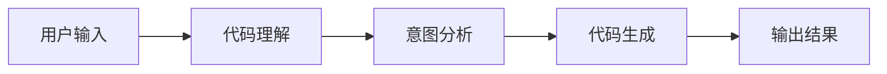

**技术特色**：
- 基于 TypeScript 开发，类型安全
- 自主编程代理技术
- 多平台支持架构（SDK、IDE、CLI）

#### 热度分析

- 高关注度项目，日增112星，社区活跃度高
- 作为编程代理工具，在AI辅助开发领域占据重要位置

#### 快速上手

```bash
# 安装
npm install -g @cline/cli

# 使用
cline "创建一个React组件，展示用户列表"
```

#### 注意事项

- 注意API使用限制和可能的费用
- 代码生成结果需要人工审核和测试


### 19. anthropics/knowledge-work-plugins — AI助手插件库

> **一句话总结**：开源插件集，增强知识工作者在Claude Cowork平台的专业协作能力。

#### 价值主张

| 维度 | 说明 |
|------|------|
| **解决痛点** | 知识工作者在协作和知识管理中需要专业工具支持 |
| **目标用户** | 知识工作者、研究人员、内容创作者和协作团队成员 |
| **核心亮点** | 提供专业化工具集 + 增强Claude Cowork功能 + 开源可定制 + 提高工作效率 |

#### 技术架构

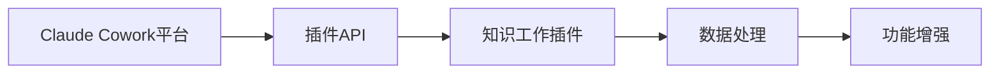

**技术特色**：
- 基于Python开发的插件系统，易于扩展
- 采用模块化设计，支持功能独立开发
- 提供标准化接口，便于第三方集成

#### 热度分析

- 项目Star数超2.4万，近期增长迅速，显示社区高度关注
- 作为Anthropic官方项目，在AI助手工具生态中占据重要位置

#### 快速上手

```bash
# 克隆仓库
git clone https://github.com/anthropics/knowledge-work-plugins.git
cd knowledge-work-plugins

# 安装依赖
pip install -r requirements.txt
```

#### 注意事项

- 插件需要Claude Cowork平台支持才能正常运行
- 部分高级功能可能需要API密钥或额外配置
- 作为开源项目，用户可以自行修改和扩展功能


### 20. rlaope/oh-my-hermes — 编程智能增强

> **一句话总结**：为Hermes Agent提供长期记忆和工作流优化的综合插件系统，提升编程智能体验

#### 价值主张

| 维度 | 说明 |
|------|------|
| **解决痛点** | 解决AI编程助手缺乏长期记忆和工作流连续性问题 |
| **目标用户** | 需要持续学习与记忆能力的AI编程助手使用者 |
| **核心亮点** | 长期记忆系统 + 工作流优化 + 模型增强 + 插件化设计 + 上下文连贯性 |

#### 技术架构

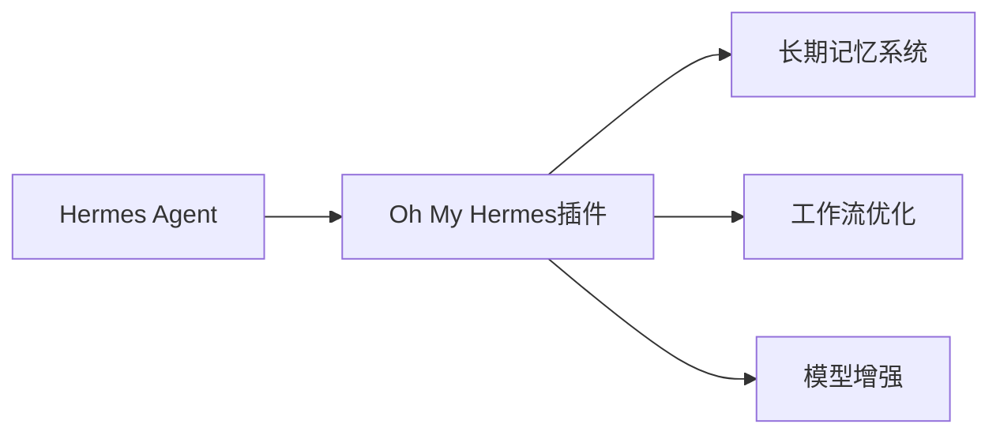

**技术特色**：
- 基于Python的模块化插件架构，便于功能扩展
- 实现长期记忆机制，保留历史交互上下文
- 优化工作流处理，提升模型响应效率

#### 热度分析

- 项目获得2581个Star且持续增长(+80/日)，表明社区认可度快速提升
- Fork数量相对较少(184)，暗示项目处于早期发展阶段，社区贡献潜力大

#### 快速上手

```bash
# 安装Oh My Hermes插件
pip install oh-my-hermes

# 初始化并启用插件
hermes init --plugin oh-my-hermes
```

#### 注意事项

- 项目许可证信息未知，使用前需确认开源许可类型
- 项目处于早期阶段，API接口可能存在变更风险
- 需要先安装Hermes Agent基础环境才能正常使用此插件


### 21. ankitects/anki — 智能记忆学习工具

> **一句话总结**：基于间隔重复算法的科学记忆系统，帮助用户高效学习和长期记忆知识。

#### 价值主张

| 维度 | 说明 |
|------|------|
| **解决痛点** | 解决传统记忆方法效率低、遗忘快的问题，通过科学安排复习时间优化记忆效果 |
| **目标用户** | 学生、语言学习者、医学专业人士等需要大量记忆和长期保留知识的群体 |
| **核心亮点** | 基于SM-2间隔重复算法 + 跨平台支持 + 丰富的卡片类型 + 强大的自定义能力 + 开源可扩展 |

#### 技术架构

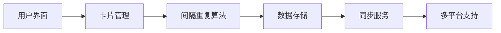

**技术特色**：
- 基于 Rust 重写，提供更好的性能和内存安全
- 使用 SM-2 算法实现科学间隔重复记忆
- 采用 SQLite 作为本地数据存储，保证高效访问
- 支持多平台同步，实现学习数据无缝衔接
- 提供插件 API，支持功能扩展

#### 热度分析

- Star 数超过 3 万且持续稳定增长，表明其在学习工具领域有广泛认可度和影响力
- 作为开源记忆工具，在教育技术领域占据重要位置，拥有活跃的用户社区

#### 快速上手

```bash
# 克隆仓库
git clone https://github.com/ankitects/anki.git
# 进入项目目录
cd anki
# 构建项目
cargo build --release
# 运行程序
./target/release/anki
```

#### 注意事项

- Anki 使用 Rust 编写，需要 Rust 开发环境
- 项目可能仍在开发中，部分功能可能不稳定
- 需要注册 AnkiWeb 账户才能使用同步功能
- 学习曲线可能较陡，需要理解间隔重复原理才能充分利用


## 今日推荐

| 主题 | 推荐项目 | 亮点 |
|------|----------|------|
| 今日最热 | [alibaba/open-code-review](https://github.com/alibaba/open-code-review) | Fast, efficient, ... |
| 值得关注 | [JustVugg/colibri](https://github.com/JustVugg/colibri) | Run frontier MoE ... |
| 快速上手 | [Tencent/WeKnora](https://github.com/Tencent/WeKnora) | Open-source LLM k... |
| 长期潜力 | [abue-ammar/tinycast](https://github.com/abue-ammar/tinycast) | Tinycast — a tiny... |

---

<div align="center">

*Generated on 2026-09-17 | Powered by GitHub Trending Reporter*

</div>