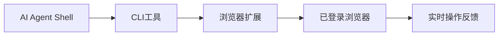
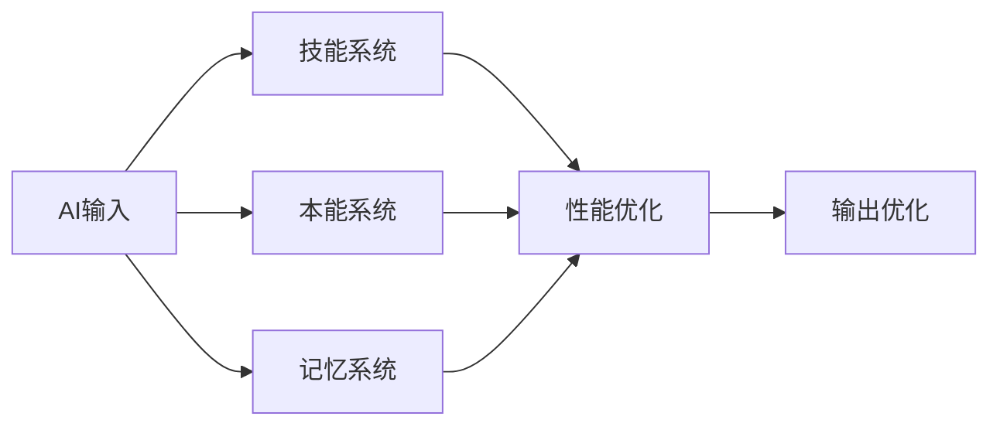
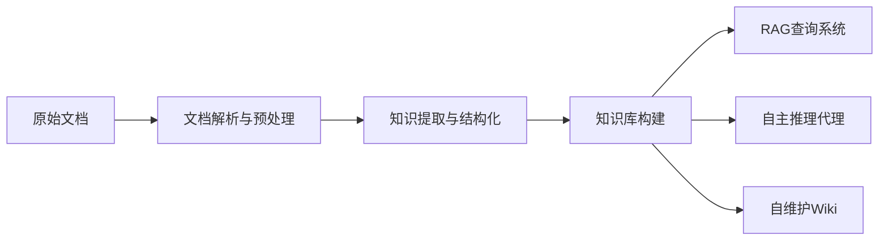
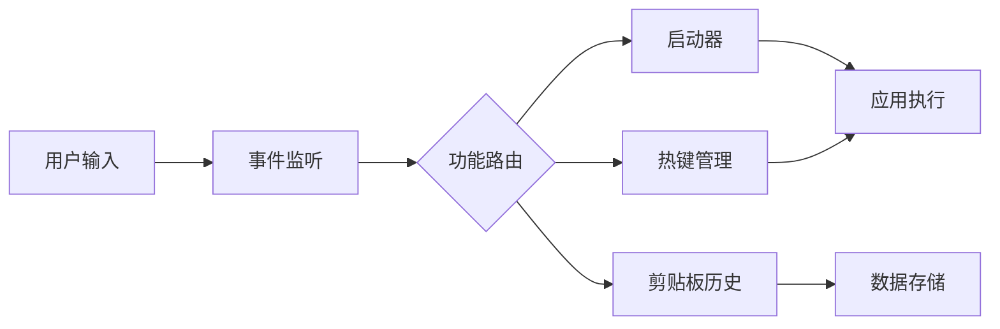
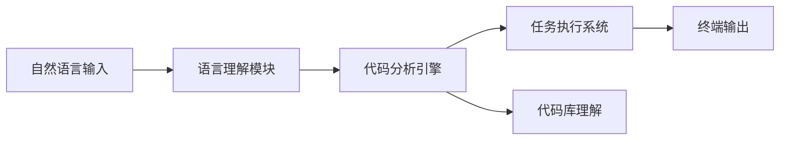
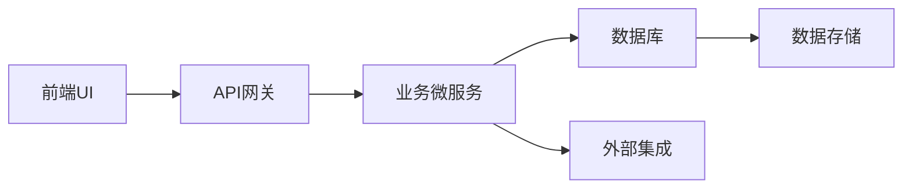
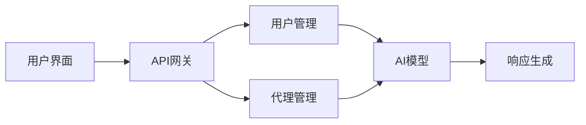
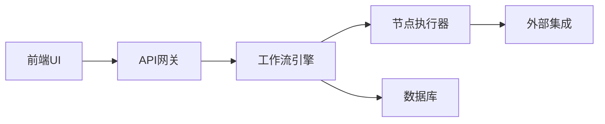
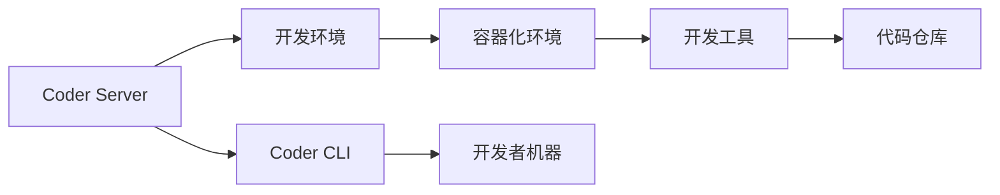

## 今日热点

AI编码助手与企业级AI平台引领今日热榜，大型科技公司纷纷开源AI工具，AI与安全审计、浏览器自动化等领域深度融合。

---

## 热门项目一览

| 排名 | 项目 | 语言 | 今日 | 总计 | 简介 |
|:---:|------|:----:|------:|-----:|------|
| 1 | [cloudflare/security-audit-skill](https://github.com/cloudflare/security-audit-skill) | JavaScript | +3,607 | 10,792 | A coding-agent skill for mu... |
| 2 | [alibaba/open-code-review](https://github.com/alibaba/open-code-review) | Go | +3,286 | 34,963 | Fast, efficient, battle-tes... |
| 3 | [Tencent/BrowserSkill](https://github.com/Tencent/BrowserSkill) | TypeScript | +1,302 | 4,288 | Let AI agents use your real... |
| 4 | [affaan-m/ECC](https://github.com/affaan-m/ECC) | JavaScript | +1,171 | 261,224 | The agent harness performan... |
| 5 | [Tencent/WeKnora](https://github.com/Tencent/WeKnora) | Go | +1,125 | 26,342 | Open-source LLM knowledge p... |
| 6 | [alphaXiv/OpenResearch](https://github.com/alphaXiv/OpenResearch) | Rust | +939 | 4,994 | Turn your coding agents int... |
| 7 | [NationalSecurityAgency/ghidra](https://github.com/NationalSecurityAgency/ghidra) | Java | +912 | 78,542 | Ghidra is a software revers... |
| 8 | [JustVugg/colibri](https://github.com/JustVugg/colibri) | C | +873 | 35,782 | Run frontier MoE models on ... |
| 9 | [abue-ammar/tinycast](https://github.com/abue-ammar/tinycast) | Swift | +739 | 6,178 | Tinycast — a tiny, fully na... |
| 10 | [addyosmani/agent-skills](https://github.com/addyosmani/agent-skills) | JavaScript | +680 | 95,890 | Production-grade engineerin... |
| 11 | [jamiepine/voicebox](https://github.com/jamiepine/voicebox) | TypeScript | +667 | 54,887 | The open-source AI voice st... |
| 12 | [anthropics/claude-code](https://github.com/anthropics/claude-code) | TypeScript | +538 | 145,903 | Claude Code is an agentic c... |

---

## 趋势洞察

```
┌─────────────────────────────────────────────────────────────────┐
│  AI/ML 工具         ████████████████████████  14 个项目        │
│  开发工具             ███                       2 个项目        │
│  开发框架             █                         1 个项目        │
│  媒体资源             █                         1 个项目        │
│  项目管理             █                         1 个项目        │
│  安全工具             █                         1 个项目        │
└─────────────────────────────────────────────────────────────────┘
```

---

## 项目深度解读

### 1. cloudflare/security-audit-skill — 智能安全审计

> **一句话总结**：提供多阶段安全审计能力的自动化工具，生成独立验证的机器可读安全报告。

#### 价值主张

| 维度 | 说明 |
|------|------|
| **解决痛点** | 简化复杂安全审计流程，提供标准化、可验证的安全评估结果 |
| **目标用户** | 安全审计人员、开发团队和DevOps工程师 |
| **核心亮点** | 多阶段审计能力 + 独立验证机制 + 机器可读输出 + 自动化报告生成 |

#### 技术架构


**技术特色**：
- JavaScript实现，便于集成到现有开发环境
- 多阶段审计流程，确保全面安全评估
- 独立验证机制，提高结果可信度

#### 热度分析

- 项目近期获得大量关注，Star数短时间内增长超过3600，表明社区对其高度认可
- 作为Cloudflare开源的安全审计工具，在DevSecOps领域具有重要生态价值

#### 快速上手

```bash
# 安装
npm install @cloudflare/security-audit-skill

# 使用
security-audit-skill --input ./code --output report.json
```

#### 注意事项

- 需要配置适当的扫描规则和策略以获得最佳效果
- 输出结果需要专业知识解读，可能结合其他安全工具使用
- 建议定期更新规则库以应对新发现的安全威胁


### 2. alibaba/open-code-review — 智能代码审查工具

> **一句话总结**：阿里巴巴开源的高性能混合架构代码审查工具，结合确定性流程与AI代理，提供精准行级评论和多语言安全检测。

#### 价值主张

| 维度 | 说明 |
|------|------|
| **解决痛点** | 解决传统代码审查效率低、一致性差、难以覆盖多语言安全问题的痛点 |
| **目标用户** | 企业级开发团队、开源项目维护者、注重代码质量与安全的开发者 |
| **核心亮点** | 混合架构(deterministic pipelines + LLM Agent) + 多语言内置规则集 + 精确行级评论 + 企业级规模验证 |

#### 技术架构


**技术特色**：
- 混合架构结合确定性流程与AI代理
- 内置多语言安全规则集(NPE、线程安全、XSS、SQL注入等)
- 支持OpenAI和Anthropic API兼容

#### 热度分析

- 项目获得近3.5万星，单日新增3286星，增长迅猛，表明社区高度认可
- 零未解决问题显示项目维护活跃，问题响应迅速，适合生产环境使用

#### 快速上手

```bash
# 克隆项目
git clone https://github.com/alibaba/open-code-review.git
cd open-code-review

# 安装依赖
go mod download

# 运行工具
go run main.go --help
```

#### 注意事项

- 需要配置OpenAI或Anthropic API密钥才能使用LLM代理功能
- 项目可能需要一定规模的项目才能发挥最大效益
- 许可证信息不明确，使用前需确认开源许可条款


### 3. Tencent/BrowserSkill — AI浏览器自动化

> **一句话总结**：让AI代理使用真实登录状态的浏览器进行自动化操作，不干扰用户工作。

#### 价值主张

| 维度 | 说明 |
|------|------|
| **解决痛点** | 解决AI无法直接操作用户已登录浏览器状态的难题 |
| **目标用户** | 需要AI代理进行浏览器自动化的开发者和研究人员 |
| **核心亮点** | 真实浏览器状态 + 无干扰操作 + 多AI代理兼容 + 跨平台支持 |

#### 技术架构



**技术特色**：
- 采用TypeScript编写，确保类型安全和开发效率
- 通过浏览器扩展实现与AI代理的无缝通信
- 支持多shell-capable AI代理，提供统一的自动化接口

#### 热度分析

- 项目近期热度飙升，单日增长1,302 stars，反映AI自动化需求激增
- 社区参与度高，Fork数量适中，表明项目处于活跃发展阶段

#### 快速上手

```bash
# 安装CLI工具
npm install -g @tencent/browserskill

# 安装浏览器扩展
browserskill extension install

# 连接AI代理
browserskill connect
```

#### 注意事项

- 确保浏览器已登录目标账户，否则自动化操作将受限
- 使用时需注意隐私安全，避免敏感信息被AI代理访问
- 可能需要根据具体AI代理调整配置参数


### 4. affaan-m/ECC — AI性能优化

> **一句话总结**：为AI编码助手提供性能优化系统，增强技能、记忆与安全保障能力。

#### 价值主张

| 维度 | 说明 |
|------|------|
| **解决痛点** | AI编码助手性能瓶颈与效率低下问题 |
| **目标用户** | 使用Claude、Cursor等AI工具的开发者 |
| **核心亮点** | 技能增强系统 + 记忆优化 + 安全保障机制 |

#### 技术架构



**技术特色**：
- 多层次AI能力架构设计
- 记忆与学习系统优化
- 安全与性能平衡机制

#### 热度分析

- 高星项目持续快速增长，日均增长千星，社区活跃度高
- Fork数量庞大，表明项目被广泛应用于实际开发环境

#### 快速上手

```bash
# 克隆项目
git clone https://github.com/affaan-m/ECC.git

# 安装依赖
npm install
```

#### 注意事项

- 项目许可证未知，商业使用前需确认版权信息
- Open Issues为0，可能问题通过其他渠道处理，建议关注官方社区
- 项目针对特定AI工具优化，使用前需确认兼容性


### 5. Tencent/WeKnora — AI知识管理平台

> **一句话总结**：将原始文档转化为可查询知识库、智能代理和自维护Wiki的AI平台。

#### 价值主张

| 维度 | 说明 |
|------|------|
| **解决痛点** | 静态文档知识难以有效利用和检索的问题 |
| **目标用户** | 研究机构、企业知识管理团队、文档密集型组织 |
| **核心亮点** | 智能文档解析 + RAG查询增强 + 自主推理代理 + 自维护Wiki |

#### 技术架构



**技术特色**：
- 基于LLM的深度文档解析与知识提取
- 高效的RAG检索增强生成机制
- 自主推理与知识维护闭环系统

#### 热度分析

- 项目Star数超过26,000，近期增长迅速，反映AI知识管理领域的高关注度
- 作为腾讯开源项目，在中文AI生态中具有重要影响力

#### 快速上手

```bash
# 克隆项目
git clone https://github.com/Tencent/WeKnora.git

# 安装依赖
cd WeKnora && pip install -r requirements.txt
```

#### 注意事项

- 需要一定的技术背景来部署和配置系统
- 作为知识管理平台，数据安全和隐私保护需要特别关注
- 文档处理质量依赖于底层LLM的能力


### 6. alphaXiv/OpenResearch — 研究智能代理

> **一句话总结**：将编程代理转变为研究代理，自动化研究流程与成果生成

#### 价值主张

| 维度 | 说明 |
|------|------|
| **解决痛点** | 研究人员缺乏自动化工具处理研究流程中的重复性工作 |
| **目标用户** | 科研人员、学术研究者、AI研究人员 |
| **核心亮点** | 研究流程自动化 + 多模态数据处理 + 研究成果生成 + 代码与研究结合 |

#### 技术架构


**技术特色**：
- 基于Rust构建的高性能研究代理框架
- 支持多模态研究数据处理与分析
- 提供从数据收集到成果生成的全流程自动化

#### 热度分析

- 项目近期获得大量关注，一日增长939 stars，表明学术社区对该方向的高度兴趣
- 相对较低的fork数量(307)与高star数形成对比，说明用户更倾向于观望而非贡献

#### 快速上手

```bash
# 克隆项目
git clone https://github.com/alphaXiv/OpenResearch.git
# 构建项目
cargo build --release
# 运行示例
./examples/basic_research
```

#### 注意事项

- 项目尚未明确许可证，使用时需注意版权问题
- 从0个Open Issues来看，可能项目处于早期阶段，文档和社区支持可能不完善
- 基于Rust开发，需要用户具备一定Rust语言基础


### 7. NationalSecurityAgency/ghidra — [逆向工程框架]

> **一句话总结**：美国国家安全局开源的逆向工程套件，支持多平台二进制分析，功能全面的软件逆向解决方案。

#### 价值主张

| 维度 | 说明 |
|------|------|
| **解决痛点** | 提供专业级逆向工程工具链，弥补开源工具功能不足 |
| **目标用户** | 安全研究员、恶意分析师、逆向工程师、军事人员 |
| **核心亮点** | 跨平台支持 + 多种处理器架构支持 + 强大的脚本能力 + 可视化分析 + 高级调试功能 |

#### 技术架构


**技术特色**：
- 基于Java跨平台架构，支持Windows/Linux/MacOS
- 插件化设计，可通过Java脚本扩展功能
- 支持多种处理器架构和文件格式解析
- 提供数据流和程序流分析能力
- 内置版本控制系统，便于团队协作

#### 热度分析

- 作为NSA开源项目，获得近8万星标，每日新增900+星，表明网络安全领域高度认可
- 社区活跃度高，虽官方为美国国家安全局，但全球安全研究者和军事机构广泛使用

#### 快速上手

```bash
# 下载Ghidra
wget https://github.com/NationalSecurityAgency/ghidra/releases/latest/download/ghidra_XX_PUBLIC.zip

# 解压并运行
unzip ghidra_XX_PUBLIC.zip
cd ghidra_XX_PUBLIC
./ghidraRun
```

#### 注意事项

- 由于其军事背景，某些高级功能可能受出口管制
- 处理恶意代码时需谨慎，避免系统感染
- 学习曲线较陡，需要一定的逆向工程基础知识


### 8. JustVugg/colibri — 高效MoE引擎

> **一句话总结**：纯C实现的零依赖MoE模型运行引擎，支持从磁盘流式加载专家模型，在普通硬件上运行前沿大模型。

#### 价值主张

| 维度 | 说明 |
|------|------|
| **解决痛点** | 解决大模型运行资源需求高，普通硬件难以运行前沿MoE模型的问题 |
| **目标用户** | 需要在个人设备上运行大模型的研究者和开发者 |
| **核心亮点** | 纯C实现 + 零依赖 + 专家模型磁盘流式加载 |

#### 技术架构


**技术特色**：
- 纯C实现，无需依赖，轻量级运行环境
- 专家模型从磁盘流式加载，降低内存需求
- 高效的MoE路由算法，动态选择专家组合

#### 热度分析

- 项目Star数高且增长迅速，表明大模型轻量化部署是当前热点需求
- 零Issues反映项目稳定性和成熟度，社区维护良好

#### 快速上手

```bash
# 克隆仓库
git clone https://github.com/JustVugg/colibri.git
# 编译项目
make
# 运行模型
./colibri model_path input_file
```

#### 注意事项

- 项目依赖较低，但可能需要特定硬件支持以获得最佳性能
- 模型文件可能较大，需要足够的磁盘空间
- 纯C实现意味着跨平台兼容性好，但可能缺少高级语言的一些便利功能


### 9. abue-ammar/tinycast — macOS效率工具

> **一句话总结**：原生 macOS 效率工具，提供快速启动、热键和剪贴板历史功能，提升操作效率。

#### 价值主张

| 维度 | 说明 |
|------|------|
| **解决痛点** | 解决 macOS 用户快速启动应用、热键操作和剪贴板管理需求 |
| **目标用户** | 注重效率的 macOS 高级用户和开发者 |
| **核心亮点** | 原生实现 + 轻量级设计 + 高度可定制 |

#### 技术架构



**技术特色**：
- 基于 Swift 原生开发，充分利用 macOS 系统特性
- 轻量级设计，资源占用小
- 高度可定制的快捷键和启动器配置

#### 热度分析

- 项目 Star 数达 6,178 且单日增长 739，表明用户需求强烈且认可度高
- Fork 数相对较少(287)，说明项目处于活跃开发阶段，社区贡献较少但用户关注度极高

#### 快速上手

```bash
# 克隆仓库
git clone https://github.com/abue-ammar/tinycast.git
# 构建项目
cd tinycast && swift build
# 运行应用
swift run Tinycast
```

#### 注意事项

- 项目许可证未知，商业使用前需确认授权方式
- 仅支持 macOS 系统，其他平台无法使用
- 项目 Issue 数为 0，可能意味着项目处于早期阶段或问题通过其他渠道解决


### 10. addyosmani/agent-skills — AI代理工程技能

> **一句话总结**：为AI编程代理提供生产级工程技能支持，提升代码质量和开发效率。

#### 价值主张

| 维度 | 说明 |
|------|------|
| **解决痛点** | 解决AI编程代理在实际工程应用中的技能不足问题 |
| **目标用户** | AI开发人员、AI代理构建者和软件工程师 |
| **核心亮点** | 生产级代码质量 + 工程最佳实践 + 可扩展架构 + 模块化设计 |

#### 技术架构


**技术特色**：
- 基于JavaScript实现，易于集成到现有开发环境
- 提供模块化技能组件，支持灵活组合
- 关注生产环境中的代码质量和工程实践

#### 热度分析

- 项目获得近10万星且持续增长，表明AI编程代理领域需求旺盛
- 高Star/Fork比例(约9.4:1)说明项目质量高，社区认可度高

#### 快速上手

```bash
# 克隆项目
git clone https://github.com/addyosmani/agent-skills.git
# 安装依赖
npm install
# 运行示例
npm run example
```

#### 注意事项

- 项目许可证未知，商业使用前需确认授权
- 虽然项目描述为生产级，但实际应用前应充分测试
- 由于项目没有Open Issues，可能社区反馈渠道有限


### 11. jamiepine/voicebox — AI语音克隆工具

> **一句话总结**：开源AI语音工作室，支持声音克隆、语音听写与创作

#### 价值主张

| 维度 | 说明 |
|------|------|
| **解决痛点** | 简化高质量语音内容创建流程，无需专业录音设备 |
| **目标用户** | 内容创作者、语音艺术家、开发者、多媒体制作人员 |
| **核心亮点** | 开源AI语音工作室 + 声音克隆技术 + 语音编辑与创作工具 |

#### 技术架构


**技术特色**：
- 基于深度学习的语音克隆技术
- 高质量语音合成引擎
- 开源可扩展的架构设计

#### 热度分析

- 项目获得超5.4万星，单日增长600+，显示社区对AI语音工具有强烈兴趣
- 作为开源AI语音工具，在创作者和开发者社区中具有重要生态位置

#### 快速上手

```bash
# 克隆项目
git clone https://github.com/jamiepine/voicebox.git
cd voicebox

# 安装依赖
npm install
```

#### 注意事项

- 项目可能需要较高的计算资源进行AI模型训练
- 使用时需注意语音版权和隐私问题
- AI生成语音的使用可能受到当地法律法规的限制


### 12. anthropics/claude-code — AI编程助手

> **一句话总结**：终端内智能编程助手，通过自然语言理解代码库并加速开发流程

#### 价值主张

| 维度 | 说明 |
|------|------|
| **解决痛点** | 解决开发者编码效率低、代码理解困难和Git操作繁琐的问题 |
| **目标用户** | 软件开发人员、全栈工程师和需要高效编码辅助的开发者 |
| **核心亮点** | 代码理解能力 + 自然语言交互 + 自动化任务执行 + Git工作流处理 + 终端内集成 |

#### 技术架构



**技术特色**：
- 基于Claude大语言模型的深度代码理解能力
- 终端内直接集成，无需切换上下文环境
- 支持复杂代码库的语义解析和重构建议

#### 热度分析

- 项目Star数超14.5万，日增538个，显示处于快速增长期，开发者认可度高
- 作为Anthropic官方工具，在AI辅助编程领域具有先发优势和生态位影响力

#### 快速上手

```bash
# 安装Claude Code
npm install -g @anthropic-ai/claude-code

# 初始化项目并使用
claude-code init
claude-code "解释这个函数的功能并优化性能"
```

#### 注意事项

- 需要Anthropic API密钥才能使用完整功能
- 项目处于早期阶段，API和功能可能会发生变化
- 对于大型代码库，首次理解可能需要一些时间


### 13. ever-co/ever-gauzy — 全能企业平台

> **一句话总结**：开源全能企业管理平台，整合ERP/CRM/HRM/ATS/PM功能，助力企业一站式管理。

#### 价值主张

| 维度 | 说明 |
|------|------|
| **解决痛点** | 中小企业需要多系统整合，降低IT成本和管理复杂度 |
| **目标用户** | 中小企业、创业公司、需要一体化管理的企业团队 |
| **核心亮点** | 开源免费 + 多功能集成 + 云端部署 + 定制化开发 + API丰富 |

#### 技术架构



**技术特色**：
- 采用TypeScript全栈开发，提高代码质量和可维护性
- 基于微服务架构设计，支持模块化部署和扩展
- 提供丰富的RESTful API，便于第三方系统集成

#### 热度分析

- Star数7500+且日增470，表明项目近期热度迅速攀升，社区认可度高
- Fork数1100+，说明有大量开发者基于此项目进行二次开发或定制

#### 快速上手

```bash
# 克隆项目
git clone https://github.com/ever-co/ever-gauzy.git

# 安装依赖并启动
cd ever-gauzy
npm install && npm run start
```

#### 注意事项

- 项目功能复杂，初次使用可能需要较长时间学习和配置
- 开源版本可能缺少企业版的高级功能和支持服务
- 需要一定的技术背景才能进行深度定制和二次开发


### 14. cline/cline — 智能编程助手

> **一句话总结**：一个自主编程代理，可作为SDK、IDE扩展或CLI助手，提供全方位代码辅助功能。

#### 价值主张

| 维度 | 说明 |
|------|------|
| **解决痛点** | 减少重复编码工作，提高开发效率和代码质量 |
| **目标用户** | 软件开发人员、IDE用户、需要CLI辅助的开发者 |
| **核心亮点** | 自主编程代理 + 多平台支持(SDK/IDE/CLI) + 智能代码生成 |

#### 技术架构


**技术特色**：
- 基于TypeScript开发，确保类型安全和跨平台兼容性
- 提供SDK、IDE扩展和CLI三种使用方式，适应不同场景需求
- 智能代码分析和生成能力，理解上下文提供精准建议

#### 热度分析

- Star数高达68,578且持续增长(+380/天)，表明项目备受开发者关注
- Fork数7,415，显示社区积极参与项目贡献和二次开发

#### 快速上手

```bash
# 安装Cline CLI工具
npm install -g @cline/cli

# 启动交互式编程助手
cline start
```

#### 注意事项

- 项目License未知，使用前需确认开源协议
- 作为AI编程助手，可能存在代码安全性和隐私问题
- 需要稳定的网络连接，因为可能涉及云端AI服务


### 15. TencentCloud/Octop — 智能多代理助手

> **一句话总结**：自托管多用户多代理AI助手，提供智能化个性化服务

#### 价值主张

| 维度 | 说明 |
|------|------|
| **解决痛点** | 解决企业级多用户AI助手隐私保护和定制化需求 |
| **目标用户** | 企业团队、开发者和需要私有AI助手的高级用户 |
| **核心亮点** | 自托管部署 + 多用户支持 + 多代理协作 + 隐私保护 |

#### 技术架构



**技术特色**：
- 多用户隔离的权限管理系统
- 可扩展的多代理协作架构
- 自托管部署保障数据隐私

#### 热度分析

- 项目近期增长迅速，单日新增Star达367，显示社区高度关注
- Fork数相对较少，表明项目可能处于早期阶段或偏向企业级应用

#### 快速上手

```bash
# 克隆项目
git clone https://github.com/TencentCloud/Octop.git
cd Octop

# 安装依赖
pip install -r requirements.txt

# 启动服务
python app.py
```

#### 注意事项

- 需要配置AI模型相关参数，可能需要访问特定的AI服务
- 自托管部署需要一定的技术基础，尤其是AI模型配置
- 项目License未知，商业使用前需确认授权条款


### 16. roboflow/supervision — 计算机视觉工具集

> **一句话总结**：提供丰富的计算机视觉工具集，简化CV模型集成与应用流程。

#### 价值主张

| 维度 | 说明 |
|------|------|
| **解决痛点** | 解决计算机视觉工具碎片化、集成困难问题 |
| **目标用户** | 机器学习工程师、计算机视觉研究者 |
| **核心亮点** | 统一API接口 + 丰富预训练模型 + 易于集成 |

#### 技术架构


**技术特色**：
- 统一的计算机视觉工具接口
- 支持多种主流CV模型
- 简化模型集成与应用流程

#### 热度分析

- Star数超5万，近329星/天，增长迅速，表明项目受到社区高度认可
- 作为roboflow公司的核心项目，在计算机视觉工具领域具有重要生态位置

#### 快速上手

```bash
# 安装
pip install supervision

# 基本使用
import supervision as sv
from ultralytics import YOLO

model = YOLO('yolov8n.pt')
detector = sv.Detection(model)
results = detector.predict('image.jpg')
```

#### 注意事项

- 需要了解基本的计算机视觉概念
- 某些高级功能可能需要额外依赖
- 项目文档相对完善，但部分高级功能可能需要深入研究源码


### 17. anthropics/knowledge-work-plugins — AI辅助插件

> **一句话总结**：为知识工作者提供开源插件，增强Claude AI协作能力，提升工作效率。

#### 价值主张

| 维度 | 说明 |
|------|------|
| **解决痛点** | 解决Claude AI功能扩展需求，提供专业化知识工作工具 |
| **目标用户** | 知识工作者、研究人员、内容创作者、开发人员 |
| **核心亮点** | 开源可定制 + 提升工作效率 + 与Claude深度集成 + 易于部署 |

#### 技术架构


**技术特色**：
- 基于Python开发，便于扩展和定制
- 插件化架构，支持灵活的功能组合
- 与Claude AI深度集成，提供智能化支持

#### 热度分析

- 项目获得24,599个star且持续增长，表明社区认可度高
- 作为Anthropic官方插件库，在AI辅助工作工具领域具有重要生态地位

#### 快速上手

```bash
# 克隆仓库
git clone https://github.com/anthropics/knowledge-work-plugins.git

# 安装依赖
cd knowledge-work-plugins
pip install -r requirements.txt
```

#### 注意事项

- 插件需要与Claude Cowork配合使用，单独可能无法运行
- 部分插件可能需要API密钥或额外配置
- 需关注项目许可协议，确保合规使用


### 18. n8n-io/n8n — 智能工作流平台

> **一句话总结**：可视化工作流自动化平台，融合AI能力与自定义代码，支持400+种服务集成。

#### 价值主张

| 维度 | 说明 |
|------|------|
| **解决痛点** | 企业需要灵活强大的跨系统工作流自动化工具，无需复杂编程 |
| **目标用户** | 开发人员、IT专业人员、业务分析师和自动化需求企业 |
| **核心亮点** | 可视化编辑器 + AI原生能力 + 节点架构 + 自托管/云选项 + 自定义扩展 |

#### 技术架构



**技术特色**：
- 基于TypeScript全栈实现，提供类型安全和开发体验
- 节点架构设计，支持400+种服务和API的灵活集成
- 支持自定义节点，允许开发者扩展平台功能

#### 热度分析

- 项目Star数超20万，日增280+，表明处于高速增长期，受开发者广泛关注
- Fork数与Star数比例合理，社区活跃度高，是工作流自动化领域领先项目

#### 快速上手

```bash
# 使用Docker快速启动n8n
docker run -it --rm --name n8n -p 5678:5678 n8nio/n8n

# 或使用npm安装
npm install n8n
n8n
```

#### 注意事项

- 自托管部署需要Node.js和Docker基础知识，建议先评估技术资源需求
- 复杂工作流设计有学习曲线，建议从简单场景开始逐步探索
- 处理敏感数据时，需确保适当的安全措施和访问控制机制


### 19. coder/coder — 开发安全环境

> **一句话总结**：为开发者提供安全隔离的远程开发环境和团队协作平台，实现环境一致性管理。

#### 价值主张

| 维度 | 说明 |
|------|------|
| **解决痛点** | 解决本地开发环境不一致和远程开发安全性问题 |
| **目标用户** | 开发团队、DevOps工程师、远程工作者 |
| **核心亮点** + 安全隔离 + 环境一致性 + 远程访问 + 团队协作 + 多环境管理 |

#### 技术架构



**技术特色**：
- 基于Go语言开发，性能高效且跨平台支持良好
- 容器化技术确保开发环境一致性，消除"在我机器上能运行"问题
- 安全隔离机制保护开发环境，防止敏感信息泄露
- 支持多用户协作和权限管理，适合团队开发场景

#### 热度分析

- Star数持续稳定增长(+145/天)，表明项目活跃度高，社区认可度强
- 在开发工具领域有一定影响力，是远程开发环境的重要解决方案

#### 快速上手

```bash
# 安装Coder CLI
go install github.com/coder/coder/cmd/coder@latest

# 登录Coder服务器
coder login

# 创建新工作区
coder create my-workspace
```

#### 注意事项

- 需要了解Docker/Kubernetes相关知识以便更好地使用
- 企业使用时需注意数据安全和隐私保护
- 可能需要额外配置才能完全利用所有功能


### 20. cilium/cilium — 云原生网络守护者

> **一句话总结**：基于 eBPF 技术的云原生网络、安全和可观测性解决方案，提供高效透明的服务间通信与安全防护。

#### 价值主张

| 维度 | 说明 |
|------|------|
| **解决痛点** | 解决云原生环境网络连接复杂、安全策略难以实施、可观测性不足的问题 |
| **目标用户** | 云原生平台开发者、网络工程师、DevOps 团队、安全专家 |
| **核心亮点** | 基于 eBPF 的高性能网络 + 原生安全策略 + 全栈可观测性 |

#### 技术架构


**技术特色**：
- 基于 eBPF 的高性能数据平面，绕过内核协议栈
- CiliumNetworkPolicy 提供细粒度的网络访问控制
- 通过 Hubble 提供全栈可观测性
- 支持 Kubernetes、Istio 等多种云原生平台
- 自动化加密和身份认证机制

#### 热度分析

- Cilium 项目 Star 数超过 25k，且持续增长，表明其在云原生网络领域获得广泛认可
- 作为 CNCF 毕业项目，已成为云原生网络和安全领域的事实标准之一

#### 快速上手

```bash
# 安装 Cilium CLI
curl -L --remote-name-all https://github.com/cilium/cilium-cli/releases/latest/download/cilium-linux-amd64.tar.gz
tar xzvf cilium-linux-amd64.tar.gz
sudo mv cilium /usr/local/bin

# 部署 Cilium 到 Kubernetes 集群
cilium install
cilium hubble enable
```

#### 注意事项

- 需要 Linux 内核 4.19+ 版本支持 eBPF 功能
- 在某些云平台上可能需要特殊配置才能启用 eBPF 功能
- 网络策略配置需要熟悉 Kubernetes 的 NetworkPolicy CRD
- 升级时需要特别注意 eBPF 兼容性问题和版本间的变更


## 今日推荐

| 主题 | 推荐项目 | 亮点 |
|------|----------|------|
| 今日最热 | [cloudflare/security-audit-skill](https://github.com/cloudflare/security-audit-skill) | A coding-agent sk... |
| 值得关注 | [alibaba/open-code-review](https://github.com/alibaba/open-code-review) | Fast, efficient, ... |
| 快速上手 | [Tencent/BrowserSkill](https://github.com/Tencent/BrowserSkill) | Let AI agents use... |
| 长期潜力 | [affaan-m/ECC](https://github.com/affaan-m/ECC) | The agent harness... |

---

<div align="center">

*Generated on 2026-09-18 | Powered by GitHub Trending Reporter*

</div>