## 今日热点

AI编码助手与企业级安全工具引领今日GitHub热榜，Claude Code生态与混合架构代码审查成为焦点，凸显AI在软件开发领域的深度融合。

---

## 热门项目一览

| 排名 | 项目 | 语言 | 今日 | 总计 | 简介 |
|:---:|------|:----:|------:|-----:|------|
| 1 | [cloudflare/security-audit-skill](https://github.com/cloudflare/security-audit-skill) | JavaScript | +3,006 | 13,839 | A coding-agent skill for mu... |
| 2 | [alibaba/open-code-review](https://github.com/alibaba/open-code-review) | Go | +2,704 | 36,731 | Secure, fast, efficient, ba... |
| 3 | [Tencent/BrowserSkill](https://github.com/Tencent/BrowserSkill) | TypeScript | +1,306 | 5,344 | Let AI agents use your real... |
| 4 | [affaan-m/ECC](https://github.com/affaan-m/ECC) | JavaScript | +958 | 262,108 | The agent harness performan... |
| 5 | [asciimoo/hister](https://github.com/asciimoo/hister) | Go | +889 | 4,979 | Your own search engine |
| 6 | [addyosmani/agent-skills](https://github.com/addyosmani/agent-skills) | JavaScript | +675 | 96,432 | Production-grade engineerin... |
| 7 | [TencentCloud/Octop](https://github.com/TencentCloud/Octop) | Python | +569 | 3,978 | A smarter, self-hosted AI a... |
| 8 | [coder/coder](https://github.com/coder/coder) | Go | +478 | 15,313 | Secure environments for dev... |
| 9 | [anthropics/claude-code](https://github.com/anthropics/claude-code) | TypeScript | +444 | 146,327 | Claude Code is an agentic c... |
| 10 | [anthropics/knowledge-work-plugins](https://github.com/anthropics/knowledge-work-plugins) | Python | +299 | 24,894 | Open source repository of p... |
| 11 | [Fission-AI/OpenSpec](https://github.com/Fission-AI/OpenSpec) | TypeScript | +296 | 69,379 | Spec-driven development (SD... |
| 12 | [rustfs/rustfs](https://github.com/rustfs/rustfs) | Rust | +267 | 33,190 | RustFS is an open-source, S... |

---

## 趋势洞察

```
┌─────────────────────────────────────────────────────────────────┐
│  AI/ML 工具         ████████████████████████  13 个项目        │
│  其他               █████                     3 个项目        │
│  智能家居             █                         1 个项目        │
└─────────────────────────────────────────────────────────────────┘
```

---

## 项目深度解读

### 1. cloudflare/security-audit-skill — 多阶段审计技能

> **一句话总结**：提供多阶段安全审计能力，生成可验证的机器可读安全发现报告。

#### 价值主张

| 维度 | 说明 |
|------|------|
| **解决痛点** | 自动化安全审计流程，提供可验证的机器可读安全发现 |
| **目标用户** | 安全审计人员、开发团队和安全研究人员 |
| **核心亮点** | 多阶段安全审计能力 + 独立验证机制 + 机器可读结果 + 自动化流程 |

#### 技术架构


**技术特色**：
- 基于JavaScript的轻量级跨平台实现
- 多阶段安全审计处理流程
- 独立验证机制确保审计结果可靠性

#### 热度分析

- 项目Star数超过13,000，单日增长超3,000，表明安全审计工具需求旺盛，社区认可度高
- Zero Open Issues反映项目维护良好，问题解决效率高，在安全工具领域具有重要地位

#### 快速上手

```bash
# 安装
npm install -g security-audit-skill

# 运行安全审计
security-audit-skill --path ./your-project --output findings.json
```

#### 注意事项

- 由于项目许可证未知，商业使用前需确认授权条款
- 项目依赖外部验证机制，需确保验证服务可用性


### 2. alibaba/open-code-review — 智能代码审查平台

> **一句话总结**：阿里巴巴开源的混合架构代码审查工具，结合确定性管道与LLM代理，提供精确行级注释和多语言安全规则。

#### 价值主张

| 维度 | 说明 |
|------|------|
| **解决痛点** | 传统代码审查效率低、覆盖不全，难以保证大规模代码质量与安全性 |
| **目标用户** | 企业开发团队、代码审查者、DevOps工程师、质量保障团队 |
| **核心亮点** | 混合架构 + 确定性管道 + 多语言规则集 + 精确行级注释 + LLM智能分析 |

#### 技术架构

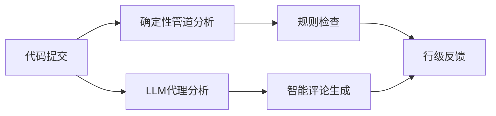

**技术特色**：
- 混合架构结合确定性与AI分析，提高审查准确率
- 支持多语言安全规则(NPE、线程安全、XSS、SQL注入等)
- 兼容OpenAI和Anthropic API，灵活集成AI能力

#### 热度分析

- 项目单日增长2,704个Star，表明近期热度极高，可能刚宣布重大更新
- 零Open Issues，显示项目维护良好，问题处理高效

#### 快速上手

```bash
# 克隆项目
git clone https://github.com/alibaba/open-code-review.git
cd open-code-review
# 安装依赖
go mod download
# 运行示例
./open-code-review --help
```

#### 注意事项

- 需要配置OpenAI或Anthropic API密钥以启用LLM功能
- 项目可能需要一定的Go语言环境配置经验
- 作为阿里巴巴内部工具开源，可能需要根据企业环境进行定制化配置


### 3. Tencent/BrowserSkill — AI浏览器自动化

> **一句话总结**：让AI代理通过CLI和扩展控制已登录浏览器，实现无缝网页操作与数据获取。

#### 价值主张

| 维度 | 说明 |
|------|------|
| **解决痛点** | 解决AI代理无法直接访问用户已登录浏览器会话的难题 |
| **目标用户** | 需要AI代理操作已登录网页的开发者与自动化工作者 |
| **核心亮点** | 无缝集成已登录状态 + 跨AI平台兼容 + 不干扰用户浏览 |

#### 技术架构

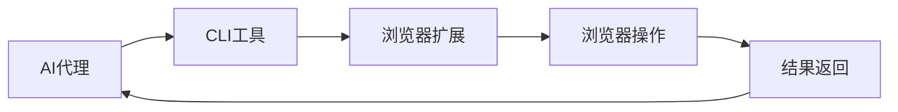

**技术特色**：
- TypeScript开发确保类型安全与代码质量
- 扩展与CLI通信机制实现浏览器底层交互
- 保持用户登录状态无需重复认证

#### 热度分析

- 单日Star增长超1300，项目热度呈爆发式增长
- Issues数量为0，表明项目文档完善或问题解决及时

#### 快速上手

```bash
# 安装CLI工具
npm install -g browserskill

# 连接已登录浏览器
browserskill connect

# 执行浏览器操作
browserskill open "https://example.com"
```

#### 注意事项

- 需要先安装对应的浏览器扩展并确保浏览器处于登录状态
- 项目License未知，使用前需确认授权条款
- 可能需要配置API密钥或认证信息以实现安全访问


### 4. affaan-m/ECC — AI性能优化

> **一句话总结**：为AI编程助手提供性能优化，提升代码生成效率与质量的系统。

#### 价值主张

| 维度 | 说明 |
|------|------|
| **解决痛点** | AI编程助手性能瓶颈，响应速度与代码质量不足 |
| **目标用户** | 使用AI编程工具的开发者与研究人员 |
| **核心亮点** | 多工具兼容性 + 记忆系统 + 安全性保障 + 研究驱动开发 |

#### 技术架构

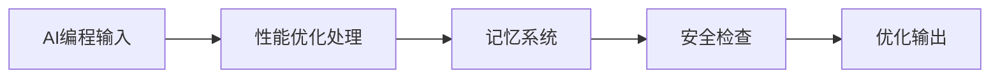

**技术特色**：
- 智能缓存机制提升响应速度
- 多模型协同处理提高代码质量
- 安全隔离环境保障代码安全

#### 热度分析

- 项目获得26万+星，日增近千，表明AI编程助手辅助工具需求旺盛
- 高Fork数反映社区积极参与，基于此进行二次开发与定制

#### 快速上手

```bash
# 克隆仓库
git clone https://github.com/affaan-m/ECC.git

# 安装依赖
npm install

# 启动服务
npm start
```

#### 注意事项

- 项目许可类型未知，使用前需确认开源协议
- 可能需要与特定的AI编程工具配合使用才能发挥最佳效果
- 由于项目描述较为简略，建议查看README获取更详细的使用说明


### 5. asciimoo/hister — 轻量级搜索引擎

> **一句话总结**：轻量级自建搜索引擎，支持本地文件和网站内容检索，注重隐私保护。

#### 价值主张

| 维度 | 说明 |
|------|------|
| **解决痛点** | 提供隐私友好、可定制的搜索解决方案，避免第三方数据收集 |
| **目标用户** | 注重隐私的开发者、研究人员、小型团队 |
| **核心亮点** | 轻量级 + 易部署 + Go语言实现 + 可扩展 + 支持多种数据源 |

#### 技术架构

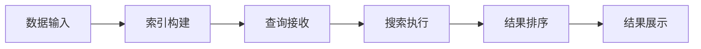

**技术特色**：
- 使用Go语言实现，具有高性能和并发优势
- 采用轻量级倒排索引结构，适合资源有限环境
- 支持增量索引更新，减少重建索引的时间成本

#### 热度分析

- 项目近期关注度激增，一日内增加889个星标，可能因新版本发布或技术热点引起
- 作为轻量级自建搜索引擎，在注重隐私保护的开发者群体中具有独特价值

#### 快速上手

```bash
# 克隆项目
git clone https://github.com/asciimoo/hister.git
# 进入目录
cd hister
# 运行（假设有可执行文件）
./hister
```

#### 注意事项

- 项目许可证信息未知，商业使用前需确认授权方式
- 可能需要额外配置才能支持某些特定的搜索功能或数据源


### 6. addyosmani/agent-skills — AI工程化

> **一句话总结**：为AI编码代理提供生产级工程技能，提升AI生成代码质量与实用性。

#### 价值主张

| 维度 | 说明 |
|------|------|
| **解决痛点** | AI生成代码缺乏工程规范，难以直接用于生产环境 |
| **目标用户** | AI编码工具开发者、AI辅助编程用户、工程团队 |
| **核心亮点** | + 工程最佳实践 + 代码质量标准 + 可集成性 + 可维护性 |

#### 技术架构


**技术特色**：
- 结合软件工程最佳实践指导AI代码生成
- 提供结构化代码质量评估与优化框架
- 支持多种编程语言和开发环境

#### 热度分析

- 项目Star数近10万，日增675+，反映AI工程化领域需求激增
- 高Fork数显示开发者社区对AI代码工程化的重视程度

#### 快速上手

```bash
# 克隆项目
git clone https://github.com/addyosmani/agent-skills.git

# 安装依赖
npm install
```

#### 注意事项
- 项目许可证未知，商业使用前需确认授权情况
- 需结合具体AI编码工具使用，独立功能有限
- 建议关注项目更新，AI工程实践标准持续演进


### 7. TencentCloud/Octop — 智能多代理助手

> **一句话总结**：自托管多用户多代理AI助手，提供个性化智能交互体验。

#### 价值主张

| 维度 | 说明 |
|------|------|
| **解决痛点** | 提供可自托管、保护数据隐私的多用户AI助手解决方案 |
| **目标用户** | 需要私有化部署AI助手的企业开发者和注重隐私的个人用户 |
| **核心亮点** | 多用户支持 + 多代理协作 + 自托管部署 + 数据隐私保护 + 可扩展架构 |

#### 技术架构

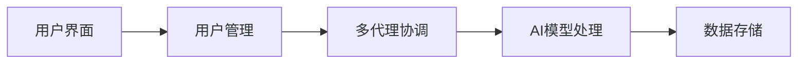

**技术特色**：
- 多代理协同工作架构设计
- 自托管部署方案确保数据安全
- 用户权限管理系统实现访问控制

#### 热度分析

- 项目近期增长迅猛，单日新增569个Star，显示社区高度关注
- Fork数相对较少(412)，可能表明项目处于早期阶段，用户更倾向直接使用

#### 快速上手

```bash
git clone https://github.com/TencentCloud/Octop.git
cd Octop
pip install -r requirements.txt
```

#### 注意事项

- 项目License信息未知，可能存在使用限制
- 作为自托管AI助手，用户需要自行配置AI模型
- 项目尚无公开的Issue，可能处于早期阶段，稳定性有待验证


### 8. coder/coder — 远程开发平台

> **一句话总结**：为开发者提供安全隔离的远程开发环境，支持容器化部署和代理连接。

#### 价值主张

| 维度 | 说明 |
|------|------|
| **解决痛点** | 解决开发环境不一致与安全隔离问题，实现远程安全开发 |
| **目标用户** | 分布式开发团队、远程工作者、需要标准化环境的组织 |
| **核心亮点** | + 环境完全隔离 + 安全代理连接 + 容器化部署 + 配置即代码 |

#### 技术架构

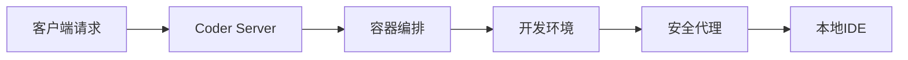

**技术特色**：
- 基于 Go 语言构建的高性能服务器端架构
- 利用容器技术实现开发环境隔离与标准化
- 通过代理机制保障远程连接的安全性与性能

#### 热度分析

- 项目 Star 数持续高增长，近期单日增长近 500，显示社区关注度极高
- Fork 数相对适中，表明项目更偏向使用而非二次开发，生态较为成熟

#### 快速上手

```bash
# 下载安装 Coder
curl -fsSL https://coder.com/install.sh | sh

# 创建新工作空间
coder create my-dev-env

# 连接到开发环境
coder connect my-dev-env
```

#### 注意事项

- 需要基本的容器技术知识才能有效配置和使用
- 网络配置可能需要额外调整以确保代理连接稳定性
- 安全高度依赖于正确配置，建议遵循官方安全最佳实践


### 9. anthropics/claude-code — AI编程助手

> **一句话总结**：Claude Code是终端内的AI编程助手，能理解代码库并通过自然语言执行编程任务。

#### 价值主张

| 维度 | 说明 |
|------|------|
| **解决痛点** | 简化复杂编程任务，减少重复性工作，提高开发效率 |
| **目标用户** | 专业开发者、软件工程师、需要提升编码效率的程序员 |
| **核心亮点** | 代码理解能力 + 自然语言交互 + 终端集成 + 自动化任务执行 + Git工作流处理 |

#### 技术架构


**技术特色**：
- 基于Claude大模型的代码理解与生成能力
- 终端集成设计，保持开发环境一致性
- 代码库上下文感知，提供精准编程建议

#### 热度分析

- 项目获得14.6万星，日增444星，增长速度稳定，显示开发者对其需求持续高涨
- 作为Anthropic官方项目，拥有强大的品牌背书和持续更新保障，在AI编程工具领域处于领先地位

#### 快速上手

```bash
# 安装Claude Code
npm install -g @anthropic-ai/claude-code

# 启动并使用
claude-code "帮我重构这个函数以提高性能"
```

#### 注意事项

- 需要有效的Anthropic API密钥才能使用
- 对于大型代码库，首次分析可能需要较长时间
- 建议在使用前备份重要代码，避免AI操作导致意外变更


### 10. anthropics/knowledge-work-plugins — 知识工作插件库

> **一句话总结**：Anthropic官方为Claude Cowork打造的知识工作者插件集，扩展AI协作能力。

#### 价值主张

| 维度 | 说明 |
|------|------|
| **解决痛点** | 为知识工作者提供专业插件，增强Claude在特定领域的应用能力 |
| **目标用户** | 知识工作者、研究人员、内容创作者、AI应用开发者 |
| **核心亮点** | 官方支持 + 模块化设计 + 领域专精 + 易于集成 + 可扩展架构 |

#### 技术架构

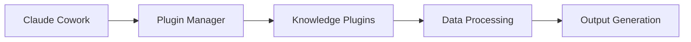

**技术特色**：
- 基于Python的模块化插件系统，便于功能扩展
- 标准化的插件接口，确保与Claude的无缝集成
- 优化的知识处理流程，提升专业领域应用效果

#### 热度分析

- 项目Star数接近2.5万，近期增长迅速，显示知识工作者对AI辅助工具的强烈需求
- 作为Anthropic官方项目，在Claude生态系统占据核心位置，社区参与度高

#### 快速上手

```bash
# 克隆项目仓库
git clone https://github.com/anthropics/knowledge-work-plugins.git

# 安装依赖
cd knowledge-work-plugins
pip install -r requirements.txt
```

#### 注意事项

- 插件需要与Claude Cowork环境配合使用，单独使用可能无法发挥全部功能
- 部分插件可能需要特定的API密钥或数据访问权限
- 定期更新以获取最新功能和性能优化


### 11. Fission-AI/OpenSpec — AI编码规范工具

> **一句话总结**：OpenSpec通过需求驱动开发方式，为AI编码助手提供标准化规范和最佳实践。

#### 价值主张

| 维度 | 说明 |
|------|------|
| **解决痛点** | 解决AI编码助手缺乏统一规范和最佳实践的问题 |
| **目标用户** | AI开发者、工具构建者和需要AI辅助编码的团队 |
| **核心亮点** | 需求驱动开发 + AI编码规范 + 标准化接口 + 最佳实践库 |

#### 技术架构


**技术特色**：
- 基于TypeScript的强类型规范定义
- 需求驱动的开发流程
- 可扩展的规范验证框架
- 自动化接口生成机制

#### 热度分析

- 项目获得近7万Star，显示其在AI编码规范领域有显著影响力
- 高Star增长率和低Issue数量表明项目维护质量高，社区反馈积极

#### 快速上手

```bash
# 安装OpenSpec
npm install @fission-ai/openspec

# 初始化项目
npx openspec init

# 应用规范
npx openspec apply
```

#### 注意事项

- 项目需要TypeScript环境支持
- 规范定义需要遵循项目提供的特定格式
- 与现有AI编码工具的集成可能需要额外配置


### 12. rustfs/rustfs — S3对象存储系统

> **一句话总结**：高性能S3兼容对象存储，支持与主流平台无缝集成，提供企业级数据存储解决方案。

#### 价值主张

| 维度 | 说明 |
|------|------|
| **解决痛点** | 企业需要一个高性能、S3兼容的对象存储解决方案，同时能够与现有存储平台无缝集成 |
| **目标用户** | 需要对象存储服务的企业、开发者和云服务提供商 |
| **核心亮点** | 高性能存储引擎 + S3完全兼容 + 多平台迁移支持 + 分布式架构 |

#### 技术架构

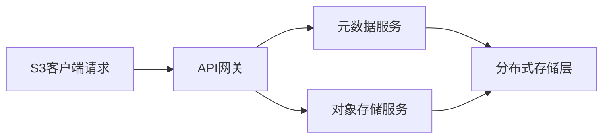

**技术特色**：
- 基于Rust语言实现的高性能并发存储系统
- 完全兼容S3 API，无需修改客户端代码
- 支持与MinIO和Ceph等平台共存和迁移

#### 热度分析

- 项目Star数持续增长，近期单日新增267，表明项目活跃度和认可度高
- Fork数1,483反映社区参与度强，开发者基于项目进行二次开发的意愿高

#### 快速上手

```bash
# 安装RustFS
cargo install rustfs

# 启动服务
rustfs server --address 0.0.0.0:9000 --console-address 0.0.0.0:9001

# 创建存储桶并上传文件
rustfs mb s3://mybucket
rustfs put myfile.txt s3://mybucket/
```

#### 注意事项

- 项目许可证未知，在使用前需要确认具体的开源许可证类型
- 作为对象存储系统，需要考虑数据安全性和持久性问题
- 大规模部署时需要合理规划存储节点和网络架构


### 13. ankitects/anki — 智能记忆助手

> **一句话总结**：基于间隔重复算法的智能闪卡系统，通过科学安排复习时间提升记忆效率。

#### 价值主张

| 维度 | 说明 |
|------|------|
| **解决痛点** | 解决传统学习中记忆效率低、遗忘快的问题，通过科学间隔优化记忆过程 |
| **目标用户** | 学生、语言学习者、专业人士等需要长期记忆大量知识的人群 |
| **核心亮点** | 间隔重复算法 + 多平台支持 + 插件扩展性 + 云同步功能 + 开源免费 |

#### 技术架构

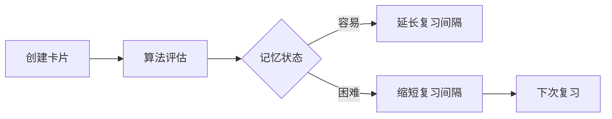

**技术特色**：
- 基于Rust重写，提供高性能和内存安全
- 采用间隔重复算法(SRS)优化记忆效率
- SQLite数据库存储卡片数据，保证数据持久性

#### 热度分析

- 项目获得31,219个Star，每日增长约174个，表明学习工具市场稳定需求旺盛
- 作为开源记忆工具的标杆，在教育和语言学习领域有重要生态地位

#### 快速上手

```bash
# 安装Anki
cargo install anki

# 启动Anki
anki
```

#### 注意事项

- Anki的学习曲线较陡峭，需要理解间隔重复原理才能有效使用
- 卡片创建质量直接影响学习效果，需要精心设计内容
- 云同步功能需要注册AnkiWeb账户
- 不同平台客户端可能存在功能差异


### 14. ahmedkhaleel2004/gitdiagram — GitHub可视化工具

> **一句话总结**：为GitHub仓库提供免费、简单、快速的交互式图表可视化工具。

#### 价值主张

| 维度 | 说明 |
|------|------|
| **解决痛点** | 解决GitHub仓库结构可视化困难问题 |
| **目标用户** | GitHub开发者、项目维护者和代码审查者 |
| **核心亮点** | 免费使用 + 简单易用 + 快速生成 + 交互式体验 |

#### 技术架构

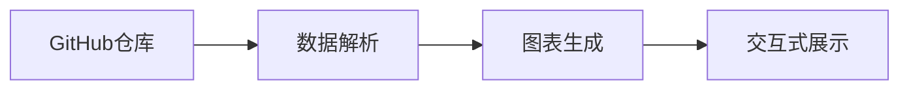

**技术特色**：
- 使用TypeScript开发，保证代码质量
- 支持交互式图表体验
- 轻量级，快速渲染

#### 热度分析

- 项目获得16,479个Star，且每日新增152个，表明项目受到广泛关注和持续增长
- 作为GitHub生态工具，满足开发者对代码可视化的刚需，社区活跃度高

#### 快速上手

```bash
# 在GitHub仓库中使用gitdiagram
# 访问仓库页面，添加 /diagram 到URL末尾
# 例如: https://github.com/user/repo/diagram
```

#### 注意事项

- 项目许可证未知，商业使用需谨慎
- 依赖GitHub API，可能受API限制影响


### 15. supermemoryai/supermemory — AI记忆引擎

> **一句话总结**：高性能本地化AI记忆与上下文引擎，为AI应用提供持久化记忆API支持。

#### 价值主张

| 维度 | 说明 |
|------|------|
| **解决痛点** | 解决AI应用缺乏持久化记忆和上下文连贯性问题 |
| **目标用户** | AI应用开发者、需要长期记忆功能的AI系统构建者 |
| **核心亮点** | 极速性能 + 完全本地化部署 + 可扩展架构 + AI时代记忆API |

#### 技术架构

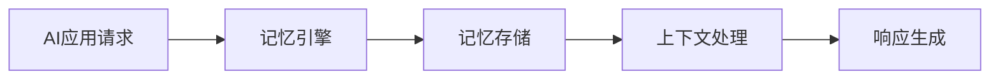

**技术特色**：
- 基于TypeScript构建，确保类型安全和开发效率
- 高性能内存处理机制，支持快速检索和更新
- 完全本地化部署方案，保障数据隐私和安全

#### 热度分析

- 项目获得30k+星标且持续增长，表明AI记忆领域需求旺盛
- 零未解决问题反映项目维护良好，社区活跃度高

#### 快速上手

```bash
# 克隆仓库
git clone https://github.com/supermemoryai/supermemory.git
cd supermemory

# 安装依赖并运行
npm install
npm run dev
```

#### 注意事项

- 项目许可证未知，使用前需确认授权条款
- 完全本地化部署可能需要较高的硬件资源
- 作为AI记忆引擎，可能需要与现有AI模型进行集成适配


### 16. supabase/supabase — Postgres 全栈平台

> **一句话总结**：开源 Postgres 数据库平台，提供实时数据库、认证和存储功能，简化应用开发流程。

#### 价值主张

| 维度 | 说明 |
|------|------|
| **解决痛点** | 简化数据库和后端服务搭建，降低全栈开发门槛 |
| **目标用户** | Web 和移动应用开发者、全栈工程师、初创团队 |
| **核心亮点** | 实时数据同步 + 内置认证系统 + 自动 API 生成 + Edge Functions + AI 功能集成 |

#### 技术架构


**技术特色**：
- 基于 PostgreSQL 的开源 Firebase 替代方案
- 提供 Row Level Security 实现细粒度数据访问控制
- 通过 PostgreSQL 扩展实现实时数据订阅功能

#### 热度分析

- 项目 Star 数超 11 万，近 120 日增，表明开发者社区认可度高且持续增长
- 作为 Firebase 开源替代方案，在开发者生态中占据重要位置，特别是对开源友好型项目

#### 快速上手

```bash
# 创建新项目
supabase new

# 启动本地开发环境
supabase start

# 生成客户端类型定义
supabase gen types typescript --local > types/database.types.ts
```

#### 注意事项

- Supabase 免费版有资源使用限制，生产环境需考虑付费计划
- 虽然提供类似 Firebase 的体验，但某些高级功能可能与 Firebase 存在差异，迁移时需注意兼容性


### 17. tradesdontlie/tradingview-mcp — AI图表自动化

> **一句话总结**：连接Claude AI与TradingView桌面，实现智能图表分析和交易工作流自动化。

#### 价值主张

| 维度 | 说明 |
|------|------|
| **解决痛点** | 交易者缺乏AI辅助的实时图表分析和工作流自动化工具 |
| **目标用户** | 交易者、金融分析师、量化交易爱好者 |
| **核心亮点** | AI辅助分析 + TradingView集成 + 工作流自动化 + 个人化定制 |

#### 技术架构

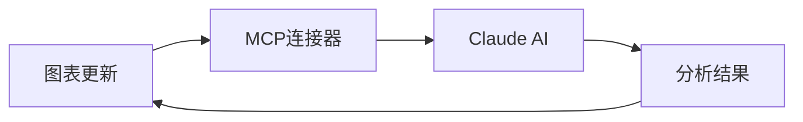

**技术特色**：
- 基于JavaScript的跨平台解决方案
- 通过MCP协议实现AI与TradingView的无缝连接
- 支持个人化工作流定制和扩展

#### 热度分析

- 项目获得6,481个Star且持续增长(+79 today)，表明交易AI工具有高需求
- Fork数达2,717，社区活跃度高，用户参与度高

#### 快速上手

```bash
# 克隆项目
git clone https://github.com/tradesdontlie/tradingview-mcp.git

# 安装依赖
npm install

# 配置Claude连接
npm run configure
```

#### 注意事项

- 项目需要Claude Code账户和TradingView Desktop
- 可能需要一定的编程知识进行个性化配置
- 项目许可证信息未知，使用前需确认开源许可条款


## 今日推荐

| 主题 | 推荐项目 | 亮点 |
|------|----------|------|
| 今日最热 | [cloudflare/security-audit-skill](https://github.com/cloudflare/security-audit-skill) | A coding-agent sk... |
| 值得关注 | [alibaba/open-code-review](https://github.com/alibaba/open-code-review) | Secure, fast, eff... |
| 快速上手 | [Tencent/BrowserSkill](https://github.com/Tencent/BrowserSkill) | Let AI agents use... |
| 长期潜力 | [affaan-m/ECC](https://github.com/affaan-m/ECC) | The agent harness... |

---

<div align="center">

*Generated on 2026-09-19 | Powered by GitHub Trending Reporter*

</div>