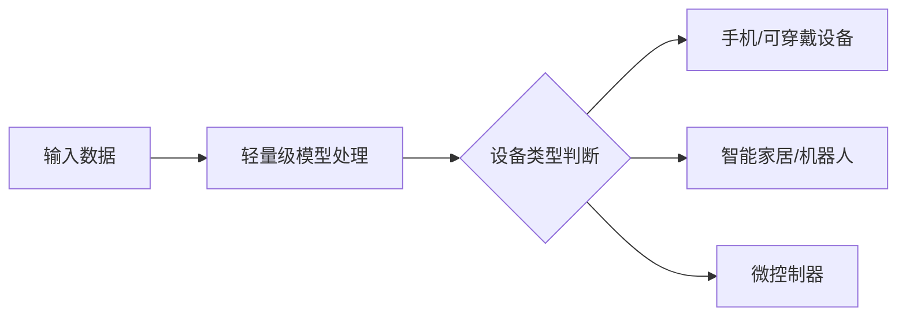

## 今日热点

AI编码助手与代理工具今日持续火爆，Anthropic的Claude Code领衔，安全审计与AI基础设施项目也备受关注，开发者生态正加速向AI原生转变。

---

## 热门项目一览

| 排名 | 项目 | 语言 | 今日 | 总计 | 简介 |
|:---:|------|:----:|------:|-----:|------|
| 1 | [cloudflare/security-audit-skill](https://github.com/cloudflare/security-audit-skill) | JavaScript | +3,155 | 16,515 | A coding-agent skill for mu... |
| 2 | [trycua/cua](https://github.com/trycua/cua) | HTML | +859 | 24,489 | Scale computer-use 2.0 with... |
| 3 | [addyosmani/agent-skills](https://github.com/addyosmani/agent-skills) | JavaScript | +556 | 97,092 | Production-grade engineerin... |
| 4 | [anthropics/claude-code](https://github.com/anthropics/claude-code) | TypeScript | +483 | 146,746 | Claude Code is an agentic c... |
| 5 | [Open-Dev-Society/OpenStock](https://github.com/Open-Dev-Society/OpenStock) | TypeScript | +472 | 16,118 | OpenStock is an open-source... |
| 6 | [asciimoo/hister](https://github.com/asciimoo/hister) | Go | +420 | 5,254 | Your own search engine |
| 7 | [coder/coder](https://github.com/coder/coder) | Go | +402 | 15,646 | Secure environments for dev... |
| 8 | [anthropics/knowledge-work-plugins](https://github.com/anthropics/knowledge-work-plugins) | Python | +281 | 25,151 | Open source repository of p... |
| 9 | [cactus-compute/needle](https://github.com/cactus-compute/needle) | Python | +234 | 11,630 | Automation foundation model... |
| 10 | [higgsfield-ai/higgsfield](https://github.com/higgsfield-ai/higgsfield) | Jupyter Notebook | +196 | 4,989 | Fault-tolerant, highly scal... |
| 11 | [docling-project/docling](https://github.com/docling-project/docling) | Python | +129 | 67,106 | Get your documents ready fo... |
| 12 | [ruanyf/weekly](https://github.com/ruanyf/weekly) | Unknown | +98 | 103,238 | 科技爱好者周刊，每周五发布 |

---

## 趋势洞察

```
┌─────────────────────────────────────────────────────────────────┐
│  AI/ML 工具         ████████████████████████  10 个项目        │
│  其他               █████████                 4 个项目        │
│  智能家居             ██                        1 个项目        │
└─────────────────────────────────────────────────────────────────┘
```

---

## 项目深度解读

### 1. cloudflare/security-audit-skill — 安全审计技能工具

> **一句话总结**：多阶段自动化安全审计工具，提供机器可读的独立验证安全发现结果

#### 价值主张

| 维度 | 说明 |
|------|------|
| **解决痛点** | 传统安全审计流程繁琐，缺乏标准化和机器可读性，难以自动化集成 |
| **目标用户** | 安全审计团队、DevOps工程师、开发安全负责人和合规检查人员 |
| **核心亮点** | 多阶段审计流程 + 独立验证机制 + 机器可读输出 + 自动化检测 + API集成友好 |

#### 技术架构


**技术特色**：
- 采用多阶段递进式安全分析方法，提高检测准确性
- 实现独立验证机制，确保审计结果可靠性和可重现性
- 输出标准化机器可读格式，便于自动化处理和集成

#### 热度分析

- 项目Star数高达16,515且单日激增3,155，反映安全领域对自动化审计工具的迫切需求
- Zero Open Issues表明项目成熟度高，已通过Cloudflare内部大规模生产环境验证

#### 快速上手

```bash
# 安装
npm install -g @cloudflare/security-audit-skill

# 基本使用
security-audit-skill --source ./codebase --output audit-report.json
```

#### 注意事项

- 项目许可证信息不明确，使用前需确认开源许可条款
- 可能需要配置特定环境或依赖项，建议查看项目文档了解详细要求
- 输出报告可能需要进一步处理才能与现有安全工作流集成
- 建议先在非生产环境测试，了解工具行为和输出格式后再全面部署


### 2. trycua/cua — 计算机使用规模化平台

> **一句话总结**：开源计算机使用规模化平台，提供跨OS驱动和基准测试，支持AI训练与数据生成。

#### 价值主张

| 维度 | 说明 |
|------|------|
| **解决痛点** | 解决计算机使用规模化、跨平台兼容性和自动化数据生成的挑战 |
| **目标用户** | AI研究人员、数据科学家和系统开发者 |
| **核心亮点** | 开源驱动程序+跨OS支持+基准测试系统+可扩展架构+数据生成工具 |

#### 技术架构


**技术特色**：
- 开源驱动程序实现跨平台兼容性
- 基准测试系统支持AI训练数据生成
- 分布式计算架构实现规模化使用

#### 热度分析

- 单日增长859 stars，24,489 total stars，表明项目热度极高且增长迅猛
- 0 open issues可能反映项目成熟度高或社区问题解决机制高效

#### 快速上手

```bash
# 克隆项目仓库
git clone https://github.com/trycua/cua.git

# 安装依赖并运行
cd cua && npm install && npm start
```

#### 注意事项

- 项目许可证未知，使用时需注意版权和许可问题
- 可能需要特定的硬件或软件环境支持才能充分发挥功能
- 项目处于持续开发中，API可能会有变化


### 3. addyosmani/agent-skills — AI编程技能

> **一句话总结**：为AI编码代理提供生产级工程技能，提升代码生成质量和工程规范性。

#### 价值主张

| 维度 | 说明 |
|------|------|
| **解决痛点** | 解决AI编程助手缺乏工程化规范的问题 |
| **目标用户** | AI开发者、编程助手用户、代码生成工具使用者 |
| **核心亮点** | 工程技能标准化 + 最佳实践库 + 代码质量提升 |

#### 技术架构


**技术特色**：
- 模块化工程技能设计，便于AI代理调用
- 标准化的代码生成流程与规范
- 持续更新的最佳实践库与指导

#### 热度分析

- 超过97K星标，显示该项目在AI编程领域获得高度认可
- Fork比例合理，表明项目被广泛使用和二次开发

#### 快速上手

```bash
# 安装项目依赖
npm install agent-skills

# 初始化技能配置
npx agent-skills init

# 应用技能到当前目录
npx agent-skills apply
```

#### 注意事项

- 项目许可证未知，使用前需确认授权条款
- 需配合AI编码工具使用，单独使用可能效果有限
- 工程技能库需定期更新以保持与最新技术趋势同步


### 4. anthropics/claude-code — 智能终端编程助手

> **一句话总结**：Claude Code是Anthropic开发的终端内AI编程助手，能理解代码库并执行自然语言编程指令。

#### 价值主张

| 维度 | 说明 |
|------|------|
| **解决痛点** | 减少开发者重复编码工作，提高代码理解和维护效率 |
| **目标用户** | 开发者、程序员、代码审查人员 |
| **核心亮点** | 自然语言交互 + 代码库理解 + 终端集成 + 任务自动化 + Git工作流处理 |

#### 技术架构


**技术特色**：
- 基于Claude AI模型的代码理解能力
- 集成终端环境，无缝开发体验
- 支持复杂代码库的上下文理解

#### 热度分析

- 项目星数超过14.6万，近期每日新增近500星，增长势头强劲
- 作为Anthropic官方项目，在AI编程助手领域处于领先地位，社区活跃度高

#### 快速上手

```bash
# 安装Claude Code
npm install -g @anthropic-ai/claude-code

# 初始化项目
claude-code init

# 开始使用
claude-code "解释这个函数的作用"
```

#### 注意事项

- 需要Anthropic API密钥才能使用
- 对大型代码库的理解可能需要配置上下文窗口
- 自然语言指令需要清晰明确以获得最佳结果


### 5. Open-Dev-Society/OpenStock — 开源股市分析

> **一句话总结**：开源免费股市分析平台，提供实时价格跟踪、个性化警报和公司洞察，永久免费使用。

#### 价值主张

| 维度 | 说明 |
|------|------|
| **解决痛点** | 解决传统股市平台昂贵封闭问题，提供免费透明的市场数据分析 |
| **目标用户** | 个人投资者、股票交易爱好者、金融分析师和研究机构 |
| **核心亮点** | 实时价格跟踪 + 个性化警报 + 详细公司洞察 + 开源透明 + 永久免费 |

#### 技术架构


**技术特色**：
- TypeScript全栈开发，确保代码质量和类型安全
- 实时数据流处理技术，提供即时市场更新
- 开源架构设计，支持社区贡献和透明开发流程

#### 热度分析

- Star数突破16k，单日新增472，表明市场对开源金融工具的强烈需求
- Fork数2092，显示项目具有较高二次开发价值，社区活跃度高

#### 快速上手

```bash
# 克隆项目
git clone https://github.com/Open-Dev-Society/OpenStock.git

# 安装依赖
cd OpenStock
npm install

# 启动开发服务器
npm run dev
```

#### 注意事项

- 项目许可证信息不明确，使用前需确认开源协议
- Issues数量为0，可能处于早期阶段或问题通过其他渠道处理
- 作为金融数据平台，需注意数据来源的合法性和准确性


### 6. asciimoo/hister — [轻量级搜索引擎]

> **一句话总结**：基于Go语言开发的轻量级自托管搜索引擎，快速构建私有搜索系统。

#### 价值主张

| 维度 | 说明 |
|------|------|
| **解决痛点** | 解决个人或小团队自建搜索引擎无需依赖第三方服务的问题 |
| **目标用户** | 中小型网站所有者、开发者、需要私有搜索解决方案的组织 |
| **核心亮点** | 自托管部署 + 简单配置 + 轻量级设计 |

#### 技术架构


**技术特色**：
- 基于Go语言开发，性能高效且资源占用低
- 支持自定义索引和搜索算法，适应不同场景
- 提供简洁的API接口，便于集成到现有系统

#### 热度分析

- 项目获得5,254个Star，今日新增420个，表明项目热度快速上升
- Fork数相对较少(220)，说明项目可能处于早期阶段，社区贡献尚未大规模展开

#### 快速上手

```bash
# 克隆项目
git clone https://github.com/asciimoo/hister.git
cd hister

# 安装依赖并运行
go mod download
go run main.go
```

#### 注意事项

- 项目许可证未知，使用前需确认授权条款
- Open Issues为0，可能表示项目尚不成熟或问题管理不完善
- 需要一定的Go语言知识才能正确配置和使用


### 7. coder/coder — 开发者环境平台

> **一句话总结**：为开发者提供安全、可配置的远程开发环境，支持多代理协作。

#### 价值主张

| 维度 | 说明 |
|------|------|
| **解决痛点** | 解决开发环境不一致、安全性和远程访问问题 |
| **目标用户** | 远程团队、DevOps工程师、需要统一开发环境的组织 |
| **核心亮点** | 安全隔离 + 环境配置即代码 + 多代理协作 + 可扩展架构 |

#### 技术架构


**技术特色**：
- 基于 Go 语言开发，性能高效且并发处理能力强
- 容器化技术提供安全隔离的开发环境
- 环境配置即代码，便于版本控制和团队共享

#### 热度分析

- 项目获得超过15k Star，近期增长迅速，表明开发者社区对远程开发环境解决方案需求旺盛
- Fork 数相对适中，说明项目可能更倾向于由核心团队维护，而非社区广泛贡献

#### 快速上手

```bash
# 安装 Coder
go install github.com/coder/coder@latest

# 启动 Coder 服务器
coder server

# 通过 CLI 连接到开发环境
coder create my-workspace
```

#### 注意事项

- 项目许可证信息不明确，在使用前需确认开源许可条款
- 由于项目 Open Issues 为 0，可能表示项目处于早期阶段或问题管理方式不同
- 需要了解具体的安全模型，确保符合组织的安全要求


### 8. anthropics/knowledge-work-plugins — AI知识工作插件库

> **一句话总结**：Anthropic开源的Claude Cowork知识工作插件库，提升知识工作者生产力。

#### 价值主张

| 维度 | 说明 |
|------|------|
| **解决痛点** | 知识工作者在Claude平台缺乏专业工具支持，工作流程效率低下 |
| **目标用户** | 使用Claude Cowork平台的知识工作者、研究人员和内容创作者 |
| **核心亮点** | 多领域专业插件支持 + 与Claude深度集成 + 开源可扩展 |

#### 技术架构

**技术特色**：
- 基于Python构建的模块化插件系统
- 与Claude API无缝集成架构
- 插件间可协同工作的设计模式

#### 热度分析

- 项目获得25,151个Star，近期增长迅速（今日+281），社区关注度极高
- 作为Anthropic官方项目，在AI助手工具生态中占据核心位置

#### 快速上手

```bash
# 克隆仓库
git clone https://github.com/anthropics/knowledge-work-plugins.git
# 安装依赖
pip install -r requirements.txt
# 启动插件系统
python -m cowork.plugins
```

#### 注意事项
- 需要Anthropic API访问权限才能正常使用
- 插件可能需要特定版本Claude支持
- 开源协议未明确，使用前需确认许可条款


### 9. cactus-compute/needle — 轻量级设备模型

> **一句话总结**：专为资源受限设备设计的超轻量级AI模型，支持工具调用与结构化提取。

#### 价值主张

| 维度 | 说明 |
|------|------|
| **解决痛点** | 解决小型设备上运行大型AI模型的资源限制问题 |
| **目标用户** | IoT开发者、嵌入式系统工程师、移动应用开发者 |
| **核心亮点** | 极小体积 + 低资源消耗 + 多设备兼容 + 工具调用能力 |

#### 技术架构



**技术特色**：
- 采用2位量化技术大幅减小模型体积
- 针对边缘设备优化的高效推理引擎
- 支持工具调用与结构化提取功能

#### 热度分析

- 项目获得11630个Star且持续增长，表明在边缘AI领域有较高关注度
- 相对较高的Star/Fork比例(15.65:1)反映项目质量高且用户参与度良好

#### 快速上手

```bash
# 安装needle
pip install needle-ai

# 运行模型示例
python -m needle.run --model tiny --task extraction
```

#### 注意事项

- 模型精度可能受限于极小的体积和量化级别
- 不同设备上的性能表现可能有显著差异
- 工具调用能力可能受限于模型大小


### 10. higgsfield-ai/higgsfield — 大规模GPU训练框架

> **一句话总结**：专为万亿参数模型设计的容错、高可扩展GPU编排与机器学习框架。

#### 价值主张

| 维度 | 说明 |
|------|------|
| **解决痛点** | 解决大规模模型训练中的GPU资源调度与系统容错问题 |
| **目标用户** | 大规模模型研究团队与AI基础设施工程师 |
| **核心亮点** | 万亿参数训练支持 + GPU高效编排 + 容错机制 + 高可扩展性 |

#### 技术架构


**技术特色**：
- 基于Jupyter Notebook的交互式开发环境
- 支持千亿至万亿参数模型的分布式训练
- 自动化的GPU资源调度与负载均衡
- 高效的容错机制和故障恢复能力

#### 热度分析
- 项目近5K stars且增长迅速，显示社区对大规模训练解决方案的高度关注
- 高fork比例表明项目在实际部署中具有良好的实用价值

#### 快速上手
```bash
git clone https://github.com/higgsfield-ai/higgsfield.git
cd higgsfield
pip install -r requirements.txt
jupyter notebook examples/
```

#### 注意事项
- 项目许可证未知，使用前需确认授权条款
- 需要大规模GPU集群支持，硬件门槛较高
- 主要面向超大规模模型训练，中小规模项目可能过于复杂


### 11. docling-project/docling — 文档AI化工具

> **一句话总结**：将各类文档结构化转换，使其适配生成式AI模型的输入需求，提升AI处理文档的效率。

#### 价值主张

| 维度 | 说明 |
|------|------|
| **解决痛点** | 解决文档格式多样、结构不统一导致AI模型难以直接处理的问题 |
| **目标用户** | AI开发者、数据科学家和文档处理工程师 |
| **核心亮点** | 多格式文档支持 + 结构化输出 + AI模型适配 + 高效处理 |

#### 技术架构


**技术特色**：
- 统一文档解析接口，支持多种格式
- 智能内容提取与结构化处理
- 输出适配多种AI模型的格式要求

#### 热度分析

- 项目Star数高增长，社区活跃度高，表明文档AI化需求旺盛
- 项目维护活跃，问题解决高效，处于文档处理AI化前沿位置

#### 快速上手

```bash
# 安装docling
pip install docling

# 使用docling处理文档
docling input.pdf --output structured_output.json
```

#### 注意事项

- 确保文档内容符合使用条款，避免处理敏感或受版权保护的内容
- 注意不同文档格式的处理效果可能存在差异


### 12. ruanyf/weekly — 科技资讯周刊

> **一句话总结**：高质量科技资讯周刊，每周精选技术文章，帮助开发者把握行业动态。

#### 价值主张

| 维度 | 说明 |
|------|------|
| **解决痛点** | 解决开发者信息过载问题，提供精炼高质量的技术资讯 |
| **目标用户** | 技术爱好者、开发者和IT行业从业者 |
| **核心亮点** | 内容精选 + 定时更新 + 分类清晰 + 来源广泛 + 编辑专业 |

#### 技术架构


**技术特色**：
- 内容自动聚合与人工筛选相结合
- 定时发布机制确保每周五准时更新
- 多渠道分发策略扩大内容影响力

#### 热度分析
- 项目获得超过10万星，周均增长近百星，显示极高用户认可度和行业影响力
- 社区活跃度高，已成为技术圈重要信息源和行业风向标

#### 快速上手

```bash
# 克隆项目到本地
git clone https://github.com/ruanyf/weekly.git

# 浏览本周内容
cd weekly && cat README.md
```

#### 注意事项
- 作为周刊项目，内容时效性非常重要，需关注最新科技动态
- 贡献内容时应确保信息准确、来源可靠，避免误导读者
- 尊重原创，转载内容需注明出处，维护良好的技术社区环境


### 13. ZuodaoTech/everyone-can-use-english — 英语学习平台

> **一句话总结**：通过游戏化和结构化方法，让英语学习变得轻松有趣且高效

#### 价值主张

| 维度 | 说明 |
|------|------|
| **解决痛点** | 传统英语学习枯燥乏味，缺乏持续动力和应用场景 |
| **目标用户** | 中国英语学习者，特别是希望提升实用能力的用户 |
| **核心亮点** | 游戏化学习 + 实用场景训练 + 进度可视化 + 社区互动 + AI辅助 |

#### 技术架构


**技术特色**：
- 使用TypeScript确保代码质量和类型安全
- 采用模块化设计，便于功能扩展和维护
- 可能利用AI技术提供个性化学习路径

#### 热度分析

- 项目Star数接近4万，且每日有稳定增长，表明在英语学习领域有较高认可度
- 零OpenIssues反映项目维护状态良好，问题解决及时

#### 快速上手

```bash
# 克隆项目
git clone https://github.com/ZuodaoTech/everyone-can-use-english.git

# 安装依赖
npm install

# 启动开发服务器
npm run dev
```

#### 注意事项

- 项目许可证未知，商业使用前需确认授权方式
- 项目可能需要一定的英语基础才能充分利用


### 14. yynxxxxx/Codex-X — AI代码助手管理工具

> **一句话总结**：OpenAI Codex的可视化管理工具，提供API切换、会话同步和提示词注入功能。

#### 价值主张

| 维度 | 说明 |
|------|------|
| **解决痛点** | 简化OpenAI Codex的配置与管理，提供一站式操作体验 |
| **目标用户** | 使用OpenAI Codex的开发者和研究人员 |
| **核心亮点** | 多API管理 + 会话同步 + 提示词注入 + TOML可视化配置 |

#### 技术架构


**技术特色**：
- Rust构建的高性能跨平台应用
- 提供TOML配置文件的可视化管理
- 实现多API Provider无缝切换功能

#### 热度分析

- 项目获得3418个Star，近期增长稳定，表明社区认可度高
- Fork数450，表明项目有一定二次开发价值，但社区生态尚未形成规模

#### 快速上手

```bash
# 克隆仓库
git clone https://github.com/yynxxxxx/Codex-X.git
# 构建项目
cargo build --release
```

#### 注意事项

- 项目许可证未知，商业使用前需确认授权情况
- 项目目前没有开放的Issues，可能意味着项目仍在开发初期或问题通过其他渠道解决


### 15. cloudflare/quiche — 高性能 QUIC 实现

> **一句话总结**：Cloudflare 开发的 Rust 实现的 QUIC 协议栈，支持 HTTP/3，提供高效低延迟的网络通信。

#### 价值主张

| 维度 | 说明 |
|------|------|
| **解决痛点** | QUIC 协议实现稀缺，HTTP/3 生态不完善，低延迟通信需求难以满足 |
| **目标用户** | 网络服务提供商、浏览器开发者、需要高性能网络通信的应用开发者 |
| **核心亮点** | 完整 QUIC 协议实现 + HTTP/3 支持 + Rust 高性能 + 云原生设计 + 广泛兼容性 |

#### 技术架构


**技术特色**：
- 基于 Rust 内存安全模型，提供高性能网络通信
- 完整实现 QUIC 协议所有核心特性
- 零拷贝设计，最大化网络吞吐量
- 与 Cloudflare 生产环境深度验证的稳定性
- 支持 IETF QUIC 标准和 HTTP/3 规范

#### 热度分析

- 项目 Star 数超过 12,000，每天新增约 31 个 Star，显示持续的高关注度
- 作为网络基础设施核心组件，在云原生和边缘计算领域具有重要生态地位

#### 快速上手

```bash
# 安装依赖
cargo install cargo-c

# 克隆项目
git clone https://github.com/cloudflare/quiche
cd quiche

# 构建项目
cargo build --release
```

#### 注意事项

- 项目依赖 Rust 1.57 或更高版本
- 需要确保系统支持 UDP 套接字操作
- 在生产环境中使用前建议进行全面测试
- 项目文档相对简略，可能需要深入阅读源码


## 今日推荐

| 主题 | 推荐项目 | 亮点 |
|------|----------|------|
| 今日最热 | [cloudflare/security-audit-skill](https://github.com/cloudflare/security-audit-skill) | A coding-agent sk... |
| 值得关注 | [trycua/cua](https://github.com/trycua/cua) | Scale computer-us... |
| 快速上手 | [addyosmani/agent-skills](https://github.com/addyosmani/agent-skills) | Production-grade ... |
| 长期潜力 | [anthropics/claude-code](https://github.com/anthropics/claude-code) | Claude Code is an... |

---

<div align="center">

*Generated on 2026-09-20 | Powered by GitHub Trending Reporter*

</div>