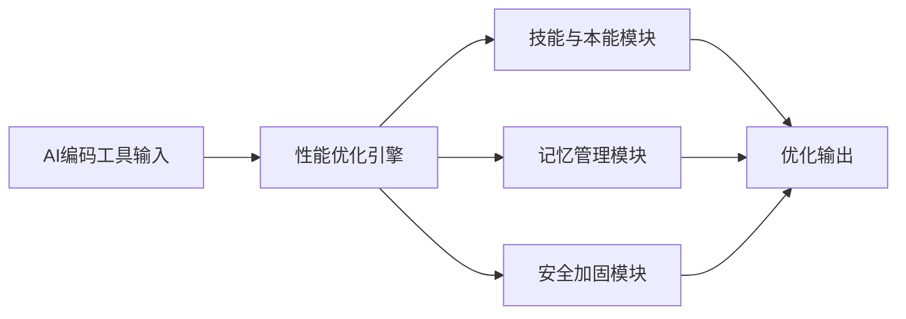

## 今日热点

今日GitHub热榜项目精彩纷呈。

---

## 热门项目一览

| 排名 | 项目 | 语言 | 今日 | 总计 | 简介 |
|:---:|------|:----:|------:|-----:|------|
| 1 | [cloudflare/security-audit-skill](https://github.com/cloudflare/security-audit-skill) | JavaScript | +2,428 | 18,121 | A coding-agent skill for mu... |
| 2 | [trycua/cua](https://github.com/trycua/cua) | HTML | +1,018 | 25,201 | Scale computer-use 2.0 with... |
| 3 | [affaan-m/ECC](https://github.com/affaan-m/ECC) | JavaScript | +826 | 263,826 | The agent harness performan... |
| 4 | [Open-Dev-Society/OpenStock](https://github.com/Open-Dev-Society/OpenStock) | TypeScript | +755 | 16,895 | OpenStock is an open-source... |
| 5 | [addyosmani/agent-skills](https://github.com/addyosmani/agent-skills) | JavaScript | +736 | 97,740 | Production-grade engineerin... |
| 6 | [higgsfield-ai/higgsfield](https://github.com/higgsfield-ai/higgsfield) | Jupyter Notebook | +465 | 5,411 | Fault-tolerant, highly scal... |
| 7 | [anthropics/claude-code](https://github.com/anthropics/claude-code) | TypeScript | +419 | 147,172 | Claude Code is an agentic c... |
| 8 | [coder/coder](https://github.com/coder/coder) | Go | +379 | 16,085 | Secure environments for dev... |
| 9 | [vercel-labs/json-render](https://github.com/vercel-labs/json-render) | TypeScript | +291 | 17,378 | The Generative UI framework |
| 10 | [anthropics/financial-services](https://github.com/anthropics/financial-services) | Python | +260 | 35,407 | No description |
| 11 | [mihail911/modern-software-dev-assignments](https://github.com/mihail911/modern-software-dev-assignments) | Python | +172 | 4,583 | Assignments for CS146S: The... |
| 12 | [BuilderIO/agent-native](https://github.com/BuilderIO/agent-native) | TypeScript | +98 | 5,268 | A framework for building ag... |

---

## 趋势洞察

```
┌─────────────────────────────────────────────────────────────────┐
│  AI/ML 工具         ████████████████████████  10 个项目        │
│  开发框架             ██                        1 个项目        │
│  项目管理             ██                        1 个项目        │
│  其他               ██                        1 个项目        │
└─────────────────────────────────────────────────────────────────┘
```

---

## 项目深度解读

### 1. cloudflare/security-audit-skill — 安全审计工具

> **一句话总结**：提供多阶段安全审计能力的编码代理技能，生成独立验证的机器可读安全发现。

#### 价值主张

| 维度 | 说明 |
|------|------|
| **解决痛点** | 将复杂安全审计流程标准化，提供可验证的机器可读安全发现 |
| **目标用户** | 安全审计人员、开发团队和DevOps工程师 |
| **核心亮点** | 多阶段审计流程 + 机器可读发现 + 独立验证 + 自动化报告生成 |

#### 技术架构


**技术特色**：
- 基于JavaScript实现，易于集成到现有开发环境
- 多阶段审计流程，确保全面的安全评估
- 生成机器可读的安全发现结果，便于自动化处理

#### 热度分析

- 项目获得超过18k星，单日增长2.4k星，表明社区高度认可和安全审计领域的强烈需求
- 零开放问题反映了项目成熟度高，维护团队响应迅速，用户社区参与度高

#### 快速上手

```bash
# 安装项目
npm install -g security-audit-skill

# 初始化安全审计
security-audit-skill init --project-path ./my-project

# 执行安全审计
security-audit-skill audit --phase all
```

#### 注意事项

- 需要配合其他安全审计工具使用，提供互补的安全分析能力
- 生成的安全发现需要专业人员进一步验证，不能完全替代人工安全审查


### 2. trycua/cua — 计算机扩展平台

> **一句话总结**：开源驱动支持的跨平台计算机使用扩展解决方案，提供训练、评估和数据生成的基准测试。

#### 价值主张

| 维度 | 说明 |
|------|------|
| **解决痛点** | 解决计算机使用扩展的标准化和跨平台兼容性问题 |
| **目标用户** | AI研究人员、开发者和需要大规模计算机使用数据的企业 |
| **核心亮点** | 开源驱动程序 + 跨操作系统支持 + 训练评估基准 |

#### 技术架构


**技术特色**：
- 基于Web的跨平台计算机使用扩展系统
- 开源驱动程序支持多种操作系统
- 提供标准化的数据生成和评估基准

#### 热度分析

- 项目获得25,201个星标，近期增长迅速(+1,018 today)，表明社区对其高度关注和认可
- 无开放问题，表明项目维护良好，处于稳定发展阶段，在AI训练数据生成领域具有较强影响力

#### 快速上手

```bash
# 访问项目主页获取详细安装指南
git clone https://github.com/trycua/cua.git
cd cua && npm install
```

#### 注意事项

- 项目许可证未知，使用前需确认授权条款
- 主要基于HTML，可能需要其他技术栈支持完整功能
- 需要评估驱动程序与目标操作系统的兼容性


### 3. affaan-m/ECC — AI编码性能优化系统

> **一句话总结**：为多个AI编码工具提供性能优化，提升代码生成效率与安全性。

#### 价值主张

| 维度 | 说明 |
|------|------|
| **解决痛点** | AI代码助手性能瓶颈与安全漏洞问题 |
| **目标用户** | 使用Claude Code、Codex、Cursor等AI编码工具的开发者 |
| **核心亮点** | 技能优化 + 本能增强 + 记忆管理 + 安全加固 + 研究驱动开发 |

#### 技术架构



**技术特色**：
- 基于JavaScript实现的轻量级性能优化系统
- 模块化设计支持多种AI编码工具
- 研究优先的持续优化机制

#### 热度分析

- 高Star增长率表明项目在AI编码辅助领域受到广泛关注
- 稳定的高Fork数反映开发者社区活跃参与和二次开发需求

#### 快速上手

```bash
git clone https://github.com/affaan-m/ECC.git
cd ECC
npm install
npm start
```

#### 注意事项

- 项目许可证未知，使用前需确认授权条款
- 零Open Issues可能表示项目已成熟或问题管理方式特殊
- 使用前需确认兼容目标AI编码工具的版本要求


### 4. Open-Dev-Society/OpenStock — 开源股票平台

> **一句话总结**：免费开源股票市场分析工具，提供实时价格跟踪、个性化警报和公司洞察。

#### 价值主张

| 维度 | 说明 |
|------|------|
| **解决痛点** | 替代昂贵金融数据平台，提供免费股票市场分析工具 |
| **目标用户** | 个人投资者、金融分析师、股票交易爱好者 |
| **核心亮点** | 实时价格跟踪 + 个性化警报 + 公司深度洞察 + 开源透明 + 永久免费 |

#### 技术架构


**技术特色**：
- 使用TypeScript构建，提供类型安全的金融数据处理
- 采用模块化架构，便于扩展和维护
- 实时数据流处理，确保价格信息及时更新

#### 热度分析

- 项目获得近1.7万星，近期增长迅速，显示市场对开源金融工具的强烈需求
- 零开放问题表明项目维护良好，社区可能通过其他渠道交流和支持

#### 快速上手

```bash
# 克隆仓库
git clone https://github.com/Open-Dev-Society/OpenStock.git

# 安装依赖
npm install

# 启动开发服务器
npm run dev
```

#### 注意事项

- 项目使用未知许可证，在使用前应确认具体开源许可条款
- 作为金融数据平台，用户应注意数据准确性和延迟问题
- 开源项目可能依赖第三方数据源，需关注数据服务的可用性和稳定性


### 5. addyosmani/agent-skills — AI工程技能库

> **一句话总结**：为AI编程代理提供生产级工程技能的JavaScript知识库与实现框架。

#### 价值主张

| 维度 | 说明 |
|------|------|
| **解决痛点** | 解决AI代理在实际开发中缺乏工程化技能和最佳实践的问题 |
| **目标用户** | AI编程工具开发者、AI辅助编程系统构建者、AI研究员 |
| **核心亮点** | 工程级实现 + 模块化设计 + 最佳实践集合 + 可扩展架构 |

#### 技术架构


**技术特色**：
- 基于JavaScript的模块化技能实现架构
- 集成多种工程化最佳实践和模式
- 提供可扩展的技能注册和调用机制

#### 热度分析

- 项目获得近10万星标，日增700+，显示AI编程代理领域需求旺盛
- 高Fork/Star比例(10.5%)，表明社区积极参与定制和二次开发

#### 快速上手

```bash
# 克隆项目
git clone https://github.com/addyosmani/agent-skills.git

# 安装依赖
npm install
```

#### 注意事项

- 需要Node.js环境支持
- 建议先阅读项目文档了解技能模块结构
- 使用时需根据具体场景选择合适的技能组合


### 6. higgsfield-ai/higgsfield — 超大规模GPU编排

> **一句话总结**：提供容错性强、高度可扩展的GPU编排能力，支持训练千亿至万亿参数规模的AI模型。

#### 价值主张

| 维度 | 说明 |
|------|------|
| **解决痛点** | 大规模模型训练中GPU资源高效利用与容错难题 |
| **目标用户** | 需要训练超大规模AI模型的研究机构和企业 |
| **核心亮点** | 容错机制 + 高度可扩展 + GPU智能编排 + 超大规模支持 |

#### 技术架构


**技术特色**：
- 分布式GPU资源智能调度技术
- 高效的容错与故障恢复机制
- 支持千亿至万亿参数规模的模型训练

#### 热度分析

- 项目Star数5,411且单日增长465，热度快速上升，表明业界对超大规模模型训练需求强烈
- Fork数958，显示社区活跃度高，处于超大规模AI训练工具生态的重要位置

#### 快速上手

```bash
# 安装Higgsfield
pip install higgsfield

# 启动GPU编排服务
higgsfield orchestrate --config cluster.yaml

# 提交训练任务
higgsfield train --model resnet --params 1t --gpus 128
```

#### 注意事项

- 需要大规模GPU集群支持，硬件门槛较高
- 项目许可证信息不明确，使用前需确认授权条款
- 可能需要专业的分布式系统知识才能充分利用其功能


### 7. anthropics/claude-code — 终端编程助手

> **一句话总结**：Claude Code 是一款基于大模型的终端内 AI 编程助手，通过自然语言理解代码库并自动化执行编程任务。

#### 价值主张

| 维度 | 说明 |
|------|------|
| **解决痛点** | 解决开发者重复编码、复杂代码理解和 Git 工作流繁琐的效率问题 |
| **目标用户** | 软件开发人员、DevOps 工程师、技术团队和全栈开发者 |
| **核心亮点** | 终端内直接运行 + 自然语言交互 + 代码库理解能力 + 自动化执行 + Git 工作流集成 |

#### 技术架构


**技术特色**：
- 基于 Claude 大语言模型的代码理解与生成能力
- 终端环境直接集成，无需额外 IDE 插件
- 能够分析整个代码库上下文，提供精准代码建议

#### 热度分析

- 项目拥有超14.7万星，日增419星，处于快速增长阶段，开发者认可度高
- Fork 数达2.4万，社区活跃度强，表明项目有广泛的二次开发和使用场景

#### 快速上手

```bash
# 安装 Claude Code
npm install -g @anthropic-ai/claude-code

# 初始化并开始使用
claude-code init
claude-code "解释这个函数的功能"
```

#### 注意事项

- 项目需要 Anthropic API 密钥才能使用完整功能
- 代码库结构清晰度会影响 Claude Code 的理解效果
- 项目仍在积极开发中，API 可能会有变动，需关注更新日志


### 8. coder/coder — 开发环境平台

> **一句话总结**：为开发者提供安全可控的远程开发环境，支持多代理协作和精细权限管理

#### 价值主张

| 维度 | 说明 |
|------|------|
| **解决痛点** | 解决开发者环境安全隔离和远程访问问题，提供一致的开发体验 |
| **目标用户** | 需要安全远程开发环境的企业开发团队和DevOps工程师 |
| **核心亮点** | 环境隔离 + 多代理支持 + 细粒度权限控制 + 资源管理 + 安全审计 |

#### 技术架构

```mermaid
graph LR
    A[客户端]


### 9. vercel-labs/json-render — JSON UI生成器

> **一句话总结**：通过JSON配置生成动态UI界面，简化前端开发流程，提升开发效率。

#### 价值主张

| 维度 | 说明 |
|------|------|
| **解决痛点** | 减少重复UI编码，通过声明式JSON快速构建复杂界面 |
| **目标用户** | 前端开发者、UI设计师、低代码平台构建者 |
| **核心亮点** | JSON驱动UI生成 + 组件化设计 + 类型安全 + 高性能渲染 + 开箱即用 |

#### 技术架构

```mermaid
graph LR
    A[JSON配置] --> B[解析与验证]
    B --> C[组件映射]
    C --> D[UI渲染]
    D --> E[交互反馈]
```

**技术特色**：
- 基于TypeScript的全链路类型安全保障
- 高效的JSON到UI组件转换机制
- 与Vercel生态系统无缝集成

#### 热度分析

- 项目Star数达17,378且持续增长(+291/天)，表明开发者认可度高
- 作为Vercel实验室项目，在低代码和生成式UI领域具有领先地位

#### 快速上手

```bash
# 安装json-render
npm install @vercel/json-render

# 创建简单配置文件
echo '{"component":"Button","children":"Click me"}' > config.json

# 渲染UI组件
npx json-render config.json
```

#### 注意事项

- 作为实验性项目，API可能存在不稳定性
- 需要学习特定的JSON配置规范，有一定学习成本
- 复杂交互逻辑可能需要结合传统前端开发方式


### 10. anthropics/financial-services — 金融AI助手

> **一句话总结**：AI驱动的金融分析工具集，提供市场预测、风险评估和投资决策支持。

#### 价值主张

| 维度 | 说明 |
|------|------|
| **解决痛点** | 金融数据处理效率低、专业门槛高、决策风险大 |
| **目标用户** | 金融机构分析师、量化交易员、投资顾问 |
| **核心亮点** | 自然语言金融分析 + 实时市场数据整合 + 风险预测模型 |

#### 技术架构


**技术特色**：
- 基于大语言模型的金融文本理解与分析
- 多模态金融数据融合处理能力
- 可解释的AI决策支持系统

#### 热度分析

- 项目呈高速增长趋势，单日新增260 stars，关注度持续攀升
- 高fork比例表明项目实用性强，被广泛应用于金融科技领域

#### 快速上手

```bash
# 克隆项目
git clone https://github.com/anthropics/financial-services.git

# 安装依赖
pip install -r requirements.txt
python setup.py install
```

#### 注意事项

- 项目文档不完整，需要深入阅读源码了解API使用方法
- 许可证信息不明确，商业使用前需确认授权条款


### 11. mihail911/modern-software-dev-assignments — 斯坦福课程作业集

> **一句话总结**：斯坦福大学现代软件开发课程的精选编程作业集，理论与实践并重。

#### 价值主张

| 维度 | 说明 |
|------|------|
| **解决痛点** | 提供高质量软件开发实践案例，填补理论教学与实际应用间的鸿沟 |
| **目标用户** | 计算机科学学生、软件开发者、教育工作者 |
| **核心亮点** | 实战项目导向 + 斯坦福教学标准 + 多领域覆盖 + 代码质量高 + 持续更新 |

#### 技术架构


**技术特色**：
- 采用Python作为主要教学语言，简洁易懂
- 作业设计覆盖现代软件开发全流程
- 注重代码质量和工程实践
- 涵盖多种软件开发范式和技术栈

#### 热度分析

- 项目获得4583个星标，近期增长迅速，日均增长约172个星标，表明社区认可度高
- Fork数1012，说明项目被广泛用于教学和个人学习，在计算机教育领域具有重要影响力

#### 快速上手

```bash
# 克隆项目仓库
git clone https://github.com/mihail911/modern-software-dev-assignments.git

# 查看作业目录
cd modern-software-dev-assignments && ls

# 查看特定作业说明
cat assignments/[作业名称]/README.md
```

#### 注意事项

- 本项目仅供学习参考，请遵守学术诚信原则，独立完成作业
- 部分作业可能需要额外的依赖库，请根据README文件配置环境
- 项目内容可能会随课程更新而变化，建议定期关注仓库动态


### 12. BuilderIO/agent-native — 智能代理框架

> **一句话总结**：为开发者提供构建具有自主决策能力的代理应用的基础设施和工具集。

#### 价值主张

| 维度 | 说明 |
|------|------|
| **解决痛点** | 简化具有自主决策能力的应用开发，降低复杂状态管理门槛 |
| **目标用户** | 需要构建AI代理、自动化流程和智能系统的开发团队 |
| **核心亮点** | 基于TypeScript全类型安全 + 内置决策引擎 + 状态管理能力 |

#### 技术架构


**技术特色**：
- 基于TypeScript的类型安全代理开发环境
- 提供内置的状态管理和决策引擎
- 支持复杂的代理工作流和协作机制

#### 热度分析

- 项目获得5,268个Star且持续增长(+98 today)，表明智能代理应用框架是当前技术热点
- Zero Open Issues反映项目维护状况良好，社区参与度高

#### 快速上手

```bash
# 安装框架
npm install agent-native

# 创建新项目
npx agent-native create my-agent-app

# 启动开发服务器
cd my-agent-app && npm run dev
```

#### 注意事项

- 项目许可证未知，使用前需确认开源协议
- 作为较新的框架，生态系统和社区资源可能有限
- 可能需要一定的AI/ML知识才能充分利用框架特性


### 13. paperless-ngx/paperless-ngx — 文档管理系统

> **一句话总结**：社区支持的全功能文档管理系统，实现文档扫描、智能索引与无纸化归档。

#### 价值主张

| 维度 | 说明 |
|------|------|
| **解决痛点** | 解决纸质文档管理混乱、查找困难、存储空间占用大的问题 |
| **目标用户** | 需要管理大量文档的个人、企业、组织机构 |
| **核心亮点** | OCR文字识别 + 自动分类索引 + 全文检索 + 多格式支持 + 云端同步 |

#### 技术架构


**技术特色**：
- 采用OCR技术实现文档内容自动识别和提取
- 基于标签和元数据的智能分类系统
- 支持多种文档格式的高效处理和存储
- 提供REST API便于集成和扩展
- 使用Docker容器化部署，简化环境配置

#### 热度分析

- 项目获得45,605个Star，且每日新增约57个，增长势头强劲，表明社区认可度高
- 作为文档管理领域的开源项目，已成为同类解决方案中的佼佼者，拥有活跃的贡献者和用户社区

#### 快速上手

```bash
# 克隆项目
git clone https://github.com/paperless-ngx/paperless-ngx.git

# 使用Docker运行
docker-compose up -d
```

#### 注意事项

- 需要较大的存储空间来存储大量文档
- OCR处理可能需要较强的计算资源
- 首次设置需要配置文档类型、标签和OCR语言等参数


## 今日推荐

| 主题 | 推荐项目 | 亮点 |
|------|----------|------|
| 今日最热 | [cloudflare/security-audit-skill](https://github.com/cloudflare/security-audit-skill) | A coding-agent sk... |
| 值得关注 | [trycua/cua](https://github.com/trycua/cua) | Scale computer-us... |
| 快速上手 | [affaan-m/ECC](https://github.com/affaan-m/ECC) | The agent harness... |
| 长期潜力 | [Open-Dev-Society/OpenStock](https://github.com/Open-Dev-Society/OpenStock) | OpenStock is an o... |

---

<div align="center">

*Generated on 2026-09-21 | Powered by GitHub Trending Reporter*

</div>