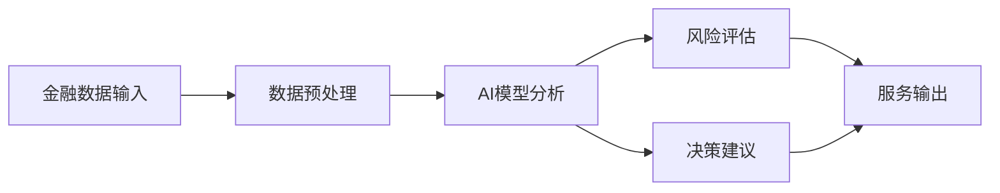
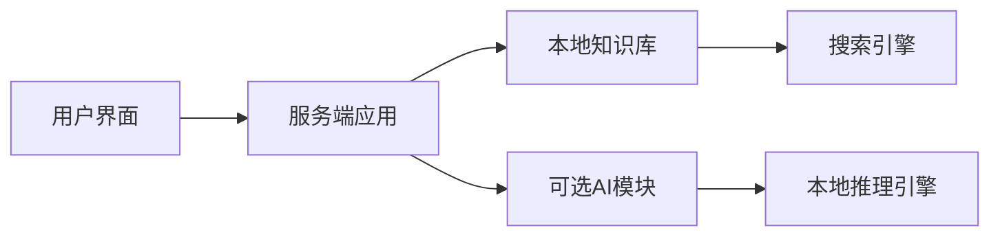

## 今日热点

AI应用多元化与去中心化技术兴起，智能代理框架和离线知识平台引领开发新方向，金融科技工具持续受关注。

---

## 热门项目一览

| 排名 | 项目 | 语言 | 今日 | 总计 | 简介 |
|:---:|------|:----:|------:|-----:|------|
| 1 | [Open-Dev-Society/OpenStock](https://github.com/Open-Dev-Society/OpenStock) | TypeScript | +844 | 17,825 | OpenStock is an open-source... |
| 2 | [trycua/cua](https://github.com/trycua/cua) | HTML | +609 | 25,737 | Scale computer-use 2.0 with... |
| 3 | [BuilderIO/agent-native](https://github.com/BuilderIO/agent-native) | TypeScript | +607 | 5,978 | A framework for building ag... |
| 4 | [coder/coder](https://github.com/coder/coder) | Go | +460 | 16,450 | Secure environments for dev... |
| 5 | [anthropics/financial-services](https://github.com/anthropics/financial-services) | Python | +424 | 35,865 | No description |
| 6 | [Crosstalk-Solutions/project-nomad](https://github.com/Crosstalk-Solutions/project-nomad) | TypeScript | +394 | 37,907 | Project NOMAD is an offline... |
| 7 | [zhouxiaoka/autoclip](https://github.com/zhouxiaoka/autoclip) | Python | +250 | 8,319 | AutoClip : AI-powered video... |
| 8 | [ruanyf/weekly](https://github.com/ruanyf/weekly) | Unknown | +182 | 104,038 | 科技爱好者周刊，每周五发布 |
| 9 | [mvt-project/mvt](https://github.com/mvt-project/mvt) | Python | +169 | 13,628 | MVT (Mobile Verification To... |
| 10 | [akitaonrails/ai-memory](https://github.com/akitaonrails/ai-memory) | Rust | +167 | 7,744 | Solution for long term memo... |
| 11 | [yynxxxxx/Codex-X](https://github.com/yynxxxxx/Codex-X) | Rust | +50 | 3,716 | OpenAI Codex 桌面端/CLI 的可视化管理... |
| 12 | [cloudflare/quiche](https://github.com/cloudflare/quiche) | Rust | +32 | 12,378 | 🥧 Savoury implementation of... |

---

## 趋势洞察

```
┌─────────────────────────────────────────────────────────────────┐
│  AI/ML 工具         ████████████████████████  8 个项目        │
│  其他               █████████                 3 个项目        │
│  项目管理             ███                       1 个项目        │
└─────────────────────────────────────────────────────────────────┘
```

---

## 项目深度解读

### 1. Open-Dev-Society/OpenStock

> **项目简介**：OpenStock is an open-source alternative to expensive market platforms. Track real-time prices, set personalized alerts, and explore detailed company insights — built openly, for everyone, forever free.

#### 🎯 基本信息

| 维度 | 说明 |
|------|------|
| **语言** | TypeScript |
| **今日Star** | +844 |
| **总Star** | 17,825 |

#### 🔗 链接

- GitHub: [Open-Dev-Society/OpenStock](https://github.com/Open-Dev-Society/OpenStock)

---

---

### 2. trycua/cua — [计算机使用扩展]

> **一句话总结**：提供开源驱动、跨平台支持和基准测试，实现计算机使用场景的可扩展训练与评估。

#### 价值主张

| 维度 | 说明 |
|------|------|
| **解决痛点** | 解决计算机使用场景数据收集难、跨平台兼容性差、评估标准不统一的问题 |
| **目标用户** | AI研究人员、计算机视觉开发者、自动化测试团队 |
| **核心亮点** | 开源驱动 + 跨平台支持 + 基准测试套件 + 可扩展架构 + 训练数据生成 |

#### 技术架构


**技术特色**：
- 跨平台驱动支持，兼容多种操作系统
- 标准化数据收集与处理流程
- 开放的基准测试框架，便于模型比较
- 可扩展的架构设计，支持自定义功能
- 高效的数据生成机制，支持大规模训练

#### 热度分析

- 项目Star数超2.5万，近期增长迅速，表明社区高度认可其价值
- 零开放问题显示项目维护良好，社区可能通过其他渠道交流反馈

#### 快速上手

```bash
# 克隆项目仓库
git clone https://github.com/trycua/cua.git

# 安装依赖
cd cua && npm install

# 运行示例
npm run example
```

#### 注意事项

- 项目依赖可能随操作系统不同而有所差异，需注意环境配置
- 基准测试数据集可能较大，下载和运行需考虑存储空间
- 开源驱动程序可能需要特定权限，需谨慎配置
- 项目文档可能需要进一步补充，部分功能可能需要参考源码实现


### 3. BuilderIO/agent-native — 智能应用框架

> **一句话总结**：TypeScript智能体应用框架，简化AI原生应用开发流程，提供高效构建智能系统的工具链。

#### 价值主张

| 维度 | 说明 |
|------|------|
| **解决痛点** | 简化AI智能体应用开发，降低构建复杂AI系统的门槛 |
| **目标用户** | AI应用开发者、智能系统构建者、TypeScript开发者 |
| **核心亮点** | 模块化架构 + TypeScript支持 + 开箱即用的智能体组件 + 简化AI集成 |

#### 技术架构


**技术特色**：
- 基于TypeScript的全栈开发环境，提供类型安全
- 模块化设计，支持快速构建和扩展智能体功能
- 内置AI集成能力，简化与各种AI服务的对接

#### 热度分析

- 项目一天内增长600+ stars，表明市场对智能体应用框架有强烈需求
- 作为BuilderIO生态系统的一部分，具有稳定的社区支持和更新频率

#### 快速上手

```bash
# 安装agent-native
npm install -g @builderio/agent-native

# 创建新项目
agent-native init my-agentic-app

# 启动开发服务器
cd my-agentic-app
npm run dev
```

#### 注意事项

- 项目文档可能需要进一步完善，以帮助新用户快速上手
- 需要关注项目对AI服务的依赖性和潜在成本
- 由于是较新的框架，生态系统和第三方插件可能还在发展中


### 4. coder/coder — 云端开发环境

> **一句话总结**：为开发者提供安全隔离的云端开发环境，支持团队协作和基础设施即代码。

#### 价值主张

| 维度 | 说明 |
|------|------|
| **解决痛点** | 开发环境不一致、本地资源限制、远程开发安全隐患 |
| **目标用户** | DevOps团队、云原生开发者、远程协作开发人员 |
| **核心亮点** | 完全隔离环境 + 多用户协作 + Git工作流集成 + 基础设施即代码 + 自定义模板 |

#### 技术架构


**技术特色**：
- 基于Go语言构建的高性能微服务架构
- 使用容器技术实现开发环境隔离
- 支持多种云平台和本地基础设施
- 内置RBAC权限管理和审计日志

#### 热度分析

- 项目Star数持续快速增长，近一个月新增超过2000颗星
- 社区活跃度高，但参与度相对较低，表明项目以使用者为主
- 作为GitHub Codespaces的开源替代方案，具有显著生态价值

#### 快速上手

```bash
# 安装Coder CLI
curl -fsSL https://coder.com/install.sh | sh
# 登录Coder服务
coder login
# 启动开发环境
coder create my-workspace
```

#### 注意事项

- 需要准备可用的Kubernetes集群或云基础设施
- 环境模板配置相对复杂，需要一定学习曲线
- 完全功能需要付费版本，社区版功能有限


### 5. anthropics/financial-services — 金融AI工具集

> **一句话总结**：Anthropic公司开发的Python工具集，将AI技术应用于金融服务领域，提供智能决策支持。

#### 价值主张

| 维度 | 说明 |
|------|------|
| **解决痛点** | 金融服务中AI应用复杂度高，难以集成到现有系统 |
| **目标用户** | 金融机构、金融科技公司和AI开发者 |
| **核心亮点** | 安全AI模型 + 金融合规支持 + 易集成API + 风险评估工具 |

#### 技术架构



**技术特色**：
- 基于Anthropic Claude模型的金融分析引擎
- 模块化设计支持多种金融服务场景
- 强调安全性与隐私保护的金融数据处理

#### 热度分析

- 项目获得35k+星标，显示金融AI领域的高关注度，近期增长迅速
- 作为AI与金融交叉领域的代表项目，在开发者社区具有重要影响力

#### 快速上手

```bash
# 安装项目
pip install anthropics-financial

# 基本使用示例
from anthropics.financial import RiskAnalyzer
analyzer = RiskAnalyzer()
risk_score = analyzer.assess_financial_risk(data)
```

#### 注意事项

- 需要确保符合金融行业的数据隐私和安全法规
- AI模型在金融决策中的使用需谨慎，应结合专业金融知识
- 建议在正式环境中使用前进行充分测试和验证


### 6. Crosstalk-Solutions/project-nomad — 离线知识服务器

> **一句话总结**：自托管离线知识库，集成百科全书、书籍、课程及AI功能，无需互联网即可访问海量教育资源。

#### 价值主张

| 维度 | 说明 |
|------|------|
| **解决痛点** | 解决互联网不可用时无法访问教育资源的问题，提供完全离线的知识获取方式 |
| **目标用户** | 教育工作者、学生、研究人员、在互联网受限地区生活的人群 |
| **核心亮点** | 离线优先设计 + 海量教育资源集成 + 本地AI功能可选 + 完全自托管 |

#### 技术架构



**技术特色**：
- 使用TypeScript开发，提供类型安全和高代码质量
- 离线优先架构设计，支持完全本地化运行
- 集成多种教育资源格式和内容源，实现知识统一访问

#### 热度分析

- 项目拥有近38,000个Star，每日约400个新增，表明正处于快速增长阶段，受到社区高度关注
- Fork数相对较少，说明项目更多作为自托管工具使用，而非二次开发

#### 快速上手

```bash
# 克隆项目
git clone https://github.com/Crosstalk-Solutions/project-nomad.git
# 安装依赖
npm install
# 启动服务
npm start
```

#### 注意事项

- 项目可能需要较大的存储空间来存储各种教育资源
- 本地AI功能可能需要较高的硬件配置
- 完全离线运行意味着内容更新可能需要手动进行


### 7. zhouxiaoka/autoclip — AI视频剪辑工具

> **一句话总结**：基于AI技术自动识别视频高光并进行智能剪辑的二创工具

#### 价值主张

| 维度 | 说明 |
|------|------|
| **解决痛点** | 自动从长视频中提取精彩片段，解决手动剪辑费时费力的问题 |
| **目标用户** | 视频创作者、内容编辑、社交媒体运营者 |
| **核心亮点** | AI智能识别 + 自动剪辑 + 高效提取 + 多格式支持 |

#### 技术架构


**技术特色**：
- 基于深度学习的高光识别算法
- 智能场景分割和内容理解
- 高效的视频处理和编码技术

#### 热度分析

- 项目Star数超过8300且持续快速增长，显示市场对该类AI视频工具的强烈需求
- Fork数近1600，表明开发者社区积极参与和贡献，形成活跃的生态

#### 快速上手

```bash
# 安装依赖
pip install -r requirements.txt

# 运行程序
python autoclip.py -i input_video.mp4 -o output_clip.mp4
```

#### 注意事项

- 项目可能需要较高的计算资源，特别是处理高清视频时
- AI识别的准确性可能受视频内容和质量影响
- 需要确保遵守相关版权法规，特别是处理他人视频内容时


### 8. ruanyf/weekly — 科技资讯周刊

> **一句话总结**：每周五精选发布的科技爱好者周刊，聚合前沿技术与行业动态。

#### 价值主张

| 维度 | 说明 |
|------|------|
| **解决痛点** | 解决科技爱好者信息过载，提供高质量精选内容 |
| **目标用户** | 关注科技动态的开发者、产品经理和科技爱好者 |
| **核心亮点** | 定期精选 + 周五发布 + 多元内容 + 无广告阅读 |

#### 技术架构


**技术特色**：
- 简洁轻量的静态网站架构
- 周期性内容自动化更新机制
- 多平台适配的阅读体验

#### 热度分析
- 十万+Star且持续增长，显示项目在开发者社区影响力巨大
- 零Issues维护模式，体现项目内容质量与社区认可度

#### 快速上手

```bash
# 克隆项目仓库
git clone https://github.com/ruanyf/weekly.git

# 浏览最新周刊内容
cd weekly && ls
```

#### 注意事项
- 本项目为内容聚合型，主要价值在于精选内容而非技术实现
- 定期更新，建议关注每周五发布的新内容获取最新资讯
- 可通过GitHub star或邮件订阅获取周刊更新提醒


### 9. mvt-project/mvt — [移动安全取证]

> **一句话总结**：MVT是移动设备安全取证工具，帮助检测潜在的恶意软件和安全入侵。

#### 价值主张

| 维度 | 说明 |
|------|------|
| **解决痛点** | 移动设备取证分析困难，缺乏专业检测工具 |
| **目标用户** | 数字取证专家、安全研究员、执法机构人员 |
| **核心亮点** | 支持iOS/Android双平台 + 多种取证模块 + 自动化分析报告 |

#### 技术架构


**技术特色**：
- 基于Python开发，跨平台兼容性强
- 集成多个专业取证模块，针对不同威胁类型
- 支持物理提取和逻辑提取两种取证方法

#### 热度分析

- 项目获得13,628个Star，近期增长稳定，表明在移动取证领域认可度高
- Fork数1,329，表明社区参与度良好，有持续贡献和改进

#### 快速上手

```bash
# 安装MVT
pip install mvt

# 运行iOS设备检查
mvt ios check-iocs -i input.plist

# 运行Android设备检查
mvt android check-iocs -i input.ab
```

#### 注意事项
- 需要具备一定的移动设备取证知识才能正确使用
- 某些功能可能需要root权限或越狱设备
- 使用前需确认法律合规性，确保符合当地法律法规


### 10. akitaonrails/ai-memory — AI长期记忆系统

> **一句话总结**：为AI代理提供长期记忆能力，支持跨代理供应商的上下文延续和协作。

#### 价值主张

| 维度 | 说明 |
|------|------|
| **解决痛点** | AI代理缺乏长期记忆，导致上下文无法持续和跨代理协作困难 |
| **目标用户** | AI开发者和CLI工具构建者，需要持久化AI交互的场景 |
| **核心亮点** | 持久化记忆 + 跨代理协作 + 上下文延续 + 高效检索 |

#### 技术架构


**技术特色**：
- 基于Rust构建的高性能记忆系统
- 支持跨代理供应商的上下文延续
- 提供高效的记忆检索和更新机制

#### 热度分析

- 项目近期获得显著关注，Star数增长迅速，表明AI记忆领域需求旺盛
- 在AI辅助开发领域占据重要位置，为不同AI工具间的协作提供基础支持

#### 快速上手

```bash
# 安装
cargo install ai-memory

# 初始化记忆库
ai-memory init

# 添加记忆
ai-memory add --context "项目开发" --details "使用Rust开发AI记忆系统"
```

#### 注意事项

- 项目处于早期开发阶段，API可能不稳定
- 需要配置适当的存储后端以确保记忆的持久性


### 11. yynxxxxx/Codex-X — AI代码助手管理

> **一句话总结**：跨平台可视化管理OpenAI Codex，支持API切换、会话同步和配置管理，提升AI编程助手使用体验。

#### 价值主张

| 维度 | 说明 |
|------|------|
| **解决痛点** | 解决OpenAI Codex管理困难，缺乏可视化界面的问题 |
| **目标用户** | 使用AI编程助手的开发者和研究人员 |
| **核心亮点** | 多API管理 + 会话同步 + 提示词注入 + 配置可视化 |

#### 技术架构


**技术特色**：
- 基于Rust构建的高性能跨平台应用
- TOML配置文件的可视化管理
- 支持多API Provider无缝切换

#### 热度分析

- 项目Star数3716且持续增长(+50/天)，表明社区认可度高
- Fork数465，说明有一定数量的开发者正在尝试使用或修改项目

#### 快速上手

```bash
# 克隆项目
git clone https://github.com/yynxxxxx/Codex-X.git
# 进入目录
cd Codex-X
# 构建项目
cargo build --release
```

#### 注意事项

- 项目许可证未知，使用前需确认商业使用限制
- 作为第三方工具，可能与OpenAI API更新不同步
- 需要OpenAI API密钥才能正常使用功能


### 12. cloudflare/quiche — 高性能QUIC实现

> **一句话总结**：Rust语言实现的QUIC传输协议与HTTP/3完整解决方案，提供下一代网络通信能力

#### 价值主张

| 维度 | 说明 |
|------|------|
| **解决痛点** | 解决传统TCP在高延迟网络中的性能瓶颈，提供更低延迟的网络传输 |
| **目标用户** | 需要高性能网络通信的开发者、CDN服务提供商、网络应用构建者 |
| **核心亮点** | 完整QUIC协议实现 + Rust内存安全优势 + Cloudflare生产环境验证 + 跨平台支持 |

#### 技术架构


**技术特色**：
- 基于Rust实现，提供内存安全保障与高性能并发处理
- 完整支持QUIC协议所有核心功能，包括连接迁移和0-RTT握手
- 兼容多版本QUIC实现，支持多种加密套件和传输参数

#### 热度分析

- Star数持续稳定增长，表明项目在Web性能优化领域获得广泛认可
- 作为Cloudflare主导的开源项目，在下一代网络协议生态中占据重要位置

#### 快速上手

```bash
# 克隆仓库
git clone https://github.com/cloudflare/quiche.git
# 构建项目
cd quiche && cargo build --release
```

#### 注意事项

- 需要Rust 1.50+版本环境，部分功能可能依赖特定平台特性
- 协议实现仍在持续更新中，生产环境使用前建议充分测试
- HTTP/3生态尚在发展中，部分中间件和代理可能不完全兼容


## 今日推荐

| 主题 | 推荐项目 | 亮点 |
|------|----------|------|
| 今日最热 | [Open-Dev-Society/OpenStock](https://github.com/Open-Dev-Society/OpenStock) | OpenStock is an o... |
| 值得关注 | [trycua/cua](https://github.com/trycua/cua) | Scale computer-us... |
| 快速上手 | [BuilderIO/agent-native](https://github.com/BuilderIO/agent-native) | A framework for b... |
| 长期潜力 | [coder/coder](https://github.com/coder/coder) | Secure environmen... |

---

<div align="center">

*Generated on 2026-09-22 | Powered by GitHub Trending Reporter*

</div>