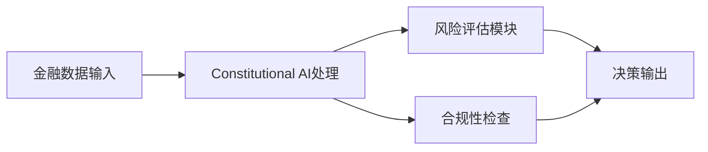
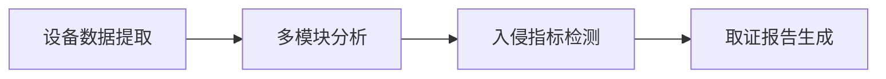
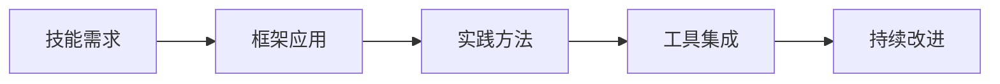
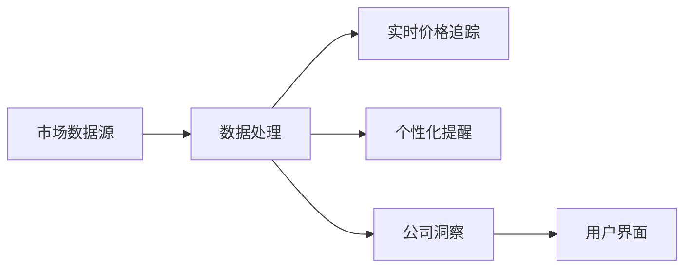
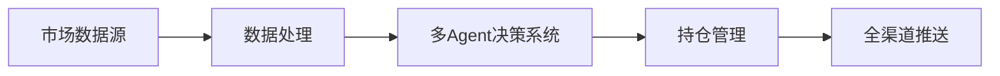

## 今日热点

AI代理技术持续火热，金融领域应用加速，工具框架与代码智能成为焦点，显示AI正从理论走向实用化落地。

---

## 热门项目一览

| 排名 | 项目 | 语言 | 今日 | 总计 | 简介 |
|:---:|------|:----:|------:|-----:|------|
| 1 | [google/ax](https://github.com/google/ax) | Go | +1,543 | 9,161 | Google's open agentic orche... |
| 2 | [dream-num/univer](https://github.com/dream-num/univer) | TypeScript | +1,142 | 16,377 | The Office Harness for AI A... |
| 3 | [browser-use/video-use](https://github.com/browser-use/video-use) | Python | +746 | 26,530 | Edit videos with coding agents |
| 4 | [anthropics/financial-services](https://github.com/anthropics/financial-services) | Python | +664 | 36,982 | No description |
| 5 | [agent-substrate/substrate](https://github.com/agent-substrate/substrate) | Go | +558 | 3,525 | Agent Substrate: the core s... |
| 6 | [mvt-project/mvt](https://github.com/mvt-project/mvt) | Python | +543 | 14,495 | MVT (Mobile Verification To... |
| 7 | [superdesigndev/treg](https://github.com/superdesigndev/treg) | Python | +506 | 2,745 | OpenRouter for agent tools.... |
| 8 | [obra/superpowers](https://github.com/obra/superpowers) | Shell | +474 | 290,723 | An agentic skills framework... |
| 9 | [davila7/claude-code-templates](https://github.com/davila7/claude-code-templates) | Python | +389 | 31,521 | CLI tool for configuring an... |
| 10 | [Open-Dev-Society/OpenStock](https://github.com/Open-Dev-Society/OpenStock) | TypeScript | +344 | 18,868 | OpenStock is an open-source... |
| 11 | [pbakaus/impeccable](https://github.com/pbakaus/impeccable) | JavaScript | +304 | 70,369 | The design language that ma... |
| 12 | [DeusData/codebase-memory-mcp](https://github.com/DeusData/codebase-memory-mcp) | C | +190 | 44,593 | High-performance code intel... |

---

## 趋势洞察

```
┌─────────────────────────────────────────────────────────────────┐
│  AI/ML 工具         ████████████████████████  14 个项目        │
│  项目管理             █                         1 个项目        │
│  数据分析             █                         1 个项目        │
│  其他               █                         1 个项目        │
└─────────────────────────────────────────────────────────────────┘
```

---

## 项目深度解读

### 1. google/ax — 智能体编排框架

> **一句话总结**：Google开发的开源智能体编排运行时，用于构建和协调复杂的AI代理系统。

#### 价值主张

| 维度 | 说明 |
|------|------|
| **解决痛点** | 简化复杂AI代理系统的构建与编排，解决多智能体协同问题 |
| **目标用户** | AI研究人员、企业AI应用开发者、构建复杂AI系统的团队 |
| **核心亮点** | 模块化架构 + 可扩展设计 + Google内部实践验证 |

#### 技术架构


**技术特色**：
- 基于Go语言实现，提供高性能运行时
- 模块化设计，支持多种智能体类型
- 内置编排能力，简化复杂AI工作流构建

#### 热度分析

- 项目Star数快速增长，近期新增1,543个Star，表明社区关注度迅速提升
- 作为Google开源的AI编排框架，处于AI基础设施生态的关键位置

#### 快速上手

```bash
# 克隆仓库
git clone https://github.com/google/ax.git

# 安装依赖
cd ax && go mod download

# 运行示例
go run examples/basic/main.go
```

#### 注意事项

- 项目许可证信息不明确，使用前需确认开源协议
- 作为新项目，API和功能可能仍在快速迭代中
- 需要一定的Go语言和AI系统开发经验


### 2. dream-num/univer — AI办公引擎

> **一句话总结**：为AI Agent提供一站式办公套件运行时，支持电子表格、文档、幻灯片等多种格式。

#### 价值主张

| 维度 | 说明 |
|------|------|
| **解决痛点** | 解决AI Agent处理复杂办公文档和数据的统一运行环境需求 |
| **目标用户** | AI开发者、智能办公应用构建者、企业自动化解决方案提供商 |
| **核心亮点** | 多格式支持 + AI深度集成 + 轻量级运行时 + 开源可定制 |

#### 技术架构


**技术特色**：
- 基于 TypeScript 开发，提供类型安全
- 统一的多格式文档处理引擎
- 轻量级设计，适合集成到AI Agent中
- 开源架构，支持二次开发

#### 热度分析

- Star数持续增长，近期单日增长超千，表明项目热度快速上升
- 零Open Issues反映项目维护良好，社区协作高效

#### 快速上手

```bash
# 安装univer
npm install @univer/core

# 初始化univer实例
import { Univer } from '@univer/core';
const univer = new Univer();
```

#### 注意事项

- 需要关注项目的许可证信息，当前显示为Unknown
- 项目可能需要一定的TypeScript和办公文档处理经验
- 由于项目集成多种办公格式，可能存在性能优化需求


### 3. browser-use/video-use — AI视频编辑工具

> **一句话总结**：通过编程代理实现自动化视频编辑，降低视频处理技术门槛。

#### 价值主张

| 维度 | 说明 |
|------|------|
| **解决痛点** | 简化视频编辑流程，无需专业技能即可创建高质量视频内容 |
| **目标用户** | 内容创作者、视频编辑人员、开发者、营销人员 |
| **核心亮点** | 代码驱动自动化 + AI智能编辑 + 无需专业编辑技能 + 高效批量处理 |

#### 技术架构


**技术特色**：
- 结合编程代理与视频处理技术
- 提供代码驱动的视频编辑能力
- 支持批量自动化视频处理流程

#### 热度分析

- 项目热度持续攀升，今日新增746个Star，表明社区对该技术方向高度关注
- 作为视频编辑领域的新兴技术方案，正在开发者社区快速建立影响力

#### 快速上手

```bash
# 安装依赖
pip install video-use

# 基本使用示例
video-use -i input.mp4 -o output.mp4 --edit "trim(0:10, 0:30) add_text('Hello')"
```

#### 注意事项

- 需要Python编程基础，不适合零技术背景的用户
- 可能需要额外的视频处理依赖和硬件支持
- 编辑功能可能受限于所支持的视频格式和处理能力


### 4. anthropics/financial-services — 金融AI安全

> **一句话总结**：Anthropic开发的AI金融服务解决方案，提供安全可靠的金融智能分析工具。

#### 价值主张

| 维度 | 说明 |
|------|------|
| **解决痛点** | 金融领域AI应用的安全性和合规性挑战 |
| **目标用户** | 金融机构、金融科技公司和合规部门 |
| **核心亮点** | Constitutional AI框架 + 金融隐私保护 + 风险评估 + 合规监控 + 可解释决策 |

#### 技术架构



**技术特色**：
- 基于Anthropic Constitutional AI技术，确保AI决策符合金融伦理和法规
- 针对金融场景优化的隐私计算技术，保护敏感数据
- 多层次验证机制，提高金融AI系统的安全性和可靠性

#### 热度分析

- 近3.7万star显示项目在金融AI领域有显著影响力，日增600+表明持续关注度高
- Fork比例相对较低，暗示项目更侧重于直接应用而非二次开发

#### 快速上手

```bash
# 安装依赖
pip install anthropic-financial-services

# 初始化配置
afs init --api-key YOUR_API_KEY

# 运行金融分析
afs analyze --data financial_data.csv --report risk_assessment
```

#### 注意事项

- 项目需要Anthropic API访问权限，可能涉及额外费用
- 使用时需确保符合当地金融法规和隐私保护要求
- 金融决策建议应仅作为参考，最终决策需结合人工判断


### 5. agent-substrate/substrate — 智能体基础框架

> **一句话总结**：Agent Substrate 是一个用于构建智能体的核心系统框架，提供底层基础设施和开发工具。

#### 价值主张

| 维度 | 说明 |
|------|------|
| **解决痛点** | 简化智能体/代理系统的开发流程，降低构建复杂AI系统的门槛 |
| **目标用户** | AI研究人员、智能体开发者、需要构建自主系统的团队 |
| **核心亮点** | 模块化架构 + 高性能Go实现 + 易扩展设计 + 统一API接口 |

#### 技术架构


**技术特色**：
- 基于Go语言实现，提供高性能并发处理能力
- 模块化设计，支持组件灵活组合与扩展
- 提供统一API接口，简化智能体开发流程
- 支持分布式部署，适合构建大规模智能系统

#### 热度分析

- 项目Star数达3525，今日增长558，表明近期关注度显著提升
- Open Issues为0，可能表明项目维护状态良好或问题管理方式特殊
- Fork数相对Star数比例较低(约12%)，表明用户更多是使用者而非贡献者

#### 快速上手

```bash
# 克隆项目
git clone https://github.com/agent-substrate/substrate.git
cd substrate

# 安装依赖并运行
go mod download
go run main.go
```

#### 注意事项

- 项目许可证未知，商业使用前需确认授权情况
- Open Issues为0，可能意味着问题通过其他渠道管理，如Discord或Slack
- 项目处于早期阶段，API和功能可能不稳定
- 需要一定的Go和AI/智能体系统开发经验才能有效使用


### 6. mvt-project/mvt — 移动安全取证

> **一句话总结**：MVT是专业移动设备安全取证工具，可检测iOS和Android设备入侵痕迹。

#### 价值主张

| 维度 | 说明 |
|------|------|
| **解决痛点** | 移动设备入侵检测困难，缺乏系统化取证手段 |
| **目标用户** | 数字取证专家、安全研究员、执法部门 |
| **核心亮点** | 支持iOS/Android双平台 + 多种取证技术 + 自动化分析流程 + 详细报告生成 |

#### 技术架构



**技术特色**：
- 基于Python开发，跨平台兼容性强
- 支持多种取证技术，包括备份分析、数据库解析和日志检查
- 模块化设计，支持可扩展的检测规则

#### 热度分析

- 项目近期热度显著增长，单日新增Star数超500，显示行业关注度提升
- 在移动安全取证领域具有领先地位，社区活跃度高，Fork数稳定增长

#### 快速上手

```bash
# 安装MVT
pip install mvt

# 基本使用示例
mvt ios check-backup -p /path/to/backup
mvt android check-malware -p /path/to/apk
```

#### 注意事项

- 需要一定的移动设备取证基础知识才能有效使用
- 部分功能可能需要root或越狱设备权限
- 使用前需确保合法合规，遵守相关法律法规


### 7. superdesigndev/treg — 代理工具路由器

> **一句话总结**：为AI代理工具提供统一路由接口的开源解决方案

#### 价值主张

| 维度 | 说明 |
|------|------|
| **解决痛点** | 解决AI代理工具间接口不统一、难以协同的问题 |
| **目标用户** | AI代理开发者、多工具集成团队、AI应用构建者 |
| **核心亮点** | 统一路由接口 + 多工具支持 + 简化集成流程 |

#### 技术架构


**技术特色**：
- 提供统一的工具路由接口
- 支持多种代理工具的集成
- 简化工具间的协同工作

#### 热度分析

- 项目近期Star激增506，显示社区关注度迅速提升
- Discord社区活跃，表明有良好的用户支持和生态建设

#### 快速上手

```bash
# 安装
pip install treg

# 基本使用
from treg import OpenRouter
router = OpenRouter()
result = router.route(tool_name, params)
```

#### 注意事项

- 项目许可证未知，商业使用前需确认许可条款
- 作为新兴项目，API和功能可能仍在快速迭代中


### 8. obra/superpowers — 智能开发框架

> **一句话总结**：基于Shell的代理技能框架与高效软件开发方法论，提供实用工具与实践指南。

#### 价值主张

| 维度 | 说明 |
|------|------|
| **解决痛点** | 提供结构化的技能框架与开发方法，解决软件开发过程中的效率与质量平衡问题 |
| **目标用户** | 软件开发者、技术团队、追求高效工作流程的开发者 |
| **核心亮点** | Shell脚本工具集 + 代理技能框架 + 实用开发方法论 + 可实践的工作流程 |

#### 技术架构



**技术特色**：
- 基于Shell的轻量级工具集，易于部署和使用
- 提供结构化的技能框架，指导开发者能力成长
- 实践导向的软件开发方法论，强调可操作性

#### 热度分析

- 项目获得近29万星，每日新增约474星，呈现稳定高速增长态势
- 作为方法论类项目，社区参与度高，影响广泛但可能更多是理论应用而非代码贡献

#### 快速上手

```bash
git clone https://github.com/obra/superpowers.git
cd superpowers
./install.sh
source superpowers.sh
```

#### 注意事项

- 由于许可证未知，商业使用前需确认授权条款
- 项目可能需要一定的Shell编程基础才能充分利用
- 作为方法论项目，实际应用效果可能因团队而异


### 9. davila7/claude-code-templates — Claude 配置工具

> **一句话总结**：高效的 Claude Code 配置与监控 CLI 工具，简化 AI 编程工作流

#### 价值主张

| 维度 | 说明 |
|------|------|
| **解决痛点** | 简化 Claude Code 的配置与监控流程，提升开发效率 |
| **目标用户** | 使用 Claude AI 进行编程的开发者和技术团队 |
| **核心亮点** | 命令行界面 + 模板管理 + 实时监控 + 配置简化 + 高效集成 |

#### 技术架构


**技术特色**：
- Python 实现的轻量级 CLI 工具
- 模块化设计，易于扩展
- 高效的配置管理与状态跟踪

#### 热度分析

- 项目获得 31,521 个 Star 且持续增长，表明其在 Claude AI 开发者社区中高度认可
- 零 Open Issues 反映了项目的稳定性和成熟度，社区问题可能通过其他渠道解决

#### 快速上手

```bash
# 安装
pip install claude-code-templates

# 配置 Claude Code
claude-code configure

# 启动监控
claude-code monitor
```

#### 注意事项

- 项目许可证未知，商业使用前需确认授权条款
- 依赖 Claude API，需确保 API 访问权限和网络连接
- 定期更新以获得最新功能和修复


### 10. Open-Dev-Society/OpenStock — 开源股票平台

> **一句话总结**：开源免费替代昂贵股票平台，提供实时价格追踪与个性化提醒服务。

#### 价值主张

| 维度 | 说明 |
|------|------|
| **解决痛点** | 替代昂贵股票平台，提供免费透明的市场数据服务 |
| **目标用户** | 个人投资者、股票交易员、金融数据分析师 |
| **核心亮点** | 实时价格追踪 + 个性化提醒 + 详细公司洞察 + 开源免费 + 永久免费 |

#### 技术架构



**技术特色**：
- TypeScript 全栈开发，确保类型安全
- 实时数据处理引擎，支持高频更新
- 模块化架构，便于扩展和维护

#### 热度分析

- 项目获得近19k星，日增344星，显示强劲增长势头和社区认可度
- 零开放问题，表明项目维护良好，用户需求得到及时响应

#### 快速上手

```bash
# 克隆项目
git clone https://github.com/Open-Dev-Society/OpenStock.git

# 安装依赖
npm install

# 启动开发服务器
npm run dev
```

#### 注意事项

- 项目许可证未知，使用前需确认授权条款
- 作为金融数据平台，需注意数据来源的合法性和准确性
- 开源项目可能需要自行部署和维护，非托管服务


### 11. pbakaus/impeccable — AI设计语言

> **一句话总结**：一种专为AI应用优化的设计语言系统，提升AI界面与交互体验。

#### 价值主张

| 维度 | 说明 |
|------|------|
| **解决痛点** | AI应用界面设计缺乏统一标准，用户体验碎片化严重 |
| **目标用户** | AI应用开发者、产品设计师、人机交互研究员 |
| **核心亮点** | 智能组件库 + 自适应布局系统 + 多模态交互支持 + 可访问性优化 + 设计一致性保证 |

#### 技术架构


**技术特色**：
- 基于JavaScript的模块化设计系统，支持渐进式集成
- 内置AI特定交互模式，如自然语言反馈、智能表单等
- 提供完整的开发工具链，包括设计到代码的转换

#### 热度分析

- 高星数(7万+)且持续稳定增长，显示在AI设计领域具有显著影响力
- Fork数适中，表明项目已被广泛采用于实际AI产品中

#### 快速上手

```bash
# 克隆项目
git clone https://github.com/pbakaus/impeccable.git

# 安装依赖
npm install

# 启动示例
npm run start
```

#### 注意事项

- 项目License未知，使用前需确认授权条款
- 可能需要一定的AI应用设计背景才能充分利用其特性


### 12. DeusData/codebase-memory-mcp — 代码智能索引

> **一句话总结**：高性能代码智能服务器，将代码库转为持久化知识图，毫秒级索引，支持158种语言。

#### 价值主张

| 维度 | 说明 |
|------|------|
| **解决痛点** | 代码库分析慢、查询效率低、token消耗大 |
| **目标用户** | 开发者、代码分析工具使用者、大型代码库维护者 |
| **核心亮点** | 毫秒级索引 + 158种语言支持 + 单一二进制文件 + 零依赖 + 99%token减少 |

#### 技术架构


**技术特色**：
- 基于C语言实现的高性能索引系统
- 持久化知识图存储结构，加速查询
- 单一二进制文件，零外部依赖

#### 热度分析

- 项目获44593个Star，今日增长190，表明正获得广泛关注和持续增长
- Fork数3640，显示社区活跃度高，用户积极参与项目开发和定制

#### 快速上手

```bash
# 下载二进制文件
wget https://github.com/DeusData/codebase-memory-mcp/releases/latest/download/codebase-memory-mcp

# 赋予执行权限
chmod +x codebase-memory-mcp

# 运行
./codebase-memory-mcp
```

#### 注意事项

- 项目许可证未知，使用前需确认商业使用限制
- 虽然支持158种语言，但可能对某些小众语言的支持有限
- 作为MCP服务器，需要与支持MCP的客户端工具配合使用


### 13. strands-agents/harness-sdk — AI代理开发平台

> **一句话总结**：开源AI代理SDK，支持跨模型和云平台，提供端到端代理构建与控制能力。

#### 价值主张

| 维度 | 说明 |
|------|------|
| **解决痛点** | 解决AI代理跨平台开发和部署的复杂性，提供统一控制接口 |
| **目标用户** | 企业AI开发团队、AI应用构建者和云服务集成商 |
| **核心亮点** | 多模型支持 + 跨云部署 + 开源SDK + 端到端控制 + 生产就绪 |

#### 技术架构


**技术特色**：
- 支持多模型统一接口，降低切换成本
- 跨云平台部署能力，避免厂商锁定
- 开源SDK设计，便于定制和扩展

#### 热度分析

- 项目获得近8K星，日增115星，增长势头强劲
- Fork数适中，表明社区有积极贡献但尚未形成大规模分支

#### 快速上手

```bash
# 安装harness-sdk
pip install harness-sdk

# 初始化AI代理
harness init my-agent --model gpt-4 --cloud aws

# 启动代理
harness start my-agent
```

#### 注意事项

- 注意不同云平台的API调用限制和成本
- 建议在生产环境中添加适当的监控和日志记录
- 遵循项目的开源许可证使用代码


### 14. TNT-Likely/PanWatch — AI盯盘助手

> **一句话总结**：自托管AI盯盘助手，支持多市场股票监控与智能决策分析

#### 价值主张

| 维度 | 说明 |
|------|------|
| **解决痛点** | 解决人工盯盘效率低、信息获取不及时、投资决策缺乏AI支持的问题 |
| **目标用户** | 个人投资者、量化交易者、金融分析师 |
| **核心亮点** | 多市场支持 + AI智能分析 + 自托管安全 + 全渠道推送 + 多Agent协同决策 |

#### 技术架构



**技术特色**：
- 基于TradingAgents多Agent协同决策架构
- 自托管部署保障数据安全与隐私
- 支持A股/港股/美股多市场数据实时采集与分析

#### 热度分析

- 项目近一日Star增长95，显示较强关注度和发展势头
- 零Open Issues表明项目维护良好，用户反馈可能通过其他渠道处理
- 300个Fork数显示开发者社区有一定活跃度，但生态规模尚小

#### 快速上手

```bash
# 克隆项目
git clone https://github.com/TNT-Likely/PanWatch.git

# 安装依赖
pip install -r requirements.txt

# 启动服务
python main.py
```

#### 注意事项

- 项目未明确许可证信息，使用前需确认授权条款
- 作为金融交易辅助工具，投资决策仍需谨慎，不应完全依赖AI建议
- 自托管部署需要一定的技术基础，特别是服务器配置和安全维护


### 15. BuilderIO/agent-native — 智能体应用框架

> **一句话总结**：基于TypeScript的智能体应用开发框架，简化AI驱动应用构建流程。

#### 价值主张

| 维度 | 说明 |
|------|------|
| **解决痛点** | 简化AI智能体应用开发，降低构建复杂AI应用的门槛 |
| **目标用户** | AI应用开发者、智能体系统架构师、需要集成AI功能的产品团队 |
| **核心亮点** | 类型安全 + 原生性能 + 模块化设计 + 开箱即用 |

#### 技术架构


**技术特色**：
- 基于TypeScript提供完整的类型安全保障
- 原生性能优化，减少中间层转换开销
- 模块化设计支持灵活扩展和定制

#### 热度分析

- 项目获得6580 stars且持续增长，显示开发者社区对其高度认可
- Fork数587表明社区积极参与贡献，项目生态正在形成

#### 快速上手

```bash
# 安装
npm install @builder.io/agent-native

# 初始化项目
npx agent-native init my-agent-app

# 开发运行
npm run dev
```

#### 注意事项
- 项目仍在快速发展中，API可能会有变化
- 需要具备TypeScript和AI基础知识才能充分利用框架特性


### 16. harry7557558/spirula-studio — 3D飞溅训练器

> **一句话总结**：跨平台3D高斯飞溅训练工具，支持视频到飞溅点再到网格的完整流程，提供Vulkan和CUDA加速。

#### 价值主张

| 维度 | 说明 |
|------|------|
| **解决痛点** | 提供跨平台的3D高斯飞溅训练解决方案，简化视频到3D模型的转换流程 |
| **目标用户** | 3D内容创作者、游戏开发者、AR/VR研究人员 |
| **核心亮点** | 跨平台支持 + 视频到飞溅点转换 + 飞溅点到网格转换 + Vulkan/CUDA加速 |

#### 技术架构


**技术特色**：
- 跨平台GPU加速支持，兼容Vulkan和CUDA
- 完整的视频到3D模型处理流水线
- 高效的高斯飞溅算法实现

#### 热度分析

- 项目近期增长迅速，今日新增69个Star，显示出3D高斯飞溅技术的热度上升
- 虽然Issues为0，但Fork数量适中，表明项目处于早期发展阶段，社区参与度正在提升

#### 快速上手

```bash
# 安装依赖
git clone https://github.com/harry7557558/spirula-studio.git
cd spirula-studio
# 构建项目
mkdir build && cd build
cmake ..
make
# 运行训练
./spirula-studio input_video.mp4 output_folder
```

#### 注意事项

- 项目License未知，使用前需确认授权协议
- 作为早期项目，API和功能可能不稳定
- 需要较新的GPU硬件以获得最佳性能


### 17. HKUDS/CLI-Anything — 命令行工具集

> **一句话总结**：将各类软件转换为可通过命令行操作的智能代理工具平台，实现软件间无缝集成。

#### 价值主张

| 维度 | 说明 |
|------|------|
| **解决痛点** | 解决非命令行软件难以自动化集成的问题，打破工具间壁垒 |
| **目标用户** | 开发者、系统管理员和DevOps工程师，需要自动化工作流程 |
| **核心亮点** | 软件命令行化 + 智能代理集成 + 统一接口 + 跨平台支持 |

#### 技术架构


**技术特色**：
- 采用智能代理技术将非CLI软件转换为可调用接口
- 提供统一的命令行操作界面，简化跨工具操作
- 支持多种软件平台的集成，实现工作流自动化

#### 热度分析

- 项目获得近5万颗星且持续增长，表明在开发者社区中高度受欢迎
- 作为软件集成工具，处于DevOps和自动化工具生态的关键位置

#### 快速上手

```bash
# 安装CLI-Anything
pip install cli-anything

# 查看帮助信息
cli-anything --help
```

#### 注意事项

- 项目许可证信息未知，商业使用前需确认许可条款
- Open Issues为0，可能意味着问题处理高效或社区反馈渠道不明确
- 作为集成工具，可能需要一定的学习成本才能充分利用其功能


## 今日推荐

| 主题 | 推荐项目 | 亮点 |
|------|----------|------|
| 今日最热 | [google/ax](https://github.com/google/ax) | Google's open age... |
| 值得关注 | [dream-num/univer](https://github.com/dream-num/univer) | The Office Harnes... |
| 快速上手 | [browser-use/video-use](https://github.com/browser-use/video-use) | Edit videos with ... |
| 长期潜力 | [anthropics/financial-services](https://github.com/anthropics/financial-services) | No description |

---

<div align="center">

*Generated on 2026-09-24 | Powered by GitHub Trending Reporter*

</div>