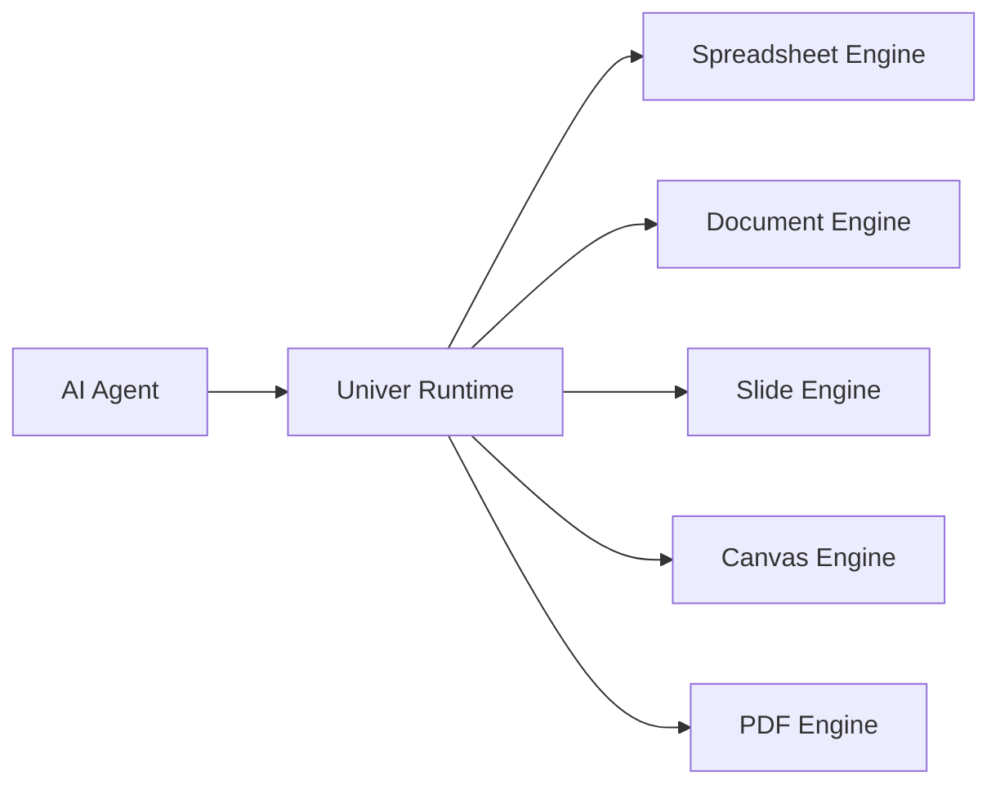
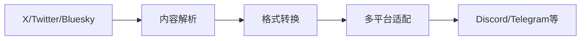

## 今日热点

今日GitHub热榜聚焦AI代理生态系统构建，从底层框架到企业应用全面开花，显示AI技术正从单点突破向系统化解决方案演进。

---

## 热门项目一览

| 排名 | 项目 | 语言 | 今日 | 总计 | 简介 |
|:---:|------|:----:|------:|-----:|------|
| 1 | [vectorize-io/hindsight](https://github.com/vectorize-io/hindsight) | Python | +1,668 | 27,860 | Hindsight: Agent Memory Tha... |
| 2 | [google/ax](https://github.com/google/ax) | Go | +1,373 | 10,538 | Google's open agentic orche... |
| 3 | [dream-num/univer](https://github.com/dream-num/univer) | TypeScript | +1,082 | 17,847 | The Office Harness for AI A... |
| 4 | [obra/superpowers](https://github.com/obra/superpowers) | Shell | +611 | 291,254 | An agentic skills framework... |
| 5 | [anthropics/financial-services](https://github.com/anthropics/financial-services) | Python | +509 | 37,371 | No description |
| 6 | [superdesigndev/treg](https://github.com/superdesigndev/treg) | Python | +468 | 3,178 | OpenRouter for agent tools.... |
| 7 | [strands-agents/harness-sdk](https://github.com/strands-agents/harness-sdk) | Python | +455 | 8,273 | Build an agent harness and ... |
| 8 | [HKUDS/CLI-Anything](https://github.com/HKUDS/CLI-Anything) | Python | +413 | 50,352 | "CLI-Anything: Making ALL S... |
| 9 | [rohitg00/ai-engineering-from-scratch](https://github.com/rohitg00/ai-engineering-from-scratch) | Python | +347 | 56,630 | Learn it. Build it. Ship it... |
| 10 | [mvt-project/mvt](https://github.com/mvt-project/mvt) | Python | +272 | 14,735 | MVT (Mobile Verification To... |
| 11 | [FxEmbed/FxEmbed](https://github.com/FxEmbed/FxEmbed) | TypeScript | +182 | 5,377 | Fix X/Twitter and Bluesky e... |
| 12 | [julyx10/lap](https://github.com/julyx10/lap) | Vue | +122 | 2,891 | An offline-first photo mana... |

---

## 趋势洞察

```
┌─────────────────────────────────────────────────────────────────┐
│  AI/ML 工具         ████████████████████████  9 个项目        │
│  多媒体应用            █████                     2 个项目        │
│  其他               █████                     2 个项目        │
│  项目管理             ██                        1 个项目        │
└─────────────────────────────────────────────────────────────────┘
```

---

## 项目深度解读

### 1. vectorize-io/hindsight — AI记忆系统

> **一句话总结**：构建能够学习的AI代理记忆系统，提升智能体长期记忆能力。

#### 价值主张

| 维度 | 说明 |
|------|------|
| **解决痛点** | 解决AI代理缺乏有效长期记忆和经验学习的问题 |
| **目标用户** | AI研究人员、智能体开发者、机器学习工程师 |
| **核心亮点** | 持续学习记忆系统 + 智能记忆检索 + 跨会话记忆保留 |

#### 技术架构


**技术特色**：
- 基于Transformer的记忆编码机制
- 上下文感知的记忆检索系统
- 持续学习的记忆更新算法

#### 热度分析

- 项目短期内获得大量关注，Star数增长迅速，表明AI记忆领域受到高度关注
- 作为AI代理基础设施项目，在当前AI快速发展背景下具有重要生态价值

#### 快速上手

```bash
# 安装依赖
pip install hindsight

# 初始化记忆系统
from hindsight import MemorySystem
memory = MemorySystem()

# 添加记忆
memory.add_interaction("用户查询", "AI回应")
```

#### 注意事项

- 项目可能需要大量计算资源来训练和维护记忆系统
- 隐私和数据安全需要特别关注，尤其是处理用户交互数据时
- 记忆系统的质量和效果可能需要大量调优和优化


### 2. google/ax — 智能代理编排

> **一句话总结**：Google开源的智能代理编排运行时，实现多AI系统协同工作流

#### 价值主张

| 维度 | 说明 |
|------|------|
| **解决痛点** | 解决复杂AI系统中多智能体协同与编排的技术挑战 |
| **目标用户** | AI开发者、研究人员和企业构建智能应用 |
| **核心亮点** | 开源 + 可扩展 + Google AI技术 + 多智能体支持 + 企业级 |

#### 技术架构


**技术特色**：
- 基于Google内部AI技术栈，提供企业级代理编排能力
- 支持复杂的多智能体协作，构建AI工作流管道
- 提供灵活的扩展机制，支持自定义智能体和工具

#### 热度分析

- 项目近期获得大量关注，Star数快速增长，表明社区对AI编排系统的强烈需求
- 作为Google开源项目，在AI企业应用领域具有较高影响力，生态潜力大

#### 快速上手

```bash
git clone https://github.com/google/ax.git
cd ax
go run cmd/main.go --help
```

#### 注意事项

- 项目需要一定的Go和AI系统知识，建议先了解相关概念
- 作为Google内部技术的开源版本，某些高级功能可能需要额外配置
- 项目文档可能仍在完善中，部分API可能不稳定，建议关注更新日志


### 3. dream-num/univer — AI办公引擎

> **一句话总结**：统一运行时环境，为AI代理提供完整的办公套件功能支持。

#### 价值主张

| 维度 | 说明 |
|------|------|
| **解决痛点** | 解决AI代理缺乏原生办公功能支持的问题，提供统一的办公文档处理能力 |
| **目标用户** | 需要将AI代理与办公文档集成的开发者和企业用户 |
| **核心亮点** | 多格式文档统一处理 + AI原生集成 + 轻量级运行时 + 开源可定制 |

#### 技术架构



**技术特色**：
- 基于TypeScript开发，类型安全，易于扩展
- 统一API处理多种办公文档格式
- 轻量级设计，适合AI代理集成

#### 热度分析

- 项目Star数高达1.7万，且近期单日增长超千，表明社区热度极高
- Zero Open Issues可能表明项目维护非常积极，或者使用了其他问题跟踪系统

#### 快速上手

```bash
# 克隆项目
git clone https://github.com/dream-num/univer.git

# 安装依赖
npm install

# 运行示例
npm run dev
```

#### 注意事项

- 项目许可证未知，商业使用前需确认授权条款
- 零开放问题可能意味着问题在其他渠道管理，建议查看项目Wiki或Discussions
- 项目描述提到"AI Agents"，可能需要一定的AI集成经验


### 4. obra/superpowers — 智能技能框架

> **一句话总结**：一个实用有效的智能技能框架和软件开发方法论，帮助开发者系统化提升能力。

#### 价值主张

| 维度 | 说明 |
|------|------|
| **解决痛点** | 提供系统化技能框架，解决开发者能力提升方法论缺失问题 |
| **目标用户** | 软件开发人员、技术团队和个人技能提升者 |
| **核心亮点** | 实用性强 + 系统化方法论 + 可执行技能框架 + 持续迭代优化 |

#### 技术架构


**技术特色**：
- 基于Shell脚本实现，跨平台兼容性强
- 提供结构化技能发展路径
- 强调实践与反馈的循环机制
- 包含自动化工具辅助技能提升

#### 热度分析

- 项目获得近30万Stars，日均增长600+，表明其方法论广受认可
- 零Open Issues反映项目成熟度高，社区维护良好

#### 快速上手

```bash
# 克隆项目
git clone https://github.com/obra/superpowers.git
cd superpowers
# 执行初始化脚本
./setup.sh
```

#### 注意事项

- 需要基础的Shell脚本知识才能充分利用项目
- 项目可能需要持续学习和实践才能见效
- 建议先阅读项目README了解完整方法论


### 5. anthropics/financial-services — 金融AI服务

> **一句话总结**：Anthropic开发的AI金融服务解决方案，提供安全可靠的金融分析工具。

#### 价值主张

| 维度 | 说明 |
|------|------|
| **解决痛点** | 金融服务中AI应用的安全性与可靠性问题 |
| **目标用户** | 金融机构、金融科技公司和开发者 |
| **核心亮点** | AI安全保证 + 金融合规性 + 高级分析能力 + 可解释AI |

#### 技术架构


**技术特色**：
- 基于Claude模型的金融分析能力
- 隐私保护的数据处理机制
- 金融合规性内置保障
- 可解释的AI决策过程

#### 热度分析

- 高关注度项目，近期增长迅速，显示市场对AI金融解决方案的强烈需求
- 由知名AI公司Anthropic开发，技术信誉度高，吸引大量专业用户关注

#### 快速上手

```bash
# 安装依赖
pip install anthropic financial-services-sdk

# 基本使用示例
import anthropic
client = anthropic.Anthropic(api_key="your-api-key")
response = client.completions.create(
    model="claude-2",
    prompt="分析最近的金融市场趋势",
    max_tokens_to_sample=300
)
print(response.completion)
```

#### 注意事项

- 需要获取Anthropic API密钥才能使用
- 金融数据可能涉及敏感信息，需注意合规性要求
- AI分析结果仅供参考，实际决策需结合专业判断


### 7. strands-agents/harness-sdk — AI代理开发框架

> **一句话总结**：开源SDK用于构建和控制生产环境AI代理，支持任何模型和云平台。

#### 价值主张

| 维度 | 说明 |
|------|------|
| **解决痛点** | 简化AI代理开发部署流程，提供统一控制接口 |
| **目标用户** | 构建生产级AI代理的开发者和企业团队 |
| **核心亮点** | 多语言支持 + 任何模型兼容性 + 任何云平台部署 + 端到端控制 |

#### 技术架构


**技术特色**：
- 跨语言支持实现灵活开发
- 模型无关设计确保广泛兼容性
- 云原生架构支持多种部署环境

#### 热度分析

- 项目获8,273个Star且近期增长迅速(+455 today)，表明社区高度关注
- 作为AI代理开发工具，处于当前AI应用开发热潮的前沿位置

#### 快速上手

```bash
# 安装SDK
pip install harness-sdk

# 初始化代理
harness init my-agent

# 配置模型和云平台
harness config --model gpt-4 --cloud aws
```

#### 注意事项

- 需要确保有适当的云平台权限和API密钥
- 不同模型的配置参数可能需要调整以获得最佳性能
- 生产环境使用时需考虑安全性和隐私保护


### 8. HKUDS/CLI-Anything — 统一命令入口

> **一句话总结**：将各类软件统一为命令行接口，实现全软件代理原生交互体验。

#### 价值主张

| 维度 | 说明 |
|------|------|
| **解决痛点** | 软件交互碎片化，缺乏统一的命令行操作入口 |
| **目标用户** | 开发者、系统管理员、命令行爱好者 |
| **核心亮点** | 统一接口 + 跨平台支持 + 代理原生 + 可扩展架构 + 集中管理 |

#### 技术架构


**技术特色**：
- 采用代理模式统一不同软件的命令行接口
- 提供跨平台兼容性，支持多种操作系统环境
- 模块化设计，易于扩展新的软件代理集成

#### 热度分析

- Star数超5万且持续增长，表明项目获得广泛认可和活跃使用
- Fork数适中，显示社区参与度和二次开发意愿较高

#### 快速上手

```bash
# 安装CLI-Anything
pip install cli-anything

# 初始化配置
cli-anything init

# 使用代理命令
cli-anything run <software> <command>
```

#### 注意事项

- 项目许可证信息不明确，使用前需确认法律合规性
- 部分软件代理可能需要额外配置才能正常工作
- 长期维护稳定性需关注社区更新频率和项目活跃度


### 9. rohitg00/ai-engineering-from-scratch — AI工程学习指南

> **一句话总结**：从零开始系统学习AI工程学，涵盖理论到实践全流程，助力构建和部署AI系统。

#### 价值主张

| 维度 | 说明 |
|------|------|
| **解决痛点** | 提供系统化AI工程学习路径，解决理论与实践脱节问题 |
| **目标用户** | AI初学者、转行者、希望提升工程能力的AI研究者 |
| **核心亮点** | 项目驱动学习 + 完整工程流程覆盖 + 实用工具集成 + 代码实战 + 系统化知识体系 |

#### 技术架构


**技术特色**：
- 基于Python的AI工具链整合
- 端到端项目实践指导
- 工程化思维培养

#### 热度分析

- 项目热度持续攀升，日增星数达347，表明AI工程学习需求旺盛
- 高star/fork比(5.7:1)反映项目质量获得广泛认可，社区参与度高

#### 快速上手

```bash
# 克隆项目仓库
git clone https://github.com/rohitg00/ai-engineering-from-scratch.git

# 进入项目目录
cd ai-engineering-from-scratch

# 查看项目结构
ls -la
```

#### 注意事项

- 项目未明确许可证，使用时需注意版权问题
- 建议按照项目顺序学习，确保知识体系连贯性
- 需要一定的Python基础，建议先掌握基本编程技能


### 10. mvt-project/mvt — 移动取证工具

> **一句话总结**：MVT是移动设备安全取证工具，帮助检测iOS和Android设备上的入侵痕迹。

#### 价值主张

| 维度 | 说明 |
|------|------|
| **解决痛点** | 提供移动设备安全取证能力，检测设备被入侵的迹象 |
| **目标用户** | 数字取证专家、安全研究人员、执法机构 |
| **核心亮点** | 支持iOS和Android + 多种取证模式 + 详细报告生成 |

#### 技术架构


**技术特色**：
- 支持iOS和Android双平台取证分析
- 针对特定恶意软件的检测模块
- 自动化提取和分析设备数据

#### 热度分析

- 项目获得14,735个星标，近期增长迅速，表明在移动安全领域受到高度关注
- 作为开源取证工具，在安全社区和执法机构中具有专业影响力

#### 快速上手

```bash
# 安装MVT
pip install mvt

# 运行iOS设备检查
mvt ios check-mixed

# 运行Android设备检查
mvt android check-adb
```

#### 注意事项

- 需要适当的权限才能访问设备数据
- 项目许可证信息不明确，使用前需确认
- 仅用于合法的取证调查目的


### 11. FxEmbed/FxEmbed — 社交媒体增强

> **一句话总结**：修复并增强社交媒体内容在多平台的展示效果，支持图片、视频、投票等丰富内容

#### 价值主张

| 维度 | 说明 |
|------|------|
| **解决痛点** | 解决社交媒体内容跨平台展示时格式丢失、功能受限问题 |
| **目标用户** | 需要分享社交媒体内容的社区运营者和内容创作者 |
| **核心亮点** | 多媒体内容展示 + 跨平台兼容性 + 社交功能增强 |

#### 技术架构



**技术特色**：
- 基于 TypeScript 开发，提供类型安全保障
- 多平台内容适配技术，确保格式一致性
- 媒体内容增强处理，提升用户体验

#### 热度分析

- 项目获得5,377 stars，今日新增182 stars，呈现稳定增长态势
- Fork 数相对较少(250)，表明项目更多作为工具使用而非二次开发

#### 快速上手

```bash
# 克隆项目
git clone https://github.com/FxEmbed/FxEmbed.git

# 安装依赖
npm install

# 运行项目
npm start
```

#### 注意事项

- 项目许可证未知，使用前需确认授权条款
- Open Issues 为0，可能表示项目维护状态或问题反馈渠道不明确


### 12. julyx10/lap — 离线照片管理器

> **一句话总结**：专为大型本地照片库设计的离线优先管理工具，无需云端即可高效组织照片。

#### 价值主张

| 维度 | 说明 |
|------|------|
| **解决痛点** | 解决大型本地照片库难以高效管理和组织的痛点 |
| **目标用户** | 拥有大量本地照片需要专业管理的摄影师和摄影爱好者 |
| **核心亮点** | 离线优先 + 高效索引 + 快速搜索 + 智能分类 + 隐私保护 |

#### 技术架构


**技术特色**：
- 使用Vue构建响应式前端界面，提供流畅的用户体验
- 采用高效的本地索引技术，快速处理大型照片库
- 实现离线优先架构，确保网络不稳定时仍能正常使用

#### 热度分析

- 项目获得近2.9个Star，近期增长较快(+122 today)，表明用户对离线照片管理需求强烈
- 项目虽为个人开发，但社区活跃度较高，Fork数与Star数比例合理，具有一定技术参考价值

#### 快速上手

```bash
# 克隆项目
git clone https://github.com/julyx10/lap.git
# 安装依赖
cd lap && npm install
# 启动开发服务器
npm run dev
```

#### 注意事项

- 项目许可证未知，商用前需确认授权情况
- 项目仍在开发中，可能存在稳定性问题
- 大型照片库可能需要较高性能的硬件支持


### 13. NVIDIA/Model-Optimizer — 模型优化工具库

> **一句话总结**：NVIDIA统一模型优化库，集成多种SOTA技术，压缩模型并加速TensorRT等框架推理。

#### 价值主张

| 维度 | 说明 |
|------|------|
| **解决痛点** | 解决深度学习模型体积大、推理速度慢的部署难题 |
| **目标用户** | 深度学习工程师、模型部署专家、AI应用开发者 |
| **核心亮点** | 统一优化接口 + 多种SOTA技术 + 支持主流部署框架 + NVIDIA生态系统集成 |

#### 技术架构


**技术特色**：
- 集成量化、蒸馏、剪枝等前沿优化技术
- 支持TensorRT-LLM、TensorRT、vLLM等主流框架
- 提供统一API简化优化流程

#### 热度分析

- 项目Star数超4100，日均增长44星，社区认可度高
- 作为NVIDIA生态系统关键组件，在AI工程化领域占据重要位置

#### 快速上手

```bash
# 安装Model-Optimizer
pip install nvidia-model-optimizer

# 基本优化流程
nvidia-optimize --model path/to/model --framework tensorrt --output path/to/optimized_model
```

#### 注意事项

- 项目可能需要NVIDIA GPU硬件支持以发挥最佳性能
- 不同优化技术适用于不同模型类型，需根据场景选择参数
- 优化过程需权衡模型精度与压缩率/推理速度的平衡


### 14. leejet/stable-diffusion.cpp — [高效AI推理]

> **一句话总结**：纯C++实现的多模型扩散推理引擎，提供高性能轻量化部署方案。

#### 价值主张

| 维度 | 说明 |
|------|------|
| **解决痛点** | 解决Python依赖重、资源占用高、部署复杂的问题 |
| **目标用户** | 需要高效部署AI模型的开发者和边缘计算场景 |
| **核心亮点** | 纯C++实现 + 多模型支持 + 轻量化部署 + 高性能推理 + 无外部依赖 |

#### 技术架构


**技术特色**：
- 纯C++实现，无需Python依赖
- 支持多种流行扩散模型
- 内存占用低，适合边缘设备
- 高性能推理，优化计算效率
- 跨平台兼容性强

#### 热度分析

- 项目获得7260星，持续稳定增长，显示社区对轻量化AI部署方案的高度认可
- 相比同类项目，Fork比例较高(11.2%)，表明开发者积极参与二次开发和定制

#### 快速上手

```bash
# 克隆项目
git clone https://github.com/leejet/stable-diffusion.cpp.git
cd stable-diffusion.cpp
# 编译并运行示例
make && ./main -m models/sd15.safetensors -p "a photo of an astronaut riding a horse on mars"
```

#### 注意事项
- 需要一定的C++编译环境知识
- 模型文件需要单独获取，项目不包含预训练模型
- 内存需求与模型大小相关，大模型可能需要较多资源
- 支持的模型类型需要与项目兼容


## 今日推荐

| 主题 | 推荐项目 | 亮点 |
|------|----------|------|
| 今日最热 | [vectorize-io/hindsight](https://github.com/vectorize-io/hindsight) | Hindsight: Agent ... |
| 值得关注 | [google/ax](https://github.com/google/ax) | Google's open age... |
| 快速上手 | [dream-num/univer](https://github.com/dream-num/univer) | The Office Harnes... |
| 长期潜力 | [obra/superpowers](https://github.com/obra/superpowers) | An agentic skills... |

---

<div align="center">

*Generated on 2026-09-25 | Powered by GitHub Trending Reporter*

</div>