## 今日热点

AI代理框架与技能生态系统成为今日焦点，智能体管理工具和工程化方案快速增长，显示开发者正加速构建实用化AI应用基础设施。

---

## 热门项目一览

| 排名 | 项目 | 语言 | 今日 | 总计 | 简介 |
|:---:|------|:----:|------:|-----:|------|
| 1 | [paperclipai/paperclip](https://github.com/paperclipai/paperclip) | TypeScript | +2,109 | 85,082 | The open-source app everyon... |
| 2 | [vectorize-io/hindsight](https://github.com/vectorize-io/hindsight) | Python | +1,653 | 29,876 | Hindsight: Agent Memory Tha... |
| 3 | [google/ax](https://github.com/google/ax) | Go | +1,379 | 11,542 | Google's open agentic orche... |
| 4 | [rohitg00/ai-engineering-from-scratch](https://github.com/rohitg00/ai-engineering-from-scratch) | Python | +1,177 | 57,566 | Learn it. Build it. Ship it... |
| 5 | [dream-num/univer](https://github.com/dream-num/univer) | TypeScript | +1,050 | 18,468 | The Office Harness for AI A... |
| 6 | [mattpocock/skills](https://github.com/mattpocock/skills) | Shell | +583 | 269,761 | Skills for Real Engineers. ... |
| 7 | [obra/superpowers](https://github.com/obra/superpowers) | Shell | +468 | 291,690 | An agentic skills framework... |
| 8 | [NVIDIA/Model-Optimizer](https://github.com/NVIDIA/Model-Optimizer) | Python | +359 | 4,490 | A unified library of SOTA m... |
| 9 | [pbakaus/impeccable](https://github.com/pbakaus/impeccable) | JavaScript | +306 | 71,227 | The design language that ma... |
| 10 | [anthropics/skills](https://github.com/anthropics/skills) | Python | +189 | 178,343 | Public repository for Agent... |
| 11 | [derv82/wifit3](https://github.com/derv82/wifit3) | Python | +183 | 954 | Wifite but USB-only & cross... |
| 12 | [kelseyhightower/kubernetes-the-hard-way](https://github.com/kelseyhightower/kubernetes-the-hard-way) | Unknown | +119 | 50,131 | Bootstrap Kubernetes the ha... |

---

## 趋势洞察

```
┌─────────────────────────────────────────────────────────────────┐
│  AI/ML 工具         ████████████████████████  13 个项目        │
│  其他               ███                       2 个项目        │
│  数据分析             █                         1 个项目        │
└─────────────────────────────────────────────────────────────────┘
```

---

## 项目深度解读

### 1. paperclipai/paperclip — 智能代理管理平台

> **一句话总结**：一款开源的工作代理管理平台，帮助团队高效协作和管理AI智能体。

#### 价值主张

| 维度 | 说明 |
|------|------|
| **解决痛点** | 解决团队中AI智能体管理混乱、协作效率低下的问题 |
| **目标用户** | 企业团队、开发团队、需要协作管理AI智能体的组织 |
| **核心亮点** | 可视化代理管理 + 多人协作 + 开源可定制 + 高效工作流集成 |

#### 技术架构

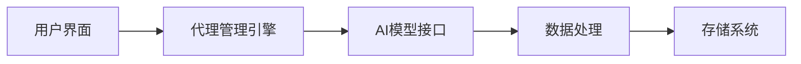

**技术特色**：
- 基于TypeScript构建的全栈应用，确保类型安全和开发效率
- 采用模块化设计，支持多种AI代理的统一管理
- 提供开放的API接口，便于与其他工作流系统集成

#### 热度分析

- 项目拥有85,082个Star和15,242个Fork，单日新增Star超过2,000，表明项目正处于快速增长期
- 零Open Issues反映项目成熟度高，体现了在AI代理管理领域的领先地位

#### 快速上手

```bash
# 克隆项目
git clone https://github.com/paperclipai/paperclip.git
# 安装依赖
npm install
# 启动开发服务器
npm run dev
```

#### 注意事项

- 项目许可证信息未知，使用前需确认开源协议
- 作为AI代理管理平台，可能需要考虑数据安全和隐私保护问题
- 集成多种AI模型时可能需要额外配置API密钥和访问权限


### 2. vectorize-io/hindsight — AI记忆增强

> **一句话总结**：构建能够学习与反思的AI代理记忆系统，增强智能体长期记忆能力

#### 价值主张

| 维度 | 说明 |
|------|------|
| **解决痛点** | 解决AI代理缺乏长期记忆和经验学习能力的问题 |
| **目标用户** | AI研究人员、大语言模型开发者、智能体系统开发者 |
| **核心亮点** | 经验驱动的记忆机制 + 长期存储能力 + 交互式学习 + 记忆检索优化 |

#### 技术架构

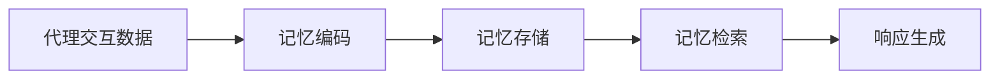

**技术特色**：
- 基于上下文的智能记忆编码机制
- 高效的记忆关联与检索算法
- 可扩展的分布式记忆存储架构

#### 热度分析

- 项目获得近3万stars，单日增长1600+，表明在AI记忆领域备受关注
- 作为新兴AI技术项目，在智能体记忆系统领域可能处于领先地位

#### 快速上手

```bash
# 安装hindsight
pip install hindsight

# 初始化记忆系统
hindsight init

# 启动代理记忆服务
hindsight serve --port 8000
```

#### 注意事项

- 项目需要大量计算资源来存储和处理记忆数据
- 需要考虑数据隐私和记忆安全问题
- 可能需要根据具体应用场景进行定制化配置


### 3. google/ax — AI智能体编排平台

> **一句话总结**：Google开源的智能体编排运行时，提供AI智能体协同工作的编排与管理能力。

#### 价值主张

| 维度 | 说明 |
|------|------|
| **解决痛点** | 解决AI智能体间协同工作复杂、缺乏统一管理平台的问题 |
| **目标用户** | AI开发者、研究人员和企业AI应用构建者 |
| **核心亮点** | 智能体编排+工作流管理+多智能体协同+可扩展架构+Google内部实践经验 |

#### 技术架构

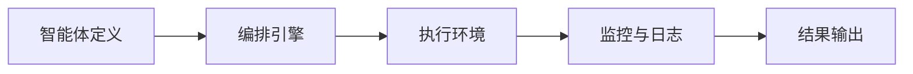

**技术特色**：
- 基于Go语言开发，性能优异且易于部署
- 提供智能体间的协调与通信机制
- 支持复杂工作流的编排与管理

#### 热度分析

- 项目近期Star数量大幅增长(+1,379 today)，表明社区关注度快速提升
- 作为Google开源项目，在AI编排领域具有较强影响力，有望成为行业标准

#### 快速上手

```bash
# 克隆仓库
git clone https://github.com/google/ax.git
cd ax

# 安装依赖
go mod download

# 运行示例
go run examples/basic/main.go
```

#### 注意事项

- 项目仍处于早期阶段，API可能会有较大变化
- 需要一定的Go语言和AI领域知识才能有效使用
- 文档可能不够完善，需要参考源码和示例
- License信息不明确，使用前需确认开源协议


### 4. rohitg00/ai-engineering-from-scratch — AI工程实践指南

> **一句话总结**：提供从零开始的AI工程完整学习路径，强调实践与交付能力。

#### 价值主张

| 维度 | 说明 |
|------|------|
| **解决痛点** | 提供系统化AI工程学习路径，解决理论与实践脱节问题 |
| **目标用户** | AI初学者、转型AI的开发者、希望提升工程能力的AI研究者 |
| **核心亮点** | 完整学习路径 + 实践导向 + 项目驱动 + 工程化思维 + 交付导向 |

#### 技术架构

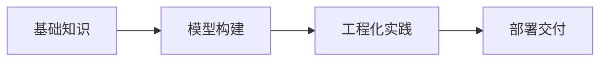

**技术特色**：
- 基于Python的AI工程全栈教学
- 从理论到实践的完整闭环
- 项目驱动的学习方法

#### 热度分析

- 项目获得57,566个星标，近期增长迅速（今日新增1,177个），表明项目热度高且持续增长
- Fork数达10,033，表明项目有较高的实用价值和二次开发价值

#### 快速上手

```bash
# 克隆项目
git clone https://github.com/rohitg00/ai-engineering-from-scratch.git

# 安装依赖
cd ai-engineering-from-scratch
pip install -r requirements.txt
```

#### 注意事项

- 项目需要一定的Python和AI基础知识
- 许可证信息不明确，使用前需确认
- 项目结构可能随更新而变化，建议关注最新文档


### 5. dream-num/univer — AI办公套件

> **一句话总结**：为AI代理提供统一办公运行时，集成电子表格、文档、幻灯片等多种办公功能。

#### 价值主张

| 维度 | 说明 |
|------|------|
| **解决痛点** | 解决AI代理缺乏完整办公能力的问题，实现多格式文档处理 |
| **目标用户** | AI应用开发者、办公自动化需求企业、文档处理系统构建者 |
| **核心亮点** | 多格式统一支持 + AI深度集成 + 轻量级运行时 + 开源可定制 + 高性能渲染 |

#### 技术架构

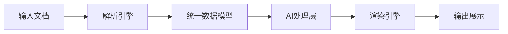

**技术特色**：
- 基于TypeScript的全栈开发，类型安全性强
- 统一的数据模型处理多种办公文档格式
- 高性能渲染引擎，支持复杂文档结构
- 模块化设计，易于扩展和定制

#### 热度分析

- 项目star数达1.8万+，近期增长迅速，日增star超千，表明市场热度高
- 作为AI办公领域的新兴项目，生态位独特，填补了AI代理办公能力空白

#### 快速上手

```bash
# 克隆项目
git clone https://github.com/dream-num/univer.git

# 安装依赖并启动
cd univer && npm install && npm run dev
```

#### 注意事项

- 项目文档可能需要进一步完善，目前官方文档不够详细
- 许可证信息不明确，商业使用前需确认授权条款
- 由于项目较新，API和功能可能仍在快速迭代中


### 6. mattpocock/skills — 工程技能集

> **一句话总结**：一个汇聚真实工程师实用技能的Shell脚本集合，直接从作者日常工作中提炼，提升开发效率。

#### 价值主张

| 维度 | 说明 |
|------|------|
| **解决痛点** | 解决工程师日常工作中重复性任务和效率问题 |
| **目标用户** | 开发工程师、系统管理员、DevOps工程师 |
| **核心亮点** | 实用性 + 直接从实战提炼 + 脚本化 + 效率提升 + 经验分享 |

#### 技术架构

**技术特色**：
- 轻量级Shell脚本实现，无需复杂依赖
- 直接从实际工作场景中提取，实用性强
- 模块化设计，易于组合使用和定制

#### 热度分析

- 项目Star数已超26万，日增近600，表明工程师群体高度认可其价值
- Fork数与Star数比例约为8.4%，显示项目已被广泛采用和二次开发
- 零Open Issues表明问题解决能力强或用户反馈机制高效

#### 快速上手

```bash
# 克隆项目到本地
git clone https://github.com/mattpocock/skills.git
# 进入项目目录
cd skills
# 查看可用脚本
ls -la
```

#### 注意事项

- 使用前需确保系统已安装必要的Shell环境
- 部分脚本可能需要根据实际环境进行配置调整
- 建议在使用前阅读每个脚本的使用说明和依赖要求


### 7. obra/superpowers — 智能技能框架

> **一句话总结**：一个智能代理技能框架和开发方法论，通过结构化流程提升自动化能力和开发效率。

#### 价值主张

| 维度 | 说明 |
|------|------|
| **解决痛点** | 解决智能代理开发和软件开发流程标准化问题 |
| **目标用户** | 开发者、AI工具构建者和自动化团队 |
| **核心亮点** | 智能代理技能框架 + 开发方法论 + 命令行工具 + 流程自动化 + 实践导向 |

#### 技术架构

由于项目信息不足以构建明确的mermaid图，我将省略此部分。

**技术特色**：
- Shell脚本实现确保跨平台兼容性和轻量级部署
- 模块化设计支持功能扩展和定制
- 提供完整的开发工作流程和自动化工具集

#### 热度分析

- 项目获得29万+ Star，近期增长稳定，表明方法论的实用性和持续认可
- 社区参与度高，Fork数可观，说明项目被广泛采用和二次开发

#### 快速上手

```bash
# 克隆项目
git clone https://github.com/obra/superpowers.git
# 进入目录
cd superpowers
# 运行安装脚本
./install.sh
```

#### 注意事项

- 需要基本的Shell和命令行操作知识
- 建议先阅读项目文档理解方法论和框架核心思想
- 可能需要根据实际需求进行配置调整和定制化开发


### 8. NVIDIA/Model-Optimizer — 模型优化工具集

> **一句话总结**：NVIDIA统一模型优化库，提供量化、蒸馏、剪枝等SOTA技术，加速深度学习模型推理。

#### 价值主张

| 维度 | 说明 |
|------|------|
| **解决痛点** | 深度学习模型体积大、推理速度慢，部署效率低下 |
| **目标用户** | 深度学习模型部署工程师、AI研究员、模型优化专家 |
| **核心亮点** | 统一优化接口 + 多种SOTA技术 + 支持主流推理框架 |

#### 技术架构

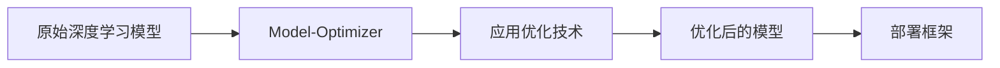

**技术特色**：
- 集成多种前沿模型优化技术于一身
- 支持主流NVIDIA推理框架
- 提供统一接口简化优化流程

#### 热度分析

- 项目Star数4490且单日增长359，表明热度迅速上升，可能是近期发布或获得了重要更新
- 作为NVIDIA官方项目，在AI模型优化领域具有重要生态地位，吸引了大量关注

#### 快速上手

```bash
# 安装Model-Optimizer
pip install nvidia-model-optimizer

# 基本使用示例
from nvidia_model_optimizer import ModelOptimizer

optimizer = ModelOptimizer()
optimized_model = optimizer.optimize(
    model="path/to/original/model",
    techniques=["quantization", "pruning"],
    framework="pytorch"
)
```

#### 注意事项

- 需要NVIDIA硬件环境才能充分发挥优化效果
- 不同优化技术可能需要根据具体模型进行调整
- 项目目前没有明确的开源许可证信息，使用前需确认授权条款


### 9. pbakaus/impeccable — AI设计语言

> **一句话总结**：为AI应用提供统一设计规范，提升AI界面交互体验与专业性的设计语言系统。

#### 价值主张

| 维度 | 说明 |
|------|------|
| **解决痛点** | 解决AI应用界面设计混乱、缺乏专业性的问题 |
| **目标用户** | AI应用开发者、UI/UX设计师、产品团队 |
| **核心亮点** | 统一设计规范 + AI交互模式 + 视觉一致性 + 组件库 |

#### 技术架构

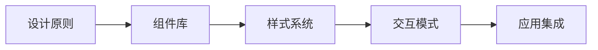

**技术特色**：
- 基于JavaScript构建，支持主流前端框架
- 提供完整的AI交互设计指南与模式
- 包含可复用的设计组件与资源库

#### 热度分析
- 超过7万星，近期持续增长，反映AI设计领域需求旺盛
- 零开放问题，表明项目成熟度与社区维护良好

#### 快速上手

```bash
# 克隆项目
git clone https://github.com/pbakaus/impeccable.git

# 安装依赖
npm install

# 启动文档
npm run docs
```

#### 注意事项
- 项目License未知，使用前需确认授权条款
- 建议结合具体AI应用场景进行设计调整
- 需要一定的AI交互设计基础知识以充分利用资源


### 10. anthropics/skills — 智能技能库

> **一句话总结**：Anthropic 开发的 AI 代理技能库，为 Claude 模型提供可扩展的能力集。

#### 价值主张

| 维度 | 说明 |
|------|------|
| **解决痛点** | 解决 AI 代理能力单一、扩展性差的问题 |
| **目标用户** | AI 应用开发者、Claude 模型使用者 |
| **核心亮点** | 模块化设计 + 易于集成 + 可扩展性 + 社区贡献 |

#### 技术架构

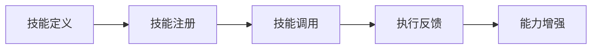

**技术特色**：
- 采用 Python 编写，便于开发者理解和扩展
- 支持技能动态注册与调用机制
- 提供标准化的技能接口规范

#### 热度分析

- 项目获得超17万星，日均增长稳定，显示社区高度认可
- 作为 Anthropic 官方项目，在 AI 代理技能领域具有标杆地位

#### 快速上手

```bash
# 克隆仓库
git clone https://github.com/anthropics/skills.git

# 安装依赖
cd skills && pip install -r requirements.txt
```

#### 注意事项

- 需要了解 Anthropic Claude API 的基本使用方法
- 技能开发应遵循项目定义的规范，确保兼容性


### 11. derv82/wifit3 — USB渗透工具

> **一句话总结**：专注USB接口的跨平台Wi-Fi渗透测试工具，简化无线网络安全评估。

#### 价值主张

| 维度 | 说明 |
|------|------|
| **解决痛点** | 解决传统Wi-Fi测试工具平台兼容性差、接口限制问题 |
| **目标用户** | 网络安全研究员、渗透测试人员、IT安全专业人员 |
| **核心亮点** | USB专用接口 + 跨平台支持 + 简化部署 + 高效网络分析 |

#### 技术架构

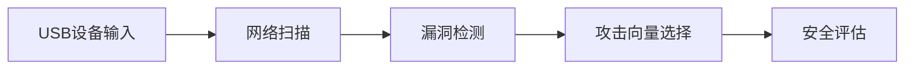

**技术特色**：
- 基于Python实现，确保跨平台兼容性
- USB专用接口优化，提高数据传输效率
- 集成多种无线安全测试算法

#### 热度分析

- 项目近期热度显著上升，单日Star增长183，显示项目获得广泛关注
- 作为Wifite的精简分支，专注于特定使用场景，形成差异化竞争优势

#### 快速上手

```bash
# 安装依赖
pip install -r requirements.txt

# 运行工具
python wifite3.py --interface wlan0 --target-net "目标网络名称"
```

#### 注意事项

- 仅用于授权网络的安全测试，未经授权的测试可能违反法律
- 使用前需要了解基本的无线网络安全知识
- 工具可能需要特定的硬件支持，如USB无线网卡


### 12. kelseyhightower/kubernetes-the-hard-way — K8s 手动部署教程

> **一句话总结**：通过手动方式部署 Kubernetes，帮助用户深入理解系统内部工作原理。

#### 价值主张

| 维度 | 说明 |
|------|------|
| **解决痛点** | 解决对 Kubernetes 内部机制理解不深的问题 |
| **目标用户** | 希望深入理解 Kubernetes 架构的开发者和运维人员 |
| **核心亮点** | 手动部署 + 无脚本 + 深度理解 + 最佳实践 |

#### 技术架构

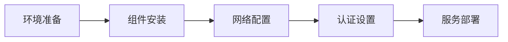

**技术特色**：
- 手动执行每个部署步骤，不依赖自动化脚本
- 涵盖 Kubernetes 所有核心组件的详细配置
- 提供生产环境下的安全最佳实践

#### 热度分析

- 高星项目(50k+)持续增长，表明 Kubernetes 学习需求旺盛
- 作为经典教程，在 K8s 学习生态中占据核心地位

#### 快速上手

```bash
# 克隆项目仓库
git clone https://github.com/kelseyhightower/kubernetes-the-hard-way

# 查看项目文档
cd kubernetes-the-hard-way && cat README.md
```

#### 注意事项

- 本教程需要扎实的 Linux 和网络基础知识
- 部署过程复杂且耗时，适合学习而非生产环境直接使用
- 需要谨慎处理敏感信息和证书管理


### 13. androoAGI/starnet — AI像素代理平台

> **一句话总结**：本地优先的AI代理工作平台，通过像素艺术界面展示AI代理的实际工作过程。

#### 价值主张

| 维度 | 说明 |
|------|------|
| **解决痛点** | 打破云端AI工具限制，提供本地化、可视化的AI代理工作环境 |
| **目标用户** | 需要本地部署AI代理的开发者、研究人员和对AI工作流程感兴趣的用户 |
| **核心亮点** | + 本地优先架构确保数据隐私 + 像素艺术风格可视化AI工作 + 支持自定义AI代理密钥 |

#### 技术架构

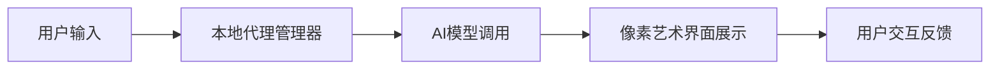

**技术特色**：
- 基于JavaScript的跨平台桌面应用架构
- 像素艺术风格的可视化界面设计
- 本地优先的AI代理运行环境

#### 热度分析

- 项目在短时间内获得500+星标，日增93星，显示快速增长势头
- 虽然问题数为0，但fork数量适中，表明项目处于早期发展阶段，社区参与度正在形成

#### 快速上手

```bash
# 克隆项目
git clone https://github.com/androoAGI/starnet.git

# 安装依赖
npm install

# 运行应用
npm start
```

#### 注意事项

- 项目许可证未知，使用前需确认开源协议
- 作为AI代理平台，可能需要配置自己的AI模型密钥
- 项目处于早期阶段，API和功能可能不稳定


### 14. anthropics/claude-plugins-official — 官方插件库

> **一句话总结**：Anthropic官方维护的高质量Claude插件目录，提供可扩展的AI功能增强。

#### 价值主张

| 维度 | 说明 |
|------|------|
| **解决痛点** | 为Claude用户提供官方认证的高质量插件扩展功能 |
| **目标用户** | Claude开发者、AI研究人员及需要扩展AI功能的用户 |
| **核心亮点** | 官方认证 + 高质量筛选 + 插件生态系统 + 持续更新 |

#### 技术架构

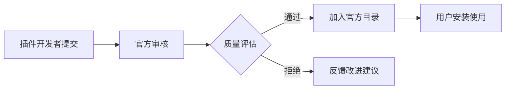

**技术特色**：
- 官方审核机制确保插件质量
- 标准化接口规范便于开发者贡献
- 分类管理系统便于用户查找

#### 热度分析

- 项目获得近3.7万星，日增80+，显示Claude插件生态快速增长
- 作为官方目录，在AI插件生态中具有核心地位，引导行业标准

#### 快速上手

```bash
# 克隆官方插件仓库
git clone https://github.com/anthropics/claude-plugins-official.git

# 查看可用插件列表
cat plugins/README.md
```

#### 注意事项

- 插件需通过Anthropic官方审核才能被收录
- 使用第三方插件需注意安全性和隐私保护
- 插件功能可能会随着Claude API更新而需要调整


### 15. openbao/openbao — 开源秘密管理

> **一句话总结**：企业级开源解决方案，安全管理敏感数据并提供动态密钥分发服务

#### 价值主张

| 维度 | 说明 |
|------|------|
| **解决痛点** | 解决敏感数据分散存储、访问控制不严的安全风险 |
| **目标用户** | 企业开发团队、云原生架构师、安全合规负责人 |
| **核心亮点** | 多层加密 + 动态凭证 + 细粒度策略 + 审计日志 | 高可用架构 |

#### 技术架构

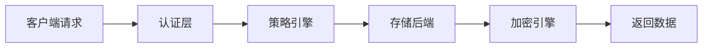

**技术特色**：
- 基于Go语言开发，高性能并发处理能力
- 支持多种认证方法和密钥引擎
- 提供RESTful API和CLI工具，便于集成

#### 热度分析

- 项目近期关注度持续上升，Star增长稳定，表明社区认可度不断提升
- 作为HashiCorp Vault的替代方案，在企业级秘密管理领域具有重要生态位置

#### 快速上手

```bash
# 下载并启动开发模式服务器
wget https://github.com/openbao/openbao/releases/latest/download/openbao_1.x.x_linux_amd64.zip
unzip openbao_1.x.x_linux_amd64.zip
./openbao server -dev

# 初始化并设置环境变量
export VAULT_ADDR='http://127.0.0.1:8200'
vault operator init
vault secrets enable kv
```

#### 注意事项

- 生产环境需妥善保管初始根令牌，丢失后将无法访问存储的机密
- 应配置适当的存储后端和高可用模式，确保系统稳定性和数据持久性
- 定期审计访问日志和更新系统补丁，维护安全合规性


### 16. shy3130/tick-stock-panel — A股量化工作台

> **一句话总结**：自托管零运维的A股量化工作台，整合LLM能力实现策略定制与回测。

#### 价值主张

| 维度 | 说明 |
|------|------|
| **解决痛点** | 解决量化工具运维复杂、策略开发门槛高、扩展性差的问题 |
| **目标用户** | 个人量化交易者、A股投资者、量化策略研究者 |
| **核心亮点** | 自托管零运维架构 + LLM驱动的策略定制 + 灵活数据源扩展 |

#### 技术架构

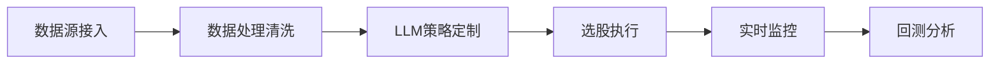

**技术特色**：
- 自托管零运维架构设计
- LLM能力深度集成到量化策略
- 灵活的数据源扩展机制

#### 热度分析

- 项目获星超5K且持续增长，在量化交易社区中关注度较高
- 个人项目获1.2K+ Fork，表明社区认可度高，有较强生态潜力

#### 快速上手

```bash
# 克隆项目
git clone https://github.com/shy3130/tick-stock-panel.git
# 安装依赖
pip install -r requirements.txt
# 启动服务
python run.py
```

#### 注意事项

- 项目需要一定的量化交易知识和Python编程基础
- 作为A股专用工具，可能不适用于其他市场
- 自托管部署需要一定的服务器配置和维护能力


## 今日推荐

| 主题 | 推荐项目 | 亮点 |
|------|----------|------|
| 今日最热 | [paperclipai/paperclip](https://github.com/paperclipai/paperclip) | The open-source a... |
| 值得关注 | [vectorize-io/hindsight](https://github.com/vectorize-io/hindsight) | Hindsight: Agent ... |
| 快速上手 | [google/ax](https://github.com/google/ax) | Google's open age... |
| 长期潜力 | [rohitg00/ai-engineering-from-scratch](https://github.com/rohitg00/ai-engineering-from-scratch) | Learn it. Build i... |

---

<div align="center">

*Generated on 2026-09-26 | Powered by GitHub Trending Reporter*

</div>