## 今日热点

AI代理管理工具与工程化资源引领今日热榜，显示出AI技术从理论研究向实用工具转变的趋势，同时移动自动化和安全工具也获得显著关注。

---

## 热门项目一览

| 排名 | 项目 | 语言 | 今日 | 总计 | 简介 |
|:---:|------|:----:|------:|-----:|------|
| 1 | [paperclipai/paperclip](https://github.com/paperclipai/paperclip) | TypeScript | +2,608 | 87,515 | The open-source app everyon... |
| 2 | [vectorize-io/hindsight](https://github.com/vectorize-io/hindsight) | Python | +2,147 | 32,373 | Hindsight: Agent Memory Tha... |
| 3 | [dream-num/univer](https://github.com/dream-num/univer) | TypeScript | +849 | 19,323 | The Office Harness for AI A... |
| 4 | [rohitg00/ai-engineering-from-scratch](https://github.com/rohitg00/ai-engineering-from-scratch) | Python | +827 | 58,430 | Learn it. Build it. Ship it... |
| 5 | [openbao/openbao](https://github.com/openbao/openbao) | Go | +364 | 8,020 | OpenBao is a software solut... |
| 6 | [zhaoxuya520/reverse-skill](https://github.com/zhaoxuya520/reverse-skill) | PowerShell | +361 | 38,047 | Reverse Engineering / Autho... |
| 7 | [NVIDIA/Model-Optimizer](https://github.com/NVIDIA/Model-Optimizer) | Python | +357 | 4,775 | A unified library of SOTA m... |
| 8 | [block/buzz](https://github.com/block/buzz) | Rust | +339 | 34,845 | A hive mind communication p... |
| 9 | [mobile-next/mobile-mcp](https://github.com/mobile-next/mobile-mcp) | TypeScript | +168 | 7,390 | Model Context Protocol Serv... |
| 10 | [microsoft/vscode](https://github.com/microsoft/vscode) | TypeScript | +95 | 193,084 | Visual Studio Code |
| 11 | [vercel/next.js](https://github.com/vercel/next.js) | JavaScript | +54 | 142,654 | The React Framework |
| 12 | [tensorflow/tensorflow](https://github.com/tensorflow/tensorflow) | C++ | +46 | 200,472 | An Open Source Machine Lear... |

---

## 趋势洞察

```
┌─────────────────────────────────────────────────────────────────┐
│  AI/ML 工具         ████████████████████████  9 个项目        │
│  其他               █████                     2 个项目        │
│  开发框架             ██                        1 个项目        │
│  多媒体应用            ██                        1 个项目        │
│  智能家居             ██                        1 个项目        │
│  数据分析             ██                        1 个项目        │
└─────────────────────────────────────────────────────────────────┘
```

---

## 项目深度解读

### 1. paperclipai/paperclip — [AI工作流管理]

> **一句话总结**：企业级AI代理管理平台，统一团队工作流程与自动化任务处理。

#### 价值主张

| 维度 | 说明 |
|------|------|
| **解决痛点** | 解决企业中多个AI工具分散管理、协作效率低的问题 |
| **目标用户** | 企业团队、AI开发者、需要整合AI工作流的管理者 |
| **核心亮点** | 统一代理管理 + 工作流编排 + 权限控制 + 性能监控 + 团队协作 |

#### 技术架构

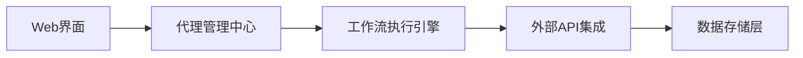

**技术特色**：
- 基于TypeScript的现代化全栈架构，支持高并发和可扩展性
- 插件化设计允许轻松添加新的AI代理和集成服务
- 提供完整的企业级功能，包括身份验证、审计日志和数据分析

#### 热度分析

- 项目Star数8.7万且日增2600+，表明处于爆发式增长阶段，市场热度极高
- Fork数1.5万+，社区活跃度高，企业应用和二次开发案例丰富

#### 快速上手

```bash
# 克隆项目
git clone https://github.com/paperclipai/paperclip.git

# 安装依赖
npm install

# 启动开发服务器
npm run dev
```

#### 注意事项

- 项目许可证信息不明确，商业使用前需确认授权条款
- 技术支持主要通过社区渠道（如Discord、论坛等）进行，而非GitHub Issues


### 2. vectorize-io/hindsight — AI记忆增强系统

> **一句话总结**：构建可学习的AI代理记忆系统，增强智能体对历史信息的利用能力。

#### 价值主张

| 维度 | 说明 |
|------|------|
| **解决痛点** | AI代理缺乏长期记忆和上下文连贯性，难以有效利用历史交互经验 |
| **目标用户** | AI研究人员、智能体开发者、需要长期记忆能力的应用开发者 |
| **核心亮点** | 持续学习 + 记忆检索 + 上下文整合 + 自适应更新 + 可扩展架构 |

#### 技术架构


**技术特色**：
- 采用向量嵌入技术存储和检索记忆片段
- 实现动态记忆更新和遗忘机制
- 支持多模态记忆内容处理

#### 热度分析

- 项目近期获得大量关注，单日增长超过2000 stars，表明技术方向受到高度认可
- 0个Open Issues反映项目维护良好，社区问题解决及时

#### 快速上手

```bash
# 安装项目
pip install hindsight

# 初始化记忆系统
from hindsight import MemorySystem
memory = MemorySystem()

# 添加交互记忆
memory.add_interaction(user_input, agent_response)

# 检索相关记忆
relevant_memories = memory.retrieve(query)
```

#### 注意事项

- 项目可能需要大量计算资源来处理和存储记忆数据
- 记忆隐私和安全性需要特别关注，特别是处理敏感用户信息时
- 可能需要根据具体应用场景调整记忆检索策略和参数


### 3. dream-num/univer — AI办公运行时

> **一句话总结**：为AI代理提供一站式办公套件运行环境，集成电子表格、文档等多种办公组件。

#### 价值主张

| 维度 | 说明 |
|------|------|
| **解决痛点** | 解决AI代理缺乏统一办公环境的问题，实现多格式文档处理 |
| **目标用户** | 需要AI处理办公文档的开发者和企业用户 |
| **核心亮点** | 支持多种办公格式 + 统一API接口 + 可扩展架构 + 跨平台兼容 + AI原生设计 |

#### 技术架构

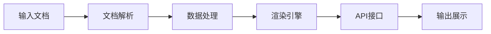

**技术特色**：
- 基于TypeScript开发，提供类型安全保障
- 模块化设计，支持插件系统扩展功能
- 统一API接口处理多种办公文档格式

#### 热度分析

- 项目近期增长迅速，单日新增849个Star，显示社区对其高度认可
- 作为AI办公领域的重要项目，已形成活跃的开发者生态，是AI代理办公处理的领先解决方案

#### 快速上手

```bash
# 安装univer核心模块
npm install @univer/core @univer/sheets @univer/docs

# 初始化univer应用
import { Univer } from '@univer/core';
const univer = new Univer();
```

#### 注意事项

- 项目需要一定的TypeScript和前端开发基础，不适合初学者直接使用
- 由于项目仍在快速发展中，API可能会有较大变化，需关注版本更新


### 4. rohitg00/ai-engineering-from-scratch — AI工程学习指南

> **一句话总结**：从零开始构建、部署AI系统的完整学习路径，理论与实践结合。

#### 价值主张

| 维度 | 说明 |
|------|------|
| **解决痛点** | 提供系统化AI工程学习路径，解决理论与实践脱节问题 |
| **目标用户** | AI初学者、希望转型AI领域的工程师 |
| **核心亮点** | 项目驱动学习 + 完整工程流程 + 实用工具链 + 实战案例 |

#### 技术架构


**技术特色**：
- 覆盖AI全生命周期学习
- 结合实际项目案例
- 提供工程化最佳实践
- 强调可部署性而非仅研究

#### 热度分析

- 项目高关注度，近一个月增长迅速，日均新增星标约827个
- 社区活跃度高，Fork比例约17.4%，表明用户积极参与实践

#### 快速上手

```bash
# 克隆项目
git clone https://github.com/rohitg00/ai-engineering-from-scratch.git

# 安装依赖
cd ai-engineering-from-scratch
pip install -r requirements.txt
```

#### 注意事项

- 项目依赖较多，建议使用虚拟环境安装
- 需要一定编程基础，特别是Python
- 部分章节可能需要GPU支持加速训练


### 6. zhaoxuya520/reverse-skill — AI安全路由

> **一句话总结**：AI驱动的安全技能路由系统，自动选择最适合工具链，支持多种AI编程客户端。

#### 价值主张

| 维度 | 说明 |
|------|------|
| **解决痛点** | 解决安全研究人员面对复杂工具选择时的决策困难 |
| **目标用户** | 逆向工程师、渗透测试人员、安全研究人员 |
| **核心亮点** | AI智能路由 + 按需工具链自举 + 自进化知识库 + 多AI客户端支持 |

#### 技术架构

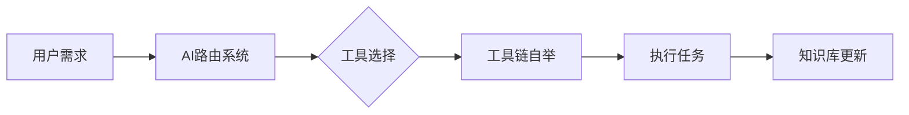

**技术特色**：
- 基于PowerShell的跨平台兼容性
- 智能工具链自动配置与部署
- 支持多种AI编程客户端的集成接口

#### 热度分析

- 项目获得38,047个Star，今日增长361，表明项目在安全研究领域有很高关注度
- 5,278个Fork显示社区活跃度高，表明项目被广泛使用和定制

#### 快速上手

```bash
# 克隆项目
git clone https://github.com/zhaoxuya520/reverse-skill.git

# 初始化环境
cd reverse-skill
powershell -ExecutionPolicy Bypass -File init.ps1
```

#### 注意事项

- 本工具仅适用于授权的安全研究和测试，未经授权使用可能违反法律
- 使用前需确保已安装PowerShell和相关依赖
- 知识库会持续更新，建议定期同步最新版本


### 7. NVIDIA/Model-Optimizer — 模型优化工具集

> **一句话总结**：NVIDIA统一模型优化库，提供量化、蒸馏、剪枝等技术，压缩模型并加速推理。

#### 价值主张

| 维度 | 说明 |
|------|------|
| **解决痛点** | 深度学习模型体积大、推理速度慢，需要优化技术压缩并提升效率 |
| **目标用户** | 深度学习工程师、模型部署专家、AI系统优化者 |
| **核心亮点** | 多种优化技术集成 + 统一API接口 + NVIDIA生态兼容 + 高性能推理优化 + 易于部署 |

#### 技术架构

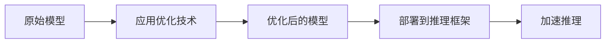

**技术特色**：
- 集成量化、蒸馏、剪枝、神经架构搜索等多种前沿优化技术
- 针对NVIDIA生态系统优化，与TensorRT-LLM、TensorRT、vLLM等框架深度集成
- 提供统一API接口，简化模型优化流程，降低使用门槛

#### 热度分析
- 项目Star数近4800，单日增长357，显示近期关注度快速上升，与AI模型优化需求激增相关
- 由NVIDIA开发，作为AI硬件厂商的软件生态布局，处于模型优化工具链的关键位置

#### 快速上手

```bash
# 安装Model-Optimizer
pip install nvidia-model-optimizer

# 基本使用示例
from nvidia_model_optimizer import ModelOptimizer

optimizer = ModelOptimizer()
optimized_model = optimizer.optimize(
    model="path/to/original/model",
    techniques=["quantization", "pruning"],
    framework="pytorch"
)
optimized_model.save("path/to/optimized/model")
```

#### 注意事项
- 需要NVIDIA GPU环境才能发挥最佳性能
- 不同优化技术可能影响模型精度，需评估精度与速度的权衡
- 与特定NVIDIA框架集成时，需确保版本兼容性
- 项目Open Issues为0，可能社区反馈渠道有限


### 8. block/buzz — 蜂群思维通信平台

> **一句话总结**：构建分布式蜂群思维通信系统，实现群体意识实时共享与协同决策。

#### 价值主张

| 维度 | 说明 |
|------|------|
| **解决痛点** | 解决分布式团队实时协作与集体智慧共享的通信难题 |
| **目标用户** | 分布式团队、开源社区、远程协作组织 |
| **核心亮点** | 去中心化通信 + 实时协同思维 + 集体智慧汇聚 + 高性能Rust实现 |

#### 技术架构

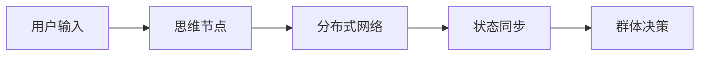

**技术特色**：
- 基于Rust的高性能分布式通信架构
- 去中心化P2P消息传递与状态同步机制
- 蜂群思维算法实现群体智能决策

#### 热度分析

- 34k+高星项目，日增300+星，增长势头强劲
- 零未解决问题，社区维护良好，处于上升期

#### 快速上手

```bash
git clone https://github.com/block/buzz
cd buzz
cargo run --release
```

#### 注意事项

- 项目可能需要一定的Rust和分布式系统知识
- 由于描述较为简略，建议查看项目README获取更详细的使用说明


### 9. mobile-next/mobile-mcp — 移动自动化协议

> **一句话总结**：为移动设备自动化和抓取提供基于MCP协议的统一解决方案，支持多平台设备。

#### 价值主张

| 维度 | 说明 |
|------|------|
| **解决痛点** | 移动应用自动化测试和数据抓取缺乏统一高效的跨平台解决方案 |
| **目标用户** | 移动应用测试工程师、自动化开发者、数据抓取专业人员 |
| **核心亮点** | 支持多平台设备 + 基于MCP协议 + 统一接口设计 + 高度可扩展 + TypeScript实现 |

#### 技术架构

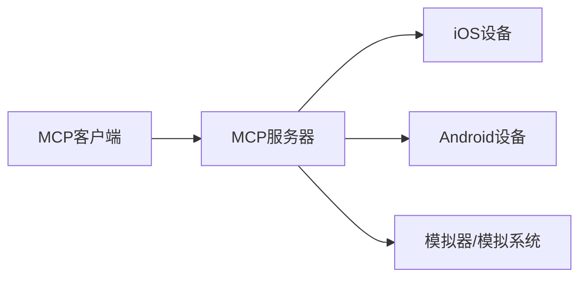

**技术特色**：
- 基于Model Context Protocol实现标准化通信协议
- TypeScript提供类型安全和优秀的开发体验
- 统一的自动化接口抽象不同平台差异

#### 热度分析

- 项目获得7390个Star且近期增长迅速(今日+168)，显示社区高度关注和认可
- Fork数643表明开发者社区积极参与，正在构建移动自动化领域标准解决方案

#### 快速上手

```bash
# 安装依赖
npm install

# 启动服务器
npm start

# 连接移动设备
mcp connect --device ios
```

#### 注意事项

- 项目许可证信息未知，使用时需注意合规性
- Open Issues为0，可能表示问题管理方式特殊或通过其他渠道反馈
- 需确保目标移动设备的调试权限已正确开启
- 可能需要额外配置才能支持特定移动设备或应用


### 10. microsoft/vscode — 全能代码编辑器

> **一句话总结**：微软开发的轻量级但功能强大的跨平台源代码编辑器，支持丰富的扩展和调试功能。

#### 价值主张

| 维度 | 说明 |
|------|------|
| **解决痛点** | 解决开发者需要轻量级但功能全面的编辑器需求，无需重型IDE即可获得高效开发体验 |
| **目标用户** | 软件开发人员，特别是需要跨平台支持且注重扩展性的开发者 |
| **核心亮点** | 跨平台支持 + 丰富的扩展生态 + 强大的调试功能 + 内置终端 + Git集成 |

#### 技术架构

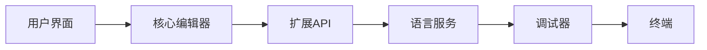

**技术特色**：
- 基于Electron框架构建，结合Web技术与原生应用性能
- 使用TypeScript开发，提供类型安全和更好的开发体验
- 采用插件化架构，支持丰富的第三方扩展和自定义功能

#### 热度分析

- 作为微软旗舰级开发工具，拥有19万+星和4万+fork，表明其在开发者社区中广受欢迎且持续增长
- 作为开发工具生态系统的核心，拥有庞大的扩展市场和活跃的开发社区

#### 快速上手

```bash
# 下载并安装VS Code
# 访问 https://code.visualstudio.com/ 下载对应平台的安装包

# 安装常用扩展
code --install-extension ms-python.python
code --install-extension ms-vscode.vscode-json
code --install-extension ms-vscode.vscode-typescript-next

# 打开项目文件夹
code /path/to/your/project
```

#### 注意事项

- VS Code基于Electron框架，资源占用相对较高
- 部分高级功能可能需要配置或安装特定扩展
- 对于大型项目，可能需要调整VS Code的性能设置


### 11. vercel/next.js — React全栈框架

> **一句话总结**：支持服务端渲染、静态生成和客户端渲染的React全栈开发框架。

#### 价值主张

| 维度 | 说明 |
|------|------|
| **解决痛点** | 解决React应用SEO优化困难、首屏加载慢的问题 |
| **目标用户** | React开发者、Web应用开发团队、需要高性能渲染的前端项目 |
| **核心亮点** | 服务端渲染(SSR) + 静态站点生成(SSG) + API路由 + 文件系统路由 + 增量静态再生成 |

#### 技术架构

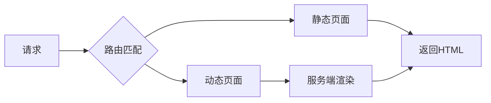

**技术特色**：
- 基于React的服务端渲染框架，支持同构应用开发
- 文件系统路由，API路由简化后端集成
- 静态增量再生成(ISR)优化性能和内容更新

#### 热度分析

- Star数超14万，增长稳定，是前端领域最受欢迎的框架之一
- 社区活跃度高，生态丰富，有大量插件和工具支持

#### 快速上手

```bash
# 创建新项目
npx create-next-app@latest my-app
# 进入项目目录
cd my-app
# 启动开发服务器
npm run dev
```

#### 注意事项

- 需要Node.js环境，建议使用LTS版本
- 学习曲线较陡，需要理解React和Node.js相关知识
- 大型项目需要合理规划路由结构和代码分割策略


### 12. tensorflow/tensorflow — 端到端机器学习平台

> **一句话总结**：Google开源的全栈式机器学习框架，提供从数据处理到模型部署的完整解决方案

#### 价值主张

| 维度 | 说明 |
|------|------|
| **解决痛点** | 统一机器学习开发流程，降低AI应用门槛，解决模型训练部署复杂性 |
| **目标用户** | 数据科学家、机器学习工程师、研究人员和AI应用开发者 |
| **核心亮点** | 灵活计算图架构 + 丰富预训练模型库 + 强大分布式训练 + 跨平台部署 |

#### 技术架构

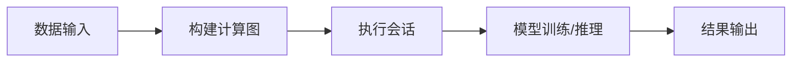

**技术特色**：
- 基于数据流图的灵活计算模型，支持静态图和动态图执行
- 丰富的API层次，从底层C++到高层Python/Keras接口
- 自动微分系统，简化梯度计算过程
- 分布式训练框架，支持参数服务器和AllReduce策略
- TensorFlow Lite和TensorFlow Serving提供边缘和云端部署能力

#### 热度分析

- TensorFlow作为Google主导的开源项目，拥有20万+星，持续稳定增长，是机器学习领域最受欢迎项目之一
- 作为AI基础设施核心组件，在学术界和工业界广泛影响力，形成庞大生态系统

#### 快速上手

```bash
# 安装TensorFlow
pip install tensorflow

# 验证安装
python -c "import tensorflow as tf; print(tf.__version__)"
```

#### 注意事项

- TensorFlow版本更新较快，API变化可能影响代码兼容性，建议锁定版本
- 完整功能安装需要较大资源，可根据需求选择轻量级安装
- 复杂模型训练建议配置GPU加速环境，提升性能
- 学习曲线相对陡峭，建议从Keras高级API入手，逐步深入底层机制


### 13. llvm/llvm-project — 编译器基础设施

> **一句话总结**：LLVM提供模块化、可重用的编译器基础设施，支持多语言编译与优化。

#### 价值主张

| 维度 | 说明 |
|------|------|
| **解决痛点** | 解决编译器开发复杂度高、可重用性差的问题，提供统一编译框架 |
| **目标用户** | 编译器开发者、编程语言设计者、高性能计算应用开发者 |
| **核心亮点** | 模块化设计 + 全面的优化框架 + 多语言支持 + 工具链完整 |

#### 技术架构

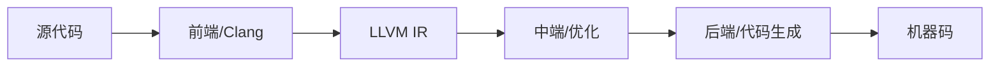

**技术特色**：
- LLVM中间表示(IR)提供跨语言的统一优化平台
- 编译器即库的设计理念，支持灵活集成与定制
- 全面的优化框架支持多层次代码优化

#### 热度分析

- LLVM项目拥有超4万星，持续稳定增长，表明其在编译器领域的重要地位
- 作为编译器基础设施，被广泛应用于工业界和学术界，形成强大生态系统

#### 快速上手

```bash
# 获取源码
git clone https://github.com/llvm/llvm-project.git

# 创建构建目录
mkdir llvm-build && cd llvm-build

# 配置和构建
cmake -G "Unix Makefiles" ../llvm-project/llvm
make -j$(nproc)
```

#### 注意事项

- LLVM构建过程复杂，需要大量时间和计算资源
- 项目庞大，初次接触应先从子项目(如Clang)开始了解
- 文档分散在多个仓库，需要系统学习才能全面掌握


### 14. anthropics/claude-code-action — Claude代码操作工具

> **一句话总结**：为开发者提供与Claude AI集成的代码操作工具，简化代码生成和编辑流程。

#### 价值主张

| 维度 | 说明 |
|------|------|
| **解决痛点** | 解决AI辅助代码生成与集成的复杂流程问题 |
| **目标用户** | 软件开发人员与AI工具使用者 |
| **核心亮点** | 与Claude深度集成 + 代码智能生成 + 自动化代码操作 + 开发流程优化 |

#### 技术架构


**技术特色**：
- 基于TypeScript开发，确保类型安全
- 与Claude API无缝对接
- 模块化设计便于扩展

#### 热度分析

- 项目获得9k+星标，近期31日增长31，显示稳定上升趋势
- 作为Anthropic官方项目，在AI辅助开发领域占据重要生态位置

#### 快速上手

```bash
# 安装
npm install anthropics/claude-code-action

# 初始化
npx claude-code-action init
```

#### 注意事项

- 需要有效的Claude API访问权限
- 建议在使用前熟悉Claude模型的使用限制


### 15. actions/runner-images — CI/CD 基础镜像

> **一句话总结**：提供 GitHub Actions Runner 的官方容器镜像，支持多语言和工具环境。

#### 价值主张

| 维度 | 说明 |
|------|------|
| **解决痛点** | 为 GitHub Actions 提供标准化运行环境，确保 CI/CD 流程一致性 |
| **目标用户** | 使用 GitHub Actions 进行自动化构建、测试和部署的开发者 |
| **核心亮点** | 多语言支持 + 官方维护 + 多种预配置环境 + 轻量级 + 可定制 |

#### 技术架构

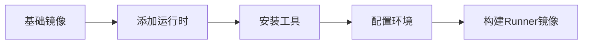

**技术特色**：
- 基于 Windows Server 和 Linux 的多平台支持
- 提供预配置的工具链和运行时环境
- 支持自定义镜像以满足特定项目需求

#### 热度分析

- 高星项目，13k+ stars，显示其在 GitHub Actions 生态系统中的核心地位
- 作为官方维护项目，拥有稳定的社区贡献和持续更新

#### 快速上手

```bash
# 使用官方 runner 镜像运行 GitHub Actions
docker run -it --rm ghcr.io/actions/runner:latest
```

#### 注意事项

- 需要配合 GitHub Actions 工作流文件使用
- 定期更新镜像以获取最新的安全补丁和工具更新
- 根据项目需求选择合适的 runner 变体


## 今日推荐

| 主题 | 推荐项目 | 亮点 |
|------|----------|------|
| 今日最热 | [paperclipai/paperclip](https://github.com/paperclipai/paperclip) | The open-source a... |
| 值得关注 | [vectorize-io/hindsight](https://github.com/vectorize-io/hindsight) | Hindsight: Agent ... |
| 快速上手 | [dream-num/univer](https://github.com/dream-num/univer) | The Office Harnes... |
| 长期潜力 | [rohitg00/ai-engineering-from-scratch](https://github.com/rohitg00/ai-engineering-from-scratch) | Learn it. Build i... |

---

<div align="center">

*Generated on 2026-09-27 | Powered by GitHub Trending Reporter*

</div>