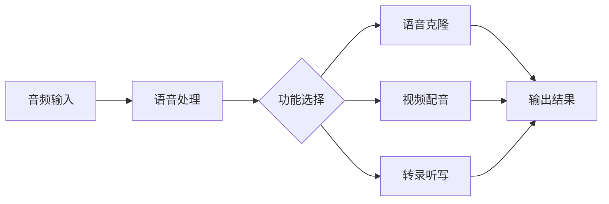
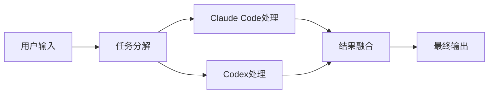
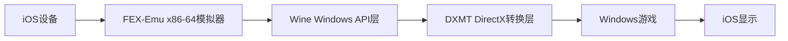

## 今日热点

今日GitHub热榜核心趋势为AI代理技术爆发式增长和语音AI开源替代品兴起，表明AI正从单点工具向系统化、多代理协作方向演进。

---

## 热门项目一览

| 排名 | 项目 | 语言 | 今日 | 总计 | 简介 |
|:---:|------|:----:|------:|-----:|------|
| 1 | [vectorize-io/hindsight](https://github.com/vectorize-io/hindsight) | Python | +4,520 | 37,578 | Hindsight: Agent Memory Tha... |
| 2 | [debpalash/VoiceStudio](https://github.com/debpalash/VoiceStudio) | Python | +3,086 | 40,378 | VoiceStudio is the open-sou... |
| 3 | [paperclipai/paperclip](https://github.com/paperclipai/paperclip) | TypeScript | +2,401 | 90,166 | The open-source app everyon... |
| 4 | [dream-num/univer](https://github.com/dream-num/univer) | TypeScript | +895 | 20,499 | The Office Harness for AI A... |
| 5 | [rohitg00/ai-engineering-from-scratch](https://github.com/rohitg00/ai-engineering-from-scratch) | Python | +790 | 59,420 | Learn it. Build it. Ship it... |
| 6 | [InfinityLoop1308/PipePipe](https://github.com/InfinityLoop1308/PipePipe) | Shell | +242 | 6,617 | An open-source Android app ... |
| 7 | [mvschwarz/openrig](https://github.com/mvschwarz/openrig) | TypeScript | +114 | 1,046 | Multi-agent harness that ru... |
| 8 | [vercel-labs/scriptc](https://github.com/vercel-labs/scriptc) | TypeScript | +102 | 5,436 | TypeScript-to-Native Compiler |
| 9 | [willfaust/Madeira](https://github.com/willfaust/Madeira) | C | +83 | 843 | Run x86-64 Windows PC games... |

---

## 趋势洞察

```
┌─────────────────────────────────────────────────────────────────┐
│  AI/ML 工具         ████████████████████████  6 个项目        │
│  其他               ████████                  2 个项目        │
│  多媒体应用            ████                      1 个项目        │
└─────────────────────────────────────────────────────────────────┘
```

---

## 项目深度解读

### 1. vectorize-io/hindsight — 智能体记忆系统

> **一句话总结**：构建能够学习、存储和检索的AI智能体记忆系统，实现长期上下文理解。

#### 价值主张

| 维度 | 说明 |
|------|------|
| **解决痛点** | 解决AI智能体记忆碎片化、上下文丢失和长期学习能力不足的问题 |
| **目标用户** | AI开发者、智能体系统构建者、LLM应用研究人员 |
| **核心亮点** + 记忆向量存储 + 自适应学习机制 + 上下文重组能力 + 高效检索系统 |

#### 技术架构


**技术特色**：
- 基于向量化的记忆存储实现高效检索
- 动态记忆权重调整机制
- 多层次记忆结构设计
- 语义相似性计算
- 记忆衰减与更新策略

#### 热度分析

- 项目近期激增4,520 stars，表明技术方向高度契合当前AI智能体发展需求
- Zero open issues反映项目成熟度与社区维护质量，可能已成为行业标准解决方案

#### 快速上手

```bash
# 安装Hindsight
pip install hindsight-ai

# 初始化记忆系统
from hindsight import AgentMemory
memory = AgentMemory()

# 添加体验记忆
memory.add_experience("User asked about weather", context="morning conversation")

# 检索相关记忆
relevant = memory.relevant_memories("How's the weather today?")
```

#### 注意事项

- 许可证信息不明确，商业应用前需进一步确认授权条款
- 项目处于高速迭代期，API可能存在向后兼容性风险
- 大规模部署时需考虑向量存储的扩展性和检索性能优化


### 2. debpalash/VoiceStudio — 本地语音处理平台

> **一句话总结**：开源本地语音处理工具，支持克隆、配音和转录等功能，覆盖646种语言，无需API调用。

#### 价值主张

| 维度 | 说明 |
|------|------|
| **解决痛点** | 解决云端语音服务依赖和隐私问题，提供本地化语音处理方案 |
| **目标用户** | 需要语音克隆、配音或转录功能的开发者和内容创作者 |
| **核心亮点** | 完全本地运行 + 支持646种语言 + 多种语音功能集成 + 开源免费 |

#### 技术架构



**技术特色**：
- 基于Python构建，易于部署和扩展
- 支持本地运行，保护用户数据隐私
- 集成多种语音处理技术于一身

#### 热度分析

- 项目近期增长迅猛，单日新增Star超过3000，表明社区关注度极高
- 作为ElevenLabs的开源替代品，满足了用户对隐私保护和本地化处理的需求

#### 快速上手

```bash
# 克隆项目
git clone https://github.com/debpalash/VoiceStudio.git

# 安装依赖
pip install -r requirements.txt

# 运行应用
python app.py
```

#### 注意事项

- 项目许可证未知，可能存在使用限制
- 作为语音处理工具，可能需要较高的计算资源
- 项目中提到了646种语言支持，但实际效果可能因语言而异


### 3. paperclipai/paperclip — 智能代理管理

> **一句话总结**：开源工作代理管理平台，帮助企业高效组织AI助手团队

#### 价值主张

| 维度 | 说明 |
|------|------|
| **解决痛点** | 解决企业多代理协作混乱、任务分配不明确的问题 |
| **目标用户** | 需要管理多个AI助手的企业团队和开发者 |
| **核心亮点** | + 集中代理管理 + 任务编排 + 工作流程自动化 + 团队协作 + 开源可定制 |

#### 技术架构


**技术特色**：
- 基于TypeScript构建的全栈应用，确保类型安全
- 模块化代理架构，支持自定义AI能力
- 工作流编排引擎，实现复杂任务自动化

#### 热度分析

- 项目Star数超9万，近期增长迅猛，日均增长2400+，表明市场需求强烈
- 高Fork数(1.5万+)反映社区活跃度高，用户参与贡献意愿强烈

#### 快速上手

```bash
# 克隆仓库
git clone https://github.com/paperclipai/paperclip.git

# 安装依赖
npm install

# 启动开发服务器
npm run dev
```

#### 注意事项

- 项目使用TypeScript开发，需要Node.js环境
- 作为开源项目，用户可自行部署但需关注许可证合规性
- 由于项目Star数增长极快，可能处于快速发展阶段，API和功能可能会有较大变化


### 4. dream-num/univer — AI办公引擎

> **一句话总结**：为AI代理提供统一办公运行时，集成电子表格、文档、幻灯片等多格式支持。

#### 价值主张

| 维度 | 说明 |
|------|------|
| **解决痛点** | 解决AI代理缺乏统一办公环境的问题，提供多格式文档处理能力 |
| **目标用户** | AI应用开发者、企业数字化团队、办公自动化解决方案提供商 |
| **核心亮点** | 多格式统一支持 + AI代理专用优化 + 开源可定制 + 跨平台兼容 + 高性能渲染 |

#### 技术架构


**技术特色**：
- 基于TypeScript开发，提供类型安全的API
- 统一的数据模型支持多种办公格式转换
- 模块化设计，支持按需引入功能
- 高性能渲染引擎，适合复杂文档处理
- 针对AI场景优化的接口设计

#### 热度分析

- 项目Star数超过2万，近期增长迅速（日增近900星），表明项目热度高且受关注
- Fork数相对较少（1724），说明更多用户倾向于直接使用而非派生开发
- 无Open Issues，可能表明项目维护良好或问题处理及时

#### 快速上手

```bash
# 安装Univer
npm install @univerjs/pro

# 初始化Univer实例
import { Univer } from '@univerjs/pro';
const univer = new Univer();

# 加载电子表格
import { UniverSheet } from '@univerjs/sheets';
univer.register(UniverSheet);
```

#### 注意事项

- 项目依赖较多，安装时需注意版本兼容性
- 完整功能可能需要商业授权，开源版本可能有功能限制
- 文档和示例代码可能不够全面，需要深入源码理解API


### 5. rohitg00/ai-engineering-from-scratch — AI工程学习路径

> **一句话总结**：从零开始系统学习AI工程，构建并部署AI应用的完整指南。

#### 价值主张

| 维度 | 说明 |
|------|------|
| **解决痛点** | 提供系统化、实践导向的AI工程学习路径，解决碎片化学习难题 |
| **目标用户** | AI初学者、转型AI领域的工程师、计算机相关专业学生 |
| **核心亮点** | 完整学习路径+实战项目+可部署成品+社区支持 |

#### 技术架构


**技术特色**：
- 基于Python的AI工具链集成
- 端到端项目实践流程
- 理论与实践相结合的教学方法

#### 热度分析

- 项目获得近6万星，近期增长迅速，表明AI工程学习需求旺盛
- 高fork比例(17.3%)显示社区积极参与和贡献热情

#### 快速上手

```bash
# 克隆项目
git clone https://github.com/rohitg00/ai-engineering-from-scratch.git

# 进入项目目录
cd ai-engineering-from-scratch
```

#### 注意事项

- 项目可能需要一定的Python基础和机器学习基础知识
- 建议按照项目推荐的顺序学习，以获得最佳学习体验
- 注意项目依赖的Python版本和库版本兼容性


### 6. InfinityLoop1308/PipePipe — 自由访问工具

> **一句话总结**：开源Android应用，让用户绕过地区限制自由访问YouTube等在线服务。

#### 价值主张

| 维度 | 说明 |
|------|------|
| **解决痛点** | 绕过地区限制和网络封锁，自由访问被屏蔽的视频平台 |
| **目标用户** | 受地理或网络限制无法访问特定服务的Android用户 |
| **核心亮点** | 开源透明 + 轻量级 + 无需root + 隐私保护 + 界面友好 |

#### 技术架构


**技术特色**：
- 基于Shell脚本构建，轻量级实现
- 采用代理技术绕过访问限制
- 无需root权限即可运行

#### 热度分析

- Star数持续增长(6617星，单日增长242)，表明项目获得广泛认可和活跃用户
- Fork数相对较少(223)，说明用户更多是直接使用而非二次开发

#### 快速上手

```bash
# 克隆项目仓库
git clone https://github.com/InfinityLoop1308/PipePipe.git

# 构建APK(需要Android开发环境)
./build.sh

# 安装APK到设备
adb install app/build/outputs/apk/release/app-release.apk
```

#### 注意事项

- 此类应用可能违反某些服务条款，请谨慎使用
- 在某些地区使用此类工具可能存在法律风险
- 请注意保护个人隐私和安全
- 项目需要定期更新以应对平台的访问限制变化


### 7. mvschwarz/openrig — AI多智能体协作

> **一句话总结**：集成Claude Code与Codex的多智能体系统，协同提升代码生成与优化能力

#### 价值主张

| 维度 | 说明 |
|------|------|
| **解决痛点** | 突破单一AI模型局限，整合多种AI能力实现代码优化 |
| **目标用户** | 需要强大AI辅助编程的专业开发团队 |
| **核心亮点** | 多智能体协作 + Claude与Codex互补 + 系统级集成 |

#### 技术架构



**技术特色**：
- TypeScript实现确保类型安全与跨平台兼容
- 多智能体任务分配与结果融合机制
- Claude与Codex能力互补优化

#### 热度分析

- 项目Star数快速增长，今日新增114星，显示近期关注度显著提升
- 作为新兴AI协作工具，在开发者社区中形成独特定位

#### 快速上手

```bash
# 克隆项目
git clone https://github.com/mvschwarz/openrig.git
cd openrig

# 安装依赖并启动
npm install
npm start
```

#### 注意事项

- 项目许可证信息未知，使用前需确认开源协议
- 可能需要配置Claude和OpenAI API密钥以启用完整功能
- 建议先阅读项目文档了解最佳实践配置方式


### 8. vercel-labs/scriptc — TS原生编译器

> **一句话总结**：将TypeScript代码直接编译为原生代码，兼顾类型安全与执行性能。

#### 价值主张

| 维度 | 说明 |
|------|------|
| **解决痛点** | 解决JS执行性能瓶颈，提供类型安全的原生代码生成方案 |
| **目标用户** | 需要高性能计算的前端开发者、TypeScript项目团队 |
| **核心亮点** | 类型安全 + 原生性能 + TS语法支持 + 跨平台编译 |

#### 技术架构


**技术特色**：
- 直接编译TypeScript为原生代码，绕过中间转换步骤
- 保持TypeScript类型系统的完整性和类型检查
- 支持跨平台编译，生成对应平台原生代码

#### 热度分析

- 项目Star数达5436且持续增长(+102 today)，显示开发者对TypeScript原生编译的强烈需求
- 作为Vercel实验室项目，拥有较高关注度，但Fork数相对较少，表明用户更多关注使用而非二次开发

#### 快速上手

```bash
# 安装ScriptC
npm install -g @vercel/scriptc

# 编译TypeScript文件为原生代码
scriptc input.ts --output output

# 运行编译后的原生代码
./output
```

#### 注意事项

- 项目可能处于实验阶段，API和功能可能会有较大变化
- 兼容性可能有限，某些TypeScript特性可能不支持
- 原生编译可能导致代码体积增加，需权衡性能提升与包大小


### 9. willfaust/Madeira — [iOS游戏模拟器]

> **一句话总结**：在iOS沙箱环境中通过FEX-Emu+Wine+DXMT技术栈实现x86-64 Windows游戏运行。

#### 价值主张

| 维度 | 说明 |
|------|------|
| **解决痛点** | 突破iOS系统限制，实现Windows游戏在iOS设备上运行 |
| **目标用户** | 希望在iOS设备上玩Windows游戏的玩家 |
| **核心亮点** | 沙箱环境执行 + x86-64模拟 + Wine集成 + DX图形加速 |

#### 技术架构



**技术特色**：
- 利用FEX-Emu实现x86-64指令在ARM架构上的高效模拟
- 集成Wine提供Windows API兼容层，无需Windows系统
- 通过DXMT实现DirectX到图形API的转换，支持游戏图形渲染
- 在iOS沙箱环境中完成整个执行流程，保持系统安全性

#### 热度分析

- 项目近期增长迅速，单日新增83个Star，显示社区对该技术方案高度关注
- 作为iOS游戏模拟领域的创新项目，填补了市场空白，吸引了大量技术爱好者

#### 快速上手

```bash
# 克隆项目仓库
git clone https://github.com/willfaust/Madeira.git

# 编译安装依赖
cd Madeira && make install
```

#### 注意事项

- 需要越狱的iOS设备，无法在非越狱环境中运行
- 性能可能受限，不是所有Windows游戏都能完美运行
- 需要一定的技术背景进行配置和调试
- 项目许可证不明确，使用前需确认授权条款


## 今日推荐

| 主题 | 推荐项目 | 亮点 |
|------|----------|------|
| 今日最热 | [vectorize-io/hindsight](https://github.com/vectorize-io/hindsight) | Hindsight: Agent ... |
| 值得关注 | [debpalash/VoiceStudio](https://github.com/debpalash/VoiceStudio) | VoiceStudio is th... |
| 快速上手 | [paperclipai/paperclip](https://github.com/paperclipai/paperclip) | The open-source a... |
| 长期潜力 | [dream-num/univer](https://github.com/dream-num/univer) | The Office Harnes... |

---

<div align="center">

*Generated on 2026-09-28 | Powered by GitHub Trending Reporter*

</div>