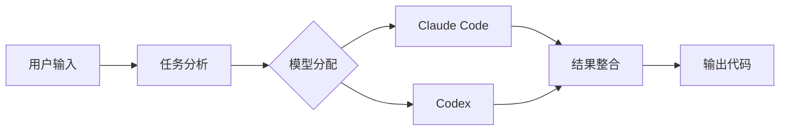

## 今日热点

AI代理工具与语音处理技术引领今日热榜，开源替代方案需求激增，多模态AI应用成为开发焦点。

---

## 热门项目一览

| 排名 | 项目 | 语言 | 今日 | 总计 | 简介 |
|:---:|------|:----:|------:|-----:|------|
| 1 | [vectorize-io/hindsight](https://github.com/vectorize-io/hindsight) | Python | +4,561 | 41,224 | Hindsight: Agent Memory Tha... |
| 2 | [debpalash/VoiceStudio](https://github.com/debpalash/VoiceStudio) | Python | +3,221 | 44,576 | VoiceStudio is the open-sou... |
| 3 | [paperclipai/paperclip](https://github.com/paperclipai/paperclip) | TypeScript | +3,197 | 93,095 | The open-source app everyon... |
| 4 | [dream-num/univer](https://github.com/dream-num/univer) | TypeScript | +1,099 | 21,354 | The Office Harness for AI A... |
| 5 | [mvschwarz/openrig](https://github.com/mvschwarz/openrig) | TypeScript | +734 | 1,814 | Multi-agent harness that ru... |
| 6 | [byoungd/up](https://github.com/byoungd/up) | JavaScript | +327 | 64,852 | An advanced guide which mig... |
| 7 | [cs341-illinois/coursebook](https://github.com/cs341-illinois/coursebook) | TeX | +195 | 2,580 | Open Source Introductory Sy... |
| 8 | [NawfalMotii79/PLFM_RADAR](https://github.com/NawfalMotii79/PLFM_RADAR) | PLSQL | +158 | 25,809 | Open-source, low-cost 10.5 ... |

---

## 趋势洞察

```
┌─────────────────────────────────────────────────────────────────┐
│  AI/ML 工具         ████████████████████████  5 个项目        │
│  其他               █████████                 2 个项目        │
│  多媒体应用            ████                      1 个项目        │
└─────────────────────────────────────────────────────────────────┘
```

---

## 项目深度解读

### 1. vectorize-io/hindsight — AI记忆系统

> **一句话总结**：为AI代理提供持久化记忆与学习能力，实现长期知识积累与上下文理解。

#### 价值主张

| 维度 | 说明 |
|------|------|
| **解决痛点** | 解决AI代理短期记忆限制，实现长期知识积累与上下文理解 |
| **目标用户** | AI开发者、研究人员及构建智能代理系统的工程师 |
| **核心亮点** | 持久化记忆系统 + 动态学习机制 + 上下文感知能力 + 知识检索增强 |

#### 技术架构


**技术特色**：
- 采用向量数据库实现高效记忆检索
- 实现动态学习机制持续优化记忆系统
- 支持长期记忆与短期记忆的智能整合

#### 热度分析

- 项目star数超4万，单日增长超4500，显示AI记忆系统领域热度急剧上升
- 无开放issues表明项目维护质量高，社区问题解决效率高

#### 快速上手

```bash
# 克隆项目
git clone https://github.com/vectorize-io/hindsight.git
cd hindsight

# 安装依赖
pip install -r requirements.txt

# 基础使用示例
python -m hindsight --help
```

#### 注意事项

- 许可证信息不明确，商业使用前需确认授权条款
- 项目可能依赖特定版本的Python和第三方库
- 由于项目热度高，代码可能快速迭代，注意API兼容性


### 2. debpalash/VoiceStudio — 本地语音处理平台

> **一句话总结**：开源本地化语音处理解决方案，支持多语言语音克隆与音频生成，无需云端依赖。

#### 价值主张

| 维度 | 说明 |
|------|------|
| **解决痛点** | 解决语音处理依赖云端、隐私风险高、费用昂贵的问题 |
| **目标用户** | 内容创作者、语音开发者、有声书制作团队、多语言服务提供商 |
| **核心亮点** | 开源可定制 + 646种语言支持 + 完全本地处理 + 多功能语音处理 + 无需API订阅 |

#### 技术架构


**技术特色**：
- 基于 Python 的端到端语音处理流水线
- 本地模型运行，保护用户隐私数据
- 支持多语言语音合成与识别，覆盖646种语言

#### 热度分析

- 项目在短时间内获得大量关注，单日新增星星超过3000，表明需求旺盛
- 作为ElevenLabs的本地替代方案，满足了用户对隐私保护和成本控制的需求

#### 快速上手

```bash
# 克隆项目
git clone https://github.com/debpalash/VoiceStudio.git
# 安装依赖
pip install -r requirements.txt
# 运行应用
python app.py
```

#### 注意事项

- 项目依赖较高的计算资源，推荐使用GPU加速
- 某些功能可能需要预训练模型，确保有足够的存储空间
- 项目许可证信息不明确，使用前应确认授权条款


### 3. paperclipai/paperclip — AI代理管理平台

> **一句话总结**：开源AI代理管理平台，助力团队高效协作与自动化工作流程。

#### 价值主张

| 维度 | 说明 |
|------|------|
| **解决痛点** | 团队协作中AI代理分散、管理困难和工作流程不连贯的问题 |
| **目标用户** | 需要整合和管理多个AI代理的团队和企业用户 |
| **核心亮点** | 集中化代理管理 + 工作流程自动化 + 团队协作增强 + 开源可定制 |

#### 技术架构


**技术特色**：
- 基于TypeScript构建的全栈应用，确保类型安全
- 模块化代理架构支持灵活扩展
- 开源设计促进社区协作和功能迭代

#### 热度分析

- 项目获得超过9.3万星，近期增长迅速，显示其在AI代理管理领域的强大吸引力
- 作为开源项目，拥有活跃的社区贡献和广泛的用户基础

#### 快速上手

```bash
# 克隆项目
git clone https://github.com/paperclipai/paperclip.git

# 安装依赖
npm install

# 启动开发服务器
npm run dev
```

#### 注意事项

- 项目许可证未知，在使用前需要确认具体的开源许可条款
- 由于Open Issues为0，可能表示项目处于早期阶段或问题管理方式不同
- 作为AI代理管理工具，使用时需考虑数据安全和隐私保护问题


### 4. dream-num/univer — AI办公套件运行时

> **一句话总结**：一站式AI办公套件运行时，支持多种文档格式和AI代理集成。

#### 价值主张

| 维度 | 说明 |
|------|------|
| **解决痛点** | 解决AI代理环境中整合多种办公文档格式的统一运行问题 |
| **目标用户** | 需要集成AI与办公软件的开发者和企业用户 |
| **核心亮点** | 多格式统一支持 + AI代理深度集成 + 开源可定制 |

#### 技术架构


**技术特色**：
- 基于TypeScript的全栈开发架构
- 统一的文档处理引擎设计
- 支持电子表格、文档、幻灯片等多种格式

#### 热度分析

- 项目Star数达21,354，单日新增1,099，表明热度迅速上升
- Fork数1,808显示社区参与度高，项目处于活跃发展阶段

#### 快速上手

```bash
# 安装univer核心包
npm install @univer/core

# 初始化项目
npx create-univer-app my-app
```

#### 注意事项

- 项目许可证信息未知，使用时需注意版权问题
- Issues数量为0，可能表明项目使用其他渠道处理问题反馈


### 5. mvschwarz/openrig — AI代码协同系统

> **一句话总结**：集成Claude与Codex的多智能体代码生成协同框架，提升AI编程效率

#### 价值主张

| 维度 | 说明 |
|------|------|
| **解决痛点** | 解决单一AI模型代码生成局限，提供更全面的编程辅助 |
| **目标用户** | AI开发者、研究人员、需要高级编程辅助的专业人士 |
| **核心亮点** | 多智能体协同 + 模型优势互补 + 开放架构 + TypeScript实现 |

#### 技术架构



**技术特色**：
- 多智能体协同工作流设计
- TypeScript类型安全保证
- 模型优势互补策略
- 开放式架构扩展

#### 热度分析

- 项目近期Star增长迅猛，单日增长734，显示技术社区高度关注
- 虽Issues为零，但需关注项目维护状态和许可证合规性

#### 快速上手

```bash
# 克隆项目
git clone https://github.com/mvschwarz/openrig.git

# 安装依赖
npm install

# 运行示例
npm run example
```

#### 注意事项

- 项目许可证未知，商业使用前需确认授权条款
- 集成AI模型需确保API访问权限和合规性
- 项目处于早期阶段，API和功能可能不稳定


### 6. byoungd/up — 个人成长指南

> **一句话总结**：韩先凯创建的个人全面发展指南，涵盖AI学习、英语提升与人生进阶策略。

#### 价值主张

| 维度 | 说明 |
|------|------|
| **解决痛点** | 提供系统化个人成长路径，解决学习方向迷茫问题 |
| **目标用户** | 自我提升者、AI学习者、英语学习爱好者 |
| **核心亮点** + 实用性高 + 内容全面 + 持续更新 + 个人经验分享 |

#### 技术架构


**技术特色**：
- 基于Markdown的文档组织结构
- 分类清晰的知识体系构建
- 实践导向的内容设计

#### 热度分析

- 高星项目表明内容质量获得广泛认可，近期增长迅速
- 作为个人指南项目，社区参与度相对较低但影响力广泛

#### 快速上手

```bash
# 克隆项目到本地
git clone https://github.com/byoungd/up.git

# 浏览文档内容
cd up && ls
```

#### 注意事项
- 项目内容为个人经验总结，需结合自身情况选择性应用
- 部分内容可能带有主观观点，建议批判性吸收


### 7. cs341-illinois/coursebook — 系统编程教材

> **一句话总结**：伊利诺伊大学开源系统编程教材，理论与实践结合，适合计算机专业学习。

#### 价值主张

| 维度 | 说明 |
|------|------|
| **解决痛点** | 提供权威系统编程教材，弥补高校开源教育资源不足 |
| **目标用户** | 计算机专业学生，特别是系统编程初学者 |
| **核心亮点** | + 名校教授编写 + 实例丰富 + 内容全面 + 持续更新 |

#### 技术架构


**技术特色**：
- 使用TeX排版系统，确保专业学术排版效果
- 源码开放，支持社区贡献和内容改进
- 结构化内容组织，便于维护和知识更新

#### 热度分析

- 项目近期增长迅速，单日新增195星，显示高质量教材需求旺盛
- 作为高校教材项目，在计算机教育领域具有特殊参考价值

#### 快速上手

```bash
# 克隆仓库
git clone https://github.com/cs341-illinois/coursebook.git

# 编译生成PDF
cd coursebook
pdflatex main.tex
```

#### 注意事项

- 需要安装TeX发行版(如TeX Live)才能编译源文件
- 项目内容基于伊利诺伊大学课程，可能需要根据其他院校情况调整
- 建议使用专业TeX编辑器(如TeXstudio、VS Code + LaTeX Workshop)进行阅读和编辑


### 8. NawfalMotii79/PLFM_RADAR — [PLFM相控雷达]

> **一句话总结**：开源低成本10.5GHz PLFM相控阵雷达系统，提供完整硬件设计与信号处理方案。

#### 价值主张

| 维度 | 说明 |
|------|------|
| **解决痛点** | 降低高端雷达系统实现门槛，提供开源替代方案 |
| **目标用户** | 研究机构、无线电爱好者、雷达系统开发者 |
| **核心亮点** | 低成本实现 + 10.5GHz高频段 + PLFM技术 + 开源硬件 + 完整信号处理 |

#### 技术架构


**技术特色**：
- 基于 PLFM(伪线性调频)技术的雷达信号处理算法
- 10.5GHz 高频段实现，提供高分辨率探测能力
- 开源硬件设计文档，降低系统实现成本

#### 热度分析

- 项目获得超过25k stars，在开源雷达领域具有重要影响力
- 5.8k forks显示社区积极参与复制和二次开发
- 无 open issues表明项目成熟或问题通过其他渠道解决

#### 快速上手

```bash
# 克隆项目仓库
git clone https://github.com/NawfalMotii79/PLFM_RADAR.git

# 查看项目文档
cd PLFM_RADAR
cat README.md

# 检查硬件设计文件
ls hardware/
```

#### 注意事项

- 项目涉及高频电子设计，需要射频专业知识才能正确实现
- 雷达系统使用可能受当地无线电法规限制，使用前需确认合法性
- 10.5GHz 频段需要特殊电子元件和工具，不是普通爱好者容易实现的
- 项目可能需要专业射频测试设备进行验证，这些设备通常价格昂贵


## 今日推荐

| 主题 | 推荐项目 | 亮点 |
|------|----------|------|
| 今日最热 | [vectorize-io/hindsight](https://github.com/vectorize-io/hindsight) | Hindsight: Agent ... |
| 值得关注 | [debpalash/VoiceStudio](https://github.com/debpalash/VoiceStudio) | VoiceStudio is th... |
| 快速上手 | [paperclipai/paperclip](https://github.com/paperclipai/paperclip) | The open-source a... |
| 长期潜力 | [dream-num/univer](https://github.com/dream-num/univer) | The Office Harnes... |

---

<div align="center">

*Generated on 2026-09-29 | Powered by GitHub Trending Reporter*

</div>