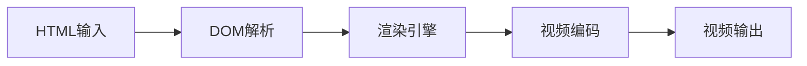
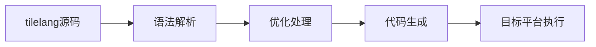
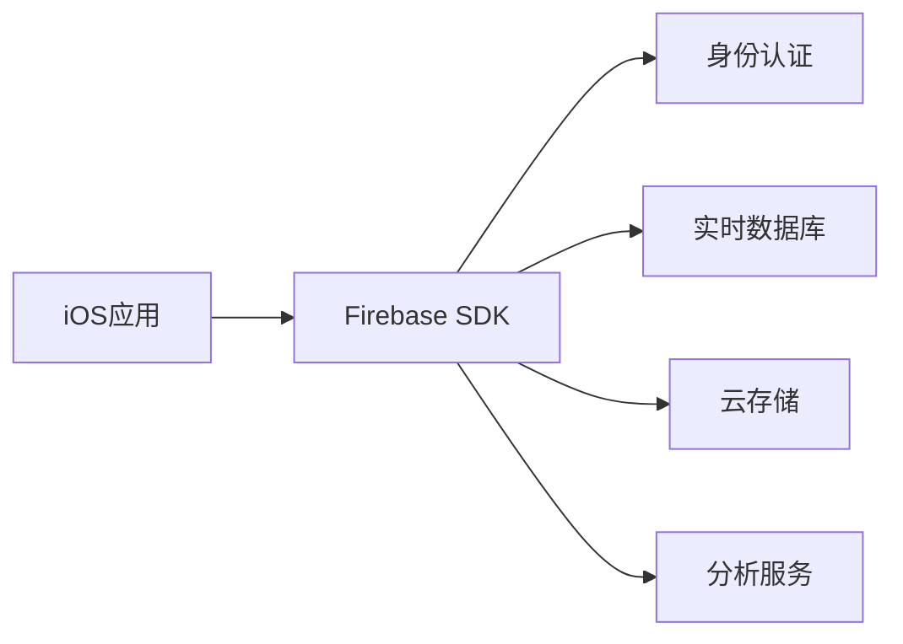

## 今日热点

AI代理工具与开发效率框架引领今日热榜，NVIDIA OpenShell的安全私有运行时与ponytail的"懒惰开发者"理念凸显AI代理技术正从概念走向实用化。

---

## 热门项目一览

| 排名 | 项目 | 语言 | 今日 | 总计 | 简介 |
|:---:|------|:----:|------:|-----:|------|
| 1 | [NVIDIA/OpenShell](https://github.com/NVIDIA/OpenShell) | Rust | +2,456 | 14,068 | OpenShell is the safe, priv... |
| 2 | [DietrichGebert/ponytail](https://github.com/DietrichGebert/ponytail) | JavaScript | +1,194 | 150,639 | Makes your AI agent think l... |
| 3 | [mattpocock/skills](https://github.com/mattpocock/skills) | Shell | +883 | 273,998 | Skills for Real Engineers. ... |
| 4 | [mvschwarz/openrig](https://github.com/mvschwarz/openrig) | TypeScript | +642 | 3,780 | Build your own network of a... |
| 5 | [heygen-com/hyperframes](https://github.com/heygen-com/hyperframes) | TypeScript | +627 | 55,403 | Write HTML. Render video. B... |
| 6 | [pbakaus/impeccable](https://github.com/pbakaus/impeccable) | JavaScript | +495 | 73,746 | The design language that ma... |
| 7 | [obra/superpowers](https://github.com/obra/superpowers) | Shell | +455 | 294,024 | An agentic skills framework... |
| 8 | [HunxByts/GhostTrack](https://github.com/HunxByts/GhostTrack) | Python | +368 | 16,449 | Useful tool to track locati... |
| 9 | [mksglu/context-mode](https://github.com/mksglu/context-mode) | TypeScript | +362 | 24,811 | Context window optimization... |
| 10 | [pablostanley/yoinks](https://github.com/pablostanley/yoinks) | TypeScript | +361 | 2,995 | yoink any video from your t... |
| 11 | [earendil-works/pi](https://github.com/earendil-works/pi) | TypeScript | +298 | 111,284 | AI agent toolkit: unified L... |
| 12 | [Friedrich-M/UniMate](https://github.com/Friedrich-M/UniMate) | Python | +217 | 1,098 | [SIGGRAPH Asia 2026] UniMat... |

---

## 趋势洞察

```
┌─────────────────────────────────────────────────────────────────┐
│  AI/ML 工具         ████████████████████████  10 个项目        │
│  其他               ███████                   3 个项目        │
│  多媒体应用            ██                        1 个项目        │
│  开发工具             ██                        1 个项目        │
└─────────────────────────────────────────────────────────────────┘
```

---

## 项目深度解读

### 1. NVIDIA/OpenShell — AI安全运行时

> **一句话总结**：为自主AI代理提供安全私有运行环境，保障数据隐私与系统安全。

#### 价值主张

| 维度 | 说明 |
|------|------|
| **解决痛点** | 解决AI代理执行过程中的安全漏洞与数据隐私泄露风险 |
| **目标用户** | AI开发者、企业级AI应用构建者、隐私敏感型AI项目 |
| **核心亮点** | 内存安全保证 + 隐私计算保护 + 高性能运行时 + NVIDIA生态集成 |

#### 技术架构


**技术特色**：
- Rust语言编写，提供内存安全保障
- 沙箱化执行环境，隔离AI代理行为
- 支持NVIDIA GPU加速，提升AI推理性能

#### 热度分析

- 单日增长2,456 stars，显示社区对AI安全解决方案的高度关注
- NVIDIA背书项目，在AI安全领域具有标杆地位，生态潜力巨大

#### 快速上手

```bash
# 安装OpenShell
cargo install openshell

# 运行AI代理
openshell run --model <model_path> --input <input_data>
```

#### 注意事项

- 项目许可证信息不明确，使用前需确认授权条款
- 作为NVIDIA项目，可能需要特定GPU硬件支持以获得最佳性能
- 项目处于早期阶段，API可能不稳定，建议关注更新日志


### 2. DietrichGebert/ponytail — AI 代码助手

> **一句话总结**：让 AI 代理模拟资深开发者思维，实现自动化高效编程。

#### 价值主张

| 维度 | 说明 |
|------|------|
| **解决痛点** | 减少开发者编写重复性代码的工作量 |
| **目标用户** | 前端/全栈开发者，追求高效编程的工程师 |
| **核心亮点** | AI 驱动的代码生成 + 懒人思维模式 + 高效编码 |

#### 技术架构


**技术特色**：
- 基于 AI 的智能代码生成
- 模拟资深开发者思维模式
- 减少样板代码的自动化处理

#### 热度分析

- 项目获得超过 15 万星，增长迅速，表明在开发者社区中高度受欢迎
- 无开放问题，表明项目成熟且维护良好

#### 快速上手

```bash
# 安装 ponytail
npm install ponytail

# 在项目中使用
npx ponytail --init
```

#### 注意事项

- 需要理解 AI 生成的代码可能需要人工审查
- 项目依赖 AI 服务，可能需要网络连接
- 建议在使用前了解项目的具体功能和使用场景


### 3. mattpocock/skills — 工程师实用集

> **一句话总结**：工程师实用Shell脚本集合，提供日常开发高效工具，提升工作效率。

#### 价值主张

| 维度 | 说明 |
|------|------|
| **解决痛点** | 解决工程师日常重复性任务和复杂命令执行痛点，提供现成可用脚本 |
| **目标用户** | 开发人员、系统管理员、DevOps工程师等命令行使用者 |
| **核心亮点** | 实用性强 + 覆盖面广 + 即开即用 + 高度可定制 + 持续更新 |

#### 技术架构


**技术特色**：
- 轻量级Shell脚本，无需复杂依赖环境
- 模块化设计，便于按需使用和扩展
- 提供详细文档和使用说明，降低学习成本

#### 热度分析

- 项目获27万+星，单日新增近900星，表明其解决了广大开发者的实际需求，热度持续攀升
- 零开放问题反映项目维护良好，用户问题可能通过其他渠道或自行解决

#### 快速上手

```bash
# 克隆项目
git clone https://github.com/mattpocock/skills.git

# 进入目录
cd skills

# 查看可用脚本
ls -la
```

#### 注意事项

- 由于项目许可证未知，商业使用前需确认授权情况
- Shell脚本在不同操作系统上可能存在兼容性问题，使用前需测试
- 建议在使用前阅读每个脚本的文档，了解其具体用途和参数


### 4. mvschwarz/openrig — AI代理协作平台

> **一句话总结**：构建基于Claude、Codex和Pi的持久AI代理网络，实现角色分工与上下文共享的协作系统。

#### 价值主张

| 维度 | 说明 |
|------|------|
| **解决痛点** | 解决AI代理间协作与上下文共享难题，构建持久化智能团队 |
| **目标用户** | AI开发者、研究人员、需要AI协作工具的团队 |
| **核心亮点** | 多模型协作 + 持久团队 + 角色分工 + 共享上下文 + 所有权管理 |

#### 技术架构


**技术特色**：
- 基于TypeScript构建，提供类型安全开发环境
- 支持多种AI模型(Claude、Codex、Pi)无缝集成
- 实现代理间的持久化连接与上下文共享机制
- 提供灵活的角色分工与任务分配系统
- 开放的扩展架构，便于自定义代理功能

#### 热度分析

- 项目Star数增长迅猛，单日新增642 stars，显示社区高度关注
- 虽然Issues为0，但Fork数量表明项目已被多个团队采用和二次开发

#### 快速上手

```bash
# 克隆仓库
git clone https://github.com/mvschwarz/openrig.git

# 安装依赖
npm install

# 启动服务
npm start
```

#### 注意事项

- 项目License未知，商业使用前需确认授权方式
- 目前Open Issues为0，可能项目处于早期阶段，社区支持有限
- 需要确保使用的AI模型API有相应的访问权限


### 5. heygen-com/hyperframes — HTML视频渲染器

> **一句话总结**：将HTML代码直接渲染为视频内容，专为自动化视频生成而设计的工具。

#### 价值主张

| 维度 | 说明 |
|------|------|
| **解决痛点** | 简化HTML到视频的转换流程，降低视频内容自动化生成门槛 |
| **目标用户** | 内容创作者、开发者、营销人员及需要自动化生成视频的AI代理 |
| **核心亮点** | HTML直接渲染 + 自动化工作流 + 智能体集成 |

#### 技术架构



**技术特色**：
- 基于浏览器内核的HTML渲染技术
- 支持CSS动画和JavaScript交互
- 高效的视频编码与压缩算法

#### 热度分析

- 项目星数超5.5万且每日增长600+，表明正处在技术采纳期
- 零开放问题显示项目成熟度高，维护良好

#### 快速上手

```bash
# 安装
npm install hyperframes

# 基本使用
import { render } from 'hyperframes';
render('<h1>视频内容</h1>', { output: 'video.mp4' });
```

#### 注意事项

- 项目许可证信息不明确，使用前需确认授权条款
- 需评估其对复杂HTML/CSS特性的支持程度
- 注意渲染性能与视频质量之间的平衡


### 6. pbakaus/impeccable — AI设计语言

> **一句话总结**：Impeccable是专为AI应用优化的设计语言框架，提升交互体验与界面一致性。

#### 价值主张

| 维度 | 说明 |
|------|------|
| **解决痛点** | AI应用界面设计混乱，缺乏统一规范与优化策略 |
| **目标用户** | AI应用开发者、UI/UX设计师、产品团队 |
| **核心亮点** | 组件化设计系统 + AI交互优化 + 响应式布局 + 主题定制 |

#### 技术架构


**技术特色**：
- 基于JavaScript的模块化组件架构
- 针对AI交互场景的优化设计
- 跨平台一致的视觉体验

#### 热度分析

- 项目获73,746 stars，日增495，显示AI设计领域的高关注度
- Fork数4,441，表明社区活跃度高，有大量二次开发实践

#### 快速上手

```bash
# 克隆项目
git clone https://github.com/pbakaus/impeccable.git

# 安装依赖
npm install

# 启动示例
npm start
```

#### 注意事项

- 项目License未知，商业使用前需确认授权条款
- Open Issues为0，可能意味着问题反馈渠道不明确
- 项目文档相对简略，建议查看示例代码了解最佳实践


### 7. obra/superpowers — 智能开发框架

> **一句话总结**：基于Shell的智能体技能框架，提供高效且实用的软件开发方法论。

#### 价值主张

| 维度 | 说明 |
|------|------|
| **解决痛点** | 解决软件开发缺乏系统化方法的问题，提升开发效率和质量 |
| **目标用户** | 开发者、技术团队、项目经理 |
| **核心亮点** | 智能体技能框架 + 实用工具集 + 自动化流程 + 最佳实践整合 |

#### 技术架构


**技术特色**：
- 基于Shell实现，跨平台兼容性强
- 模块化设计，支持灵活扩展
- 集成多种实用工具和自动化脚本

#### 热度分析

- 项目获得近30万Star，日增455，呈现快速增长态势
- 社区活跃度高，Fork数量可观，表明开发者深度参与

#### 快速上手

```bash
# 克隆仓库
git clone https://github.com/obra/superpowers.git
# 进入目录
cd superpowers
# 运行初始化脚本
./init.sh
```

#### 注意事项
- 项目许可信息不明确，使用前需确认开源协议
- 需要一定的Shell脚本基础才能充分利用项目功能
- Open Issues为0，可能问题通过其他渠道管理


### 8. HunxByts/GhostTrack — 手机追踪工具

> **一句话总结**：一款Python开发的多功能手机号码与位置追踪工具，支持实时定位与历史轨迹查询。

#### 价值主张

| 维度 | 说明 |
|------|------|
| **解决痛点** | 提供手机号码精准定位服务，解决找人需求与设备追踪问题 |
| **目标用户** | 需要查找手机位置的用户，如家长、企业安全管理员等 |
| **核心亮点** | 多源数据融合 + 实时追踪 + 历史轨迹记录 + 跨平台支持 |

#### 技术架构


**技术特色**：
- 采用多源数据融合技术提高定位精度
- 轻量级架构设计，资源占用低
- 支持多种定位API接口，增强兼容性

#### 热度分析

- 项目获得16,449个Star，近期增长迅猛，显示用户需求旺盛
- 社区活跃度高，2,259个Fork表明开发者积极参与二次开发与功能扩展

#### 快速上手

```bash
# 克隆项目
git clone https://github.com/HunxByts/GhostTrack.git

# 安装依赖
pip install -r requirements.txt

# 运行工具
python ghosttrack.py [手机号码]
```

#### 注意事项

- 使用此类工具需遵守当地法律法规，确保在合法合规情况下使用
- 定位精度受多种因素影响，包括设备状态、网络环境等，结果仅供参考
- 工具仅用于教育目的，请勿用于非法活动或侵犯他人隐私


### 9. mksglu/context-mode — AI上下文优化

> **一句话总结**：优化AI编程代理上下文窗口，大幅减少工具输出并实现多平台路由

#### 价值主张

| 维度 | 说明 |
|------|------|
| **解决痛点** | AI编程代理上下文窗口过载，工具输出冗余导致性能下降 |
| **目标用户** | AI编程工具开发者、AI代理系统架构师 |
| **核心亮点** | 沙盒工具输出 + 持久化会话内存 + 17平台路由集成 |

#### 技术架构


**技术特色**：
- 沙盒化工具输出，减少98%冗余数据
- 会话内存持久化机制，保持上下文连续性
- 通过MCP协议实现跨平台路由集成

#### 热度分析

- 项目Star数近2.5万，单日增长362，热度上升迅速
- Fork数1786，表明开发者社区积极参与和二次开发
- Issues数为0，可能项目成熟或问题通过其他渠道处理

#### 快速上手

```bash
# 安装依赖
npm install context-mode

# 初始化配置
context-mode init

# 启动服务
context-mode start --platforms github,slack,telegram
```

#### 注意事项

- 需要了解MCP协议和相关hook机制
- 集成前需确认目标平台是否支持MCP协议
- 可能需要配置适当的API密钥和认证信息


### 10. pablostanley/yoinks — 终端视频下载器

> **一句话总结**：简洁高效的命令行工具，可下载任何视频且无广告干扰。

#### 价值主张

| 维度 | 说明 |
|------|------|
| **解决痛点** | 提供简洁无广告的视频下载方式，避开网页烦人干扰 |
| **目标用户** | 开发者、终端爱好者、需要批量下载视频的用户 |
| **核心亮点** | 命令行操作 + 无广告干扰 + 支持多种视频源 + 简单易用 |

#### 技术架构


**技术特色**：
- 基于TypeScript开发，类型安全
- 命令行界面友好，交互简单
- 可能使用视频解析库处理不同平台链接

#### 热度分析

- 项目近期热度显著增长，单日新增Star数超过360，表明用户需求强烈
- 作为命令行视频下载工具，在开发者工具生态中占据独特位置，无直接竞品

#### 快速上手

```bash
# 安装
npm install -g yoinks

# 使用
yoinks <视频URL>
```

#### 注意事项

- 使用时需遵守相关网站的使用条款和版权法规
- 某些网站可能有反爬虫机制，频繁下载可能导致IP被封禁


### 11. earendil-works/pi — AI代理工具包

> **一句话总结**：统一的AI代理工具包，整合LLM API与代理循环，提供TUI和编码代理CLI功能。

#### 价值主张

| 维度 | 说明 |
|------|------|
| **解决痛点** | 提供统一的AI代理开发框架，简化多LLM集成与代理循环实现 |
| **目标用户** | AI开发者、研究人员和企业构建智能代理的应用场景 |
| **核心亮点** | 统一LLM API接口 + 代理循环机制 + TUI交互界面 + 编码辅助CLI + 开箱即用的AI代理框架 |

#### 技术架构


**技术特色**：
- 统一多LLM API接口，支持多种AI模型无缝切换
- 模块化代理循环设计，支持自定义代理行为
- 内置文本用户界面，提供直观的交互体验
- 集成编码辅助功能，提升开发效率
- TypeScript实现，保证类型安全与代码质量

#### 热度分析

- 项目Star数超过11万，近期增长迅速，表明其在AI代理开发领域具有高热度
- Fork数与Star数比例约为1:8，说明用户更倾向于直接使用而非派生，项目生态成熟

#### 快速上手

```bash
# 安装pi
npm install -g @pi-app/pi

# 启动交互式TUI
pi

# 或使用编码代理模式
pi code --help
```

#### 注意事项

- 项目License未知，使用前需确认开源协议
- 项目依赖较新的Node.js版本，确保环境兼容性
- 由于集成了多种LLM API，可能需要配置相应的API密钥
- 项目处于活跃开发状态，API可能会有更新，关注版本变更日志


### 12. Friedrich-M/UniMate — 统一骨骼动画模型

> **一句话总结**：UniMate提供单一统一模型，能够为多样化骨骼结构生成高质量动画，大幅简化动画制作流程。

#### 价值主张

| 维度 | 说明 |
|------|------|
| **解决痛点** | 传统动画模型需针对不同骨骼结构单独训练，效率低下且成本高昂 |
| **目标用户** | 计算机动画师、游戏开发者、3D内容创作者、研究人员 |
| **核心亮点** | 统一框架支持多样骨骼结构 + 高质量动画生成 + 降低训练成本 |

#### 技术架构


**技术特色**：
- 使用深度学习实现骨骼动画的统一建模框架
- 能够适应不同拓扑结构的骨骼系统，无需重新训练
- 通过迁移学习提高模型在未见骨骼结构上的泛化能力

#### 热度分析

- 项目单日新增Star数超过200，表明该技术在行业内引起强烈关注和需求
- Fork数达到102，显示社区已开始尝试基于该项目进行二次开发和实验

#### 快速上手

```bash
# 克隆项目仓库
git clone https://github.com/Friedrich-M/UniMate.git

# 安装依赖
pip install -r requirements.txt

# 运行示例
python demo.py --input skeleton.json --output animation.mp4
```

#### 注意事项

- 项目尚未发布正式版本，可能处于研究阶段，API可能不稳定
- 许可证信息不明确，使用前需确认授权条款
- 作为SIGGRAPH会议相关项目，可能需要一定的学术背景才能完全理解和使用


### 13. tile-ai/tilelang — 高性能计算DSL

> **一句话总结**：tilelang是专为GPU/CPU/加速器设计的高性能计算领域特定语言，简化内核开发流程。

#### 价值主张

| 维度 | 说明 |
|------|------|
| **解决痛点** | 传统GPU/CPU编程复杂且性能优化困难，开发者需要深入理解硬件细节 |
| **目标用户** | 高性能计算开发者、机器学习工程师、GPU加速应用开发者 |
| **核心亮点** | 领域特定语言简化开发 + 自动优化 + 跨平台支持 + 高性能内核生成 + 易于集成 |

#### 技术架构



**技术特色**：
- 领域特定语言抽象硬件复杂性
- 自动优化计算图提升性能
- 支持多种计算平台统一开发

#### 热度分析

- 项目star数超过8k，近期增长稳定，表明在高性能计算领域有显著影响力
- 尽管issues为0，但高fork数反映社区积极参与和二次开发活跃

#### 快速上手

```bash
# 安装tilelang
pip install tilelang

# 编写简单的tilelang程序
echo "def kernel(x): return x * x" > example.tl

# 编译并运行
tilelang compile example.tl -o kernel.so
python -c "import kernel; print(kernel.kernel([1,2,3,4]))"
```

#### 注意事项

- 需要了解领域特定语言的基本概念
- 可能需要对GPU/CPU编程有基础了解
- 项目license未知，商业使用前需确认许可条款


### 14. cursor/plugins — Cursor 插件系统

> **一句话总结**：为 Cursor AI 编辑器提供插件规范和官方插件集合，扩展编辑器功能与AI辅助能力。

#### 价值主张

| 维度 | 说明 |
|------|------|
| **解决痛点** | 为 Cursor 编辑器提供标准化插件机制，解决功能扩展需求 |
| **目标用户** | Cursor 编辑器用户、AI 辅助编程开发者 |
| **核心亮点** | 统一插件规范 + AI 功能扩展 + 官方插件支持 |

#### 技术架构


**技术特色**：
- 基于 TypeScript 的类型安全插件开发
- 统一的插件接口规范与生命周期管理
- 与 AI 功能深度集成的插件架构

#### 热度分析

- 项目获得 9,335 个 Star，近期增长迅速（今日 +150），表明 Cursor 编辑器生态正在快速发展
- 作为官方插件系统，在 Cursor 编辑器生态中占据核心位置，社区活跃度高

#### 快速上手

```bash
# 克隆项目
git clone https://github.com/cursor/plugins.git

# 安装依赖
npm install

# 构建插件
npm run build
```

#### 注意事项

- 需要配合 Cursor 编辑器使用
- 插件开发需要遵循特定的规范和接口定义
- 项目许可证信息不明确，使用前需确认授权条款


### 15. firebase/firebase-ios-sdk — 苹果开发SDK

> **一句话总结**：Firebase官方iOS SDK，为Apple应用提供全面的后端服务与数据分析支持。

#### 价值主张

| 维度 | 说明 |
|------|------|
| **解决痛点** | 简化Apple应用开发，无需自建后端，专注前端体验 |
| **目标用户** | iOS/macOS/watchOS开发者，需要云服务的移动应用团队 |
| **核心亮点** | 模块化架构 + 实时数据库 + 用户认证 + 分析报告 + 推送通知 |

#### 技术架构



**技术特色**：
- 基于模块化设计，各组件可独立使用
- 采用Swift和Objective-C混合编写，兼容性高
- 提供统一的配置与API接口，简化集成流程

#### 热度分析

- 项目获得近7K星，近期增长稳定，表明其在iOS开发社区中认可度高
- 作为Google官方维护的SDK，在Apple生态系统中占据重要位置，是移动开发基础设施

#### 快速上手

```bash
# 使用CocoaPods安装
pod 'Firebase/Core'
pod 'Firebase/Auth'
pod 'Firebase/Database'

# 或使用Swift Package Manager
import PackageDescription
let package = Package(
    name: "MyApp",
    dependencies: [
        .package(url: "https://github.com/firebase/firebase-ios-sdk.git", from: "8.0.0")
    ]
)
```

#### 注意事项
- 需要在Firebase控制台创建项目并获取配置文件
- 部分服务可能需要额外配置和付费计划
- 确保正确处理隐私合规和数据安全要求


## 今日推荐

| 主题 | 推荐项目 | 亮点 |
|------|----------|------|
| 今日最热 | [NVIDIA/OpenShell](https://github.com/NVIDIA/OpenShell) | OpenShell is the ... |
| 值得关注 | [DietrichGebert/ponytail](https://github.com/DietrichGebert/ponytail) | Makes your AI age... |
| 快速上手 | [mattpocock/skills](https://github.com/mattpocock/skills) | Skills for Real E... |
| 长期潜力 | [mvschwarz/openrig](https://github.com/mvschwarz/openrig) | Build your own ne... |

---

<div align="center">

*Generated on 2026-10-02 | Powered by GitHub Trending Reporter*

</div>