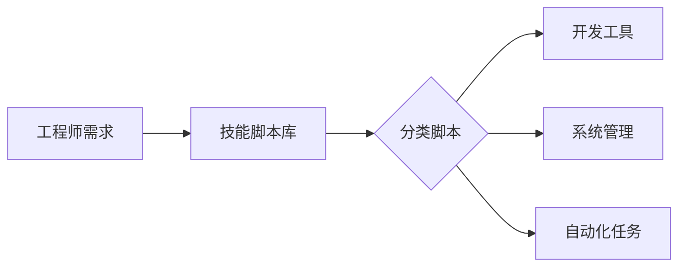
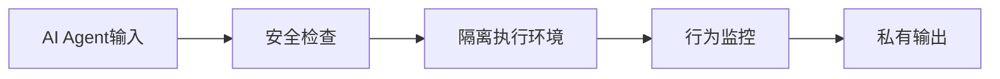
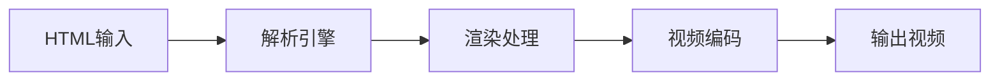
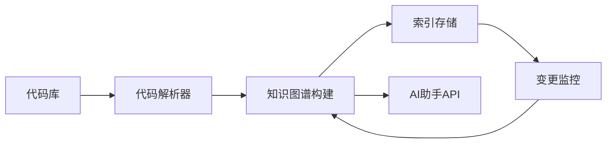

## 今日热点

今日GitHub热榜项目精彩纷呈。

---

## 热门项目一览

| 排名 | 项目 | 语言 | 今日 | 总计 | 简介 |
|:---:|------|:----:|------:|-----:|------|
| 1 | [DietrichGebert/ponytail](https://github.com/DietrichGebert/ponytail) | JavaScript | +1,435 | 151,899 | Makes your AI agent think l... |
| 2 | [mattpocock/skills](https://github.com/mattpocock/skills) | Shell | +955 | 274,763 | Skills for Real Engineers. ... |
| 3 | [pbakaus/impeccable](https://github.com/pbakaus/impeccable) | JavaScript | +722 | 74,381 | The design language that ma... |
| 4 | [Panniantong/Agent-Reach](https://github.com/Panniantong/Agent-Reach) | Python | +696 | 88,767 | Give your AI agent eyes to ... |
| 5 | [mvschwarz/openrig](https://github.com/mvschwarz/openrig) | TypeScript | +683 | 4,362 | Build your own network of a... |
| 6 | [pablostanley/yoinks](https://github.com/pablostanley/yoinks) | TypeScript | +623 | 3,544 | yoink any video from your t... |
| 7 | [NVIDIA/OpenShell](https://github.com/NVIDIA/OpenShell) | Rust | +594 | 14,456 | OpenShell is the safe, priv... |
| 8 | [heygen-com/hyperframes](https://github.com/heygen-com/hyperframes) | TypeScript | +580 | 55,942 | Write HTML. Render video. B... |
| 9 | [obra/superpowers](https://github.com/obra/superpowers) | Shell | +556 | 294,505 | An agentic skills framework... |
| 10 | [mksglu/context-mode](https://github.com/mksglu/context-mode) | TypeScript | +282 | 25,057 | Context window optimization... |
| 11 | [JuliusBrussee/caveman](https://github.com/JuliusBrussee/caveman) | Go | +209 | 109,133 | 🪨 why use many token when f... |
| 12 | [cursor/plugins](https://github.com/cursor/plugins) | TypeScript | +163 | 9,518 | Cursor plugin specification... |

---

## 趋势洞察

```
┌─────────────────────────────────────────────────────────────────┐
│  AI/ML 工具         ████████████████████████  13 个项目        │
│  其他               █████                     3 个项目        │
│  多媒体应用            █                         1 个项目        │
└─────────────────────────────────────────────────────────────────┘
```

---

## 项目深度解读

### 1. DietrichGebert/ponytail — AI代码助手

> **一句话总结**：通过模拟资深开发者思维，为AI代理提供代码生成和优化建议，实现"少写代码"的开发理念。

#### 价值主张

| 维度 | 说明 |
|------|------|
| **解决痛点** | 减少重复编码工作，提高开发效率，降低维护成本 |
| **目标用户** | 开发者团队，特别是需要大量代码生成的场景 |
| **核心亮点** | AI驱动 + 代码复用 + 自动优化 + 智能建议 |

#### 技术架构


**技术特色**：
- 基于大型语言模型的代码理解与生成
- 智能识别可复用代码模式
- 自动优化代码结构和性能

#### 热度分析

- 项目增长迅猛，近期单日新增星标超1400，显示社区高度认可
- 在AI辅助开发领域处于领先地位，fork数量表明广泛采用

#### 快速上手

```bash
# 安装ponytail
npm install -g ponytail

# 初始化项目
ponytail init

# 生成代码
ponytail generate "创建一个用户登录API"
```

#### 注意事项

- 需要稳定的网络连接以调用AI服务
- 生成的代码需要人工审核，特别是关键业务逻辑部分
- 可能需要付费才能解锁全部功能


### 2. mattpocock/skills — 工程师技能集

> **一句话总结**：精选工程师实用脚本集合，提供高效工具与自动化解决方案，提升开发效率。

#### 价值主张

| 维度 | 说明 |
|------|------|
| **解决痛点** | 为工程师提供经过验证的实用脚本，解决日常开发中的常见痛点 |
| **目标用户** | 软件开发工程师、DevOps工程师、系统管理员 |
| **核心亮点** | 实用性强+开箱即用+高度可定制+持续更新+社区驱动 |

#### 技术架构



**技术特色**：
- 纯Shell实现，跨平台兼容性强
- 模块化设计，便于组合使用
- 轻量级，无需额外依赖

#### 热度分析

- 超高星标项目(27万+)，日均增长近千星，表明工程师群体认可度高
- 零开放Issues，反映项目成熟度高，社区通过Fork贡献形成活跃生态

#### 快速上手

```bash
# 克隆项目到本地
git clone https://github.com/mattpocock/skills.git

# 进入项目目录
cd skills

# 赋予执行权限并运行所需脚本
chmod +x script-name.sh
./script-name.sh
```

#### 注意事项

- 由于是Shell脚本，使用前需确认系统兼容性
- 部分脚本可能需要管理员权限执行
- 建议先阅读README了解各脚本功能


### 3. pbakaus/impeccable — AI设计系统

> **一句话总结**：专为AI应用打造的设计语言系统，提供一致且高效的设计解决方案。

#### 价值主张

| 维度 | 说明 |
|------|------|
| **解决痛点** | 解决AI工具界面设计混乱、用户体验不一致问题 |
| **目标用户** | AI应用开发者、UI/UX设计师、产品经理 |
| **核心亮点** | 专为AI优化 + 组件丰富 + 易于集成 + 高度可定制 |

#### 技术架构


**技术特色**：
- 基于JavaScript/TypeScript构建，与现代前端框架兼容
- 提供AI特有组件，如模型选择器、参数调整面板等
- 支持响应式设计，适配不同设备和屏幕尺寸

#### 热度分析

- 项目获得74k+星标，日增长700+，表明社区高度认可
- Fork数相对较低(4.5k)，可能表明项目更多是直接使用而非二次开发

#### 快速上手

```bash
# 克隆项目
git clone https://github.com/pbakaus/impeccable.git

# 安装依赖
npm install

# 启动示例应用
npm run example
```

#### 注意事项

- 项目许可证未知，商业使用前需确认授权
- 项目Issue为0，可能意味着社区支持主要通过其他渠道
- 需要一定的JavaScript/前端开发经验才能充分利用项目功能


### 4. Panniantong/Agent-Reach — AI全网检索

> **一句话总结**：一站式CLI工具，让AI代理免费无限制访问全球主流社交媒体和代码平台内容。

#### 价值主张

| 维度 | 说明 |
|------|------|
| **解决痛点** | 解决AI代理无法直接访问和整合多平台实时内容的问题 |
| **目标用户** | AI研究人员、开发者、数据分析师及需要网络内容整合的用户 |
| **核心亮点** | 多平台统一接入 + 零API费用 + 命令行操作 + 实时数据获取 |

#### 技术架构


**技术特色**：
- 多平台API统一封装，简化跨平台数据获取
- 智能内容解析与格式转换，确保数据一致性
- 无需API密钥的直接访问机制，降低使用门槛

#### 热度分析

- 项目获得88,767个Star，近期增长迅速，日均增加约700，显示社区高度关注
- 在AI工具领域占据重要位置，特别是针对多平台数据获取的工具中具有明显优势

#### 快速上手

```bash
# 安装项目
pip install agent-reach

# 基本使用示例
agent-reach --platform twitter --query "AI trends"
agent-reach --platform github --user "openai" --repo "chatgpt-api"
```

#### 注意事项

- 需遵守各平台的使用条款，避免过度请求导致账号限制
- 项目依赖可能随平台更新而变化，需关注版本兼容性
- 部分平台可能需要特定配置或代理才能访问


### 5. mvschwarz/openrig — AI代理协作平台

> **一句话总结**：构建基于Claude、Codex和Pi的持久化AI代理团队，实现角色分工与协作共享。

#### 价值主张

| 维度 | 说明 |
|------|------|
| **解决痛点** | AI代理间缺乏持久化协作机制与角色分工 |
| **目标用户** | AI开发者、研究团队及多智能体系统构建者 |
| **核心亮点** | 持久化团队 + 角色分工 + 共享上下文 + 专属工作 + 多模型支持 |

#### 技术架构


**技术特色**：
- 基于TypeScript开发，提供类型安全保障
- 支持多种主流AI模型集成与交互
- 实现代理间的持久化状态管理

#### 热度分析

- 项目Star数达4,362且单日增长683，显示AI代理协作领域热度快速攀升
- Fork数299表明社区正在积极探索二次开发与功能扩展

#### 快速上手

```bash
# 克隆并运行项目
git clone https://github.com/mvschwarz/openrig.git
cd openrig && npm install && npm start
```

#### 注意事项

- 项目许可证信息缺失，使用前需确认授权条款
- Open Issues为0，可能表明项目处于早期阶段或问题管理机制不完善
- 需确保已获得相应AI模型的API访问权限


### 6. pablostanley/yoinks — 终端视频下载工具

> **一句话总结**：简洁的命令行工具，可在终端中无广告下载各种网站视频。

#### 价值主张

| 维度 | 说明 |
|------|------|
| **解决痛点** | 解决了从网页下载视频时遇到广告和烦人弹窗的问题 |
| **目标用户** | 开发者、命令行爱好者、需要批量下载视频的用户 |
| **核心亮点** | 命令行操作 + 无广告 + 支持多网站 + 简单易用 |

#### 技术架构


**技术特色**：
- 使用TypeScript构建，类型安全
- 可能使用Node.js的http/https模块处理网络请求
- 轻量级设计，无需复杂依赖

#### 热度分析

- 项目获得3,544个Star，近期增长迅速(今天+623)，表明社区对其需求强烈
- 相比313个Fork数，Star/Fork比例较高，说明用户更多是直接使用而非修改

#### 快速上手

```bash
# 安装
npm install -g yoinks

# 使用
yoinks https://example.com/video-url
```

#### 注意事项

- 可能需要遵守目标网站的使用条款
- 某些网站可能有反爬虫机制，需要谨慎使用
- 不建议用于下载有版权保护的内容


### 7. NVIDIA/OpenShell — AI安全沙箱

> **一句话总结**：提供安全隔离的AI代理运行环境，确保AI行为可控且保护用户数据隐私。

#### 价值主张

| 维度 | 说明 |
|------|------|
| **解决痛点** | AI代理执行过程中的安全风险与隐私泄露问题 |
| **目标用户** | AI开发者、企业AI应用部署者、注重隐私的个人用户 |
| **核心亮点** | 安全隔离 + 隐私保护 + 可控执行 + Rust内存安全 |

#### 技术架构



**技术特色**：
- Rust语言编写，提供内存安全保障
- 隔离执行环境，防止AI代理越权访问
- 隐私保护机制，确保用户数据不被泄露

#### 热度分析

- 项目获得14,456星，单日增长594星，表明社区高度关注AI安全与隐私议题
- 零开放问题，反映项目成熟度高，社区问题解决效率高

#### 快速上手

```bash
# 克隆OpenShell项目
git clone https://github.com/NVIDIA/OpenShell.git
# 进入项目目录
cd OpenShell
# 构建项目
cargo build
```

#### 注意事项

- 项目许可证未知，使用前需确认授权条款
- 作为NVIDIA项目，可能依赖NVIDIA硬件或特定软件栈
- 项目描述较为简略，需要进一步查看文档了解具体使用方法


### 8. heygen-com/hyperframes — HTML视频渲染器

> **一句话总结**：将HTML代码直接转换为视频，专为智能体设计的渲染工具。

#### 价值主张

| 维度 | 说明 |
|------|------|
| **解决痛点** | 将静态HTML内容转换为动态视频，解决了内容到视频的转换难题 |
| **目标用户** | 需要自动化生成视频内容的开发者和AI智能体 |
| **核心亮点** | HTML到视频转换 + 智能体集成 + 自动化渲染 + 高性能处理 |

#### 技术架构



**技术特色**：
- 基于TypeScript开发，提供类型安全
- 高效的HTML到视频转换流程
- 使用WebGL或Canvas进行高性能渲染

#### 热度分析

- 项目获得超5.5万星，单日增长580星，表明社区高度认可
- 作为HTML到视频转换工具，在内容创作和AI应用领域具有独特价值

#### 快速上手

```bash
# 安装
npm install hyperframes

# 使用
import { render } from 'hyperframes';
render('<h1>Hello World</h1>', 'output.mp4');
```

#### 注意事项

- 项目许可证信息未知，使用前需确认商业使用限制
- 可能存在浏览器兼容性问题
- 视频质量和渲染性能可能取决于输入HTML的复杂程度


### 9. obra/superpowers — 智能开发框架

> **一句话总结**：提供高效的智能代理技能框架与实用软件开发方法论，提升团队协作效能。

#### 价值主张

| 维度 | 说明 |
|------|------|
| **解决痛点** | 解决软件开发方法零散、效率低下的问题 |
| **目标用户** | 软件开发团队与技术管理者 |
| **核心亮点** | 框架化 + 智能化 + 实用性 + 高效性 |

#### 技术架构


**技术特色**：
- 基于Shell的轻量级实现
- 模块化的技能框架设计
- 实践导向的开发方法论

#### 热度分析

- 高Star增长率显示项目受广泛认可，社区活跃度高
- 零未解决问题反映社区维护良好，可能通过其他渠道交流

#### 快速上手

```bash
git clone https://github.com/obra/superpowers.git
cd superpowers
./superpowers
```

#### 注意事项

- 项目许可证未知，使用时需注意合规性
- 由于是Shell脚本，可能需要特定环境支持
- 零未解决问题不代表没有问题，可能通过其他渠道处理


### 10. mksglu/context-mode — AI上下文优化

> **一句话总结**：优化AI编程代理的上下文窗口，通过沙箱和持久化提升跨平台开发效率。

#### 价值主张

| 维度 | 说明 |
|------|------|
| **解决痛点** | AI编程工具上下文窗口限制，无法高效处理大型项目 |
| **目标用户** | AI编程代理用户、需要AI辅助开发的程序员 |
| **核心亮点** | 上下文窗口优化 + 沙箱工具输出 + 会话记忆持久化 + 多平台路由支持 |

#### 技术架构


**技术特色**：
- 通过沙箱技术减少98%工具输出，提高效率
- 实现会话记忆持久化，保持开发连续性
- 支持MCP协议和hooks，实现17个平台无缝集成

#### 热度分析

- 项目Star数超2.5万，日增近300，热度持续攀升
- Fork数近1800，社区活跃度高，开发者认可度强

#### 快速上手

```bash
# 安装context-mode
npm install -g @mksglu/context-mode

# 初始化项目
context-mode init

# 启动开发环境
context-mode start
```

#### 注意事项

- 需要了解MCP(Model Context Protocol)基本概念
- 配置多平台路由时需确保各平台API兼容性
- 建议在使用前熟悉TypeScript以充分利用项目特性


### 11. JuliusBrussee/caveman — AI Token优化器

> **一句话总结**：通过简化语言表达方式，减少AI编程助手65%的token使用量，提升效率。

#### 价值主张

| 维度 | 说明 |
|------|------|
| **解决痛点** | AI编程助手token消耗过多，导致成本高和响应慢 |
| **目标用户** | 使用AI编程助手的开发者和AI代理系统 |
| **核心亮点** | 减少65%token用量 + 保持功能完整性 + 简化表达方式 |

#### 技术架构


**技术特色**：
- 采用简化语言算法减少token使用
- 保持功能完整性的同时优化表达
- 兼容多种AI编程助手系统

#### 热度分析

- Star数超10万且持续稳定增长，项目高度受开发社区认可
- Fork数适中，表明项目已被广泛采用并可能进行二次开发

#### 快速上手

```bash
# 安装caveman
go install github.com/JuliusBrussee/caveman

# 使用caveman处理AI请求
caveman --input "原始代码请求" --output "简化后的请求"
```

#### 注意事项

- 需确保简化后的表达不会丢失原始请求的关键信息
- 可能需要针对不同的AI代理系统进行特定优化
- 使用前应评估简化对代码生成质量的影响


### 12. cursor/plugins — Cursor插件生态

> **一句话总结**：为Cursor编辑器提供官方插件规范和高质量扩展，增强开发体验与功能。

#### 价值主张

| 维度 | 说明 |
|------|------|
| **解决痛点** | 为Cursor编辑器提供标准化扩展机制和丰富功能支持 |
| **目标用户** | Cursor编辑器用户和插件开发者 |
| **核心亮点** | 官方插件规范 + 类型安全实现 + 高质量扩展 + 社区驱动 |

#### 技术架构


**技术特色**：
- 基于TypeScript实现，确保类型安全和开发体验
- 提供标准化插件接口，降低开发门槛
- 支持模块化设计，便于功能扩展和维护

#### 热度分析

- 项目Star数高达9518且持续增长(+163/天)，反映Cursor编辑器生态快速扩张
- 官方插件仓库地位稳固，在Cursor生态系统中处于核心位置

#### 快速上手

```bash
# 克隆官方插件仓库
git clone https://github.com/cursor/plugins.git
# 安装依赖
npm install
# 开发插件
npm run dev
```

#### 注意事项

- 项目许可证未知，商业使用前需确认许可条款
- 插件可能需要特定版本的Cursor编辑器才能正常工作
- 开发自定义插件时建议遵循官方提供的规范和最佳实践


### 13. coreyhaines31/marketingskills — AI营销技能库

> **一句话总结**：为Claude Code和AI代理提供结构化营销技能集，覆盖CRO、文案、SEO等核心领域。

#### 价值主张

| 维度 | 说明 |
|------|------|
| **解决痛点** | 为AI代理提供系统化营销能力，弥补AI营销实践知识缺口 |
| **目标用户** | 使用Claude Code的AI开发者和营销自动化从业者 |
| **核心亮点** | 全营销周期覆盖 + AI专用提示优化 + 实战技能结构化 |

#### 技术架构


**技术特色**：
- JavaScript实现的技能框架与提示结构
- 模块化设计便于扩展和维护
- 针对AI模型优化的提示模板库

#### 热度分析

- 项目获得5.2万星，近期持续增长，反映AI营销领域需求旺盛
- 高Fork比例表明社区积极参与技能库定制和扩展

#### 快速上手

```bash
# 克隆项目
git clone https://github.com/coreyhaines31/marketingskills.git

# 查看技能分类
cd marketingskills && find . -type d -name "skills"
```

#### 注意事项

- 项目许可证未明确标识，商业使用前需确认授权条款
- 技能提示可能需要根据具体应用场景进行调整优化
- 主要针对Claude Code生态，与其他AI平台兼容性有限


### 14. colbymchenry/codegraph — 代码知识图谱

> **一句话总结**：构建本地代码知识图谱，减少AI编码助手的token消耗，提升代码理解效率。

#### 价值主张

| 维度 | 说明 |
|------|------|
| **解决痛点** | 解决AI编码助手在大型项目中理解代码结构困难、token消耗高的问题 |
| **目标用户** | 使用AI编码助手的开发者，特别是处理大型代码库的用户 |
| **核心亮点** | 预索引代码知识图谱 + 自动同步代码变更 + 100%本地运行 + 支持多AI助手 + 减少token消耗 |

#### 技术架构



**技术特色**：
- 基于C语言实现的高性能代码解析与索引
- 自动监控代码变更并更新知识图谱
- 完全本地运行，保护代码隐私
- 支持多种主流AI编码助手
- 优化的数据结构减少token消耗

#### 热度分析

- 项目获得近7.3万星，日增长近百星，在开发者工具领域热度极高
- 零开放问题表明项目维护良好，用户反馈问题及时解决，社区参与度高

#### 快速上手

```bash
# 克隆仓库
git clone https://github.com/colbymchenry/codegraph.git
cd codegraph

# 构建项目
make

# 初始化代码库索引
codegraph init /path/to/your/code
```

#### 注意事项

- 项目使用C语言开发，编译依赖可能因平台而异
- 完全本地运行意味着需要足够的本地存储空间来存储代码知识图谱
- 对于大型代码库，首次构建索引可能需要较长时间


### 15. Effect-TS/effect — 函数式效果系统

> **一句话总结**：Effect-TS是TypeScript的函数式效果系统，提供类型安全的副作用管理，简化生产级应用开发。

#### 价值主张

| 维度 | 说明 |
|------|------|
| **解决痛点** | 解决TypeScript应用中副作用难以管理和测试的问题 |
| **目标用户** | 注重代码质量和可维护性的TypeScript开发者 |
| **核心亮点** | 类型安全 + 副作用隔离 + 错误处理 + 资源管理 + 异步控制 |

#### 技术架构


**技术特色**：
- 基于TypeScript的类型系统实现效果类型
- 提供纯函数式API封装副作用
- 支持资源自动管理和错误恢复

#### 热度分析

- 项目Star数16,576且持续增长(+80 today)，表明其在TypeScript生态中受欢迎度高
- 零Open Issues可能表明项目成熟度高或问题管理严格

#### 快速上手

```bash
# 安装
npm install effect

# 基本使用
import { Effect } from 'effect'

const program = Effect.succeed('Hello, Effect!')
Effect.runPromise(program).then(console.log)
```

#### 注意事项

- 需要一定的函数式编程基础才能充分利用
- 与传统Promise/async await模式有学习曲线差异
- 可能需要重构现有代码以适应效果模式


### 16. google/skills — Google技能库

> **一句话总结**：为Google产品和技术提供代理技能的开源库，增强AI助手与Google生态的集成能力。

#### 价值主张

| 维度 | 说明 |
|------|------|
| **解决痛点** | 统一接入Google产品API，简化AI助手与Google生态的集成流程 |
| **目标用户** | 开发Google AI助手的开发者，构建Google生态应用的开发者 |
| **核心亮点** | 模块化技能设计 + Google产品全覆盖 + 易于扩展 + 统一接口规范 |

#### 技术架构


**技术特色**：
- 技能模块化设计，便于单独维护和扩展
- 统一的Google API调用封装，简化开发流程
- 异常处理和重试机制，提高系统稳定性

#### 热度分析

- 项目Star数持续稳定增长，表明开发者社区对Google生态AI集成需求旺盛
- 作为Google官方技能库，在AI助手开发领域具有权威性和生态主导地位

#### 快速上手

```bash
# 克隆项目
git clone https://github.com/google/skills.git

# 安装依赖
pip install -r requirements.txt
```

#### 注意事项

- 许可证信息不明确，使用前需确认具体授权条款
- 项目依赖Google API，需确保API密钥配置正确且在有效期内
- 部分Google产品可能有API调用限制，需关注配额使用情况


### 17. getsentry/sentry — 开源错误监控平台

> **一句话总结**：Sentry 是一个开发者优先的错误跟踪和性能监控平台，帮助团队实时捕获、诊断和解决应用问题。

#### 价值主张

| 维度 | 说明 |
|------|------|
| **解决痛点** | 实时捕获和跟踪应用中的错误，帮助开发者快速定位和解决问题 |
| **目标用户** | 开发团队、运维工程师、产品经理和技术管理者 |
| **核心亮点** | 实时错误监控 + 性能指标收集 + 智能错误分组 + 丰富的集成支持 + 开发者友好的界面 |

#### 技术架构


**技术特色**：
- 采用分布式架构，支持高并发错误数据采集
- 使用时间序列数据库存储性能数据，支持高效查询
- 实现智能错误分组算法，减少噪音干扰
- 提供多语言 SDK，支持 Python、JavaScript、Java 等多种编程语言
- 采用事件驱动架构，确保实时错误通知

#### 热度分析

- 项目拥有超过 45,000 stars，持续稳定增长，表明其在开发者社区中具有极高认可度
- 作为开源错误监控领域的领导者，Sentry 已形成完善的生态系统，拥有大量第三方集成和社区贡献

#### 快速上手

```bash
# 安装 Sentry Python SDK
pip install sentry-sdk

# 初始化 Sentry
import sentry_sdk
sentry_sdk.init(
    dsn="YOUR_DSN_HERE",
    traces_sample_rate=1.0,
)

# 你的应用程序代码
try:
    # 可能抛出异常的代码
    1 / 0
except Exception:
    sentry_sdk.capture_exception()
```

#### 注意事项

- Sentry 提供免费的开源版本，但高级功能和大量数据存储需要付费订阅
- 配置不当可能导致大量非关键错误被记录，产生噪音
- 对于高流量应用，需要合理配置采样率以控制数据量和成本
- 集成 Sentry 时需要妥善处理敏感数据，避免意外泄露用户隐私信息


## 今日推荐

| 主题 | 推荐项目 | 亮点 |
|------|----------|------|
| 今日最热 | [DietrichGebert/ponytail](https://github.com/DietrichGebert/ponytail) | Makes your AI age... |
| 值得关注 | [mattpocock/skills](https://github.com/mattpocock/skills) | Skills for Real E... |
| 快速上手 | [pbakaus/impeccable](https://github.com/pbakaus/impeccable) | The design langua... |
| 长期潜力 | [Panniantong/Agent-Reach](https://github.com/Panniantong/Agent-Reach) | Give your AI agen... |

---

<div align="center">

*Generated on 2026-10-03 | Powered by GitHub Trending Reporter*

</div>