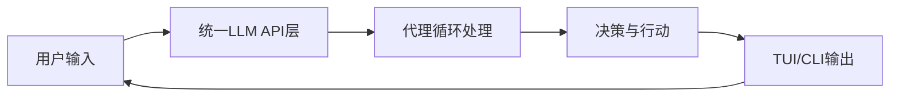
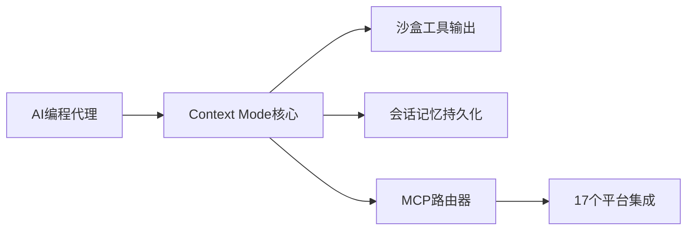
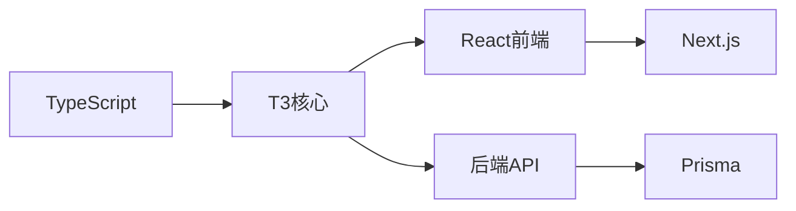
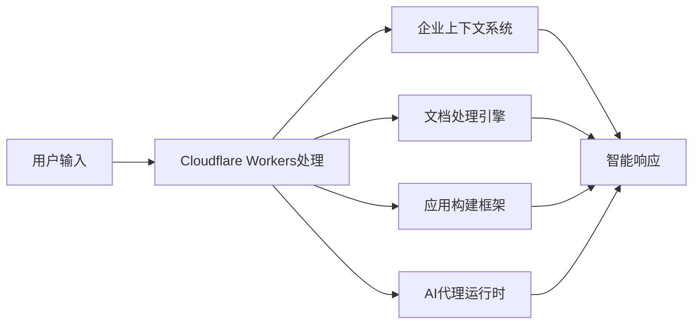

## 今日热点

今天GitHub热榜主要聚焦AI代理工具生态的快速发展，从性能优化到多平台集成，以及上下文管理系统的成熟，标志着AI辅助编程进入实用化阶段。

---

## 热门项目一览

| 排名 | 项目 | 语言 | 今日 | 总计 | 简介 |
|:---:|------|:----:|------:|-----:|------|
| 1 | [Panniantong/Agent-Reach](https://github.com/Panniantong/Agent-Reach) | Python | +1,696 | 89,924 | Give your AI agent eyes to ... |
| 2 | [DietrichGebert/ponytail](https://github.com/DietrichGebert/ponytail) | JavaScript | +1,281 | 153,567 | Makes your AI agent think l... |
| 3 | [affaan-m/ECC](https://github.com/affaan-m/ECC) | JavaScript | +897 | 272,318 | The agent harness performan... |
| 4 | [mattpocock/skills](https://github.com/mattpocock/skills) | Shell | +751 | 275,417 | Skills for Real Engineers. ... |
| 5 | [pbakaus/impeccable](https://github.com/pbakaus/impeccable) | JavaScript | +699 | 75,408 | The design language that ma... |
| 6 | [obra/superpowers](https://github.com/obra/superpowers) | Shell | +577 | 294,944 | An agentic skills framework... |
| 7 | [JuliusBrussee/caveman](https://github.com/JuliusBrussee/caveman) | Go | +507 | 109,566 | 🪨 why use many token when f... |
| 8 | [earendil-works/pi](https://github.com/earendil-works/pi) | TypeScript | +408 | 112,193 | AI agent toolkit: unified L... |
| 9 | [Effect-TS/effect](https://github.com/Effect-TS/effect) | TypeScript | +302 | 16,849 | Build production-ready appl... |
| 10 | [mksglu/context-mode](https://github.com/mksglu/context-mode) | TypeScript | +256 | 25,264 | Context window optimization... |
| 11 | [pingdotgg/t3code](https://github.com/pingdotgg/t3code) | TypeScript | +252 | 24,733 | No description |
| 12 | [addyosmani/agent-skills](https://github.com/addyosmani/agent-skills) | JavaScript | +252 | 100,880 | Production-grade engineerin... |

---

## 趋势洞察

```
┌─────────────────────────────────────────────────────────────────┐
│  AI/ML 工具         ████████████████████████  14 个项目        │
│  其他               ██████                    4 个项目        │
│  多媒体应用            █                         1 个项目        │
└─────────────────────────────────────────────────────────────────┘
```

---

## 项目深度解读

### 1. Panniantong/Agent-Reach — [多平台爬取工具]

> **一句话总结**：一款无需API费用的命令行工具，让AI代理能够访问和爬取多个社交媒体平台的内容。

#### 价值主张

| 维度 | 说明 |
|------|------|
| **解决痛点** | 解决AI代理无法直接访问互联网内容的问题，避免高昂API费用 |
| **目标用户** | AI开发者、研究人员、数据分析师、内容创作者 |
| **核心亮点** | 多平台支持 + 零API费用 + 命令行界面 + 实时数据获取 + 开源免费 |

#### 技术架构


**技术特色**：
- 通过模拟浏览器行为绕过平台API限制
- 支持多个主流社交平台的内容爬取
- 命令行界面设计简洁易用
- 无需API密钥和额外费用

#### 热度分析

- 项目获得近9万星，日增近1700星，呈现快速增长趋势
- Fork数量近8000，表明社区活跃度高，开发者参与度强
- 0个开放问题，可能表明项目维护良好或问题解决及时

#### 快速上手

```bash
# 安装
pip install agent-reach

# 使用示例
agent-reach --platform twitter --search "AI"
agent-reach --platform reddit --subreddit "technology"
agent-reach --platform youtube --channel "OpenAI"
```

#### 注意事项

- 使用时需遵守各平台的使用条款，避免过度请求导致账号被封
- 项目可能面临平台更新导致的兼容性问题
- 由于绕过API限制，长期稳定性可能受平台政策影响
- 使用时需注意数据隐私和合规性问题


### 2. DietrichGebert/ponytail — AI代码助手

> **一句话总结**：让AI助手像最懒惰的高级开发者一样思考，生成最小化代码的智能工具。

#### 价值主张

| 维度 | 说明 |
|------|------|
| **解决痛点** | 减少重复编码工作，通过智能生成提高开发效率 |
| **目标用户** | 前后端开发人员，特别是需要快速原型开发的团队 |
| **核心亮点** | 智能代码生成 + 最小化代码理念 + 开发效率提升 |

#### 技术架构


**技术特色**：
- 基于大语言模型的智能代码理解与生成
- 专注于最小化代码理念的实现策略
- 与现有开发工作流的无缝集成能力

#### 热度分析

- 项目获得15万+ stars，月均增长数千，表明开发者社区高度认可其价值
- Fork数相对较少，说明项目可能更偏向工具型而非框架型，用户直接使用而非二次开发

#### 快速上手

```bash
# 安装ponytail
npm install ponytail

# 基本使用
ponytail "创建一个用户登录功能的React组件"
```

#### 注意事项
- 需要确保AI生成代码的安全性，避免潜在漏洞
- 可能需要根据具体项目风格进行代码调整，AI生成的代码可能不完全符合团队规范


### 3. affaan-m/ECC — [AI代理优化]

> **一句话总结**：为AI代码助手提供性能优化的代理系统，增强技能、记忆与安全性。

#### 价值主张

| 维度 | 说明 |
|------|------|
| **解决痛点** | 提升AI代码助手性能，解决智能代理系统的效率与安全性问题 |
| **目标用户** | AI代码工具开发者、高级程序员、研究型开发者 |
| **核心亮点** | 技能优化 + 本能增强 + 记忆管理 + 安全防护 + 研究优先开发 |

#### 技术架构


**技术特色**：
- 多层次AI代理优化架构
- 智能记忆与技能管理系统
- 安全优先的代码处理流程

#### 热度分析

- 项目获得超过27万星，近期增长迅速，表明其在AI代码助手领域具有重要影响力
- Fork数与Star数比例合理，说明项目不仅有高关注度也有较高参与度

#### 快速上手

```bash
# 克隆项目
git clone https://github.com/affaan-m/ECC.git

# 安装依赖
npm install
```

#### 注意事项

- 项目许可证未知，使用前需确认授权条款
- 项目描述较为抽象，可能需要深入研究源码才能了解具体实现细节


### 4. mattpocock/skills — 工程师技能集

> **一句话总结**：精选工程师实用工具集，提供可直接使用的shell脚本技能，提升工作效率。

#### 价值主张

| 维度 | 说明 |
|------|------|
| **解决痛点** | 工程师缺乏现成高效工具，需要快速提升工作效率 |
| **目标用户** | 系统管理员、开发人员及DevOps工程师 |
| **核心亮点** | 实用性强 + 即插即用 + 高效自动化 + 持续更新 |

#### 技术架构


**技术特色**：
- 纯Shell实现，跨平台兼容性强
- 模块化设计，易于扩展和维护
- 即插即用，无需复杂配置

#### 热度分析

- 项目星标数超27万，日增751，社区认可度高且增长强劲
- Fork数达2.3万，表明社区积极参与贡献，形成活跃生态

#### 快速上手

```bash
git clone https://github.com/mattpocock/skills.git
cd skills
chmod +x *.sh
```

#### 注意事项

- 使用前请检查脚本兼容性，确保与您的系统环境匹配
- 部分脚本可能需要sudo权限执行，请谨慎使用


### 5. pbakaus/impeccable — AI设计语言

> **一句话总结**：专业AI系统设计语言框架，提升AI界面交互体验与设计一致性。

#### 价值主张

| 维度 | 说明 |
|------|------|
| **解决痛点** | AI系统设计缺乏统一标准，界面交互体验不完善 |
| **目标用户** | AI产品设计师、前端开发者、人机交互专家 |
| **核心亮点** | 模块化设计组件 + AI交互规范 + 设计一致性保证 + 可定制主题 |

#### 技术架构


**技术特色**：
- 基于React的组件化设计系统
- 提供完整的AI交互状态管理
- 支持设计系统自定义与扩展
- 内置设计规范与最佳实践指南

#### 热度分析
- 高Star数(75K+)表明项目在AI设计领域具有显著影响力，近期增长迅速
- 作为AI与UI交叉领域的前沿工具，吸引了大量AI应用开发者关注

#### 快速上手

```bash
# 安装Impeccable
npm install impeccable

# 初始化AI设计项目
impeccable init my-ai-app
```

#### 注意事项
- 需要熟悉React和现代前端开发技术
- 项目文档可能需要进一步补充完善
- 适用于AI助手类应用，其他AI系统可能需要适配调整


### 6. obra/superpowers — 开发效能框架

> **一句话总结**：提供完整的技能框架和软件开发方法论，显著提升团队开发效能与代码质量。

#### 价值主张

| 维度 | 说明 |
|------|------|
| **解决痛点** | 解决软件开发过程中效率低下、方法论不统一的问题 |
| **目标用户** | 软件开发者、技术团队和项目经理 |
| **核心亮点** | 技能框架 + 开发方法论 + 效能提升 + 实用性强 |

#### 技术架构


**技术特色**：
- 基于 Shell 脚本实现，跨平台兼容性强
- 模块化设计，易于扩展和定制
- 提供完整的开发流程指导和最佳实践

#### 热度分析

- 项目获得近30万星，日增500+，表明其方法论广受认可并持续增长
- 高Fork数显示社区积极参与，已形成成熟的开发效能方法论生态

#### 快速上手

```bash
# 克隆项目
git clone https://github.com/obra/superpowers.git
# 进入目录
cd superpowers
# 运行安装脚本
./install.sh
```

#### 注意事项

- 项目许可证未知，商业使用前需确认授权
- Shell脚本可能在非Unix系统上存在兼容性问题
- 建议先阅读文档理解方法论后再应用


### 7. JuliusBrussee/caveman — 代码token精简

> **一句话总结**：通过穴居人式简洁语言风格，将AI编程助手的token使用量减少65%，提升效率降低成本。

#### 价值主张

| 维度 | 说明 |
|------|------|
| **解决痛点** | AI编程助手使用过多token导致响应慢和成本高的问题 |
| **目标用户** | 使用AI编程助手的开发者和代码生成工具用户 |
| **核心亮点** | 减少65%token使用 + 保持代码质量 + 提高响应速度 + 降低API成本 |

#### 技术架构


**技术特色**：
- 通过简化语言减少token使用
- 保持代码生成质量的同时提高效率
- 使用Go语言实现的高性能处理层

#### 热度分析

- 项目获得超10万星，日增500+，显示强劲增长势头和社区认可度
- 作为AI工具链中的创新组件，在开发者社区中具有高实用价值

#### 快速上手

```bash
# 安装caveman
go install github.com/JuliusBrussee/caveman

# 使用caveman代理AI编程助手
caveman --model gpt-4 --prompt "编写一个快速排序算法"
```

#### 注意事项

- 由于项目没有明确的许可证，使用前需确认授权条款
- 可能需要配合特定的AI模型使用以达到最佳效果
- 简化语言可能在某些复杂场景下影响代码生成质量


### 8. earendil-works/pi — 全能AI工具包

> **一句话总结**：提供统一LLM API、代理循环和编码功能的AI集成工具集

#### 价值主张

| 维度 | 说明 |
|------|------|
| **解决痛点** | 统一多种LLM API接口，简化AI应用开发流程 |
| **目标用户** | AI开发者、研究人员和需要集成AI功能的开发者 |
| **核心亮点** | 统一LLM接口 + 代理循环机制 + 终端UI + 编码助手CLI |

#### 技术架构



**技术特色**：
- 统一的LLM API接口，抽象多种模型后端差异
- 代理循环机制，实现持续交互与智能决策
- 终端用户界面与命令行工具双重交互方式
- 专门的编码助手功能，支持代码生成与解释

#### 热度分析

- 项目Star数突破11万，日均增长400+，表明社区接受度极高
- Fork数约1.4万，表明开发者积极参与二次开发与定制

#### 快速上手

```bash
# 安装
npm install -g pi

# 启动交互式AI代理
pi

# 或使用编码助手
pi code
```

#### 注意事项

- 由于项目未明确说明许可证，使用时需注意授权条款
- 项目依赖多种LLM服务，可能需要配置API密钥
- 项目功能丰富，学习曲线可能较陡峭


### 9. Effect-TS/effect — 函数式编程库

> **一句话总结**：Effect-TS提供类型安全的副作用管理，构建可预测的TypeScript应用程序。

#### 价值主张

| 维度 | 说明 |
|------|------|
| **解决痛点** | 解决JavaScript/TS应用中副作用不可预测和状态管理混乱问题 |
| **目标用户** | 追求类型安全和函数式编程的前端/全栈开发者 |
| **核心亮点** | 强类型系统 + 副作用隔离 + 错误处理 + 组合能力 + 响应式编程 |

#### 技术架构


**技术特色**：
- 基于Effect monad的函数式编程模型
- 强类型系统确保运行时安全
- 副作用隔离机制简化状态管理

#### 热度分析

- 项目Star增长迅速，表明社区认可度高且功能实用
- 虽然Issues为0，但Fork数表明开发者积极参与二次开发

#### 快速上手

```bash
# 安装Effect-TS
npm install effect

# 基本使用示例
import { Effect } from "effect";

const program = Effect.sync(() => console.log("Hello, Effect!"));
Effect.run(program);
```

#### 注意事项
- 需要一定的函数式编程基础
- 与传统编程范式有较大差异，学习曲线较陡峭
- 可能需要重构现有代码以适应Effect模型


### 10. mksglu/context-mode — AI上下文优化

> **一句话总结**：为AI编程代理提供上下文窗口优化，大幅减少工具输出并实现跨平台路由。

#### 价值主张

| 维度 | 说明 |
|------|------|
| **解决痛点** | AI编程代理上下文窗口膨胀、工具输出冗余、跨平台集成困难 |
| **目标用户** | AI编程工具开发者、智能IDE构建者、AI代理系统架构师 |
| **核心亮点** | 沙盒工具输出 + 持久化会话记忆 + MCP跨平台路由 + 98%输出减少 |

#### 技术架构



**技术特色**：
- 基于TypeScript实现类型安全的上下文管理
- 沙盒化工具输出实现98%的输出减少
- 通过MCP协议实现跨平台标准化集成

#### 热度分析

- 项目获得超25k星且持续增长，显示开发者对AI上下文优化解决方案的强烈需求
- 无开放问题表明项目成熟度高，社区维护良好

#### 快速上手

```bash
# 安装依赖
npm install @mksglu/context-mode

# 初始化配置
npx context-mode init

# 启动服务
npx context-mode start
```

#### 注意事项

- 项目许可证信息不明确，使用前需确认开源许可条款
- 集成前需了解MCP协议规范以确保兼容性
- 可能需要额外的配置才能完全实现17个平台的路由功能


### 11. pingdotgg/t3code — TypeScript开发框架

> **一句话总结**：T3代码栈提供现代化的全栈开发体验，整合React与后端技术，简化TypeScript应用构建。

#### 价值主张

| 维度 | 说明 |
|------|------|
| **解决痛点** | 简化现代Web应用开发流程，解决技术栈碎片化问题 |
| **目标用户** | 寻求高效、类型安全全栈解决方案的开发者 |
| **核心亮点** | 统一架构 + 类型安全 + 开箱即用 + 文档完善 |

#### 技术架构



**技术特色**：
- 采用TypeScript作为核心开发语言，提供端到端类型安全
- 整合Next.js与Prisma，构建高效的全栈开发体验
- 模块化设计，支持灵活扩展与定制

#### 热度分析

- 项目Star数持续快速增长，表明开发者社区认可度高
- Fork数量与Star比例合理，反映项目具有较高实用价值

#### 快速上手

```bash
# 创建新项目
npx create-t3-app@latest my-project

# 进入项目目录
cd my-project

# 安装依赖并启动开发服务器
npm install && npm run dev
```

#### 注意事项

- 项目依赖Node.js环境，确保安装最新LTS版本
- 需要一定的TypeScript和React基础，以便充分利用框架特性


### 12. addyosmani/agent-skills — AI编程技能库

> **一句话总结**：提供生产级AI编码代理所需的工程技能和最佳实践，提升代码生成质量。

#### 价值主张

| 维度 | 说明 |
|------|------|
| **解决痛点** | 解决AI编码助手生成代码质量不高、工程实践不足的问题 |
| **目标用户** | AI开发者、编码助手使用者、软件工程师 |
| **核心亮点** | 高质量代码示例 + 工程最佳实践 + 性能优化技巧 + 测试策略 + 安全规范 |

#### 技术架构


**技术特色**：
- 采用模块化技能组织方式，便于AI代理调用
- 包含完整的代码质量评估体系
- 提供多语言、多场景的工程实践方案

#### 热度分析

- 项目已获超10万星，日增250+，处于AI编码工具领域头部位置
- 零未解决问题，表明项目维护良好，社区参与度高

#### 快速上手

```bash
# 克隆项目
git clone https://github.com/addyosmani/agent-skills.git

# 安装依赖
cd agent-skills && npm install

# 查看技能文档
npm run docs
```

#### 注意事项

- 项目为技能集合而非独立工具，需要与AI代理结合使用
- 部分技能可能需要根据具体场景进行适配和调整
- 建议在使用前熟悉项目中的最佳实践指南


### 13. OpenCut-app/OpenCut — 开源视频编辑

> **一句话总结**：开源CapCut替代方案，提供跨平台视频编辑功能，注重用户体验和性能。

#### 价值主张

| 维度 | 说明 |
|------|------|
| **解决痛点** | 提供免费开源的视频编辑替代方案，摆脱闭源软件限制 |
| **目标用户** | 内容创作者、视频编辑爱好者、开源软件支持者 |
| **核心亮点** | 跨平台支持 + 实时预览 + 丰富的滤镜效果 + 直观的用户界面 |

#### 技术架构


**技术特色**：
- 基于TypeScript构建，保证代码质量和跨平台兼容性
- 采用模块化设计，便于功能扩展和维护
- 优化的渲染引擎，确保实时预览流畅

#### 热度分析

- 项目Star数超过9万，呈现稳定增长态势，表明社区认可度高
- Fork数接近万级，显示开发者参与度和二次开发活跃

#### 快速上手

```bash
# 克隆项目
git clone https://github.com/OpenCut-app/OpenCut.git

# 安装依赖并启动
cd OpenCut
npm install && npm start
```

#### 注意事项
- 项目License未知，使用前需确认开源协议
- Open Issues为0，可能通过其他渠道（如Discord）管理问题反馈


### 14. getsentry/sentry — 错误监控平台

> **一句话总结**：开发者优先的错误跟踪与性能监控平台，实时捕获、分析和解决应用问题。

#### 价值主张

| 维度 | 说明 |
|------|------|
| **解决痛点** | 实时捕获应用错误，提供详细上下文信息，加速问题定位与修复 |
| **目标用户** | 软件开发团队、DevOps工程师、技术运维人员 |
| **核心亮点** | 实时错误捕获 + 详细错误上下文 + 性能监控 + 多语言支持 + 自定义告警 |

#### 技术架构


**技术特色**：
- 分布式架构设计，支持高并发错误处理
- 智能错误分组算法，减少重复报警噪音
- 提供丰富的API和SDK，支持多种编程语言集成

#### 热度分析

- Star 数量持续稳定增长，日均新增约200+，表明项目活跃度高
- 作为错误监控领域的标杆项目，在开发者社区中拥有广泛影响力

#### 快速上手

```bash
# 安装 Sentry CLI
pip install sentry-cli

# 初始化项目
sentry-cli init

# 发布版本
sentry-cli releases new 1.0.0
sentry-cli releases files 1.0.0 upload ./dist
sentry-cli releases finalize 1.0.0
```

#### 注意事项

- Sentry 提供云服务和自托管两种部署方式，自托管需要更多运维资源
- 错误数据可能包含敏感信息，需注意数据安全与隐私保护
- 对于高流量应用，错误数据量可能很大，需要合理配置采样率以控制成本


### 15. jamwithai/production-agentic-rag-course — 生产级RAG课程

> **一句话总结**：构建生产级智能检索增强生成系统的实战课程，涵盖从基础到高级的全流程技术实现。

#### 价值主张

| 维度 | 说明 |
|------|------|
| **解决痛点** | 解决RAG系统从原型到生产部署的复杂技术挑战与工程难题 |
| **目标用户** | AI开发者、系统架构师、NLP工程师、技术决策者 |
| **核心亮点** | 完整生产流程 + 实战案例 + 最佳实践 + 性能优化 + 部署策略 |

#### 技术架构


**技术特色**：
- 基于Python的企业级RAG实现框架
- 结合最新LLM模型的智能代理技术
- 端到端性能优化与监控方案

#### 热度分析

- Star数持续高增长，反映RAG技术领域的高度关注与学习需求
- 高Fork数表明项目具有很高的实践参考价值和可复用性

#### 快速上手

```bash
# 克隆项目
git clone https://github.com/jamwithai/production-agentic-rag-course.git

# 安装依赖
cd production-agentic-rag-course
pip install -r requirements.txt
```

#### 注意事项

- 需要一定的Python和机器学习基础
- 部分功能可能需要GPU支持以获得最佳性能


### 16. anthropics/claude-code — 智能编程助手

> **一句话总结**：Claude Code 是一个基于自然语言的终端编程助手，能理解代码库并执行复杂开发任务。

#### 价值主张

| 维度 | 说明 |
|------|------|
| **解决痛点** | 开发者频繁切换上下文、执行重复任务和解释复杂代码的效率瓶颈 |
| **目标用户** | 全栈开发者、DevOps 工程师和需要高效代码理解的程序员 |
| **核心亮点** | 自然语言交互 + 代码库理解 + 智能任务执行 + Git 工作流集成 + 终端内运行 |

#### 技术架构


**技术特色**：
- 基于 Claude AI 模型的自然语言处理能力
- TypeScript 实现的跨平台终端应用
- 深度代码库理解与上下文保持机制

#### 热度分析

- 项目获得近15万星，日增128星，表明开发者社区高度认可其价值
- Fork 数量与 Star 比例合理，说明项目不仅被关注还被积极尝试使用

#### 快速上手

```bash
# 安装 Claude Code
npm install -g @anthropic/claude-code

# 初始化项目
claude-code init

# 开始使用自然语言命令
claude-code "解释这个函数的功能"
```

#### 注意事项

- 项目 License 不明确，商业使用前需确认授权条款
- 需要有效的 Anthropic API 密钥才能使用 Claude 模型
- 代码库理解效果取决于项目规模和复杂度
- 可能需要网络连接以调用 Claude API


### 17. cloudflare/cloudflare-os — 云智能工作空间

> **一句话总结**：基于Cloudflare Workers构建的智能工作空间，用于创建文档、构建应用和运行企业级AI代理。

#### 价值主张

| 维度 | 说明 |
|------|------|
| **解决痛点** | 企业缺乏集成上下文和系统的AI工作空间，难以高效处理文档和应用构建 |
| **目标用户** | 企业开发团队、内容创作者、需要AI辅助决策的知识工作者 |
| **核心亮点** + 基于Cloudflare Workers的轻量级架构 + 企业级上下文集成 + 文档与应用一体化构建 + AI代理能力 + 低代码/无代码开发 |

#### 技术架构



**技术特色**：
- 利用Cloudflare Workers的全球边缘计算网络实现低延迟响应
- TypeScript全栈开发确保类型安全与代码质量
- 模块化设计支持灵活的上下文集成和扩展
- 无服务器架构降低运维复杂度
- 支持企业级数据安全与隐私保护

#### 热度分析

- 项目获得超过1万星并持续增长，表明企业对AI工作空间解决方案的强烈需求
- 作为Cloudflare生态系统中的重要项目，吸引了大量开发者和企业用户关注

#### 快速上手

```bash
# 安装Cloudflare CLI
npm install -g wrangler

# 初始化项目
wrangler init cloudflare-os

# 部署到Cloudflare Workers
wrangler deploy
```

#### 注意事项

- 项目使用Cloudflare Workers，需要了解其限制和特性
- 企业部署时需注意数据安全和隐私合规要求
- 项目可能需要一定的AI/ML知识以充分利用代理功能


### 18. thedotmack/claude-mem — AI代理记忆增强

> **一句话总结**：捕获AI代理会话活动，经AI压缩后注入未来会话，实现跨会话持久记忆。

#### 价值主张

| 维度 | 说明 |
|------|------|
| **解决痛点** | 解决AI代理无法在会话间保持上下文记忆的问题 |
| **目标用户** | 使用各种AI编程助手的开发者和技术人员 |
| **核心亮点** | 跨会话持久记忆 + AI压缩 + 多平台兼容 + 自动上下文注入 |

#### 技术架构


**技术特色**：
- 支持Claude、OpenAI、Gemini等多种AI编程助手
- 采用AI技术智能压缩和提取关键上下文
- 无缝集成现有开发环境，无需大幅修改工作流

#### 热度分析

- 项目Star数超9.5万且持续增长，日均新增近80个Star，处于高速成长期
- Fork数达8千+，社区活跃度高，开发者积极参与项目贡献和定制

#### 快速上手

```bash
# 克隆项目
git clone https://github.com/thedotmack/claude-mem.git

# 安装依赖
npm install

# 启动服务
npm start
```

#### 注意事项

- 需要配置相应的AI服务API密钥以启用压缩功能
- 根据使用的AI平台(Claude、Copilot等)可能需要特定配置
- 注意数据隐私问题，项目会捕获和存储代理活动数据


### 19. meituan-longcat/LongCat-Video — 长视频生成

> **一句话总结**：基于AI的长视频生成工具，支持高质量、连贯的长内容创作。

#### 价值主张

| 维度 | 说明 |
|------|------|
| **解决痛点** | 解决长视频生成质量低、内容不连贯的技术难题 |
| **目标用户** | 内容创作者、视频制作团队、AI应用开发者 |
| **核心亮点** | 高质量生成 + 长上下文理解 + 多模态融合 |

#### 技术架构


**技术特色**：
- 采用长上下文建模技术，确保视频内容连贯性
- 结合多模态生成，提升视频质量和多样性
- 支持多种分辨率和格式输出，适应不同应用场景

#### 热度分析

- 项目获得8,784个Star，近期增长迅速，显示社区对其技术价值的高度认可
- 作为美团开源项目，在企业级AI应用领域具有重要影响力，可能成为行业标准工具

#### 快速上手

```bash
# 克隆仓库
git clone https://github.com/meituan-longcat/LongCat-Video.git
cd LongCat-Video

# 安装依赖并运行示例
pip install -r requirements.txt
python examples/demo.py --prompt "生成一段关于自然风景的长视频"
```

#### 注意事项

- 项目可能需要较高的计算资源，建议使用GPU环境运行
- 长视频生成可能需要较长时间，建议合理规划任务队列
- 注意遵守相关版权和内容使用规范，避免生成不当内容


## 今日推荐

| 主题 | 推荐项目 | 亮点 |
|------|----------|------|
| 今日最热 | [Panniantong/Agent-Reach](https://github.com/Panniantong/Agent-Reach) | Give your AI agen... |
| 值得关注 | [DietrichGebert/ponytail](https://github.com/DietrichGebert/ponytail) | Makes your AI age... |
| 快速上手 | [affaan-m/ECC](https://github.com/affaan-m/ECC) | The agent harness... |
| 长期潜力 | [mattpocock/skills](https://github.com/mattpocock/skills) | Skills for Real E... |

---

<div align="center">

*Generated on 2026-10-04 | Powered by GitHub Trending Reporter*

</div>