## 今日热点

AI代理生态系统爆发式增长，各类专业化技能包和工具链层出不穷，同时本地化AI推理能力也备受关注，显示出AI从通用工具向专业化、本地化方向发展。

---

## 热门项目一览

| 排名 | 项目 | 语言 | 今日 | 总计 | 简介 |
|:---:|------|:----:|------:|-----:|------|
| 1 | [DietrichGebert/ponytail](https://github.com/DietrichGebert/ponytail) | JavaScript | +1,894 | 154,992 | Makes your AI agent think l... |
| 2 | [pbakaus/impeccable](https://github.com/pbakaus/impeccable) | JavaScript | +1,171 | 76,381 | The design language that ma... |
| 3 | [Panniantong/Agent-Reach](https://github.com/Panniantong/Agent-Reach) | Python | +980 | 91,003 | Give your AI agent eyes to ... |
| 4 | [thedotmack/claude-mem](https://github.com/thedotmack/claude-mem) | TypeScript | +628 | 96,178 | Persistent Context Across S... |
| 5 | [OpenCut-app/OpenCut](https://github.com/OpenCut-app/OpenCut) | TypeScript | +512 | 92,213 | The open-source CapCut alte... |
| 6 | [pingdotgg/t3code](https://github.com/pingdotgg/t3code) | TypeScript | +490 | 25,215 | No description |
| 7 | [tester-army/e2e](https://github.com/tester-army/e2e) | TypeScript | +345 | 3,257 | Next generation e2e testing... |
| 8 | [addyosmani/agent-skills](https://github.com/addyosmani/agent-skills) | JavaScript | +336 | 101,249 | Production-grade engineerin... |
| 9 | [calesthio/OpenMontage](https://github.com/calesthio/OpenMontage) | Python | +245 | 63,280 | World's first open-source, ... |
| 10 | [michael-denyer/pstack-claude](https://github.com/michael-denyer/pstack-claude) | JavaScript | +232 | 1,171 | Claude Code, Codex, Pi, Ope... |
| 11 | [antirez/ds4](https://github.com/antirez/ds4) | C | +211 | 23,467 | DeepSeek 4 Flash and PRO lo... |
| 12 | [coreyhaines31/marketingskills](https://github.com/coreyhaines31/marketingskills) | JavaScript | +197 | 53,130 | Marketing skills for Claude... |

---

## 趋势洞察

```
┌─────────────────────────────────────────────────────────────────┐
│  AI/ML 工具         ████████████████████████  10 个项目        │
│  其他               ████████████              5 个项目        │
│  开发框架             ██                        1 个项目        │
└─────────────────────────────────────────────────────────────────┘
```

---

## 项目深度解读

### 1. DietrichGebert/ponytail — AI代码助手

> **一句话总结**：让AI代理像最懒惰的高级开发者一样思考，最小化手动编码工作。

#### 价值主张

| 维度 | 说明 |
|------|------|
| **解决痛点** | 减少重复编码工作，提高开发效率，让AI处理繁琐任务 |
| **目标用户** | 开发者、团队、需要自动化代码生成的技术人员 |
| **核心亮点** | 代码生成 + 懒人思维 + 高效优化 |

#### 技术架构

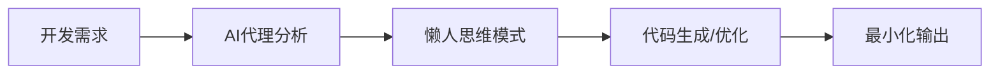

**技术特色**：
- 基于AI的代码生成与优化技术
- 模拟"懒人思维"的智能分析算法
- 自动化实现最小化代码方案

#### 热度分析

- 项目获得超过15万星，近期增长迅速，表明开发者社区对其AI辅助编程理念的高度认可
- 高星高fork比例显示项目已被广泛应用于实际开发场景，形成活跃的技术生态

#### 快速上手

```bash
# 安装ponytail
npm install ponytail

# 基本使用
ponytail "创建一个用户登录功能"
```

#### 注意事项

- 需要确保AI生成的代码符合项目特定需求和标准
- 可能需要根据实际开发环境调整AI生成的代码
- 注意AI生成代码的安全性和性能问题
- 建议在使用前审查AI生成的代码，特别是关键业务逻辑部分


### 2. pbakaus/impeccable — AI设计语言

> **一句话总结**：Impeccable是一款AI专用设计语言，提升AI系统的设计能力与用户体验。

#### 价值主张

| 维度 | 说明 |
|------|------|
| **解决痛点** | AI应用缺乏统一设计规范和优化方法的问题 |
| **目标用户** | AI应用开发者、UI/UX设计师、AI产品经理 |
| **核心亮点** | 统一设计规范 + AI组件库 + 设计系统自动化 + AI交互优化 |

#### 技术架构


**技术特色**：
- 基于JavaScript的设计语言框架
- 专为AI应用优化的设计系统
- 提供可复用的AI组件库

#### 热度分析

- 项目拥有76,381个Star，且近期增长迅速(+1,171 today)，表明在AI设计领域有很高关注度
- 作为AI设计语言领域的代表项目，在AI应用开发生态中具有重要地位

#### 快速上手

```bash
# 假设通过npm安装
npm install impeccable
# 在项目中导入设计系统
import { components, theme } from 'impeccable'
```

#### 注意事项

- 项目许可证未知，使用前需确认授权条款
- 项目可能需要一定的AI和设计系统知识基础
- 由于Open Issues为0，可能意味着项目已成熟或社区支持渠道不明确


### 3. Panniantong/Agent-Reach — AI全网信息采集工具

> **一句话总结**：统一命令行工具，让AI代理免费访问多平台社交媒体内容，无需API费用。

#### 价值主张

| 维度 | 说明 |
|------|------|
| **解决痛点** | 解决AI代理无法直接获取多平台实时数据问题，规避API费用限制 |
| **目标用户** | AI开发者、研究人员及需要大规模社交媒体数据训练的用户 |
| **核心亮点** | 多平台统一接入 + 无API费用 + 命令行操作 + 实时数据获取 + 跨平台搜索 |

#### 技术架构

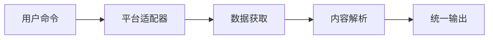

**技术特色**：
- 通过适配器模式统一处理多平台API差异
- 实现无API限制的数据获取机制
- 提供标准化的数据输出格式

#### 热度分析

- 项目超9万星且每日新增近千星，显示极高社区关注度和实用性
- 无开放问题表明项目成熟度高，已进入稳定维护阶段

#### 快速上手

```bash
# 安装
pip install agent-reach

# 使用示例
agent-reach search --platform "twitter" "AI trends"
agent-reach read --platform "reddit" r/artificial
```

#### 注意事项

- 由于绕过官方API，可能存在法律和合规风险
- 项目长期可持续性可能受平台政策变化影响
- 数据获取稳定性和准确性可能不如官方API


### 4. thedotmack/claude-mem — AI记忆增强

> **一句话总结**：为AI代理提供跨会话记忆能力，捕获会话内容并通过AI压缩，将相关上下文注入未来会话

#### 价值主张

| 维度 | 说明 |
|------|------|
| **解决痛点** | AI代理缺乏长期记忆能力，无法在多会话间保持上下文连贯性 |
| **目标用户** | 使用AI辅助编程和写作的开发者与创作者 |
| **核心亮点** | 跨会话持久化 + AI压缩上下文 + 多平台兼容性 + 自动化记忆注入 |

#### 技术架构

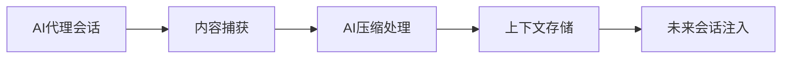

**技术特色**：
- 跨AI代理平台的通用适配器设计
- 智能上下文压缩算法减少冗余信息
- 长期记忆管理机制优化存储效率

#### 热度分析

- 近10万Star且日增600+，项目热度极高且持续攀升
- 8500+ Fork表明开发者社区积极参与和二次开发

#### 快速上手

```bash
# 安装依赖
npm install

# 配置API密钥
export ANTHROPIC_API_KEY="your_key_here"

# 启动服务
npm start
```

#### 注意事项

- 项目许可证未知，使用前需确认授权条款
- 会话内容会被捕获和存储，存在隐私考量
- 可能对特定AI代理版本有兼容性要求


### 5. OpenCut-app/OpenCut — 开源视频剪辑

> **一句话总结**：开源替代CapCut的视频编辑工具，提供专业级剪辑功能与跨平台支持

#### 价值主张

| 维度 | 说明 |
|------|------|
| **解决痛点** | 提供免费开源的视频编辑替代方案，避免商业软件限制与费用 |
| **目标用户** | 内容创作者、短视频制作者、开源爱好者 |
| **核心亮点** | 跨平台支持 + 专业剪辑功能 + 开源可定制 + 无水印导出 |

#### 技术架构

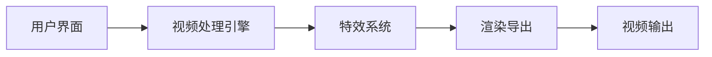

**技术特色**：
- 基于TypeScript构建，保证代码质量与类型安全
- 采用模块化设计，便于功能扩展与维护
- 可能使用WebAssembly提升视频处理性能

#### 热度分析

- 高Star增长率(+512/天)表明项目热度快速上升，用户需求强烈
- 近9千次Fork显示开发者社区积极参与，生态正在形成

#### 快速上手

```bash
# 克隆仓库
git clone https://github.com/OpenCut-app/OpenCut.git

# 安装依赖
npm install

# 启动应用
npm start
```

#### 注意事项

- 项目License未知，商业使用前需确认授权条款
- 作为视频编辑工具，可能需要较高性能的硬件支持
- 项目可能仍处于开发阶段，功能可能不完整或有bug


### 7. tester-army/e2e — 端到端测试框架

> **一句话总结**：新一代端到端测试框架，为Web和移动应用提供高效、简洁的测试解决方案。

#### 价值主张

| 维度 | 说明 |
|------|------|
| **解决痛点** | 解决传统测试工具配置复杂、维护成本高的问题 |
| **目标用户** | Web和移动应用开发团队、质量保障工程师 |
| **核心亮点** | 多端支持+简洁API+智能等待+并行执行+类型安全 |

#### 技术架构

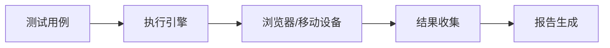

**技术特色**：
- 基于TypeScript构建，提供完整的类型安全
- 支持Web和移动应用的统一测试接口
- 采用声明式测试语法，提高测试可读性

#### 热度分析

- 项目Star数达3,257且单日增长345，表明社区认可度高，发展迅速
- Fork数相对较少(124)，可能表明项目处于早期阶段，尚未形成大规模分支

#### 快速上手

```bash
# 安装
npm install @tester-army/e2e

# 初始化项目
npx e2e init my-app

# 运行测试
npx e2e run
```

#### 注意事项

- 项目许可证未知，商业使用前需确认授权条款
- 项目处于快速发展阶段，API可能存在不稳定变化
- 需要一定的TypeScript基础以充分利用框架特性


### 8. addyosmani/agent-skills — AI编程工程化

> **一句话总结**：提供AI编程代理生产级工程技能，提升代码生成质量与工程实践标准。

#### 价值主张

| 维度 | 说明 |
|------|------|
| **解决痛点** | AI编程代理在实际工程应用中的代码质量与可靠性不足 |
| **目标用户** | AI开发者、软件工程师及AI辅助编程工具使用者 |
| **核心亮点** | 生产级代码标准 + 工程最佳实践 + AI代理能力增强 |

#### 技术架构

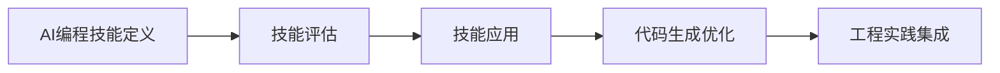

**技术特色**：
- 基于JavaScript的AI编程代理技能库
- 整合前端工程最佳实践与AI能力
- 提供可量化的代码质量评估体系

#### 热度分析

- 项目Star数突破10万，日增300+，显示AI编程领域关注度极高
- 高Star/Fork比例(9.5:1)表明项目被广泛采用而非仅被关注

#### 快速上手

```bash
# 克隆项目
git clone https://github.com/addyosmani/agent-skills.git

# 查看技能文档
cd agent-skills && cat README.md
```

#### 注意事项

- 项目可能需要配合特定AI编程工具使用才能发挥最大价值
- 需要一定的AI和JavaScript基础才能深入理解技能库内容


### 9. calesthio/OpenMontage — AI视频制作系统

> **一句话总结**：首个开源智能代理视频制作系统，提供完整工具链和知识库，将AI助手转变为专业视频工作室。

#### 价值主张

| 维度 | 说明 |
|------|------|
| **解决痛点** | 整合分散的视频制作工具与专业知识，降低专业视频制作门槛 |
| **目标用户** | 内容创作者、视频制作人、AI应用开发者 |
| **核心亮点** | 首个开源智能代理系统 + 12个完整生产流程 + 100+工具集成 + 700+知识文件 |

#### 技术架构


**技术特色**：
- 基于代理的自动化视频生产流程
- 模块化工具集成架构
- 知识驱动的智能决策系统

#### 热度分析

- 项目获得6万多星标且持续增长，表明其在AI视频生成领域具有显著影响力
- 高Fork数和零Open Issues反映项目活跃度高且维护良好

#### 快速上手

```bash
# 安装OpenMontage
pip install openmontage

# 初始化项目
openmontage init my-video-project

# 运行视频生成
openmontage generate --prompt "视频描述"
```

#### 注意事项

- 许可证未知，使用前需确认授权条款
- 项目可能需要较强的计算资源，特别是处理视频时
- 作为新兴项目，API和功能可能仍在快速迭代中


### 10. michael-denyer/pstack-claude — AI代理工作流

> **一句话总结**：统一多种AI模型的代码生成工作流，将Cursor原语适配至不同AI框架。

#### 价值主张

| 维度 | 说明 |
|------|------|
| **解决痛点** | 简化跨AI模型的代码生成流程，解决接口不统一问题 |
| **目标用户** | AI开发者、代码生成工具使用者、多模型集成需求者 |
| **核心亮点** | 多模型支持 + Cursor原语转换 + 严格工作流 + 开源可定制 |

#### 技术架构


**技术特色**：
- 提供Claude、Codex、Pi等多种AI模型的统一接口层
- 将Cursor专有原语转换为通用工作流组件
- 实现严格可定制的代理工作流框架，支持自定义逻辑

#### 热度分析

- 项目Star数1,171且单日增长232，显示近期热度显著上升，反映AI代码生成工具需求激增
- Fork数131，表明社区对项目有较高参与度，具备良好的开源扩展潜力

#### 快速上手

```bash
# 克隆项目
git clone https://github.com/michael-denyer/pstack-claude.git
# 安装依赖
npm install
# 运行示例
npm run example
```

#### 注意事项

- 项目许可证信息不明确，使用前需确认开源协议
- 需配置各AI模型的API密钥才能正常使用
- 不同模型能力存在差异，需针对性调整工作流参数


### 11. antirez/ds4 — 本地AI推理引擎

> **一句话总结**：高效本地运行DeepSeek大模型，支持多平台GPU加速，实现快速AI推理。

#### 价值主张

| 维度 | 说明 |
|------|------|
| **解决痛点** | DeepSeek模型本地化部署，无需云端API调用，降低延迟和隐私风险 |
| **目标用户** | AI开发者、研究人员和企业用户，需要本地化大模型推理 |
| **核心亮点** | 多平台GPU支持 + 高效推理性能 + 低资源占用 + 本地隐私保护 |

#### 技术架构


**技术特色**：
- 跨平台GPU加速支持，适配Metal/CUDA/ROCm
- 高效内存管理和计算优化技术
- 模型量化技术减少资源需求

#### 热度分析

- 项目获得高关注度，Star数超23k，近期增长迅速，显示AI本地化部署需求旺盛
- 作为知名开发者antirez的新项目，社区期待度高，生态潜力大

#### 快速上手

```bash
# 克隆项目
git clone https://github.com/antirez/ds4.git
cd ds4

# 编译项目
make

# 运行模型
./ds4 --model deepseek-4-flash --input "你的输入文本"
```

#### 注意事项

- 项目可能需要较新的GPU硬件支持
- 模型文件可能较大，需要充足的存储空间
- 需要相应的GPU驱动和CUDA/Metal/ROCm环境
- 由于项目没有明确许可证，使用前需确认授权条款


### 12. coreyhaines31/marketingskills — AI营销技能库

> **一句话总结**：为Claude Code和AI代理提供结构化营销技能集合，覆盖CRO、文案、SEO和增长工程。

#### 价值主张

| 维度 | 说明 |
|------|------|
| **解决痛点** | 为AI代理提供系统化营销知识，弥补AI在营销领域的专业能力缺口 |
| **目标用户** | 使用Claude Code的AI开发者和营销自动化工程师 |
| **核心亮点** | 跨领域营销覆盖 + 模块化技能组织 + AI深度集成 + 实用营销技巧 + 持续更新优化 |

#### 技术架构

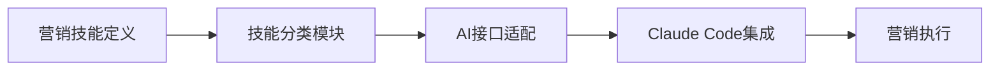

**技术特色**：
- 模块化营销技能结构化组织
- 与AI代理的无缝集成接口设计
- 跨领域营销知识统一管理

#### 热度分析

- 项目获5万+星标且持续增长，显示AI+营销领域热度持续攀升
- 高Fork比例(约15%)反映社区积极参与项目扩展和定制化

#### 快速上手

```bash
# 安装依赖
npm install marketingskills

# 引入营销技能模块
const { copywriting, SEO } = require('marketingskills');

# 使用技能生成内容
const content = copywriting.generateSEOContent("主题", "目标受众");
```

#### 注意事项

- 项目许可证未知，商业使用前需确认授权条款
- 作为营销技能库，可能需要根据具体业务场景进行定制化调整
- 主要面向JavaScript环境，Web和Node.js应用集成较为便捷


### 13. getsentry/sentry — 错误监控平台

> **一句话总结**：开发者优先的错误跟踪与性能监控平台，提供实时错误捕获与诊断能力。

#### 价值主张

| 维度 | 说明 |
|------|------|
| **解决痛点** | 实时捕获、跟踪和解决应用程序错误，提高产品质量和开发效率 |
| **目标用户** | 开发团队、DevOps工程师、技术负责人 |
| **核心亮点** + 实时错误捕获 + 性能监控 + 集成丰富 + 报警系统 + 数据可视化 |

#### 技术架构

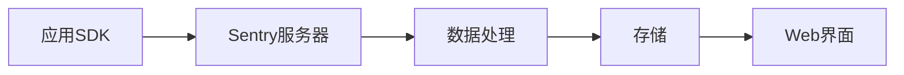

**技术特色**：
- 采用分布式架构支持大规模错误数据收集
- 支持多语言SDK，实现跨平台错误跟踪
- 使用事件驱动架构处理错误数据流
- 提供强大的查询语言进行错误分析
- 支持私有化部署和云端服务

#### 热度分析

- 项目持续获得高关注度，Star数稳定增长，表明其在开发者社区中具有广泛影响力
- 作为开源错误监控领域的领导者，拥有活跃的贡献者社区和丰富的生态系统

#### 快速上手

```bash
# 安装Sentry CLI
pip install sentry-cli

# 初始化项目
sentry-cli init

# 发送测试事件
sentry-cli send-event -m "Hello, Sentry!"
```

#### 注意事项

- Sentry提供免费版和企业版，功能有所差异
- 错误数据可能包含敏感信息，需注意数据隐私和合规性
- 大量错误事件可能产生较高存储成本，需要合理配置保留策略
- 集成Sentry需要一定的学习成本，特别是自定义配置方面


### 14. garrytan/gstack — 全栈工具配置集

> **一句话总结**：23个精选工具配置，覆盖从CEO到QA的全栈开发工作流。

#### 价值主张

| 维度 | 说明 |
|------|------|
| **解决痛点** | 整合分散的开发工具，提供一站式全栈开发解决方案 |
| **目标用户** | 全栈开发者、小型开发团队、创业者 |
| **核心亮点** | 精选工具组合 + 角色化工作流 + 开箱即用配置 |

#### 技术架构

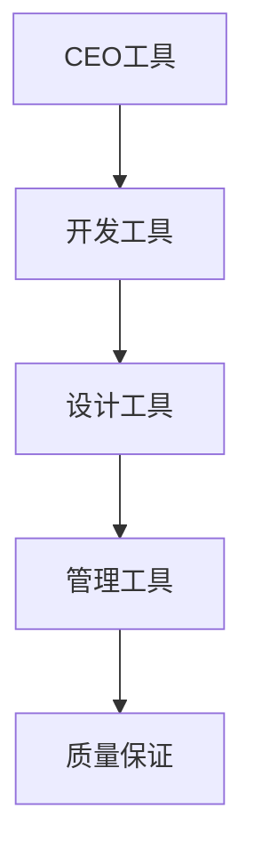

**技术特色**：
- TypeScript配置确保类型安全
- 模块化工具设计便于扩展
- 统一配置简化多环境部署

#### 热度分析

- 高Star数(13.5万+)表明项目获得了广泛认可，近期仍有稳定增长
- 作为工具集项目，其影响力体现在开发者社区中的实际应用和推荐

#### 快速上手

```bash
# 克隆项目
git clone https://github.com/garrytan/gstack.git

# 安装依赖
npm install
```

#### 注意事项
- 需要一定的技术背景才能充分利用所有工具
- 部分工具可能需要额外的订阅或许可
- 根据具体项目需求可能需要调整配置


### 15. earthtojake/text-to-cad — 文本转CAD

> **一句话总结**：通过自然语言描述直接生成CAD模型，实现文本到三维设计的无缝转换。

#### 价值主张

| 维度 | 说明 |
|------|------|
| **解决痛点** | 降低CAD设计门槛，无需专业技能即可创建精确三维模型 |
| **目标用户** | 产品设计师、工程师、建筑师及创意工作者 |
| **核心亮点** | 文本驱动生成 + 多格式输出 + 自动化设计流程 + 参数化控制 |

#### 技术架构

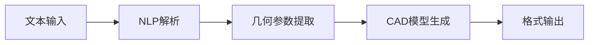

**技术特色**：
- 基于大型语言模型理解设计意图和约束条件
- 将自然语言描述转换为精确的几何参数和拓扑关系
- 支持STL、STEP等多种工业标准格式输出

#### 热度分析
- 近17k星且持续高速增长，日增83星，表明市场需求强劲
- 无开放问题，项目维护稳定，用户反馈积极

#### 快速上手

```bash
# 安装依赖
pip install text-to-cad

# 基本使用
from text_to_cad import TextToCAD
cad_gen = TextToCAD()
model = cad_gen.create("一个10cm直径的球体，中心有5cm直径的孔洞")
model.save("sphere_with_hole.stl")
```

#### 注意事项
- 复杂设计可能需要更详细的文本描述和参数调整
- 输出质量可能取决于描述的精确度和模型的复杂程度


### 16. caddyserver/caddy — 全能HTTP服务器

> **一句话总结**：Caddy是一个快速、可扩展的多平台HTTP/1-2-3服务器，具有自动HTTPS功能，简化了Web服务器部署。

#### 价值主张

| 维度 | 说明 |
|------|------|
| **解决痛点** | 解决传统Web服务器配置复杂、HTTPS证书管理繁琐的问题 |
| **目标用户** | Web开发者、DevOps工程师、中小型企业网站管理员 |
| **核心亮点** | 自动HTTPS证书管理 + 配置简单，使用Caddyfile + 插件系统高度可扩展 |

#### 技术架构

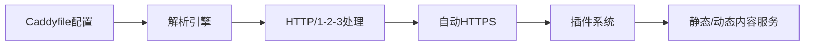

**技术特色**：
- 基于Go语言构建，性能优异且跨平台兼容
- 采用模块化架构，通过插件系统实现功能扩展
- 内置ACME客户端，自动管理Let's Encrypt证书
- 支持HTTP/3，提供更快的连接和传输效率
- 配置即代码，使用声明式Caddyfile简化配置

#### 热度分析

- 项目获得76,606个Star，每日增长约24个，表明社区活跃度高，受开发者青睐
- 作为现代Web服务器，在容器化和云原生环境中占据重要生态位置，是替代Nginx的有力竞争者

#### 快速上手

```bash
# 安装Caddy
curl -sSL https://github.com/caddyserver/caddy/releases/latest/download/caddy_linux_amd64.tar.gz | tar -xzv

# 启动一个简单的Web服务器
./caddy file-server --listen :8080 --root .

# 或者使用Caddyfile配置
echo ":80 {
    root * /var/www
    file_server
}" > Caddyfile
./caddy run --config Caddyfile
```

#### 注意事项

- Caddy的默认配置可能不适合高流量生产环境，需要适当优化
- 虽然配置简单，但高级功能的学习曲线仍然存在
- 某些老旧系统的兼容性可能有限，建议使用较新的操作系统版本


## 今日推荐

| 主题 | 推荐项目 | 亮点 |
|------|----------|------|
| 今日最热 | [DietrichGebert/ponytail](https://github.com/DietrichGebert/ponytail) | Makes your AI age... |
| 值得关注 | [pbakaus/impeccable](https://github.com/pbakaus/impeccable) | The design langua... |
| 快速上手 | [Panniantong/Agent-Reach](https://github.com/Panniantong/Agent-Reach) | Give your AI agen... |
| 长期潜力 | [thedotmack/claude-mem](https://github.com/thedotmack/claude-mem) | Persistent Contex... |

---

<div align="center">

*Generated on 2026-10-05 | Powered by GitHub Trending Reporter*

</div>