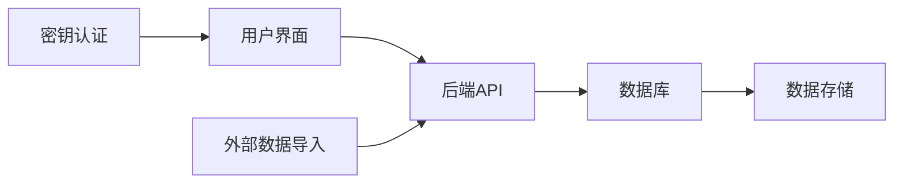
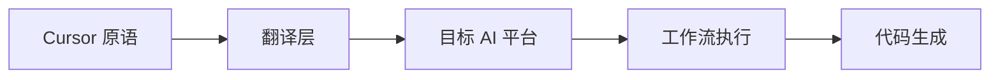
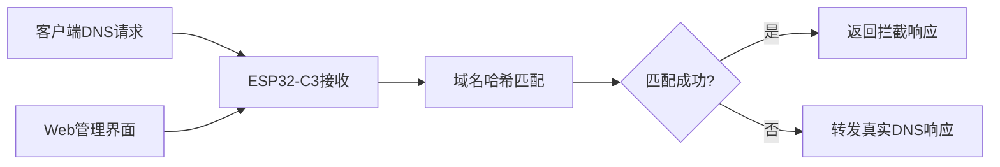
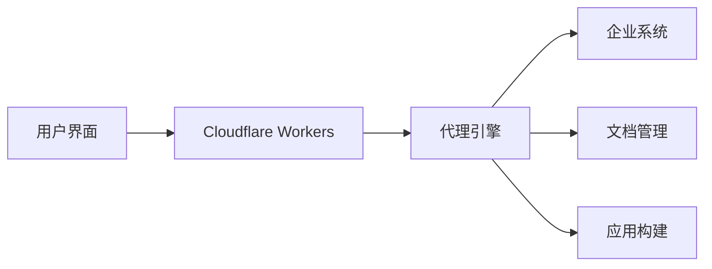

## 今日热点

今日GitHub热榜项目精彩纷呈。

---

## 热门项目一览

| 排名 | 项目 | 语言 | 今日 | 总计 | 简介 |
|:---:|------|:----:|------:|-----:|------|
| 1 | [DuarteSantos8/openGym](https://github.com/DuarteSantos8/openGym) | JavaScript | +1,433 | 4,372 | Self-hosted gym & body-weig... |
| 2 | [tester-army/e2e](https://github.com/tester-army/e2e) | TypeScript | +1,398 | 4,986 | Next generation e2e testing... |
| 3 | [Panniantong/Agent-Reach](https://github.com/Panniantong/Agent-Reach) | Python | +1,155 | 92,013 | Give your AI agent eyes to ... |
| 4 | [boykopovar/AnyPS5](https://github.com/boykopovar/AnyPS5) | C++ | +997 | 5,051 | Tool for automatic PS5 exec... |
| 5 | [msitarzewski/agency-agents](https://github.com/msitarzewski/agency-agents) | Shell | +744 | 157,344 | A complete AI agency at you... |
| 6 | [calesthio/OpenMontage](https://github.com/calesthio/OpenMontage) | Python | +742 | 64,157 | World's first open-source, ... |
| 7 | [thedotmack/claude-mem](https://github.com/thedotmack/claude-mem) | TypeScript | +534 | 96,691 | Persistent Context Across S... |
| 8 | [caddyserver/caddy](https://github.com/caddyserver/caddy) | Go | +515 | 77,205 | Fast and extensible multi-p... |
| 9 | [pingdotgg/t3code](https://github.com/pingdotgg/t3code) | TypeScript | +485 | 25,660 | No description |
| 10 | [earthtojake/text-to-cad](https://github.com/earthtojake/text-to-cad) | Python | +437 | 17,504 | Give your agent CAD superpo... |
| 11 | [michael-denyer/pstack-claude](https://github.com/michael-denyer/pstack-claude) | JavaScript | +223 | 1,448 | Claude Code, Codex, Copilot... |
| 12 | [M-Abozaid/esp32-c3-adblock](https://github.com/M-Abozaid/esp32-c3-adblock) | C++ | +196 | 1,428 | Pi-hole-class DNS ad-blocke... |

---

## 趋势洞察

```
┌─────────────────────────────────────────────────────────────────┐
│  AI/ML 工具         ████████████████████████  9 个项目        │
│  其他               ████████                  3 个项目        │
│  开发框架             ██                        1 个项目        │
│  开发工具             ██                        1 个项目        │
└─────────────────────────────────────────────────────────────────┘
```

---

## 项目深度解读

### 1. DuarteSantos8/openGym — 自托管健身追踪

> **一句话总结**：自托管健身与体重追踪应用，支持训练计划制定、肌肉状态跟踪和数据导入。

#### 价值主张

| 维度 | 说明 |
|------|------|
| **解决痛点** | 解决健身数据隐私问题，提供完全自控的健身追踪体验 |
| **目标用户** | 注重数据隐私的健身爱好者、专业健身人士 |
| **核心亮点** | 自托管部署 + 肌肉状态可视化 + 多应用数据导入 + 密钥登录 |

#### 技术架构



**技术特色**：
- 自托管架构确保数据隐私与安全
- 支持多种健身应用数据导入，兼容性强
- 肌肉状态追踪算法，提供科学训练建议

#### 热度分析

- 项目Star数达4,372，单日新增1,433，显示近期热度快速上升
- 零开放问题表明项目维护良好，用户反馈及时处理

#### 快速上手

```bash
# 克隆项目
git clone https://github.com/DuarteSantos8/openGym.git

# 安装依赖
cd openGym
npm install

# 启动应用
npm start
```

#### 注意事项

- 项目许可证未知，使用前需确认开源协议
- 作为自托管应用，用户需具备基本的部署和维护能力
- 数据导入功能可能需要特定的数据格式要求


### 2. tester-army/e2e — [新一代测试框架]

> **一句话总结**：下一代端到端测试框架，支持Web和移动应用测试，提供更高效、简洁的测试体验。

#### 价值主张

| 维度 | 说明 |
|------|------|
| **解决痛点** | 解决传统E2E测试框架配置复杂、执行速度慢的问题 |
| **目标用户** | Web和移动应用开发团队、QA工程师、测试自动化工程师 |
| **核心亮点** | 简单易用 + 高性能 + 跨平台支持 + 并行执行 + 内置报告功能 |

#### 技术架构


**技术特色**：
- 基于TypeScript开发，提供类型安全和良好的开发体验
- 支持Web和移动应用的端到端测试
- 提供简洁的API，降低学习曲线
- 内置并行执行功能，提高测试效率
- 自动生成详细的测试报告

#### 热度分析

- 近期Star数激增(+1,398 today)，表明项目获得广泛关注，可能是解决了测试领域的关键痛点
- 相对较高的Star/Fork比例(约23.6:1)，说明用户更倾向于使用而非贡献，项目可能处于初期成熟阶段

#### 快速上手

```bash
# 安装
npm install @tester-army/e2e

# 初始化项目
npx @tester-army/e2e init

# 运行测试
npx @tester-army/e2e run
```

#### 注意事项

- 项目许可证信息不明确，使用前需确认开源协议
- 项目为新兴框架，生态系统和社区支持可能不如成熟框架完善
- 由于近期热度激增，API和功能可能仍在快速迭代中，需关注版本更新


### 3. Panniantong/Agent-Reach — AI网络获取工具

> **一句话总结**：一款命令行工具，让AI代理无需API费用即可访问和搜索多个互联网平台信息。

#### 价值主张

| 维度 | 说明 |
|------|------|
| **解决痛点** | 突破AI代理只能基于训练数据的限制，实现实时网络信息获取 |
| **目标用户** | AI开发者、研究人员、需要跨平台数据收集的用户 |
| **核心亮点** | 多平台支持 + 零API费用 + 命令行操作 + 实时数据获取 |

#### 技术架构


**技术特色**：
- 统一的多平台API封装，简化跨平台数据获取
- 智能内容解析，适应不同网站结构变化
- 无需API密钥的替代性数据获取方案

#### 热度分析

- 项目获得超9.2万星，单日新增超1000星，呈现快速增长态势，市场需求强劲
- Fork/Star比例约为1:11.4，表明项目不仅被广泛使用，也被大量用户进行二次开发

#### 快速上手

```bash
# 克隆仓库
git clone https://github.com/Panniantong/Agent-Reach.git
cd Agent-Reach

# 安装依赖
pip install -r requirements.txt
```

#### 注意事项

- 项目可能面临网站反爬机制的限制和结构变化导致的兼容性问题
- 使用时需注意各平台的使用条款，避免违反服务协议
- 长期使用应关注项目维护状态，因为依赖网站结构变化可能影响功能稳定性


### 4. boykopovar/AnyPS5 — PS5移植工具

> **一句话总结**：一款自动化工具，可将PS5游戏可执行文件直接移植至Linux和Windows平台运行。

#### 价值主张

| 维度 | 说明 |
|------|------|
| **解决痛点** | 突破PS5游戏在非索尼平台运行的技术壁垒 |
| **目标用户** | PC游戏玩家、游戏开发者、Linux游戏爱好者 |
| **核心亮点** | 无需源代码 + 自动化移植 + 跨平台支持 + 高效转换 |

#### 技术架构


**技术特色**：
- 基于静态二进制分析技术，无需原始源代码
- 实现PS5系统API到Windows/Linux的映射层
- 可能利用了内存重映射和函数调用转换技术
- 支持复杂的依赖关系和动态库解析

#### 热度分析

- 项目单日增长近1000星，显示游戏社区对PS5移植的强烈需求
- 相对较高的star/fork比例，表明用户认可度高但社区贡献有限

#### 快速上手

```bash
# 克隆项目
git clone https://github.com/boykopovar/AnyPS5.git
cd AnyPS5

# 编译项目
mkdir build && cd build
cmake ..
make

# 使用示例
./anyps5 /path/to/ps5/game/executable
```

#### 注意事项

- 项目许可证未知，使用前需确认法律合规性
- 未经授权移植游戏可能违反版权法，存在法律风险
- 项目尚处早期阶段，可能不支持所有PS5游戏
- 需要一定的技术背景才能正确使用和调试移植结果


### 5. msitarzewski/agency-agents — AI代理系统

> **一句话总结**：提供多种专业AI角色，一键部署完整的AI代理团队，满足各类任务需求。

#### 价值主张

| 维度 | 说明 |
|------|------|
| **解决痛点** | AI工具零散、难以协同，缺乏统一管理平台 |
| **目标用户** | 开发者、内容创作者、营销人员和管理者 |
| **核心亮点** | 多种专业AI角色 + 个性化和流程化 + 一键部署 + 无缝协作 + 专业可交付成果 |

#### 技术架构


**技术特色**：
- Shell脚本实现，轻量级部署
- 模块化设计，每个代理独立功能
- 命令行界面，易于集成和自动化

#### 热度分析

- 项目获得超过15万星，日均增长700+，显示其高实用性和受欢迎程度
- 无开放问题表明项目成熟稳定，社区维护良好

#### 快速上手

```bash
git clone https://github.com/msitarzewski/agency-agents.git
cd agency-agents
./run-agent.sh [agent-name] [parameters]
```

#### 注意事项

- 需要Shell环境支持
- 可能需要配置API密钥或外部服务
- 不同代理可能有不同的依赖要求


### 6. calesthio/OpenMontage — AI视频生产系统

> **一句话总结**：开源AI代理视频制作系统，集成12条生产流程，将AI助手转变为完整视频工作室。

#### 价值主张

| 维度 | 说明 |
|------|------|
| **解决痛点** | 传统视频制作专业门槛高、流程复杂、成本昂贵 |
| **目标用户** | 内容创作者、视频制作人、营销团队、独立开发者 |
| **核心亮点** | AI自动化生产流程 + 100+专业工具 + 700+代理技能文件 + 全流程覆盖 + 开源可定制 |

#### 技术架构


**技术特色**：
- 基于代理的AI工作流系统，模拟专业视频制作团队协作
- 模块化工具链设计，支持100+专业工具的智能调度
- 知识图谱驱动的700+代理技能文件，确保专业质量

#### 热度分析

- 项目获得超过64k星，近期增长强劲（单日新增742星），表明市场高度认可
- 8k+的Fork数量反映社区活跃度高，用户二次开发和定制意愿强烈

#### 快速上手

```bash
# 克隆项目
git clone https://github.com/calesthio/OpenMontage.git
cd OpenMontage

# 安装依赖并运行
pip install -r requirements.txt
python main.py --help
```

#### 注意事项

- 项目可能需要较强的计算资源，特别是处理高质量视频时
- 需要一定的AI和视频制作基础知识，以充分利用系统功能
- 作为新兴技术，某些功能可能仍在实验阶段，稳定性有待验证


### 7. thedotmack/claude-mem — AI记忆增强

> **一句话总结**：为AI代理提供跨会话持久化上下文记忆，通过AI压缩技术实现智能上下文注入。

#### 价值主张

| 维度 | 说明 |
|------|------|
| **解决痛点** | AI代理缺乏长期记忆能力，无法在会话间保持上下文连贯性 |
| **目标用户** | 使用AI编程辅助工具的开发者和研究人员 |
| **核心亮点** | 跨会话持久化记忆 + AI压缩技术 + 多平台兼容性 + 智能上下文注入 |

#### 技术架构


**技术特色**：
- 基于AI的上下文压缩技术，有效减少冗余信息
- 多平台兼容架构，支持主流AI编程辅助工具
- 智能上下文提取算法，确保相关性高的内容被保留

#### 热度分析

- 项目获得96,691个星标，近期增长迅速（单日新增534），表明开发者社区对AI记忆增强功能需求强烈
- 作为AI辅助编程工具生态中的重要组件，处于快速增长阶段，Fork数达8,531显示社区积极参与贡献

#### 快速上手

```bash
# 安装claude-mem
npm install -g claude-mem

# 初始化配置
claude-mem init

# 启动记忆服务
claude-mem start
```

#### 注意事项

- 需要注意数据隐私问题，因为项目会捕获和存储AI代理的交互数据
- 可能会对AI代理的性能产生一定影响，因为需要处理额外的上下文注入逻辑
- 需要确保与使用的AI编程工具兼容，不同工具可能有不同的集成方式


### 8. caddyserver/caddy — 自动HTTPS服务器

> **一句话总结**：一款快速、可扩展的多平台HTTP/1-2-3 web服务器，内置自动HTTPS和证书管理功能。

#### 价值主张

| 维度 | 说明 |
|------|------|
| **解决痛点** | 简化Web服务器配置，消除HTTPS证书管理复杂性 |
| **目标用户** | 开发者、DevOps工程师、中小型网站运维 |
| **核心亮点** | 自动HTTPS + 插件架构 + 零配置启动 + 声明式配置 |

#### 技术架构


**技术特色**：
- 基于Go语言构建，性能优异且跨平台支持良好
- 插件化架构设计，高度可扩展，支持动态加载
- 内置自动ACME证书管理和HTTPS配置
- 支持最新的HTTP/3协议和QUIC传输

#### 热度分析

- 项目Star数超7.7万，日均新增500+，增长势头强劲
- 作为现代Web服务器领域的创新者，在易用性和自动化方面领先传统服务器

#### 快速上手

```bash
# 安装Caddy
sudo apt install caddy  # Debian/Ubuntu

# 创建简单网站
mkdir -p ~/my-site
echo "Hello Caddy!" > ~/my-site/index.html

# 配置并启动
echo ":8080 {
    root * ~/my-site
    file_server
}" | sudo tee /etc/caddy/Caddyfile

sudo caddy run --config /etc/caddy/Caddyfile
```

#### 注意事项

- Caddy默认配置可能不适合高流量生产环境，需适当调优
- 插件生态虽然丰富，但某些小众功能可能不如成熟解决方案稳定
- 相比Nginx，在复杂负载均衡和高并发场景下功能可能不够完善


### 9. pingdotgg/t3code — TypeScript 全栈框架

> **一句话总结**：提供端到端类型安全的现代化全栈开发解决方案，简化 TypeScript 应用构建。

#### 价值主张

| 维度 | 说明 |
|------|------|
| **解决痛点** | 解决全栈开发中类型不一致、配置繁琐的问题 |
| **目标用户** | TypeScript 开发者，追求类型安全和高效开发的全栈工程师 |
| **核心亮点** | 全栈类型安全 + 零配置启动 + 内置最佳实践 + 可扩展架构 + 现代化工具链 |

#### 技术架构


**技术特色**：
- 基于 Next.js 13+ 的 App Router 构建全栈应用
- 提供统一的类型系统，确保前后端数据一致性
- 集成 Prisma、tRPC 等现代工具，简化开发流程

#### 热度分析

- 项目 Star 数超过 25k 且持续快速增长，社区认可度高
- Fork 数与 Star 比例健康，表明项目具有良好的可扩展性和实用性

#### 快速上手

```bash
# 创建新项目
npx create-t3-app@latest my-app

# 安装依赖
cd my-app
npm install

# 启动开发服务器
npm run dev
```

#### 注意事项
- 需要一定的 TypeScript 和 Next.js 基础
- 框架遵循一定约定，可能需要时间适应
- 部分高级功能可能需要额外配置和学习


### 10. earthtojake/text-to-cad — 文本转CAD工具

> **一句话总结**：通过自然语言描述直接生成CAD模型，赋予AI代理设计能力。

#### 价值主张

| 维度 | 说明 |
|------|------|
| **解决痛点** | 降低CAD设计门槛，无需专业技能即可生成3D模型 |
| **目标用户** | 设计师、工程师、AI开发者及需要快速原型构建者 |
| **核心亮点** | 自然语言驱动建模 + 参数化设计 + 多格式输出 + 自动化设计流程 |

#### 技术架构


**技术特色**：
- 结合NLP与几何建模技术
- 支持参数化设计与约束
- 可扩展的组件化架构

#### 热度分析

- 项目增长迅猛，日增437星反映强烈市场需求
- 高Fork/Star比例表明社区积极参与二次开发

#### 快速上手

```bash
# 安装
pip install text-to-cad

# 基本使用
from text_to_cad import TextToCad
ttc = TextToCad()
model = ttc.create("10x10x10立方体")
model.export("model.step")
```

#### 注意事项

- 复杂几何体可能需要详细文本描述
- 输出格式兼容性可能有限
- 需要适当硬件资源支持AI模型运行


### 11. michael-denyer/pstack-claude — AI助手工作流

> **一句话总结**：将 Cursor 原语翻译到多个 AI 编程助手的严格工作流工具，支持 Claude、Copilot 等多种平台。

#### 价值主张

| 维度 | 说明 |
|------|------|
| **解决痛点** | 解决 AI 编程助手工具碎片化，提供统一工作流体验 |
| **目标用户** | 需要跨多个 AI 编程助手进行开发工作的开发者 |
| **核心亮点** | + 多 AI 平台适配 + Cursor 原语翻译 + 严格工作流执行 |

#### 技术架构



**技术特色**：
- 多平台 AI 助手适配技术
- 原语翻译与映射机制
- 工作流执行引擎

#### 热度分析
- 项目近期增长迅速，单日新增 223 stars，表明社区关注度较高
- Fork 数量相对较少，说明项目可能处于早期阶段或使用方式较为专一

#### 快速上手

```bash
# 安装 pstack-claude
npm install -g pstack-claude

# 初始化配置
pstack-claude init
```

#### 注意事项
- 项目 License 不明确，需注意使用权限限制
- 可能需要多个 AI 助手的 API 密钥
- 项目文档可能不够完善，需要自行探索


### 12. M-Abozaid/esp32-c3-adblock — 微型DNS广告拦截器

> **一句话总结**：基于ESP32-C3的低成本DNS广告拦截方案，537k域名存储，无需PSRAM，支持Web管理界面。

#### 价值主张

| 维度 | 说明 |
|------|------|
| **解决痛点** | 提供极低成本硬件实现的DNS广告拦截方案，替代传统Pi-hole |
| **目标用户** | 预算有限但需要网络广告过滤的个人和小型网络用户 |
| **核心亮点** | 2美元硬件成本 + 537k域名过滤能力 + 无需PSRAM + Web管理界面 |

#### 技术架构



**技术特色**：
- 使用40位FNV-1a哈希算法高效存储域名数据库
- 二分搜索算法快速匹配域名，提高拦截效率
- 资源优化设计，在无PSRAM的ESP32-C3上运行537k域名过滤

#### 热度分析

- 项目获得1428个Star，单日增长196，表明社区对该低成本广告拦截方案高度关注
- 相比传统Pi-hole方案，该硬件成本极低但功能完整，适合预算受限用户

#### 快速上手

```bash
# 克隆项目
git clone https://github.com/M-Abozaid/esp32-c3-adblock.git
# 安装依赖
cd esp32-c3-adblock && pip install -r requirements.txt
# 配置并编译
make menuconfig && make
```

#### 注意事项

- 项目未明确说明许可证，使用前需确认法律合规性
- ESP32-C3处理能力有限，在高流量网络环境下可能存在性能瓶颈
- 域名数据库需要定期更新以保持广告拦截效果


### 13. Stremio/stremio-web — 媒体聚合平台

> **一句话总结**：开源媒体中心，聚合多源内容，提供统一观影体验。

#### 价值主张

| 维度 | 说明 |
|------|------|
| **解决痛点** | 整合分散媒体资源，简化多平台内容获取与管理 |
| **目标用户** | 追求便捷观影体验的媒体爱好者，内容收藏家 |
| **核心亮点** | 跨平台支持 + 附加组件生态 + 内容发现 + 个人库管理 |

#### 技术架构


**技术特色**：
- 基于 React 的组件化前端架构，确保高性能UI渲染
- 模块化附加组件系统，支持第三方扩展开发
- 响应式设计，适配多设备屏幕尺寸

#### 热度分析

- Star 数量稳定增长，日均新增约100颗星，社区认可度高
- Fork 数量相对较少，表明项目主要贡献模式为直接PR而非分支开发
- Issues 数量为0，可能表示问题管理渠道或社区沟通方式特殊

#### 快速上手

```bash
# 克隆项目
git clone https://github.com/Stremio/stremio-web.git

# 安装依赖
cd stremio-web
npm install

# 启动开发服务器
npm start
```

#### 注意事项
- 需注意项目使用的数据源合法性，部分附加组件可能涉及版权问题
- 项目依赖较新的 Node.js 版本，请确保环境兼容性
- 开发文档可能需要参考主仓库 stremio/stremio 以获取完整信息


### 14. cloudflare/cloudflare-os — 智能云工作空间

> **一句话总结**：基于Cloudflare Workers的智能代理工作空间，提供文档创建、应用构建和代理运行功能。

#### 价值主张

| 维度 | 说明 |
|------|------|
| **解决痛点** | 提供统一的云端工作空间，整合文档、应用和代理功能，简化企业数字化工作流程 |
| **目标用户** | 企业开发者、内容创作者、需要集成公司系统的技术团队 |
| **核心亮点** | 基于Cloudflare Workers + 智能代理能力 + 企业系统集成 + 开放平台架构 |

#### 技术架构



**技术特色**：
- 基于Cloudflare Workers的边缘计算架构，提供低延迟服务
- 智能代理引擎，能够理解上下文并执行任务
- 开放平台架构，支持与企业现有系统集成

#### 热度分析

- Star数量超过11,000且持续增长，表明项目受到广泛关注和认可
- Fork数1,313显示社区活跃度高，可能被许多团队用于二次开发或内部集成

#### 快速上手

```bash
# 安装Cloudflare CLI
npm install -g wrangler

# 创建新项目
npx create-cloudflare@latest cloudflare-os

# 部署到Cloudflare Workers
wrangler deploy
```

#### 注意事项

- 项目需要Cloudflare账户和Workers订阅
- 可能需要额外配置才能连接企业系统
- TypeScript知识对于开发和定制是必要的
- 许可证信息不明确，使用前应确认开源协议


## 今日推荐

| 主题 | 推荐项目 | 亮点 |
|------|----------|------|
| 今日最热 | [DuarteSantos8/openGym](https://github.com/DuarteSantos8/openGym) | Self-hosted gym &... |
| 值得关注 | [tester-army/e2e](https://github.com/tester-army/e2e) | Next generation e... |
| 快速上手 | [Panniantong/Agent-Reach](https://github.com/Panniantong/Agent-Reach) | Give your AI agen... |
| 长期潜力 | [boykopovar/AnyPS5](https://github.com/boykopovar/AnyPS5) | Tool for automati... |

---

<div align="center">

*Generated on 2026-10-06 | Powered by GitHub Trending Reporter*

</div>